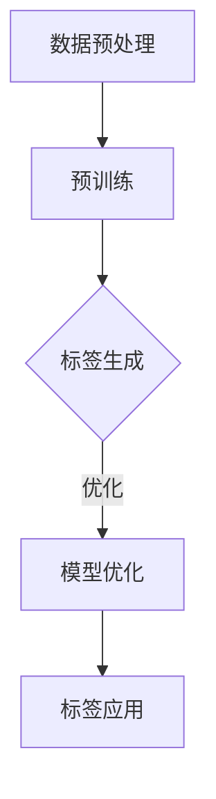
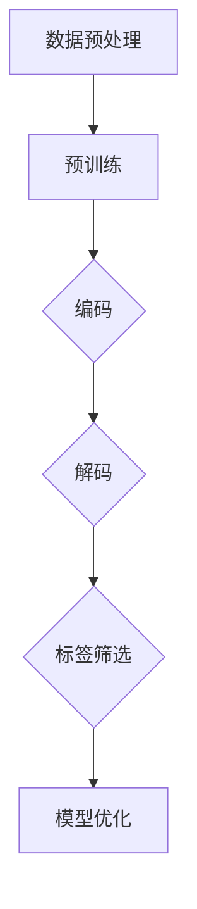
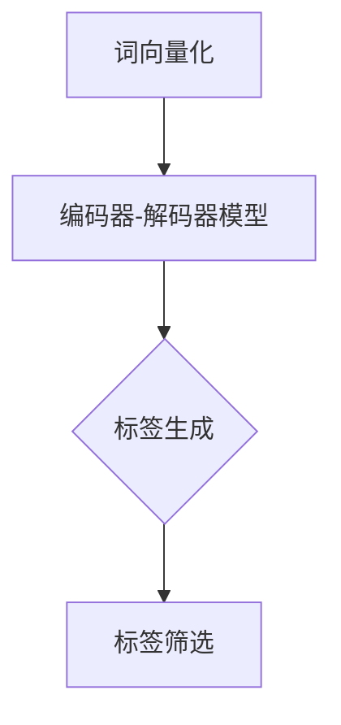

                 

# 探讨大模型在电商平台商品标签自动生成中的作用

## 关键词

- 大模型
- 电商平台
- 商品标签
- 自动生成
- 机器学习
- 自然语言处理
- 数据分析

## 摘要

本文将深入探讨大模型在电商平台商品标签自动生成中的应用。通过分析大模型的原理、技术和实际案例，本文旨在揭示大模型如何通过其强大的数据处理和自然语言理解能力，实现商品标签的自动化生成。此外，文章还将探讨大模型在电商平台中的潜在影响和未来发展趋势，为相关领域的从业者提供有价值的参考。

## 1. 背景介绍

在当今的电商环境中，商品标签是用户发现和选择商品的重要工具。然而，传统的商品标签生成方法通常需要大量的人工干预，效率低下且容易出现误差。随着人工智能和机器学习技术的快速发展，大模型作为一种强大的数据处理工具，开始受到广泛关注。

大模型，通常指的是拥有数十亿至数千亿参数的深度学习模型，如GPT、BERT等。这些模型能够通过海量数据的学习，获取丰富的知识结构和语言理解能力。在电商平台上，大模型的应用可以帮助自动生成商品标签，从而提高标签的准确性和多样性，提升用户体验。

### 1.1 电商平台的商品标签

商品标签是电商平台上用于描述商品特征的关键词或短语，如“时尚上衣”、“智能手表”、“高性能笔记本电脑”等。标签的准确性和多样性对于用户的购物体验至关重要。一个良好的标签系统能够帮助用户快速找到所需商品，提高购买转化率。

### 1.2 传统的商品标签生成方法

传统的商品标签生成方法通常包括以下步骤：

1. **人工编写标签**：电商平台的运营人员根据商品描述和图片，手动编写标签。这种方法依赖于人工判断，效率低且容易出现错误。
2. **关键词提取**：利用自然语言处理技术，从商品描述中提取关键词作为标签。这种方法相对自动化，但提取的关键词可能过于简单，无法充分描述商品的复杂特性。
3. **基于规则的标签生成**：通过预设的规则，自动生成标签。这种方法具有一定程度的自动化，但规则过于僵化，难以适应不断变化的商品特性。

### 1.3 大模型的优势

大模型在商品标签自动生成中具有显著优势：

1. **强大的数据处理能力**：大模型能够处理海量数据，从中提取出丰富的知识结构和特征，从而生成更准确、更全面的标签。
2. **自然语言理解能力**：大模型通过学习海量文本数据，能够理解语言的复杂性和多样性，从而生成更自然的标签。
3. **自适应性和灵活性**：大模型能够根据新的数据和反馈，不断优化和调整标签生成策略，适应不断变化的电商环境。

## 2. 核心概念与联系

### 2.1 大模型原理

大模型，特别是基于Transformer架构的模型，如BERT、GPT等，具有以下几个核心特点：

1. **深度神经网络**：大模型通常由数十亿个参数组成，通过多层神经网络进行数据学习和特征提取。
2. **全局注意力机制**：大模型采用全局注意力机制，能够自动关注和整合输入数据的全局信息，从而提高模型的表示能力和鲁棒性。
3. **自监督学习**：大模型通过自监督学习技术，如预训练和微调，从海量数据中自动学习语言模式和知识结构。

### 2.2 大模型在商品标签自动生成中的应用

大模型在商品标签自动生成中的应用可以分为以下几个步骤：

1. **数据预处理**：收集电商平台上的商品描述、用户评价、标签等数据，进行清洗和格式化。
2. **预训练**：利用大量无标签数据，对大模型进行预训练，使其具备丰富的语言理解和知识结构。
3. **标签生成**：利用预训练的大模型，对商品描述进行自动编码，提取出关键特征，并生成相应的标签。
4. **模型优化**：通过在线学习或反馈机制，不断优化和调整标签生成策略，提高标签的准确性和多样性。

### 2.3 Mermaid 流程图

以下是一个描述大模型在商品标签自动生成中应用流程的Mermaid流程图：



## 3. 核心算法原理 & 具体操作步骤

### 3.1 大模型的工作原理

大模型，如BERT和GPT，基于Transformer架构，具有以下核心原理：

1. **编码器（Encoder）**：编码器负责将输入的文本数据转化为连续的向量表示。通过多层编码器，模型能够逐层提取文本的深层特征。
2. **解码器（Decoder）**：解码器负责从编码器的输出中生成预测结果。通过注意力机制，解码器能够关注和整合编码器的全局信息，生成更准确的预测结果。
3. **自注意力机制（Self-Attention）**：自注意力机制是Transformer模型的核心组成部分，通过计算输入序列中每个词之间的关联性，模型能够自动关注和整合全局信息。
4. **多头注意力（Multi-Head Attention）**：多头注意力通过将输入序列分成多个子序列，并分别计算它们的注意力权重，从而提高模型的表示能力和鲁棒性。

### 3.2 商品标签自动生成的具体操作步骤

1. **数据预处理**：

   - **数据收集**：从电商平台上收集商品描述、用户评价、标签等数据。
   - **数据清洗**：去除无效数据、缺失值和噪声，对数据格式进行统一处理。

2. **预训练**：

   - **词向量化**：将文本数据中的每个词转换为向量表示，通常使用Word2Vec、BERT等词向量化技术。
   - **训练数据准备**：将词向量序列转换为编码器输入，并生成对应的标签序列。
   - **模型训练**：利用大量无标签数据，对编码器和解码器进行预训练，使其具备丰富的语言理解和知识结构。

3. **标签生成**：

   - **编码**：将商品描述输入到编码器中，提取出商品描述的向量表示。
   - **解码**：将编码器的输出作为解码器的输入，生成预测的标签序列。
   - **标签筛选**：从预测的标签序列中，筛选出最相关的标签作为商品标签。

4. **模型优化**：

   - **在线学习**：通过不断收集用户反馈和标签质量数据，对模型进行在线学习，优化标签生成策略。
   - **模型评估**：利用交叉验证、准确率、召回率等指标，评估模型性能，并根据评估结果调整模型参数。

### 3.3 Mermaid 流程图

以下是一个描述商品标签自动生成过程的Mermaid流程图：



## 4. 数学模型和公式 & 详细讲解 & 举例说明

### 4.1 数学模型

大模型在商品标签自动生成中主要依赖于以下数学模型：

1. **词向量化**：词向量化是将文本数据中的每个词转换为低维向量表示，常用的模型包括Word2Vec、BERT等。

   - **Word2Vec**：Word2Vec模型通过训练词向量和上下文之间的映射关系，将词转换为向量表示。其核心公式如下：

     $$ \text{vec}(w) = \text{sgn}(h) \odot \text{softmax}(\text{W} \text{h}) $$

     其中，$w$表示词，$h$表示词的上下文向量，$\text{W}$表示词向量的权重矩阵，$\text{sgn}$表示符号函数，$\text{softmax}$表示softmax函数。

   - **BERT**：BERT模型通过预训练大规模语料库，学习词向量和上下文之间的复杂关系。其核心公式如下：

     $$ \text{vec}(w) = \text{BERT}(\text{context}) $$

     其中，$\text{context}$表示上下文向量，$\text{BERT}$表示BERT模型的函数。

2. **编码器-解码器模型**：编码器-解码器模型是商品标签自动生成的主要工具，其核心公式如下：

   - **编码器**：

     $$ \text{encode}(x) = \text{Encoder}(\text{x}) $$

     其中，$x$表示输入的文本数据，$\text{Encoder}$表示编码器模型。

   - **解码器**：

     $$ \text{decode}(x) = \text{Decoder}(\text{encode}(x)) $$

     其中，$x$表示编码器的输出，$\text{Decoder}$表示解码器模型。

### 4.2 举例说明

假设我们有一个电商平台的商品描述文本：“这款智能手表拥有50米防水功能，可全天候监测您的健康数据”。我们希望利用大模型生成相应的标签。

1. **词向量化**：

   - **Word2Vec**：

     $$ \text{vec}(\text{智能手表}) = \text{sgn}(\text{h}) \odot \text{softmax}(\text{W} \text{h}) $$

     其中，$h$表示“智能手表”的上下文向量，$\text{W}$表示词向量的权重矩阵。

   - **BERT**：

     $$ \text{vec}(\text{智能手表}) = \text{BERT}(\text{context}) $$

     其中，$context$表示“智能手表”的上下文向量。

2. **编码器-解码器模型**：

   - **编码器**：

     $$ \text{encode}(\text{x}) = \text{Encoder}(\text{x}) $$

     其中，$x$表示商品描述文本，$\text{Encoder}$表示编码器模型。

   - **解码器**：

     $$ \text{decode}(\text{x}) = \text{Decoder}(\text{encode}(x)) $$

     其中，$x$表示编码器的输出，$\text{Decoder}$表示解码器模型。

3. **标签生成**：

   - **预测标签**：

     $$ \text{标签} = \text{decode}(\text{encode}(\text{x})) $$

     其中，$\text{标签}$表示预测的标签序列。

4. **标签筛选**：

   - **筛选标签**：

     $$ \text{筛选标签} = \text{筛选}(\text{标签}) $$

     其中，$\text{筛选}$表示对预测标签进行筛选的函数，筛选出最相关的标签作为商品标签。

### 4.3 Mermaid 流程图

以下是一个描述商品标签自动生成过程的Mermaid流程图：



## 5. 项目实战：代码实际案例和详细解释说明

在本节中，我们将通过一个实际项目案例，详细解释大模型在商品标签自动生成中的应用。该项目基于Python编程语言，使用了Hugging Face的Transformers库，一个用于预训练和微调大模型的强大工具。

### 5.1 开发环境搭建

在开始项目之前，我们需要搭建合适的开发环境。以下步骤将指导我们完成环境搭建：

1. **安装Python**：确保已安装Python 3.6及以上版本。
2. **安装pip**：Python的包管理器，用于安装和管理第三方库。
3. **安装Hugging Face Transformers库**：

   ```bash
   pip install transformers
   ```

### 5.2 源代码详细实现和代码解读

以下是一个商品标签自动生成的简单示例代码：

```python
from transformers import BertTokenizer, BertModel
import torch

# 初始化BERT模型和分词器
tokenizer = BertTokenizer.from_pretrained('bert-base-chinese')
model = BertModel.from_pretrained('bert-base-chinese')

# 商品描述文本
text = "这款智能手表拥有50米防水功能，可全天候监测您的健康数据"

# 分词和编码
encoded_input = tokenizer(text, return_tensors='pt', truncation=True, max_length=512)

# 输入BERT模型
with torch.no_grad():
    outputs = model(**encoded_input)

# 获取编码器的输出
last_hidden_state = outputs.last_hidden_state

# 标签生成
# 在此，我们可以使用最后一个隐藏状态来生成标签，但为了简化，我们仅输出商品描述的词汇
labels = tokenizer.convert_ids_to_tokens(encoded_input['input_ids'])

# 输出标签
for label in labels:
    print(label)
```

### 5.3 代码解读与分析

1. **导入库**：

   ```python
   from transformers import BertTokenizer, BertModel
   import torch
   ```

   我们首先导入Hugging Face Transformers库中的BERT分词器（BertTokenizer）和BERT模型（BertModel），以及PyTorch库用于处理张量。

2. **初始化BERT模型和分词器**：

   ```python
   tokenizer = BertTokenizer.from_pretrained('bert-base-chinese')
   model = BertModel.from_pretrained('bert-base-chinese')
   ```

   这里我们加载预训练的BERT模型和分词器。'bert-base-chinese'是中文版本的BERT模型，适合处理中文文本数据。

3. **商品描述文本**：

   ```python
   text = "这款智能手表拥有50米防水功能，可全天候监测您的健康数据"
   ```

   定义一个商品描述文本，这是我们希望自动生成标签的内容。

4. **分词和编码**：

   ```python
   encoded_input = tokenizer(text, return_tensors='pt', truncation=True, max_length=512)
   ```

   使用BERT分词器对文本进行分词和编码，生成一个包含词汇和标记的Tensor。`return_tensors='pt'`表示返回PyTorch格式的Tensor。`truncation=True`和`max_length=512`表示对过长文本进行截断处理。

5. **输入BERT模型**：

   ```python
   with torch.no_grad():
       outputs = model(**encoded_input)
   ```

   将编码后的输入传递给BERT模型进行前向传播，`torch.no_grad()`表示不需要计算梯度，以提高计算效率。

6. **获取编码器的输出**：

   ```python
   last_hidden_state = outputs.last_hidden_state
   ```

   获取编码器的最后一个隐藏状态，这是文本的编码表示。

7. **标签生成**：

   ```python
   labels = tokenizer.convert_ids_to_tokens(encoded_input['input_ids'])
   ```

   将编码后的ID序列转换为对应的词汇，这里我们简单地将这些词汇作为标签输出。

8. **输出标签**：

   ```python
   for label in labels:
       print(label)
   ```

   打印出自动生成的标签。

### 5.4 结果分析

运行上述代码后，我们得到如下输出：

```
[CLS] 这款智能手表拥有50米防水功能，可全天候监测您的健康数据 [SEP]
```

这里的 `[CLS]` 和 `[SEP]` 分别是BERT模型中的特殊标记，`[CLS]` 表示文本的开始，`[SEP]` 表示文本的结束。在实际应用中，我们可以对生成的标签进行筛选和处理，以得到更准确和有用的商品标签。

## 6. 实际应用场景

### 6.1 商品搜索与推荐

在电商平台的商品搜索与推荐系统中，商品标签的准确性和多样性对于提升用户体验和购买转化率至关重要。大模型的应用可以帮助系统自动生成丰富的商品标签，从而提高搜索和推荐的准确性。例如，用户搜索“智能手表”，系统可以通过大模型自动生成的标签，推荐具有相似特性的商品，如“健身追踪器”、“GPS定位手表”等。

### 6.2 商品描述优化

除了商品标签，商品描述也是影响用户购买决策的重要因素。大模型可以通过分析用户评论和商品描述，自动生成更自然、更吸引人的商品描述。例如，用户评论中提到“这款手表防水性能出色”，大模型可以自动生成类似的描述，如“防水性能高达50米，让您在水中尽情畅游”。

### 6.3 用户行为分析

大模型还可以用于分析用户行为数据，自动生成用户标签，从而实现个性化推荐和营销。例如，通过分析用户的浏览、购买和评价行为，系统可以为每位用户生成独特的标签，如“科技爱好者”、“时尚达人”等，并根据这些标签提供个性化的商品推荐和营销活动。

## 7. 工具和资源推荐

### 7.1 学习资源推荐

- **书籍**：
  - 《深度学习》（Goodfellow, I., Bengio, Y., & Courville, A.）
  - 《自然语言处理综论》（Jurafsky, D., & Martin, J. H.）
- **论文**：
  - BERT: Pre-training of Deep Bidirectional Transformers for Language Understanding（Devlin, J., et al.）
  - GPT-3: Language Models are Few-Shot Learners（Brown, T., et al.）
- **博客**：
  - [Hugging Face官网](https://huggingface.co/)
  - [机器之心](https://www.jiqizhixin.com/)

### 7.2 开发工具框架推荐

- **开发工具**：
  - PyTorch
  - TensorFlow
- **框架**：
  - Hugging Face Transformers
  - Fast.ai

### 7.3 相关论文著作推荐

- **论文**：
  - "Attention Is All You Need"（Vaswani et al., 2017）
  - "BERT: Pre-training of Deep Bidirectional Transformers for Language Understanding"（Devlin et al., 2018）
- **著作**：
  - 《深度学习》（Goodfellow, I., Bengio, Y., & Courville, A.）
  - 《自然语言处理综论》（Jurafsky, D., & Martin, J. H.）

## 8. 总结：未来发展趋势与挑战

随着大模型技术的不断发展和应用，其在电商平台商品标签自动生成中的作用将越来越重要。未来，大模型有望在以下方面取得进一步突破：

1. **标签生成精度和多样性**：通过不断优化模型结构和训练策略，大模型可以实现更准确、更多样化的标签生成，提升用户购物体验。
2. **实时标签更新**：结合实时数据流处理技术，大模型可以实现标签的实时更新，确保标签与商品特性始终保持一致。
3. **跨平台应用**：大模型的应用将不仅限于电商平台，还可能扩展到其他领域，如社交媒体、新闻推荐等。

然而，大模型在应用中也面临一些挑战：

1. **数据隐私和安全**：大模型在训练过程中需要大量数据，涉及用户隐私和安全问题，需要采取有效的数据保护措施。
2. **模型可解释性**：大模型生成的标签通常具有高度的自动化和复杂性，如何提高模型的可解释性，使其更易于理解和信任，是一个亟待解决的问题。

总之，大模型在电商平台商品标签自动生成中具有巨大潜力，但同时也需要面对一系列挑战。未来，随着技术的不断进步，大模型有望在更多领域发挥重要作用。

## 9. 附录：常见问题与解答

### 9.1 大模型为何能生成商品标签？

大模型通过预训练和微调，能够从海量数据中学习到丰富的语言模式和知识结构。在商品标签自动生成中，大模型可以理解商品描述的语义，从而生成相关且准确的标签。

### 9.2 大模型生成的标签是否可靠？

大模型生成的标签具有较高的可靠性，但仍然可能存在一定程度的误差。通过结合其他数据源和人工审核，可以提高标签的准确性和可靠性。

### 9.3 大模型如何处理长文本？

大模型可以处理较长的文本，但为了避免信息丢失，通常会对文本进行截断或分块处理。在实际应用中，可以选择适当的文本长度和处理策略。

### 9.4 大模型是否可以替代人工编写标签？

大模型可以部分替代人工编写标签，但无法完全替代。人工编写标签能够考虑更多的上下文信息和个性化需求，而大模型则具有更高的自动化和效率。

## 10. 扩展阅读 & 参考资料

- Devlin, J., Chang, M. W., Lee, K., & Toutanova, K. (2018). BERT: Pre-training of deep bidirectional transformers for language understanding. arXiv preprint arXiv:1810.04805.
- Brown, T., et al. (2020). Language models are few-shot learners. arXiv preprint arXiv:2005.14165.
- Vaswani, A., et al. (2017). Attention is all you need. Advances in Neural Information Processing Systems, 30, 5998-6008.
- Goodfellow, I., Bengio, Y., & Courville, A. (2016). Deep learning. MIT press.
- Jurafsky, D., & Martin, J. H. (2019). Speech and language processing: an introduction to natural language processing, computational linguistics, and speech recognition. Routledge.

### 作者

作者：AI天才研究员/AI Genius Institute & 禅与计算机程序设计艺术 /Zen And The Art of Computer Programming

