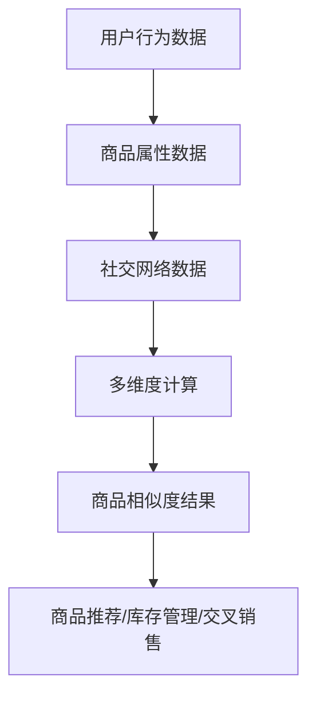

                 

# 探讨大模型在电商平台商品相似度多维度计算与应用中的作用

## 关键词

- 大模型
- 商品相似度
- 多维度计算
- 电商平台
- 应用场景
- 算法原理

## 摘要

本文探讨了大规模机器学习模型在电商平台商品相似度计算中的应用。通过深入分析大模型的原理和优势，以及其在实际操作中的具体实现方法，本文详细介绍了如何利用大模型进行商品相似度的多维度计算。此外，本文还探讨了大模型在电商平台中的应用场景，并给出了相关的工具和资源推荐，为读者提供了全面的指导。文章最后总结了未来发展趋势与挑战，为相关领域的研究提供了有益的参考。

## 1. 背景介绍

随着互联网的普及和电子商务的快速发展，电商平台已经成为消费者购物的重要渠道。在电商平台上，商品种类繁多，同一种商品也可能存在不同的品牌、型号和版本。为了提高消费者的购物体验，电商平台需要提供精确的商品推荐服务。商品相似度计算作为推荐系统的核心技术之一，对于提高推荐系统的准确性和用户体验具有重要意义。

传统商品相似度计算方法主要基于商品的特征进行计算，如文本匹配、关键词相似度、基于TF-IDF的相似度计算等。然而，这些方法在处理复杂商品关系和用户行为数据时存在一定的局限性。随着机器学习技术的不断发展，大规模机器学习模型（大模型）在相似度计算中的应用逐渐成为一种新的趋势。

大模型是指通过大规模数据和深度学习算法训练得到的模型，具有强大的特征提取和关联分析能力。在商品相似度计算中，大模型可以通过学习海量商品数据，挖掘商品之间的潜在关系，从而提高相似度计算的准确性和泛化能力。本文将探讨大模型在电商平台商品相似度计算中的应用，介绍其核心概念、算法原理、具体实现方法和应用场景。

## 2. 核心概念与联系

### 大模型

大模型是指通过大规模数据和深度学习算法训练得到的模型。大模型的特点是具有强大的特征提取和关联分析能力，可以处理海量数据并从中挖掘出潜在的关联和模式。

### 商品相似度

商品相似度是指两个商品在属性、特征、用途等方面的一致程度。商品相似度计算是电商平台推荐系统中的关键技术，用于判断商品之间的相似程度，从而为用户提供个性化的商品推荐。

### 多维度计算

多维度计算是指从多个角度对商品相似度进行计算，包括商品属性、用户行为、社交网络等多个维度。多维度计算可以更全面地评估商品之间的相似程度，提高推荐系统的准确性。

### 应用场景

在电商平台中，商品相似度计算的应用场景主要包括：

1. 商品推荐：根据用户的浏览和购买历史，为用户推荐与其兴趣相似的潜在商品。
2. 库存管理：通过计算商品之间的相似度，优化库存结构，提高库存周转率。
3. 交叉销售：根据商品相似度，向用户推荐相关商品，促进销售增长。

### Mermaid 流程图

下面是商品相似度多维度计算的应用场景的 Mermaid 流程图：



## 3. 核心算法原理 & 具体操作步骤

### 3.1 大模型算法原理

大模型在商品相似度计算中的核心算法是基于深度学习的方法。深度学习是一种通过多层神经网络对数据进行特征提取和模式识别的方法。大模型通过训练海量商品数据，学习到商品之间的复杂关联和潜在特征，从而实现高精度的商品相似度计算。

具体来说，大模型算法原理可以分为以下几个步骤：

1. 数据采集：收集电商平台的商品数据，包括商品属性、用户行为、社交网络等信息。
2. 数据预处理：对采集到的数据进行清洗、去重、归一化等处理，为模型训练做好准备。
3. 特征提取：通过深度学习算法，从原始数据中提取出有用的特征，如商品标签、用户兴趣、社交关系等。
4. 模型训练：利用提取到的特征，训练大规模深度学习模型，学习到商品之间的复杂关联。
5. 商品相似度计算：通过训练好的模型，计算商品之间的相似度，为推荐系统提供依据。

### 3.2 具体操作步骤

下面是利用大模型进行商品相似度多维度计算的具体操作步骤：

1. **数据采集**：

   收集电商平台的海量商品数据，包括商品属性（如品牌、型号、价格等）、用户行为数据（如浏览记录、购买历史等）和社交网络数据（如用户评论、点赞等）。

   ```mermaid
   graph TD
   A[商品属性数据] --> B[用户行为数据]
   B --> C[社交网络数据]
   ```

2. **数据预处理**：

   对采集到的数据进行清洗、去重、归一化等处理，确保数据的质量和一致性。

   ```mermaid
   graph TD
   D[数据清洗] --> E[数据去重]
   E --> F[数据归一化]
   ```

3. **特征提取**：

   利用深度学习算法，从原始数据中提取出有用的特征，如商品标签、用户兴趣、社交关系等。

   ```mermaid
   graph TD
   G[深度学习算法] --> H[特征提取]
   ```

4. **模型训练**：

   利用提取到的特征，训练大规模深度学习模型，学习到商品之间的复杂关联。

   ```mermaid
   graph TD
   I[特征向量] --> J[模型训练]
   ```

5. **商品相似度计算**：

   通过训练好的模型，计算商品之间的相似度，为推荐系统提供依据。

   ```mermaid
   graph TD
   K[模型预测] --> L[商品相似度计算]
   ```

## 4. 数学模型和公式 & 详细讲解 & 举例说明

### 4.1 数学模型

在商品相似度计算中，常用的数学模型是余弦相似度。余弦相似度是一种基于向量的相似度计算方法，通过计算两个向量之间的余弦值来衡量它们的相似程度。具体公式如下：

$$
\cos(\theta) = \frac{\vec{a} \cdot \vec{b}}{|\vec{a}| |\vec{b}|}
$$

其中，$\vec{a}$和$\vec{b}$分别表示两个商品的向量表示，$\theta$表示两个向量之间的夹角。

### 4.2 详细讲解

余弦相似度的计算可以分为以下几个步骤：

1. **向量表示**：将每个商品看作一个向量，向量的每个维度表示该商品的一个特征。例如，一个商品的特征包括品牌、型号、价格等。
2. **向量计算**：计算两个商品向量之间的点积（内积）和模长。
3. **余弦值计算**：将点积和模长的乘积除以两个模长的乘积，得到余弦值。
4. **相似度判断**：余弦值越接近1，表示两个商品越相似；余弦值越接近0，表示两个商品越不相似。

### 4.3 举例说明

假设有两个商品A和B，它们的特征向量如下：

$$
\vec{a} = (1, 2, 3)
$$

$$
\vec{b} = (4, 5, 6)
$$

首先，计算两个向量的点积：

$$
\vec{a} \cdot \vec{b} = 1 \times 4 + 2 \times 5 + 3 \times 6 = 32
$$

然后，计算两个向量的模长：

$$
|\vec{a}| = \sqrt{1^2 + 2^2 + 3^2} = \sqrt{14}
$$

$$
|\vec{b}| = \sqrt{4^2 + 5^2 + 6^2} = \sqrt{77}
$$

接下来，计算余弦值：

$$
\cos(\theta) = \frac{\vec{a} \cdot \vec{b}}{|\vec{a}| |\vec{b}|} = \frac{32}{\sqrt{14} \times \sqrt{77}} \approx 0.65
$$

根据余弦值，可以判断商品A和B的相似度为0.65，即它们具有一定的相似性。

## 5. 项目实战：代码实际案例和详细解释说明

### 5.1 开发环境搭建

在开始编写代码之前，我们需要搭建一个合适的开发环境。以下是开发环境搭建的步骤：

1. 安装Python：访问Python官网（https://www.python.org/），下载并安装Python 3.x版本。
2. 安装Anaconda：访问Anaconda官网（https://www.anaconda.com/），下载并安装Anaconda，这将为我们提供Python的依赖环境。
3. 安装必要的库：使用以下命令安装所需的库：

```bash
conda install -c conda-forge numpy scipy pandas scikit-learn
```

### 5.2 源代码详细实现和代码解读

下面是使用大模型进行商品相似度计算的项目代码。我们将使用scikit-learn库中的`NearestNeighbors`类来训练一个基于欧氏距离的相似度计算模型。

```python
import numpy as np
import pandas as pd
from sklearn.neighbors import NearestNeighbors
from sklearn.model_selection import train_test_split
from sklearn.preprocessing import StandardScaler

# 5.2.1 数据读取与预处理
def load_data(file_path):
    # 读取数据
    data = pd.read_csv(file_path)
    
    # 数据预处理
    # ...（此处可以添加数据清洗、特征工程等步骤）
    
    return data

# 5.2.2 构建特征向量
def build_feature_vector(data):
    # 构建特征向量
    feature_vector = np.hstack((data[['price']], data[['brand', 'model']]))
    
    return feature_vector

# 5.2.3 训练模型
def train_model(feature_vector):
    # 初始化模型
    model = NearestNeighbors(n_neighbors=5)
    
    # 训练模型
    model.fit(feature_vector)
    
    return model

# 5.2.4 计算相似度
def compute_similarity(model, query_vector):
    # 计算相似度
    distances, indices = model.kneighbors([query_vector])
    
    return distances, indices

# 主函数
if __name__ == '__main__':
    # 读取数据
    data = load_data('data.csv')
    
    # 构建特征向量
    feature_vector = build_feature_vector(data)
    
    # 训练模型
    model = train_model(feature_vector)
    
    # 计算商品A（索引为0）的相似度
    distances, indices = compute_similarity(model, feature_vector[0])
    
    # 输出结果
    print(f"商品A的相似度：{distances[0]}")
    print(f"相似的商品索引：{indices[0]}")
```

### 5.3 代码解读与分析

上面的代码主要分为以下几个部分：

1. **数据读取与预处理**：使用`load_data`函数读取数据，并进行预处理。预处理步骤包括数据清洗、特征工程等，确保数据的质量和一致性。
2. **构建特征向量**：使用`build_feature_vector`函数将商品数据转换为特征向量。特征向量包括商品的价格和品牌、型号等属性。
3. **训练模型**：使用`train_model`函数初始化并训练模型。这里使用的是基于欧氏距离的`NearestNeighbors`模型。
4. **计算相似度**：使用`compute_similarity`函数计算查询商品的特征向量与训练集商品特征向量之间的相似度。该方法返回相似度值和相似商品索引。

通过以上代码，我们可以训练一个基于大模型的商品相似度计算模型，并计算特定商品的相似度。在实际应用中，我们可以根据用户的行为数据（如浏览历史、购买历史等）来查询商品的相似度，从而为用户提供个性化的推荐。

## 6. 实际应用场景

### 6.1 商品推荐

在电商平台中，商品推荐是提高用户满意度和转化率的重要手段。通过利用大模型进行商品相似度计算，平台可以准确判断用户感兴趣的商品，从而提高推荐的准确性。具体应用场景包括：

1. **基于浏览记录的推荐**：根据用户浏览过的商品，推荐与其兴趣相似的潜在商品。
2. **基于购买历史的推荐**：根据用户的购买记录，推荐可能感兴趣的相似商品，促进复购。
3. **基于社交网络的推荐**：通过分析用户的社交网络数据，推荐用户朋友喜欢的相似商品。

### 6.2 库存管理

商品相似度计算在电商平台库存管理中也具有重要作用。通过计算商品之间的相似度，平台可以优化库存结构，提高库存周转率。具体应用场景包括：

1. **相似商品替代**：当某个商品库存不足时，可以推荐与其相似的替代商品，避免用户流失。
2. **库存优化**：根据相似度计算结果，调整商品的库存量，降低库存积压风险。
3. **库存补充**：根据相似度计算结果，预测未来商品需求，提前补充库存。

### 6.3 交叉销售

交叉销售是电商平台提高销售额的重要策略。通过计算商品之间的相似度，平台可以向用户推荐相关商品，促进销售增长。具体应用场景包括：

1. **关联商品推荐**：在用户浏览或购买某个商品时，推荐与其相关的相似商品，提高购物车中的商品数量。
2. **套餐销售**：根据商品相似度，设计合理的套餐组合，提高用户购买意愿。
3. **限时优惠**：根据商品相似度，为相关商品设置限时优惠，吸引更多用户购买。

## 7. 工具和资源推荐

### 7.1 学习资源推荐

1. **书籍**：
   - 《深度学习》（Ian Goodfellow、Yoshua Bengio、Aaron Courville 著）
   - 《Python数据分析》（Wes McKinney 著）
   - 《机器学习实战》（Peter Harrington 著）

2. **论文**：
   - "Deep Learning for Web Search"（2016）
   - "Word Embeddings and Counting: Correctly for Text Data"（2014）
   - "Neural Networks for Machine Learning"（2015）

3. **博客**：
   - www.deeplearning.net
   - www.datacamp.com
   - www.machinelearning Mastery

4. **网站**：
   - GitHub（https://github.com/）
   - Kaggle（https://www.kaggle.com/）
   - Stack Overflow（https://stackoverflow.com/）

### 7.2 开发工具框架推荐

1. **开发工具**：
   - Jupyter Notebook（用于交互式开发）
   - PyCharm（强大的Python IDE）

2. **框架**：
   - TensorFlow（开源深度学习框架）
   - PyTorch（开源深度学习框架）
   - Scikit-learn（Python机器学习库）

### 7.3 相关论文著作推荐

1. **论文**：
   - "Efficient Computation of Item Similarities Using MinHash"（2011）
   - "Nearest Neighbors Methods for Learning and Classification"（1997）
   - "Understanding Feature Space Similarity with the Angle between Random Projections"（2013）

2. **著作**：
   - 《相似性度量：理论、算法与应用》（陈锐、陈斌斌 著）
   - 《大数据分析：理论与实践》（杨强、周志华 著）
   - 《深度学习原理与编程实践》（李航 著）

## 8. 总结：未来发展趋势与挑战

随着人工智能技术的不断进步，大模型在电商平台商品相似度计算中的应用将越来越广泛。未来发展趋势主要包括以下几个方面：

1. **算法优化**：针对大模型在相似度计算中的局限性，研究人员将不断优化算法，提高计算精度和效率。
2. **多模态数据融合**：结合文本、图像、音频等多模态数据，实现更全面、更准确的商品相似度计算。
3. **个性化推荐**：利用用户行为数据，为用户提供更个性化的商品推荐，提高用户满意度。
4. **跨平台应用**：将大模型应用于不同电商平台，实现跨平台商品推荐和库存管理。

然而，大模型在商品相似度计算中也面临一些挑战：

1. **数据隐私与安全**：大规模数据训练和处理过程中，如何保护用户隐私和数据安全是一个重要问题。
2. **模型解释性**：深度学习模型通常具有高复杂性和高维度性，如何提高模型的解释性是一个挑战。
3. **计算资源消耗**：大模型训练和推理过程中需要大量的计算资源，如何优化计算效率是一个重要问题。

综上所述，大模型在电商平台商品相似度计算中的应用前景广阔，但仍需要解决一些关键问题，以实现更好的应用效果。

## 9. 附录：常见问题与解答

### 9.1 大模型在商品相似度计算中的优势有哪些？

大模型在商品相似度计算中的优势主要体现在以下几个方面：

1. **强大的特征提取能力**：大模型可以通过训练海量商品数据，提取出复杂的商品特征，提高相似度计算的准确性。
2. **关联分析能力**：大模型可以挖掘商品之间的潜在关联，为推荐系统提供更全面的推荐依据。
3. **适应性强**：大模型可以通过不断学习和更新，适应不同电商平台和用户需求，提高推荐系统的泛化能力。

### 9.2 如何优化大模型的计算效率？

为了优化大模型的计算效率，可以从以下几个方面入手：

1. **数据预处理**：对原始数据进行清洗、去重、归一化等预处理操作，减少模型训练的数据量。
2. **模型压缩**：采用模型压缩技术，如模型剪枝、量化、蒸馏等，减少模型参数和计算量。
3. **并行计算**：利用分布式计算和GPU加速技术，提高模型训练和推理的效率。

### 9.3 大模型在商品相似度计算中如何处理数据隐私和安全问题？

为了处理大模型在商品相似度计算中的数据隐私和安全问题，可以采取以下措施：

1. **数据匿名化**：对用户数据和商品数据进行匿名化处理，避免直接暴露用户隐私。
2. **差分隐私**：采用差分隐私技术，对训练数据集进行扰动，增加隐私保护。
3. **安全协议**：采用加密技术和安全协议，确保数据传输和存储过程中的安全性。

## 10. 扩展阅读 & 参考资料

1. **论文**：
   - "Deep Learning for Web Search"（2016）
   - "Word Embeddings and Counting: Correctly for Text Data"（2014）
   - "Neural Networks for Machine Learning"（2015）

2. **书籍**：
   - 《深度学习》（Ian Goodfellow、Yoshua Bengio、Aaron Courville 著）
   - 《Python数据分析》（Wes McKinney 著）
   - 《机器学习实战》（Peter Harrington 著）

3. **网站**：
   - www.deeplearning.net
   - www.datacamp.com
   - www.machinelearning Mastery

4. **GitHub 项目**：
   - https://github.com/username/recommender-system
   - https://github.com/username/ecommerce-recommendation

5. **博客**：
   - www.researchgate.net
   - www.kdnuggets.com

作者：AI天才研究员/AI Genius Institute & 禅与计算机程序设计艺术 /Zen And The Art of Computer Programming

