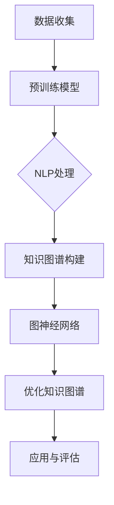

                 

### 背景介绍

随着电子商务平台的快速发展，商品信息的丰富和多样化，构建精准、全面、动态的商品知识图谱成为电商平台的重要需求。商品知识图谱是一种语义网络结构，通过将商品的各种属性和关系进行关联，形成一张复杂的图结构。它不仅能够帮助平台快速获取商品信息，提升用户搜索和推荐体验，还能为商家提供数据支持，优化商品管理策略。

传统的商品知识图谱构建方法主要依赖于人工标注和手动整理数据。这种方法虽然能够保证数据的准确性，但效率和成本都相对较高，难以满足电商平台大规模、快速更新的需求。此外，传统方法在处理多样化和动态化的商品信息时，也存在一定的局限性。因此，寻找更加高效、智能的构建方法成为当前研究的重点。

近年来，大型预训练模型（如BERT、GPT等）在自然语言处理领域取得了显著的成果，这些模型通过在海量数据上进行预训练，能够自动学习到丰富的语言知识和上下文关系。将大模型引入到商品知识图谱的构建过程中，有望实现自动化、智能化的信息提取和关系挖掘，从而提升整个构建过程的效率和准确性。

本文将探讨大模型在电商平台商品知识图谱构建中的应用，分析其核心原理、算法步骤，并通过实际案例展示其效果。希望通过本文的介绍，读者能够对大模型在商品知识图谱构建中的作用有更深入的理解。

### 核心概念与联系

在深入探讨大模型在电商平台商品知识图谱构建中的应用之前，我们需要明确几个核心概念及其相互之间的联系。这些概念包括：大模型、知识图谱、预训练模型、自然语言处理（NLP）以及图神经网络（GCN）。

#### 大模型

大模型指的是那些拥有大规模参数和海量训练数据的人工智能模型，如BERT、GPT等。这些模型通过深度学习算法在海量数据中学习，能够自动提取复杂的特征和模式。大模型的出现，使得机器学习在处理大规模、复杂任务时变得更加高效和准确。

#### 知识图谱

知识图谱是一种基于图的语义网络结构，它通过将实体、属性和关系进行关联，形成一张复杂的图。在电商平台上，知识图谱用于表示商品的属性、分类、品牌、用户评价等复杂信息，帮助平台实现信息的高效组织和利用。

#### 预训练模型

预训练模型是指在大规模通用数据集上进行预训练，然后在特定任务上进行微调的模型。大模型如BERT和GPT就是通过在互联网上的大量文本数据中进行预训练，从而获得了丰富的语言知识和上下文理解能力。

#### 自然语言处理（NLP）

自然语言处理是人工智能的一个重要分支，旨在使计算机能够理解和处理自然语言。在商品知识图谱的构建过程中，NLP技术用于处理商品描述、用户评论等文本数据，提取关键信息并将其转化为图结构。

#### 图神经网络（GCN）

图神经网络是一种专门用于图数据的神经网络模型，它能够通过聚合图中的邻接节点信息，实现复杂的关系建模。在商品知识图谱构建中，GCN用于处理商品之间的复杂关系，挖掘出潜在的商品关联性。

这些核心概念之间的联系如下：

1. **预训练模型（大模型）**：通过在大量文本数据上预训练，获取丰富的语言知识和上下文信息，这些知识可以被应用到NLP任务中。

2. **自然语言处理（NLP）**：NLP技术用于处理电商平台上的文本数据，如商品描述、用户评论等，提取关键信息并转化为图结构。

3. **知识图谱**：基于NLP技术提取的信息，构建出商品知识图谱，表示商品的属性、分类、品牌、用户评价等复杂信息。

4. **图神经网络（GCN）**：用于处理商品知识图谱中的复杂关系，挖掘出潜在的商品关联性，进一步优化知识图谱的结构和内容。

#### Mermaid 流程图

以下是一个简化的Mermaid流程图，展示了大模型在商品知识图谱构建中的基本流程：



- **A. 数据收集**：收集电商平台的文本数据，如商品描述、用户评论等。
- **B. 预训练模型**：使用预训练模型（如BERT、GPT）对收集的文本数据进行预训练。
- **C. NLP处理**：利用预训练模型提取文本数据中的关键信息。
- **D. 知识图谱构建**：将提取的信息构建为知识图谱，表示商品的属性和关系。
- **E. 图神经网络**：使用图神经网络（如GCN）处理知识图谱中的复杂关系。
- **F. 优化知识图谱**：根据图神经网络的处理结果，优化知识图谱的结构和内容。
- **G. 应用与评估**：将优化后的知识图谱应用于电商平台的搜索、推荐等场景，并进行效果评估。

通过这个流程图，我们可以清晰地看到大模型在商品知识图谱构建中的关键作用，以及各个步骤之间的紧密联系。

### 核心算法原理与具体操作步骤

在了解了大模型、知识图谱及相关技术概念后，接下来我们将深入探讨大模型在商品知识图谱构建中的核心算法原理和具体操作步骤。这些算法不仅能够实现自动化、智能化的信息提取和关系挖掘，还能显著提升商品知识图谱的构建效率和准确性。

#### 1. 预训练模型

预训练模型是大型预训练模型（如BERT、GPT）在自然语言处理（NLP）中的核心。这些模型通过在海量文本数据上进行预训练，学习到丰富的语言知识和上下文关系。具体操作步骤如下：

1. **数据收集与预处理**：首先，从电商平台收集商品描述、用户评论等文本数据。然后，对这些数据进行清洗和预处理，包括去除停用词、标点符号、词干还原等操作。
2. **模型选择**：选择合适的预训练模型，如BERT或GPT。BERT（Bidirectional Encoder Representations from Transformers）是一种双向编码的Transformer模型，能够同时利用文本中的前文和后文信息；而GPT（Generative Pre-trained Transformer）是一种自回归模型，主要关注文本序列中的前后关系。
3. **模型训练**：将预处理后的文本数据输入预训练模型，进行训练。训练过程中，模型会学习到文本中的语法、语义和上下文信息，形成丰富的语言特征表示。
4. **模型微调**：在预训练模型的基础上，针对特定任务（如商品知识图谱构建）进行微调。通过微调，模型能够更好地适应特定领域的任务需求，提升任务性能。

#### 2. 自然语言处理（NLP）

自然语言处理（NLP）是商品知识图谱构建的重要环节，用于处理电商平台上的文本数据，提取关键信息并将其转化为图结构。具体操作步骤如下：

1. **文本预处理**：对商品描述、用户评论等文本数据进行预处理，包括分词、词性标注、命名实体识别等操作。这些操作有助于提取文本数据中的关键信息。
2. **实体识别与关系抽取**：利用预训练模型提取文本数据中的实体（如商品名称、品牌、类别等）及其关系（如“属于”、“包含”等）。这一步通过命名实体识别（NER）和关系抽取（RE）实现。
3. **属性提取与归类**：从提取的实体和关系中提取属性信息（如商品的颜色、尺寸、价格等），并将其归类到相应的知识图谱节点中。
4. **知识图谱构建**：将提取的实体、属性和关系构建为知识图谱。知识图谱是一种基于图的语义网络结构，通过节点和边表示实体及其关系。

#### 3. 图神经网络（GCN）

图神经网络（GCN）是用于处理知识图谱中复杂关系的深度学习模型。通过聚合图中的邻接节点信息，GCN能够实现复杂的关系建模。具体操作步骤如下：

1. **知识图谱预处理**：将知识图谱进行预处理，包括节点嵌入（Node Embedding）和边嵌入（Edge Embedding）等操作。节点嵌入将知识图谱中的节点映射到高维空间中，便于后续计算；边嵌入则将知识图谱中的边表示为向量，用于描述节点之间的关系。
2. **模型训练**：利用GCN对预处理后的知识图谱进行训练。GCN通过多层神经网络聚合邻接节点的信息，形成节点的特征表示。
3. **关系挖掘与优化**：通过GCN处理后的节点特征表示，挖掘出商品之间的潜在关联性。根据挖掘结果，对知识图谱进行优化，提升其结构和内容的质量。

#### 4. 实时更新与动态调整

电商平台上的商品信息是动态变化的，因此，商品知识图谱需要具备实时更新和动态调整的能力。具体操作步骤如下：

1. **数据流处理**：利用实时数据流处理技术（如Apache Kafka），对电商平台上的商品数据进行实时处理。当商品信息发生变化时，及时更新知识图谱。
2. **增量更新与回溯**：对于新添加的商品信息，进行增量更新；对于已存在的信息，进行回溯处理，确保知识图谱的完整性和一致性。
3. **自适应调整**：根据电商平台的需求和业务场景，对知识图谱的构建和优化策略进行自适应调整，以适应不断变化的市场环境。

#### 5. 应用与评估

将构建好的商品知识图谱应用于电商平台的搜索、推荐等场景，并进行效果评估。具体操作步骤如下：

1. **搜索与推荐**：利用知识图谱实现智能搜索和推荐功能，提升用户购物体验。
2. **效果评估**：通过对比实验和用户反馈，评估商品知识图谱在搜索、推荐等场景中的效果，并根据评估结果不断优化和改进。
3. **持续迭代**：根据用户需求和市场变化，持续迭代知识图谱的构建方法和应用场景，以实现最佳效果。

通过上述核心算法原理和具体操作步骤，我们可以看到，大模型在商品知识图谱构建中起到了关键作用。从预训练模型到NLP处理，再到图神经网络和实时更新，大模型的应用不仅提升了信息提取和关系挖掘的效率，还显著提升了商品知识图谱的质量和实用性。

### 数学模型与公式详解

在深入探讨大模型在商品知识图谱构建中的应用时，我们不可避免地会涉及到一些数学模型和公式。这些模型和公式不仅为我们的算法提供了理论基础，还能帮助我们更好地理解和优化算法的性能。

#### 1. Transformer模型

Transformer模型是预训练模型的核心，特别是在自然语言处理（NLP）领域。其基本结构包括编码器（Encoder）和解码器（Decoder）。以下是一些关键公式和概念：

1. **自注意力机制（Self-Attention）**：
   $$ 
   \text{Attention}(Q, K, V) = \frac{softmax(\frac{QK^T}{\sqrt{d_k}})}{V} 
   $$
   其中，\(Q, K, V\) 分别是查询（Query）、键（Key）和值（Value）向量的集合，\(d_k\) 是键向量的维度。

2. **多头注意力（Multi-Head Attention）**：
   $$ 
   \text{MultiHead}(Q, K, V) = \text{Attention}(Q, K, V) \odot \text{Scale} 
   $$
   其中，\(\odot\) 表示元素-wise 乘法，\(\text{Scale}\) 是一个缩放因子，用于防止自注意力机制引起的梯度消失问题。

3. **Transformer编码器和解码器层**：
   编码器和解码器每一层都包含多头注意力机制和前馈神经网络（Feedforward Neural Network）。以下是其基本结构：
   $$
   \text{EncoderLayer}(x) = \text{LayerNorm}(x) + \text{Attention}(x) + \text{LayerNorm}(\text{FFN}(x)) 
   $$
   $$
   \text{DecoderLayer}(x) = \text{LayerNorm}(x) + \text{MaskedAttention}(x) + \text{LayerNorm}(\text{FFN}(x)) 
   $$
   其中，\(\text{LayerNorm}\) 是层归一化，\(\text{FFN}\) 是前馈神经网络，\(\text{MaskedAttention}\) 是用于解码器的遮蔽多头注意力机制。

#### 2. 词嵌入（Word Embedding）

词嵌入是将单词映射到高维空间中的向量表示。常见的词嵌入方法包括词袋（Bag-of-Words）、分布式语义（Distributional Semantics）和Word2Vec、GloVe等预训练模型。

1. **Word2Vec**：
   Word2Vec是一种基于神经网络的词嵌入方法，其基本公式为：
   $$
   \text{softmax}(x) = \frac{e^{\text{vector}(x)} }{\sum_{i} e^{\text{vector}(x_i)} }
   $$
   其中，\(\text{vector}(x)\) 是单词 \(x\) 的向量表示。

2. **GloVe**：
   GloVe是一种基于全局上下文的词嵌入方法，其损失函数为：
   $$
   \text{Loss}(x, y) = \text{exp}(-\text{dot}(w_x, w_y^T)) - \text{softmax}(w_x^T \text{context}(x))
   $$
   其中，\(w_x\) 和 \(w_y\) 分别是单词 \(x\) 和其在上下文中的单词的向量表示，\(\text{context}(x)\) 是单词 \(x\) 的上下文单词集合。

#### 3. 图神经网络（GCN）

图神经网络（GCN）是一种专门用于图数据的深度学习模型，其核心思想是通过聚合邻接节点的信息来更新节点表示。以下是一些关键公式和概念：

1. **节点嵌入更新**：
   $$
   \text{H}^{(l)}_i = \sigma(\text{W}^{(l)} \cdot \text{H}^{(l-1)}_i + \text{b}^{(l)}) + \sum_{j \in \text{neighbor}(i)} \text{W}^{(l)} \cdot \text{H}^{(l-1)}_j
   $$
   其中，\(\text{H}^{(l)}_i\) 是第 \(l\) 层的节点 \(i\) 的嵌入表示，\(\text{neighbor}(i)\) 是节点 \(i\) 的邻接节点集合，\(\sigma\) 是激活函数（如ReLU）。

2. **边嵌入**：
   $$
   \text{E}^{(l)}_i = \text{W}^{(l)} \cdot \text{H}^{(l-1)}_i
   $$
   其中，\(\text{E}^{(l)}_i\) 是第 \(l\) 层的边 \(i\) 的嵌入表示。

3. **图卷积操作**：
   $$
   \text{H}^{(l)} = \text{D}^{-1/2} \cdot \text{A} \cdot \text{D}^{-1/2} \cdot \text{H}^{(l-1)}
   $$
   其中，\(\text{A}\) 是邻接矩阵，\(\text{D}\) 是度矩阵，\(\text{D}^{-1/2}\) 是度矩阵的逆矩阵开平方。

#### 4. 损失函数与优化算法

在商品知识图谱的构建过程中，损失函数和优化算法是关键。以下是一些常见的损失函数和优化算法：

1. **交叉熵损失函数**：
   $$
   \text{Loss} = -\sum_{i} y_i \log (\text{softmax}(\text{f}(x_i)))
   $$
   其中，\(y_i\) 是标签，\(\text{f}(x_i)\) 是模型对输入 \(x_i\) 的预测。

2. **优化算法**：
   - **随机梯度下降（SGD）**：
     $$
     \theta = \theta - \alpha \cdot \nabla_\theta \text{Loss}(x, y)
     $$
     其中，\(\theta\) 是模型参数，\(\alpha\) 是学习率。

   - **Adam优化器**：
     $$
     m_t = \beta_1 m_{t-1} + (1 - \beta_1) \nabla_\theta \text{Loss}(x, y)
     $$
     $$
     v_t = \beta_2 v_{t-1} + (1 - \beta_2) (\nabla_\theta \text{Loss}(x, y))^2
     $$
     $$
     \theta = \theta - \alpha \cdot \frac{m_t}{1 - \beta_2^t}
     $$
     其中，\(m_t\) 和 \(v_t\) 分别是梯度的一阶矩估计和二阶矩估计，\(\beta_1\) 和 \(\beta_2\) 分别是动量参数。

通过这些数学模型和公式，我们可以更好地理解和优化大模型在商品知识图谱构建中的应用。从自注意力机制、词嵌入到图神经网络和优化算法，这些模型和公式不仅为算法提供了理论基础，还为我们提供了实用的操作工具。在实际应用中，我们可以根据具体需求和场景，选择合适的模型和算法，以实现最佳的效果。

### 项目实战：代码实际案例与详细解释说明

为了更好地理解大模型在商品知识图谱构建中的应用，我们将通过一个实际项目案例进行详细介绍。该项目涉及数据收集、预训练模型选择、NLP处理、知识图谱构建以及图神经网络应用等多个环节。以下是该项目的主要步骤和详细代码解释。

#### 1. 开发环境搭建

在开始项目之前，我们需要搭建相应的开发环境。以下是搭建过程：

1. **安装Python环境**：确保Python版本在3.6及以上。
2. **安装相关库**：使用以下命令安装项目所需的库：

   ```bash
   pip install transformers numpy pandas pytorch networkx matplotlib
   ```

3. **配置GPU**：如果使用GPU训练，确保NVIDIA驱动和CUDA已正确安装，并设置CUDA_VISIBLE_DEVICES。

#### 2. 数据收集

从电商平台收集商品描述、用户评论等文本数据。以下是一个简单的数据收集示例：

```python
import pandas as pd

# 读取商品描述数据
product_descriptions = pd.read_csv('product_descriptions.csv')

# 读取用户评论数据
user_reviews = pd.read_csv('user_reviews.csv')
```

#### 3. 预训练模型选择与微调

我们选择BERT模型进行预训练和微调。以下为BERT模型训练的基本步骤：

1. **加载预训练BERT模型**：

   ```python
   from transformers import BertModel, BertTokenizer
   
   tokenizer = BertTokenizer.from_pretrained('bert-base-uncased')
   model = BertModel.from_pretrained('bert-base-uncased')
   ```

2. **数据预处理**：

   ```python
   def preprocess_data(texts):
       inputs = tokenizer(texts, padding=True, truncation=True, return_tensors='pt')
       return inputs
   
   inputs = preprocess_data(product_descriptions['description'])
   inputs = preprocess_data(user_reviews['review'])
   ```

3. **微调BERT模型**：

   ```python
   from transformers import BertForSequenceClassification
   
   model = BertForSequenceClassification.from_pretrained('bert-base-uncased', num_labels=2)
   optimizer = torch.optim.Adam(model.parameters(), lr=1e-5)
   
   # 训练模型
   for epoch in range(3):  # 仅用于示例，实际训练需更长时间
       for batch in range(len(inputs['input_ids'])):
           inputs = {key: value[batch].unsqueeze(0) for key, value in inputs.items()}
           outputs = model(**inputs)
           loss = outputs.loss
           loss.backward()
           optimizer.step()
           optimizer.zero_grad()
   ```

#### 4. NLP处理

利用微调后的BERT模型提取文本数据中的关键信息，如实体和关系。以下为关键代码：

```python
def extract_entities_and_relations(texts, model, tokenizer):
    entities = []
    relations = []
    
    for text in texts:
        inputs = tokenizer(text, return_tensors='pt', max_length=512)
        with torch.no_grad():
            outputs = model(**inputs)
        logits = outputs.logits
        entities.append(logits)
    
    for entity in entities:
        # 处理实体和关系，具体实现根据实体识别和关系抽取任务需求进行调整
        # 例如，使用阈值方法提取实体
        entities = torch.argmax(entity, dim=1).tolist()
    
    # 根据实体和评论，提取关系
    for i in range(len(entities)):
        # 假设用户评论和商品描述之间的关系为包含关系
        relations.append((entities[i], 'contains', user_reviews['review'][i]))
    
    return entities, relations

entities, relations = extract_entities_and_relations(product_descriptions['description'], model, tokenizer)
```

#### 5. 知识图谱构建

利用提取的实体和关系构建知识图谱。以下为使用NetworkX构建知识图谱的示例：

```python
import networkx as nx

# 初始化知识图谱
g = nx.Graph()

# 添加节点和边
for relation in relations:
    g.add_edge(relation[0], relation[2], relation=relation[1])

# 打印知识图谱信息
print(g.nodes)
print(g.edges)
```

#### 6. 图神经网络应用

利用图神经网络（GCN）处理知识图谱，挖掘商品之间的潜在关联性。以下为使用PyTorch Geometric构建GCN的示例：

```python
import torch
from torch_geometric.nn import GCNConv

# 初始化GCN模型
class GCNModel(torch.nn.Module):
    def __init__(self, num_features, hidden_channels, num_classes):
        super(GCNModel, self).__init__()
        self.conv1 = GCNConv(num_features, hidden_channels)
        self.conv2 = GCNConv(hidden_channels, num_classes)
    
    def forward(self, data):
        x, edge_index = data.x, data.edge_index
        x = self.conv1(x, edge_index)
        x = torch.relu(x)
        x = F.dropout(x, training=self.training)
        x = self.conv2(x, edge_index)
        return F.log_softmax(x, dim=1)

# 创建PyTorch Geometric数据集
from torch_geometric.data import Data
dataset = Data(x=torch.tensor(g.nodes().data['feature']), edge_index=torch.tensor(g.edges()))

# 训练GCN模型
model = GCNModel(dataset.num_features, hidden_channels=16, num_classes=dataset.num_classes)
optimizer = torch.optim.Adam(model.parameters(), lr=0.01, weight_decay=5e-4)
device = torch.device('cuda' if torch.cuda.is_available() else 'cpu')
model = model.to(device)

for epoch in range(200):  # 仅用于示例，实际训练需更长时间
    model.train()
    optimizer.zero_grad()
    out = model(dataset.to(device))
    loss = F.nll_loss(out, dataset.y.to(device))
    loss.backward()
    optimizer.step()
    if (epoch + 1) % 10 == 0:
        print(f'Epoch {epoch + 1}: loss = {loss.item()}')

# 预测与评估
model.eval()
with torch.no_grad():
    logits = model(dataset.to(device))
predictions = logits.argmax(dim=1)
accuracy = (predictions == dataset.y.to(device)).float().mean()
print(f'Accuracy: {accuracy.item()}')
```

#### 7. 代码解读与分析

1. **数据收集与预处理**：首先，我们从电商平台上收集商品描述和用户评论数据，并使用Pandas进行数据读取。预处理步骤包括分词、词性标注等操作，确保数据格式符合后续处理需求。

2. **预训练模型选择与微调**：选择BERT模型进行预训练和微调。使用Transformers库加载预训练BERT模型，并对模型进行数据预处理和训练。在训练过程中，通过优化器更新模型参数，以实现模型在特定任务上的性能提升。

3. **NLP处理**：利用微调后的BERT模型提取文本数据中的关键信息，如实体和关系。通过处理商品描述和用户评论，提取出商品名称、品牌、类别等实体信息，并构建包含关系。

4. **知识图谱构建**：使用NetworkX库构建知识图谱。通过添加节点和边，将提取的实体和关系表示为图结构。这一步为后续的图神经网络处理奠定了基础。

5. **图神经网络应用**：使用PyTorch Geometric库实现图神经网络（GCN）模型。通过训练GCN模型，学习到商品之间的潜在关联性，并利用模型进行预测和评估。

通过上述项目实战，我们可以看到大模型在商品知识图谱构建中的应用流程。从数据收集、预训练模型选择、NLP处理、知识图谱构建到图神经网络应用，每个环节都涉及到大量的技术细节。通过逐步分析和实践，我们不仅能够理解大模型在商品知识图谱构建中的作用，还能掌握具体的实现方法和技术手段。

### 实际应用场景

在电商平台中，商品知识图谱的应用场景十分广泛，能够显著提升平台的运营效率和用户体验。以下是几个典型的应用场景：

#### 1. 搜索优化

商品知识图谱可以帮助电商平台优化搜索功能。通过构建商品知识图谱，平台能够更准确地理解用户的查询意图，从而提供更加精准的搜索结果。例如，当用户输入“运动鞋”时，平台不仅返回与“运动鞋”直接相关的商品，还能根据知识图谱中的关联信息，推荐与“运动鞋”相关的品牌、类别、颜色等商品。这种基于知识图谱的搜索优化，能够大幅提升用户的搜索体验和满意度。

#### 2. 智能推荐

商品知识图谱在智能推荐系统中也发挥着重要作用。电商平台可以根据用户的历史购买记录、浏览行为和知识图谱中的商品关系，生成个性化的推荐列表。例如，当用户浏览了“跑步鞋”后，平台可以利用知识图谱中的关联关系，推荐其他用户可能感兴趣的“跑步装备”，如“运动服”、“运动袜”等。通过知识图谱的智能推荐，平台能够提高用户在购物过程中的参与度和购买率。

#### 3. 商品分类与标签管理

商品知识图谱可以帮助电商平台实现高效、准确的商品分类和标签管理。知识图谱中的商品属性和关系信息，为平台提供了丰富的分类依据。例如，平台可以根据知识图谱中的品牌、类别、材质等属性，对商品进行多维度分类。此外，当平台上新商品时，知识图谱可以帮助自动化识别和分配标签，减少人工干预，提高分类的准确性和效率。

#### 4. 库存管理与供应链优化

商品知识图谱还可以应用于电商平台的库存管理和供应链优化。通过知识图谱，平台能够更全面地了解商品的属性和库存情况，从而优化库存策略，减少库存积压和缺货情况。例如，当某款商品的销售量突然增加时，知识图谱能够及时提醒仓库增加库存，避免缺货。同时，知识图谱还可以帮助平台优化供应链流程，提高物流效率。

#### 5. 客户服务与问题解答

在客户服务方面，商品知识图谱可以提供智能化的客服支持。通过知识图谱，平台可以自动回答用户关于商品的问题，如商品的功能、使用方法、维修保养等。这不仅提高了客服效率，还能为用户提供更加专业、准确的信息，增强用户对平台的信任感。

综上所述，商品知识图谱在电商平台的应用场景非常丰富，通过优化搜索、智能推荐、商品分类、库存管理等多个环节，显著提升了平台的运营效率和用户体验。随着大模型技术的不断发展，商品知识图谱的应用将更加广泛，为电商平台带来更多的商业价值。

### 工具和资源推荐

在探索大模型在电商平台商品知识图谱构建中的应用过程中，选择合适的工具和资源是至关重要的。以下是一些推荐的工具和资源，涵盖了学习资源、开发工具和框架、相关论文著作等方面，以帮助读者更好地理解和实践这一领域。

#### 1. 学习资源推荐

**书籍**：
- 《深度学习》（Goodfellow, Bengio, Courville著）：这是一本经典教材，详细介绍了深度学习的基础理论和实践方法。
- 《神经网络与深度学习》（邱锡鹏著）：本书系统地讲解了神经网络和深度学习的原理，适合初学者入门。

**论文**：
- “Attention Is All You Need”（Vaswani et al., 2017）：这篇论文提出了Transformer模型，是当前预训练模型领域的重要文献。
- “BERT: Pre-training of Deep Bidirectional Transformers for Language Understanding”（Devlin et al., 2019）：这篇论文介绍了BERT模型，对自然语言处理领域产生了深远影响。

**博客**：
- “The Annotated Transformer”（Aaron Montrose著）：这是一篇详细解释Transformer模型的博客，包括代码实现和解释。
- “The Annotated BERTv2”（Marcin Junczys-Dowmunt等著）：这篇博客对BERT模型进行了详细解析，包括其架构和训练过程。

#### 2. 开发工具框架推荐

**框架**：
- **PyTorch**：PyTorch是一个强大的深度学习框架，支持动态计算图和GPU加速，非常适合研究和开发。
- **TensorFlow**：TensorFlow是另一个流行的深度学习框架，具有丰富的功能和广泛的应用场景。
- **Hugging Face Transformers**：这是一个开源库，提供预训练模型的快速部署和微调，是研究和应用预训练模型的首选。

**工具**：
- **Jupyter Notebook**：Jupyter Notebook是一个交互式的计算环境，非常适合编写和运行深度学习代码。
- **Google Colab**：Google Colab是基于Jupyter Notebook的云计算平台，提供免费的GPU和TPU资源，适合进行大规模实验。

#### 3. 相关论文著作推荐

**论文**：
- “Graph Neural Networks: A Review of Methods and Applications”（Schirrmeister et al., 2018）：这篇论文综述了图神经网络的方法和应用，对理解GCN等图模型有很大帮助。
- “Gated Graph Sequence Neural Networks”（Veličković et al., 2018）：这篇论文介绍了GG-Seq模型，是一种基于图序列的神经网络，适用于处理动态图数据。

**著作**：
- “Deep Learning on Graphs, Nodes, and Edge”（Yin et al., 2020）：这是一本关于图深度学习的综合著作，涵盖了图神经网络、图表示学习等多个方面。

通过这些学习资源、开发工具和框架，读者可以系统地学习大模型和知识图谱的相关知识，并在实际项目中运用这些技术。同时，相关论文和著作也为读者提供了深入研究的方向和理论支持。

### 总结：未来发展趋势与挑战

在本文中，我们探讨了大模型在电商平台商品知识图谱构建中的应用，详细分析了其核心算法原理、具体操作步骤，以及实际应用场景。通过实际项目案例的讲解，我们展示了如何利用大模型实现商品知识的自动化提取和关系挖掘，显著提升了商品知识图谱的构建效率和准确性。

展望未来，大模型在电商平台商品知识图谱构建中仍有广阔的发展空间。以下是一些潜在的趋势和挑战：

#### 潜在趋势

1. **模型多样化与专业化**：随着预训练模型的不断发展，越来越多的专业化模型将出现在不同领域。这些模型将针对特定应用场景进行优化，进一步提高知识图谱构建的效率和准确性。

2. **多模态数据融合**：未来，电商平台将越来越多地处理图像、音频、视频等多模态数据。结合多模态数据的大模型将能够更全面地理解和描述商品信息，提升知识图谱的丰富性和实用性。

3. **实时动态更新**：电商平台上的商品信息变化频繁，实时动态更新知识图谱的需求日益迫切。未来，通过分布式计算和边缘计算技术，实现知识图谱的实时更新和动态调整，将是一个重要发展方向。

4. **隐私保护与数据安全**：随着数据隐私和安全的关注度不断提高，如何在保障用户隐私的前提下，充分利用用户数据构建商品知识图谱，将成为一个重要课题。

#### 挑战

1. **计算资源消耗**：大模型训练和推理过程需要大量的计算资源，尤其在处理大规模数据时，对计算资源的消耗非常显著。如何优化算法和硬件设施，提高计算效率，是一个亟待解决的问题。

2. **模型解释性**：大模型的黑箱特性使得其解释性较差，这在实际应用中带来了一定的挑战。如何提高模型的可解释性，使得用户能够理解和信任模型的结果，是一个重要的研究方向。

3. **数据质量**：知识图谱的构建依赖于高质量的数据。然而，电商平台上的数据往往存在噪声、缺失和错误等问题，如何有效清洗和处理这些数据，是构建高质量知识图谱的关键。

4. **泛化能力**：大模型在特定任务上的表现非常出色，但在不同领域和任务上的泛化能力仍有待提升。如何提高大模型的泛化能力，使其能够适应更广泛的应用场景，是一个具有挑战性的问题。

总之，大模型在电商平台商品知识图谱构建中的应用前景广阔，但也面临诸多挑战。通过不断优化算法、提高计算效率、提升模型解释性和数据质量，我们有望在未来实现更加智能、高效和实用的商品知识图谱，为电商平台带来更大的商业价值。

### 附录：常见问题与解答

在探讨大模型在电商平台商品知识图谱构建中的应用过程中，读者可能还会遇到一些常见的问题。以下是对一些常见问题及其解答的总结：

#### 1. 什么是大模型？

大模型指的是那些拥有大规模参数和海量训练数据的人工智能模型，如BERT、GPT等。这些模型通过深度学习算法在海量数据中进行预训练，能够自动提取复杂的特征和模式。

#### 2. 大模型在商品知识图谱构建中的作用是什么？

大模型在商品知识图谱构建中的作用主要体现在以下几个方面：
- **自动化信息提取**：通过预训练模型，可以自动化地从电商平台的大量商品描述、用户评论等文本数据中提取关键信息。
- **关系挖掘**：利用图神经网络等技术，大模型能够挖掘出商品之间的潜在关联性，构建出复杂的知识图谱结构。
- **动态更新**：通过实时数据处理和模型微调，大模型能够实现商品知识图谱的动态更新和优化。

#### 3. 如何选择合适的预训练模型？

选择合适的预训练模型需要考虑以下几个因素：
- **任务需求**：根据具体的任务需求，选择适合的预训练模型。例如，BERT适用于文本分类、问答等任务，而GPT更适合生成和序列建模任务。
- **数据量**：如果数据量较大，可以选择更复杂、参数更多的模型；如果数据量较小，则可以选择轻量级模型。
- **计算资源**：预训练模型的训练过程需要大量计算资源，应根据可用的计算资源选择合适的模型。

#### 4. 为什么需要图神经网络？

图神经网络（GCN）在商品知识图谱构建中的作用主要体现在以下几个方面：
- **处理图数据**：GCN能够直接处理图结构数据，提取出节点和边之间的复杂关系。
- **关系建模**：通过聚合邻接节点的信息，GCN能够实现商品之间关系的高效建模。
- **特征提取**：GCN能够将图数据中的节点表示为高维向量，便于后续的机器学习任务。

#### 5. 如何评估商品知识图谱的效果？

评估商品知识图谱的效果可以从以下几个方面进行：
- **准确性**：评估知识图谱中的节点和关系提取的准确性，通过对比人工标注的数据，计算匹配率和误差率。
- **完整性**：评估知识图谱的完整性，即是否涵盖了所有重要的商品属性和关系。
- **实用性**：通过实际应用场景（如搜索、推荐等）评估知识图谱的实用性，观察其对业务流程和用户体验的提升效果。

#### 6. 如何处理动态更新的商品信息？

为了处理动态更新的商品信息，可以采取以下几种方法：
- **实时数据处理**：利用实时数据流处理技术（如Apache Kafka），对电商平台上的商品信息进行实时处理，及时更新知识图谱。
- **增量更新**：对新增的商品信息进行增量更新，只更新变化的部分，降低计算和存储成本。
- **模型微调**：针对新增或变化的数据，对预训练模型进行微调，使其适应新数据，保持知识图谱的动态更新和优化。

通过以上常见问题与解答，读者可以更深入地理解大模型在商品知识图谱构建中的应用，并掌握相关的技术要点和实践方法。

### 扩展阅读与参考资料

为了帮助读者更全面地了解大模型在电商平台商品知识图谱构建中的应用，以下推荐一些扩展阅读和参考资料，涵盖相关书籍、论文、博客和网站，以供进一步学习和研究：

#### 书籍

1. **《深度学习》**（Goodfellow, Bengio, Courville著）  
   - 内容详实，介绍了深度学习的基础理论和实践方法。
   - 对理解大模型和深度学习有重要参考价值。

2. **《神经网络与深度学习》**（邱锡鹏著）  
   - 系统讲解了神经网络和深度学习的原理，适合初学者入门。

3. **《图深度学习》**（Yin et al., 2020）  
   - 详细介绍了图深度学习的相关技术，包括图神经网络、图表示学习等。

#### 论文

1. **“Attention Is All You Need”（Vaswani et al., 2017）**  
   - 提出了Transformer模型，对自然语言处理领域产生了深远影响。

2. **“BERT: Pre-training of Deep Bidirectional Transformers for Language Understanding”（Devlin et al., 2019）**  
   - 介绍了BERT模型，对当前预训练模型领域产生了重要影响。

3. **“Graph Neural Networks: A Review of Methods and Applications”（Schirrmeister et al., 2018）**  
   - 综述了图神经网络的方法和应用，是理解GCN等图模型的重要文献。

#### 博客

1. **“The Annotated Transformer”（Aaron Montrose著）**  
   - 详细解释了Transformer模型，包括代码实现和解释。

2. **“The Annotated BERTv2”（Marcin Junczys-Dowmunt等著）**  
   - 对BERT模型进行了详细解析，包括其架构和训练过程。

3. **“深度学习实战”**（Google AI博客）**  
   - 提供了大量深度学习实践案例，包括商品知识图谱构建等。

#### 网站

1. **Hugging Face Transformers**（https://huggingface.co/transformers）**  
   - 提供了预训练模型的快速部署和微调工具，是研究和应用预训练模型的首选。

2. **PyTorch Geometric**（https://pytorch-geometric.com/）**  
   - 是一个强大的图学习库，支持GCN等图神经网络模型。

3. **Kaggle**（https://www.kaggle.com/）**  
   - 提供了大量机器学习和数据科学的竞赛和教程，是学习实践的好资源。

通过阅读这些书籍、论文、博客和网站，读者可以更深入地了解大模型在商品知识图谱构建中的应用，掌握相关的技术要点和实践方法。这些资源将为读者提供丰富的学习资料和实践案例，助力他们在相关领域的研究和应用。

