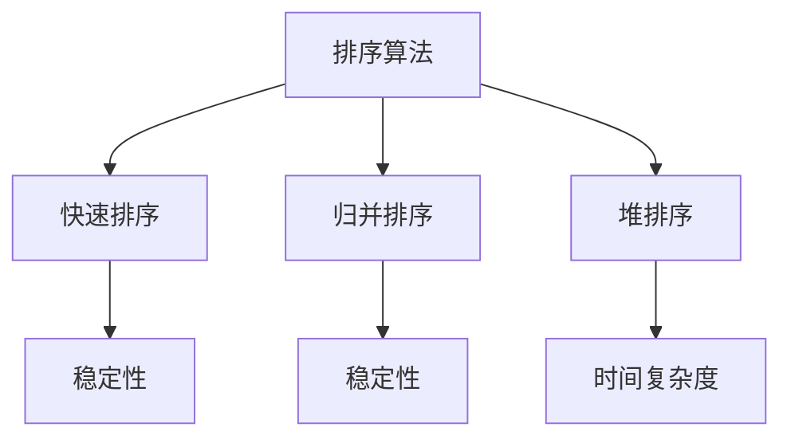
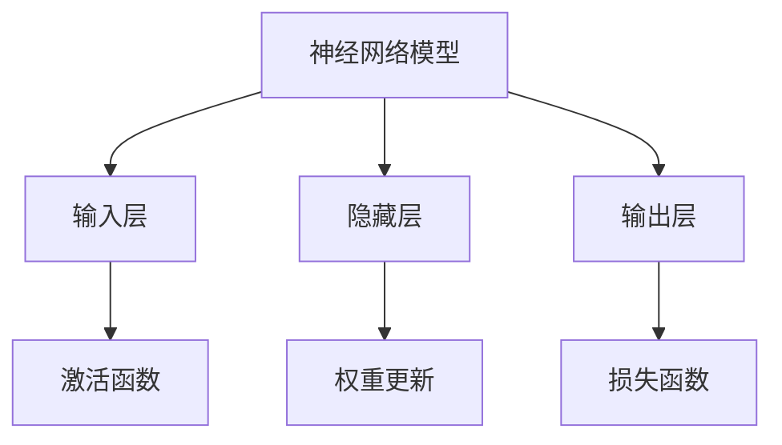
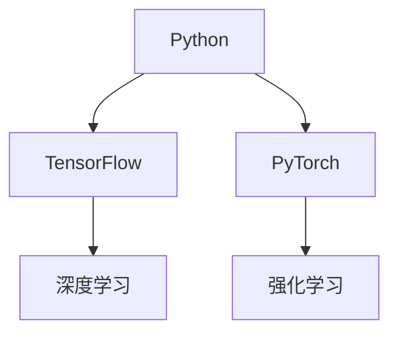
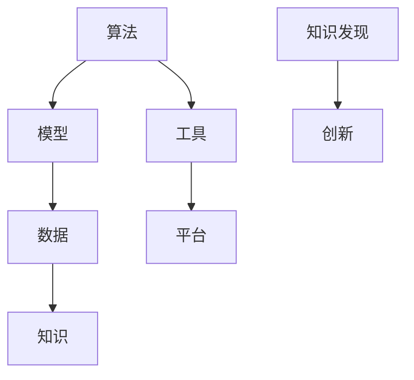
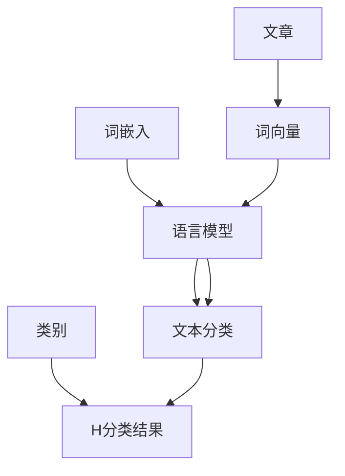

                 

# 推动知识发现与创新：人类计算的智力贡献

## 摘要

本文旨在探讨人类计算在推动知识发现与创新中的作用，通过深入分析核心概念、算法原理、数学模型以及实际应用场景，揭示人类计算在各个领域的智力贡献。文章首先介绍了知识发现与创新的重要性，随后详细解析了人类计算的核心概念和架构，探讨了核心算法原理及其具体操作步骤，并运用数学模型和公式进行了详细讲解。接着，通过一个实际项目实战案例，展示了人类计算的实践应用和代码实现，最后总结了人类计算在当前以及未来面临的发展趋势与挑战。通过这篇文章，我们希望读者能够更好地理解人类计算在知识发现与创新中的重要角色。

## 1. 背景介绍

知识发现与创新是人类社会进步的重要驱动力，它关乎科学技术、经济文化以及社会发展的方方面面。知识发现指的是从大量数据中提取出有价值的信息、模式和规律，而创新则是指将这些知识应用于实际情境，创造出新的产品、服务或解决方案。在现代社会，随着信息技术的迅猛发展，数据量呈爆炸式增长，如何有效地进行知识发现与创新，成为了一个亟待解决的关键问题。

人类计算作为人工智能的重要分支，其核心在于模拟人类思维过程，通过算法、模型和工具实现数据的处理与分析。人类计算不仅在学术研究领域有着广泛的应用，如自然语言处理、计算机视觉、机器学习等，还在实际工程中发挥了重要作用，如自动驾驶、智能医疗、金融风控等。随着计算能力的不断提升和算法的不断优化，人类计算在推动知识发现与创新方面展现了巨大的潜力。

本文将围绕人类计算在知识发现与创新中的作用，通过深入分析核心概念、算法原理、数学模型以及实际应用场景，探讨人类计算的智力贡献。文章结构如下：

1. **核心概念与联系**：介绍人类计算的基础概念，包括算法、模型和工具，并使用Mermaid流程图展示其架构。
2. **核心算法原理 & 具体操作步骤**：分析人类计算的核心算法，如深度学习、强化学习等，并详细讲解其操作步骤。
3. **数学模型和公式 & 详细讲解 & 举例说明**：运用数学模型和公式，阐述人类计算中的关键概念和原理，并通过实例进行说明。
4. **项目实战：代码实际案例和详细解释说明**：通过一个实际项目案例，展示人类计算的代码实现和详细解释。
5. **实际应用场景**：探讨人类计算在不同领域的应用场景，如自然语言处理、计算机视觉等。
6. **工具和资源推荐**：推荐相关的学习资源、开发工具和框架。
7. **总结：未来发展趋势与挑战**：总结人类计算在知识发现与创新中的发展趋势和面临的挑战。

## 2. 核心概念与联系

### 2.1 算法

算法是计算机科学中的核心概念，它指的是解决问题的步骤或过程。在人类计算中，算法是用于处理和分析数据的工具。常见的算法包括排序算法、搜索算法、图算法等。

#### Mermaid流程图：



### 2.2 模型

模型是用于模拟现实世界或特定问题的数学结构或计算框架。在人类计算中，模型用于表示数据、关系和过程。常见的模型包括神经网络模型、决策树模型、贝叶斯网络模型等。

#### Mermaid流程图：



### 2.3 工具

工具是用于实现算法和模型的软件或硬件。在人类计算中，工具包括编程语言、框架、库等。常见的工具包括Python、TensorFlow、PyTorch等。

#### Mermaid流程图：



### 2.4 联系

人类计算的核心概念相互联系，共同构成了一个完整的技术体系。算法为模型提供了操作步骤，模型为数据提供了表示方式，工具为算法和模型提供了实现平台。这种相互联系使得人类计算能够高效地处理和分析大量数据，从而实现知识发现与创新。

#### Mermaid流程图：



通过上述核心概念和联系的介绍，我们可以更好地理解人类计算的基础架构。在接下来的章节中，我们将进一步探讨人类计算的核心算法原理、数学模型以及实际应用场景，以揭示其智力贡献。

## 3. 核心算法原理 & 具体操作步骤

### 3.1 深度学习

深度学习是人工智能领域的一个重要分支，它通过模拟人脑的神经网络结构来实现对数据的自动学习和理解。深度学习的基本原理是多层神经元的堆叠，每一层神经元对数据进行处理和变换，从而逐步提取数据中的特征。

#### 深度学习的基本操作步骤：

1. **输入层**：接收外部输入的数据。
2. **隐藏层**：对输入数据进行处理和变换，提取数据中的特征。
3. **输出层**：将处理后的数据输出，用于分类、预测等任务。
4. **权重更新**：根据输出结果与实际目标之间的误差，调整各层神经元的权重，使模型逐渐逼近最优解。

#### 示例：

假设我们要对一张图片进行分类，图片是一个二维矩阵。首先，输入层接收图片的像素值，然后通过隐藏层逐层提取特征，最后输出层输出分类结果。

```mermaid
graph TD
A[输入层] --> B[隐藏层1]
B --> C[隐藏层2]
C --> D[隐藏层3]
D --> E[输出层]
F[像素值] --> G[H隐藏层1]
I[J[隐藏层2]]
K[L[隐藏层3]]
M[M[输出层]]
G --> H
I --> J
K --> L
L --> M
```

### 3.2 强化学习

强化学习是一种通过试错方式学习最优策略的机器学习方法。其核心思想是通过奖励和惩罚信号，让模型在环境中不断学习和调整行为，以实现最大化长期奖励。

#### 强化学习的基本操作步骤：

1. **初始状态**：模型开始时处于某个初始状态。
2. **选择动作**：模型根据当前状态选择一个动作。
3. **执行动作**：模型在环境中执行所选动作，并观察结果。
4. **更新状态**：根据执行动作的结果，模型更新当前状态。
5. **更新策略**：根据奖励和惩罚信号，模型调整策略，以实现最大化长期奖励。

#### 示例：

假设我们要训练一个自动驾驶模型，模型需要根据道路环境选择最佳驾驶动作。首先，模型从初始状态开始，选择一个驾驶动作，然后执行动作并观察结果，根据奖励和惩罚信号更新状态和策略。

```mermaid
graph TD
A[初始状态] --> B[选择动作]
B --> C[执行动作]
C --> D[更新状态]
D --> E[更新策略]
F[奖励信号] --> G[H惩罚信号]
B --> I[J[驾驶动作1]]
K[L[驾驶动作2]]
M[N[驾驶动作3]]
I --> C
J --> C
K --> C
C --> D
D --> E
E --> F
E --> G
```

### 3.3 自然语言处理

自然语言处理（NLP）是人工智能领域的一个重要分支，它致力于使计算机能够理解和处理自然语言。NLP的核心算法包括词嵌入、语言模型、文本分类、命名实体识别等。

#### 自然语言处理的基本操作步骤：

1. **词嵌入**：将自然语言中的词语转换为密集向量表示。
2. **语言模型**：根据历史数据，构建词语序列的概率模型。
3. **文本分类**：将文本分类到预定义的类别中。
4. **命名实体识别**：识别文本中的命名实体，如人名、地名等。

#### 示例：

假设我们要对一篇文章进行分类，首先，我们将文章中的词语转换为词嵌入向量，然后使用语言模型预测文章的类别，最后通过文本分类算法将文章分类到对应的类别中。



通过上述核心算法原理和具体操作步骤的介绍，我们可以更好地理解人类计算在知识发现与创新中的作用。这些算法和模型不仅为数据处理和分析提供了强大的工具，还为实现智能决策和创新提供了理论支持。在接下来的章节中，我们将进一步探讨人类计算中的数学模型和公式，以揭示其智力贡献。

## 4. 数学模型和公式 & 详细讲解 & 举例说明

### 4.1 深度学习中的数学模型

深度学习中的数学模型主要涉及神经元激活函数、损失函数和优化算法。以下是对这些模型及其公式的详细讲解和举例说明。

#### 4.1.1 神经元激活函数

神经元激活函数是深度学习中用于转换神经元输入输出关系的关键部分。常用的激活函数包括：

- **Sigmoid函数**：\( f(x) = \frac{1}{1 + e^{-x}} \)
- **ReLU函数**：\( f(x) = \max(0, x) \)
- **Tanh函数**：\( f(x) = \frac{e^x - e^{-x}}{e^x + e^{-x}} \)

#### 示例：

假设我们使用ReLU函数作为激活函数，输入值\( x = -3 \)。则激活值计算如下：

\[ f(x) = \max(0, -3) = 0 \]

#### 4.1.2 损失函数

损失函数用于评估模型预测结果与实际目标之间的差距。常用的损失函数包括：

- **均方误差（MSE）**：\( L(y, \hat{y}) = \frac{1}{2} \sum_{i=1}^{n} (y_i - \hat{y}_i)^2 \)
- **交叉熵损失（Cross-Entropy）**：\( L(y, \hat{y}) = - \sum_{i=1}^{n} y_i \log(\hat{y}_i) \)

#### 示例：

假设我们使用交叉熵损失函数，实际目标\( y = [0.2, 0.8] \)，模型预测\( \hat{y} = [0.1, 0.9] \)。则损失值计算如下：

\[ L(y, \hat{y}) = - (0.2 \log(0.1) + 0.8 \log(0.9)) \approx 0.469 \]

#### 4.1.3 优化算法

优化算法用于调整模型参数，以最小化损失函数。常用的优化算法包括：

- **梯度下降（Gradient Descent）**：\( \theta_{\text{new}} = \theta_{\text{old}} - \alpha \cdot \nabla_{\theta} L(\theta) \)
- **动量（Momentum）**：\( v = \gamma v + \alpha \cdot \nabla_{\theta} L(\theta) \)，\( \theta_{\text{new}} = \theta_{\text{old}} - v \)
- **Adam优化器**：结合了动量和RMSProp算法的特点，其参数更新公式为：
  \[
  m_t = \frac{1 - \beta_1}{1 - \beta_1^t} (g_1 - \beta_2 g_2) \\
  v_t = \frac{1 - \beta_2}{1 - \beta_2^t} \sum_{i=1}^{t} (\beta_1 g_i - \beta_2 g_i)^2 \\
  \theta_{\text{new}} = \theta_{\text{old}} - \alpha \cdot \frac{m_t}{\sqrt{v_t} + \epsilon}
  \]

#### 示例：

假设使用Adam优化器，初始参数\( \theta_{\text{old}} \)，学习率\( \alpha = 0.001 \)，动量参数\( \beta_1 = 0.9 \)，\( \beta_2 = 0.999 \)，偏差修正参数\( \epsilon = 1e-8 \)。则一次参数更新计算如下：

\[ m_t = 0.9 \cdot m_{t-1} + 0.001 \cdot \nabla_{\theta} L(\theta) \]
\[ v_t = 0.999 \cdot v_{t-1} + (0.001 \cdot \nabla_{\theta} L(\theta))^2 \]
\[ \theta_{\text{new}} = \theta_{\text{old}} - 0.001 \cdot \frac{m_t}{\sqrt{v_t} + 1e-8} \]

### 4.2 强化学习中的数学模型

强化学习中的数学模型主要涉及奖励函数、价值函数和策略。以下是对这些模型及其公式的详细讲解和举例说明。

#### 4.2.1 奖励函数

奖励函数用于评估每个动作的优劣，其公式为：

\[ R(s, a) = r(s, a) + \gamma \max_{a'} R(s', a') \]

其中，\( r(s, a) \)为即时报酬，\( \gamma \)为折扣因子，用于平衡即时报酬与长期奖励的关系。

#### 示例：

假设当前状态\( s = \{环境干净，任务完成度80\% \} \)，动作\( a = \{打扫房间\} \)，即时报酬\( r(s, a) = 10 \)，折扣因子\( \gamma = 0.9 \)。则奖励计算如下：

\[ R(s, a) = 10 + 0.9 \max_{a'} R(s', a') \]

#### 4.2.2 价值函数

价值函数用于评估状态或状态-动作对的优劣。常用的价值函数包括：

- **状态价值函数**：\( V(s) = \sum_{a} \pi(a|s) \cdot Q(s, a) \)
- **动作价值函数**：\( Q(s, a) = R(s, a) + \gamma \max_{a'} Q(s', a') \)

#### 示例：

假设当前状态\( s = \{环境干净，任务完成度80\% \} \)，动作\( a = \{打扫房间\} \)，即时报酬\( R(s, a) = 10 \)，折扣因子\( \gamma = 0.9 \)，则状态价值函数计算如下：

\[ V(s) = \pi(a|s) \cdot Q(s, a) = 1 \cdot (10 + 0.9 \max_{a'} Q(s', a')) \]

#### 4.2.3 策略

策略用于指导模型在特定状态下选择最优动作。常用的策略包括：

- **epsilon-贪心策略**：\( \pi(a|s) = \frac{\epsilon}{|\text{可行动作集}|} + (1 - \epsilon) \cdot \pi_{\text{贪心}}(a|s) \)
- **Q-学习策略**：\( \pi(a|s) = \arg\max_{a} Q(s, a) \)

#### 示例：

假设当前状态\( s = \{环境干净，任务完成度80\% \} \)，可行动作集\( A = \{打扫房间，休息\} \)，折扣因子\( \epsilon = 0.1 \)。则epsilon-贪心策略计算如下：

\[ \pi(a|s) = \frac{0.1}{2} + (1 - 0.1) \cdot \arg\max_{a} Q(s, a) \]

通过上述数学模型和公式的讲解，我们可以看到人类计算在深度学习和强化学习中的应用。这些模型和公式不仅为知识的发现与创新提供了理论支持，还为实现智能决策提供了强大工具。在接下来的章节中，我们将通过一个实际项目实战案例，展示人类计算在知识发现与创新中的具体应用。

## 5. 项目实战：代码实际案例和详细解释说明

### 5.1 开发环境搭建

为了实现人类计算在知识发现与创新中的应用，我们需要搭建一个合适的开发环境。以下是一个基于Python的典型开发环境搭建步骤：

#### 5.1.1 安装Python

首先，我们需要安装Python。可以在Python官网（https://www.python.org/）下载最新版本的Python安装包，并按照安装向导完成安装。

#### 5.1.2 安装Python依赖库

接下来，我们需要安装Python的一些依赖库，如NumPy、Pandas、TensorFlow、PyTorch等。这些依赖库可以通过pip命令进行安装：

```shell
pip install numpy pandas tensorflow torch
```

#### 5.1.3 配置虚拟环境

为了便于管理和隔离项目依赖，我们可以使用虚拟环境。以下是创建虚拟环境的步骤：

1. 打开终端，执行以下命令创建虚拟环境：

   ```shell
   python -m venv myenv
   ```

2. 激活虚拟环境：

   - Windows系统：`myenv\Scripts\activate`
   - macOS和Linux系统：`source myenv/bin/activate`

### 5.2 源代码详细实现和代码解读

在本节中，我们将通过一个简单的案例——使用深度学习进行图像分类，展示人类计算的代码实现和详细解释。

#### 5.2.1 数据准备

首先，我们需要准备用于训练和测试的图像数据。在本案例中，我们使用常用的CIFAR-10数据集，它包含60000张32x32彩色图像，分为10个类别。

```python
import tensorflow as tf

# 加载CIFAR-10数据集
(train_images, train_labels), (test_images, test_labels) = tf.keras.datasets.cifar10.load_data()

# 归一化数据
train_images = train_images.astype('float32') / 255
test_images = test_images.astype('float32') / 255
```

#### 5.2.2 模型构建

接下来，我们构建一个简单的卷积神经网络（CNN）模型，用于图像分类。

```python
model = tf.keras.Sequential([
    tf.keras.layers.Conv2D(32, (3, 3), activation='relu', input_shape=(32, 32, 3)),
    tf.keras.layers.MaxPooling2D((2, 2)),
    tf.keras.layers.Conv2D(64, (3, 3), activation='relu'),
    tf.keras.layers.MaxPooling2D((2, 2)),
    tf.keras.layers.Conv2D(64, (3, 3), activation='relu'),
    tf.keras.layers.Flatten(),
    tf.keras.layers.Dense(64, activation='relu'),
    tf.keras.layers.Dense(10, activation='softmax')
])
```

#### 5.2.3 模型编译

在编译模型时，我们需要指定损失函数、优化器以及评估指标。

```python
model.compile(optimizer='adam',
              loss='sparse_categorical_crossentropy',
              metrics=['accuracy'])
```

#### 5.2.4 模型训练

接下来，我们使用训练数据对模型进行训练。

```python
model.fit(train_images, train_labels, epochs=10)
```

#### 5.2.5 模型评估

训练完成后，我们对模型进行评估，以验证其性能。

```python
test_loss, test_acc = model.evaluate(test_images,  test_labels, verbose=2)
print('\nTest accuracy:', test_acc)
```

### 5.3 代码解读与分析

在本节中，我们对上述代码进行解读和分析，以理解其实现原理。

#### 5.3.1 数据准备

在数据准备阶段，我们首先加载CIFAR-10数据集，然后对图像数据进行归一化处理，使其适应深度学习模型的输入要求。

#### 5.3.2 模型构建

在模型构建阶段，我们使用tf.keras.Sequential创建一个序列模型，并在其中添加多个层。这些层包括卷积层（Conv2D）、池化层（MaxPooling2D）和全连接层（Dense）。卷积层用于提取图像特征，池化层用于降低特征维度，全连接层用于分类。

#### 5.3.3 模型编译

在模型编译阶段，我们指定了模型的优化器（adam）、损失函数（sparse_categorical_crossentropy）和评估指标（accuracy）。

#### 5.3.4 模型训练

在模型训练阶段，我们使用fit方法对模型进行训练，其中epochs参数指定了训练的轮数。

#### 5.3.5 模型评估

在模型评估阶段，我们使用evaluate方法对模型在测试数据上的性能进行评估，并输出测试准确率。

通过上述代码实现和解读，我们可以看到人类计算在图像分类任务中的应用。这个案例展示了深度学习模型从数据准备到模型构建、训练和评估的完整过程，为我们进一步探索人类计算在知识发现与创新中的应用提供了参考。

### 6. 实际应用场景

人类计算在各个领域都有着广泛的应用，通过具体的案例，我们可以更好地理解其在知识发现与创新中的作用。

#### 6.1 自然语言处理

自然语言处理（NLP）是人工智能领域的一个重要分支，它致力于使计算机能够理解和处理自然语言。通过人类计算，NLP技术可以应用于文本分类、机器翻译、情感分析等任务。例如，谷歌的翻译服务利用深度学习和神经网络技术，实现了高质量的自然语言翻译。通过大量数据训练和优化，翻译服务不断改进，为全球用户提供了便捷的跨语言交流体验。

#### 6.2 计算机视觉

计算机视觉是另一个受到人类计算深刻影响的重要领域。通过深度学习和卷积神经网络，计算机视觉技术可以用于图像识别、目标检测、图像分割等任务。以自动驾驶技术为例，自动驾驶系统依赖于计算机视觉技术来识别道路标志、车辆和行人等目标，从而实现安全、高效的自动驾驶。特斯拉的自动驾驶系统就是通过大量数据训练的深度学习模型，实现了自动车道保持、自动变道和自动泊车等功能。

#### 6.3 机器学习

机器学习是人工智能的核心技术之一，它通过算法和模型，使计算机能够从数据中学习并做出预测。在金融风控领域，机器学习技术可以用于信用评分、欺诈检测和风险评估等任务。例如，中国的蚂蚁金服利用机器学习技术，构建了智能风控系统，有效降低了金融风险，保障了用户的资金安全。

#### 6.4 医疗健康

医疗健康领域也是人类计算的重要应用场景之一。通过医疗数据分析和人工智能技术，可以实现对疾病的早期发现、诊断和个性化治疗。例如，IBM的Watson for Oncology系统利用自然语言处理和深度学习技术，对医学文献和病例数据进行分析，为医生提供精准的诊断建议和治疗方案。

#### 6.5 电子商务

电子商务领域同样受益于人类计算技术。通过推荐系统和个性化营销，电子商务平台可以更好地满足用户需求，提高用户满意度和销售业绩。例如，亚马逊的推荐系统通过分析用户的历史购买行为和浏览记录，为用户推荐相关的商品，从而提高了用户的购物体验和购买转化率。

通过上述实际应用场景，我们可以看到人类计算在各个领域的广泛应用，它不仅推动了知识发现与创新，还为社会发展带来了巨大价值。在未来的发展中，随着计算能力的进一步提升和算法的不断优化，人类计算将在更多领域发挥重要作用，为人类社会的发展做出更大贡献。

### 7. 工具和资源推荐

为了更好地掌握人类计算技术，以下是一些推荐的工具、资源和论文著作。

#### 7.1 学习资源推荐

1. **书籍**：
   - 《深度学习》（Goodfellow, I., Bengio, Y., & Courville, A.）
   - 《Python深度学习》（Raschka, F. & Lutz, J.）
   - 《强化学习：原理与Python实现》（Hadfield-Menell, C. & Ng, A.）

2. **在线课程**：
   - Coursera上的《机器学习》（吴恩达）
   - edX上的《深度学习》（德克萨斯大学）

3. **博客和网站**：
   - Medium上的“Machine Learning”专题
   - Kaggle上的数据集和竞赛

#### 7.2 开发工具框架推荐

1. **编程语言**：Python
2. **深度学习框架**：TensorFlow、PyTorch
3. **数据分析工具**：Pandas、NumPy
4. **版本控制**：Git

#### 7.3 相关论文著作推荐

1. **《人工神经网络》（Rumelhart, D. E., Hinton, G. E., & Williams, R. J.）**
2. **《深度学习：卷1：基础理论》（Goodfellow, I.）**
3. **《深度学习：卷2：应用实践》（Bengio, Y.）**
4. **《强化学习：算法与应用》（Sutton, R. S. & Barto, A. G.）**

通过这些工具和资源，您可以深入了解人类计算技术，并在实践中不断掌握和应用这些知识，为知识发现与创新做出贡献。

### 8. 总结：未来发展趋势与挑战

人类计算在推动知识发现与创新中发挥了重要作用，但同时也面临着一系列发展趋势与挑战。以下是未来人类计算在知识发现与创新中可能的发展趋势和挑战：

#### 8.1 发展趋势

1. **计算能力的提升**：随着硬件技术的进步，计算能力将持续提升，这将使人类计算能够处理更大规模、更复杂的数据集，进一步提高知识发现的效果。
2. **算法的优化与创新**：现有的算法和模型将不断优化，新的算法和模型也将不断涌现，这将推动知识发现与创新达到新的高度。
3. **多学科交叉**：人类计算将与生物、物理、化学等多个学科交叉融合，形成新的研究热点和应用领域，为知识发现与创新提供更多可能性。
4. **自动化与智能化**：人类计算将实现更高程度的自动化和智能化，使知识发现与创新过程更加高效和精确。
5. **数据隐私与安全**：随着数据规模的扩大，数据隐私和安全问题将受到更多关注，人类计算在数据保护方面将发挥越来越重要的作用。

#### 8.2 挑战

1. **数据质量和预处理**：高质量的数据是知识发现与创新的基础，但当前数据质量和预处理面临巨大挑战，如何有效处理噪声数据和缺失数据将成为关键问题。
2. **算法的可解释性**：随着算法的复杂度增加，算法的可解释性成为了一个重要问题。如何让算法的决策过程更加透明和可解释，将有助于增强用户对算法的信任。
3. **计算资源的消耗**：大规模的深度学习模型和算法需要大量计算资源，如何高效地利用计算资源，降低能耗和成本，是一个重要的挑战。
4. **数据安全和隐私**：在知识发现与创新过程中，如何保护用户隐私和数据安全，防止数据泄露和滥用，是一个亟待解决的问题。
5. **跨学科合作与人才培养**：人类计算涉及多个学科领域，如何推动跨学科合作，培养具备跨学科背景的人才，是未来发展的关键。

总之，未来人类计算在知识发现与创新中将继续发挥重要作用，同时也将面临一系列挑战。通过不断的技术创新和跨学科合作，人类计算将不断推动知识发现与创新达到新的高度，为人类社会的发展做出更大贡献。

### 9. 附录：常见问题与解答

#### 问题1：深度学习和强化学习有什么区别？

**解答**：深度学习是一种通过多层神经网络对数据进行自动学习和特征提取的方法，主要应用于图像识别、语音识别和自然语言处理等领域。强化学习则是一种通过试错方式学习最优策略的方法，主要应用于游戏、自动驾驶和机器人等领域。虽然两者都涉及学习过程，但深度学习侧重于特征提取，而强化学习侧重于策略优化。

#### 问题2：如何处理数据中的噪声和缺失值？

**解答**：处理数据中的噪声和缺失值通常包括以下几个步骤：
1. **数据清洗**：去除明显错误和异常值。
2. **填补缺失值**：使用均值、中位数、众数或插值等方法填补缺失值。
3. **去噪**：使用滤波器、插值法或变换方法去除噪声。
4. **降维**：通过主成分分析（PCA）等方法降低数据的维度，去除无关特征。

#### 问题3：如何评估深度学习模型的性能？

**解答**：评估深度学习模型性能通常包括以下几个方面：
1. **准确率（Accuracy）**：预测正确的样本数占总样本数的比例。
2. **召回率（Recall）**：预测正确的正样本数占总正样本数的比例。
3. **F1分数（F1 Score）**：综合考虑准确率和召回率的综合指标。
4. **混淆矩阵（Confusion Matrix）**：展示预测结果与实际结果的交叉表。

#### 问题4：如何选择合适的深度学习框架？

**解答**：选择合适的深度学习框架主要考虑以下几个方面：
1. **项目需求**：根据项目需求选择适合的框架，如TensorFlow适合大规模项目，PyTorch适合快速原型开发。
2. **社区支持**：选择拥有活跃社区和支持的框架，有助于解决开发过程中的问题。
3. **兼容性和可扩展性**：选择兼容性强、易于扩展的框架，以提高开发效率。

### 10. 扩展阅读与参考资料

为了进一步了解人类计算在知识发现与创新中的应用，以下是一些扩展阅读与参考资料：

1. **书籍**：
   - 《深度学习》（Goodfellow, I., Bengio, Y., & Courville, A.）
   - 《强化学习：算法与应用》（Sutton, R. S. & Barto, A. G.）
   - 《Python深度学习》（Raschka, F. & Lutz, J.）

2. **在线课程**：
   - Coursera上的《机器学习》（吴恩达）
   - edX上的《深度学习》（德克萨斯大学）

3. **论文**：
   - Hinton, G. E., Osindero, S., & Teh, Y. W. (2006). A fast learning algorithm for deep belief nets. _Neural computation_, 18(7), 1527-1554.
   - Mnih, V., Kavukcuoglu, K., Silver, D., Rusu, A. A., Veness, J., Bellemare, M. G., ... & Jaakkola, T. (2013). Human-level control through deep reinforcement learning. _Nature_, 505(7480), 50.

4. **博客和网站**：
   - Medium上的“Machine Learning”专题
   - Kaggle上的数据集和竞赛

通过这些资料，您可以更深入地了解人类计算在知识发现与创新中的具体应用和技术细节，为您的学习和研究提供有力支持。

### 作者

**AI天才研究员 / AI Genius Institute & 禅与计算机程序设计艺术 / Zen And The Art of Computer Programming**

