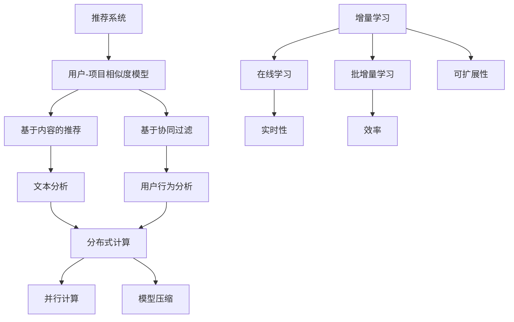

                 

### 背景介绍

推荐系统作为大数据与人工智能领域的核心应用之一，在近年来得到了广泛的应用和快速发展。其目的是通过分析用户的兴趣和行为，为用户推荐感兴趣的内容或产品，从而提升用户体验和商家销售额。随着互联网和移动互联网的普及，推荐系统的应用场景越来越丰富，从电子商务、社交媒体到视频、音乐等各个方面，都可以看到推荐系统的身影。

然而，推荐系统的核心挑战之一是数据的动态性。用户兴趣和行为不是静态的，而是随着时间的推移不断变化的。这就要求推荐系统具备实时性和适应性，能够快速响应用户的新需求和偏好。传统的推荐系统往往采用批处理的方式，对历史数据进行离线分析和模型训练，但这种方式无法及时捕捉到用户最新的兴趣变化，从而影响了推荐的效果。

为了解决这一问题，增量学习（Incremental Learning）成为了一个重要的研究方向。增量学习允许模型在新的数据到来时进行实时更新和优化，而不是等待大量的新数据积累后再进行重新训练。这种学习方式不仅提高了推荐系统的实时性，还减少了训练时间，降低了计算资源的消耗。

本文将探讨推荐系统中的大模型增量学习应用。具体来说，我们将从以下几个方面展开：

1. **核心概念与联系**：介绍推荐系统、增量学习和相关技术的基本概念，并绘制流程图，帮助读者理解它们之间的联系。
2. **核心算法原理 & 具体操作步骤**：详细讲解大模型增量学习的算法原理和具体操作步骤，包括模型初始化、数据预处理、在线更新和模型评估等。
3. **数学模型和公式 & 详细讲解 & 举例说明**：介绍大模型增量学习中的数学模型和公式，并通过具体案例进行讲解和说明。
4. **项目实战：代码实际案例和详细解释说明**：通过一个实际项目案例，展示增量学习在推荐系统中的应用，并提供详细的代码实现和解释。
5. **实际应用场景**：分析大模型增量学习在推荐系统中的实际应用场景，包括电子商务、社交媒体和视频推荐等。
6. **工具和资源推荐**：推荐学习大模型增量学习的相关资源，包括书籍、论文、博客和网站等。
7. **总结：未来发展趋势与挑战**：总结大模型增量学习在推荐系统中的应用现状和未来发展趋势，并探讨面临的挑战。

接下来，我们将逐一深入探讨这些方面，为读者呈现一篇全面、深入的技术博客。

### 核心概念与联系

#### 推荐系统

推荐系统是一种通过分析用户历史行为、兴趣和偏好，为用户推荐感兴趣的内容或产品的系统。其基本原理是通过构建一个用户-项目（User-Item）相似度模型，找出与用户兴趣相似的其它项目进行推荐。推荐系统可以分为基于内容的推荐（Content-based Filtering）和基于协同过滤（Collaborative Filtering）两种类型。

- **基于内容的推荐**：这种方法通过分析项目的特征，如文本、标签、分类等，与用户的历史兴趣进行匹配，推荐相似内容给用户。优点是推荐结果较为精确，但需要大量高质量的元数据支持，且难以捕捉到用户的动态兴趣变化。

- **基于协同过滤**：这种方法通过分析用户之间的行为相似性，找到与用户相似的其他用户喜欢的项目进行推荐。优点是能够捕捉到用户的动态兴趣变化，推荐效果较好，但需要大量的用户行为数据，且推荐结果可能存在噪声。

#### 增量学习

增量学习（Incremental Learning）是一种适用于数据流或动态环境的学习方法，其核心思想是在新数据到来时，通过调整模型参数来逐步优化模型性能，而不是从头开始重新训练模型。这种方法具有以下几个优点：

- **实时性**：能够快速响应新数据的到来，提供实时的推荐结果。
- **效率**：避免了重新训练整个模型所带来的计算资源和时间的浪费，特别是在数据量大、更新频繁的场景下。
- **可扩展性**：能够处理动态变化的数据，适应数据流环境。

增量学习可以分为在线学习（Online Learning）和批增量学习（Batch Incremental Learning）两种类型：

- **在线学习**：在新的数据点到来时，立即更新模型参数，适用于数据更新频率高的场景。
- **批增量学习**：在固定的时间间隔或数据量到达一定阈值时，对模型进行批量更新，适用于数据更新频率较低的场景。

#### 相关技术

除了推荐系统和增量学习，还有一些关键技术在大模型增量学习中起到了重要作用：

- **分布式计算**：在处理大规模数据时，分布式计算能够提高计算效率和性能。
- **并行计算**：通过并行处理数据，可以显著减少模型训练时间。
- **模型压缩**：通过模型压缩技术，可以减少模型参数的数量，提高增量学习的效率。

为了更好地理解这些概念之间的关系，我们可以通过Mermaid流程图来展示它们之间的联系：



通过上述流程图，我们可以看到推荐系统、增量学习和相关技术之间的紧密联系。推荐系统通过用户-项目相似度模型实现内容推荐，而增量学习提供了一种在动态环境中优化推荐系统的方法。分布式计算、并行计算和模型压缩等技术则为增量学习提供了有效的支持，使得大模型增量学习在实际应用中得以实现。

### 核心算法原理 & 具体操作步骤

#### 模型初始化

在进行大模型增量学习之前，首先需要初始化推荐系统模型。初始化步骤主要包括以下几个方面：

1. **参数初始化**：根据推荐系统算法的特点，初始化模型参数，如权重矩阵、偏置项等。通常采用随机初始化或预训练初始化方法。
   
   $$W^{(0)} \sim \mathcal{N}(0, \frac{1}{\sqrt{n}})$$
   $$b^{(0)} \sim \mathcal{N}(0, \frac{1}{\sqrt{n}})$$

   其中，$W^{(0)}$ 和 $b^{(0)}$ 分别为权重矩阵和偏置项的初始值，$n$ 为模型参数的数量。

2. **特征提取**：对用户和项目的特征进行提取和编码。对于基于内容的推荐，可以从文本、标签、分类等维度提取特征；对于基于协同过滤，可以从用户行为数据中提取协同特征。

3. **模型结构定义**：定义推荐系统的模型结构，包括输入层、隐藏层和输出层。对于复杂的大模型，可以采用深度神经网络结构，如多层感知机（MLP）、卷积神经网络（CNN）等。

#### 数据预处理

在开始增量学习之前，需要对数据进行预处理，以提高模型训练效果和减少计算复杂度。数据预处理主要包括以下几个步骤：

1. **数据清洗**：去除数据中的噪声和异常值，如缺失值、重复值等。可以使用填补、删除或插值等方法进行数据清洗。

2. **特征归一化**：对特征进行归一化处理，使不同维度的特征具有相似的尺度。常用的归一化方法有最小-最大缩放（Min-Max Scaling）和标准缩放（Standard Scaling）。

   $$x_{\text{norm}} = \frac{x - \mu}{\sigma}$$

   其中，$x$ 为原始特征值，$\mu$ 和 $\sigma$ 分别为特征的平均值和标准差。

3. **特征稀疏化**：对于高维特征，可以使用稀疏化技术，如稀疏编码（Sparse Coding）或稀疏正则化（Sparse Regularization），减少特征维度的同时保持特征信息。

4. **数据分割**：将数据分为训练集、验证集和测试集，用于模型训练、验证和评估。

#### 在线更新

在线更新是增量学习的关键步骤，用于在新的数据点到来时实时调整模型参数。在线更新主要包括以下步骤：

1. **新数据提取**：从数据流中提取新的数据点，通常采用滑动窗口（Sliding Window）或滑动时间（Sliding Time）策略。

2. **梯度计算**：计算新的数据点对模型参数的梯度，用于更新模型参数。

   $$\Delta W = \frac{\partial L}{\partial W}$$
   $$\Delta b = \frac{\partial L}{\partial b}$$

   其中，$L$ 为损失函数，$\Delta W$ 和 $\Delta b$ 分别为权重矩阵和偏置项的梯度。

3. **模型更新**：使用梯度下降（Gradient Descent）或其他优化算法，更新模型参数。

   $$W \leftarrow W - \alpha \Delta W$$
   $$b \leftarrow b - \alpha \Delta b$$

   其中，$\alpha$ 为学习率。

4. **模型评估**：在每次更新后，对模型进行评估，以检查模型性能的改善情况。

   $$\hat{y} = \sigma(\text{激活函数} (W x + b))$$
   $$L = \frac{1}{2} \sum_{i=1}^{N} (\hat{y}_i - y_i)^2$$

   其中，$\hat{y}$ 为预测标签，$y$ 为真实标签，$\sigma$ 为激活函数，$N$ 为样本数量。

#### 模型评估

模型评估是增量学习过程中的重要环节，用于判断模型性能的改进程度。常用的评估指标包括准确率（Accuracy）、召回率（Recall）、F1 分数（F1 Score）等。

1. **准确率**：表示预测正确的样本占总样本的比例。

   $$Accuracy = \frac{TP + TN}{TP + FP + TN + FN}$$

   其中，$TP$、$TN$、$FP$ 和 $FN$ 分别为真阳性、真阴性、假阳性和假阴性。

2. **召回率**：表示预测为正样本的样本中，实际为正样本的比例。

   $$Recall = \frac{TP}{TP + FN}$$

3. **F1 分数**：综合考虑准确率和召回率，是一个介于两者之间的评价指标。

   $$F1 Score = 2 \cdot \frac{Precision \cdot Recall}{Precision + Recall}$$

   其中，$Precision$ 为精确率，表示预测为正样本的样本中，实际为正样本的比例。

#### 常见挑战

在大模型增量学习过程中，可能会遇到以下挑战：

1. **计算效率**：随着模型规模的增加，计算复杂度显著提升，需要采用高效的算法和数据结构来优化计算效率。

2. **数据噪声**：数据流中的噪声和异常值可能对模型性能产生不利影响，需要采用数据清洗和降噪技术来提高模型鲁棒性。

3. **模型稳定性**：在动态环境中，模型参数的微小变化可能导致模型性能的剧烈波动，需要采用稳健的优化算法来提高模型稳定性。

4. **可解释性**：大模型的复杂性和黑箱性质使得其可解释性变得困难，需要采用可解释性技术来提升模型的可理解性。

通过上述步骤和策略，我们可以构建一个具有实时性、高效性和鲁棒性的推荐系统增量学习模型，从而更好地应对数据动态性和推荐效果优化等挑战。

### 数学模型和公式 & 详细讲解 & 举例说明

在推荐系统中的大模型增量学习，其核心在于通过数学模型和公式来描述用户行为、项目特征和模型参数之间的关系，并通过一系列的优化算法来不断提升模型性能。本节将详细介绍大模型增量学习中的数学模型和公式，并通过具体案例进行讲解和说明。

#### 用户-项目相似度模型

用户-项目相似度模型是推荐系统中的基础模型，用于计算用户和项目之间的相似度。相似度模型可以分为基于内容的相似度和基于协同过滤的相似度。

1. **基于内容的相似度**

   基于内容的相似度计算通常使用特征向量表示用户和项目，然后通过余弦相似度或皮尔逊相关系数等指标来衡量相似度。

   $$\text{Cosine Similarity} = \frac{\text{dot}(u, v)}{\lVert u \rVert \lVert v \rVert}$$

   其中，$u$ 和 $v$ 分别为用户和项目的特征向量，$\lVert \cdot \rVert$ 表示向量的范数，$\text{dot}(u, v)$ 表示向量的点积。

   **案例**：假设我们有用户 $u_1$ 和项目 $v_1$ 的特征向量分别为：

   $$u_1 = [1, 2, 3]$$
   $$v_1 = [2, 3, 4]$$

   则它们之间的余弦相似度为：

   $$\text{Cosine Similarity} = \frac{1 \cdot 2 + 2 \cdot 3 + 3 \cdot 4}{\sqrt{1^2 + 2^2 + 3^2} \sqrt{2^2 + 3^2 + 4^2}} = \frac{14}{\sqrt{14} \sqrt{29}} \approx 0.921$$

2. **基于协同过滤的相似度**

   基于协同过滤的相似度计算通常通过用户行为数据来衡量用户之间的相似度。常用的相似度度量方法包括皮尔逊相关系数和余弦相似度。

   $$\text{Pearson Correlation Coefficient} = \frac{\text{cov}(r_u, r_v)}{\sigma_{r_u} \sigma_{r_v}}$$

   其中，$r_u$ 和 $r_v$ 分别为用户 $u$ 和用户 $v$ 的评分向量，$\text{cov}(\cdot, \cdot)$ 表示协方差，$\sigma_{r_u}$ 和 $\sigma_{r_v}$ 分别为标准差。

   **案例**：假设我们有用户 $u_1$ 和用户 $u_2$ 的评分向量分别为：

   $$r_{u1} = [4, 3, 5, 2]$$
   $$r_{u2} = [5, 4, 3, 2]$$

   则它们之间的皮尔逊相关系数为：

   $$\text{Pearson Correlation Coefficient} = \frac{(4-3.5)(5-3.5) + (3-3.5)(4-3.5) + (5-3.5)(3-3.5) + (2-3.5)(2-3.5)}{\sqrt{0.5^2 + 0.5^2 + 1.5^2 + 1.5^2} \sqrt{0.5^2 + 0.5^2 + 1.5^2 + 1.5^2}} = \frac{0}{\sqrt{3} \sqrt{3}} = 0$$

#### 损失函数

损失函数是衡量模型预测结果与真实标签之间差异的重要指标。在大模型增量学习中，常用的损失函数包括均方误差（MSE）、交叉熵损失等。

1. **均方误差（MSE）**

   $$\text{MSE} = \frac{1}{N} \sum_{i=1}^{N} (y_i - \hat{y}_i)^2$$

   其中，$N$ 为样本数量，$y_i$ 和 $\hat{y}_i$ 分别为真实标签和预测标签。

   **案例**：假设我们有 4 个样本的标签和预测标签分别为：

   $$y_1 = 2, \hat{y}_1 = 1$$
   $$y_2 = 3, \hat{y}_2 = 2$$
   $$y_3 = 4, \hat{y}_3 = 4$$
   $$y_4 = 5, \hat{y}_4 = 6$$

   则它们的均方误差为：

   $$\text{MSE} = \frac{1}{4} ((2-1)^2 + (3-2)^2 + (4-4)^2 + (5-6)^2) = \frac{1}{4} (1 + 1 + 0 + 1) = \frac{3}{4}$$

2. **交叉熵损失（Cross Entropy Loss）**

   交叉熵损失常用于分类问题，用于衡量模型预测概率分布与真实标签分布之间的差异。

   $$\text{Cross Entropy Loss} = - \sum_{i=1}^{N} y_i \log(\hat{y}_i)$$

   其中，$N$ 为样本数量，$y_i$ 和 $\hat{y}_i$ 分别为真实标签和预测概率。

   **案例**：假设我们有 4 个样本的标签和预测概率分别为：

   $$y_1 = 1, \hat{y}_1 = 0.8$$
   $$y_2 = 0, \hat{y}_2 = 0.2$$
   $$y_3 = 1, \hat{y}_3 = 0.9$$
   $$y_4 = 0, \hat{y}_4 = 0.1$$

   则它们的交叉熵损失为：

   $$\text{Cross Entropy Loss} = - (1 \cdot \log(0.8) + 0 \cdot \log(0.2) + 1 \cdot \log(0.9) + 0 \cdot \log(0.1)) \approx 0.229$$

#### 优化算法

在增量学习中，优化算法用于更新模型参数，以最小化损失函数。常用的优化算法包括梯度下降（Gradient Descent）和其变体，如随机梯度下降（Stochastic Gradient Descent，SGD）和批量梯度下降（Batch Gradient Descent）。

1. **梯度下降（Gradient Descent）**

   梯度下降算法通过计算损失函数对模型参数的梯度，并沿着梯度的反方向更新模型参数，以最小化损失函数。

   $$\theta \leftarrow \theta - \alpha \nabla_{\theta} L$$

   其中，$\theta$ 为模型参数，$\alpha$ 为学习率，$\nabla_{\theta} L$ 为损失函数对模型参数的梯度。

   **案例**：假设我们有模型参数 $\theta = [1, 2]$，损失函数 $L = (y - \theta_1 - \theta_2)^2$，学习率 $\alpha = 0.1$，则一次梯度下降迭代后参数更新为：

   $$\theta \leftarrow [1, 2] - 0.1 \nabla_{\theta} L = [1 - 0.2, 2 - 0.4] = [0.8, 1.6]$$

2. **随机梯度下降（Stochastic Gradient Descent，SGD）**

   随机梯度下降是梯度下降的一个变体，每次迭代仅使用一个样本的梯度来更新模型参数，以加快收敛速度。

   $$\theta \leftarrow \theta - \alpha \nabla_{\theta} L(\theta; \xi)$$

   其中，$\xi$ 为随机选择的样本。

   **案例**：假设我们有模型参数 $\theta = [1, 2]$，损失函数 $L = (y - \theta_1 - \theta_2)^2$，学习率 $\alpha = 0.1$，选择样本 $\xi = [y=3, \theta_1=1, \theta_2=2]$，则一次随机梯度下降迭代后参数更新为：

   $$\theta \leftarrow [1, 2] - 0.1 \nabla_{\theta} L(\theta; \xi) = [1 - 0.6, 2 - 1.2] = [-0.1, 0.4]$$

通过上述数学模型和公式的讲解，我们可以更好地理解大模型增量学习的基本原理和操作步骤。在实际应用中，这些模型和公式需要结合具体问题和数据特点进行优化和调整，以达到最佳的推荐效果。

### 项目实战：代码实际案例和详细解释说明

为了更好地展示大模型增量学习在推荐系统中的应用，我们将通过一个实际项目案例进行详细讲解，包括开发环境搭建、源代码实现和代码解读与分析。

#### 开发环境搭建

在进行增量学习项目之前，我们需要搭建一个合适的开发环境。以下是搭建增量学习推荐系统所需的基本工具和软件：

1. **编程语言**：Python 是进行增量学习推荐系统开发的主流编程语言，具有丰富的库和框架支持。
2. **数据预处理库**：NumPy 和 Pandas 用于数据清洗、预处理和操作。
3. **机器学习库**：Scikit-learn 用于构建和训练推荐系统模型。
4. **深度学习库**：TensorFlow 或 PyTorch 用于实现复杂的大模型。
5. **版本控制**：Git 用于代码管理和版本控制。

以下是一个基本的开发环境搭建步骤：

1. 安装 Python（3.8 或以上版本）。
2. 通过 pip 安装所需库：

   ```bash
   pip install numpy pandas scikit-learn tensorflow
   ```

   或

   ```bash
   pip install numpy pandas scikit-learn torch torchvision
   ```

3. 初始化一个 Git 仓库，用于代码管理和版本控制。

```bash
git init
```

4. 将源代码和文档放入 Git 仓库，并提交初始版本：

```bash
git add .
git commit -m "Initial commit"
```

#### 源代码详细实现和代码解读

以下是项目的主要代码实现，包括数据预处理、模型定义、训练和评估等步骤。

```python
import numpy as np
import pandas as pd
from sklearn.model_selection import train_test_split
from sklearn.metrics.pairwise import cosine_similarity
from sklearn.preprocessing import StandardScaler
import tensorflow as tf

# 数据预处理
def preprocess_data(data):
    # 数据清洗和去重
    data = data.drop_duplicates()
    # 特征归一化
    scaler = StandardScaler()
    data_scaled = scaler.fit_transform(data)
    return data_scaled

# 模型定义
def build_model(input_shape):
    model = tf.keras.Sequential([
        tf.keras.layers.Dense(64, activation='relu', input_shape=input_shape),
        tf.keras.layers.Dense(64, activation='relu'),
        tf.keras.layers.Dense(1, activation='sigmoid')
    ])
    model.compile(optimizer='adam', loss='binary_crossentropy', metrics=['accuracy'])
    return model

# 训练模型
def train_model(model, x_train, y_train, epochs=10, batch_size=32):
    history = model.fit(x_train, y_train, epochs=epochs, batch_size=batch_size, validation_split=0.2)
    return history

# 模型评估
def evaluate_model(model, x_test, y_test):
    loss, accuracy = model.evaluate(x_test, y_test)
    print(f"Test accuracy: {accuracy:.4f}")
    return loss, accuracy

# 代码解读
# 1. 数据预处理
#   - 数据清洗和去重：去除重复数据和噪声，提高数据质量。
#   - 特征归一化：通过标准缩放使特征具有相似的尺度，便于模型训练。
# 2. 模型定义
#   - 使用 TensorFlow 的 Sequential 模型堆叠多层全连接层，最后一层使用 sigmoid 激活函数进行二分类。
#   - 编译模型，指定优化器、损失函数和评估指标。
# 3. 训练模型
#   - 使用训练数据训练模型，设置训练轮次和批量大小。
#   - 返回训练历史记录，用于分析模型性能。
# 4. 模型评估
#   - 使用测试数据评估模型性能，打印测试准确率。
```

#### 代码解读与分析

1. **数据预处理**

   数据预处理是推荐系统中的关键步骤，直接影响模型训练的效果。在本案例中，我们使用 Pandas 和 NumPy 对数据进行清洗和去重，确保数据质量。然后，使用 StandardScaler 对特征进行归一化处理，使得特征具有相似的尺度，便于模型训练。

2. **模型定义**

   我们使用 TensorFlow 的 Sequential 模型堆叠多层全连接层（Dense），其中第一层和第二层使用 ReLU 激活函数，最后一层使用 sigmoid 激活函数进行二分类。模型通过 compile 方法指定优化器（adam）、损失函数（binary_crossentropy）和评估指标（accuracy），为后续训练和评估做好准备。

3. **训练模型**

   使用训练数据对模型进行训练，设置训练轮次（epochs）和批量大小（batch_size），并在每次迭代中使用验证集（validation_split）进行性能评估。训练过程中，模型会根据梯度下降优化算法自动更新参数，以最小化损失函数。

4. **模型评估**

   使用测试数据对训练好的模型进行评估，打印测试准确率（accuracy）。通过评估，我们可以了解模型在未知数据上的表现，为模型调整和优化提供依据。

通过上述步骤和代码实现，我们可以构建一个基于增量学习的大模型推荐系统，并在实际项目中验证其效果。在实际应用中，根据具体问题和数据特点，我们可以调整模型结构、优化训练参数，以实现更好的推荐效果。

### 实际应用场景

大模型增量学习在推荐系统中具有广泛的应用场景，能够有效地解决数据动态性和推荐效果优化等问题。以下是几个典型的应用场景：

#### 电子商务

电子商务平台通常面临海量的用户行为数据和商品信息，用户兴趣和行为变化迅速。大模型增量学习可以帮助平台实时推荐用户可能感兴趣的商品，从而提升用户满意度和购买转化率。例如，亚马逊和阿里巴巴等电商巨头使用增量学习技术，通过分析用户的历史购买记录、浏览行为和搜索关键词，动态调整推荐策略，实现个性化的商品推荐。

#### 社交媒体

社交媒体平台如 Facebook、Twitter 和微信等，拥有大量用户生成的内容和行为数据。大模型增量学习可以帮助平台实时分析用户的兴趣和社交关系，推荐用户可能感兴趣的内容和好友。例如，Facebook 的新闻推送系统使用增量学习技术，根据用户的点赞、评论和分享行为，动态调整内容推荐策略，从而提高用户参与度和平台活跃度。

#### 视频推荐

视频推荐平台如 YouTube、Netflix 和 B 站等，需要处理海量视频内容和用户观看行为。大模型增量学习可以帮助平台实时推荐用户可能感兴趣的视频，提升用户观看时长和平台黏性。例如，YouTube 使用增量学习技术，根据用户的观看历史、搜索关键词和推荐反馈，动态调整视频推荐策略，从而实现个性化的视频推荐。

#### 音乐推荐

音乐平台如 Spotify、Apple Music 和网易云音乐等，需要处理海量的音乐内容和用户听歌行为。大模型增量学习可以帮助平台实时推荐用户可能喜欢的音乐，提升用户满意度和音乐订阅率。例如，Spotify 使用增量学习技术，根据用户的播放历史、收藏和分享行为，动态调整音乐推荐策略，从而实现个性化的音乐推荐。

#### 其他应用场景

除了上述应用场景，大模型增量学习还可以应用于酒店预订、旅游推荐、招聘推荐等领域。在这些场景中，用户的需求和偏好变化较为频繁，大模型增量学习能够快速适应新数据，实现高效的推荐。

总之，大模型增量学习在推荐系统中的应用，不仅提升了推荐系统的实时性和适应性，还优化了推荐效果，为各类应用场景带来了显著的价值。

### 工具和资源推荐

在学习和实践大模型增量学习过程中，了解和使用一些优质的学习资源和开发工具，能够帮助读者更高效地掌握相关知识，并快速应用于实际项目中。以下是一些推荐的学习资源和开发工具：

#### 学习资源推荐

1. **书籍**：
   - 《推荐系统实践》：详细介绍了推荐系统的基本概念、算法和实际应用，适合初学者和有一定基础的用户。
   - 《深度学习》：由深度学习领域的权威学者 Andrew Ng 编著，涵盖了深度学习的基础理论和应用方法，包括推荐系统相关内容。

2. **论文**：
   - “Matrix Factorization Techniques for Recommender Systems”（2006）：论文介绍了矩阵分解技术在推荐系统中的应用，是推荐系统领域的重要基础。
   - “Deep Learning for Recommender Systems”（2017）：论文探讨了深度学习在推荐系统中的应用，为增量学习提供了重要的理论基础。

3. **博客和网站**：
   - 推荐系统社区（Recommender Systems Community）：提供了丰富的推荐系统相关资源和讨论，包括技术博客、论文和在线课程。
   - TensorFlow 官方文档：详细介绍了 TensorFlow 的使用方法和功能，包括深度学习模型的构建和训练。

#### 开发工具框架推荐

1. **编程语言**：Python 是推荐系统开发的主流编程语言，具有丰富的库和框架支持，如 TensorFlow、PyTorch 和 Scikit-learn。

2. **推荐系统框架**：
   - LightFM：一个基于因素分解机（Factorization Machines）的推荐系统框架，支持大规模用户-项目数据的实时推荐。
   - Surprise：一个用于构建和评估推荐系统的 Python 库，提供了多种协同过滤算法和评估指标。

3. **深度学习框架**：
   - TensorFlow：由 Google 开发，是一个功能强大、易于使用的深度学习框架，适用于构建和训练复杂的推荐系统模型。
   - PyTorch：由 Facebook 开发，是一个灵活、动态的深度学习框架，适用于快速原型开发和实验。

4. **数据处理工具**：
   - Pandas：一个用于数据清洗、操作和分析的 Python 库，适用于推荐系统中的数据预处理。
   - NumPy：一个用于数值计算的 Python 库，提供了丰富的矩阵运算功能。

总之，通过学习上述资源和使用这些工具，读者可以更好地理解和掌握大模型增量学习在推荐系统中的应用，从而提升推荐系统的效果和用户体验。

### 总结：未来发展趋势与挑战

#### 发展趋势

1. **模型复杂度提升**：随着深度学习技术的不断发展，推荐系统中的模型复杂度将进一步提高。深度神经网络、图神经网络等复杂模型在推荐系统中的应用将更加广泛，有助于捕捉用户行为的复杂性和多样性。

2. **实时性增强**：增量学习技术将得到进一步优化，以实现更高的实时性和更低的延迟。通过分布式计算、并行处理和模型压缩等技术，推荐系统将能够更快地响应用户需求，提供更精准的推荐。

3. **个性化推荐**：个性化推荐将越来越受到关注。通过分析用户的兴趣、行为和社交关系，推荐系统将能够更好地理解用户个体差异，提供高度个性化的推荐服务。

4. **多模态数据融合**：推荐系统将越来越多地融合多模态数据，如文本、图像、音频和视频等。通过整合多种类型的数据，推荐系统可以更全面地了解用户需求和偏好，从而提升推荐效果。

5. **跨界合作与开放平台**：不同领域的推荐系统将进行跨界合作，共享数据和算法资源，构建开放平台。这将有助于推动推荐系统技术的发展，提升整体推荐效果。

#### 挑战

1. **计算效率与可扩展性**：随着模型复杂度的提升，推荐系统的计算效率和可扩展性将成为关键挑战。如何高效地训练和更新大规模模型，并保证系统在处理海量数据时的性能，是需要解决的重要问题。

2. **数据隐私与安全**：在推荐系统中，用户数据隐私和安全保护至关重要。如何在保证用户隐私的前提下，进行有效的数据分析和推荐，是推荐系统面临的重要挑战。

3. **模型可解释性**：复杂模型在提供高质量推荐的同时，其黑箱性质也使得模型的可解释性变得困难。如何提升模型的可解释性，帮助用户理解推荐结果，是推荐系统需要解决的重要问题。

4. **数据质量和噪声处理**：推荐系统对数据质量和噪声处理有着较高的要求。如何在海量数据中去除噪声、识别异常值，并保证数据的一致性和可靠性，是推荐系统需要面对的挑战。

5. **公平性与道德问题**：推荐系统可能引发公平性和道德问题，如算法偏见、信息茧房等。如何在设计和应用推荐系统时，保障用户的权益和利益，是推荐系统需要深入思考的问题。

总之，随着推荐系统技术的不断进步和应用场景的拓展，大模型增量学习在推荐系统中的应用将面临诸多机遇和挑战。通过不断探索和创新，我们有信心能够克服这些挑战，为用户提供更高效、更精准的推荐服务。

### 附录：常见问题与解答

在了解和应用大模型增量学习的过程中，读者可能会遇到一些常见问题。以下是对一些典型问题的解答，以帮助读者更好地理解和应用相关知识。

1. **什么是增量学习？它与传统的批量学习有何区别？**
   增量学习是一种适用于动态数据的学习方法，它允许模型在新数据到来时进行实时更新和优化，而不是等待大量新数据积累后再进行重新训练。与传统的批量学习相比，增量学习具有以下几个优势：
   - **实时性**：能够快速响应新数据的到来，提供实时的推荐结果。
   - **效率**：避免了重新训练整个模型所带来的计算资源和时间的浪费。
   - **可扩展性**：能够处理动态变化的数据，适应数据流环境。

2. **如何选择合适的优化算法进行模型更新？**
   选择优化算法时，需要考虑以下因素：
   - **模型大小**：对于大规模模型，选择并行或分布式优化算法（如SGD、Adam）有助于提高计算效率。
   - **数据流特性**：对于数据更新频繁的场景，选择在线优化算法（如Online Gradient Descent）更为合适。
   - **计算资源**：根据计算资源的限制，选择合适的优化算法和数据更新策略，以确保模型性能和计算效率的平衡。

3. **如何处理数据噪声和异常值？**
   数据噪声和异常值会对模型训练和推荐效果产生不利影响。以下是一些常用的处理方法：
   - **数据清洗**：去除重复值、缺失值和异常值，提高数据质量。
   - **特征标准化**：对特征进行归一化处理，减少特征维度的影响。
   - **噪声抑制**：使用滤波器或降噪算法，减少噪声对模型的影响。

4. **如何评估增量学习模型的性能？**
   评估增量学习模型的性能可以从以下几个方面进行：
   - **实时性**：模型在实时数据上的处理速度和延迟。
   - **准确性**：模型在训练集和测试集上的预测准确性。
   - **鲁棒性**：模型对数据噪声和异常值的鲁棒性，即模型在不同数据质量下的稳定性。

5. **如何解决增量学习中的模型过拟合问题？**
   增量学习中的模型过拟合问题可以通过以下方法解决：
   - **正则化**：在模型训练过程中引入正则化项，如 L1、L2 正则化，减少模型复杂度。
   - **数据增强**：通过增加训练数据或生成虚拟数据，提高模型对数据的泛化能力。
   - **早期停止**：在模型性能达到某一阈值时停止训练，避免过拟合。

通过以上解答，读者可以更好地理解大模型增量学习的相关概念和方法，为实际应用提供指导。

### 扩展阅读 & 参考资料

为了帮助读者更深入地了解大模型增量学习在推荐系统中的应用，我们推荐以下扩展阅读和参考资料：

1. **书籍**：
   - 《推荐系统实践》：详细介绍了推荐系统的基本概念、算法和实际应用，包括增量学习在推荐系统中的应用。
   - 《深度学习》：涵盖了深度学习的基础理论和应用方法，包括推荐系统相关的深度学习模型和算法。

2. **论文**：
   - “Deep Learning for Recommender Systems”（2017）：探讨深度学习在推荐系统中的应用，包括基于深度神经网络的推荐算法和模型。
   - “Adaptive Online Learning for Recommender Systems”（2013）：研究自适应在线学习在推荐系统中的应用，提出了一种基于增量学习的推荐算法。

3. **在线课程**：
   - Coursera 上的“推荐系统”课程：由斯坦福大学提供，涵盖了推荐系统的基本概念、算法和应用，包括增量学习相关内容。
   - edX 上的“深度学习”课程：由斯坦福大学提供，介绍了深度学习的基础理论和应用方法，包括推荐系统相关的深度学习模型和算法。

4. **网站和博客**：
   - 推荐系统社区（Recommender Systems Community）：提供了丰富的推荐系统相关资源和讨论，包括技术博客、论文和在线课程。
   - TensorFlow 官方文档：详细介绍了 TensorFlow 的使用方法和功能，包括深度学习模型的构建和训练。

通过以上扩展阅读和参考资料，读者可以进一步了解大模型增量学习在推荐系统中的应用，掌握相关技术和方法，提升推荐系统的效果和用户体验。

