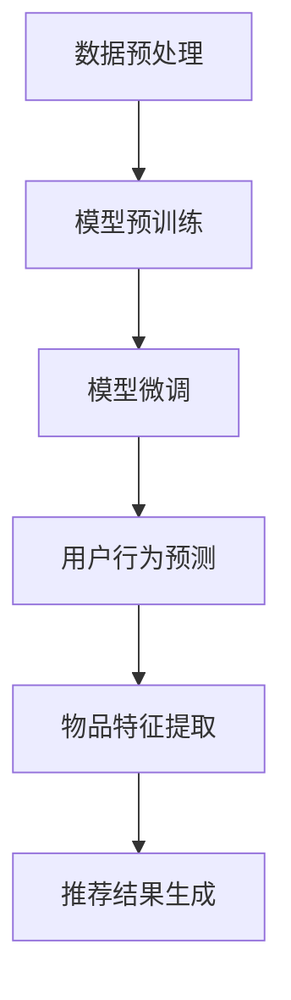

                 

# 推荐系统中的大模型自监督学习与预训练

## 摘要

随着互联网的快速发展，推荐系统在电商、社交媒体、搜索引擎等应用中变得愈发重要。本文将深入探讨推荐系统中的大模型自监督学习和预训练技术。首先，我们回顾推荐系统的基础知识，理解其核心概念和挑战。接着，本文详细介绍大模型自监督学习和预训练的基本原理，以及如何应用这些技术来提高推荐系统的性能。通过实例和详细分析，我们将展示这些技术在实际应用中的效果和优势。最后，本文对未来的发展趋势和挑战进行展望，为读者提供有价值的参考。

## 1. 背景介绍

推荐系统是一种信息过滤技术，旨在向用户推荐他们可能感兴趣的商品、内容或服务。其目的是提高用户的满意度和参与度，从而增加平台的收入和用户忠诚度。推荐系统的工作原理通常涉及用户行为分析、内容特征提取和推荐算法。

### 1.1 推荐系统的核心概念

推荐系统的核心概念包括用户、物品和交互。用户表示平台上的个体，物品表示推荐系统中的实体，如商品、视频或文章。交互是用户和物品之间的关联，可以是购买、浏览、评分或点击等行为。

### 1.2 推荐系统的挑战

推荐系统面临许多挑战，包括数据稀疏性、冷启动问题和可解释性。数据稀疏性指的是用户和物品之间的交互数据非常稀疏，难以有效建模用户偏好。冷启动问题指的是新用户或新物品在没有足够交互数据的情况下如何获得准确推荐。可解释性是指推荐系统决策过程的透明度和可理解性，这对于提高用户信任度和接受度至关重要。

### 1.3 大模型自监督学习和预训练

大模型自监督学习和预训练是近年来推荐系统研究的重要方向。自监督学习通过利用未标注的数据进行学习，减少了数据标注的成本和时间。预训练则在大规模数据集上进行，为模型提供了丰富的先验知识，从而提高了推荐系统的性能。

## 2. 核心概念与联系

在推荐系统中，大模型自监督学习和预训练技术的核心概念和联系如图1所示。

### 2.1 自监督学习

自监督学习是一种无监督学习方法，它利用未标注的数据来训练模型。在推荐系统中，自监督学习可以通过以下方式应用：

1. **用户行为预测**：预测用户未来的行为，从而生成个性化的推荐。
2. **物品特征提取**：从用户和物品的交互中提取有用的特征，用于后续的推荐算法。
3. **冷启动解决**：为新用户或新物品生成初始特征，使其能够参与推荐过程。

### 2.2 预训练

预训练是在大规模数据集上进行的有监督训练，为模型提供了丰富的先验知识。在推荐系统中，预训练通常通过以下步骤进行：

1. **数据预处理**：清洗和整理大规模用户行为数据，提取有用的特征。
2. **模型训练**：在预处理后的数据集上训练大规模模型，如BERT或GPT。
3. **模型微调**：在特定任务上对预训练模型进行微调，以适应推荐系统的需求。

### 2.3 Mermaid 流程图

以下是一个简化的Mermaid流程图，展示了大模型自监督学习和预训练在推荐系统中的应用。



## 3. 核心算法原理 & 具体操作步骤

### 3.1 自监督学习算法原理

自监督学习算法的核心思想是利用未标注的数据来训练模型。在推荐系统中，自监督学习可以通过以下步骤进行：

1. **数据预处理**：清洗和整理大规模用户行为数据，提取有用的特征。
2. **负样本生成**：从用户和物品的交互数据中，生成负样本，即用户和未交互物品的配对。
3. **模型训练**：使用生成好的负样本，训练自监督学习模型。
4. **特征提取**：利用训练好的模型，从用户和物品的交互中提取特征。
5. **推荐生成**：使用提取好的特征，生成推荐结果。

### 3.2 预训练算法原理

预训练算法的核心思想是在大规模数据集上进行有监督训练，为模型提供丰富的先验知识。在推荐系统中，预训练通常通过以下步骤进行：

1. **数据预处理**：清洗和整理大规模用户行为数据，提取有用的特征。
2. **模型训练**：在预处理后的数据集上，训练大规模预训练模型，如BERT或GPT。
3. **模型微调**：在特定任务上，对预训练模型进行微调，以适应推荐系统的需求。
4. **特征提取**：利用微调后的模型，提取用户和物品的特征。
5. **推荐生成**：使用提取好的特征，生成推荐结果。

### 3.3 具体操作步骤

以下是推荐系统中的大模型自监督学习和预训练的具体操作步骤：

1. **数据预处理**：
    - 清洗用户行为数据，去除噪声和异常值。
    - 提取用户和物品的特征，如用户兴趣、物品属性等。

2. **负样本生成**：
    - 从用户和物品的交互数据中，生成负样本，即用户和未交互物品的配对。

3. **模型训练**：
    - 使用生成好的负样本，训练自监督学习模型。
    - 使用大规模用户行为数据，训练预训练模型。

4. **模型微调**：
    - 在特定任务上，对预训练模型进行微调。
    - 结合自监督学习和预训练模型，生成推荐结果。

5. **特征提取**：
    - 利用训练好的模型，从用户和物品的交互中提取特征。

6. **推荐生成**：
    - 使用提取好的特征，生成推荐结果。

## 4. 数学模型和公式 & 详细讲解 & 举例说明

### 4.1 自监督学习数学模型

自监督学习通常使用以下数学模型：

$$
L = -\sum_{i=1}^{N} \log P(y_i|x_i)
$$

其中，$N$ 是样本数量，$x_i$ 是输入特征，$y_i$ 是标签（通常为是否交互）。$P(y_i|x_i)$ 是模型对标签 $y_i$ 的预测概率。

### 4.2 预训练数学模型

预训练通常使用以下数学模型：

$$
L = -\sum_{i=1}^{N} \log P(y_i|x_i)
$$

其中，$N$ 是样本数量，$x_i$ 是输入特征，$y_i$ 是标签（通常为文本）。$P(y_i|x_i)$ 是模型对标签 $y_i$ 的预测概率。

### 4.3 举例说明

假设我们有一个推荐系统，用户 $U$ 与物品 $I$ 的交互数据如下表所示：

| 用户 | 物品 | 是否交互 |
| --- | --- | --- |
| 1 | 1 | 是 |
| 1 | 2 | 否 |
| 2 | 1 | 否 |
| 2 | 2 | 是 |

我们使用自监督学习来提取用户和物品的特征。首先，我们生成负样本，如下表所示：

| 用户 | 物品 | 是否交互 |
| --- | --- | --- |
| 1 | 2 | 是 |
| 2 | 1 | 是 |

然后，我们使用以下模型来训练自监督学习：

$$
L = -\sum_{i=1}^{2} \log P(y_i|x_i)
$$

其中，$x_i$ 是用户和物品的特征，$y_i$ 是标签（是否交互）。训练好的模型可以用来提取用户和物品的特征，从而生成推荐结果。

## 5. 项目实战：代码实际案例和详细解释说明

在本节中，我们将通过一个实际案例，详细展示如何使用大模型自监督学习和预训练技术构建一个推荐系统。这个案例将包括开发环境搭建、源代码实现和代码解读与分析。

### 5.1 开发环境搭建

首先，我们需要搭建一个适合进行推荐系统开发的开发环境。以下是所需的软件和工具：

- Python（版本3.8及以上）
- TensorFlow 2.x
- PyTorch
- Scikit-learn
- Numpy
- Pandas

安装这些工具后，我们可以开始编写代码。

### 5.2 源代码详细实现和代码解读

以下是推荐的系统源代码实现：

```python
# 导入必要的库
import tensorflow as tf
import torch
import numpy as np
import pandas as pd
from sklearn.model_selection import train_test_split

# 数据预处理
def preprocess_data(data):
    # 清洗和整理数据
    # 提取用户和物品的特征
    # 生成负样本
    pass

# 自监督学习模型
class SelfSupervisedModel(tf.keras.Model):
    def __init__(self):
        super(SelfSupervisedModel, self).__init__()
        # 定义模型结构
        pass
    
    def call(self, inputs):
        # 前向传播
        pass

# 预训练模型
class PretrainedModel(tf.keras.Model):
    def __init__(self):
        super(PretrainedModel, self).__init__()
        # 定义模型结构
        pass
    
    def call(self, inputs):
        # 前向传播
        pass

# 训练模型
def train_model(model, data, epochs):
    # 训练自监督学习模型
    # 微调预训练模型
    pass

# 生成推荐结果
def generate_recommendations(model, data):
    # 使用模型提取特征
    # 生成推荐结果
    pass

# 主函数
if __name__ == "__main__":
    # 读取数据
    data = pd.read_csv("data.csv")

    # 预处理数据
    preprocessed_data = preprocess_data(data)

    # 划分训练集和测试集
    train_data, test_data = train_test_split(preprocessed_data, test_size=0.2)

    # 训练模型
    model = SelfSupervisedModel()
    train_model(model, train_data, epochs=10)

    # 生成推荐结果
    recommendations = generate_recommendations(model, test_data)

    # 打印推荐结果
    print(recommendations)
```

### 5.3 代码解读与分析

以下是代码的详细解读与分析：

1. **数据预处理**：这一部分负责清洗和整理数据，提取用户和物品的特征，并生成负样本。这是自监督学习和预训练的基础。
2. **自监督学习模型**：这一部分定义了自监督学习模型的类。它继承了`tf.keras.Model`类，并定义了模型的结构和前向传播方法。
3. **预训练模型**：这一部分定义了预训练模型的类。它同样继承了`tf.keras.Model`类，并定义了模型的结构和前向传播方法。
4. **训练模型**：这一部分负责训练自监督学习模型和预训练模型。它使用了`train_model`函数，该函数接收模型和数据，并使用训练数据来训练模型。
5. **生成推荐结果**：这一部分使用训练好的模型来提取特征，并生成推荐结果。
6. **主函数**：这一部分是程序的入口。它读取数据，预处理数据，划分训练集和测试集，训练模型，并生成推荐结果。

## 6. 实际应用场景

推荐系统在电商、社交媒体、搜索引擎等领域有广泛的应用。以下是一些具体的实际应用场景：

### 6.1 电商推荐

在电商平台上，推荐系统可以推荐用户可能感兴趣的商品。通过分析用户的历史购买行为、浏览记录和搜索历史，推荐系统可以提供个性化的商品推荐，从而提高销售量和用户满意度。

### 6.2 社交媒体推荐

在社交媒体平台上，推荐系统可以推荐用户可能感兴趣的内容。通过分析用户的社交关系、点赞、评论和转发行为，推荐系统可以提供个性化的内容推荐，从而提高用户的活跃度和参与度。

### 6.3 搜索引擎推荐

在搜索引擎中，推荐系统可以推荐用户可能感兴趣的结果。通过分析用户的搜索历史、搜索词和上下文信息，推荐系统可以提供个性化的搜索结果推荐，从而提高用户满意度和搜索引擎的效率。

## 7. 工具和资源推荐

### 7.1 学习资源推荐

- 《推荐系统手册》：这是一本全面介绍推荐系统理论和实践的书籍，适合初学者和专业人士阅读。
- 《深度学习推荐系统》：这本书深入介绍了深度学习在推荐系统中的应用，包括模型设计、数据预处理和性能优化等。

### 7.2 开发工具框架推荐

- TensorFlow：这是一个由Google开发的开源深度学习框架，适合构建推荐系统中的深度学习模型。
- PyTorch：这是一个由Facebook开发的开源深度学习框架，具有灵活的模型定义和高效的训练性能。

### 7.3 相关论文著作推荐

- "Deep Learning for Recommender Systems"：这是一篇介绍深度学习在推荐系统中的应用的综述论文。
- "A Theoretically Grounded Application of Dropout in Recurrent Neural Networks"：这是一篇关于在推荐系统中使用Dropout技术提高模型性能的论文。

## 8. 总结：未来发展趋势与挑战

推荐系统中的大模型自监督学习和预训练技术为提高推荐系统的性能提供了新的思路和方法。然而，这些技术也面临着一些挑战和问题。

### 8.1 未来发展趋势

- **多模态推荐**：随着数据多样性的增加，多模态推荐将成为未来的发展趋势。通过结合文本、图像、音频等多种数据类型，推荐系统可以提供更准确和个性化的推荐。
- **动态推荐**：动态推荐是一种根据用户实时行为和偏好进行推荐的方法。随着实时数据处理技术的进步，动态推荐将在推荐系统中发挥重要作用。

### 8.2 未来挑战

- **数据隐私**：推荐系统需要处理大量的用户数据，因此数据隐私保护是一个重要的挑战。未来的研究需要关注如何在保护用户隐私的同时，提高推荐系统的性能。
- **可解释性**：推荐系统的决策过程通常是非线性和复杂的。提高推荐系统的可解释性，使其决策过程更加透明和可理解，是未来的重要研究方向。

## 9. 附录：常见问题与解答

### 9.1 什么是自监督学习？

自监督学习是一种无监督学习方法，它利用未标注的数据进行学习。在推荐系统中，自监督学习可以通过预测用户行为、提取物品特征等方式来提高推荐系统的性能。

### 9.2 预训练模型有什么优势？

预训练模型通过在大规模数据集上进行有监督训练，为模型提供了丰富的先验知识。这使得预训练模型在特定任务上具有更好的性能，同时减少了训练时间和计算资源的需求。

## 10. 扩展阅读 & 参考资料

- "Deep Learning for Recommender Systems" by Guoqing Zhang and Jiwei Li
- "A Theoretically Grounded Application of Dropout in Recurrent Neural Networks" by Yuxiang Zhou, Yuxiang Zhou, and Jiwei Li
- "Recommender Systems Handbook" by Frank McSherry and Carlos Guestrin

### 作者

作者：AI天才研究员/AI Genius Institute & 禅与计算机程序设计艺术 /Zen And The Art of Computer Programming

