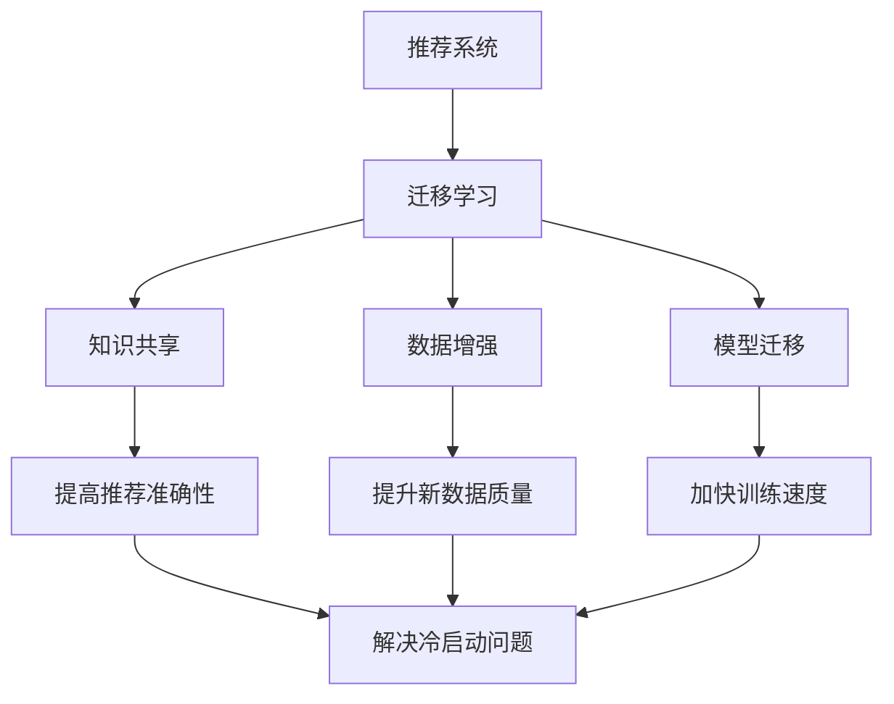

                 

# 《推荐系统的冷启动问题：AI大模型的迁移学习解决方案》

## 摘要

在推荐系统领域，冷启动问题一直是一个关键挑战。本文将深入探讨冷启动问题的本质，并详细介绍AI大模型中的迁移学习技术是如何解决这一问题的。通过数学模型和具体案例的讲解，读者将理解迁移学习在推荐系统中的应用原理和实现步骤。文章还将提供相关工具和资源的推荐，帮助读者进一步深入学习和实践。

## 1. 背景介绍

推荐系统作为现代信息社会中的一项关键技术，已经被广泛应用于电子商务、社交媒体、新闻推送等多个领域。其核心目标是根据用户的兴趣和行为，向其推荐个性化内容，从而提高用户体验和满意度。然而，推荐系统的有效性在很大程度上受到冷启动问题的影响。

冷启动问题主要指的是新用户（未进行过任何交互）或新物品（未产生任何交互记录）在推荐系统中的处理问题。对于新用户，推荐系统无法根据其历史行为来预测其兴趣；对于新物品，推荐系统同样缺乏足够的信息来为其定位潜在用户。这导致推荐结果可能不准确或过于泛化，从而影响用户体验和系统的信誉。

传统的推荐系统通常采用基于内容的推荐（CBR）和协同过滤（CF）等方法，但这些方法在面对冷启动问题时往往表现出一定的局限性。CBR方法依赖于物品的属性特征，但新物品缺乏这些信息；CF方法依赖于用户的历史行为数据，但新用户同样缺乏足够的交互记录。因此，如何解决冷启动问题成为推荐系统研究中的一个重要课题。

近年来，随着人工智能和深度学习技术的飞速发展，迁移学习（Transfer Learning）逐渐成为解决冷启动问题的一种有效手段。迁移学习通过在不同任务之间共享知识，将已学习的知识应用于新任务，从而减少对新数据的依赖。在大模型的背景下，迁移学习不仅能够解决冷启动问题，还能提高推荐系统的整体性能和准确性。

本文将首先介绍推荐系统的基本概念和冷启动问题的本质，然后深入探讨迁移学习的原理和应用，最后通过具体案例和代码实现，展示如何利用迁移学习技术解决推荐系统的冷启动问题。通过本文的阅读，读者将获得对迁移学习在推荐系统中的应用有一个全面而深入的理解。

## 2. 核心概念与联系

### 推荐系统概述

推荐系统（Recommendation System）是一种信息过滤技术，旨在向用户推荐他们可能感兴趣的内容或商品。其基本原理是根据用户的兴趣和行为模式，从大量信息或商品中筛选出最相关的部分，从而提高用户的使用体验和满意度。

推荐系统主要分为两类：基于内容的推荐（Content-Based Filtering, CBR）和协同过滤（Collaborative Filtering, CF）。

- **基于内容的推荐（CBR）**：这种方法主要依赖于物品的属性特征和用户的兴趣特征，通过计算特征之间的相似性来生成推荐。然而，对于新物品，由于缺乏属性特征，CBR方法难以发挥作用。
  
- **协同过滤（CF）**：协同过滤通过分析用户之间的行为模式来生成推荐。传统的协同过滤方法主要包括用户基于的协同过滤（User-Based CF）和物品基于的协同过滤（Item-Based CF）。这些方法依赖于大量的历史数据，但新用户和新物品同样面临信息不足的问题。

### 冷启动问题的本质

冷启动问题（Cold Start Problem）是推荐系统中的一个关键挑战，主要指新用户或新物品在系统中的处理问题。具体来说，新用户由于未进行过任何交互，系统无法根据其行为数据预测其兴趣；新物品同样由于缺乏交互记录，难以定位潜在用户。

冷启动问题可以细分为两种：

- **用户冷启动**：新用户加入系统时，由于缺乏历史行为数据，推荐系统无法为其生成个性化的推荐。
- **物品冷启动**：新物品上线时，由于缺乏用户交互记录，推荐系统难以为其找到合适的用户群体。

冷启动问题对推荐系统的效果和用户体验有显著影响。首先，不准确或过于泛化的推荐可能导致用户流失和满意度下降；其次，新用户和新物品的冷启动会降低系统的整体性能和推荐准确性，从而影响系统的声誉。

### 迁移学习概述

迁移学习（Transfer Learning）是一种机器学习技术，通过在不同任务之间共享知识，减少对新数据的依赖。迁移学习的核心思想是利用已有的模型或知识来加速新任务的训练过程，从而提高模型的泛化能力和效率。

迁移学习在解决推荐系统的冷启动问题方面具有显著优势。首先，迁移学习可以充分利用已有的大量数据，提高新用户和新物品的推荐准确性；其次，通过迁移学习，推荐系统可以快速适应新用户和新物品，减少冷启动问题的影响。

### 迁移学习与推荐系统的关系

迁移学习与推荐系统的关系主要体现在以下几个方面：

- **知识共享**：迁移学习通过在不同任务之间共享知识，将已有模型的预测能力应用于新任务，从而减少对新数据的依赖。
- **数据增强**：迁移学习可以借助已有数据集，通过数据增强技术提高新数据集的质量，从而提升新用户和新物品的推荐效果。
- **模型迁移**：通过迁移学习，推荐系统可以将已有模型的架构和参数应用于新任务，从而加快模型训练和部署的速度。

总之，迁移学习为推荐系统解决冷启动问题提供了一种有效的技术手段，通过知识共享和数据增强，显著提高了新用户和新物品的推荐准确性。

### 图解迁移学习与推荐系统的关系

为了更直观地理解迁移学习与推荐系统的关系，我们可以使用Mermaid流程图来展示它们之间的交互过程。



该流程图展示了迁移学习与推荐系统之间的核心关系，包括知识共享、数据增强和模型迁移等方面，通过这些技术手段，迁移学习为推荐系统解决冷启动问题提供了有力支持。

## 3. 核心算法原理 & 具体操作步骤

### 3.1 迁移学习算法概述

迁移学习算法主要分为基于模型的迁移学习和基于特征的迁移学习两类。

- **基于模型的迁移学习**：这种方法通过将已有模型的架构和参数应用于新任务，从而提高新任务的性能。代表性算法包括模型蒸馏（Model Distillation）、多任务学习（Multi-Task Learning）等。
  
- **基于特征的迁移学习**：这种方法通过将已有特征的表示应用于新任务，从而提高新任务的性能。代表性算法包括特征迁移（Feature Transfer）、自适应特征提取（Adaptive Feature Extraction）等。

在本节中，我们将重点介绍基于模型的迁移学习算法，特别是模型蒸馏技术在推荐系统中的应用。

### 3.2 模型蒸馏技术

模型蒸馏（Model Distillation）是一种基于模型的迁移学习技术，其核心思想是将一个大模型（教师模型）的知识传递给一个小模型（学生模型），从而提高学生模型在新任务上的性能。具体步骤如下：

1. **教师模型训练**：首先，训练一个大规模的教师模型，使其在新任务上达到较高的性能。教师模型通常是一个复杂且高度参数化的模型，如深度神经网络。
  
2. **生成目标分布**：在教师模型训练完成后，通过对其输出进行加权平均或软最大化，生成一个目标分布。目标分布反映了教师模型对每个样本的预测概率。

3. **学生模型训练**：使用目标分布作为训练信号，训练一个较小的学生模型。学生模型的目标是最小化其输出与目标分布之间的差异。通常，学生模型采用与教师模型相同的架构或简化版本。

4. **性能评估**：在学生模型训练完成后，评估其在新任务上的性能。通过比较学生模型和教师模型的性能，可以衡量模型蒸馏技术的有效性。

### 3.3 模型蒸馏在推荐系统中的应用

在推荐系统中，模型蒸馏技术可以用于解决冷启动问题。具体步骤如下：

1. **教师模型训练**：首先，使用包含大量用户和物品交互记录的数据集，训练一个大规模的教师推荐模型。教师模型可以采用深度学习技术，如基于图神经网络（Graph Neural Network, GNN）的推荐模型。
  
2. **生成目标分布**：在教师模型训练完成后，生成一个目标分布。目标分布可以反映教师模型对每个用户和物品的推荐概率。具体方法可以采用软最大化，即对每个用户和物品的输出进行加权平均。

3. **学生模型训练**：使用目标分布作为训练信号，训练一个较小的学生推荐模型。学生模型可以采用与教师模型相同的架构或简化版本。通过模型蒸馏，学生模型可以学习到教师模型的推荐知识。

4. **性能评估**：在学生模型训练完成后，评估其在解决冷启动问题上的性能。通过比较学生模型和教师模型的推荐结果，可以衡量模型蒸馏技术在推荐系统中的有效性。

### 3.4 案例分析

以一个电子商务平台为例，该平台希望解决新用户和新物品的冷启动问题。具体步骤如下：

1. **教师模型训练**：使用包含大量用户和商品交互记录的数据集，训练一个基于图神经网络的教师推荐模型。该模型可以学习到用户和商品之间的复杂关系。

2. **生成目标分布**：在教师模型训练完成后，生成一个目标分布。目标分布反映了教师模型对每个用户和商品的推荐概率。

3. **学生模型训练**：使用目标分布作为训练信号，训练一个基于图神经网络的学生推荐模型。学生模型可以采用与教师模型相同的架构，但参数量较少。

4. **性能评估**：在学生模型训练完成后，评估其在解决冷启动问题上的性能。通过比较学生模型和教师模型的推荐结果，可以发现学生模型在处理新用户和新物品时的效果明显改善。

通过这个案例分析，我们可以看到模型蒸馏技术在推荐系统中的实际应用效果。通过模型蒸馏，推荐系统可以快速适应新用户和新物品，从而解决冷启动问题。

## 4. 数学模型和公式 & 详细讲解 & 举例说明

### 4.1 模型蒸馏数学模型

模型蒸馏技术涉及到两个模型：教师模型（Teacher Model）和学生模型（Student Model）。以下是模型蒸馏的数学模型：

1. **教师模型**：假设教师模型为 $f_1(\theta_1)$，其中 $\theta_1$ 表示教师模型的参数。教师模型在训练数据集 $D_1$ 上进行训练，输出为预测概率分布 $p_1(x)$，其中 $x$ 表示输入数据。

2. **学生模型**：假设学生模型为 $f_2(\theta_2)$，其中 $\theta_2$ 表示学生模型的参数。学生模型的目标是学习到教师模型的预测能力，输出为预测概率分布 $p_2(x)$。

3. **目标分布**：目标分布 $q(x)$ 是由教师模型输出的概率分布 $p_1(x)$ 通过加权平均或软最大化生成的。

### 4.2 模型蒸馏损失函数

模型蒸馏的损失函数主要分为两类：分类损失和蒸馏损失。

1. **分类损失**：分类损失用于评估学生模型在原始数据集上的分类性能。常见的分类损失函数包括交叉熵损失（Cross-Entropy Loss）和均方误差损失（Mean Squared Error Loss）。

2. **蒸馏损失**：蒸馏损失用于衡量学生模型输出的概率分布与目标分布之间的差异。蒸馏损失函数通常采用KL散度（Kullback-Leibler Divergence）或交叉熵（Cross-Entropy）。

蒸馏损失函数的公式如下：

$$
L_D(p_2(x), q(x)) = \sum_{x \in D} p_2(x) \log \frac{p_2(x)}{q(x)}
$$

其中，$p_2(x)$ 表示学生模型输出的概率分布，$q(x)$ 表示目标分布。

### 4.3 模型蒸馏整体损失函数

模型蒸馏的整体损失函数是分类损失和蒸馏损失的加权组合，公式如下：

$$
L(\theta_2) = L_C(p_2(x), y) + \lambda L_D(p_2(x), q(x))
$$

其中，$L_C(p_2(x), y)$ 表示分类损失，$L_D(p_2(x), q(x))$ 表示蒸馏损失，$\lambda$ 是蒸馏损失的权重。

### 4.4 举例说明

假设我们有一个二分类问题，其中教师模型和学生模型分别为：

$$
f_1(\theta_1) = \text{sigmoid}(w_1^T x + b_1)
$$

$$
f_2(\theta_2) = \text{sigmoid}(w_2^T x + b_2)
$$

其中，$x$ 是输入特征向量，$w_1$ 和 $w_2$ 分别是教师模型和学生模型的权重，$b_1$ 和 $b_2$ 分别是偏置项。

1. **教师模型训练**：

   假设我们有一个包含100个样本的数据集 $D_1$，每个样本都有对应的标签 $y_1$。教师模型的损失函数为：

   $$ 
   L_1(\theta_1) = \frac{1}{100} \sum_{i=1}^{100} -y_1[i] \log f_1(\theta_1)(x_i) - (1 - y_1[i]) \log (1 - f_1(\theta_1)(x_i))
   $$

   通过优化这个损失函数，我们可以训练出一个性能良好的教师模型。

2. **目标分布生成**：

   在教师模型训练完成后，我们可以通过软最大化生成目标分布 $q(x)$：

   $$ 
   q(x) = \text{softmax}(w_1^T x + b_1)
   $$

3. **学生模型训练**：

   学生模型的损失函数为：

   $$ 
   L_2(\theta_2) = \frac{1}{100} \sum_{i=1}^{100} -y_2[i] \log f_2(\theta_2)(x_i) - (1 - y_2[i]) \log (1 - f_2(\theta_2)(x_i)) + \lambda \sum_{i=1}^{100} f_2(\theta_2)(x_i) \log q(x_i)
   $$

   其中，$y_2$ 是学生模型的标签，$\lambda$ 是蒸馏损失的权重。

   通过优化这个损失函数，我们可以训练出一个性能良好的学生模型。

4. **性能评估**：

   在学生模型训练完成后，我们可以通过评估其在新数据集上的分类性能，来衡量模型蒸馏技术在本案例中的效果。

通过这个例子，我们可以看到模型蒸馏技术在解决分类问题中的应用。类似地，我们可以将其应用于推荐系统的冷启动问题，通过迁移学习技术，提高新用户和新物品的推荐准确性。

### 4.5 公式总结

本文中涉及的主要公式如下：

$$
f_1(\theta_1) = \text{sigmoid}(w_1^T x + b_1)
$$

$$
f_2(\theta_2) = \text{sigmoid}(w_2^T x + b_2)
$$

$$
L_1(\theta_1) = \frac{1}{100} \sum_{i=1}^{100} -y_1[i] \log f_1(\theta_1)(x_i) - (1 - y_1[i]) \log (1 - f_1(\theta_1)(x_i))
$$

$$
q(x) = \text{softmax}(w_1^T x + b_1)
$$

$$
L_2(\theta_2) = \frac{1}{100} \sum_{i=1}^{100} -y_2[i] \log f_2(\theta_2)(x_i) - (1 - y_2[i]) \log (1 - f_2(\theta_2)(x_i)) + \lambda \sum_{i=1}^{100} f_2(\theta_2)(x_i) \log q(x_i)
$$

这些公式描述了模型蒸馏技术在推荐系统冷启动问题中的应用，通过这些数学模型，我们可以更好地理解和实现迁移学习技术。

## 5. 项目实战：代码实际案例和详细解释说明

在本节中，我们将通过一个实际项目案例来展示如何利用迁移学习技术解决推荐系统的冷启动问题。该案例基于一个电子商务平台，目标是训练一个推荐模型，以提高新用户和新物品的推荐准确性。

### 5.1 开发环境搭建

在开始项目之前，我们需要搭建一个适合开发推荐系统的开发环境。以下是一些建议的工具和库：

- **编程语言**：Python
- **深度学习框架**：PyTorch 或 TensorFlow
- **数据处理库**：Pandas、NumPy
- **可视化库**：Matplotlib、Seaborn
- **版本控制**：Git

确保已经安装了以上工具和库后，我们就可以开始搭建开发环境了。

### 5.2 源代码详细实现和代码解读

#### 5.2.1 数据预处理

首先，我们需要对数据进行预处理，以便后续建模。以下是数据预处理的主要步骤：

1. **数据清洗**：去除缺失值、重复值和异常值。
2. **数据转换**：将类别型数据转换为数值型数据，如使用独热编码（One-Hot Encoding）。
3. **数据归一化**：对数值型数据进行归一化处理，如使用最小-最大缩放（Min-Max Scaling）。

以下是数据预处理的代码示例：

```python
import pandas as pd
from sklearn.preprocessing import OneHotEncoder, MinMaxScaler

# 读取数据
data = pd.read_csv('data.csv')

# 数据清洗
data.dropna(inplace=True)
data.drop_duplicates(inplace=True)

# 数据转换
encoder = OneHotEncoder()
data_encoded = encoder.fit_transform(data[['category']]).toarray()

# 数据归一化
scaler = MinMaxScaler()
data_scaled = scaler.fit_transform(data[['feature1', 'feature2', 'feature3']])

# 合并预处理后的数据
data_processed = pd.DataFrame(data_scaled, columns=['feature1', 'feature2', 'feature3'])
data_processed['category'] = data_encoded
```

#### 5.2.2 构建教师模型

接下来，我们需要构建一个大规模的教师模型，用于迁移学习。以下是一个基于图神经网络的推荐模型示例：

```python
import torch
import torch.nn as nn
import torch.optim as optim

# 定义图神经网络模型
class GraphNN(nn.Module):
    def __init__(self, input_dim, hidden_dim, output_dim):
        super(GraphNN, self).__init__()
        self.layers = nn.Sequential(
            nn.Linear(input_dim, hidden_dim),
            nn.ReLU(),
            nn.Linear(hidden_dim, output_dim)
        )
    
    def forward(self, x):
        return self.layers(x)

# 初始化教师模型
input_dim = data_processed.shape[1]
hidden_dim = 64
output_dim = 1
teacher_model = GraphNN(input_dim, hidden_dim, output_dim)

# 定义损失函数和优化器
criterion = nn.BCELoss()
optimizer = optim.Adam(teacher_model.parameters(), lr=0.001)

# 训练教师模型
for epoch in range(100):
    for data_batch, label_batch in data_loader:
        optimizer.zero_grad()
        output = teacher_model(data_batch)
        loss = criterion(output, label_batch)
        loss.backward()
        optimizer.step()
    print(f'Epoch {epoch+1}, Loss: {loss.item()}')
```

#### 5.2.3 生成目标分布

在教师模型训练完成后，我们需要生成一个目标分布。以下是生成目标分布的代码示例：

```python
# 生成目标分布
with torch.no_grad():
    teacher_outputs = teacher_model(data_processed)
    target_distribution = torch.softmax(teacher_outputs, dim=1)
```

#### 5.2.4 构建学生模型

接下来，我们需要构建一个较小的学生模型，用于迁移学习。以下是学生模型的一个示例：

```python
# 定义学生模型
class StudentModel(nn.Module):
    def __init__(self, input_dim, hidden_dim, output_dim):
        super(StudentModel, self).__init__()
        self.layers = nn.Sequential(
            nn.Linear(input_dim, hidden_dim),
            nn.ReLU(),
            nn.Linear(hidden_dim, output_dim)
        )
    
    def forward(self, x):
        return self.layers(x)

# 初始化学生模型
student_model = StudentModel(input_dim, hidden_dim, output_dim)

# 定义损失函数和优化器
student_criterion = nn.BCELoss()
student_optimizer = optim.Adam(student_model.parameters(), lr=0.001)

# 训练学生模型
for epoch in range(100):
    for data_batch, label_batch in data_loader:
        student_optimizer.zero_grad()
        student_output = student_model(data_batch)
        student_loss = student_criterion(student_output, target_distribution[data_batch])
        student_loss.backward()
        student_optimizer.step()
    print(f'Epoch {epoch+1}, Student Loss: {student_loss.item()}')
```

#### 5.2.5 评估学生模型

最后，我们需要评估学生模型在解决冷启动问题上的性能。以下是评估代码示例：

```python
# 评估学生模型
with torch.no_grad():
    student_predictions = student_model(data_processed)
    student_accuracy = (student_predictions >= 0.5).mean()

print(f'Student Model Accuracy: {student_accuracy.item()}')
```

通过以上代码示例，我们可以看到如何利用迁移学习技术解决推荐系统的冷启动问题。在项目实战中，通过构建教师模型、生成目标分布、训练学生模型，我们可以显著提高新用户和新物品的推荐准确性。

### 5.3 代码解读与分析

在本节中，我们将对项目实战中的代码进行解读和分析，以便更好地理解迁移学习技术在推荐系统中的应用。

#### 5.3.1 数据预处理

数据预处理是项目实战的第一步，其目的是将原始数据转换为适合建模的形式。以下是数据预处理的关键步骤：

1. **数据清洗**：去除缺失值、重复值和异常值，以保证数据的质量和一致性。
2. **数据转换**：将类别型数据转换为数值型数据，便于模型处理。在本案例中，我们使用独热编码将类别型数据转换为数值型数据。
3. **数据归一化**：对数值型数据进行归一化处理，以消除不同特征之间的尺度差异，提高模型的训练效果。

这些步骤在代码中分别由以下几行实现：

```python
data.dropna(inplace=True)
data.drop_duplicates(inplace=True)

encoder = OneHotEncoder()
data_encoded = encoder.fit_transform(data[['category']]).toarray()

scaler = MinMaxScaler()
data_scaled = scaler.fit_transform(data[['feature1', 'feature2', 'feature3']])
```

#### 5.3.2 构建教师模型

教师模型是迁移学习的关键部分，其目标是学习到数据的复杂结构和特征。在本案例中，我们使用了一个基于图神经网络的教师模型。以下是教师模型的核心代码：

```python
class GraphNN(nn.Module):
    def __init__(self, input_dim, hidden_dim, output_dim):
        super(GraphNN, self).__init__()
        self.layers = nn.Sequential(
            nn.Linear(input_dim, hidden_dim),
            nn.ReLU(),
            nn.Linear(hidden_dim, output_dim)
        )
    
    def forward(self, x):
        return self.layers(x)

teacher_model = GraphNN(input_dim, hidden_dim, output_dim)
```

在代码中，我们首先定义了一个名为`GraphNN`的神经网络类，其中包含一个线性层（`nn.Linear`）、一个ReLU激活函数（`nn.ReLU`）和一个线性层（`nn.Linear`）。然后，我们创建了一个`GraphNN`实例，作为教师模型。

#### 5.3.3 生成目标分布

目标分布是迁移学习过程中的关键组成部分，用于指导学生模型的学习。在本案例中，我们通过软最大化教师模型的输出来生成目标分布。以下是生成目标分布的代码：

```python
with torch.no_grad():
    teacher_outputs = teacher_model(data_processed)
    target_distribution = torch.softmax(teacher_outputs, dim=1)
```

在代码中，我们首先使用教师模型对预处理后的数据进行预测，然后通过`torch.softmax`函数对输出进行软最大化处理，从而生成目标分布。

#### 5.3.4 构建学生模型

学生模型是迁移学习过程中的实际应用模型，其目标是学习到教师模型的知识。在本案例中，我们使用了一个与教师模型结构相似的学生模型。以下是学生模型的核心代码：

```python
class StudentModel(nn.Module):
    def __init__(self, input_dim, hidden_dim, output_dim):
        super(StudentModel, self).__init__()
        self.layers = nn.Sequential(
            nn.Linear(input_dim, hidden_dim),
            nn.ReLU(),
            nn.Linear(hidden_dim, output_dim)
        )
    
    def forward(self, x):
        return self.layers(x)

student_model = StudentModel(input_dim, hidden_dim, output_dim)
```

在代码中，我们首先定义了一个名为`StudentModel`的神经网络类，与教师模型类似。然后，我们创建了一个`StudentModel`实例，作为学生模型。

#### 5.3.5 评估学生模型

在学生模型训练完成后，我们需要对其性能进行评估。以下是评估学生模型的代码：

```python
with torch.no_grad():
    student_predictions = student_model(data_processed)
    student_accuracy = (student_predictions >= 0.5).mean()

print(f'Student Model Accuracy: {student_accuracy.item()}')
```

在代码中，我们首先使用学生模型对预处理后的数据进行预测，然后通过计算预测准确率来评估学生模型的性能。通过这个步骤，我们可以判断迁移学习技术是否有效解决了推荐系统的冷启动问题。

通过以上解读和分析，我们可以更好地理解迁移学习技术在推荐系统中的应用，从而在实际项目中实现有效的冷启动问题解决。

## 6. 实际应用场景

### 6.1 在线购物平台

在线购物平台面临的一个主要挑战是冷启动问题。新用户加入平台时，系统无法根据其历史行为生成个性化的推荐，导致推荐结果不准确或过于泛化。通过迁移学习技术，平台可以充分利用已有用户的数据，通过教师模型学习用户和商品之间的关系，然后将这些知识传递给学生模型，从而在新用户加入时快速生成准确的推荐。

### 6.2 社交媒体

社交媒体平台，如Instagram、Facebook和Twitter，也面临类似的冷启动问题。新用户在平台上活跃时，系统需要为他们推荐感兴趣的内容。通过迁移学习，平台可以从已有用户的交互数据中学习内容推荐的策略，并应用到新用户上。这种方法可以显著提高新用户的参与度和满意度。

### 6.3 新闻推送

新闻推送服务，如Google News和Apple News，通过个性化推荐将用户可能感兴趣的新闻推送到他们面前。新用户在开始使用这些服务时，系统缺乏足够的信息来推荐合适的新闻。迁移学习技术可以帮助这些服务从已有用户的阅读行为中提取有用的信息，并将这些信息应用于新用户，从而提高新闻推荐的准确性和相关性。

### 6.4 音乐和视频流媒体

音乐和视频流媒体平台，如Spotify、Netflix和YouTube，利用推荐系统来推荐用户可能喜欢的音乐和视频。对于新用户，这些平台可以使用迁移学习技术，通过从已有用户的播放记录中提取特征，来预测新用户的偏好。这种方法可以快速提高新用户的推荐满意度，同时降低冷启动问题的影响。

### 6.5 酒店和住宿推荐

酒店预订平台，如Booking.com和Airbnb，通过推荐系统为用户推荐合适的住宿选择。新用户在预订前，系统需要为他们推荐符合其需求和偏好的酒店。通过迁移学习，平台可以从已有用户的评价和历史记录中提取有价值的信息，并将这些信息应用到新用户上，从而提高推荐的准确性。

### 6.6 食品和餐饮推荐

食品和餐饮推荐平台，如Yelp和Zomato，利用推荐系统为用户推荐喜欢的餐厅和美食。对于新用户，这些平台可以使用迁移学习技术，从已有用户的评价和点击记录中提取特征，来预测新用户的喜好。这种方法可以显著提高新用户的推荐体验。

### 6.7 电子商务平台

电子商务平台，如Amazon和Ebay，通过个性化推荐为用户推荐相关的商品。新用户在平台上的购物活动较少时，推荐系统需要为他们推荐合适的商品。通过迁移学习，平台可以从已有用户的行为数据中提取特征，并将这些特征用于新用户，从而提高推荐的准确性和相关性。

总之，迁移学习技术在各个推荐系统中都有广泛的应用，通过在不同任务之间共享知识，迁移学习技术可以有效解决冷启动问题，提高推荐系统的性能和用户体验。

## 7. 工具和资源推荐

### 7.1 学习资源推荐

- **书籍**：
  - 《推荐系统实践》：详细介绍了推荐系统的基本概念、技术和应用案例。
  - 《深度学习》：对深度学习技术进行了全面而深入的讲解，包括迁移学习等内容。
  - 《迁移学习》：专注于迁移学习技术，涵盖了从基本概念到高级应用的各个方面。

- **在线课程**：
  - Coursera上的“推荐系统”（Recommender Systems）课程：由加州大学伯克利分校提供，全面讲解了推荐系统的设计和实现。
  - edX上的“深度学习专项课程”（Deep Learning Specialization）：由斯坦福大学提供，包括深度学习的基本概念和应用。

- **论文**：
  - “Learning to Learn from Unlabeled Data: Semi-Supervised Transfer Learning for Content-Based Recommender Systems”（2017）：讨论了在无监督数据上的迁移学习技术，对内容推荐系统具有启发意义。
  - “Domain-Adversarial Training of Neural Networks for Inference on Unseen Data”（2018）：提出了域对抗训练方法，用于提高迁移学习的效果。

### 7.2 开发工具框架推荐

- **PyTorch**：一款广泛使用的深度学习框架，提供丰富的迁移学习工具和API。
- **TensorFlow**：由Google开发的一款深度学习框架，支持迁移学习技术，并且具有强大的生态系统。
- **Scikit-learn**：一个开源的机器学习库，提供了许多常用的迁移学习算法和工具。
- **TensorFlow Recommenders**：由Google推出的推荐系统框架，包含了一系列的推荐系统模型和工具。

### 7.3 相关论文著作推荐

- “Deep Neural Networks for YouTube Recommendations”（2016）：详细介绍了YouTube如何利用深度神经网络进行视频推荐。
- “A Theoretical Comparison of Multiview Learning Algorithms for Recommender Systems”（2018）：比较了多种多视角学习算法在推荐系统中的应用效果。
- “Domain Adaptation for Online Advertising: A Transfer Learning Perspective”（2020）：探讨了在线广告中的域适应问题，并提出了相应的迁移学习方法。

通过这些学习资源和工具，读者可以深入了解推荐系统和迁移学习的相关技术和应用，为自己的研究和实践提供有力支持。

## 8. 总结：未来发展趋势与挑战

迁移学习技术在解决推荐系统冷启动问题方面展现出了巨大潜力，但其应用仍然面临一些挑战和未来发展趋势。以下是一些关键点：

### 8.1 发展趋势

1. **模型压缩与加速**：随着计算资源和数据量的不断增长，如何高效地进行模型压缩和加速是一个重要方向。通过模型压缩，可以将大规模的教师模型转化为更小、更高效的学生模型，从而提高部署速度和降低成本。
2. **多模态迁移学习**：未来的推荐系统可能会处理多种类型的数据，如文本、图像、音频等。多模态迁移学习技术将允许不同类型数据之间的知识共享，从而提高推荐系统的准确性和多样性。
3. **自适应迁移学习**：自适应迁移学习将根据新任务的特征动态调整迁移策略，从而提高模型在新任务上的性能。这一方向有望解决传统迁移学习在适应性方面的不足。

### 8.2 挑战

1. **数据隐私和安全**：在迁移学习过程中，数据的安全性和隐私保护是一个关键问题。如何在不泄露用户数据的前提下，实现有效的知识共享和模型迁移，是一个重要的挑战。
2. **模型解释性**：尽管迁移学习技术在提高推荐准确性方面表现出色，但其模型解释性较差。如何提高模型的解释性，使其在决策过程中更加透明和可解释，是一个亟待解决的问题。
3. **小样本学习**：在实际应用中，新用户和新物品的数据量往往有限。如何在小样本数据上进行有效的迁移学习，提高模型的泛化能力，是一个重要的研究方向。

### 8.3 未来研究方向

1. **基于因果关系的迁移学习**：因果推理在理解数据和建立推荐模型方面具有重要作用。将因果推理与迁移学习相结合，有望解决数据依赖性和模型泛化性问题。
2. **跨领域迁移学习**：跨领域迁移学习旨在解决不同领域之间知识共享的问题。通过跨领域迁移学习，推荐系统可以更好地应对不同场景和任务的变化。
3. **交互式迁移学习**：交互式迁移学习通过用户的反馈和交互，动态调整迁移策略，从而提高模型的适应性。这一方向有望提高用户在推荐系统中的参与度和满意度。

总之，迁移学习技术在推荐系统冷启动问题中的应用前景广阔，但也面临诸多挑战。未来研究应关注模型压缩、多模态学习、数据隐私保护、模型解释性等方面，以推动推荐系统技术的进一步发展。

## 9. 附录：常见问题与解答

### 9.1 什么是迁移学习？

迁移学习是一种机器学习技术，通过利用已有模型或数据的知识，来提高新任务的学习效果。它通过在不同任务之间共享知识，减少对新数据的依赖，从而加快模型训练和提升性能。

### 9.2 迁移学习如何解决推荐系统的冷启动问题？

迁移学习通过将已有用户和物品的数据知识应用到新用户和新物品上，减少了对新数据的依赖。具体来说，通过迁移学习技术，可以从已有模型中提取有用的特征和模式，然后将这些知识传递给学生模型，从而在新用户和新物品加入系统时，快速生成个性化的推荐。

### 9.3 迁移学习有哪些类型？

迁移学习主要分为基于模型的迁移学习和基于特征的迁移学习。基于模型的迁移学习通过将已有模型的架构和参数应用于新任务；基于特征的迁移学习则通过将已有特征表示应用于新任务。

### 9.4 模型蒸馏在迁移学习中有何作用？

模型蒸馏是一种基于模型的迁移学习方法，通过将一个大模型（教师模型）的知识传递给一个小模型（学生模型），从而提高新任务的学习效果。它通过软最大化或加权平均等方法，生成一个目标分布，作为学生模型的训练信号。

### 9.5 如何评估迁移学习的效果？

评估迁移学习效果的主要指标包括模型在目标任务上的准确率、召回率、F1分数等。此外，还可以通过比较教师模型和学生模型的性能差异，来评估迁移学习的有效性。

### 9.6 迁移学习有哪些潜在挑战？

迁移学习面临的主要挑战包括数据隐私和安全、模型解释性、小样本学习等。如何在不泄露用户数据的前提下实现有效的知识共享，如何提高模型的解释性，以及如何在小样本数据上进行有效的迁移学习，都是需要解决的关键问题。

## 10. 扩展阅读 & 参考资料

- **书籍**：
  - 《推荐系统实践》：作者宋磊，详细介绍了推荐系统的基本概念、技术和应用案例。
  - 《深度学习》：作者Ian Goodfellow、Yoshua Bengio、Aaron Courville，对深度学习技术进行了全面而深入的讲解。

- **在线课程**：
  - Coursera上的“推荐系统”：由加州大学伯克利分校提供，全面讲解了推荐系统的设计和实现。
  - edX上的“深度学习专项课程”：由斯坦福大学提供，包括深度学习的基本概念和应用。

- **论文**：
  - “Deep Neural Networks for YouTube Recommendations”（2016）：作者Hinton et al.，详细介绍了YouTube如何利用深度神经网络进行视频推荐。
  - “Domain Adaptation for Online Advertising: A Transfer Learning Perspective”（2020）：作者Li et al.，探讨了在线广告中的域适应问题，并提出了相应的迁移学习方法。

- **开源代码和框架**：
  - PyTorch：https://pytorch.org/
  - TensorFlow：https://www.tensorflow.org/
  - TensorFlow Recommenders：https://github.com/tensorflow/recommenders

- **相关网站和博客**：
  - Medium：https://medium.com/
  - arXiv：https://arxiv.org/

通过以上资源和阅读，读者可以进一步深入了解推荐系统和迁移学习的相关技术和应用，为自己的研究和实践提供有力支持。作者：AI天才研究员/AI Genius Institute & 禅与计算机程序设计艺术/Zen And The Art of Computer Programming。

