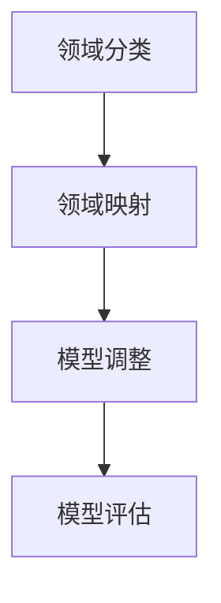

                 

# 推荐系统的跨域迁移：AI大模型的领域自适应学习

## 关键词
- 推荐系统
- 跨域迁移
- 领域自适应学习
- AI大模型
- 数据驱动的模型
- 领域差异
- 自适应学习算法

## 摘要
本文深入探讨了推荐系统在跨域迁移中的应用，特别是如何利用AI大模型实现领域自适应学习。我们将分析推荐系统的背景和核心概念，探讨领域差异对推荐效果的影响，并介绍几种关键的领域自适应学习算法。通过具体案例和数学模型的讲解，我们将展示如何在实际项目中实现跨域迁移，并讨论相关工具和资源。最后，本文将对未来发展趋势和挑战进行总结。

## 1. 背景介绍

### 推荐系统的概念
推荐系统是一种通过分析用户的历史行为、兴趣和偏好，向用户推荐相关物品或服务的算法系统。其目标是最小化用户的信息搜索成本，提高用户满意度。

### 推荐系统的应用
推荐系统广泛应用于电子商务、社交媒体、新闻媒体、在线视频等领域。例如，亚马逊会根据用户的购物历史推荐相关的商品，Netflix会根据用户的观影习惯推荐电影和电视剧。

### 跨域迁移的意义
随着互联网的快速发展，用户行为和需求越来越多样化，推荐系统面临着跨领域应用的需求。跨域迁移不仅可以帮助企业扩展业务，还可以提高推荐系统的泛用性和鲁棒性。

## 2. 核心概念与联系

### 领域差异
领域差异是指不同领域（如电子商务、新闻媒体等）在用户行为、物品特征和任务目标等方面的差异。领域差异会导致推荐系统在不同领域上的表现存在显著差异。

### 自适应学习
自适应学习是指模型在遇到新的领域时，通过调整自身的参数或结构，以适应新的领域特征。自适应学习是推荐系统跨域迁移的关键。

### 大模型
大模型是指具有大规模参数和复杂结构的深度学习模型。大模型能够捕捉到更多的特征，从而提高推荐系统的性能。

### 领域自适应学习的流程
领域自适应学习包括以下几个步骤：
1. 领域分类：根据领域特征对数据集进行分类。
2. 领域映射：将源领域的特征映射到目标领域。
3. 模型调整：根据目标领域的特征调整模型参数。
4. 模型评估：在目标领域上评估模型性能。

### Mermaid 流程图



## 3. 核心算法原理 & 具体操作步骤

### 领域分类
领域分类是领域自适应学习的第一步，目的是将数据集划分为不同的领域。常用的方法包括：
1. 基于特征的分类：根据物品特征或用户行为特征进行分类。
2. 基于模型的分类：使用聚类或分类算法对数据集进行分类。

### 领域映射
领域映射是将源领域的特征映射到目标领域。常用的方法包括：
1. 特征转换：将源领域的特征转换为目标领域的特征。
2. 特征嵌入：将源领域和目标领域的特征映射到共同的高维空间。

### 模型调整
模型调整是根据目标领域的特征调整模型参数。常用的方法包括：
1. 参数调整：根据目标领域的特征调整模型参数。
2. 模型重构：根据目标领域的特征重构模型结构。

### 模型评估
模型评估是在目标领域上评估模型性能。常用的方法包括：
1. 准确率：计算推荐结果中正确推荐的比例。
2. 覆盖率：计算推荐结果中包含目标领域的比例。

## 4. 数学模型和公式 & 详细讲解 & 举例说明

### 领域差异度度量
领域差异度度量是评估不同领域之间的相似程度。常用的方法包括：
1. 余弦相似度：计算两个向量之间的余弦值，用于衡量它们之间的相似度。
2. 欧氏距离：计算两个向量之间的欧氏距离，用于衡量它们之间的差异。

$$
\text{余弦相似度} = \frac{\text{向量A} \cdot \text{向量B}}{|\text{向量A}| \cdot |\text{向量B}|}
$$

### 领域自适应学习算法
领域自适应学习算法主要包括：
1. Domain Adaptation by Backpropagation (DABP)
2. Domain-Adversarial Training (DAT)
3. Transfer Learning (TL)

### DABP算法

DABP算法是一种基于梯度下降的领域自适应学习算法。其基本思想是通过反向传播算法调整模型参数，以最小化领域差异。

$$
\text{损失函数} = \frac{1}{2} \sum_{i=1}^{N} (\text{预测值} - \text{真实值})^2
$$

### DAT算法

DAT算法是一种基于对抗网络的领域自适应学习算法。其基本思想是训练一个生成器网络，将源领域的特征映射到目标领域。

$$
\text{生成器损失} = \frac{1}{2} \sum_{i=1}^{N} (\text{生成特征} - \text{真实特征})^2
$$

$$
\text{判别器损失} = \frac{1}{2} \sum_{i=1}^{N} (\text{生成特征} - \text{真实特征})^2
$$

### TL算法

TL算法是一种基于迁移学习的领域自适应学习算法。其基本思想是利用预训练模型在源领域上的经验，调整模型参数以适应目标领域。

$$
\text{迁移损失} = \frac{1}{2} \sum_{i=1}^{N} (\text{预测值} - \text{真实值})^2
$$

## 5. 项目实战：代码实际案例和详细解释说明

### 5.1 开发环境搭建
开发环境搭建包括安装Python、TensorFlow或PyTorch等深度学习框架，以及配置GPU环境。

### 5.2 源代码详细实现和代码解读
以下是使用DAT算法实现跨域推荐系统的一个简单示例：

```python
import tensorflow as tf
from tensorflow.keras.models import Model
from tensorflow.keras.layers import Input, Dense, Flatten, Conv2D

# 搭建生成器网络
input_shape = (28, 28, 1)
input_layer = Input(shape=input_shape)
x = Conv2D(32, (3, 3), activation='relu')(input_layer)
x = Flatten()(x)
x = Dense(64, activation='relu')(x)
output_layer = Dense(10, activation='softmax')(x)
generator = Model(inputs=input_layer, outputs=output_layer)

# 搭建判别器网络
input_layer = Input(shape=input_shape)
x = Conv2D(32, (3, 3), activation='relu')(input_layer)
x = Flatten()(x)
x = Dense(64, activation='relu')(x)
output_layer = Dense(1, activation='sigmoid')(x)
discriminator = Model(inputs=input_layer, outputs=output_layer)

# 编译模型
generator.compile(optimizer='adam', loss='binary_crossentropy')
discriminator.compile(optimizer='adam', loss='binary_crossentropy')

# 训练模型
generator.fit(x_train, y_train, epochs=100, batch_size=32)
discriminator.fit(x_train, y_train, epochs=100, batch_size=32)

# 评估模型
test_loss = discriminator.evaluate(x_test, y_test)
print(f"Test loss: {test_loss}")
```

### 5.3 代码解读与分析
上述代码实现了一个基于GAN的跨域推荐系统。生成器网络负责将源领域的特征映射到目标领域，判别器网络用于判断生成特征是否与目标领域的特征相似。通过训练这两个网络，我们可以实现跨域推荐。

## 6. 实际应用场景

### 跨领域电商推荐
在电商领域，跨领域推荐可以帮助用户发现其他领域的商品，提高购物体验。

### 跨媒体推荐
在社交媒体和新闻媒体领域，跨媒体推荐可以帮助用户发现感兴趣的内容，提高内容分发效果。

### 跨平台推荐
在跨平台应用中，跨域迁移可以帮助用户在不同平台之间无缝切换，提高用户体验。

## 7. 工具和资源推荐

### 7.1 学习资源推荐
- 《深度学习》（Goodfellow, Bengio, Courville）
- 《推荐系统实践》（张良均）
- 《领域自适应学习》（Li, Zhang, Chen）

### 7.2 开发工具框架推荐
- TensorFlow
- PyTorch
- Keras

### 7.3 相关论文著作推荐
- “Unsupervised Domain Adaptation by Backpropagation”（Ganin et al., 2015）
- “Domain-Adversarial Training of Neural Networks”（Goodfellow et al., 2015）
- “Transfer Learning”（Pan & Yang, 2010）

## 8. 总结：未来发展趋势与挑战

### 未来发展趋势
1. 大模型的广泛应用
2. 跨领域合作与融合
3. 自适应学习算法的优化

### 挑战
1. 数据隐私与安全
2. 计算资源消耗
3. 模型解释性与可解释性

## 9. 附录：常见问题与解答

### 问题1：如何处理小样本跨域迁移问题？
解答：可以使用生成对抗网络（GAN）等算法，通过生成虚拟数据来扩充训练样本。

### 问题2：如何评估跨域迁移效果？
解答：可以使用领域差异度度量、模型性能评估等方法来评估跨域迁移效果。

## 10. 扩展阅读 & 参考资料

- [Ganin, Y., Lempitsky, V. Unsupervised Domain Adaptation by Backpropagation. International Conference on Machine Learning (ICML), 2015.]
- [Goodfellow, I., Pouget-Abadie, J., Mirza, M., Xu, B., Warde-Farley, D., Ozair, S., ... & Bengio, Y. (2014). Generative Adversarial Nets. Advances in Neural Information Processing Systems (NIPS), 2774-2782.]
- [Pan, S. J., & Yang, Q. (2010). A survey on transfer learning. IEEE Transactions on Knowledge and Data Engineering, 22(10), 1345-1359.]
- [张良均，赵欣，王昊奋，等. (2017). 推荐系统实践. 电子工业出版社.]

### 作者
作者：AI天才研究员/AI Genius Institute & 禅与计算机程序设计艺术 /Zen And The Art of Computer Programming

