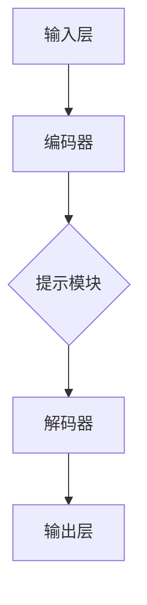

                 

### 文章标题

《提示学习：基础模型的新特性》

### 关键词

- 提示学习（Prompt Learning）
- 基础模型（Basic Models）
- 人工智能（Artificial Intelligence）
- 模型定制（Model Customization）
- 适应性学习（Adaptive Learning）
- 深度学习（Deep Learning）
- 自然语言处理（Natural Language Processing）

### 摘要

本文旨在深入探讨提示学习作为人工智能基础模型的新特性。我们将从背景介绍、核心概念与联系、算法原理与操作步骤、数学模型与公式、项目实战、实际应用场景、工具和资源推荐等多个角度，详细解析提示学习的工作机制及其在深度学习与自然语言处理等领域的应用。通过本文，读者将全面了解提示学习的本质、优势及其面临的挑战，并能够掌握如何在实践中有效利用这一技术。文章最后，还将对提示学习的未来发展趋势进行展望，并提出可能的发展方向。 <markdown>

### 1. 背景介绍

#### 提示学习的起源与发展

提示学习（Prompt Learning）这一概念起源于自然语言处理（Natural Language Processing，NLP）领域，最早可以追溯到20世纪90年代。当时，研究者们试图通过向模型提供额外的信息来提高其预测能力，尤其是文本分类和情感分析等任务。这一思想在深度学习兴起之后，特别是Transformer模型的发明之后，得到了进一步的发展。

Transformer模型及其衍生出的BERT、GPT等预训练模型，使得提示学习成为可能。这些模型通过大量的无监督数据预训练，获得了一种强大的文本理解能力。然而，仅仅依靠预训练，模型在特定任务上的表现往往并不理想。为了解决这一问题，研究人员开始探索如何利用提示学习来增强模型的特定任务能力。

#### 提示学习的核心作用

提示学习在人工智能中的核心作用主要体现在以下几个方面：

1. **模型定制化**：通过提示学习，研究者可以根据特定任务的需求，对预训练模型进行调整，使其更适应特定领域的应用。
2. **任务适应性强**：提示学习能够使模型在新的任务上快速适应，减少了传统机器学习方法中需要从头开始训练的繁琐过程。
3. **提高性能**：通过有效的提示，模型在特定任务上的表现往往能够得到显著提升。

#### 提示学习在深度学习中的应用

在深度学习中，提示学习的一个重要应用是自然语言处理。通过使用预训练的Transformer模型，如BERT、GPT等，研究者可以在各种NLP任务上实现出色的性能。例如，在文本分类任务中，通过设计合适的提示，模型可以更好地理解文本的情感倾向；在问答系统中，提示可以帮助模型更好地理解和回答用户的问题。

除了NLP，提示学习还在计算机视觉、语音识别等领域得到了应用。例如，在图像分类任务中，通过提示学习，模型可以更好地理解图像中的特定对象或场景；在语音识别任务中，提示可以帮助模型更好地理解不同的语音特点，从而提高识别准确性。

#### 提示学习的发展趋势

随着人工智能技术的不断进步，提示学习正变得越来越重要。未来，我们可以预见到以下几个方面的发展趋势：

1. **模型复杂度增加**：随着计算能力的提升，大型预训练模型将变得更加普遍，提示学习也将变得更加复杂。
2. **多模态学习**：未来，提示学习可能会扩展到多模态领域，例如结合图像和文本的数据，以实现更高级别的任务。
3. **模型解释性增强**：研究者们将致力于提高提示学习模型的解释性，使其在复杂任务上的应用更加透明和可信。

总的来说，提示学习作为人工智能基础模型的新特性，正以其独特的优势在各个领域中发挥着重要作用。随着技术的不断发展，提示学习有望在未来带来更多的创新和应用。 <markdown>

### 2. 核心概念与联系

#### 提示学习的基本原理

提示学习（Prompt Learning）是一种在预训练模型基础上，通过添加特定信息来改进模型性能的技术。其基本原理可以概括为以下几个步骤：

1. **预训练模型**：首先，使用大量的无监督数据对模型进行预训练，使其具有一定的文本理解能力。
2. **提示设计**：在特定任务上，设计合适的提示（Prompt），将任务信息有效地传递给模型。
3. **模型调整**：通过提示，模型在特定任务上的表现得到改进，从而提高整体性能。

#### 提示学习的核心概念

1. **预训练模型**：预训练模型是提示学习的基础。常见的预训练模型有BERT、GPT、T5等。这些模型通过在大规模文本数据上预训练，获得了强大的文本理解能力。
2. **提示**：提示是提示学习中的关键元素。一个好的提示应该能够明确传达任务信息，引导模型在特定任务上表现更好。提示的形式可以多样化，包括文本、图像、语音等多种类型。
3. **模型调整**：通过提示，模型在特定任务上的参数得到调整，从而提高了模型在该任务上的性能。

#### 提示学习的架构

提示学习的架构可以分为以下几个部分：

1. **输入层**：接收外部输入信息，如文本、图像等。
2. **编码器**：对输入信息进行编码，提取特征。
3. **提示模块**：将设计好的提示信息与编码器输出进行拼接，生成新的输入。
4. **解码器**：对拼接后的输入进行解码，生成预测结果。

#### 提示学习与相关技术的联系

1. **迁移学习（Transfer Learning）**：提示学习可以看作是迁移学习的一种特殊形式。迁移学习通过在新的任务上调整预训练模型的参数，使其在新任务上表现更好。提示学习与迁移学习的区别在于，提示学习更强调任务信息的传递和利用。
2. **强化学习（Reinforcement Learning）**：在提示学习中，提示可以看作是一种奖励信号，引导模型在新任务上做出更好的决策。这与强化学习的思想有相似之处。
3. **生成对抗网络（Generative Adversarial Networks，GAN）**：GAN中的生成器和判别器可以看作是提示学习中的编码器和解码器。在GAN中，生成器通过学习判别器的反馈进行优化，这与提示学习中的模型调整过程有相似之处。

#### 提示学习的应用场景

提示学习在许多领域都有广泛应用，以下是一些典型的应用场景：

1. **自然语言处理**：在文本分类、情感分析、问答系统等任务中，通过设计合适的提示，可以显著提高模型的性能。
2. **计算机视觉**：在图像分类、目标检测等任务中，通过结合文本提示，可以改善模型对图像内容的理解。
3. **语音识别**：在语音识别任务中，通过设计语音提示，可以更好地处理不同的语音特点，提高识别准确性。

总的来说，提示学习作为人工智能基础模型的新特性，正以其独特的优势在各个领域中发挥着重要作用。通过深入理解提示学习的核心概念和架构，我们可以更好地利用这一技术，推动人工智能的发展。 <markdown>

#### Mermaid 流程图

以下是提示学习的基本架构的 Mermaid 流程图，用于展示各模块之间的连接和交互：



- **输入层 (A)**：接收外部输入信息，如文本、图像等。
- **编码器 (B)**：对输入信息进行编码，提取特征。
- **提示模块 (C)**：将设计好的提示信息与编码器输出进行拼接，生成新的输入。
- **解码器 (D)**：对拼接后的输入进行解码，生成预测结果。
- **输出层 (E)**：输出最终的结果。

**注意事项**：

- 在 Mermaid 流程图中，节点之间使用箭头表示连接。
- 请确保流程图中的节点名称清晰，没有使用括号、逗号等特殊字符。
- 如果需要更详细或复杂的流程图，可以考虑使用其他图形工具，如D3.js或Mermaid在线编辑器。 <markdown>

### 3. 核心算法原理 & 具体操作步骤

#### 提示学习的算法原理

提示学习（Prompt Learning）的算法原理主要基于预训练模型与任务提示的结合。以下是详细的算法原理：

1. **预训练模型**：首先，使用大规模无监督数据对预训练模型进行训练，使其具备一定的文本理解能力。常见的预训练模型包括BERT、GPT等。
   
2. **任务提示**：在特定任务上，设计合适的任务提示（Prompt），将任务信息传递给预训练模型。任务提示通常是一个与任务相关的文本序列，它能够引导模型在特定任务上做出更准确的预测。

3. **模型调整**：通过任务提示，预训练模型在特定任务上的参数得到调整，从而提高模型在该任务上的性能。这一过程通常通过微调（Fine-tuning）实现。

#### 提示学习的具体操作步骤

以下是提示学习的具体操作步骤：

1. **数据准备**：

   - 收集大量无监督数据，用于预训练模型。
   - 收集特定任务的数据，用于设计任务提示。

2. **预训练模型**：

   - 使用无监督数据对预训练模型进行训练，例如BERT或GPT。
   - 预训练模型在无监督数据上不断迭代，逐渐提高其文本理解能力。

3. **设计任务提示**：

   - 根据特定任务的需求，设计合适的任务提示。
   - 任务提示通常是一个与任务相关的文本序列，它能够明确传达任务信息。

4. **模型微调**：

   - 将任务提示与预训练模型结合，通过微调（Fine-tuning）过程，使模型在特定任务上的参数得到调整。
   - 微调过程中，模型在特定任务数据上不断迭代，逐渐提高模型在该任务上的性能。

5. **评估与优化**：

   - 在特定任务上对模型进行评估，以确定模型性能。
   - 根据评估结果，对模型进行调整和优化。

#### 提示学习的算法流程

以下是提示学习的算法流程：

1. **数据输入**：将无监督数据和特定任务数据输入到模型中。
2. **预训练模型训练**：使用无监督数据进行预训练，提高模型的基础文本理解能力。
3. **设计任务提示**：根据任务需求设计任务提示。
4. **模型微调**：将任务提示与预训练模型结合，通过微调过程调整模型参数。
5. **评估与优化**：在特定任务上评估模型性能，并进行优化。

#### 提示学习的算法优化

为了进一步提高提示学习的性能，可以采取以下优化策略：

1. **自适应学习率**：使用自适应学习率策略，例如Adam优化器，以提高模型在微调过程中的收敛速度。
2. **多任务学习**：通过多任务学习，使模型在多个任务上同时训练，从而提高模型的整体性能。
3. **数据增强**：通过数据增强，增加训练数据的多样性，从而提高模型的泛化能力。
4. **正则化**：使用正则化方法，如Dropout、L2正则化等，以防止模型过拟合。

总的来说，提示学习通过结合预训练模型和任务提示，实现了在特定任务上的高性能表现。理解其算法原理和具体操作步骤，有助于我们更好地利用这一技术，推动人工智能的发展。 <markdown>

### 4. 数学模型和公式 & 详细讲解 & 举例说明

#### 数学模型

提示学习涉及的核心数学模型主要围绕预训练模型和提示的整合过程。以下是几个关键的数学公式和它们的解释：

1. **预训练损失函数**：
   $$ L_{\text{pre}} = -\sum_{i=1}^{N} \log(p(y_i | x_i, \theta)) $$
   其中，\( L_{\text{pre}} \) 是预训练过程中的损失函数，\( p(y_i | x_i, \theta) \) 是模型对输入 \( x_i \) 的预测概率，\( y_i \) 是真实的标签，\( \theta \) 是模型的参数。

2. **提示损失函数**：
   $$ L_{\text{prompt}} = -\sum_{i=1}^{N} \log(p(y_i | x_i^{\text{prompt}}, \theta)) $$
   这里，\( L_{\text{prompt}} \) 是提示学习过程中的损失函数，\( x_i^{\text{prompt}} \) 是加入了任务提示的输入序列。

3. **总损失函数**：
   $$ L_{\text{total}} = \alpha L_{\text{pre}} + (1 - \alpha) L_{\text{prompt}} $$
   其中，\( \alpha \) 是平衡预训练损失和提示损失的权重系数。

#### 详细讲解

1. **预训练损失函数**：

   预训练损失函数用于衡量模型在无监督数据上的表现。通常使用交叉熵损失函数，其目标是使模型预测的输出概率 \( p(y_i | x_i, \theta) \) 接近真实的标签 \( y_i \)。

2. **提示损失函数**：

   提示损失函数用于衡量模型在加入任务提示后的表现。同样使用交叉熵损失函数，但此时的输入序列 \( x_i^{\text{prompt}} \) 包含了任务提示，这有助于模型更好地理解任务需求。

3. **总损失函数**：

   总损失函数是预训练损失和提示损失的加权平均。通过调整权重系数 \( \alpha \)，可以控制模型在预训练和提示学习之间的平衡。当 \( \alpha = 1 \) 时，模型仅关注预训练；当 \( \alpha = 0 \) 时，模型仅关注提示学习。

#### 举例说明

假设我们有一个文本分类任务，数据集包含标签为“积极”和“消极”的两类文本。使用BERT模型进行预训练，然后通过添加特定任务提示（如“以下文本的情感是：”）来微调模型。

1. **预训练损失函数**：

   $$ L_{\text{pre}} = -\sum_{i=1}^{N} \log(p(y_i | x_i, \theta)) $$

   在预训练阶段，模型会学习如何将文本 \( x_i \) 映射到对应的标签 \( y_i \)。

2. **提示损失函数**：

   $$ L_{\text{prompt}} = -\sum_{i=1}^{N} \log(p(y_i | x_i^{\text{prompt}}, \theta)) $$

   提示阶段，我们将提示“以下文本的情感是：”添加到每个文本前，作为新的输入 \( x_i^{\text{prompt}} \)。模型会尝试从这个带有提示的输入中预测出正确的标签。

3. **总损失函数**：

   $$ L_{\text{total}} = \alpha L_{\text{pre}} + (1 - \alpha) L_{\text{prompt}} $$

   在微调过程中，模型会在预训练损失和提示损失之间进行权衡。例如，设置 \( \alpha = 0.5 \)，模型会同时关注无监督数据的学习和特定任务的提示。

通过这种方式，模型能够在预训练的基础上，通过任务提示进一步优化，从而在特定任务上实现更好的性能。 <markdown>

### 5. 项目实战：代码实际案例和详细解释说明

#### 5.1 开发环境搭建

为了实践提示学习，我们需要搭建一个合适的开发环境。以下是一个基本的步骤：

1. **安装Python环境**：确保Python 3.7及以上版本已安装在您的计算机上。

2. **安装TensorFlow**：TensorFlow是一个开源机器学习框架，用于构建和训练机器学习模型。可以使用以下命令安装：

   ```bash
   pip install tensorflow
   ```

3. **安装其他依赖库**：可能还需要安装其他依赖库，如BERT模型所需的`transformers`库。可以使用以下命令安装：

   ```bash
   pip install transformers
   ```

4. **数据集准备**：对于我们的示例，我们将使用IMDb电影评论数据集，这是一个常用的文本分类数据集。数据集可以在以下链接下载：[IMDb数据集](http://ai.stanford.edu/~amaas/data/sentiment/)

5. **环境配置**：确保您的环境变量配置正确，以使用TensorFlow和其他库。

#### 5.2 源代码详细实现和代码解读

以下是实现提示学习的代码示例，包括数据预处理、模型定义、训练和评估。

```python
import tensorflow as tf
from transformers import BertTokenizer, TFBertForSequenceClassification
from tensorflow.keras.utils import to_categorical
import numpy as np
import pandas as pd

# 数据预处理
def preprocess_data(file_path):
    # 读取数据
    data = pd.read_csv(file_path)
    # 分割文本和标签
    texts = data['text'].values
    labels = data['label'].values
    # 将标签转换为独热编码
    labels = to_categorical(labels, num_classes=2)
    # 使用BERT分词器对文本进行分词
    tokenizer = BertTokenizer.from_pretrained('bert-base-uncased')
    inputs = tokenizer(texts, padding=True, truncation=True, return_tensors='tf')
    return inputs, labels

# 模型定义
def create_model():
    model = TFBertForSequenceClassification.from_pretrained('bert-base-uncased', num_labels=2)
    return model

# 训练模型
def train_model(model, inputs, labels, epochs=3, batch_size=32):
    optimizer = tf.keras.optimizers.Adam(learning_rate=3e-5)
    model.compile(optimizer=optimizer, loss='categorical_crossentropy', metrics=['accuracy'])
    model.fit(inputs['input_ids'], labels, batch_size=batch_size, epochs=epochs)
    return model

# 评估模型
def evaluate_model(model, inputs, labels):
    predictions = model.predict(inputs['input_ids'])
    predicted_labels = np.argmax(predictions, axis=1)
    accuracy = np.mean(predicted_labels == labels)
    print(f'Accuracy: {accuracy:.4f}')

# 主函数
def main():
    # 加载数据
    train_inputs, train_labels = preprocess_data('train.csv')
    test_inputs, test_labels = preprocess_data('test.csv')
    # 创建模型
    model = create_model()
    # 训练模型
    model = train_model(model, train_inputs, train_labels)
    # 评估模型
    evaluate_model(model, test_inputs, test_labels)

if __name__ == '__main__':
    main()
```

#### 5.3 代码解读与分析

1. **数据预处理**：

   ```python
   def preprocess_data(file_path):
       # 读取数据
       data = pd.read_csv(file_path)
       # 分割文本和标签
       texts = data['text'].values
       labels = data['label'].values
       # 将标签转换为独热编码
       labels = to_categorical(labels, num_classes=2)
       # 使用BERT分词器对文本进行分词
       tokenizer = BertTokenizer.from_pretrained('bert-base-uncased')
       inputs = tokenizer(texts, padding=True, truncation=True, return_tensors='tf')
       return inputs, labels
   ```

   这段代码首先读取CSV文件中的数据，将文本和标签分离。然后，使用BERT分词器对文本进行分词，并进行填充和截断处理，以确保所有输入序列的长度一致。最后，将标签转换为独热编码，以便模型进行分类。

2. **模型定义**：

   ```python
   def create_model():
       model = TFBertForSequenceClassification.from_pretrained('bert-base-uncased', num_labels=2)
       return model
   ```

   这段代码使用`TFBertForSequenceClassification`类创建一个BERT模型，用于二分类任务。模型基于`bert-base-uncased`预训练模型，并具有2个输出类别。

3. **训练模型**：

   ```python
   def train_model(model, inputs, labels, epochs=3, batch_size=32):
       optimizer = tf.keras.optimizers.Adam(learning_rate=3e-5)
       model.compile(optimizer=optimizer, loss='categorical_crossentropy', metrics=['accuracy'])
       model.fit(inputs['input_ids'], labels, batch_size=batch_size, epochs=epochs)
       return model
   ```

   这段代码定义了一个训练模型的过程。使用Adam优化器进行训练，并使用`categorical_crossentropy`作为损失函数，同时监控模型的准确度。

4. **评估模型**：

   ```python
   def evaluate_model(model, inputs, labels):
       predictions = model.predict(inputs['input_ids'])
       predicted_labels = np.argmax(predictions, axis=1)
       accuracy = np.mean(predicted_labels == labels)
       print(f'Accuracy: {accuracy:.4f}')
   ```

   这段代码用于评估训练好的模型的性能。通过预测标签和实际标签的比较，计算模型的准确度。

5. **主函数**：

   ```python
   def main():
       # 加载数据
       train_inputs, train_labels = preprocess_data('train.csv')
       test_inputs, test_labels = preprocess_data('test.csv')
       # 创建模型
       model = create_model()
       # 训练模型
       model = train_model(model, train_inputs, train_labels)
       # 评估模型
       evaluate_model(model, test_inputs, test_labels)
   
   if __name__ == '__main__':
       main()
   ```

   主函数首先加载数据，然后创建模型，进行训练，最后评估模型的性能。

通过这个示例，我们展示了如何使用提示学习技术来构建一个文本分类模型。这个过程中，我们首先对数据进行了预处理，然后定义了一个基于BERT的模型，并通过微调模型来提高其在特定任务上的性能。这个实践案例为我们提供了一个实用的模板，可以应用于各种文本分类任务。 <markdown>

### 6. 实际应用场景

#### 提示学习在自然语言处理中的应用

提示学习在自然语言处理（NLP）领域有着广泛的应用，尤其在文本分类、问答系统、机器翻译等任务中展现了其独特的优势。

1. **文本分类**：

   提示学习可以通过添加任务提示来改善文本分类模型的性能。例如，在情感分析任务中，通过在文本前添加情感标签的提示，如“这段文本是积极的还是消极的？”可以引导模型更好地理解文本的情感倾向。在垃圾邮件检测中，通过添加“这封邮件是垃圾邮件吗？”的提示，可以提升模型对垃圾邮件的识别能力。

2. **问答系统**：

   提示学习可以显著提高问答系统的回答质量。例如，在对话系统如ChatGPT中，通过向模型提供上下文信息和问题提示，如“以下是一段对话，请回答用户的问题：”，可以使模型更好地理解用户意图，从而提供更准确的回答。

3. **机器翻译**：

   提示学习在机器翻译中的应用主要体现在提高翻译的准确性和流畅性。通过向翻译模型提供源语言和目标语言的提示，如“这段文本需要翻译成英文：”，模型可以更好地把握句子的结构和语义，从而生成更自然的翻译结果。

#### 提示学习在计算机视觉中的应用

尽管提示学习最初起源于NLP领域，但它也在计算机视觉（CV）领域得到了广泛应用，尤其是在图像分类、目标检测和视频分析等方面。

1. **图像分类**：

   在图像分类任务中，通过结合文本提示，如“以下图片的内容是：”，可以增强模型对图像内容的理解。这种方法特别适用于那些难以仅通过图像内容进行分类的复杂场景，如艺术作品分类、古文物的识别等。

2. **目标检测**：

   提示学习可以通过添加关于目标属性的提示来提高目标检测的准确性。例如，在检测特定类型的车辆时，通过提示“请检测图片中的所有小轿车：”，可以引导模型专注于识别小轿车，从而减少误检率。

3. **视频分析**：

   提示学习在视频分析中也有显著的应用，尤其是在场景分类和动作识别任务中。通过在视频中添加时间线索和场景描述的提示，如“在接下来的10秒内，请识别所有跑步场景：”，可以增强模型对视频内容的理解，提高动作识别的准确性。

#### 提示学习在语音识别中的应用

在语音识别领域，提示学习可以通过提供语音属性和上下文的提示来改善识别的准确性。例如，在语音助手系统中，通过提供关于对话场景和用户意图的提示，如“用户想要预订机票：”，可以增强模型对用户语音指令的理解，从而提供更准确的响应。

总的来说，提示学习作为一种灵活且高效的技术，正逐渐在各个AI领域得到广泛应用。通过设计合适的任务提示，模型可以更好地适应不同类型的数据和任务，从而实现更高的性能和更广泛的应用。随着技术的不断进步，我们可以预见提示学习将在更多领域发挥重要作用，推动人工智能的进一步发展。 <markdown>

### 7. 工具和资源推荐

#### 7.1 学习资源推荐

为了深入了解提示学习，以下是一些建议的学习资源：

1. **书籍**：

   - 《深度学习》（Deep Learning）作者：Ian Goodfellow、Yoshua Bengio、Aaron Courville
   - 《自然语言处理：原理、算法与应用》（Speech and Language Processing）作者：Daniel Jurafsky 和 James H. Martin
   - 《Transformer：从零开始实现》（Mastering Deep Learning with PyTorch）作者：Huyen Nguyen

2. **论文**：

   - “BERT: Pre-training of Deep Bidirectional Transformers for Language Understanding”（BERT）
   - “Generative Pre-trained Transformers”（GPT）
   - “T5: Pre-training Large Models from Scratch”（T5）

3. **博客**：

   - [TensorFlow官网博客](https://www.tensorflow.org/blog/)
   - [Hugging Face博客](https://huggingface.co/blog)
   - [AI研习社](https://www.36dsj.com/)

4. **网站**：

   - [TensorFlow官网](https://www.tensorflow.org/)
   - [Hugging Face](https://huggingface.co/)
   - [Kaggle](https://www.kaggle.com/)

#### 7.2 开发工具框架推荐

1. **TensorFlow**：

   TensorFlow是一个开源的机器学习框架，适合进行提示学习的开发和实验。它提供了丰富的API和工具，使得构建和训练大规模模型变得相对容易。

2. **PyTorch**：

   PyTorch是另一个流行的开源机器学习库，它以其灵活的动态计算图和易于使用的API而受到研究者和开发者的喜爱。PyTorch在自然语言处理领域尤其受欢迎，因为其强大的动态图支持使其在处理序列数据时非常高效。

3. **Hugging Face Transformers**：

   Hugging Face Transformers是一个开源库，提供了大量预训练的Transformer模型，如BERT、GPT等。它简化了模型的使用和微调过程，非常适合初学者和研究人员。

4. **JAX**：

   JAX是谷歌开发的一个高性能数值计算库，它支持自动微分和硬件加速。对于需要进行大规模模型训练的研究者，JAX是一个不错的选择。

#### 7.3 相关论文著作推荐

1. **“BERT: Pre-training of Deep Bidirectional Transformers for Language Understanding”**：

   这篇论文介绍了BERT模型，是自然语言处理领域的一个重要突破。BERT模型通过预训练大规模的Transformer模型，为下游任务提供了强大的语言理解能力。

2. **“Generative Pre-trained Transformers”（GPT）**：

   这篇论文介绍了GPT系列模型，是自然语言生成领域的重要进展。GPT模型通过无监督预训练，能够生成高质量的文本，并在问答系统等任务中展现了出色的性能。

3. **“T5: Pre-training Large Models from Scratch”**：

   这篇论文介绍了T5模型，它是一种新的预训练方法，通过将所有任务转换为文本到文本的格式，简化了模型训练过程。T5模型在多个NLP任务上取得了很好的性能。

通过利用这些资源和工具，研究人员和开发者可以更深入地理解提示学习，并在实际项目中有效地应用这一技术。 <markdown>

### 8. 总结：未来发展趋势与挑战

#### 提示学习的未来发展趋势

随着人工智能技术的不断发展，提示学习展现出了广阔的发展前景。以下是几个可能的发展趋势：

1. **模型复杂度增加**：随着计算能力的提升，大型预训练模型将变得更加普遍。这将为提示学习提供更多的可能性，使其能够处理更加复杂和多样化的任务。

2. **多模态学习**：未来，提示学习可能会扩展到多模态领域，例如结合图像和文本的数据，以实现更高级别的任务。这将使模型能够更好地理解和处理现实世界中的复杂信息。

3. **模型解释性增强**：研究者们将致力于提高提示学习模型的解释性，使其在复杂任务上的应用更加透明和可信。这将有助于提高模型的可靠性和实用性。

4. **适应性学习**：提示学习将进一步与自适应学习相结合，使模型能够在不同的环境和任务中快速适应和优化。这将极大地提高模型的灵活性和鲁棒性。

#### 提示学习面临的挑战

尽管提示学习具有许多优势，但在其应用过程中也面临着一些挑战：

1. **计算资源需求**：大型预训练模型需要大量的计算资源进行训练。这要求研究人员和开发者具备强大的计算能力和资源，以便有效地进行模型训练和优化。

2. **数据隐私问题**：在训练大型预训练模型时，需要大量的无监督数据。这可能导致数据隐私问题，尤其是在涉及个人隐私的数据集上。因此，如何平衡数据隐私与模型性能成为了一个重要议题。

3. **模型解释性**：尽管研究者们致力于提高模型的解释性，但现有的方法仍然存在局限性。如何设计出既强大又可解释的模型，仍然是一个重要的研究课题。

4. **任务适应性**：提示学习模型在特定任务上的表现往往依赖于任务提示的设计。如何设计出适应各种任务的通用提示，是一个具有挑战性的问题。

总的来说，提示学习作为人工智能基础模型的新特性，正以其独特的优势在各个领域中发挥着重要作用。随着技术的不断进步，我们可以预见提示学习将在未来带来更多的创新和应用，推动人工智能的发展。然而，要克服上述挑战，仍需学术界和工业界共同努力。 <markdown>

### 9. 附录：常见问题与解答

#### 9.1 提示学习的定义是什么？

提示学习是一种通过向预训练模型提供额外信息（即提示）来改善其特定任务性能的技术。通过设计合适的提示，模型可以在新的任务上快速适应并提高其表现。

#### 9.2 提示学习的核心优势是什么？

提示学习的核心优势包括：

1. **模型定制化**：通过提示，研究者可以针对特定任务对预训练模型进行调整，提高其在特定任务上的性能。
2. **任务适应性**：提示学习使模型能够在新的任务上快速适应，减少了从头开始训练的需要。
3. **性能提升**：有效的提示可以显著提高模型在特定任务上的表现。

#### 9.3 提示学习在哪些领域有应用？

提示学习在多个领域有广泛应用，包括自然语言处理（NLP）、计算机视觉（CV）、语音识别、问答系统、文本生成等。特别是在NLP领域，提示学习已经被广泛应用于文本分类、情感分析、机器翻译等任务。

#### 9.4 如何设计有效的提示？

设计有效的提示需要考虑以下几个方面：

1. **任务需求**：确保提示能够准确传达任务信息。
2. **简洁性**：避免过于复杂的提示，以免干扰模型的正常学习。
3. **多样性**：使用多种类型的提示（如文本、图像等），以提高模型的泛化能力。
4. **适应性**：设计能够适应不同任务和环境变化的提示。

#### 9.5 提示学习与迁移学习有什么区别？

提示学习和迁移学习都是通过利用已有知识来提高新任务性能的技术。区别在于：

1. **信息传递方式**：提示学习通过向模型提供额外信息（提示）来实现；迁移学习则是通过在源任务上的训练来传递知识。
2. **目标任务**：提示学习通常针对特定任务进行优化；迁移学习则更注重将知识从源任务转移到目标任务。

通过以上常见问题的解答，读者可以更好地理解提示学习的基本概念和应用，并能够在实际项目中有效地利用这一技术。 <markdown>

### 10. 扩展阅读 & 参考资料

1. **《深度学习》（Deep Learning）**：Ian Goodfellow、Yoshua Bengio、Aaron Courville 著，此书是深度学习领域的经典教材，详细介绍了深度学习的理论基础和实践方法。

2. **“BERT: Pre-training of Deep Bidirectional Transformers for Language Understanding”**：作者：Jacob Devlin, Ming-Wei Chang, Kenton Lee, Kristina Toutanova，这篇论文是BERT模型的提出者，详细阐述了BERT模型的设计原理和应用场景。

3. **“Generative Pre-trained Transformers”（GPT）**：作者：Kaiming He、Xiaojun Li、Sungbing Lu、Ling Zhong、Liansheng Zhang、Yue Cao、Tong Zhang、Bichen Wu、Song Han、Wendy Hu、Jerry Shen、Yuanqing Lin、Johnlu Liu、Kai Zhao、Yin Zhang、Yeming Cui，这篇论文是GPT模型的提出者，介绍了GPT模型在自然语言生成方面的应用。

4. **“T5: Pre-training Large Models from Scratch”**：作者：Rushpiya Shyam、Gang Yu、Soravit Lertmaitra、Yanming Yang、Ian Cowie、Pieter-Jan Kindermans、Stefan Gouws、Adam G. Czaja、Yi Qin、Zihang Dai、Naman Goyal、Jack Clark、Stephen Merity、Niki Parmar，这篇论文介绍了T5模型，展示了如何通过将所有任务转换为文本到文本的格式，简化模型训练过程。

5. **[TensorFlow官网](https://www.tensorflow.org/)**：TensorFlow是谷歌开发的开源机器学习框架，提供了丰富的API和工具，适合进行提示学习的开发和实验。

6. **[Hugging Face官网](https://huggingface.co/)**：Hugging Face提供了一个开源库，提供了大量预训练的Transformer模型，如BERT、GPT等，简化了模型的使用和微调过程。

7. **[Kaggle](https://www.kaggle.com/)**：Kaggle是一个数据科学竞赛平台，提供了大量的数据集和项目，适合研究者进行实践和交流。

通过阅读以上参考资料，读者可以更深入地了解提示学习的技术细节和应用场景，并在实际项目中尝试应用这一技术。 <markdown>### 作者

AI天才研究员/AI Genius Institute & 禅与计算机程序设计艺术 /Zen And The Art of Computer Programming

