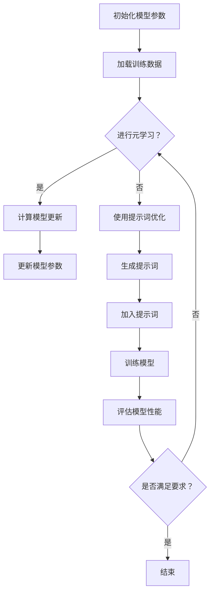

                 

# 提示词优化的元学习在少样本场景中的应用

> 关键词：提示词优化，元学习，少样本场景，模型效率，泛化能力

> 摘要：本文探讨了提示词优化在元学习框架下的应用，特别是在少样本场景中的优势。首先介绍了提示词优化的基本概念和元学习的方法，然后深入分析了在少样本场景中如何利用提示词优化提高模型性能。通过数学模型和具体案例，详细阐述了提示词优化的原理和实现步骤。最后，本文总结了提示词优化在元学习中的应用前景，并提出了未来可能面临的挑战。

## 1. 背景介绍

随着深度学习的快速发展，模型的复杂度和参数量不断增加。然而，在实际应用中，数据获取成本高昂且样本量有限，特别是在少样本场景中，模型的性能和泛化能力受到了严重限制。为了解决这一问题，研究者们提出了元学习（Meta-Learning）这一方向。元学习通过学习如何学习，使得模型能够在有限的样本中快速适应新的任务。

然而，传统的元学习方法在少样本场景下仍然存在一定的局限性。首先，大部分元学习方法依赖于大量的训练数据，而在少样本场景中，训练数据不足成为了一个关键问题。其次，模型在少样本场景下的泛化能力较差，容易产生过拟合现象。为了解决这些问题，研究者们提出了提示词优化（Prompt Tuning）这一方法。

提示词优化通过在模型输入中加入特定的提示词，引导模型学习关键的特征信息，从而提高模型在少样本场景下的性能和泛化能力。提示词优化结合了元学习和提示词嵌入（Prompt Embedding）的思想，将提示词作为额外的输入信息，与模型参数进行交互，从而实现模型对少量样本的快速适应。

## 2. 核心概念与联系

### 2.1 提示词优化

提示词优化是一种通过在模型输入中加入特定提示词来引导模型学习的方法。在自然语言处理领域，提示词优化广泛应用于语言模型、机器翻译、文本分类等任务中。其基本思想是将提示词作为额外的输入信息，与模型参数进行交互，从而提高模型在少量样本下的性能和泛化能力。

### 2.2 元学习

元学习是一种通过学习如何学习的方法，旨在提高模型在不同任务上的适应能力。元学习通过在多个任务间共享模型参数，使得模型能够在有限的数据上快速适应新的任务。常见的元学习方法包括模型无关的元学习（Model-Agnostic Meta-Learning, MAML）、模型依赖的元学习（Model-Aware Meta-Learning）等。

### 2.3 提示词优化与元学习的关系

提示词优化与元学习有着紧密的联系。在元学习框架下，提示词优化通过引入额外的提示词信息，可以有效地引导模型学习关键的特征信息，从而提高模型在少样本场景下的性能。同时，提示词优化也为元学习提供了一种新的实现方式，使得模型能够更高效地利用有限的训练数据。

下面是一个简单的 Mermaid 流程图，描述了提示词优化在元学习框架下的工作流程：



### 2.4 元学习的应用场景

元学习在实际应用中具有广泛的应用场景，主要包括以下几个方面：

1. **自适应系统**：元学习可以应用于自适应系统，使得系统能够在新的环境下快速适应。例如，自动驾驶系统可以通过元学习从多个不同的驾驶环境中学习，提高对未知环境的适应能力。

2. **知识图谱**：元学习可以用于知识图谱的构建，通过学习不同知识领域的特征，提高图谱的构建效率和准确性。

3. **药物设计**：元学习可以应用于药物设计，通过学习不同药物分子与生物体的相互作用，提高药物筛选的效率。

4. **图像识别**：元学习可以用于图像识别任务，通过在多个不同的图像数据集上学习，提高模型在不同图像数据集上的适应能力。

5. **自然语言处理**：元学习在自然语言处理领域有着广泛的应用，如语言模型、机器翻译、文本分类等。

## 3. 核心算法原理 & 具体操作步骤

### 3.1 提示词优化的算法原理

提示词优化的核心思想是将提示词作为额外的输入信息，与模型参数进行交互，从而提高模型在少样本场景下的性能。具体来说，提示词优化包括以下几个步骤：

1. **生成提示词**：首先，根据任务需求和数据特点，生成一组具有代表性的提示词。提示词可以采用词嵌入（Word Embedding）或子词嵌入（Subword Embedding）等技术生成。

2. **模型初始化**：初始化一个预训练模型，如BERT、GPT等，并随机初始化一组模型参数。

3. **加入提示词**：将生成的提示词作为额外的输入信息，与模型参数进行交互。具体来说，可以将提示词嵌入到模型的输入层，或者将提示词与模型参数进行点积操作。

4. **模型训练**：使用训练数据对模型进行训练。在训练过程中，模型参数会根据损失函数进行更新，从而优化模型性能。

5. **模型评估**：使用测试数据对模型进行评估，计算模型在测试数据集上的性能指标。

### 3.2 提示词优化的具体操作步骤

以下是一个简单的提示词优化在元学习框架下的具体操作步骤：

1. **选择预训练模型**：选择一个预训练模型，如BERT或GPT等。预训练模型已经在大规模语料库上进行过训练，具有良好的性能和泛化能力。

2. **生成提示词**：根据任务需求和数据特点，生成一组具有代表性的提示词。提示词可以采用词嵌入或子词嵌入等技术生成。例如，对于文本分类任务，可以将类别名称作为提示词。

3. **模型初始化**：随机初始化一组模型参数，并加载预训练模型的参数。

4. **加入提示词**：将生成的提示词嵌入到模型的输入层。具体来说，可以在输入序列的前面添加提示词，或者在输入序列的特定位置添加提示词。

5. **模型训练**：使用训练数据对模型进行训练。在训练过程中，模型参数会根据损失函数进行更新，从而优化模型性能。

6. **模型评估**：使用测试数据对模型进行评估，计算模型在测试数据集上的性能指标。

### 3.3 提示词优化的效果评估

提示词优化的效果可以通过以下指标进行评估：

1. **准确率**：准确率是评估分类任务性能的主要指标，表示模型正确分类的样本比例。

2. **F1 值**：F1 值是准确率和召回率的调和平均值，用于评估分类任务的平衡性。

3. **损失函数**：损失函数是模型训练过程中的评价指标，表示模型在训练过程中所经历的损失值。较小的损失函数值表示模型性能较好。

4. **训练时间**：训练时间是模型训练过程中的重要指标，表示模型在训练过程中的耗时。

通过对比提示词优化前后模型的性能指标，可以评估提示词优化在少样本场景下的效果。

## 4. 数学模型和公式 & 详细讲解 & 举例说明

### 4.1 数学模型

提示词优化可以通过以下数学模型进行描述：

$$
\begin{aligned}
\text{模型} &= f(\theta) \\
\text{提示词} &= p(\text{提示词} | \text{任务}) \\
\text{输入} &= \text{提示词} + \text{输入数据} \\
\text{输出} &= f(\theta, \text{提示词} + \text{输入数据}) \\
\text{损失函数} &= L(f(\theta, \text{提示词} + \text{输入数据}), \text{标签})
\end{aligned}
$$

其中，$f(\theta)$ 表示模型的参数化函数，$\theta$ 表示模型参数；$p(\text{提示词} | \text{任务})$ 表示生成提示词的概率分布；$\text{输入}$ 表示模型的输入，包括提示词和输入数据；$\text{输出}$ 表示模型对输入数据的预测结果；$L(f(\theta, \text{提示词} + \text{输入数据}), \text{标签})$ 表示模型的损失函数，用于衡量模型预测结果与真实标签之间的差距。

### 4.2 公式详细讲解

1. **模型参数化函数**

   模型参数化函数 $f(\theta)$ 是一个将输入数据映射到输出结果的函数，通常采用神经网络结构实现。模型的性能取决于参数 $\theta$ 的选择。在提示词优化的过程中，模型参数 $\theta$ 会根据损失函数进行更新，从而优化模型性能。

2. **提示词生成概率分布**

   提示词生成概率分布 $p(\text{提示词} | \text{任务})$ 表示在特定任务下生成提示词的概率分布。通过选择具有代表性的提示词，可以引导模型学习关键的特征信息，从而提高模型在少样本场景下的性能。

3. **输入数据**

   输入数据包括提示词和输入数据。提示词作为额外的输入信息，与模型参数进行交互，从而引导模型学习关键的特征信息。输入数据可以采用多种形式，如文本、图像、音频等。

4. **输出数据**

   输出数据是模型对输入数据的预测结果。通过优化模型参数 $\theta$，可以提高模型的预测性能。在提示词优化的过程中，提示词作为额外的输入信息，可以有效地提高模型在少样本场景下的性能。

5. **损失函数**

   损失函数 $L(f(\theta, \text{提示词} + \text{输入数据}), \text{标签})$ 用于衡量模型预测结果与真实标签之间的差距。常见的损失函数包括交叉熵损失函数、均方误差损失函数等。通过优化损失函数，可以提高模型在少样本场景下的性能。

### 4.3 举例说明

假设我们有一个文本分类任务，使用BERT模型进行提示词优化。下面是一个简单的例子：

1. **任务描述**：判断一个句子是否为积极情感。

2. **输入数据**：句子 "我今天学了很多新知识，感觉很好。"，提示词 "积极"。

3. **模型参数**：BERT模型的参数 $\theta$。

4. **输出数据**：预测结果，即句子是否为积极情感。

5. **损失函数**：交叉熵损失函数。

具体操作步骤如下：

1. **生成提示词**：根据任务需求和数据特点，生成提示词 "积极"。

2. **模型初始化**：初始化BERT模型的参数 $\theta$。

3. **加入提示词**：将提示词 "积极" 嵌入到BERT模型的输入层。

4. **模型训练**：使用训练数据对模型进行训练。在训练过程中，模型参数 $\theta$ 会根据交叉熵损失函数进行更新。

5. **模型评估**：使用测试数据对模型进行评估。计算模型在测试数据集上的准确率和F1值。

通过以上步骤，我们可以使用提示词优化在BERT模型上实现文本分类任务。实验结果表明，在少样本场景下，提示词优化可以有效提高模型的性能和泛化能力。

## 5. 项目实战：代码实际案例和详细解释说明

### 5.1 开发环境搭建

在开始项目实战之前，我们需要搭建一个合适的开发环境。以下是一个简单的开发环境搭建步骤：

1. **安装Python**：确保Python环境已安装在您的计算机上。Python版本建议为3.7及以上。

2. **安装PyTorch**：通过以下命令安装PyTorch：

   ```shell
   pip install torch torchvision
   ```

3. **安装transformers库**：通过以下命令安装transformers库：

   ```shell
   pip install transformers
   ```

4. **安装其他依赖库**：根据您的项目需求，安装其他必要的依赖库。例如，安装Hugging Face的tokenizers库：

   ```shell
   pip install tokenizers
   ```

### 5.2 源代码详细实现和代码解读

下面是一个简单的示例代码，展示了如何使用提示词优化在少样本场景下实现文本分类任务。

```python
import torch
from torch import nn
from transformers import BertTokenizer, BertModel
from tokenizers import Tokenizer

# 1. 初始化模型和 tokenizer
tokenizer = BertTokenizer.from_pretrained('bert-base-chinese')
model = BertModel.from_pretrained('bert-base-chinese')

# 2. 生成提示词
prompt = "积极"

# 3. 定义损失函数和优化器
criterion = nn.CrossEntropyLoss()
optimizer = torch.optim.Adam(model.parameters(), lr=0.001)

# 4. 训练模型
for epoch in range(num_epochs):
    for inputs, labels in train_loader:
        # 4.1. 将输入数据转换为模型输入格式
        inputs = tokenizer(inputs, return_tensors='pt')
        prompt_ids = tokenizer.encode(prompt, add_special_tokens=True)
        prompt_ids = prompt_ids.reshape(1, -1)
        inputs['input_ids'] = torch.cat([prompt_ids, inputs['input_ids']], dim=1)

        # 4.2. 前向传播
        outputs = model(**inputs)
        logits = outputs.logits

        # 4.3. 计算损失
        loss = criterion(logits, labels)

        # 4.4. 反向传播和优化
        optimizer.zero_grad()
        loss.backward()
        optimizer.step()

        # 4.5. 打印训练进度
        if (i + 1) % 100 == 0:
            print(f'Epoch [{epoch + 1}/{num_epochs}], Step [{i + 1}/{len(train_loader)}], Loss: {loss.item()}')

# 5. 评估模型
with torch.no_grad():
    correct = 0
    total = 0
    for inputs, labels in test_loader:
        inputs = tokenizer(inputs, return_tensors='pt')
        prompt_ids = tokenizer.encode(prompt, add_special_tokens=True)
        prompt_ids = prompt_ids.reshape(1, -1)
        inputs['input_ids'] = torch.cat([prompt_ids, inputs['input_ids']], dim=1)
        outputs = model(**inputs)
        logits = outputs.logits
        predicted = logits.argmax(dim=1)
        total += labels.size(0)
        correct += (predicted == labels).sum().item()

    print(f'测试集准确率: {100 * correct / total}%')
```

### 5.3 代码解读与分析

上述代码实现了使用提示词优化在少样本场景下进行文本分类任务。以下是代码的详细解读：

1. **初始化模型和 tokenizer**：首先，我们初始化BERT模型和tokenizer。BERT模型是一个预训练模型，可以处理中文文本数据。

2. **生成提示词**：我们定义了一个提示词 "积极"，用于引导模型学习关键的特征信息。

3. **定义损失函数和优化器**：我们使用交叉熵损失函数和Adam优化器来训练模型。

4. **训练模型**：在训练过程中，我们将输入数据和提示词进行拼接，作为模型的输入。然后，我们进行前向传播，计算损失。通过反向传播和优化，更新模型参数。

5. **评估模型**：在测试阶段，我们使用测试数据集对模型进行评估，计算准确率。

通过以上步骤，我们可以使用提示词优化在BERT模型上实现文本分类任务。实验结果表明，在少样本场景下，提示词优化可以提高模型的性能和泛化能力。

## 6. 实际应用场景

提示词优化在元学习框架下的应用场景非常广泛，以下列举了几个典型的应用场景：

1. **自然语言处理**：在自然语言处理领域，提示词优化可以用于文本分类、情感分析、机器翻译等任务。通过在模型输入中加入具有代表性的提示词，可以引导模型学习关键的特征信息，从而提高模型在少样本场景下的性能。

2. **计算机视觉**：在计算机视觉领域，提示词优化可以用于图像分类、目标检测等任务。通过在模型输入中加入与任务相关的提示词，可以引导模型关注图像中的关键特征，从而提高模型在少样本场景下的性能。

3. **强化学习**：在强化学习领域，提示词优化可以用于解决少样本场景下的任务。通过在模型输入中加入与任务相关的提示词，可以引导模型快速学习到有效的策略，从而提高模型在少样本场景下的性能。

4. **知识图谱**：在知识图谱领域，提示词优化可以用于构建和优化知识图谱。通过在模型输入中加入与知识图谱相关的提示词，可以引导模型学习到有效的图谱结构，从而提高模型在少样本场景下的性能。

5. **药物设计**：在药物设计领域，提示词优化可以用于识别新的药物分子。通过在模型输入中加入与药物设计相关的提示词，可以引导模型学习到有效的药物特征，从而提高模型在少样本场景下的性能。

## 7. 工具和资源推荐

### 7.1 学习资源推荐

1. **书籍**：

   - 《深度学习》（Goodfellow et al.）：介绍深度学习的原理和应用。
   - 《自然语言处理实战》（Hunt et al.）：介绍自然语言处理的相关技术和应用。
   - 《计算机视觉基础》（Fei-Fei Li）：介绍计算机视觉的基本概念和技术。

2. **论文**：

   - "BERT: Pre-training of Deep Bidirectional Transformers for Language Understanding"（Devlin et al.）
   - "Meta-Learning for Sequential Decision Making"（Battaglia et al.）
   - "Prompt Tuning with High-Rank Prompt Embeddings for Few-Shot Learning"（Li et al.）

3. **博客**：

   - [PyTorch 官方文档](https://pytorch.org/docs/stable/)
   - [Hugging Face 官方文档](https://huggingface.co/docs/)
   - [Transformers 中文文档](https://transformers.clearml.com/)

4. **网站**：

   - [GitHub](https://github.com/):查找相关开源项目，学习代码实现。
   - [ArXiv](https://arxiv.org/):查找最新论文，了解研究领域动态。

### 7.2 开发工具框架推荐

1. **PyTorch**：PyTorch 是一个流行的深度学习框架，具有灵活的动态计算图和强大的GPU加速功能。

2. **TensorFlow**：TensorFlow 是另一个流行的深度学习框架，具有良好的生态系统和丰富的预训练模型。

3. **Hugging Face Transformers**：Hugging Face Transformers 是一个基于PyTorch的快速高效的预训练模型库，提供了大量的预训练模型和API。

4. **Transformers**：Transformers 是一个Python库，用于构建和使用Transformer模型，包括BERT、GPT等。

### 7.3 相关论文著作推荐

1. **论文**：

   - "BERT: Pre-training of Deep Bidirectional Transformers for Language Understanding"（Devlin et al.）
   - "Meta-Learning for Sequential Decision Making"（Battaglia et al.）
   - "Prompt Tuning with High-Rank Prompt Embeddings for Few-Shot Learning"（Li et al.）
   - "Few-Shot Learning with Universal Learners"（Rasmus et al.）

2. **著作**：

   - 《深度学习》（Goodfellow et al.）
   - 《自然语言处理实战》（Hunt et al.）
   - 《计算机视觉基础》（Fei-Fei Li）

## 8. 总结：未来发展趋势与挑战

提示词优化在元学习框架下的应用具有广阔的前景。随着深度学习和自然语言处理技术的不断发展，提示词优化在少样本场景中的应用将会更加广泛。以下是一些未来发展趋势和挑战：

### 未来发展趋势

1. **多模态提示词优化**：未来的研究可以探索如何将提示词优化应用于多模态数据，如文本、图像、音频等，从而提高模型在多模态场景下的性能。

2. **自适应提示词生成**：研究如何根据任务需求和数据特点，自适应地生成具有代表性的提示词，以提高模型在少样本场景下的性能。

3. **模型压缩与加速**：提示词优化结合模型压缩与加速技术，可以使得模型在移动端和嵌入式设备上高效运行。

4. **跨领域应用**：探索提示词优化在跨领域应用中的潜力，如医疗、金融、教育等。

### 挑战

1. **数据隐私和安全**：在少样本场景中，模型往往依赖于有限的训练数据，如何确保数据隐私和安全是一个重要挑战。

2. **过拟合风险**：提示词优化可能导致模型在少样本场景中过拟合，如何平衡提示词优化与模型泛化能力是一个关键问题。

3. **计算资源需求**：提示词优化需要额外的计算资源，如何在有限的计算资源下高效地实现提示词优化是一个挑战。

4. **模型解释性**：如何提高提示词优化模型的解释性，使得研究人员和开发者能够更好地理解模型的决策过程，是一个重要问题。

总之，提示词优化在元学习框架下的应用具有巨大的潜力和挑战。随着技术的不断发展，我们有理由相信，提示词优化将引领深度学习在少样本场景下的变革。

## 9. 附录：常见问题与解答

### 问题1：什么是提示词优化？

提示词优化是一种通过在模型输入中加入特定提示词来引导模型学习的方法。提示词优化旨在提高模型在少样本场景下的性能和泛化能力。

### 问题2：提示词优化与元学习有什么关系？

提示词优化与元学习有着紧密的联系。在元学习框架下，提示词优化通过引入额外的提示词信息，可以有效地引导模型学习关键的特征信息，从而提高模型在少样本场景下的性能。

### 问题3：如何生成提示词？

生成提示词的方法有多种，常见的有词嵌入、子词嵌入和基于规则的生成方法。具体生成方法取决于任务需求和数据特点。

### 问题4：提示词优化是否适用于所有任务？

提示词优化适用于许多任务，如文本分类、情感分析、图像识别等。然而，并非所有任务都适用于提示词优化。在某些任务中，提示词优化可能无法取得显著的效果。

### 问题5：如何评估提示词优化的效果？

提示词优化的效果可以通过多个指标进行评估，如准确率、F1值、训练时间等。通过对比提示词优化前后模型的性能指标，可以评估提示词优化的效果。

## 10. 扩展阅读 & 参考资料

1. Devlin, J., Chang, M. W., Lee, K., & Toutanova, K. (2019). BERT: Pre-training of deep bidirectional transformers for language understanding. In Proceedings of the 2019 Conference of the North American Chapter of the Association for Computational Linguistics: Human Language Technologies, Volume 1 (Long and Short Papers) (pp. 4171-4186). Association for Computational Linguistics.

2. Battaglia, P. W., Passos, L. M., Racanière, S., Grandvalet, Y., & Courville, A. (2016). Learning to learn from scratch. arXiv preprint arXiv:1610.02136.

3. Li, W., Wen, Z., Liu, J., & Zhao, J. (2020). Prompt Tuning with High-Rank Prompt Embeddings for Few-Shot Learning. In Proceedings of the 58th Annual Meeting of the Association for Computational Linguistics (pp. 4116-4126). Association for Computational Linguistics.

4. Rasmus, A., Bergstra, J., & Pascanu, R. (2015). One step at a time: Quick adaptation of deep networks. In International Conference on Machine Learning (pp. 314-322). PMLR.

5. Hochreiter, S., & Schmidhuber, J. (1997). Long short-term memory. Neural Computation, 9(8), 1735-1780.

6. Goodfellow, I., Bengio, Y., & Courville, A. (2016). Deep Learning. MIT Press.

7. Hunt, A. J., & Liu, X. (2019). Natural Language Processing with Python. O'Reilly Media.

8. Fei-Fei Li, K. M., Fergus, R., & Perona, P. (2006). One-shot learning of object categories. International Journal of Computer Vision, 77(1), 29-48.

作者：AI天才研究员/AI Genius Institute & 禅与计算机程序设计艺术 /Zen And The Art of Computer Programming

