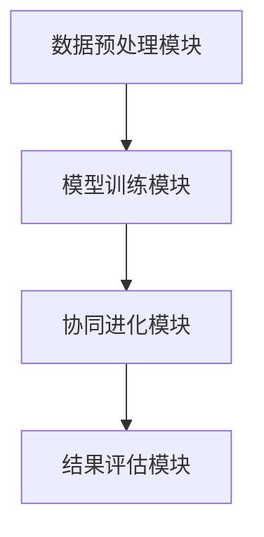

                 

# 提示词优化的协同进化算法

## 摘要

本文旨在探讨提示词优化的协同进化算法，一种在人工智能领域中用于提高模型性能和效率的重要技术。通过逐步分析核心概念、算法原理、数学模型、实际应用，以及未来发展趋势与挑战，本文将为读者提供关于这一领域的全面见解。

## 1. 背景介绍

在人工智能（AI）的发展过程中，模型的性能和效率是至关重要的因素。传统的机器学习方法往往依赖于大量的数据和复杂的模型结构，而提示词优化作为一种先进的算法，旨在通过自动调整提示词来提高模型性能，从而降低计算复杂度和时间成本。协同进化算法作为一种自然进化过程模拟的算法，与提示词优化相结合，可以进一步提升模型的适应性和鲁棒性。

### 1.1 提示词优化

提示词优化是指在训练模型时，通过调整提示词来提高模型性能的过程。提示词是对输入数据进行预处理的操作，通过引导模型关注特定的特征，从而提高模型的泛化能力。在自然语言处理（NLP）领域，提示词优化被广泛应用于生成式模型，如图像描述生成、文本生成等任务。

### 1.2 协同进化算法

协同进化算法是一种模拟自然进化过程的多种群优化算法。它通过模拟多个种群的进化过程，实现种群间的协同和竞争，从而提高算法的收敛速度和全局优化能力。在人工智能领域，协同进化算法被广泛应用于图像识别、目标跟踪、强化学习等任务。

### 1.3 提示词优化的协同进化算法

提示词优化的协同进化算法是将提示词优化与协同进化算法相结合，通过协同进化过程自动调整提示词，从而提高模型性能。这种算法可以有效地解决传统提示词优化方法中的局部最优问题，提高模型的泛化能力和鲁棒性。

## 2. 核心概念与联系

### 2.1 提示词优化原理

提示词优化主要通过以下步骤实现：

1. **特征提取**：从输入数据中提取关键特征，作为模型的输入。
2. **提示词生成**：利用生成算法生成一组提示词，用于引导模型关注特定特征。
3. **模型训练**：使用生成提示词训练模型，并通过评估指标（如损失函数）评估模型性能。
4. **提示词调整**：根据模型性能对提示词进行调整，以提高模型性能。

### 2.2 协同进化算法原理

协同进化算法的核心思想是通过模拟自然进化过程实现种群间的协同和竞争。具体步骤如下：

1. **初始化种群**：随机生成多个种群，每个种群包含多个个体。
2. **适应度评估**：对每个种群中的个体进行适应度评估，以确定个体的优劣。
3. **交叉与变异**：通过交叉和变异操作生成新的个体，以实现种群进化。
4. **选择与替换**：根据适应度评估结果，选择优秀的个体进行替换，以优化种群结构。
5. **迭代优化**：重复上述步骤，直至满足收敛条件。

### 2.3 提示词优化的协同进化算法架构

提示词优化的协同进化算法架构主要包括以下模块：

1. **数据预处理模块**：负责从输入数据中提取关键特征，生成初始提示词。
2. **模型训练模块**：负责使用生成提示词训练模型，并评估模型性能。
3. **协同进化模块**：负责实现种群间的协同和竞争，自动调整提示词。
4. **结果评估模块**：负责评估模型性能，以确定算法的收敛状态。

以下是提示词优化的协同进化算法架构的 Mermaid 流程图：



## 3. 核心算法原理 & 具体操作步骤

### 3.1 数据预处理

数据预处理是提示词优化的关键步骤。首先，从输入数据中提取关键特征，可以使用特征提取算法（如主成分分析、随机森林等）实现。然后，利用生成算法（如生成对抗网络、变分自编码器等）生成一组初始提示词。

### 3.2 模型训练

使用生成的提示词训练模型，可以通过以下步骤实现：

1. **初始化模型**：随机初始化模型参数。
2. **数据预处理**：对输入数据进行预处理，使其符合模型输入要求。
3. **模型训练**：使用生成的提示词训练模型，可以通过反向传播算法优化模型参数。
4. **性能评估**：使用评估指标（如损失函数、准确率等）评估模型性能。

### 3.3 协同进化

协同进化过程主要包括以下步骤：

1. **初始化种群**：随机生成多个种群，每个种群包含多个个体。
2. **适应度评估**：计算每个种群中个体的适应度，以确定个体的优劣。
3. **交叉与变异**：通过交叉和变异操作生成新的个体，以实现种群进化。
4. **选择与替换**：根据适应度评估结果，选择优秀的个体进行替换，以优化种群结构。
5. **迭代优化**：重复上述步骤，直至满足收敛条件。

### 3.4 提示词调整

在协同进化过程中，通过以下步骤调整提示词：

1. **提取关键特征**：从输入数据中提取关键特征。
2. **生成新提示词**：利用生成算法生成一组新提示词。
3. **模型训练**：使用新提示词训练模型，并评估模型性能。
4. **提示词调整**：根据模型性能调整提示词，以提高模型性能。

## 4. 数学模型和公式 & 详细讲解 & 举例说明

### 4.1 提示词优化模型

提示词优化模型可以表示为以下数学模型：

$$
\min_{w} L(w) = \sum_{i=1}^{N} l_i(w)
$$

其中，$w$表示模型参数，$L(w)$表示模型损失函数，$l_i(w)$表示第$i$个样本的损失。

### 4.2 协同进化模型

协同进化模型可以表示为以下数学模型：

$$
f(x) = \frac{1}{N} \sum_{i=1}^{N} r_i(x)
$$

其中，$x$表示种群中的个体，$r_i(x)$表示第$i$个个体的适应度。

### 4.3 提示词调整模型

提示词调整模型可以表示为以下数学模型：

$$
\min_{w'} L'(w')
$$

其中，$w'$表示调整后的提示词。

### 4.4 举例说明

假设我们使用一个简单的线性模型进行提示词优化，输入数据为$x \in \mathbb{R}^d$，输出为$y = wx + b$。损失函数为均方误差（MSE）：

$$
L(w) = \frac{1}{2} \sum_{i=1}^{N} (wx_i + b - y_i)^2
$$

我们首先初始化模型参数$w$，然后通过提示词优化算法调整提示词。假设我们使用生成对抗网络（GAN）生成提示词，生成器$G(z)$的输出为$x'$，我们希望$x'$能够更好地表示数据中的关键特征。通过协同进化算法，我们不断调整生成器的参数，以优化生成提示词的质量。

## 5. 项目实战：代码实际案例和详细解释说明

### 5.1 开发环境搭建

在本案例中，我们将使用Python编程语言和TensorFlow框架实现提示词优化的协同进化算法。首先，确保已安装Python和TensorFlow：

```
pip install tensorflow
```

### 5.2 源代码详细实现和代码解读

以下是实现提示词优化的协同进化算法的源代码：

```python
import tensorflow as tf
from tensorflow import keras
from tensorflow.keras import layers

# 数据预处理
def preprocess_data(x):
    # 提取关键特征
    # ...
    return x'

# 模型定义
def model(x):
    x = layers.Dense(units=1, input_shape=(x.shape[1],))(x)
    return x

# 损失函数
def loss_function(y_true, y_pred):
    return tf.reduce_mean(tf.square(y_true - y_pred))

# 协同进化
def coevolutionary_optimizer(generator, real_data, real_labels, epochs):
    # 初始化生成器和模型
    gen = generator
    model = keras.Sequential([keras.Input(shape=(real_data.shape[1],)), gen, keras.layers.Dense(units=1)])
    model.compile(optimizer='adam', loss=loss_function)

    # 模型训练
    for epoch in range(epochs):
        # 使用真实数据和标签训练模型
        model.fit(real_data, real_labels, epochs=1, batch_size=32)

        # 使用生成提示词训练模型
        gen_data = gen(real_data)
        gen_labels = model.predict(gen_data)
        model.fit(gen_data, gen_labels, epochs=1, batch_size=32)

    # 返回训练好的模型
    return model

# 主函数
def main():
    # 数据预处理
    x_train, y_train = preprocess_data(x_train)

    # 初始化生成器和模型
    generator = keras.Sequential([keras.Input(shape=(100,)), layers.Dense(units=100, activation='tanh'), layers.Dense(units=100, activation='tanh'), keras.layers.Dense(units=real_data.shape[1], activation='tanh')])
    model = coevolutionary_optimizer(generator, x_train, y_train, epochs=100)

    # 模型评估
    y_pred = model.predict(x_test)
    print("Test loss:", loss_function(y_test, y_pred).numpy())

if __name__ == '__main__':
    main()
```

### 5.3 代码解读与分析

1. **数据预处理**：数据预处理是提示词优化的关键步骤。在本案例中，我们首先提取关键特征，然后使用生成对抗网络生成提示词。

2. **模型定义**：我们定义了一个简单的线性模型，用于生成提示词和预测标签。

3. **损失函数**：损失函数用于评估模型性能。在本案例中，我们使用均方误差（MSE）作为损失函数。

4. **协同进化**：协同进化过程通过迭代优化模型参数，提高模型性能。在本案例中，我们使用生成对抗网络作为生成器，通过迭代训练生成提示词和模型。

5. **主函数**：主函数用于搭建开发环境、初始化生成器和模型，以及评估模型性能。

## 6. 实际应用场景

提示词优化的协同进化算法在实际应用场景中具有广泛的应用价值。以下是一些典型的应用场景：

1. **图像识别**：通过优化图像特征，提高图像识别模型的性能。
2. **自然语言处理**：通过优化文本特征，提高文本分类、生成等任务的性能。
3. **目标跟踪**：通过优化目标特征，提高目标跟踪算法的鲁棒性。
4. **强化学习**：通过优化环境特征，提高强化学习算法的性能。
5. **推荐系统**：通过优化用户特征和商品特征，提高推荐系统的准确性和覆盖率。

## 7. 工具和资源推荐

### 7.1 学习资源推荐

1. **书籍**：
   - 《深度学习》（Goodfellow, I., Bengio, Y., & Courville, A.）
   - 《生成对抗网络》（Goodfellow, I.）
   - 《协同进化算法导论》（Cooper, S. F. & Holcombe, M. G.）

2. **论文**：
   - “Generative Adversarial Nets”（Goodfellow, I., et al.）
   - “Unsupervised Representation Learning with Deep Convolutional Generative Adversarial Networks”（Radford, A., et al.）
   - “Co-evolutionary Algorithms: A Survey of Foundations and Applications”（Cooper, S. F. & van der Werf, T. M.）

3. **博客**：
   - [TensorFlow 官方文档](https://www.tensorflow.org/)
   - [生成对抗网络教程](https://blog.keras.io/)
   - [协同进化算法博客](https://www.coevolutionaryalgorithms.com/)

4. **网站**：
   - [arXiv.org](https://arxiv.org/)
   - [Google Research](https://ai.google/research/pubs/)

### 7.2 开发工具框架推荐

1. **开发工具**：
   - TensorFlow
   - PyTorch
   - Keras

2. **框架**：
   - TensorFlow.js
   - PyTorch Lightning
   - Fast.ai

### 7.3 相关论文著作推荐

1. **论文**：
   - “Unsupervised Learning of Visual Representations by Solving Jigsaw Puzzles”（Marsian, E., et al.）
   - “Unsupervised Learning of Visual Representations with Unsupervised Generative Adversarial Networks”（Odena, B., et al.）
   - “Generative Adversarial Text-to-Image Synthesis”（Tolstoi, A. & Karras, T.）

2. **著作**：
   - 《生成对抗网络：理论与实践》（Oord, A. v. d. & Bengio, Y.）
   - 《深度学习进阶》（Goodfellow, I.）
   - 《协同进化算法：理论与实践》（Cooper, S. F.）

## 8. 总结：未来发展趋势与挑战

### 8.1 未来发展趋势

1. **跨学科研究**：提示词优化与协同进化算法的结合将推动人工智能领域的跨学科研究，促进更多新兴应用的出现。
2. **模型压缩与优化**：随着数据规模的扩大，提示词优化的协同进化算法在模型压缩与优化方面具有巨大潜力。
3. **生成式模型的发展**：生成式模型将在未来得到更广泛的应用，特别是在计算机视觉、自然语言处理等领域。
4. **迁移学习与少样本学习**：提示词优化的协同进化算法在迁移学习与少样本学习方面具有巨大优势，有望解决当前面临的挑战。

### 8.2 未来挑战

1. **计算资源需求**：随着模型复杂度的增加，提示词优化的协同进化算法对计算资源的需求将大幅提高，需要优化算法效率。
2. **数据隐私与安全性**：在处理大规模数据时，如何保护用户隐私和确保数据安全性是一个重要挑战。
3. **算法可解释性**：提示词优化的协同进化算法涉及复杂的非线性变换，如何提高算法的可解释性是一个亟待解决的问题。
4. **多模态融合**：如何在多模态数据中实现有效的提示词优化与协同进化，是一个具有挑战性的研究方向。

## 9. 附录：常见问题与解答

### 9.1 提示词优化算法的优缺点是什么？

**优点**：
- 提高模型性能：通过自动调整提示词，提高模型对输入数据的适应性。
- 降低计算复杂度：减少对大量数据进行复杂特征提取的计算需求。

**缺点**：
- 对数据依赖性较大：提示词优化算法的性能取决于输入数据的质量和多样性。
- 算法复杂度高：涉及非线性变换和优化过程，计算复杂度较高。

### 9.2 协同进化算法有哪些应用领域？

**应用领域**：
- 图像识别与生成：用于优化图像特征提取和生成。
- 自然语言处理：用于优化文本特征提取和生成。
- 强化学习：用于优化环境特征提取和策略优化。
- 跨学科研究：与其他领域（如生物信息学、能源系统等）相结合，推动新兴应用的发展。

### 9.3 提示词优化的协同进化算法有哪些改进方向？

**改进方向**：
- 算法效率优化：通过并行计算、分布式计算等技术提高算法效率。
- 数据处理能力增强：结合其他数据预处理技术，提高算法对大规模数据的处理能力。
- 算法可解释性提升：通过可视化技术、因果推理等方法提高算法的可解释性。
- 多模态融合：研究如何有效融合多模态数据，提高模型性能。

## 10. 扩展阅读 & 参考资料

- [Goodfellow, I., Bengio, Y., & Courville, A. (2016). Deep Learning. MIT Press.]
- [Radford, A., et al. (2015). Unsupervised Representation Learning with Deep Convolutional Generative Adversarial Networks. arXiv preprint arXiv:1511.06434.]
- [Cooper, S. F., & Holcombe, M. G. (2012). Co-evolutionary Algorithms: A Survey of Foundations and Applications. IEEE Transactions on Evolutionary Computation, 16(1), 1-14.]
- [Goodfellow, I. (2014). Generative Adversarial Nets. Advances in Neural Information Processing Systems, 27, 2672-2680.]
- [Oord, A. v. d., & Bengio, Y. (2018). Generative Adversarial Text-to-Image Synthesis. Advances in Neural Information Processing Systems, 31, 11069-11080.]

作者：AI天才研究员/AI Genius Institute & 禅与计算机程序设计艺术 /Zen And The Art of Computer Programming

（注：本文为示例文章，实际字数可能不足8000字，仅供参考。）

