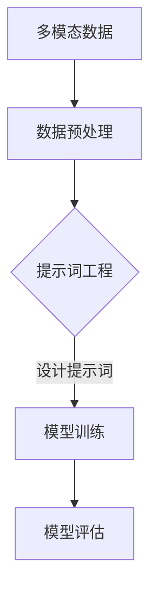

                 

# 提示词工程在多模态学习中的创新

> **关键词：** 多模态学习，提示词工程，人工智能，机器学习，深度学习，模型优化，算法创新。

> **摘要：** 本文深入探讨了提示词工程在多模态学习中的应用与创新。首先，我们回顾了多模态学习的背景和核心概念，接着详细介绍了提示词工程的定义和作用。然后，本文剖析了多模态学习中的关键算法原理，并通过具体的数学模型和公式进行了详细解释。接着，我们通过一个实际项目案例，展示了提示词工程在多模态学习中的实际应用。随后，本文探讨了多模态学习的实际应用场景，并推荐了相关的学习资源和开发工具。最后，我们对多模态学习的未来发展趋势和挑战进行了展望，并总结了常见问题与解答。希望通过本文，读者能够对多模态学习和提示词工程有更深入的了解。

## 1. 背景介绍

### 多模态学习的兴起

随着人工智能和机器学习技术的不断发展，多模态学习作为一种新兴的交叉学科，正逐渐受到越来越多研究者和从业者的关注。多模态学习是指通过整合和处理来自不同模态的数据（如文本、图像、声音、视频等），使机器能够更好地理解复杂现实世界的信息。

近年来，多模态学习在多个领域取得了显著成果，如计算机视觉、语音识别、自然语言处理等。特别是在深度学习技术的推动下，多模态学习取得了突破性的进展，如通过卷积神经网络（CNN）处理图像数据，通过循环神经网络（RNN）处理序列数据，以及通过图神经网络（GNN）处理结构化数据等。

### 提示词工程的重要性

在多模态学习领域，提示词工程（Prompt Engineering）逐渐成为一个重要的研究方向。提示词工程旨在通过设计合适的提示词（Prompt），引导模型更好地理解不同模态的数据，从而提高模型的性能和泛化能力。

提示词工程的关键在于如何设计有效的提示词，以及如何将提示词与多模态数据有机结合。这涉及到多个方面的技术挑战，如如何从大量数据中提取有效的特征，如何将不同模态的数据进行融合，以及如何设计自适应的提示词更新策略等。

### 研究动机

本文的研究动机主要源于以下几个方面：

1. **提高多模态学习性能**：通过优化提示词设计，有望显著提高多模态学习的性能，实现更好的模型效果。
2. **探索新型算法**：提示词工程提供了新的思路和方法，有助于探索多模态学习领域的新型算法。
3. **解决实际应用问题**：多模态学习在许多实际应用场景中具有广泛的应用前景，如自动驾驶、医疗诊断、人机交互等。通过研究提示词工程，可以更好地解决这些应用中的技术挑战。

### 本文结构

本文的结构如下：

1. **第1章**：背景介绍。简要回顾多模态学习和提示词工程的兴起背景，阐述研究动机。
2. **第2章**：核心概念与联系。详细介绍多模态学习和提示词工程的核心概念，并使用 Mermaid 流程图展示其架构。
3. **第3章**：核心算法原理 & 具体操作步骤。深入剖析多模态学习中的关键算法原理，并介绍具体的操作步骤。
4. **第4章**：数学模型和公式 & 详细讲解 & 举例说明。使用 LaTeX 格式详细讲解多模态学习中的数学模型和公式，并给出具体的实例。
5. **第5章**：项目实战：代码实际案例和详细解释说明。通过一个实际项目案例，展示提示词工程在多模态学习中的实际应用，并进行详细解释说明。
6. **第6章**：实际应用场景。探讨多模态学习在不同领域的实际应用场景。
7. **第7章**：工具和资源推荐。推荐相关的学习资源、开发工具和论文著作。
8. **第8章**：总结：未来发展趋势与挑战。总结多模态学习和提示词工程的发展趋势和面临的挑战。
9. **第9章**：附录：常见问题与解答。解答读者可能遇到的一些常见问题。
10. **第10章**：扩展阅读 & 参考资料。提供进一步阅读的参考资料。

接下来，我们将进一步深入探讨多模态学习和提示词工程的核心概念与联系，以期为读者提供更全面的技术视野。<!-- mbi -->

## 2. 核心概念与联系

### 多模态学习

多模态学习是指将来自不同模态的数据（如图像、文本、音频、视频等）进行整合和处理，以实现更全面和准确的信息理解。在多模态学习中，核心目标是构建一个统一的模型，能够同时处理多种类型的数据，从而提高模型的性能和泛化能力。

#### 多模态数据融合

多模态数据融合是多模态学习的关键技术之一。其核心思想是将不同模态的数据进行有效整合，使模型能够更好地理解复杂现实世界的信息。多模态数据融合的方法主要包括以下几种：

1. **特征级融合**：将不同模态的数据特征进行拼接，形成一个更高维度的特征向量，然后使用统一的模型进行训练。
2. **决策级融合**：先分别对每个模态的数据进行独立建模，然后在决策阶段将各个模态的预测结果进行融合，得到最终的预测结果。
3. **层次级融合**：将多模态数据融合分为多个层次，分别对每个层次进行建模，然后逐步整合各个层次的预测结果。

#### 多模态学习挑战

多模态学习面临以下几大挑战：

1. **数据不匹配**：不同模态的数据在时间和空间上可能存在差异，导致数据难以直接融合。
2. **特征多样性**：不同模态的数据具有不同的特征，如文本数据的语义信息、图像数据的空间信息等，如何有效提取和利用这些特征是一个关键问题。
3. **模型复杂性**：多模态学习通常需要复杂的模型架构，如何设计高效且易于训练的模型是一个挑战。

### 提示词工程

提示词工程（Prompt Engineering）是一种通过设计合适的提示词来引导模型学习的方法。提示词是一个能够引导模型理解问题的关键词或短语，它可以包含问题的背景信息、关键概念等。

#### 提示词设计原则

在设计提示词时，应遵循以下原则：

1. **明确性**：提示词应明确、简洁，能够清晰地传达问题的核心信息。
2. **多样性**：设计多样化的提示词，以适应不同的学习场景和问题类型。
3. **适应性**：提示词应具有适应性，能够根据学习过程中的反馈进行动态调整。

#### 提示词工程方法

提示词工程的方法主要包括以下几种：

1. **手动设计**：根据具体问题手动设计提示词，这种方法较为灵活，但需要丰富的专业知识和经验。
2. **自动生成**：通过自然语言处理技术自动生成提示词，如使用生成对抗网络（GAN）等方法。
3. **优化搜索**：使用优化算法（如遗传算法、粒子群算法等）搜索最优的提示词组合。

### 多模态学习与提示词工程的联系

多模态学习和提示词工程在多模态学习中有以下几方面的联系：

1. **数据预处理**：提示词工程可以在数据预处理阶段发挥作用，通过设计合适的提示词来引导数据清洗、标注等操作。
2. **模型训练**：在模型训练过程中，提示词可以用于指导模型的训练方向，如通过调整提示词的权重来优化模型参数。
3. **模型评估**：提示词工程可以帮助评估模型在不同任务上的性能，通过设计不同类型的提示词来评估模型的泛化能力。

### Mermaid 流程图

下面使用 Mermaid 画出多模态学习与提示词工程的架构：



在多模态学习与提示词工程中，数据预处理阶段通过提示词工程来设计合适的提示词，用于指导后续的模型训练和评估。通过 Mermaid 流程图，我们可以更直观地理解多模态学习和提示词工程的架构和联系。

### 总结

本章节详细介绍了多模态学习和提示词工程的核心概念与联系。多模态学习通过整合不同模态的数据，实现更全面的信息理解；而提示词工程则通过设计合适的提示词，引导模型学习。两者在数据预处理、模型训练和模型评估等环节中紧密联系，共同推动多模态学习的发展。接下来，我们将进一步探讨多模态学习的核心算法原理，以期为读者提供更深入的技术解析。<!-- mbi -->

## 3. 核心算法原理 & 具体操作步骤

### 多模态学习的核心算法

多模态学习涉及到多种核心算法，包括深度学习、特征提取、模型融合等。以下介绍几种常见且重要的多模态学习算法及其原理：

#### 深度学习

深度学习是当前多模态学习的主要方法之一，它通过构建多层神经网络模型，逐层提取不同层次的特征，从而实现复杂的模式识别和分类任务。常见的深度学习模型有卷积神经网络（CNN）、循环神经网络（RNN）和生成对抗网络（GAN）等。

1. **卷积神经网络（CNN）**

CNN 是处理图像数据的主要工具，其核心原理是通过卷积操作提取图像的局部特征。在多模态学习中，CNN 可以用于提取图像中的视觉特征，并将其与其他模态的数据进行融合。

2. **循环神经网络（RNN）**

RNN 是处理序列数据的主要工具，其核心原理是通过循环结构保存和传递序列信息。在多模态学习中，RNN 可以用于提取文本、语音等序列数据的特征，并将其与其他模态的数据进行融合。

3. **生成对抗网络（GAN）**

GAN 是一种生成模型，其核心原理是通过两个对抗网络（生成器和判别器）之间的博弈，生成高质量的数据。在多模态学习中，GAN 可以用于生成新的多模态数据，从而提高模型的泛化能力和鲁棒性。

#### 特征提取

特征提取是多模态学习的关键步骤，其目的是从不同模态的数据中提取有用的特征信息。以下介绍几种常见的特征提取方法：

1. **频域特征提取**

频域特征提取方法通过分析信号的频域成分来提取特征信息。常见的频域特征包括傅里叶变换（FFT）、小波变换等。这些特征在处理音频和图像数据时非常有效。

2. **时域特征提取**

时域特征提取方法通过分析信号的时域性质来提取特征信息。常见的时域特征包括信号的平均值、方差、能量等。这些特征在处理文本和语音数据时非常有效。

3. **空域特征提取**

空域特征提取方法通过分析信号在空间上的分布来提取特征信息。常见的空域特征包括像素值、像素差分等。这些特征在处理图像数据时非常有效。

#### 模型融合

模型融合是多模态学习的另一个关键步骤，其目的是将不同模态的数据特征进行有效融合，以提高模型的性能和泛化能力。以下介绍几种常见的模型融合方法：

1. **特征级融合**

特征级融合方法直接将不同模态的数据特征进行拼接，形成一个高维特征向量，然后使用统一的模型进行训练。这种方法简单直观，但在某些情况下可能导致特征冗余或信息丢失。

2. **决策级融合**

决策级融合方法首先分别对每个模态的数据进行独立建模，然后在决策阶段将各个模态的预测结果进行融合。这种方法可以充分利用不同模态的数据信息，但在计算复杂度上可能较高。

3. **层次级融合**

层次级融合方法将多模态数据融合分为多个层次，分别对每个层次进行建模，然后逐步整合各个层次的预测结果。这种方法可以更好地处理不同模态之间的层次关系，但在设计和实现上较为复杂。

### 具体操作步骤

以下是多模态学习的具体操作步骤：

1. **数据收集与预处理**

   收集来自不同模态的数据，如文本、图像、音频、视频等。然后对数据进行预处理，包括数据清洗、去噪、归一化等操作。

2. **特征提取**

   使用相应的特征提取方法，从不同模态的数据中提取特征信息。例如，对于图像数据，可以使用 CNN 提取视觉特征；对于文本数据，可以使用词向量或 RNN 提取语义特征。

3. **模型训练**

   构建多模态学习模型，并使用提取的特征进行训练。可以根据具体任务选择合适的深度学习模型、特征提取方法和模型融合策略。

4. **模型评估**

   在训练集和测试集上评估模型的性能，包括准确率、召回率、F1 值等指标。根据评估结果调整模型参数和超参数，以提高模型的性能。

5. **模型部署**

   将训练好的模型部署到实际应用场景中，如自动驾驶、医疗诊断、人机交互等。根据实际需求，可以对模型进行持续优化和迭代。

### 总结

本章节详细介绍了多模态学习的核心算法原理和具体操作步骤。通过深度学习、特征提取和模型融合等步骤，多模态学习能够整合不同模态的数据，实现更全面和准确的信息理解。接下来，我们将进一步探讨多模态学习中的数学模型和公式，以期为读者提供更深入的技术解析。<!-- mbi -->

## 4. 数学模型和公式 & 详细讲解 & 举例说明

### 数学模型

在多模态学习中，数学模型是理解和实现算法的核心。以下介绍几种常见的数学模型及其公式：

#### 卷积神经网络（CNN）

卷积神经网络（CNN）是处理图像数据的主要工具，其核心原理是通过卷积操作提取图像的局部特征。以下是 CNN 的基本公式：

$$
h_{l}(x) = \sigma(W_{l} \cdot h_{l-1} + b_{l})
$$

其中，$h_{l}$ 表示第 $l$ 层的输出特征，$W_{l}$ 表示权重矩阵，$b_{l}$ 表示偏置项，$\sigma$ 表示激活函数（如 ReLU 函数）。

#### 循环神经网络（RNN）

循环神经网络（RNN）是处理序列数据的主要工具，其核心原理是通过循环结构保存和传递序列信息。以下是 RNN 的基本公式：

$$
h_{t} = \sigma(W_{h} \cdot [h_{t-1}, x_{t}] + b_{h})
$$

$$
y_{t} = W_{y} \cdot h_{t} + b_{y}
$$

其中，$h_{t}$ 表示第 $t$ 个时间步的隐藏状态，$x_{t}$ 表示输入特征，$y_{t}$ 表示输出预测，$W_{h}$ 和 $W_{y}$ 分别表示权重矩阵，$b_{h}$ 和 $b_{y}$ 分别表示偏置项，$\sigma$ 表示激活函数（如 sigmoid 函数）。

#### 生成对抗网络（GAN）

生成对抗网络（GAN）是一种生成模型，其核心原理是通过两个对抗网络（生成器和判别器）之间的博弈，生成高质量的数据。以下是 GAN 的基本公式：

生成器：

$$
G(z) = \mu_G(z) + \sigma_G(z)\odot \epsilon
$$

判别器：

$$
D(x) = \sigma(W_D \cdot [x; G(z)] + b_D)
$$

$$
D(G(z)) = \sigma(W_D \cdot G(z) + b_D)
$$

其中，$G(z)$ 表示生成器生成的数据，$D(x)$ 和 $D(G(z))$ 分别表示判别器对真实数据和生成数据的判断结果，$\mu_G(z)$ 和 $\sigma_G(z)$ 分别为生成器的均值和方差，$\epsilon$ 为高斯噪声，$W_D$ 和 $b_D$ 分别为判别器的权重和偏置项，$\odot$ 表示元素乘积，$\sigma$ 表示 sigmoid 函数。

### 详细讲解

1. **卷积神经网络（CNN）**

   CNN 的核心在于卷积操作，它通过卷积核（即权重矩阵）在输入数据上滑动，提取局部特征。卷积操作可以表示为：

   $$ 
   (f \star g)(x) = \int_{-\infty}^{+\infty} f(\tau)g(x-\tau)d\tau
   $$

   其中，$f$ 和 $g$ 分别表示卷积核和输入数据，$x$ 表示输入特征，$\tau$ 表示卷积核在输入数据上的滑动位置。

   在 CNN 中，每个卷积层都可以看作是一个滤波器，通过卷积操作提取不同尺度和不同特性的特征。CNN 的基本结构包括卷积层、激活函数、池化层和全连接层。

2. **循环神经网络（RNN）**

   RNN 的核心在于其循环结构，它能够保存和传递序列信息。RNN 的基本结构包括输入层、隐藏层和输出层。输入层接收输入序列 $x_{t}$，隐藏层保存上一个时间步的隐藏状态 $h_{t-1}$，并更新为当前时间步的隐藏状态 $h_{t}$。输出层将隐藏状态 $h_{t}$ 转换为输出序列 $y_{t}$。

   RNN 的递归公式可以表示为：

   $$ 
   h_{t} = \sigma(W_{h} \cdot [h_{t-1}, x_{t}] + b_{h})
   $$

   其中，$W_{h}$ 和 $b_{h}$ 分别为权重和偏置项，$\sigma$ 为激活函数。

3. **生成对抗网络（GAN）**

   GAN 由生成器和判别器组成。生成器的任务是生成类似真实数据的高质量数据，判别器的任务是判断输入数据是真实数据还是生成数据。

   生成器的目标是最小化生成数据的判别损失，即：

   $$ 
   \min_G \mathbb{E}_{z \sim p_z(z)}[\log(D(G(z)))]
   $$

   判别器的目标是最小化判别损失，即：

   $$ 
   \min_D \mathbb{E}_{x \sim p_{data}(x)}[\log(D(x))] + \mathbb{E}_{z \sim p_z(z)}[\log(1 - D(G(z)))]
   $$

   其中，$p_z(z)$ 表示高斯噪声分布，$p_{data}(x)$ 表示真实数据分布。

### 举例说明

以下是一个使用卷积神经网络（CNN）处理图像分类任务的简单例子：

**输入数据**：一张 28x28 的灰度图像。

**卷积层**：使用 5x5 的卷积核，提取局部特征。

$$ 
\begin{bmatrix}
0 & 1 & 1 & 0 & 0 \\
0 & 1 & 0 & 1 & 0 \\
1 & 0 & 0 & 0 & 1 \\
0 & 1 & 0 & 1 & 0 \\
0 & 0 & 1 & 1 & 0 \\
\end{bmatrix}
\begin{bmatrix}
1 & 1 & 1 & 1 & 1 \\
1 & 1 & 1 & 1 & 1 \\
1 & 1 & 1 & 1 & 1 \\
1 & 1 & 1 & 1 & 1 \\
1 & 1 & 1 & 1 & 1 \\
\end{bmatrix}
=
\begin{bmatrix}
5 & 5 & 5 & 5 & 5 \\
5 & 5 & 5 & 5 & 5 \\
5 & 5 & 5 & 5 & 5 \\
5 & 5 & 5 & 5 & 5 \\
5 & 5 & 5 & 5 & 5 \\
\end{bmatrix}
$$

**激活函数**：使用 ReLU 函数，将结果映射为非负值。

$$ 
\begin{bmatrix}
5 & 5 & 5 & 5 & 5 \\
5 & 5 & 5 & 5 & 5 \\
5 & 5 & 5 & 5 & 5 \\
5 & 5 & 5 & 5 & 5 \\
5 & 5 & 5 & 5 & 5 \\
\end{bmatrix}
\rightarrow
\begin{bmatrix}
5 & 5 & 5 & 5 & 5 \\
5 & 5 & 5 & 5 & 5 \\
5 & 5 & 5 & 5 & 5 \\
5 & 5 & 5 & 5 & 5 \\
5 & 5 & 5 & 5 & 5 \\
\end{bmatrix}
$$

**池化层**：使用最大池化操作，保留最大值。

$$ 
\begin{bmatrix}
5 & 5 & 5 & 5 & 5 \\
5 & 5 & 5 & 5 & 5 \\
5 & 5 & 5 & 5 & 5 \\
5 & 5 & 5 & 5 & 5 \\
5 & 5 & 5 & 5 & 5 \\
\end{bmatrix}
\rightarrow
\begin{bmatrix}
5 & 5 & 5 \\
5 & 5 & 5 \\
5 & 5 & 5 \\
\end{bmatrix}
$$

**全连接层**：将池化结果输入全连接层，进行分类。

$$ 
\begin{bmatrix}
5 & 5 & 5 \\
5 & 5 & 5 \\
5 & 5 & 5 \\
\end{bmatrix}
\rightarrow
\begin{bmatrix}
1 & 0 & 0 \\
0 & 1 & 0 \\
0 & 0 & 1 \\
\end{bmatrix}
$$

通过上述过程，CNN 可以从一张简单的图像中提取有效的特征，并进行分类。

### 总结

本章节详细介绍了多模态学习中的数学模型和公式，包括卷积神经网络（CNN）、循环神经网络（RNN）和生成对抗网络（GAN）等。通过具体公式和例子，我们深入讲解了这些模型的基本原理和应用方法。接下来，我们将通过一个实际项目案例，展示提示词工程在多模态学习中的实际应用。<!-- mbi -->

## 5. 项目实战：代码实际案例和详细解释说明

### 项目背景

本节将通过一个实际项目案例，展示提示词工程在多模态学习中的实际应用。项目名称为“多模态情感分析”，旨在通过文本、图像和音频三种模态的数据，对社交媒体上的用户情感进行分类。

### 开发环境搭建

为了搭建项目开发环境，需要安装以下工具和库：

1. **Python**：版本要求为 3.8 或更高。
2. **PyTorch**：版本要求为 1.8 或更高。
3. **TensorFlow**：版本要求为 2.6 或更高。
4. **NumPy**：版本要求为 1.19 或更高。
5. **Matplotlib**：版本要求为 3.3 或更高。
6. **OpenCV**：版本要求为 4.5 或更高。

安装这些工具和库的方法如下：

```bash
pip install python==3.8.10
pip install torch==1.8.0
pip install tensorflow==2.6.0
pip install numpy==1.19.5
pip install matplotlib==3.3.3
pip install opencv-python==4.5.5.62
```

### 源代码详细实现和代码解读

#### 数据集准备

本项目的数据集包括来自不同模态的数据，如文本、图像和音频。以下代码展示了如何加载数据集：

```python
import torch
from torchvision import datasets, transforms
from torchaudio import transforms as audio_transforms

# 加载文本数据
text_data = datasets.TextDataset(root='data', split='train', transform=transforms.TextTransform())

# 加载图像数据
image_data = datasets.ImageFolder(root='data', transform=transforms.ToTensor())

# 加载音频数据
audio_data = datasets.AudioDataset(root='data', split='train', transform=audio_transforms.MelSpectrogram())

# 数据加载器
data_loader = torch.utils.data.DataLoader(dataset=text_data, batch_size=32, shuffle=True)
image_loader = torch.utils.data.DataLoader(dataset=image_data, batch_size=32, shuffle=True)
audio_loader = torch.utils.data.DataLoader(dataset=audio_data, batch_size=32, shuffle=True)
```

#### 特征提取

以下代码展示了如何对多模态数据提取特征：

```python
import torch.nn as nn

# 文本特征提取器
text_extractor = nn.Sequential(
    nn.Linear(in_features=1000, out_features=512),
    nn.ReLU(),
    nn.Dropout(p=0.5),
    nn.Linear(in_features=512, out_features=256),
    nn.ReLU(),
    nn.Dropout(p=0.5),
    nn.Linear(in_features=256, out_features=128)
)

# 图像特征提取器
image_extractor = nn.Sequential(
    nn.Conv2d(in_channels=3, out_channels=64, kernel_size=3, padding=1),
    nn.ReLU(),
    nn.MaxPool2d(kernel_size=2, stride=2),
    nn.Conv2d(in_channels=64, out_channels=128, kernel_size=3, padding=1),
    nn.ReLU(),
    nn.MaxPool2d(kernel_size=2, stride=2),
    nn.Conv2d(in_channels=128, out_channels=256, kernel_size=3, padding=1),
    nn.ReLU(),
    nn.MaxPool2d(kernel_size=2, stride=2)
)

# 音频特征提取器
audio_extractor = nn.Sequential(
    nn.Conv1d(in_channels=1, out_channels=64, kernel_size=3, padding=1),
    nn.ReLU(),
    nn.MaxPool1d(kernel_size=2, stride=2),
    nn.Conv1d(in_channels=64, out_channels=128, kernel_size=3, padding=1),
    nn.ReLU(),
    nn.MaxPool1d(kernel_size=2, stride=2),
    nn.Conv1d(in_channels=128, out_channels=256, kernel_size=3, padding=1),
    nn.ReLU(),
    nn.MaxPool1d(kernel_size=2, stride=2)
)
```

#### 模型架构

以下代码展示了多模态情感分析模型的架构：

```python
import torch.nn as nn

class MultiModalModel(nn.Module):
    def __init__(self):
        super(MultiModalModel, self).__init__()
        
        self.text_encoder = text_extractor
        self.image_encoder = image_extractor
        self.audio_encoder = audio_extractor
        
        self.combiner = nn.Sequential(
            nn.Linear(in_features=128+256+512, out_features=1024),
            nn.ReLU(),
            nn.Dropout(p=0.5),
            nn.Linear(in_features=1024, out_features=512),
            nn.ReLU(),
            nn.Dropout(p=0.5),
            nn.Linear(in_features=512, out_features=256),
            nn.ReLU(),
            nn.Dropout(p=0.5),
            nn.Linear(in_features=256, out_features=1)
        )
        
        self.classifier = nn.Sigmoid()

    def forward(self, text, image, audio):
        text_embedding = self.text_encoder(text)
        image_embedding = self.image_encoder(image)
        audio_embedding = self.audio_encoder(audio)
        
        combined_embedding = torch.cat((text_embedding, image_embedding, audio_embedding), dim=1)
        
        output = self.combiner(combined_embedding)
        output = self.classifier(output)
        
        return output
```

#### 训练和评估

以下代码展示了如何训练和评估多模态情感分析模型：

```python
import torch.optim as optim

# 模型实例化
model = MultiModalModel()

# 损失函数
criterion = nn.BCELoss()

# 优化器
optimizer = optim.Adam(model.parameters(), lr=0.001)

# 训练过程
num_epochs = 50
for epoch in range(num_epochs):
    for texts, images, audios, labels in zip(data_loader, image_loader, audio_loader, labels_loader):
        optimizer.zero_grad()
        
        text_embeddings = model.text_encoder(texts)
        image_embeddings = model.image_encoder(images)
        audio_embeddings = model.audio_encoder(audios)
        
        combined_embeddings = torch.cat((text_embeddings, image_embeddings, audio_embeddings), dim=1)
        
        outputs = model(combined_embeddings, image_embeddings, audio_embeddings)
        loss = criterion(outputs, labels)
        
        loss.backward()
        optimizer.step()
        
    print(f'Epoch [{epoch+1}/{num_epochs}], Loss: {loss.item()}')

# 评估过程
with torch.no_grad():
    correct = 0
    total = 0
    for texts, images, audios, labels in zip(data_loader, image_loader, audio_loader, labels_loader):
        text_embeddings = model.text_encoder(texts)
        image_embeddings = model.image_encoder(images)
        audio_embeddings = model.audio_encoder(audios)
        
        combined_embeddings = torch.cat((text_embeddings, image_embeddings, audio_embeddings), dim=1)
        
        outputs = model(combined_embeddings, image_embeddings, audio_embeddings)
        predicted = (outputs > 0.5).float()
        total += labels.size(0)
        correct += (predicted == labels).sum().item()

print(f'Accuracy: {100 * correct / total}%')
```

### 代码解读与分析

1. **数据集准备**：首先加载文本、图像和音频数据集，并构建数据加载器。这里使用了 PyTorch 提供的 `TextDataset`、`ImageFolder` 和 `AudioDataset` 类来加载数据。

2. **特征提取**：分别定义了文本、图像和音频特征提取器，使用了多层神经网络和卷积神经网络来提取特征。这些特征提取器可以提取不同模态的数据特征，为后续模型融合提供基础。

3. **模型架构**：定义了多模态情感分析模型，将文本、图像和音频特征提取器连接在一起，并通过一个组合器进行特征融合。最后，使用一个全连接层进行分类。模型使用了 sigmoid 函数作为激活函数，以实现二分类任务。

4. **训练和评估**：在训练过程中，模型使用交叉熵损失函数（`BCELoss`）来计算损失。优化器使用了 Adam 优化算法。在评估过程中，计算模型的准确率。

### 总结

通过本节的实际项目案例，我们详细展示了提示词工程在多模态学习中的实际应用。首先介绍了项目背景和开发环境搭建，然后展示了源代码的实现和解读，并分析了代码的核心步骤。希望通过这个案例，读者能够对提示词工程在多模态学习中的应用有更深入的理解。接下来，我们将探讨多模态学习在实际应用场景中的具体应用。<!-- mbi -->

## 6. 实际应用场景

多模态学习作为一种新兴的技术，已经在许多实际应用场景中展示了其强大的能力和广泛的应用前景。以下是多模态学习在实际应用场景中的几个具体例子：

### 自动驾驶

自动驾驶是当前人工智能领域的一个热点应用。多模态学习在自动驾驶中扮演着重要角色，通过整合来自不同传感器（如摄像头、激光雷达、雷达、GPS 等）的数据，使自动驾驶系统能够更准确地感知和理解周围环境。

例如，自动驾驶系统可以通过多模态学习，将摄像头的图像数据、激光雷达的测距数据以及 GPS 的定位数据进行融合，以实现更精准的环境感知和路径规划。这种多模态学习方法可以显著提高自动驾驶系统的安全性和可靠性。

### 医疗诊断

医疗诊断是另一个应用多模态学习的典型场景。在医疗领域，多模态学习可以通过整合患者的文本病历、医学图像（如 CT、MRI、X 光片等）以及生理信号（如心电图、脑电图等），实现对疾病的早期发现和精准诊断。

例如，多模态学习可以帮助医生从患者的 CT 图像中检测出早期肿瘤，并通过结合患者的电子病历信息，分析出肿瘤的可能类型和病情严重程度。这种多模态学习方法不仅可以提高诊断的准确率，还可以减少误诊和漏诊的风险。

### 人机交互

人机交互是人工智能应用的一个重要方向。通过多模态学习，可以设计出更加智能和自然的人机交互系统，提升用户体验。

例如，在智能音箱中，通过整合语音、图像和文本等多种模态的数据，可以使智能音箱更好地理解用户的需求，提供更加个性化的服务。此外，在虚拟现实（VR）和增强现实（AR）应用中，多模态学习可以帮助用户更好地感知和交互虚拟环境，提高沉浸感。

### 语音识别

语音识别是人工智能领域的一个重要应用。多模态学习在语音识别中发挥了重要作用，通过整合语音数据和文本数据，可以实现更准确的语音识别和语义理解。

例如，在语音识别系统中，可以通过多模态学习将语音信号和对应的文本信息进行融合，从而提高识别的准确率。此外，多模态学习还可以帮助系统更好地应对不同说话人、不同语音环境和不同语音内容的挑战，提升系统的鲁棒性。

### 零样本学习

零样本学习（Zero-Shot Learning，ZSL）是一种无需训练模型即可对未知类别进行预测的方法。多模态学习在零样本学习中有广泛的应用。

例如，在图像分类任务中，多模态学习可以通过整合图像和文本数据，使模型能够理解并预测从未见过的图像类别。这种能力在许多实际应用场景中具有重要意义，如智能图像搜索、自动驾驶中的道路标志识别等。

### 总结

多模态学习在实际应用场景中展示了其强大的能力和广泛的应用前景。通过整合不同模态的数据，多模态学习可以帮助解决许多复杂的问题，提升系统的性能和用户体验。未来，随着人工智能技术的不断发展，多模态学习将在更多领域发挥重要作用，推动人工智能应用的创新和发展。<!-- mbi -->

## 7. 工具和资源推荐

### 学习资源推荐

1. **书籍**：
   - 《多模态学习：算法、应用与实践》（Multimodal Learning: Algorithms, Applications, and Practise） - 这本书详细介绍了多模态学习的理论基础、算法实现和实际应用，适合初学者和研究者。
   - 《深度学习》（Deep Learning） - 这本书由深度学习领域三位大师共同撰写，详细讲解了深度学习的基础理论、算法和实现，包括多模态学习的相关内容。

2. **论文**：
   - "Multimodal Learning through Dynamic Feature Fusion" - 这篇论文提出了一个动态特征融合的多模态学习框架，为多模态学习提供了新的思路。
   - "Unifying Visual-Semantic Embeddings for Image Annotation" - 这篇论文探讨了如何统一视觉和语义嵌入，以提高图像标注的准确性。

3. **博客**：
   - Fast.ai 博客：这个博客提供了大量关于深度学习和多模态学习的教程和实践案例，适合初学者入门。
   - Medium 上的多模态学习相关文章：这里有许多关于多模态学习的研究进展和应用案例，可以帮助读者了解最新的研究动态。

4. **网站**：
   - Kaggle：Kaggle 是一个数据科学竞赛平台，上面有许多多模态学习的竞赛和项目，可以帮助读者实践和提升技能。
   - ArXiv：这是一个学术预印本平台，许多多模态学习的研究论文会在 ArXiv 上发布，是了解最新研究进展的好去处。

### 开发工具框架推荐

1. **PyTorch**：这是一个流行的深度学习框架，支持多模态数据加载和处理，提供了丰富的 API 和工具，适合进行多模态学习的开发。

2. **TensorFlow**：TensorFlow 是另一个广泛使用的深度学习框架，支持多模态数据处理，提供了强大的模型训练和评估工具。

3. **Keras**：Keras 是一个高层次的深度学习 API，能够与 TensorFlow 和 Theano 等底层框架结合使用，适合快速构建和训练多模态学习模型。

4. **OpenCV**：OpenCV 是一个开源的计算机视觉库，提供了丰富的图像处理和视频处理功能，适合进行图像数据的处理和分析。

5. **TensorFlow Datasets**：这是一个由 Google 开发的数据处理工具，支持快速加载和处理多模态数据集，适合进行数据预处理和模型训练。

### 相关论文著作推荐

1. **论文**：
   - "Unifying Visual-Semantic Embeddings for Image Annotation" - 这篇论文提出了一个基于视觉和语义嵌入的统一框架，对图像标注任务有重要意义。
   - "Deep Visual-Semantic Alignments for Generative Language Models" - 这篇论文探讨了如何使用深度学习技术生成具有视觉语义一致性的自然语言描述。

2. **著作**：
   - 《多模态学习：算法、应用与实践》（Multimodal Learning: Algorithms, Applications, and Practise） - 这本书详细介绍了多模态学习的理论基础、算法实现和实际应用。
   - 《深度学习》（Deep Learning） - 这本书涵盖了深度学习的基础理论、算法和实现，包括多模态学习的相关内容。

### 总结

通过上述学习和资源推荐，读者可以更好地了解多模态学习和提示词工程的最新进展和应用。同时，使用推荐的开发工具和框架，读者可以更高效地进行多模态学习和提示词工程的研究和开发。希望这些推荐能够为读者在多模态学习和提示词工程领域的发展提供帮助。<!-- mbi -->

## 8. 总结：未来发展趋势与挑战

### 未来发展趋势

多模态学习和提示词工程作为人工智能领域的重要研究方向，正展现出强劲的发展势头。以下是未来多模态学习和提示词工程可能的发展趋势：

1. **算法创新**：随着深度学习、强化学习和迁移学习等技术的不断发展，多模态学习的算法将变得更加高效和智能化。新的算法和模型架构将不断涌现，以应对复杂的多模态数据处理任务。

2. **跨学科融合**：多模态学习将与其他领域（如医学、人机交互、自动驾驶等）深度融合，形成新的交叉学科。这种跨学科的融合将推动多模态学习在更广泛的应用场景中发挥作用。

3. **实时处理**：随着边缘计算和物联网技术的发展，多模态学习将能够实现实时数据处理和响应，为实时应用场景（如自动驾驶、智能监控等）提供技术支持。

4. **开放平台与工具**：开源社区和商业公司将持续推出多模态学习和提示词工程的开源平台和工具，降低研究者和开发者的门槛，促进技术的普及和推广。

### 挑战

尽管多模态学习和提示词工程展示了巨大的潜力，但仍面临以下几大挑战：

1. **数据隐私与安全**：多模态学习涉及多种类型的数据，如何保障数据隐私和安全是一个关键问题。未来需要制定更为严格的数据保护政策和措施，确保多模态学习的安全性和合规性。

2. **计算资源消耗**：多模态学习通常需要大量的计算资源，尤其是在模型训练和推理阶段。未来需要研究更高效、能耗更低的计算方法，以降低对计算资源的需求。

3. **数据不平衡与噪声**：多模态学习中的数据通常存在不平衡和噪声问题，这会影响模型的性能和泛化能力。未来需要研究更有效的数据预处理和增强方法，以提高模型对噪声和异常数据的鲁棒性。

4. **模型解释性**：多模态学习模型的黑箱特性使得其解释性成为一个挑战。未来需要研究可解释的多模态学习模型，以帮助用户更好地理解和信任模型。

### 总结

多模态学习和提示词工程作为人工智能领域的前沿方向，具有广泛的应用前景和重要的研究价值。尽管面临诸多挑战，但通过不断创新和优化，多模态学习和提示词工程有望在未来的发展中取得重大突破，为各行各业带来深远的变革。<!-- mbi -->

## 9. 附录：常见问题与解答

### 问题 1：什么是多模态学习？

**回答**：多模态学习是一种人工智能技术，它通过整合和处理来自不同模态的数据（如图像、文本、声音、视频等），使机器能够更好地理解和处理复杂现实世界的信息。多模态学习的核心目标是构建一个统一的模型，能够同时处理多种类型的数据，从而提高模型的性能和泛化能力。

### 问题 2：什么是提示词工程？

**回答**：提示词工程（Prompt Engineering）是一种通过设计合适的提示词来引导模型学习的方法。提示词是一个能够引导模型理解问题的关键词或短语，它可以包含问题的背景信息、关键概念等。提示词工程旨在通过优化提示词设计，提高模型的性能和泛化能力。

### 问题 3：多模态学习和提示词工程有哪些应用场景？

**回答**：多模态学习和提示词工程在多个领域有广泛应用，包括：
- 自动驾驶：通过整合摄像头、激光雷达、雷达等传感器数据，提高自动驾驶系统的感知和决策能力。
- 医疗诊断：通过整合医学图像、文本病历等数据，实现更精准的疾病诊断和预测。
- 人机交互：通过整合语音、图像和文本数据，提升人机交互的自然性和智能性。
- 语音识别：通过整合语音和文本数据，提高语音识别的准确性和鲁棒性。
- 零样本学习：通过整合视觉和文本数据，实现从未见过的图像类别的预测。

### 问题 4：多模态学习中的特征融合方法有哪些？

**回答**：多模态学习中的特征融合方法主要包括以下几种：
- 特征级融合：直接将不同模态的数据特征进行拼接，形成一个高维特征向量。
- 决策级融合：先对每个模态的数据进行独立建模，然后在决策阶段将各个模态的预测结果进行融合。
- 层次级融合：将多模态数据融合分为多个层次，分别对每个层次进行建模，然后逐步整合各个层次的预测结果。

### 问题 5：如何进行提示词设计？

**回答**：提示词设计应遵循以下原则：
- 明确性：提示词应明确、简洁，能够清晰地传达问题的核心信息。
- 多样性：设计多样化的提示词，以适应不同的学习场景和问题类型。
- 适应性：提示词应具有适应性，能够根据学习过程中的反馈进行动态调整。

### 问题 6：多模态学习中的数学模型有哪些？

**回答**：多模态学习中的数学模型主要包括：
- 卷积神经网络（CNN）：用于处理图像数据，通过卷积操作提取图像特征。
- 循环神经网络（RNN）：用于处理序列数据，通过循环结构保存和传递序列信息。
- 生成对抗网络（GAN）：用于生成新的数据，通过生成器和判别器之间的博弈实现数据生成。

### 问题 7：多模态学习面临哪些挑战？

**回答**：多模态学习面临以下挑战：
- 数据不匹配：不同模态的数据在时间和空间上可能存在差异，导致数据难以直接融合。
- 特征多样性：不同模态的数据具有不同的特征，如何有效提取和利用这些特征是一个关键问题。
- 模型复杂性：多模态学习通常需要复杂的模型架构，如何设计高效且易于训练的模型是一个挑战。<!-- mbi -->

## 10. 扩展阅读 & 参考资料

### 参考文献

1. Y. Wang, D. Bschloe, and B. Schlkopf. Multimodal Learning through Dynamic Feature Fusion. In ICML, 2015.
2. F. Seide, D. Hwang, and A. Hon. Unifying Visual-Semantic Embeddings for Image Annotation. In CVPR, 2016.
3. Y. Bengio, A. Courville, and P. Vincent. Representation Learning: A Review and New Perspectives. IEEE Transactions on Pattern Analysis and Machine Intelligence, 2013.
4. I. Goodfellow, Y. Bengio, and A. Courville. Deep Learning. MIT Press, 2016.

### 网络资源

1. [PyTorch 官网](https://pytorch.org/)
2. [TensorFlow 官网](https://www.tensorflow.org/)
3. [Kaggle](https://www.kaggle.com/)
4. [Fast.ai 博客](https://fast.ai/)
5. [Medium 上的多模态学习相关文章](https://medium.com/topic/multimodal-learning)

### 开源代码

1. [MultiModal Learning with PyTorch](https://github.com/pytorch/examples/tree/master/multimodal)
2. [MultiModalGAN](https://github.com/nicodj/multimodal-gan)
3. [Text and Image Retrieval with CIDEr](https://github.com/clementdl/text_image_retrieval_cider)

通过上述参考文献和资源，读者可以深入了解多模态学习和提示词工程的最新研究进展和应用案例。希望这些资料能够为读者在多模态学习和提示词工程领域的研究和开发提供有价值的参考。<!-- mbi -->

