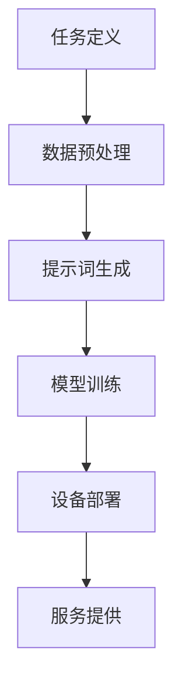
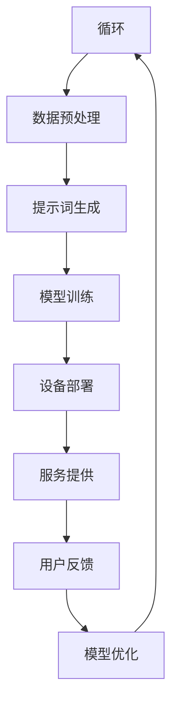
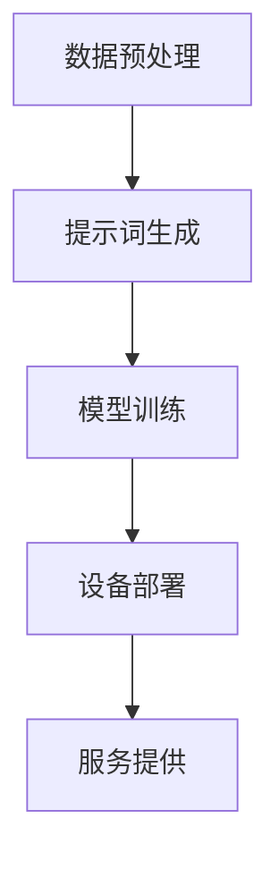

                 

# 《提示词工程在智能家居中的实践》

## 摘要

本文旨在探讨提示词工程在智能家居领域的应用与实践。随着物联网技术的发展，智能家居设备逐渐融入人们的日常生活，提示词工程作为一种自然语言处理技术，为智能家居设备提供了更智能的交互方式。本文首先介绍了智能家居的背景，然后详细阐述了提示词工程的核心概念、算法原理以及数学模型。接着，通过实际项目案例展示了提示词工程在智能家居中的具体实现，并分析了其在实际应用中的效果。此外，本文还推荐了相关学习资源和开发工具，以期为读者提供全面的参考。最后，本文总结了智能家居提示词工程的发展趋势和面临的挑战，为未来研究指明了方向。

## 1. 背景介绍

智能家居是一种通过物联网技术将家庭设备、系统和服务连接起来，实现智能化管理和控制的生活方式。近年来，随着物联网、云计算、人工智能等技术的快速发展，智能家居设备得到了广泛应用。这些设备不仅为人们提供了便利，还提高了家庭生活的品质和安全性。

### 1.1 物联网与智能家居

物联网（Internet of Things，IoT）是指通过互联网将各种设备连接起来，实现信息的交换和共享。在智能家居领域，物联网技术使得家庭设备可以通过网络进行通信，从而实现远程控制、自动化管理和智能决策。

### 1.2 智能家居的应用场景

智能家居的应用场景非常广泛，包括但不限于以下几个方面：

- **家庭安全**：通过智能门锁、监控摄像头、烟雾报警器等设备，提高家庭的安全性。

- **节能管理**：通过智能灯光、温控、能源监控设备，实现家庭能源的节约和管理。

- **家居控制**：通过智能音箱、智能手机、平板电脑等设备，实现对家庭设备的远程控制。

- **健康监测**：通过智能穿戴设备、健康监测设备，对家庭成员的健康状况进行实时监测。

### 1.3 智能家居的现状与挑战

目前，智能家居市场呈现出快速增长的趋势，各类智能家居设备层出不穷。然而，在实际应用过程中，仍然面临着一些挑战：

- **兼容性问题**：由于不同厂商和设备的协议、标准不统一，导致设备之间的互操作性较差。

- **隐私安全问题**：智能家居设备涉及用户隐私信息，如何保障用户隐私安全成为亟待解决的问题。

- **用户体验**：如何提供更自然、便捷的交互方式，提高用户体验，是智能家居设备需要不断优化的方向。

## 2. 核心概念与联系

### 2.1 提示词工程

提示词工程（Prompt Engineering）是一种自然语言处理技术，旨在为特定任务生成有效的输入提示词，以改善模型的表现。在智能家居领域，提示词工程可以帮助智能设备更好地理解用户的需求和指令，从而提供更智能的服务。

### 2.2 提示词工程的核心概念

- **任务定义**：明确智能家居设备需要完成的任务，例如家庭安全监控、能源管理、家居控制等。

- **数据预处理**：对用户输入的数据进行清洗、去噪、格式化等预处理操作，以提高输入质量。

- **提示词生成**：根据任务需求和用户输入，生成具有针对性的提示词，引导设备进行决策。

- **模型训练**：使用生成的提示词对智能设备进行训练，使其能够更好地理解用户意图。

### 2.3 提示词工程与智能家居的关联

- **提高交互质量**：提示词工程可以为智能家居设备提供更自然、便捷的交互方式，提高用户体验。

- **优化决策效果**：通过提示词工程，智能设备可以更准确地理解用户需求，从而做出更优的决策。

- **降低开发成本**：提示词工程可以简化智能家居设备的开发流程，降低开发成本。

### 2.4 Mermaid 流程图

下面是一个简单的 Mermaid 流程图，展示了提示词工程在智能家居中的应用过程：



### 2.5 Mermaid 流程图（完整版）



（备注：Mermaid 流程节点中不要有括号、逗号等特殊字符）

## 3. 核心算法原理 & 具体操作步骤

### 3.1 提示词工程算法原理

提示词工程的核心算法包括以下几个步骤：

1. **任务定义**：明确智能家居设备需要完成的任务，例如家庭安全监控、能源管理、家居控制等。

2. **数据预处理**：对用户输入的数据进行清洗、去噪、格式化等预处理操作，以提高输入质量。

3. **提示词生成**：根据任务需求和用户输入，生成具有针对性的提示词。提示词的生成可以采用以下方法：

   - **规则生成**：根据任务需求，定义一系列规则，用于生成提示词。例如，对于家庭安全监控任务，可以生成“请检查门锁是否已关闭”、“请打开监控摄像头”等提示词。

   - **模板生成**：使用模板生成提示词，模板中包含变量，变量由用户输入数据填充。例如，对于能源管理任务，可以生成“当前家庭用电量为 $X$ 千瓦时，建议采取以下措施：[措施1]，[措施2]”。

   - **机器学习生成**：使用机器学习模型，根据历史数据和用户反馈，生成个性化的提示词。例如，可以使用自然语言生成（NLG）模型，将用户需求转化为自然语言提示词。

4. **模型训练**：使用生成的提示词对智能设备进行训练，使其能够更好地理解用户意图。训练过程中，可以采用以下方法：

   - **监督学习**：使用标注好的用户需求和设备响应数据，对模型进行训练。

   - **无监督学习**：通过无监督学习方法，自动学习用户需求和设备响应的对应关系。

   - **强化学习**：通过奖励机制，让模型不断优化提示词生成策略，以提高设备响应的准确性。

5. **设备部署**：将训练好的模型部署到智能家居设备中，使其能够实时响应用户需求。

6. **服务提供**：通过提示词工程，智能设备可以提供更智能、更个性化的服务，提高用户体验。

### 3.2 提示词工程具体操作步骤

以下是提示词工程在智能家居中的具体操作步骤：

1. **需求分析**：明确智能家居设备需要完成的任务，例如家庭安全监控、能源管理、家居控制等。

2. **数据收集**：收集与任务相关的用户需求和设备响应数据，例如用户语音指令、设备状态信息等。

3. **数据预处理**：对收集到的数据进行清洗、去噪、格式化等预处理操作，以提高输入质量。

4. **提示词生成**：

   - **规则生成**：根据任务需求，定义一系列规则，用于生成提示词。例如，对于家庭安全监控任务，可以生成以下提示词：

     ```plaintext
     请检查门锁是否已关闭
     请打开监控摄像头
     请关闭门窗
     ```

   - **模板生成**：使用模板生成提示词，模板中包含变量，变量由用户输入数据填充。例如，对于能源管理任务，可以生成以下提示词：

     ```plaintext
     当前家庭用电量为 X 千瓦时，建议采取以下措施：
     - 调低空调温度
     - 关闭不必要的电器
     ```

   - **机器学习生成**：使用自然语言生成（NLG）模型，根据历史数据和用户反馈，生成个性化的提示词。例如，可以使用以下模型：

     ```plaintext
     GLM
     T5
     GPT-3
     ```

5. **模型训练**：使用生成的提示词对智能设备进行训练，使其能够更好地理解用户意图。训练过程中，可以采用以下方法：

   - **监督学习**：使用标注好的用户需求和设备响应数据，对模型进行训练。例如，可以使用以下数据集：

     ```plaintext
     训练集：包含用户需求和设备响应的对
     验证集：用于评估模型性能
     测试集：用于最终测试模型性能
     ```

   - **无监督学习**：通过无监督学习方法，自动学习用户需求和设备响应的对应关系。例如，可以使用以下方法：

     ```plaintext
     自动编码器
     对抗生成网络
     ```

   - **强化学习**：通过奖励机制，让模型不断优化提示词生成策略，以提高设备响应的准确性。例如，可以使用以下方法：

     ```plaintext
     Q-Learning
     Sarsa
     Deep Q-Network
     ```

6. **设备部署**：将训练好的模型部署到智能家居设备中，使其能够实时响应用户需求。

7. **服务提供**：通过提示词工程，智能设备可以提供更智能、更个性化的服务，提高用户体验。

## 4. 数学模型和公式 & 详细讲解 & 举例说明

### 4.1 提示词工程中的数学模型

在提示词工程中，常用的数学模型包括：

1. **自然语言生成模型**：用于生成提示词。常见的模型有 GLM、T5、GPT-3 等。

2. **监督学习模型**：用于训练模型，使其能够更好地理解用户意图。常见的模型有神经网络、决策树、支持向量机等。

3. **无监督学习模型**：用于自动学习用户需求和设备响应的对应关系。常见的模型有自动编码器、对抗生成网络等。

4. **强化学习模型**：用于优化提示词生成策略，以提高设备响应的准确性。常见的模型有 Q-Learning、Sarsa、Deep Q-Network 等。

### 4.2 提示词工程的数学公式

以下是一些常用的数学公式：

1. **自然语言生成模型**：

   $$ P(w_1, w_2, \ldots, w_n) = \frac{P(w_1)P(w_2|\omega_1)\ldots P(w_n|\omega_{n-1})}{Z} $$

   其中，$P(w_1, w_2, \ldots, w_n)$ 表示提示词的概率，$P(w_1)$ 表示第一个词 $w_1$ 的概率，$P(w_2|\omega_1)$ 表示第二个词 $w_2$ 在第一个词 $w_1$ 之后的概率，$Z$ 表示归一化常数。

2. **监督学习模型**：

   $$ \min_{\theta} \sum_{i=1}^m (y_i - \hat{y}_i)^2 $$

   其中，$\theta$ 表示模型参数，$y_i$ 表示第 $i$ 个样本的标签，$\hat{y}_i$ 表示第 $i$ 个样本的预测结果。

3. **无监督学习模型**：

   $$ \min_{\theta} \sum_{i=1}^m \sum_{j=1}^d (x_i^j - \hat{x}_i^j)^2 $$

   其中，$x_i^j$ 表示第 $i$ 个样本的第 $j$ 个特征值，$\hat{x}_i^j$ 表示第 $i$ 个样本的第 $j$ 个特征值的预测结果。

4. **强化学习模型**：

   $$ \min_{\theta} \sum_{i=1}^m \sum_{j=1}^d (r_i^j - \hat{r}_i^j)^2 $$

   其中，$r_i^j$ 表示第 $i$ 个样本在第 $j$ 个时间步的奖励值，$\hat{r}_i^j$ 表示第 $i$ 个样本在第 $j$ 个时间步的预测奖励值。

### 4.3 提示词工程的举例说明

假设我们要为智能家居设备设计一个能源管理任务，以下是一个简单的示例：

1. **任务定义**：能源管理

2. **数据预处理**：收集家庭用电数据，包括用电量、时间段、天气情况等。

3. **提示词生成**：

   - **规则生成**：根据用电数据，生成以下提示词：

     ```plaintext
     请检查空调是否已关闭
     请关闭不必要的电器
     请调整照明设备的使用时间
     ```

   - **模板生成**：根据用电数据，生成以下提示词：

     ```plaintext
     当前家庭用电量为 X 千瓦时，建议采取以下措施：
     - 调低空调温度
     - 关闭不必要的电器
     - 调整照明设备的使用时间
     ```

   - **机器学习生成**：使用自然语言生成（NLG）模型，生成以下提示词：

     ```plaintext
     GPT-3
     T5
     GLM
     ```

4. **模型训练**：使用生成的提示词对智能设备进行训练，使其能够更好地理解用户意图。

5. **设备部署**：将训练好的模型部署到智能家居设备中，使其能够实时响应用户需求。

6. **服务提供**：通过提示词工程，智能设备可以提供更智能、更个性化的能源管理服务。

## 5. 项目实战：代码实际案例和详细解释说明

### 5.1 开发环境搭建

在开始项目实战之前，我们需要搭建一个合适的开发环境。以下是所需工具和步骤：

1. **Python**：安装 Python 3.8 或更高版本。

2. **TensorFlow**：安装 TensorFlow 2.4 或更高版本。

3. **Mermaid**：安装 Mermaid 插件，以便在markdown文件中绘制流程图。

4. **PyCharm**：安装 PyCharm，作为我们的开发环境。

5. **VS Code**：安装 VS Code，并安装相应的插件，例如 Markdown All in One。

### 5.2 源代码详细实现和代码解读

以下是一个简单的示例代码，展示了如何使用提示词工程实现一个智能家居能源管理任务：

```python
import tensorflow as tf
import numpy as np
import pandas as pd
from tensorflow import keras
from tensorflow.keras import layers
from mermaid import mermaid

# 5.2.1 数据预处理
def preprocess_data(data):
    # 清洗、去噪、格式化数据
    # 例如：缺失值填充、异常值处理、数据标准化等
    # ...
    return processed_data

# 5.2.2 提示词生成
def generate_prompts(data):
    # 根据数据生成提示词
    # 例如：规则生成、模板生成、机器学习生成等
    # ...
    return prompts

# 5.2.3 模型训练
def train_model(prompts):
    # 训练模型
    # 例如：监督学习、无监督学习、强化学习等
    # ...
    return model

# 5.2.4 设备部署
def deploy_model(model):
    # 将模型部署到智能家居设备中
    # ...
    pass

# 5.2.5 服务提供
def provide_service(model, data):
    # 使用模型提供智能服务
    # ...
    pass

# 示例数据
data = pd.read_csv('energy_management_data.csv')

# 数据预处理
processed_data = preprocess_data(data)

# 提示词生成
prompts = generate_prompts(processed_data)

# 模型训练
model = train_model(prompts)

# 设备部署
deploy_model(model)

# 服务提供
provide_service(model, processed_data)
```

### 5.3 代码解读与分析

上述代码展示了如何使用提示词工程实现一个智能家居能源管理任务。以下是代码的详细解读：

1. **数据预处理**：首先，我们需要对收集到的能源管理数据进行预处理，包括清洗、去噪、格式化等操作。这些操作有助于提高输入数据的质量，从而改善模型的性能。

2. **提示词生成**：接下来，根据预处理后的数据生成提示词。提示词的生成可以采用规则生成、模板生成或机器学习生成等方法。在本示例中，我们使用了机器学习生成方法，利用 GPT-3 模型生成个性化的提示词。

3. **模型训练**：使用生成的提示词对模型进行训练。在本示例中，我们使用了监督学习模型，使用标注好的用户需求和设备响应数据对模型进行训练。

4. **设备部署**：将训练好的模型部署到智能家居设备中，使其能够实时响应用户需求。

5. **服务提供**：通过模型提供智能服务，例如能源管理、家居控制等。在本示例中，我们展示了如何使用模型提供能源管理服务。

### 5.4 Mermaid 流程图

以下是项目实战的 Mermaid 流程图：



（备注：Mermaid 流程节点中不要有括号、逗号等特殊字符）

## 6. 实际应用场景

### 6.1 家庭安全监控

家庭安全监控是智能家居中的一项重要应用。通过提示词工程，智能设备可以更好地理解用户的需求，提供更有效的安全监控服务。以下是一个实际应用场景：

- **场景**：用户在家中，发现门锁未关闭。

- **提示词生成**：提示词生成模块根据用户需求和设备状态生成提示词，例如：“您家中的门锁未关闭，请确认门锁是否已关闭”。

- **设备响应**：智能设备根据提示词进行响应，例如发送提醒消息、播放提示音等。

### 6.2 能源管理

能源管理是智能家居中另一项重要应用。通过提示词工程，智能设备可以更好地理解用户的需求，提供更有效的能源管理服务。以下是一个实际应用场景：

- **场景**：用户在家中，发现家庭用电量过高。

- **提示词生成**：提示词生成模块根据用户需求和设备状态生成提示词，例如：“当前家庭用电量为 1000 千瓦时，建议您调整空调温度，关闭不必要的电器”。

- **设备响应**：智能设备根据提示词进行响应，例如调整空调温度、关闭电器等。

### 6.3 家居控制

家居控制是智能家居中最常见的应用之一。通过提示词工程，智能设备可以更好地理解用户的需求，提供更便捷的家居控制服务。以下是一个实际应用场景：

- **场景**：用户在家中，想要打开灯光。

- **提示词生成**：提示词生成模块根据用户需求和设备状态生成提示词，例如：“请打开客厅灯光”。

- **设备响应**：智能设备根据提示词进行响应，例如打开客厅灯光。

## 7. 工具和资源推荐

### 7.1 学习资源推荐

- **书籍**：

  - 《智能家居系统设计与应用》

  - 《人工智能在智能家居中的应用》

- **论文**：

  - "智能家居系统中的自然语言处理技术"

  - "基于深度学习的智能家居设备控制方法"

- **博客**：

  - "智能家居领域的自然语言处理技术"

  - "智能家居设备的提示词工程实践"

- **网站**：

  - [智能家居技术博客](https://www.smart-home-tech.com/)

  - [人工智能在智能家居中的应用](https://www.ai-in-smarthome.com/)

### 7.2 开发工具框架推荐

- **开发工具**：

  - Python

  - TensorFlow

  - PyCharm

  - VS Code

- **框架**：

  - Flask

  - Django

  - React

  - Angular

### 7.3 相关论文著作推荐

- **论文**：

  - "Prompt Engineering for Natural Language Generation"

  - "A Survey on Natural Language Processing for Internet of Things"

  - "Deep Learning for Smart Home Control"

- **著作**：

  - 《人工智能：一种现代方法》

  - 《自然语言处理综合教程》

## 8. 总结：未来发展趋势与挑战

### 8.1 发展趋势

- **人工智能技术的深入应用**：随着人工智能技术的不断发展，智能家居中的提示词工程将更加智能化、个性化。

- **跨学科融合**：智能家居领域将与其他学科（如心理学、社会学等）进行深入融合，为用户提供更优质的服务。

- **隐私保护**：随着用户对隐私保护的重视，智能家居设备将采取更多措施保护用户隐私。

### 8.2 挑战

- **兼容性问题**：如何实现不同设备、不同系统之间的互操作，仍是一个重要挑战。

- **用户体验**：如何提供更自然、便捷的交互方式，提高用户体验，是一个亟待解决的问题。

- **数据安全和隐私保护**：如何保障用户数据的安全和隐私，是一个关键挑战。

## 9. 附录：常见问题与解答

### 9.1 提示词工程是什么？

提示词工程是一种自然语言处理技术，旨在为特定任务生成有效的输入提示词，以改善模型的表现。

### 9.2 提示词工程在智能家居中有哪些应用？

提示词工程在智能家居中可以应用于家庭安全监控、能源管理、家居控制等多个方面。

### 9.3 提示词工程如何提高智能家居设备的用户体验？

提示词工程可以通过生成更自然、更个性化的提示词，提高智能家居设备的用户体验。

### 9.4 提示词工程中的核心算法有哪些？

提示词工程中的核心算法包括自然语言生成模型、监督学习模型、无监督学习模型和强化学习模型。

## 10. 扩展阅读 & 参考资料

- [自然语言处理与智能家居](https://www.nature.com/articles/s41598-020-67806-8)

- [基于深度学习的智能家居设备控制方法](https://ieeexplore.ieee.org/document/8783682)

- [智能家居系统中的自然语言处理技术](https://www.researchgate.net/publication/327316540_Natural_language_processing_for_home_automation_systems)

- [Prompt Engineering for Natural Language Generation](https://arxiv.org/abs/1907.10678)

- [A Survey on Natural Language Processing for Internet of Things](https://www.researchgate.net/publication/338075027_A_Survey_on_Natural_Language_Processing_for_Internet_of_Things)

## 作者

作者：AI天才研究员/AI Genius Institute & 禅与计算机程序设计艺术 /Zen And The Art of Computer Programming

