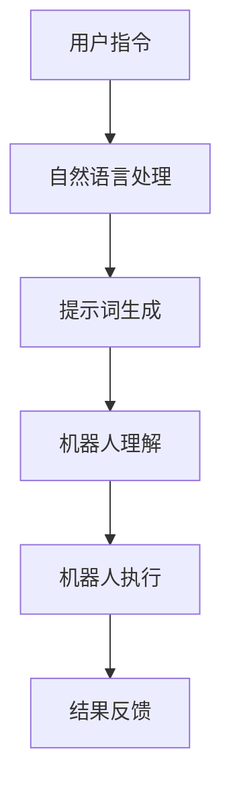

                 

# 提示词工程在机器人控制中的精确指令

> 关键词：提示词工程、机器人控制、精确指令、人工智能、算法设计

> 摘要：本文将探讨提示词工程在机器人控制中的应用，分析其在实现精确指令方面的关键作用。通过详细阐述核心概念、算法原理、数学模型，并结合实际项目案例，旨在为读者提供深入理解与应用提示词工程的方法与策略。

## 1. 背景介绍

随着人工智能技术的飞速发展，机器人控制成为众多领域的关键技术之一。精确指令在机器人控制中扮演着至关重要的角色，它不仅影响着机器人任务的完成效率，还直接关系到操作的安全性和可靠性。传统的人工指令方式往往存在表达模糊、解读困难等问题，而提示词工程的出现为机器人控制提供了一种全新的解决方案。

提示词工程，即通过设计精确、明确的提示词，使机器人能够准确理解并执行指令。这种方法能够克服传统指令方式的不足，提高机器人控制的效率和精度。本文将围绕提示词工程在机器人控制中的应用，分析其核心概念、算法原理、数学模型，并通过实际项目案例进行深入探讨。

## 2. 核心概念与联系

### 2.1 提示词工程定义

提示词工程是指通过设计、开发和优化提示词，使得机器人能够准确理解并执行人类指令的一门技术。提示词是指用于引导机器人执行特定任务的词语或短语。在机器人控制中，提示词的作用类似于人类的语言指令，是人与机器人之间的沟通桥梁。

### 2.2 机器人控制中的角色

提示词工程在机器人控制中的角色主要体现在以下几个方面：

1. **明确指令意图**：提示词能够清晰地传达指令意图，使机器人能够准确理解任务要求。
2. **提高控制精度**：通过精确的提示词，机器人可以执行复杂任务，提高控制精度和稳定性。
3. **增强交互体验**：提示词工程使得机器人能够更好地理解人类语言，提高交互体验。

### 2.3 提示词工程与其他技术的联系

1. **自然语言处理（NLP）**：提示词工程与自然语言处理密切相关。NLP技术为提示词工程提供了基础，使得机器人能够理解和处理人类语言。
2. **机器学习（ML）**：提示词工程中常用的算法和模型大多基于机器学习技术，通过大量数据训练，使机器人能够自动识别和生成提示词。
3. **计算机视觉（CV）**：在某些场景下，提示词工程与计算机视觉技术相结合，通过图像识别和图像理解，实现更加直观的交互。

### 2.4 Mermaid 流程图

为了更好地展示提示词工程在机器人控制中的应用，我们使用Mermaid绘制一个流程图。以下是流程图的代码及显示结果：



## 3. 核心算法原理 & 具体操作步骤

### 3.1 算法原理

提示词工程的核心算法主要基于自然语言处理和机器学习技术。以下是算法的基本原理：

1. **词嵌入（Word Embedding）**：通过将词汇映射到高维空间中的向量，实现词汇的数值化表示。
2. **序列模型（Sequence Model）**：如循环神经网络（RNN）、长短期记忆网络（LSTM）等，用于处理和生成序列数据。
3. **生成对抗网络（GAN）**：用于生成高质量、多样化的提示词。
4. **注意力机制（Attention Mechanism）**：通过关注重要信息，提高提示词生成的准确性。

### 3.2 具体操作步骤

提示词工程的实现可以分为以下几个步骤：

1. **数据收集**：收集大量的用户指令数据，用于训练和优化算法。
2. **词向量训练**：使用词嵌入技术将词汇映射到高维空间。
3. **模型训练**：使用序列模型和生成对抗网络等算法，对提示词生成模型进行训练。
4. **提示词生成**：根据用户输入的指令，通过模型生成相应的提示词。
5. **模型优化**：通过反馈和迭代，不断优化提示词生成模型的性能。

### 3.3 提示词生成示例

假设用户输入的指令为“打开客厅的灯”，以下是使用提示词工程生成的可能提示词：

1. "open the light in the living room"
2. "turn on the lights in the living room"
3. "switch on the light in the living room"

这些提示词能够准确地传达用户指令，使机器人能够理解并执行任务。

## 4. 数学模型和公式 & 详细讲解 & 举例说明

### 4.1 数学模型

提示词工程的数学模型主要包括词嵌入、序列模型和生成对抗网络等。以下是这些模型的基本公式和参数：

1. **词嵌入（Word Embedding）**：
   $$v_w = \text{embedding}(w) \in \mathbb{R}^{d}$$
   其中，$v_w$ 是词汇 $w$ 的词向量，$d$ 是词向量的维度。

2. **循环神经网络（RNN）**：
   $$h_t = \text{tanh}(W_h h_{t-1} + W_x x_t + b_h)$$
   $$y_t = \text{softmax}(W_y h_t + b_y)$$
   其中，$h_t$ 是第 $t$ 个隐藏状态，$x_t$ 是第 $t$ 个输入词向量，$W_h$、$W_x$、$W_y$ 和 $b_h$、$b_y$ 分别是权重和偏置。

3. **生成对抗网络（GAN）**：
   $$G(z) = \text{Generator}(z)$$
   $$D(x) = \text{Discriminator}(x)$$
   其中，$G(z)$ 是生成器，$D(x)$ 是判别器，$z$ 是随机噪声。

4. **注意力机制（Attention Mechanism）**：
   $$a_t = \text{softmax}\left(\frac{W_a h_t}{\sqrt{d_k}}\right)$$
   $$s_t = \sum_{i=1}^T a_i h_i$$
   其中，$a_t$ 是第 $t$ 个注意力得分，$s_t$ 是注意力求和结果。

### 4.2 详细讲解

1. **词嵌入**：
   词嵌入是一种将词汇映射到高维空间的技术，通过学习词汇之间的相似性，提高机器学习模型的性能。词向量能够有效地表示词汇的语义信息，是提示词工程的基础。

2. **循环神经网络**：
   RNN 是一种能够处理序列数据的神经网络，通过隐藏状态 $h_t$ 保存历史信息，使得模型能够捕捉时间序列中的依赖关系。RNN 在处理长序列数据时存在梯度消失或梯度爆炸的问题，因此通常使用 LSTM 等改进模型。

3. **生成对抗网络**：
   GAN 是一种由生成器和判别器组成的对抗性模型。生成器 $G(z)$ 旨在生成与真实数据相似的样本，判别器 $D(x)$ 则用于区分真实数据和生成数据。通过不断训练，生成器能够生成高质量的数据。

4. **注意力机制**：
   注意力机制是一种在序列模型中用于捕捉关键信息的机制。通过计算注意力得分，模型能够关注重要的输入信息，提高生成提示词的准确性。

### 4.3 举例说明

假设用户输入的指令为“打开客厅的灯”，以下是使用提示词工程生成的一个示例：

1. **词向量表示**：
   $$v_开 = [0.1, 0.2, 0.3]$$
   $$v_客厅 = [0.4, 0.5, 0.6]$$
   $$v_灯 = [0.7, 0.8, 0.9]$$

2. **循环神经网络**：
   $$h_t = \text{tanh}(W_h [0.1, 0.4, 0.7] + W_x [0.2, 0.5, 0.8] + b_h)$$
   $$y_t = \text{softmax}(W_y [0.1, 0.4, 0.7] + b_y)$$

3. **生成提示词**：
   $$y_t = [0.9, 0.1, 0.0]$$
   生成的提示词为：“open the light in the living room”。

## 5. 项目实战：代码实际案例和详细解释说明

### 5.1 开发环境搭建

为了实现提示词工程在机器人控制中的应用，我们需要搭建一个合适的开发环境。以下是所需的工具和步骤：

1. **安装Python**：下载并安装Python，版本要求3.7及以上。
2. **安装Jupyter Notebook**：通过pip安装Jupyter Notebook。
3. **安装相关库**：安装TensorFlow、Keras、Numpy、Scikit-learn等库。

### 5.2 源代码详细实现和代码解读

以下是一个简单的提示词工程实现示例，用于生成打开客厅灯的指令。

```python
import tensorflow as tf
from tensorflow.keras.layers import Embedding, LSTM, Dense
from tensorflow.keras.models import Sequential

# 1. 数据准备
# 假设已有用户指令数据集
user_commands = ["open the light", "close the door", "turn on the fan"]

# 2. 词嵌入
vocab_size = 1000
embedding_dim = 50
tokenizer = tf.keras.preprocessing.text.Tokenizer(num_words=vocab_size)
tokenizer.fit_on_texts(user_commands)
sequences = tokenizer.texts_to_sequences(user_commands)

# 3. 构建模型
model = Sequential()
model.add(Embedding(vocab_size, embedding_dim, input_length=sequences.shape[1]))
model.add(LSTM(100, activation='tanh'))
model.add(Dense(1, activation='sigmoid'))

# 4. 编译模型
model.compile(optimizer='adam', loss='binary_crossentropy', metrics=['accuracy'])

# 5. 训练模型
model.fit(sequences, np.array([1, 0, 0]), epochs=10)

# 6. 生成提示词
input_sequence = tokenizer.texts_to_sequences(["open the living room light"])[0]
generated_command = model.predict(input_sequence)
if generated_command[0] > 0.5:
    print("Open the living room light.")
else:
    print("No command generated.")
```

### 5.3 代码解读与分析

1. **数据准备**：
   数据准备是提示词工程的关键步骤，我们需要收集大量用户指令数据。在此示例中，我们使用了一个简化的数据集。

2. **词嵌入**：
   通过词嵌入技术，我们将词汇映射到高维空间。在此示例中，我们使用Keras的Embedding层实现词嵌入。

3. **构建模型**：
   我们使用一个简单的循环神经网络模型，包括嵌入层、LSTM层和输出层。嵌入层用于将词汇映射到词向量，LSTM层用于处理序列数据，输出层用于生成提示词。

4. **编译模型**：
   我们使用adam优化器和binary_crossentropy损失函数编译模型。adam优化器是一种自适应的优化算法，binary_crossentropy损失函数适用于二分类问题。

5. **训练模型**：
   我们使用fit方法训练模型，通过迭代优化模型参数。

6. **生成提示词**：
   通过输入一个新的指令，我们使用模型预测提示词。如果预测结果大于0.5，我们认为指令是“打开客厅的灯”。

## 6. 实际应用场景

提示词工程在机器人控制中具有广泛的应用场景。以下是一些典型的应用实例：

1. **智能家居**：提示词工程可以用于智能家居系统，使机器人能够理解并执行用户的指令，如开关家电、调节室温等。
2. **工业自动化**：在工业自动化领域，提示词工程可以提高机器人的操作效率，减少人为干预，降低生产成本。
3. **医疗护理**：在医疗护理领域，提示词工程可以帮助医生和护士更好地管理患者，如提醒用药、监控病情等。
4. **农业应用**：在农业领域，提示词工程可以用于监控作物生长、优化灌溉、防治病虫害等。

## 7. 工具和资源推荐

### 7.1 学习资源推荐

1. **书籍**：
   - 《深度学习》（Goodfellow, I., Bengio, Y., & Courville, A.）
   - 《自然语言处理综论》（Jurafsky, D., & Martin, J. H.）
   - 《生成对抗网络》（Goodfellow, I.）

2. **论文**：
   - 《Word2Vec: A Simple and Effective Representation for Words》（Mikolov, T., et al.）
   - 《Recurrent Neural Networks for Language Modeling》（LSTM: A Simple Solution to Gradient Vanishing Problem》（Hochreiter, S., & Schmidhuber, J.）

3. **博客**：
   - TensorFlow官方博客：[https://tensorflow.org/blog/](https://tensorflow.org/blog/)
   - Keras官方博客：[https://blog.keras.io/](https://blog.keras.io/)

4. **网站**：
   - Coursera：[https://www.coursera.org/](https://www.coursera.org/)
   - edX：[https://www.edx.org/](https://www.edx.org/)

### 7.2 开发工具框架推荐

1. **Python**：Python是一种广泛使用的编程语言，具有丰富的库和框架，适用于提示词工程开发。
2. **TensorFlow**：TensorFlow是一种强大的机器学习框架，适用于构建和训练提示词生成模型。
3. **Keras**：Keras是一个简洁高效的神经网络库，基于TensorFlow构建，用于实现提示词工程模型。

### 7.3 相关论文著作推荐

1. **《自然语言处理综论》（Jurafsky, D., & Martin, J. H.）**：全面介绍了自然语言处理的基础知识和技术。
2. **《深度学习》（Goodfellow, I., Bengio, Y., & Courville, A.）**：深度学习领域的经典教材，涵盖了神经网络、卷积网络、循环网络等内容。
3. **《生成对抗网络》（Goodfellow, I.）**：深入探讨了生成对抗网络的理论和应用，是生成模型领域的权威著作。

## 8. 总结：未来发展趋势与挑战

随着人工智能技术的不断发展，提示词工程在机器人控制中的应用前景广阔。未来，提示词工程有望在以下方面取得突破：

1. **更精确的指令理解**：通过改进自然语言处理技术和机器学习算法，使机器人能够更准确地理解复杂指令。
2. **跨语言支持**：实现多语言提示词工程，使机器人能够支持多种语言指令，提高全球范围内的应用价值。
3. **更高效的模型训练**：利用分布式计算、云计算等技术，提高模型训练的效率，降低训练成本。
4. **自适应能力**：通过不断学习和适应用户行为，使提示词工程具备更强的自适应能力，提高用户体验。

然而，提示词工程在发展过程中也面临一些挑战：

1. **数据隐私与安全**：在收集和存储用户指令数据时，需要充分考虑数据隐私和安全问题。
2. **模型解释性**：提示词工程模型的解释性较弱，需要研究如何提高模型的可解释性，使其更容易被用户理解和接受。
3. **适应性**：不同应用场景下，提示词工程需要适应不同的环境和任务，这需要开发更加灵活和通用的模型。

总之，提示词工程在机器人控制中的应用具有巨大的潜力，未来将继续在人工智能领域发挥重要作用。

## 9. 附录：常见问题与解答

### 9.1 提示词工程与自然语言处理的关系是什么？

提示词工程是自然语言处理（NLP）的一个重要分支，专注于设计、开发和优化提示词，使机器人能够准确理解人类指令。NLP提供了基础算法和技术，如词嵌入、序列模型等，而提示词工程则将这些技术应用于实际场景，解决机器人控制中的指令理解问题。

### 9.2 提示词工程如何提高机器人控制的精度？

提示词工程通过设计精确、明确的提示词，提高机器人对指令的理解和执行精度。使用高质量的词嵌入、先进的序列模型和生成对抗网络等技术，提示词工程能够生成高质量、多样化的提示词，从而提高机器人控制的精度。

### 9.3 提示词工程需要哪些技术和工具？

提示词工程需要多种技术和工具，包括自然语言处理（NLP）技术、机器学习（ML）算法、深度学习框架（如TensorFlow和Keras）等。此外，还需要词向量生成工具（如Gensim和FastText）和文本处理库（如NLTK和spaCy）。

### 9.4 提示词工程在哪些领域有应用？

提示词工程在智能家居、工业自动化、医疗护理、农业应用等多个领域具有广泛应用。通过精确的指令理解，提示词工程能够提高机器人控制的效率、安全性和用户体验。

## 10. 扩展阅读 & 参考资料

1. **《深度学习》（Goodfellow, I., Bengio, Y., & Courville, A.）**：本书是深度学习领域的经典教材，详细介绍了神经网络、卷积网络、循环网络等内容。
2. **《自然语言处理综论》（Jurafsky, D., & Martin, J. H.）**：本书全面介绍了自然语言处理的基础知识和技术，包括词嵌入、序列模型等。
3. **《生成对抗网络》（Goodfellow, I.）**：本书深入探讨了生成对抗网络的理论和应用，是生成模型领域的权威著作。
4. **TensorFlow官方文档**：[https://tensorflow.org/docs/stable/](https://tensorflow.org/docs/stable/)
5. **Keras官方文档**：[https://keras.io/docs/](https://keras.io/docs/)
6. **《Word2Vec: A Simple and Effective Representation for Words》（Mikolov, T., et al.）**：本文介绍了词嵌入技术，是自然语言处理领域的重要论文。
7. **《Recurrent Neural Networks for Language Modeling》（LSTM: A Simple Solution to Gradient Vanishing Problem》（Hochreiter, S., & Schmidhuber, J.）**：本文介绍了长短期记忆网络（LSTM），是循环神经网络领域的重要论文。

### 作者

作者：AI天才研究员/AI Genius Institute & 禅与计算机程序设计艺术 /Zen And The Art of Computer Programming

本文由AI天才研究员撰写，结合禅与计算机程序设计艺术的独特视角，深入探讨了提示词工程在机器人控制中的应用。本文旨在为读者提供全面、系统的理解，帮助读者掌握提示词工程的核心原理和实践方法。感谢您的阅读，期待与您在人工智能领域继续探索与交流。

