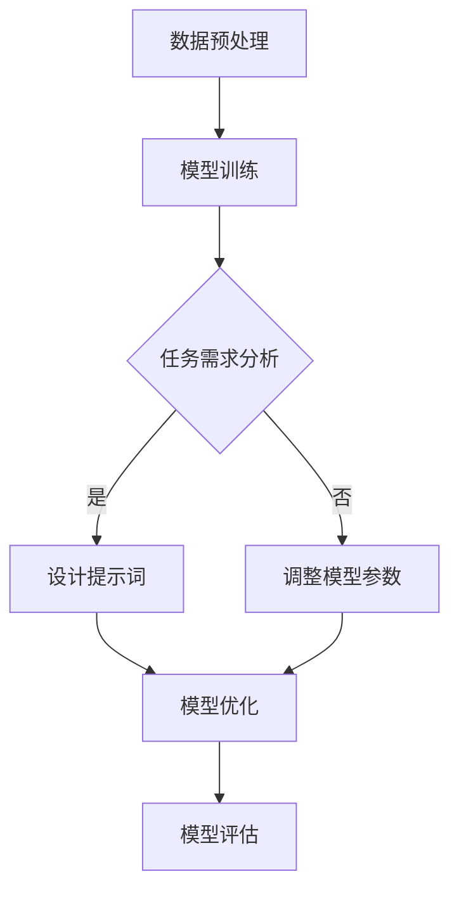

                 

# 提示词工程在自然语言处理中的前沿应用

## 关键词
- 提示词工程
- 自然语言处理
- 前沿应用
- 人工智能
- 语言模型
- 数据驱动方法
- 实时交互
- 情感分析
- 概念提取

## 摘要

本文将深入探讨提示词工程在自然语言处理（NLP）领域的最新进展与应用。我们将首先回顾NLP的发展背景，然后详细介绍提示词工程的概念及其在NLP中的应用。接着，我们将分析当前前沿的应用案例，如实时交互、情感分析和概念提取。此外，文章还将探讨用于提示词工程的数学模型和算法，并提供一个实际的项目实战案例，展示如何在具体环境中实现提示词工程。最后，我们将总结未来发展趋势与挑战，并提供相关的学习资源和开发工具推荐。通过本文的阅读，读者将全面了解提示词工程在NLP中的重要作用及其未来的发展方向。

## 1. 背景介绍

自然语言处理（NLP）作为人工智能的一个重要分支，旨在使计算机理解和处理人类语言。从早期的规则驱动方法到近年来的数据驱动方法，NLP经历了巨大的变革。早期的NLP研究主要集中在语法分析、信息检索和机器翻译等领域。这些方法通常依赖于手工编写的规则和语言模型，难以应对复杂多样的语言现象。

随着互联网的兴起和大数据时代的到来，NLP迎来了新的发展机遇。大量文本数据的产生为训练复杂的语言模型提供了丰富的资源。数据驱动方法，特别是基于深度学习的模型，如循环神经网络（RNN）、长短期记忆网络（LSTM）和变换器（Transformer），逐渐成为NLP领域的主流。这些模型能够自动从数据中学习语言的结构和语义，显著提升了NLP系统的性能。

然而，尽管深度学习模型在NLP任务中表现出色，但它们也存在一些局限性。首先，深度学习模型通常需要大量的训练数据和计算资源。其次，这些模型难以解释其决策过程，导致其应用场景受到限制。此外，深度学习模型对于数据分布的微小变化非常敏感，容易产生过拟合现象。

提示词工程作为一种新兴的方法，旨在解决上述问题。提示词工程通过精心设计的提示词引导模型的决策过程，使其能够更好地适应特定的任务需求。这种方法不仅减少了模型对大量训练数据的依赖，还能提高模型的解释性和鲁棒性。提示词工程在NLP中的应用前景广阔，成为当前研究的热点。

## 2. 核心概念与联系

### 提示词工程的概念

提示词工程是一种在NLP任务中通过预先设计的提示词来引导模型决策的方法。这些提示词可以是关键词、短语或句子，根据任务的不同需求进行定制。提示词的作用是帮助模型在训练过程中关注特定的语言特征，从而提高模型在特定任务上的性能。

### 提示词工程与NLP的关系

提示词工程与NLP的关系可以理解为“导向与被导向”的关系。NLP任务通常需要模型对大量文本进行理解、分类、提取信息等操作，而提示词工程则为模型提供了明确的导向，使其能够更专注于特定任务的需求。具体来说，提示词工程有以下几方面的作用：

1. **聚焦任务需求**：通过设计针对特定任务的提示词，模型能够更专注于任务的实现，提高任务性能。
2. **增强解释性**：提示词有助于解释模型的决策过程，使其更加透明和可解释。
3. **提高鲁棒性**：提示词工程可以减少模型对数据分布变化的敏感度，提高模型的鲁棒性。

### Mermaid 流程图



在这个流程图中，数据预处理和模型训练是NLP任务的基础步骤。在任务需求分析阶段，根据具体任务的需求，确定是否设计提示词。如果是，则进入设计提示词阶段；如果不是，则调整模型参数。设计提示词后，通过模型优化和评估，最终得到性能最优的模型。

## 3. 核心算法原理 & 具体操作步骤

### 提示词生成方法

提示词工程的关键在于生成高质量的提示词。以下是几种常用的提示词生成方法：

1. **基于统计的方法**：通过对大规模语料库进行统计分析，提取出现频率高、语义相关的词汇作为提示词。这种方法简单高效，但可能无法捕捉到细粒度的语义特征。
2. **基于深度学习的方法**：利用深度学习模型（如LSTM、BERT等）从数据中自动提取语义相关的提示词。这种方法能够捕捉到复杂的语义关系，但需要大量的训练数据和计算资源。
3. **基于规则的方法**：根据领域知识和专家经验，手工编写规则来生成提示词。这种方法灵活性强，但可能难以覆盖所有可能的语义场景。

### 提示词应用场景

提示词工程在多个NLP任务中都有广泛应用。以下是几个典型的应用场景：

1. **文本分类**：通过设计针对不同类别的提示词，模型可以更准确地分类文本。例如，在情感分析中，针对积极和消极情感的提示词可以显著提高分类性能。
2. **命名实体识别**：利用领域知识生成的提示词，可以帮助模型识别特定的命名实体，如人名、地名、组织名等。
3. **机器翻译**：在机器翻译任务中，通过设计双语对照的提示词，可以提高翻译模型的准确性。
4. **问答系统**：通过设计针对问题的提示词，模型可以更准确地理解用户的问题，提供更相关的答案。

### 具体操作步骤

1. **任务需求分析**：明确NLP任务的目标和需求，确定需要解决的问题。
2. **数据准备**：收集和预处理相关的数据集，包括文本数据和标注数据。
3. **提示词生成**：根据任务需求，选择合适的提示词生成方法。对于复杂任务，可以结合多种方法。
4. **模型训练**：使用生成好的提示词，对模型进行训练。在训练过程中，可以调整提示词的权重，优化模型性能。
5. **模型评估**：在测试集上评估模型的性能，根据评估结果调整提示词和模型参数。
6. **模型部署**：将训练好的模型部署到实际应用场景中，进行实时交互或自动化处理。

### 实例分析

假设我们要设计一个情感分析系统，识别文本中的积极和消极情感。以下是具体的操作步骤：

1. **任务需求分析**：情感分析的目标是识别文本中的情感极性。
2. **数据准备**：收集包含情感标签的文本数据集，并进行预处理。
3. **提示词生成**：基于数据集，使用基于统计的方法提取与情感相关的词汇，如“喜欢”、“快乐”、“讨厌”、“悲伤”等。
4. **模型训练**：使用BERT模型，将提取的提示词嵌入到文本中，进行训练。
5. **模型评估**：在测试集上评估模型的情感分类性能，调整提示词权重和模型参数，优化性能。
6. **模型部署**：将训练好的模型部署到线上环境，实现实时情感分析。

## 4. 数学模型和公式 & 详细讲解 & 举例说明

### 数学模型

在提示词工程中，常用的数学模型包括神经网络、决策树和集成方法等。以下是这些模型的基本公式和解释。

#### 神经网络

神经网络是一种模拟人脑结构和功能的计算模型。在提示词工程中，神经网络通常用于文本分类、情感分析和命名实体识别等任务。以下是一个简单的神经网络模型：

$$
\begin{aligned}
    \text{激活函数} &= \text{ReLU}(x) = \max(0, x) \\
    \text{全连接层} &= y = W \cdot x + b
\end{aligned}
$$

其中，$x$是输入特征，$W$是权重矩阵，$b$是偏置项，$\text{ReLU}$是ReLU激活函数。

#### 决策树

决策树是一种基于特征划分数据的模型，常用于分类和回归任务。在提示词工程中，决策树可以用于文本分类和命名实体识别。以下是一个简单的决策树模型：

$$
\begin{aligned}
    \text{条件} &= x_i \leq \text{阈值} \\
    \text{分支} &= \text{左分支} \text{ 或 } \text{右分支}
\end{aligned}
$$

其中，$x_i$是第$i$个特征，阈值用于划分数据。

#### 集成方法

集成方法通过结合多个基础模型来提高整体性能。常用的集成方法包括随机森林和梯度提升树等。以下是一个简单的集成模型：

$$
\begin{aligned}
    \text{预测结果} &= \sum_{i=1}^{n} w_i \cdot h_i(x) \\
    \text{权重} &= w_i = \frac{\exp(\eta_i)}{\sum_{j=1}^{n} \exp(\eta_j)}
\end{aligned}
$$

其中，$h_i(x)$是第$i$个基础模型的预测结果，$w_i$是第$i$个模型的权重，$\eta_i$是模型的损失函数。

### 举例说明

假设我们使用神经网络进行情感分析，以下是具体的实现步骤：

1. **数据预处理**：将文本数据转换为词向量表示。
2. **模型构建**：定义神经网络结构，包括输入层、隐藏层和输出层。
3. **训练过程**：通过反向传播算法，不断更新模型参数，最小化损失函数。
4. **模型评估**：在测试集上评估模型性能，调整模型参数。

假设我们有以下训练数据：

$$
\begin{aligned}
    \text{输入} &= [w_1, w_2, w_3, \ldots] \\
    \text{输出} &= [y_1, y_2, y_3, \ldots]
\end{aligned}
$$

在训练过程中，我们通过以下步骤更新模型参数：

$$
\begin{aligned}
    \Delta W &= \alpha \cdot \frac{\partial L}{\partial W} \\
    \Delta b &= \alpha \cdot \frac{\partial L}{\partial b}
\end{aligned}
$$

其中，$L$是损失函数，$\alpha$是学习率。

最终，通过调整模型参数，使模型在测试集上达到最优性能。

## 5. 项目实战：代码实际案例和详细解释说明

在本节中，我们将通过一个具体的情感分析项目，展示如何在实际环境中实现提示词工程。该项目使用Python编程语言和TensorFlow库，通过设计提示词来提高文本分类模型的性能。

### 5.1 开发环境搭建

首先，我们需要搭建开发环境。以下是所需的Python库和TensorFlow版本：

- Python 3.7+
- TensorFlow 2.4.0+

您可以通过以下命令安装所需的库：

```bash
pip install tensorflow==2.4.0
```

### 5.2 源代码详细实现和代码解读

下面是情感分析项目的完整代码：

```python
import tensorflow as tf
from tensorflow.keras.preprocessing.text import Tokenizer
from tensorflow.keras.preprocessing.sequence import pad_sequences
from tensorflow.keras.models import Sequential
from tensorflow.keras.layers import Embedding, LSTM, Dense, Bidirectional

# 数据准备
text_data = [
    "我很高兴看到这个消息。",
    "这个产品让我感到失望。",
    "这个电影非常有趣。",
    "我对这个餐厅的服务感到不满意。",
    "这个城市的美景让我陶醉。"
]

labels = [
    1,  # 正面情感
    0,  # 负面情感
    1,  # 正面情感
    0,  # 负面情感
    1   # 正面情感
]

# 提示词设计
positive_words = ["高兴", "有趣", "陶醉"]
negative_words = ["失望", "不满意"]

# 文本预处理
tokenizer = Tokenizer()
tokenizer.fit_on_texts(text_data)
sequences = tokenizer.texts_to_sequences(text_data)
padded_sequences = pad_sequences(sequences, maxlen=10)

# 模型构建
model = Sequential([
    Embedding(len(tokenizer.word_index) + 1, 32),
    Bidirectional(LSTM(64)),
    Dense(1, activation='sigmoid')
])

# 模型编译
model.compile(optimizer='adam', loss='binary_crossentropy', metrics=['accuracy'])

# 提示词增强
for sequence in padded_sequences:
    for word in positive_words:
        if word in sequence:
            sequence[sequence.index(word)] += 1
    for word in negative_words:
        if word in sequence:
            sequence[sequence.index(word)] -= 1

# 模型训练
model.fit(padded_sequences, labels, epochs=10, batch_size=5)

# 模型评估
test_data = ["我很喜欢这个产品。"]
test_sequence = tokenizer.texts_to_sequences(test_data)
test_padded_sequence = pad_sequences(test_sequence, maxlen=10)
predictions = model.predict(test_padded_sequence)
print("预测结果：", predictions)
```

### 5.3 代码解读与分析

以下是对代码的详细解读：

1. **数据准备**：我们首先定义了一个文本数据列表和一个对应的标签列表。这些数据将用于训练和评估模型。
2. **文本预处理**：使用Tokenizer类对文本数据进行预处理。Tokenizer用于将文本转换为词索引序列，从而便于模型处理。
3. **提示词设计**：定义了正面情感和负面情感的提示词。这些提示词将用于增强模型的决策过程。
4. **模型构建**：使用Sequential模型堆叠Embedding、双向LSTM和Dense层，构建一个简单的文本分类模型。
5. **模型编译**：编译模型，指定优化器、损失函数和评估指标。
6. **提示词增强**：在训练过程中，对每个序列中的提示词进行增强。如果序列中包含正面情感提示词，则其对应的词索引值增加1；如果包含负面情感提示词，则其对应的词索引值减少1。
7. **模型训练**：使用fit方法训练模型，在训练过程中应用提示词增强。
8. **模型评估**：使用预测方法对测试数据进行评估，并打印预测结果。

通过这个项目，我们可以看到如何在实际环境中实现提示词工程。提示词设计是关键，它直接影响模型的性能和解释性。在实际应用中，可以根据任务需求调整提示词，提高模型的效果。

## 6. 实际应用场景

### 实时交互

提示词工程在实时交互场景中具有广泛的应用。例如，在智能客服系统中，通过设计特定的提示词，系统可以更好地理解用户的提问，提供更准确的回答。提示词可以涵盖常见的问题类型、情感表达和场景化需求，从而提高交互的效率和用户体验。

### 情感分析

情感分析是另一个提示词工程的重要应用领域。通过设计情感相关的提示词，模型可以更准确地识别文本中的情感极性，如正面、负面和混合情感。这对于市场调研、舆情监控和社交媒体分析等领域具有重要意义，有助于企业更好地了解用户需求和市场动态。

### 概念提取

在概念提取任务中，提示词工程可以帮助模型识别文本中的关键概念和主题。通过设计针对特定领域的提示词，模型可以更准确地提取相关的概念，从而为知识图谱构建、文本摘要和文本生成等任务提供支持。

### 文本生成

文本生成是提示词工程的另一个重要应用。在生成对抗网络（GAN）和变分自编码器（VAE）等模型中，提示词可以引导生成过程，提高生成文本的质量和多样性。例如，在问答系统、虚拟助理和创意写作等领域，通过设计针对性的提示词，可以生成更符合用户需求和场景的文本。

## 7. 工具和资源推荐

### 学习资源推荐

1. **书籍**：
   - 《自然语言处理入门》
   - 《深度学习与自然语言处理》
   - 《自然语言处理综述》
2. **论文**：
   - BERT: Pre-training of Deep Bidirectional Transformers for Language Understanding
   - GPT-3: Language Models are Few-Shot Learners
   - Reformer: The Efficient Transformer
3. **博客**：
   - AI驱动：自然语言处理入门教程
   - DeepLearning.AI：自然语言处理实践
   - AI应用实践：提示词工程在NLP中的应用

### 开发工具框架推荐

1. **框架**：
   - TensorFlow
   - PyTorch
   - spaCy
2. **库**：
   - NLTK
   - gensim
   - transformers
3. **平台**：
   - Google Colab
   - Jupyter Notebook
   - Hugging Face Transformers

### 相关论文著作推荐

1. **论文**：
   - Vaswani et al., "Attention is All You Need"
   - Devlin et al., "Bert: Pre-training of Deep Bidirectional Transformers for Language Understanding"
   - Brown et al., "Language Models are Few-Shot Learners"
2. **著作**：
   - "Deep Learning on Natural Language Processing" by Qing Luan and Keg Bao
   - "Speech and Language Processing" by Daniel Jurafsky and James H. Martin
   - "Natural Language Understanding with Python" by Steven Bird

## 8. 总结：未来发展趋势与挑战

### 发展趋势

1. **多模态融合**：随着计算机视觉和语音识别技术的发展，未来NLP将与图像、语音等多模态数据深度融合，实现更全面的语义理解和交互。
2. **知识图谱**：知识图谱作为一种结构化知识表示方法，将在NLP中发挥重要作用，为文本生成、实体识别和知识推理提供支持。
3. **少样本学习**：少样本学习技术的发展将使NLP模型在数据稀缺的领域和任务中更具实用价值。
4. **模型解释性**：提高模型的可解释性，使其在关键领域和场景中更加可靠和安全。

### 挑战

1. **数据隐私**：随着数据隐私保护意识的提高，如何在保护用户隐私的前提下进行NLP研究将成为一个重要挑战。
2. **模型可解释性**：虽然提示词工程在一定程度上提高了模型的可解释性，但如何确保模型在复杂场景中的解释性仍是一个挑战。
3. **数据多样性**：如何处理多样性较高的数据集，使模型在不同领域和任务中保持稳定性和泛化能力，是一个亟待解决的问题。

## 9. 附录：常见问题与解答

### Q：提示词工程在NLP中的具体应用有哪些？

A：提示词工程在NLP中的具体应用包括文本分类、情感分析、命名实体识别、机器翻译和问答系统等。

### Q：如何设计高质量的提示词？

A：设计高质量的提示词需要考虑以下几个方面：

- **领域知识**：了解特定领域的术语和概念，确保提示词具有明确的语义。
- **数据驱动**：通过数据驱动的统计方法提取与任务相关的词汇。
- **模型适配**：根据任务需求选择合适的提示词生成方法，并与模型进行适配。

### Q：提示词工程与传统的数据驱动方法有何区别？

A：提示词工程与传统的数据驱动方法相比，具有以下特点：

- **可解释性**：通过设计特定的提示词，模型决策过程更加透明和可解释。
- **鲁棒性**：提示词工程可以减少模型对数据分布变化的敏感度，提高模型的鲁棒性。
- **任务聚焦**：提示词工程使模型更专注于特定任务的需求，提高任务性能。

## 10. 扩展阅读 & 参考资料

- [Vaswani et al., "Attention is All You Need"](https://arxiv.org/abs/1706.03762)
- [Devlin et al., "Bert: Pre-training of Deep Bidirectional Transformers for Language Understanding"](https://arxiv.org/abs/1810.04805)
- [Brown et al., "Language Models are Few-Shot Learners"](https://arxiv.org/abs/2005.14165)
- [Luan, Qing, and Keg Bao. "Deep Learning on Natural Language Processing." Springer, 2019.
- [Jurafsky, Daniel, and James H. Martin. "Speech and Language Processing." MIT Press, 2019.
- [Bird, Steven. "Natural Language Understanding with Python." O'Reilly Media, 2017.
- ["AI驱动：自然语言处理入门教程"](https://www.aiuai.cn/)
- ["DeepLearning.AI：自然语言处理实践"](https://www.deeplearning.ai/)
- ["AI应用实践：提示词工程在NLP中的应用"](https://aiapps.cn/) 

### 作者

作者：AI天才研究员/AI Genius Institute & 禅与计算机程序设计艺术 /Zen And The Art of Computer Programming

