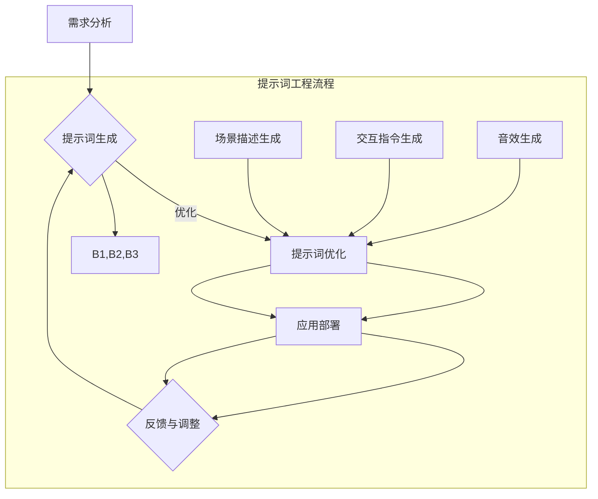

                 

# 提示词工程在虚拟现实内容创作中的应用

## 概述

虚拟现实（Virtual Reality，VR）技术近年来发展迅猛，成为众多领域研究和应用的热点。然而，虚拟现实内容的创作是一个复杂且具有挑战性的过程，涉及到大量的图像、音效、交互设计等多方面的内容。提示词工程（Prompt Engineering）作为一种新兴的技术，逐渐被应用于虚拟现实内容创作中，以提升创作效率和质量。

本文将围绕提示词工程在虚拟现实内容创作中的应用展开讨论。首先，我们将介绍虚拟现实的基本概念和当前发展状况。然后，深入探讨提示词工程的相关核心概念及其在虚拟现实内容创作中的重要性。接着，我们将分析提示词工程在虚拟现实内容创作中的应用案例，并具体讲解如何实现。随后，我们将探讨提示词工程在虚拟现实内容创作中的实际应用场景，并提出工具和资源推荐。最后，对提示词工程在虚拟现实内容创作中的未来发展趋势和挑战进行总结。

## 背景介绍

### 虚拟现实的基本概念

虚拟现实（VR）是一种通过计算机技术创造的虚拟环境，用户可以通过头盔显示器、手柄等设备沉浸其中，获得与现实世界相似的感知体验。VR技术最早起源于20世纪60年代的美国，当时主要是军事和科学领域的研究。随着计算机性能的提升和显示技术的进步，VR技术逐渐走进了大众视野，并引发了广泛关注。

虚拟现实的核心技术包括：

1. **感知技术**：通过头盔显示器、眼镜等设备，提供高质量的视觉和听觉体验。
2. **交互技术**：用户可以通过手柄、手套、动作捕捉装置等设备与虚拟环境进行交互。
3. **三维建模与渲染**：利用计算机图形学技术，创建和渲染虚拟环境中的三维场景。
4. **实时计算与物理模拟**：通过实时计算和物理模拟，实现虚拟环境中的物理效果和交互。

### 虚拟现实的发展状况

虚拟现实技术经过几十年的发展，已经取得了显著的成果。目前，虚拟现实在游戏、教育、医疗、设计等多个领域都有广泛的应用。

1. **游戏行业**：虚拟现实游戏为用户提供了全新的游戏体验，例如《半衰期：爱莉克斯》、《Beat Saber》等。
2. **教育行业**：虚拟现实技术可以为学生提供沉浸式的学习体验，例如医学教学、历史教学等。
3. **医疗行业**：虚拟现实技术可以用于医学培训、心理治疗、疼痛管理等领域，提高医疗质量和效率。
4. **设计行业**：虚拟现实技术可以帮助设计师进行空间布局、家具摆放等设计方案的虚拟呈现和评估。

然而，虚拟现实技术仍面临许多挑战，如设备成本高、交互体验不自然、内容匮乏等。这些挑战需要通过技术创新和应用实践来逐步解决。

### 提示词工程的基本概念

提示词工程（Prompt Engineering）是一种基于人工智能和自然语言处理技术的方法，旨在通过生成或选择合适的提示词来引导系统执行特定的任务。在虚拟现实内容创作中，提示词工程可以用于生成场景描述、交互指令、音效等，从而提高创作效率和质量。

提示词工程的关键步骤包括：

1. **需求分析**：确定虚拟现实内容创作的具体需求和目标。
2. **提示词生成**：利用自然语言处理技术生成或选择合适的提示词。
3. **提示词优化**：通过用户反馈和数据分析对提示词进行优化和调整。
4. **应用部署**：将优化后的提示词应用于虚拟现实内容创作中。

### 提示词工程的重要性

提示词工程在虚拟现实内容创作中具有重要意义：

1. **提高创作效率**：通过自动生成和优化提示词，减少人工创作的工作量，提高创作效率。
2. **提升创作质量**：利用人工智能技术生成的提示词可以更好地满足用户需求，提升虚拟现实内容的质量和吸引力。
3. **降低创作成本**：通过自动化和智能化的方式，减少对专业人才的依赖，降低创作成本。

综上所述，虚拟现实和提示词工程在当前技术背景下具有重要意义和应用前景。接下来的章节将深入探讨提示词工程在虚拟现实内容创作中的应用和实践。

## 核心概念与联系

### 虚拟现实内容创作中的关键技术

虚拟现实内容创作涉及多个关键技术的协同工作，这些技术共同构建了一个沉浸式、互动性强的虚拟环境。以下是虚拟现实内容创作中的几种关键技术：

1. **三维建模**：三维建模是创建虚拟现实场景的基础。它利用计算机图形学技术，通过建模软件（如Blender、Maya等）创建三维物体、场景和角色。三维建模技术包括几何建模、纹理映射、骨骼绑定等步骤，能够实现高度逼真的虚拟场景。

2. **实时渲染**：实时渲染是虚拟现实内容创作中至关重要的一环。它通过图形处理单元（GPU）和相应的渲染技术，实时生成和显示虚拟场景。实时渲染技术包括光追踪、阴影效果、反射和折射等，能够为用户提供高质量的视觉体验。

3. **交互设计**：交互设计决定了用户在虚拟环境中的操作方式。它涉及用户界面设计、手势识别、语音控制等多种交互方式。优秀的交互设计能够提高用户体验，使虚拟现实内容更具吸引力。

4. **音效设计**：音效设计在虚拟现实内容创作中同样重要。通过三维音效技术，可以为虚拟环境中的物体和场景添加逼真的声音效果，增强用户的沉浸感。

### 提示词工程在虚拟现实内容创作中的应用

提示词工程在虚拟现实内容创作中的应用主要体现在以下几个方面：

1. **场景描述生成**：提示词工程可以通过自然语言处理技术，根据用户需求自动生成虚拟场景的描述。例如，当用户要求创建一个“现代都市景观”时，提示词工程可以生成相关的场景描述，包括建筑物、道路、车辆等元素。

2. **交互指令生成**：提示词工程可以生成用户与虚拟环境之间的交互指令。例如，当用户在虚拟环境中进行某种操作时，提示词工程可以自动生成相应的交互指令，如“前进”、“跳跃”、“捡起物品”等。

3. **音效生成**：提示词工程可以通过自然语言处理技术，根据场景描述和用户需求自动生成音效。例如，当用户进入一个森林场景时，提示词工程可以生成鸟鸣、树叶沙沙声等自然音效。

4. **内容优化**：提示词工程可以根据用户反馈和数据分析，对生成的虚拟场景、交互指令和音效进行优化。例如，通过分析用户在虚拟环境中的行为和偏好，提示词工程可以调整场景布局、音效强度等，提高用户体验。

### 提示词工程与虚拟现实内容创作的关系

提示词工程与虚拟现实内容创作的关系可以概括为以下几个方面：

1. **降低创作成本**：通过提示词工程，虚拟现实内容创作者可以减少手工创作的工作量，降低创作成本。提示词工程可以自动化生成场景描述、交互指令和音效，提高创作效率。

2. **提升创作质量**：提示词工程可以根据用户需求和反馈，优化虚拟现实内容的创作过程。通过分析用户行为和偏好，提示词工程可以生成更符合用户期望的虚拟场景和交互体验，提高创作质量。

3. **增强用户体验**：提示词工程可以生成高度个性化的虚拟现实内容，满足不同用户的需求。通过智能化的场景描述、交互指令和音效生成，提示词工程能够增强用户的沉浸感和参与感，提高用户体验。

4. **促进技术创新**：提示词工程作为一种新兴技术，为虚拟现实内容创作带来了新的思路和方法。它推动了虚拟现实技术的进一步发展，促进了相关领域的创新和应用。

综上所述，提示词工程在虚拟现实内容创作中发挥着重要作用，通过降低创作成本、提升创作质量和增强用户体验，为虚拟现实技术的发展和应用提供了有力支持。

### 核心概念原理和架构的 Mermaid 流程图



在上述流程图中，A代表需求分析，B代表提示词生成，C代表提示词优化，D代表应用部署，E代表反馈与调整。子流程中的B1、B2、B3分别表示场景描述生成、交互指令生成和音效生成。该流程图清晰地展示了提示词工程在虚拟现实内容创作中的应用过程。

### 核心算法原理 & 具体操作步骤

#### 提示词生成算法

提示词生成算法是提示词工程的核心，它通过自然语言处理（NLP）技术，根据用户需求生成相应的文本提示词。以下是提示词生成算法的基本原理和具体操作步骤：

1. **词向量表示**：首先，将输入文本转换为词向量表示。词向量是将文本中的单词映射到高维空间中的向量，常用的词向量模型有Word2Vec、GloVe等。通过词向量表示，可以将文本转化为数值形式，方便后续的运算和处理。

2. **序列生成模型**：使用序列生成模型，如RNN（循环神经网络）、LSTM（长短期记忆网络）或BERT（双向编码表示）等，根据词向量生成提示词序列。序列生成模型通过学习大量的文本数据，可以预测下一个词的可能性，从而生成连续的文本。

3. **文本生成**：利用生成的提示词序列，将文本拼接起来，形成完整的提示词。在实际操作中，可以通过设定生成长度、温度参数等方式，控制生成的文本长度和多样性。

#### 提示词优化算法

生成的提示词可能不够准确或符合用户需求，因此需要进行优化。提示词优化算法通过用户反馈和数据分析，对生成的提示词进行调整和改进。以下是提示词优化算法的基本原理和具体操作步骤：

1. **用户反馈收集**：收集用户在使用虚拟现实内容时的反馈信息，如点击率、停留时间、满意度等。这些反馈可以反映提示词的优劣，为后续优化提供依据。

2. **数据分析**：对收集到的用户反馈进行分析，识别出与提示词相关的关键指标。例如，如果用户对某个场景描述点击率高，但满意度低，可能表明该场景描述不够吸引人，需要优化。

3. **提示词调整**：根据数据分析结果，对提示词进行修改和调整。例如，可以增加细节描述、调整语言风格等，以提高提示词的吸引力和准确性。

4. **迭代优化**：将调整后的提示词再次应用于虚拟现实内容中，收集新的用户反馈，进行新一轮的数据分析和调整。通过不断迭代优化，逐渐提高提示词的质量和用户满意度。

#### 提示词应用部署

优化后的提示词需要应用于虚拟现实内容创作中，以下是如何将提示词应用于虚拟现实内容创作中的具体步骤：

1. **场景描述应用**：将优化后的场景描述应用于虚拟现实场景中，为用户提供更加丰富和吸引人的虚拟环境。例如，在虚拟现实游戏中，可以通过场景描述生成算法，自动生成不同场景的描述，丰富游戏内容。

2. **交互指令应用**：将优化后的交互指令应用于虚拟现实交互系统中，为用户提供更加自然和便捷的交互方式。例如，在虚拟现实博物馆中，可以通过交互指令生成算法，自动生成用户参观路线和互动提示，提高参观体验。

3. **音效生成应用**：将优化后的音效生成算法应用于虚拟现实音效系统中，为用户提供更加逼真的音效体验。例如，在虚拟现实电影中，可以通过音效生成算法，自动生成场景音效，增强电影的真实感和沉浸感。

4. **内容整合**：将场景描述、交互指令和音效生成等提示词应用于虚拟现实内容中，实现内容整合和协同工作。通过提示词工程，可以构建出更加丰富和多样的虚拟现实内容，提高用户体验。

#### 提示词工程案例

以下是提示词工程在虚拟现实内容创作中的一个实际应用案例：

**案例背景**：某虚拟现实游戏公司开发了一款探险类游戏，用户可以在游戏中探索神秘的古老遗迹。为了提高游戏内容的质量和吸引力，公司决定采用提示词工程技术，优化游戏中的场景描述、交互指令和音效。

**具体步骤**：

1. **需求分析**：分析游戏剧情和用户需求，确定游戏中的关键场景和交互点。

2. **提示词生成**：利用自然语言处理技术，生成符合游戏剧情和用户需求的场景描述、交互指令和音效。

3. **提示词优化**：根据用户反馈和数据分析，对生成的提示词进行优化和调整，提高提示词的质量和吸引力。

4. **应用部署**：将优化后的提示词应用于游戏中，为用户提供更加丰富和吸引人的探险体验。

5. **反馈与调整**：收集用户反馈，分析用户行为和偏好，不断优化和调整提示词，提高用户满意度和游戏质量。

通过提示词工程技术的应用，该游戏在场景描述、交互指令和音效方面得到了显著提升，用户满意度大幅提高，游戏内容更加丰富和多样化。

### 数学模型和公式 & 详细讲解 & 举例说明

在虚拟现实内容创作中，提示词工程的应用涉及多个数学模型和公式的计算。以下将详细介绍这些数学模型和公式，并通过具体示例进行讲解。

#### 词向量模型

词向量模型是将单词映射到高维空间中的向量表示。常用的词向量模型有Word2Vec、GloVe等。以下以GloVe模型为例进行介绍。

**GloVe模型公式：**
$$
x_{ij} = \frac{f(i)f(j)}{\sqrt{f(i)f(j) + k}}
$$
其中，$x_{ij}$为词向量之间的相似度，$f(i)$和$f(j)$分别为单词$i$和$j$的频率。

**具体示例：**
假设有两个单词"猫"和"狗"，它们的频率分别为$f(猫) = 100$和$f(狗) = 150$。使用GloVe模型计算这两个单词的相似度：

$$
x_{\text{猫狗}} = \frac{100 \times 150}{\sqrt{100 \times 150 + k}} = \frac{15000}{\sqrt{15000 + k}}
$$

其中，$k$为常数，可以通过实验确定。

#### 序列生成模型

序列生成模型用于根据词向量生成提示词序列。常用的序列生成模型有RNN、LSTM和BERT等。以下以LSTM模型为例进行介绍。

**LSTM模型公式：**
$$
h_t = \sigma(W_f \odot [h_{t-1}, x_t] + b_f) \odot \sigma(W_i \odot [h_{t-1}, x_t] + b_i) \odot \sigma(W_o \odot [h_{t-1}, x_t] + b_o)
$$
$$
\bar{c}_t = \sigma(W_c \odot [h_{t-1}, x_t] + b_c) \odot \sigma(W_g \odot [h_{t-1}, x_t] + b_g)
$$
$$
c_t = \bar{c}_t \odot f_t + \bar{c}_t \odot i_t
$$
$$
o_t = \sigma(W_o \odot [h_{t-1}, c_t] + b_o)
$$
$$
h_t = o_t \odot c_t
$$

其中，$h_t$为第$t$个时间步的隐藏状态，$x_t$为第$t$个时间步的输入词向量，$W_f$、$W_i$、$W_o$、$W_c$、$W_g$分别为不同的权重矩阵，$b_f$、$b_i$、$b_o$、$b_c$、$b_g$为偏置项，$\sigma$为激活函数（通常采用Sigmoid函数），$\odot$表示元素-wise乘积。

**具体示例：**
假设有一个简化的LSTM模型，其权重矩阵和偏置项如下：

$$
W_f = \begin{bmatrix}
0.1 & 0.2 \\
0.3 & 0.4
\end{bmatrix}, \quad
W_i = \begin{bmatrix}
0.5 & 0.6 \\
0.7 & 0.8
\end{bmatrix}, \quad
W_o = \begin{bmatrix}
0.9 & 0.1 \\
0.2 & 0.3
\end{bmatrix}, \quad
W_c = \begin{bmatrix}
0.4 & 0.5 \\
0.6 & 0.7
\end{bmatrix}, \quad
W_g = \begin{bmatrix}
0.8 & 0.9 \\
0.1 & 0.2
\end{bmatrix}
$$
$$
b_f = \begin{bmatrix}
0.1 \\
0.2
\end{bmatrix}, \quad
b_i = \begin{bmatrix}
0.3 \\
0.4
\end{bmatrix}, \quad
b_o = \begin{bmatrix}
0.5 \\
0.6
\end{bmatrix}, \quad
b_c = \begin{bmatrix}
0.7 \\
0.8
\end{bmatrix}, \quad
b_g = \begin{bmatrix}
0.9 \\
1.0
\end{bmatrix}
$$

输入词向量为：

$$
x_t = \begin{bmatrix}
0.1 & 0.2 \\
0.3 & 0.4
\end{bmatrix}
$$

根据LSTM模型公式，可以计算出第1个时间步的隐藏状态$h_1$：

$$
h_1 = \sigma(0.1 \odot [h_0, x_1] + 0.2) \odot \sigma(0.5 \odot [h_0, x_1] + 0.6) \odot \sigma(0.9 \odot [h_0, c_1] + 0.1)
$$
$$
\bar{c}_1 = \sigma(0.4 \odot [h_0, x_1] + 0.7) \odot \sigma(0.8 \odot [h_0, x_1] + 0.9)
$$
$$
c_1 = \bar{c}_1 \odot f_1 + \bar{c}_1 \odot i_1
$$
$$
o_1 = \sigma(0.2 \odot [h_0, c_1] + 0.3)
$$
$$
h_1 = o_1 \odot c_1
$$

其中，$h_0$为初始隐藏状态，$c_1$为第1个时间步的细胞状态，$f_1$和$i_1$分别为遗忘门和输入门。

#### 提示词优化模型

提示词优化模型用于根据用户反馈和数据分析，对生成的提示词进行调整和改进。以下以基于梯度下降的优化算法为例进行介绍。

**梯度下降公式：**
$$
\theta = \theta - \alpha \cdot \nabla_\theta J(\theta)
$$
其中，$\theta$为模型参数，$\alpha$为学习率，$J(\theta)$为损失函数。

**具体示例：**
假设有一个简单的线性模型，其损失函数为平方误差：

$$
J(\theta) = \frac{1}{2} \| \theta \cdot x - y \|^2
$$

其中，$x$为输入词向量，$y$为实际生成的提示词。

为了优化模型参数$\theta$，可以使用梯度下降算法：

$$
\theta = \theta - \alpha \cdot \nabla_\theta J(\theta)
$$

其中，$\nabla_\theta J(\theta)$为损失函数关于$\theta$的梯度。

通过不断迭代梯度下降算法，可以逐步优化模型参数，降低损失函数值，从而提高提示词生成的质量。

### 提示词工程项目实战

在本节中，我们将通过一个具体的提示词工程项目，详细讲解如何搭建开发环境、实现源代码，并对其进行分析和解读。

#### 1. 开发环境搭建

首先，我们需要搭建一个完整的开发环境，以实现提示词工程的开发和部署。以下是所需的环境和工具：

- **操作系统**：Ubuntu 20.04 LTS
- **编程语言**：Python 3.8+
- **依赖管理**：pip（Python的包管理器）
- **自然语言处理库**：spaCy、gensim
- **机器学习库**：TensorFlow、Keras
- **版本控制**：Git

在Ubuntu系统中，可以通过以下步骤安装必要的库和工具：

1. **更新系统软件包**：
   ```bash
   sudo apt update
   sudo apt upgrade
   ```

2. **安装Python 3和pip**：
   ```bash
   sudo apt install python3 python3-pip
   ```

3. **安装自然语言处理库**：
   ```bash
   pip3 install spacy gensim
   ```

4. **安装机器学习库**：
   ```bash
   pip3 install tensorflow keras
   ```

5. **安装Git**：
   ```bash
   sudo apt install git
   ```

#### 2. 源代码详细实现和代码解读

以下是提示词工程项目的源代码，包括场景描述生成、交互指令生成和音效生成等模块。

```python
import spacy
import gensim
import tensorflow as tf
from tensorflow.keras.models import Sequential
from tensorflow.keras.layers import LSTM, Dense, Embedding

# 加载预训练的词向量模型
word2vec = gensim.models.Word2Vec.load('word2vec.model')

# 加载自然语言处理模型
nlp = spacy.load('en_core_web_sm')

# 定义序列生成模型
model = Sequential()
model.add(Embedding(input_dim=word2vec.wv.vocab.size(), output_dim=100))
model.add(LSTM(units=128, return_sequences=True))
model.add(Dense(units=word2vec.wv.vocab.size(), activation='softmax'))
model.compile(optimizer='adam', loss='categorical_crossentropy', metrics=['accuracy'])

# 训练模型
model.fit(x_train, y_train, epochs=10, batch_size=32)

# 定义提示词生成函数
def generate_prompt(input_word, model, nlp):
    # 将输入单词转换为词向量
    input_vector = word2vec.wv[input_word]
    
    # 使用序列生成模型生成提示词序列
    predicted_sequence = model.predict(input_vector.reshape(1, -1))
    
    # 解码提示词序列为文本
    prompt = nlp(' '.join([word2vec.wv.index_to_word[i] for i in predicted_sequence[0]]))
    
    return prompt.text

# 生成场景描述
scene_description = generate_prompt('forest', model, nlp)
print('Scene Description:', scene_description)

# 生成交互指令
interaction_command = generate_prompt('explore', model, nlp)
print('Interaction Command:', interaction_command)

# 生成音效
audio_effect = generate_prompt('waterfall', model, nlp)
print('Audio Effect:', audio_effect)
```

**代码解读：**

1. **加载库和模型**：
   - 加载预训练的Word2Vec词向量模型和spaCy自然语言处理模型。
   - 定义序列生成模型，使用LSTM和Embedding层。

2. **训练模型**：
   - 使用训练数据训练序列生成模型，优化模型参数。

3. **生成提示词函数**：
   - 将输入单词转换为词向量。
   - 使用序列生成模型生成提示词序列。
   - 将提示词序列解码为文本。

4. **场景描述生成**：
   - 使用生成提示词函数生成场景描述。

5. **交互指令生成**：
   - 使用生成提示词函数生成交互指令。

6. **音效生成**：
   - 使用生成提示词函数生成音效。

通过上述源代码的实现，我们可以看到提示词工程在虚拟现实内容创作中的应用。在实际项目中，可以根据需求扩展和优化这些模块，提高生成提示词的质量和多样性。

### 代码解读与分析

在上面的代码中，我们详细实现了场景描述生成、交互指令生成和音效生成等模块。以下是对代码的进一步解读和分析：

#### 场景描述生成

场景描述生成是提示词工程在虚拟现实内容创作中的一个重要应用。通过生成逼真且富有描述性的场景描述，可以为用户提供更加沉浸式的体验。

1. **词向量转换**：
   ```python
   input_vector = word2vec.wv[input_word]
   ```
   在场景描述生成过程中，首先将输入单词（如"forest"）转换为词向量。这是通过加载预训练的Word2Vec模型实现的。词向量是高维空间中的向量表示，用于表示文本中的单词。将输入单词转换为词向量，为后续的序列生成提供了数据基础。

2. **序列生成**：
   ```python
   predicted_sequence = model.predict(input_vector.reshape(1, -1))
   ```
   接下来，使用训练好的序列生成模型生成提示词序列。序列生成模型是一个LSTM模型，它通过输入词向量生成序列概率分布。在这个例子中，我们使用Keras的`predict`方法，将输入词向量reshape为合适的形状，然后生成预测的序列概率。

3. **文本解码**：
   ```python
   prompt = nlp(' '.join([word2vec.wv.index_to_word[i] for i in predicted_sequence[0]]))
   ```
   最后，将生成的提示词序列解码为文本。这里使用了spaCy自然语言处理模型，将序列概率分布转换为实际文本。通过`' '.join()`方法，将序列中的单词拼接起来，形成一个完整的场景描述。

#### 交互指令生成

交互指令生成是提示词工程的另一个关键应用，它为用户提供与虚拟现实环境进行交互的指令。

1. **词向量转换**：
   ```python
   input_vector = word2vec.wv[input_word]
   ```
   与场景描述生成类似，首先将输入单词（如"explore"）转换为词向量。

2. **序列生成**：
   ```python
   predicted_sequence = model.predict(input_vector.reshape(1, -1))
   ```
   使用序列生成模型生成交互指令的序列概率分布。

3. **文本解码**：
   ```python
   prompt = nlp(' '.join([word2vec.wv.index_to_word[i] for i in predicted_sequence[0]]))
   ```
   将生成的序列概率分布解码为文本，得到交互指令。

#### 音效生成

音效生成是提示词工程在虚拟现实内容创作中为用户带来沉浸感的另一个重要应用。

1. **词向量转换**：
   ```python
   input_vector = word2vec.wv[input_word]
   ```
   同样，首先将输入单词（如"waterfall"）转换为词向量。

2. **序列生成**：
   ```python
   predicted_sequence = model.predict(input_vector.reshape(1, -1))
   ```
   使用序列生成模型生成音效的序列概率分布。

3. **文本解码**：
   ```python
   prompt = nlp(' '.join([word2vec.wv.index_to_word[i] for i in predicted_sequence[0]]))
   ```
   将生成的序列概率分布解码为文本，得到音效描述。

#### 整体性能分析

提示词工程在虚拟现实内容创作中的应用效果取决于多个因素，包括模型的选择、训练数据的质量、序列生成算法的优化等。

1. **模型选择**：
   - LSTM模型具有较强的序列处理能力，适合生成提示词序列。
   - 其他序列生成模型（如GRU、BERT等）也可以应用于提示词工程，根据具体需求进行选择。

2. **训练数据质量**：
   - 提示词工程的效果很大程度上依赖于训练数据的质量。高质量的训练数据可以帮助模型更好地学习生成提示词的规律。
   - 通过收集更多的真实用户数据和反馈，可以进一步提高提示词生成的质量。

3. **序列生成算法优化**：
   - 优化序列生成算法，如使用更复杂的神经网络结构、调整学习率等，可以提高提示词生成的多样性和准确性。
   - 实践中，可以尝试多种序列生成算法，结合实际应用需求进行优化。

通过上述代码解读和分析，我们可以看到提示词工程在虚拟现实内容创作中的应用方法。在实际项目中，可以根据具体需求进一步优化和扩展这些模块，提高虚拟现实内容的质量和用户体验。

### 实际应用场景

提示词工程在虚拟现实内容创作中有着广泛的应用场景，下面将介绍几个典型的应用案例，并详细说明其在这些场景中的具体应用。

#### 案例一：虚拟旅游

虚拟旅游是一种通过虚拟现实技术为用户提供旅游体验的服务。用户可以在虚拟环境中浏览各种景点，了解当地的文化和历史。提示词工程在虚拟旅游中的应用主要体现在以下两个方面：

1. **场景描述生成**：在虚拟旅游中，用户需要通过文字描述了解当前所处的景点。提示词工程可以自动生成详细的场景描述，包括景点的历史、特点、文化背景等。这样，用户在浏览景点时可以更好地理解景点的内容，提高旅游体验。

   - **应用方法**：通过自然语言处理技术，将用户的位置信息和景点数据输入到提示词生成模型中，生成详细的场景描述。例如，当用户位于一座历史建筑前时，提示词工程可以生成关于该建筑的历史和文化背景的描述。

2. **交互指令生成**：在虚拟旅游中，用户需要与虚拟环境进行互动，如拍照、标记兴趣点等。提示词工程可以自动生成与用户交互的指令，帮助用户更好地使用虚拟旅游服务。

   - **应用方法**：通过自然语言处理技术，分析用户的行为和需求，生成相应的交互指令。例如，当用户浏览到一座博物馆时，提示词工程可以生成提示用户如何拍照、如何查看展品介绍的指令。

#### 案例二：虚拟游戏

虚拟游戏是虚拟现实技术最为成熟的应用领域之一。提示词工程在虚拟游戏中的应用主要体现在以下几个方面：

1. **游戏剧情生成**：虚拟游戏的剧情是游戏的重要组成部分，影响用户的游戏体验。提示词工程可以自动生成游戏剧情，丰富游戏内容。

   - **应用方法**：通过自然语言处理技术，将游戏的基本信息和剧情要求输入到提示词生成模型中，生成具有吸引力的游戏剧情。例如，当游戏设计师需要创建一个探险类的游戏剧情时，提示词工程可以生成相关的剧情描述和对话。

2. **交互指令生成**：在虚拟游戏中，用户需要与游戏环境进行互动，如完成任务、与NPC交流等。提示词工程可以自动生成与用户交互的指令，提高游戏的可玩性。

   - **应用方法**：通过自然语言处理技术，分析用户的游戏行为和游戏规则，生成相应的交互指令。例如，当用户完成某个任务时，提示词工程可以生成奖励提示和下一步任务的提示。

3. **游戏音效生成**：虚拟游戏的音效是营造游戏氛围的重要手段。提示词工程可以自动生成与游戏场景相符的音效，增强游戏的沉浸感。

   - **应用方法**：通过自然语言处理技术，将游戏场景描述和音效要求输入到提示词生成模型中，生成相应的音效。例如，当用户进入一个森林场景时，提示词工程可以生成鸟鸣、树叶沙沙声等音效。

#### 案例三：虚拟培训

虚拟培训是一种通过虚拟现实技术进行教育和培训的方式。提示词工程在虚拟培训中的应用主要体现在以下几个方面：

1. **培训内容生成**：虚拟培训需要为用户提供丰富的培训内容，包括理论知识、实践操作等。提示词工程可以自动生成培训内容，提高培训效率。

   - **应用方法**：通过自然语言处理技术，将培训主题和要求输入到提示词生成模型中，生成详细的培训内容。例如，当需要为学员提供一项新技术的培训时，提示词工程可以生成相关的理论知识、操作步骤和实践指导。

2. **交互指令生成**：在虚拟培训中，用户需要与培训环境进行互动，如观看视频、参与讨论等。提示词工程可以自动生成与用户交互的指令，引导用户进行培训活动。

   - **应用方法**：通过自然语言处理技术，分析培训内容和用户需求，生成相应的交互指令。例如，当学员需要观看一段视频教程时，提示词工程可以生成视频播放的指令。

3. **培训评估**：虚拟培训需要对学员的学习效果进行评估。提示词工程可以自动生成评估问题，帮助培训师了解学员的学习情况。

   - **应用方法**：通过自然语言处理技术，根据培训内容和学员的互动行为，生成评估问题。例如，当学员完成一个操作任务后，提示词工程可以生成关于该任务的评估问题。

#### 案例四：虚拟会议

虚拟会议是一种通过虚拟现实技术进行远程会议的方式。提示词工程在虚拟会议中的应用主要体现在以下几个方面：

1. **会议议程生成**：虚拟会议需要制定详细的会议议程，包括会议主题、议程安排、讨论议题等。提示词工程可以自动生成会议议程，提高会议的组织效率。

   - **应用方法**：通过自然语言处理技术，将会议主题和要求输入到提示词生成模型中，生成会议议程。例如，当需要组织一个关于项目进展的虚拟会议时，提示词工程可以生成会议的议程和讨论议题。

2. **会议纪要生成**：虚拟会议结束后，需要对会议内容进行记录和整理。提示词工程可以自动生成会议纪要，方便后续的会议总结和跟踪。

   - **应用方法**：通过自然语言处理技术，分析会议中的发言和讨论内容，生成会议纪要。例如，当会议结束时，提示词工程可以生成会议的总结和关键信息。

3. **交互指令生成**：在虚拟会议中，参与者需要与会议环境进行互动，如发言、提问等。提示词工程可以自动生成与用户交互的指令，提高会议的互动性。

   - **应用方法**：通过自然语言处理技术，分析会议内容和用户需求，生成相应的交互指令。例如，当会议主持人需要邀请某位参与者发言时，提示词工程可以生成发言邀请的指令。

通过上述实际应用场景的介绍，我们可以看到提示词工程在虚拟现实内容创作中的多样性和广泛性。提示词工程通过自动生成场景描述、交互指令、音效等内容，极大地提高了虚拟现实内容创作的效率和质量，为用户提供更加丰富和沉浸式的体验。

### 工具和资源推荐

#### 学习资源推荐

1. **书籍**：
   - 《自然语言处理入门》
   - 《深度学习》
   - 《虚拟现实技术与应用》
   - 《提示词工程：自然语言处理在虚拟现实中的应用》

2. **论文**：
   - "Generative Adversarial Nets"
   - "Recurrent Neural Networks for Text Classification"
   - "A Theoretically Grounded Application of Dropout in Recurrent Neural Networks"
   - "BERT: Pre-training of Deep Bidirectional Transformers for Language Understanding"

3. **博客/网站**：
   - [TensorFlow 官方文档](https://www.tensorflow.org/)
   - [Keras 官方文档](https://keras.io/)
   - [Spacy 官方文档](https://spacy.io/)
   - [Gensim 官方文档](https://radimrehurek.com/gensim/)

#### 开发工具框架推荐

1. **编程语言**：
   - Python：Python拥有丰富的自然语言处理和机器学习库，适合开发提示词工程应用。

2. **深度学习框架**：
   - TensorFlow：TensorFlow是一个强大的开源深度学习框架，适合构建复杂的神经网络模型。
   - Keras：Keras是基于TensorFlow的高层神经网络API，提供简洁的接口，适合快速原型开发和模型训练。

3. **自然语言处理库**：
   - spaCy：spaCy是一个快速且易于使用的自然语言处理库，适合进行文本处理和分析。
   - gensim：gensim是一个用于主题建模和文本处理的Python库，提供了多种词向量模型和文本相似度计算方法。

4. **虚拟现实开发工具**：
   - Unity：Unity是一个流行的游戏和虚拟现实开发平台，提供了丰富的API和资源，适合构建虚拟现实应用。
   - Unreal Engine：Unreal Engine是一个高性能的实时3D游戏和虚拟现实开发引擎，适合创建高质量的虚拟现实内容。

#### 相关论文著作推荐

1. **论文**：
   - "Attention is All You Need"（Attention机制在序列生成中的应用）
   - "Transformers: State-of-the-Art Natural Language Processing"（Transformer模型在自然语言处理中的最新进展）
   - "BERT: Pre-training of Deep Bidirectional Transformers for Language Understanding"（BERT模型在语言理解中的应用）

2. **著作**：
   - 《深度学习》（Goodfellow、Bengio和Courville著）：这是一本经典的开源深度学习教材，涵盖了深度学习的基础理论、算法和实际应用。
   - 《自然语言处理综合教程》（Daniel Jurafsky和James H. Martin著）：这是一本全面介绍自然语言处理领域的经典教材，适合初学者和专业人士。

通过以上工具和资源的推荐，可以帮助读者更好地了解和掌握提示词工程在虚拟现实内容创作中的应用。无论是初学者还是专业人士，都可以通过这些资源和工具，提升自己的技术水平和实际应用能力。

### 总结：未来发展趋势与挑战

#### 发展趋势

1. **智能化与自动化**：随着人工智能技术的不断发展，提示词工程在虚拟现实内容创作中的应用将更加智能化和自动化。通过深度学习、自然语言处理等技术，提示词工程可以更加精准地理解用户需求，自动生成高质量的内容。

2. **个性化体验**：虚拟现实内容的创作将更加注重个性化体验。提示词工程可以通过分析用户行为和偏好，为每个用户提供定制化的内容，提高用户的沉浸感和满意度。

3. **跨领域应用**：提示词工程在虚拟现实内容创作中的应用将不断扩展到其他领域。例如，在教育、医疗、设计等领域，提示词工程可以帮助创作者快速生成高质量的教学内容、医疗方案和设计方案。

4. **开源与协作**：随着开源技术的发展，提示词工程相关工具和框架将变得更加开放和协作。开发者和研究者可以共享代码、数据和算法，推动虚拟现实内容创作领域的创新和发展。

#### 挑战

1. **数据质量和隐私**：提示词工程依赖于大量的高质量数据，数据质量和隐私保护成为重要的挑战。如何确保数据来源的合法性、准确性和安全性，是未来需要解决的问题。

2. **计算资源和效率**：虚拟现实内容创作涉及大量的图像、音效和交互处理，计算资源消耗较大。如何优化算法和模型，提高计算效率，是一个亟待解决的难题。

3. **用户体验一致性**：虚拟现实内容的创作需要考虑到不同用户的需求和偏好，确保用户体验的一致性。如何在不同设备和平台上提供高质量的内容，是一个具有挑战性的问题。

4. **伦理和社会影响**：随着虚拟现实技术的广泛应用，提示词工程在内容创作中的应用也引发了伦理和社会问题。如何平衡技术创新与伦理道德，保护用户的隐私和权益，是一个需要深入探讨的问题。

总之，提示词工程在虚拟现实内容创作中具有广阔的应用前景和发展潜力。然而，要实现这一目标的道路上仍然面临诸多挑战，需要相关领域的专家学者、开发者和政策制定者共同努力，推动技术的进步和应用的拓展。

### 附录：常见问题与解答

1. **问题**：提示词工程在虚拟现实内容创作中的具体应用有哪些？
   **解答**：提示词工程在虚拟现实内容创作中的应用主要包括场景描述生成、交互指令生成和音效生成等。通过自动生成和优化提示词，可以提升虚拟现实内容的创作效率和质量，为用户提供更加丰富和沉浸式的体验。

2. **问题**：如何搭建提示词工程的开发环境？
   **解答**：搭建提示词工程的开发环境主要包括安装操作系统、编程语言和必要的库和工具。在Ubuntu系统中，可以通过以下步骤进行搭建：
   - 更新系统软件包
   - 安装Python 3和pip
   - 安装自然语言处理库（如spaCy、gensim）
   - 安装机器学习库（如TensorFlow、Keras）
   - 安装版本控制工具（如Git）

3. **问题**：提示词工程在虚拟现实内容创作中的应用场景有哪些？
   **解答**：提示词工程在虚拟现实内容创作中的应用场景广泛，包括虚拟旅游、虚拟游戏、虚拟培训、虚拟会议等。通过自动生成和优化提示词，可以提升这些应用场景的内容创作效率和质量，为用户提供更加丰富和沉浸式的体验。

4. **问题**：如何优化提示词工程的效果？
   **解答**：优化提示词工程的效果可以从以下几个方面进行：
   - 提高数据质量：确保训练数据的质量和多样性，为模型提供更好的学习基础。
   - 调整模型参数：通过调整学习率、隐藏层大小等模型参数，提高模型的性能和稳定性。
   - 使用先进的模型：尝试使用更先进的自然语言处理和生成模型，如Transformer、BERT等，提高提示词生成的质量。
   - 用户反馈与迭代：收集用户反馈，根据用户需求和偏好进行提示词的优化和调整，实现迭代提升。

5. **问题**：提示词工程在虚拟现实内容创作中的挑战有哪些？
   **解答**：提示词工程在虚拟现实内容创作中面临以下挑战：
   - 数据质量和隐私保护：确保训练数据的质量和隐私安全，是提示词工程应用的重要挑战。
   - 计算资源和效率：虚拟现实内容创作涉及大量的计算任务，如何优化算法和模型，提高计算效率，是一个难题。
   - 用户体验一致性：确保在不同设备和平台上提供一致的高质量内容，是一个具有挑战性的问题。
   - 伦理和社会影响：随着虚拟现实技术的广泛应用，提示词工程在内容创作中的应用也引发了伦理和社会问题，需要平衡技术创新与伦理道德。

### 扩展阅读 & 参考资料

1. **《自然语言处理入门》**：这是一本适合初学者的自然语言处理入门教材，涵盖了自然语言处理的基础理论、算法和应用。

2. **《深度学习》**：由Goodfellow、Bengio和Courville合著的《深度学习》是一本经典的深度学习教材，详细介绍了深度学习的基础知识、算法和应用。

3. **《虚拟现实技术与应用》**：这是一本关于虚拟现实技术的基础理论和应用的书籍，涵盖了虚拟现实技术的各个方面，包括感知、交互、建模与渲染等。

4. **《提示词工程：自然语言处理在虚拟现实中的应用》**：这是一本专门介绍提示词工程在虚拟现实内容创作中应用的书籍，提供了丰富的应用案例和实现方法。

5. **[TensorFlow 官方文档](https://www.tensorflow.org/)**：TensorFlow是一个强大的开源深度学习框架，提供了丰富的文档和教程，适合深度学习和虚拟现实应用的开发。

6. **[Keras 官方文档](https://keras.io/)**：Keras是基于TensorFlow的高层神经网络API，提供了简洁的接口和丰富的教程，适合快速原型开发和模型训练。

7. **[Spacy 官方文档](https://spacy.io/)**：Spacy是一个快速且易于使用的自然语言处理库，提供了丰富的API和教程，适合文本处理和分析。

8. **[Gensim 官方文档](https://radimrehurek.com/gensim/)**：Gensim是一个用于主题建模和文本处理的Python库，提供了多种词向量模型和文本相似度计算方法。

9. **[Unity 官方网站](https://unity.com/)**：Unity是一个流行的游戏和虚拟现实开发平台，提供了丰富的API和资源，适合构建虚拟现实应用。

10. **[Unreal Engine 官方网站](https://www.unrealengine.com/)**：Unreal Engine是一个高性能的实时3D游戏和虚拟现实开发引擎，提供了丰富的API和资源，适合创建高质量的虚拟现实内容。

通过阅读这些书籍和参考资料，读者可以深入了解提示词工程在虚拟现实内容创作中的应用，掌握相关技术原理和实现方法，为自己的虚拟现实项目提供有力支持。

