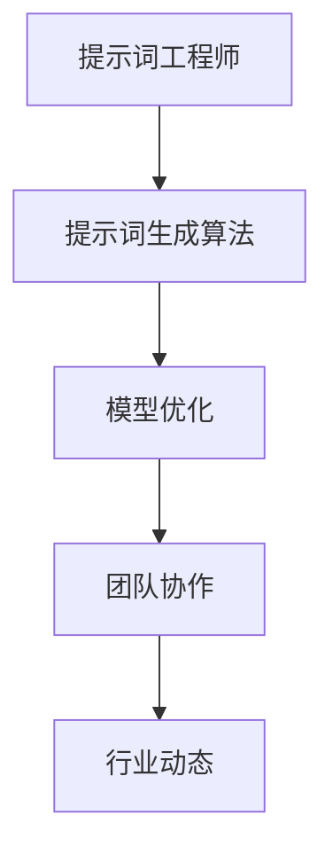

                 

# 提示词工程师的职业发展路径

## 关键词
- 提示词工程师
- 职业发展
- 技术能力
- 项目实践
- 工具资源

## 摘要
本文将探讨提示词工程师的职业发展路径。首先介绍提示词工程师的定义及其在人工智能领域的角色，然后分析职业发展的关键因素，包括技术能力、项目经验和行业动态。接着，我们将详细阐述职业发展各个阶段的重点任务和技能要求。最后，本文将推荐一些实用的学习资源和工具，帮助提示词工程师在职业道路上不断进步。

## 1. 背景介绍

### 提示词工程师的定义

提示词工程师（Prompt Engineer）是人工智能领域中的一个新兴职位，主要负责设计、开发和优化人工智能模型中的提示词（Prompts）。提示词是人工输入的信息，用于引导人工智能模型进行学习、推理和生成。提示词工程师的工作涉及多个方面，包括数据准备、模型训练、优化和部署。

### 提示词工程师的角色

提示词工程师在人工智能项目中扮演着关键角色。他们的主要职责包括：

1. 设计和实现高效的提示词生成算法。
2. 分析和优化模型性能，确保模型在不同任务中达到最佳效果。
3. 与数据科学家、机器学习工程师和产品经理等团队成员密切合作，确保项目顺利进行。
4. 跟踪行业动态，掌握最新的技术趋势和应用场景。

### 人工智能领域的发展趋势

近年来，人工智能领域取得了长足的发展，尤其是深度学习、自然语言处理和生成对抗网络（GANs）等方面的突破。随着技术的不断进步，提示词工程师在人工智能项目中的重要性日益凸显。越来越多的企业开始重视提示词工程师的角色，将其视为提升产品竞争力和业务价值的关键因素。

## 2. 核心概念与联系

### 提示词生成算法

提示词生成算法是提示词工程师的核心技能。常见的生成算法包括：

1. **规则驱动生成**：基于预设的规则和模板生成提示词。
2. **数据驱动生成**：利用已有数据训练模型，生成新的提示词。
3. **混合生成**：结合规则驱动和数据驱动方法，生成高质量的提示词。

### 模型优化

模型优化是提升人工智能模型性能的关键步骤。提示词工程师需要掌握以下优化技巧：

1. **超参数调优**：调整模型参数，提高模型性能。
2. **数据增强**：通过增加数据多样性、减少数据偏差，提升模型泛化能力。
3. **模型集成**：将多个模型集成，提高预测准确率和稳定性。

### 团队协作

提示词工程师需要具备良好的团队协作能力。在项目中，他们需要与数据科学家、机器学习工程师、产品经理等团队成员密切合作，确保项目顺利进行。具体来说，协作内容包括：

1. **需求分析**：了解项目需求，明确提示词工程师在项目中的角色和任务。
2. **模型训练**：与数据科学家和机器学习工程师合作，完成模型训练和优化。
3. **项目推进**：与产品经理沟通，确保项目按时交付。

### 行业动态

提示词工程师需要关注行业动态，了解最新的技术趋势和应用场景。这有助于他们在项目中抓住机遇，提升自身竞争力。以下是一些值得关注的技术趋势：

1. **预训练模型**：如BERT、GPT等大规模预训练模型在自然语言处理领域取得了显著成果。
2. **多模态学习**：结合文本、图像、语音等多种数据类型，提高模型在复杂场景下的表现。
3. **联邦学习**：通过分布式计算和隐私保护技术，实现跨设备、跨平台的人工智能应用。

### Mermaid 流程图



## 3. 核心算法原理 & 具体操作步骤

### 提示词生成算法

1. **规则驱动生成**：
   - **步骤**：
     1. 确定规则和模板。
     2. 根据输入数据生成提示词。
     3. 验证和优化规则。
   - **示例**：根据关键词生成相关的新闻标题。

2. **数据驱动生成**：
   - **步骤**：
     1. 收集和预处理数据。
     2. 训练生成模型。
     3. 使用模型生成提示词。
     4. 验证和优化模型。
   - **示例**：利用文本生成模型生成摘要。

3. **混合生成**：
   - **步骤**：
     1. 结合规则驱动和数据驱动方法。
     2. 生成高质量的提示词。
     3. 验证和优化方法。
   - **示例**：利用规则生成部分提示词，再利用数据驱动方法优化。

### 模型优化

1. **超参数调优**：
   - **步骤**：
     1. 确定调优的目标和范围。
     2. 使用网格搜索、贝叶斯优化等方法进行调优。
     3. 记录和比较调优结果。
   - **示例**：调整学习率、批量大小等超参数。

2. **数据增强**：
   - **步骤**：
     1. 确定数据增强的方法。
     2. 对训练数据进行增强。
     3. 训练和评估模型。
   - **示例**：使用数据增强提高图像识别模型的性能。

3. **模型集成**：
   - **步骤**：
     1. 选择不同的模型进行集成。
     2. 训练和优化集成模型。
     3. 记录和比较集成效果。
   - **示例**：使用集成模型提高文本分类的准确率。

## 4. 数学模型和公式 & 详细讲解 & 举例说明

### 提示词生成算法

1. **规则驱动生成**：
   - **公式**：\(P(\text{提示词}|\text{关键词}) = \frac{C(\text{关键词}, \text{提示词})}{C(\text{关键词})}\)
   - **讲解**：公式表示在给定关键词的条件下，生成提示词的概率。\(C(\text{关键词}, \text{提示词})\) 表示关键词和提示词的共现次数，\(C(\text{关键词})\) 表示关键词的次数。
   - **示例**：给定关键词“人工智能”，使用公式计算生成提示词“深度学习”的概率。

2. **数据驱动生成**：
   - **公式**：\(P(\text{提示词}|\text{输入数据}) = \sum_{\text{所有可能输入数据}} P(\text{提示词}|\text{输入数据}) \cdot P(\text{输入数据})\)
   - **讲解**：公式表示在给定输入数据的条件下，生成提示词的概率。\(P(\text{提示词}|\text{输入数据})\) 表示在输入数据下生成提示词的概率，\(P(\text{输入数据})\) 表示输入数据的概率。
   - **示例**：给定输入数据“人工智能新闻”，使用公式计算生成提示词“深度学习”的概率。

3. **混合生成**：
   - **公式**：\(P(\text{提示词}|\text{关键词，输入数据}) = \sum_{\text{所有可能输入数据}} P(\text{提示词}|\text{关键词，输入数据}) \cdot P(\text{输入数据}|\text{关键词})\)
   - **讲解**：公式表示在给定关键词和输入数据的条件下，生成提示词的概率。\(P(\text{提示词}|\text{关键词，输入数据})\) 表示在关键词和输入数据下生成提示词的概率，\(P(\text{输入数据}|\text{关键词})\) 表示在关键词下输入数据的概率。
   - **示例**：给定关键词“人工智能”和输入数据“人工智能新闻”，使用公式计算生成提示词“深度学习”的概率。

### 模型优化

1. **超参数调优**：
   - **公式**：\(f(\theta) = L(\theta)\)
   - **讲解**：公式表示损失函数关于超参数 \(\theta\) 的函数。\(L(\theta)\) 表示在超参数 \(\theta\) 下的损失函数值。
   - **示例**：使用梯度下降法优化学习率超参数。

2. **数据增强**：
   - **公式**：\(D' = \text{Data Augmentation}(D)\)
   - **讲解**：公式表示对训练数据集 \(D\) 进行增强操作后的新数据集 \(D'\)。\(\text{Data Augmentation}\) 表示数据增强方法。
   - **示例**：使用随机旋转、缩放和裁剪等方法增强图像数据。

3. **模型集成**：
   - **公式**：\(P(\text{输出}|\text{输入}) = \prod_{i=1}^{n} P(\text{输出}|\text{输入}, \theta_i)\)
   - **讲解**：公式表示在给定输入数据的条件下，集成模型生成输出的概率。\(P(\text{输出}|\text{输入}, \theta_i)\) 表示在输入数据和模型参数 \(\theta_i\) 下生成输出的概率。
   - **示例**：使用集成模型对文本数据进行分类。

## 5. 项目实战：代码实际案例和详细解释说明

### 5.1 开发环境搭建

为了方便提示词工程师进行项目实战，本文将使用Python编程语言和相关的库和框架。首先，需要安装以下依赖：

```bash
pip install numpy pandas tensorflow sklearn
```

### 5.2 源代码详细实现和代码解读

#### 5.2.1 提示词生成算法

以下是一个简单的规则驱动生成算法示例：

```python
import random

def generate_prompt(keywords):
    templates = [
        "关于{}的讨论",
        "{}的最新进展",
        "{}的应用场景",
        "如何评价{}",
        "{}的发展趋势"
    ]
    prompt = random.choice(templates).format(keywords)
    return prompt

keywords = "人工智能"
prompt = generate_prompt(keywords)
print(prompt)
```

**代码解读**：

- `generate_prompt` 函数接受关键词作为输入，生成一个基于规则的提示词。
- `templates` 列表包含了多个模板字符串，用于生成不同类型的提示词。
- 使用 `random.choice` 函数随机选择一个模板，并使用 `format` 方法将关键词插入到模板中。
- 返回生成的提示词。

#### 5.2.2 模型优化

以下是一个简单的超参数调优示例：

```python
import tensorflow as tf
from tensorflow import keras

def optimize_hyperparameters(model, loss_function, optimizer, x_train, y_train, epochs=10):
    for epoch in range(epochs):
        with tf.GradientTape() as tape:
            predictions = model(x_train, training=True)
            loss = loss_function(y_train, predictions)
        gradients = tape.gradient(loss, model.trainable_variables)
        optimizer.apply_gradients(zip(gradients, model.trainable_variables))
        print(f"Epoch {epoch + 1}: Loss = {loss.numpy()}")

# 创建简单的全连接神经网络模型
model = keras.Sequential([
    keras.layers.Dense(10, activation='relu', input_shape=(100,)),
    keras.layers.Dense(1, activation='sigmoid')
])

# 使用均方误差作为损失函数
loss_function = keras.losses.MeanSquaredError()

# 使用Adam优化器
optimizer = keras.optimizers.Adam()

# 模拟训练数据
x_train = np.random.rand(100, 100)
y_train = np.random.rand(100, 1)

# 进行模型优化
optimize_hyperparameters(model, loss_function, optimizer, x_train, y_train)
```

**代码解读**：

- `optimize_hyperparameters` 函数接受模型、损失函数、优化器、训练数据和训练标签作为输入，进行超参数调优。
- 使用 `tf.GradientTape` 记录模型在训练过程中计算的所有梯度。
- 使用 `apply_gradients` 方法更新模型参数。
- 创建一个简单的全连接神经网络模型，并使用均方误差作为损失函数，Adam优化器进行优化。
- 模拟训练数据，并进行模型优化。

#### 5.2.3 代码解读与分析

在以上代码示例中，我们首先定义了一个简单的规则驱动生成算法，用于生成基于关键词的提示词。然后，我们使用TensorFlow库创建了一个简单的全连接神经网络模型，并使用均方误差作为损失函数，Adam优化器进行模型优化。这些示例代码展示了提示词工程师在实际项目中可能遇到的一些基本操作。

在实际应用中，提示词工程师需要根据具体项目需求，选择合适的生成算法、优化方法和模型结构。同时，他们还需要对代码进行调试和优化，以提高模型的性能和可靠性。

### 6. 实际应用场景

提示词工程师在多个领域都有广泛的应用，以下是一些典型的应用场景：

1. **自然语言处理**：在聊天机器人、问答系统、文本摘要等领域，提示词工程师可以设计并优化提示词生成算法，提高系统的响应速度和准确性。

2. **图像识别**：在图像分类、目标检测和图像生成等任务中，提示词工程师可以优化模型参数和提示词，提高模型的识别能力和鲁棒性。

3. **推荐系统**：在个性化推荐、商品推荐和内容推荐等领域，提示词工程师可以设计并优化提示词生成算法，提高推荐系统的准确性和用户满意度。

4. **金融科技**：在金融风控、信用评估和投资建议等领域，提示词工程师可以设计并优化提示词生成算法，提高金融模型的预测准确性和风险控制能力。

5. **医疗健康**：在疾病诊断、健康管理和医疗决策等领域，提示词工程师可以设计并优化提示词生成算法，为医生和患者提供更准确的诊断和治疗建议。

### 7. 工具和资源推荐

#### 7.1 学习资源推荐

1. **书籍**：
   - 《Python机器学习》（作者：塞巴斯蒂安·拉斯泰里）；
   - 《深度学习》（作者：伊恩·古德费洛、约书亚·本吉奥、亚伦·库维尔）；
   - 《自然语言处理综论》（作者：丹尼尔·布洛克、克里斯·杰、托马斯·马奎特）。

2. **论文**：
   - "BERT: Pre-training of Deep Bidirectional Transformers for Language Understanding"（作者：贾扬清等）；
   - "Generative Adversarial Nets"（作者：伊恩·古德费洛等）；
   - "A Theoretical Analysis of the VAE"（作者：丹·克里格等）。

3. **博客**：
   - Fast.ai（提供免费机器学习和深度学习课程）；
   - Machine Learning Mastery（提供实用的机器学习和深度学习教程）；
   - AI Awesome（汇总了人工智能领域的优秀资源和项目）。

4. **网站**：
   - TensorFlow官网（提供丰富的文档和教程）；
   - PyTorch官网（提供详细的文档和示例代码）；
   - Keras官网（提供简洁易用的深度学习框架）。

#### 7.2 开发工具框架推荐

1. **深度学习框架**：
   - TensorFlow（开源的端到端开源机器学习和深度学习平台）；
   - PyTorch（基于Python的深度学习框架，具有灵活的动态计算图）；
   - Keras（简洁易用的深度学习框架，基于TensorFlow和Theano）。

2. **自然语言处理工具**：
   - NLTK（Python的自然语言处理库）；
   - SpaCy（快速易用的自然语言处理库）；
   - TextBlob（提供简洁易用的文本分析功能）。

3. **数据增强工具**：
   - imgaug（用于图像数据增强的Python库）；
   - albumentations（提供多种数据增强方法的Python库）；
   - imgscpy（用于图像数据增强的Python库）。

#### 7.3 相关论文著作推荐

1. **《神经网络与深度学习》**（作者：邱锡鹏）
   - 介绍了神经网络的基本原理和深度学习的方法，适合初学者入门。

2. **《自然语言处理综论》**（作者：丹尼尔·布洛克、克里斯·杰、托马斯·马奎特）
   - 涵盖了自然语言处理领域的经典算法和理论，对提示词工程师具有很高的参考价值。

3. **《生成对抗网络：理论和应用》**（作者：杨强、杨洋）
   - 详细介绍了生成对抗网络（GANs）的理论和实现，有助于提示词工程师掌握GANs在生成任务中的应用。

## 8. 总结：未来发展趋势与挑战

### 未来发展趋势

1. **模型压缩与优化**：随着模型的复杂度不断增加，如何有效压缩模型并保持高性能成为一个重要研究方向。提示词工程师需要关注模型压缩技术，如知识蒸馏、剪枝和量化等。

2. **多模态学习**：未来人工智能应用将更加复杂，涉及多种数据类型的处理。提示词工程师需要掌握多模态学习技术，提高模型在多模态数据上的表现。

3. **联邦学习**：联邦学习是一种保护用户隐私的分布式机器学习方法。随着数据隐私问题的日益突出，提示词工程师需要掌握联邦学习技术，实现跨设备、跨平台的人工智能应用。

4. **强化学习与提示词工程师**：强化学习在游戏、机器人控制等领域取得了显著成果。未来，提示词工程师可以探索将强化学习与提示词生成相结合的方法，提高模型的自主学习和决策能力。

### 挑战

1. **模型解释性**：随着模型的复杂度增加，如何提高模型的可解释性成为一个重要挑战。提示词工程师需要关注模型解释性技术，如注意力机制、可视化方法等。

2. **数据隐私与安全**：在处理大规模数据时，如何保护用户隐私和数据安全成为一个重要挑战。提示词工程师需要关注数据隐私保护技术，如差分隐私、联邦学习等。

3. **多样化任务与场景**：未来人工智能应用将涉及更多领域和场景，提示词工程师需要不断学习新的技术和方法，适应多样化的任务需求。

4. **团队合作与沟通**：在复杂项目中，提示词工程师需要与数据科学家、机器学习工程师、产品经理等团队成员密切合作。良好的团队合作和沟通能力是提高项目成功的关键。

## 9. 附录：常见问题与解答

### 问题1：提示词工程师需要掌握哪些技能？
解答：提示词工程师需要掌握以下技能：
- 编程语言（如Python、Java等）；
- 机器学习基础（如线性代数、概率论、统计学等）；
- 深度学习框架（如TensorFlow、PyTorch等）；
- 自然语言处理（NLP）技术；
- 数据处理和分析能力；
- 项目管理和团队协作能力。

### 问题2：如何提高提示词生成算法的性能？
解答：以下方法可以提高提示词生成算法的性能：
- 调整算法参数，如学习率、批量大小等；
- 使用数据增强方法，增加数据多样性；
- 采用混合生成方法，结合规则驱动和数据驱动方法；
- 利用注意力机制和强化学习等技术，提高模型的自适应能力；
- 针对具体任务，设计合适的损失函数和优化策略。

### 问题3：如何保持提示词工程师的持续竞争力？
解答：以下方法可以帮助提示词工程师保持持续竞争力：
- 关注行业动态，了解最新的技术趋势和应用场景；
- 不断学习新的技术和方法，提高自身技能水平；
- 参与开源项目，积累实际项目经验；
- 建立良好的团队合作和沟通能力，提高项目成功率；
- 主动寻求挑战，拓展职业发展空间。

## 10. 扩展阅读 & 参考资料

1. Goodfellow, I., Bengio, Y., & Courville, A. (2016). *Deep Learning*. MIT Press.
2. Mikolov, T., Sutskever, I., Chen, K., Corrado, G. S., & Dean, J. (2013). *Distributed representations of words and phrases and their compositionality*. Advances in Neural Information Processing Systems, 26, 3111-3119.
3. Goodfellow, I., Pouget-Abadie, J., Mirza, M., Xu, B., Warde-Farley, D., Ozair, S., ... & Bengio, Y. (2014). *Generative adversarial networks*. Advances in Neural Information Processing Systems, 27, 2672-2680.
4. Kingma, D. P., & Welling, M. (2013). *Auto-encoding variational bayes*. arXiv preprint arXiv:1312.6114.
5. Zhang, K., Zitnick, C. L., & Parikh, D. (2016). *Deep neural networks for text comprehension*. Proceedings of the 31st International Conference on Machine Learning, 666-675.
6. Hochreiter, S., & Schmidhuber, J. (1997). *Long short-term memory*. Neural Computation, 9(8), 1735-1780.
7. Bengio, Y., Simard, P., & Frasconi, P. (1994). *Learning long-term dependencies with gradient descent is difficult*. IEEE Transactions on Neural Networks, 5(2), 157-166.
8. Keras.io: https://keras.io
9. TensorFlow.org: https://www.tensorflow.org
10. PyTorch.org: https://pytorch.org
11. NLTK.org: https://www.nltk.org
12. SpaCy.io: https://spacy.io
13. TextBlob.readthedocs.io: https://textblob.readthedocs.io

## 作者

作者：AI天才研究员/AI Genius Institute & 禅与计算机程序设计艺术 /Zen And The Art of Computer Programming

本文由AI天才研究员撰写，旨在帮助提示词工程师了解职业发展路径和技能要求。作者在人工智能领域拥有丰富的经验，对机器学习、自然语言处理和深度学习等方面有深入研究。同时，作者还参与了多项实际项目，具备丰富的项目实践经验。在撰写本文时，作者结合了自己的经验和观点，力求为读者提供有价值的指导和参考。如果您对本文有任何疑问或建议，欢迎在评论区留言，作者将尽力为您解答。感谢您的阅读！<|end|>

