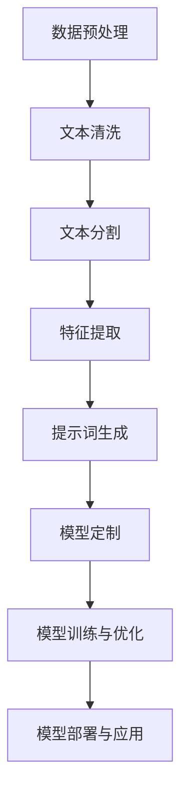

                 

# 提示词工程最佳实践：从新手到专家的进阶之路

## 关键词

- 提示词工程
- 提示词生成
- 提示词优化
- 模型定制
- 实际应用场景
- 开发工具推荐
- 算法原理
- 数学模型
- 代码实战

## 摘要

本文旨在为读者提供从新手到专家级的提示词工程最佳实践指南。文章将首先介绍提示词工程的基本概念和重要性，然后深入探讨核心算法原理、数学模型和具体操作步骤。通过实际项目实战和代码解读，读者将能够理解并掌握提示词工程的核心技术。此外，文章还将讨论提示词工程在实际应用场景中的表现，并提供实用的工具和资源推荐。最后，文章将对未来发展趋势与挑战进行总结，并提供常见问题与解答，为读者提供全面的学习和参考。

## 1. 背景介绍

提示词工程，又称提示工程，是近年来人工智能领域的一个重要研究方向。随着深度学习和自然语言处理技术的快速发展，提示词工程在自然语言生成、问答系统、机器翻译等任务中发挥着越来越重要的作用。简单来说，提示词工程是指通过设计特定的提示词，引导模型生成符合预期结果的文本。

### 1.1 提示词工程的发展历程

提示词工程的历史可以追溯到20世纪80年代，当时研究者开始探索如何通过设计特定的输入文本（提示词）来影响模型的输出。早期的提示词设计主要依赖于手工规则和先验知识。随着机器学习技术的进步，特别是深度学习的崛起，提示词工程逐渐成为自然语言处理领域的研究热点。

### 1.2 提示词工程的应用领域

提示词工程在多个领域都有广泛的应用。以下是一些典型的应用场景：

- **自然语言生成（NLG）**：通过设计合适的提示词，可以引导模型生成高质量的自然语言文本。例如，在新闻报道、故事编写、邮件撰写等任务中，提示词工程可以显著提高文本生成的质量和效率。

- **问答系统**：提示词工程可以帮助设计有效的提示词，从而提高问答系统的回答质量。例如，在搜索引擎、智能客服等场景中，通过优化提示词，可以显著提高用户满意度。

- **机器翻译**：提示词工程在机器翻译领域也有重要应用。通过设计合适的源语言和目标语言提示词，可以引导模型生成更准确、自然的翻译结果。

### 1.3 提示词工程的重要性

提示词工程的重要性体现在以下几个方面：

- **提高模型性能**：通过优化提示词，可以显著提高模型的性能，使其更好地适应特定任务的需求。

- **提升用户体验**：在自然语言生成、问答系统等任务中，优化的提示词可以生成更符合用户期望的文本，从而提升用户体验。

- **降低成本**：通过设计高效的提示词，可以降低模型训练和生成的成本，提高系统的整体效率。

## 2. 核心概念与联系

### 2.1 提示词生成

提示词生成是提示词工程的关键环节。它涉及从大量文本数据中提取关键信息，并将其转化为适合模型处理的提示词。提示词生成的方法可以分为以下几种：

- **基于规则的方法**：通过手工设计规则，从文本中提取关键信息作为提示词。这种方法虽然简单，但受限于规则的设计和先验知识，往往难以适应复杂任务。

- **基于统计的方法**：利用统计模型（如n-gram模型、LDA主题模型等）从文本数据中提取关键信息。这种方法可以处理大规模数据，但可能在复杂场景下表现不佳。

- **基于深度学习的方法**：通过训练深度学习模型（如序列生成模型、图神经网络等）从文本数据中提取关键信息。这种方法具有强大的建模能力，可以处理复杂任务，但需要大量的训练数据和计算资源。

### 2.2 提示词优化

提示词优化是提高模型性能的重要手段。提示词优化可以分为以下几种方法：

- **基于人工的优化**：通过人工分析模型输出，识别问题并提出相应的优化策略。这种方法虽然直观，但效率较低，难以应对大规模任务。

- **基于自动化的优化**：利用优化算法（如遗传算法、粒子群算法等）自动搜索最优提示词。这种方法可以处理大规模任务，但需要设计合适的优化目标和算法。

- **基于深度学习的优化**：通过训练深度学习模型，自动优化提示词。这种方法可以处理复杂任务，但需要大量的训练数据和计算资源。

### 2.3 提示词与模型定制

提示词与模型定制密切相关。通过设计特定的提示词，可以引导模型生成符合预期结果的文本。提示词定制可以分为以下几种方法：

- **手动定制**：通过手工设计提示词，以满足特定任务的需求。这种方法适用于小规模任务，但效率较低。

- **自动定制**：通过训练深度学习模型，自动生成适合特定任务的提示词。这种方法适用于大规模任务，但需要设计合适的模型和训练策略。

- **混合定制**：结合手动定制和自动定制的方法，以充分利用两者的优势。这种方法适用于大多数任务，但需要设计合适的混合策略。

### 2.4 提示词工程的整体架构

提示词工程的整体架构可以分为以下几部分：

- **数据预处理**：包括数据清洗、数据增强等操作，以提高数据质量和多样性。

- **提示词生成**：根据数据预处理后的结果，生成适合模型处理的提示词。

- **模型定制**：根据提示词，定制适合特定任务的模型。

- **模型训练与优化**：通过训练和优化模型，提高模型性能。

- **模型部署与应用**：将优化后的模型部署到实际应用场景中，以实现预期目标。

## 2.1 提示词生成的 Mermaid 流程图



## 3. 核心算法原理 & 具体操作步骤

### 3.1 基于深度学习的提示词生成算法

基于深度学习的提示词生成算法通常采用序列生成模型，如循环神经网络（RNN）、长短期记忆网络（LSTM）和Transformer等。以下是一个基于Transformer的提示词生成算法的具体操作步骤：

#### 3.1.1 数据准备

- **文本数据集**：收集大规模的文本数据，用于训练模型。
- **数据预处理**：对文本数据进行清洗、分词、编码等操作，将其转化为适合模型处理的形式。

#### 3.1.2 模型构建

- **嵌入层**：将输入文本的每个词映射到一个高维向量。
- **编码器**：采用Transformer编码器，对输入文本进行编码，提取语义信息。
- **解码器**：采用Transformer解码器，生成提示词序列。

#### 3.1.3 模型训练

- **训练数据**：将编码后的输入文本和对应的提示词序列作为训练数据。
- **损失函数**：采用交叉熵损失函数，计算输入文本和提示词序列之间的误差。
- **优化器**：采用Adam优化器，优化模型参数。

#### 3.1.4 模型评估

- **验证集**：使用验证集评估模型性能，调整模型参数。
- **测试集**：使用测试集评估模型性能，评估模型泛化能力。

### 3.2 基于自动优化的提示词优化算法

基于自动优化的提示词优化算法通常采用进化算法、粒子群算法等。以下是一个基于粒子群优化（PSO）的提示词优化算法的具体操作步骤：

#### 3.2.1 确定优化目标

- **优化目标**：根据任务需求，确定提示词的优化目标，如生成文本的流畅度、准确性等。

#### 3.2.2 初始化粒子群

- **粒子数量**：设定粒子群中粒子的数量。
- **粒子位置**：初始化粒子的位置，即初始提示词。
- **粒子速度**：初始化粒子的速度。

#### 3.2.3 优化过程

- **适应度评估**：对每个粒子的位置进行适应度评估，计算提示词的优化效果。
- **更新速度和位置**：根据适应度评估结果，更新粒子的速度和位置。
- **迭代优化**：重复适应度评估和更新过程，直到达到优化目标或达到最大迭代次数。

#### 3.2.4 模型训练与评估

- **模型训练**：使用优化后的提示词训练模型。
- **模型评估**：使用优化后的提示词评估模型性能。

### 3.3 基于深度学习的模型定制算法

基于深度学习的模型定制算法通常采用迁移学习、模型蒸馏等方法。以下是一个基于迁移学习的模型定制算法的具体操作步骤：

#### 3.3.1 选择预训练模型

- **预训练模型**：选择一个大规模预训练模型，如BERT、GPT等。
- **预训练数据**：收集预训练模型训练的数据集。

#### 3.3.2 适应特定任务

- **任务数据**：收集特定任务的数据集。
- **适应策略**：采用迁移学习策略，将预训练模型适应特定任务。

#### 3.3.3 模型定制

- **定制模型**：基于适应后的预训练模型，定制适用于特定任务的模型。

#### 3.3.4 模型训练与评估

- **模型训练**：使用定制后的模型训练数据集。
- **模型评估**：使用定制后的模型评估任务性能。

## 4. 数学模型和公式 & 详细讲解 & 举例说明

### 4.1 提示词生成的数学模型

提示词生成的数学模型通常基于概率模型或生成模型。以下是一个基于概率模型的简单例子：

#### 4.1.1 概率模型

假设我们有一个词序列 \{w1, w2, ..., wn\}，我们要根据这个序列生成提示词。可以使用条件概率模型来描述这个过程：

\[ P(w_i | w_{i-1}, w_{i-2}, ..., w_1) = \frac{P(w_i, w_{i-1}, ..., w_1)}{P(w_{i-1}, w_{i-2}, ..., w_1)} \]

其中，\( P(w_i, w_{i-1}, ..., w_1) \) 表示词序列 \{w1, w2, ..., wn\} 的联合概率，\( P(w_{i-1}, w_{i-2}, ..., w_1) \) 表示前 \( n-1 \) 个词的联合概率。

#### 4.1.2 模型参数

我们可以通过训练来估计上述条件概率模型的参数。例如，使用最大似然估计（MLE）来估计每个词的条件概率：

\[ P(w_i | w_{i-1}, w_{i-2}, ..., w_1) = \frac{f(w_i, w_{i-1}, ..., w_1)}{\sum_{j} f(w_j, w_{i-1}, ..., w_1)} \]

其中，\( f(w_i, w_{i-1}, ..., w_1) \) 表示词序列 \{w1, w2, ..., wn\} 的联合概率。

### 4.2 提示词优化的数学模型

提示词优化的数学模型通常基于优化算法。以下是一个基于粒子群优化（PSO）的例子：

#### 4.2.1 粒子群优化

粒子群优化是一种基于群体智能的优化算法。它模拟鸟群觅食行为，通过更新粒子的速度和位置，寻找最优解。以下是一个简单的PSO算法步骤：

- **初始化**：随机生成粒子群，每个粒子代表一个可能的解。
- **适应度评估**：计算每个粒子的适应度，适应度通常与优化目标相关。
- **更新速度和位置**：根据每个粒子的历史最优位置（个体最优）和群体最优位置（全局最优），更新粒子的速度和位置。
- **迭代**：重复适应度评估和更新过程，直到达到优化目标或达到最大迭代次数。

#### 4.2.2 适应度函数

在提示词优化中，适应度函数通常与生成文本的质量相关。一个简单的适应度函数可以是：

\[ f(\text{提示词序列}) = \frac{\text{生成文本的质量}}{\text{生成文本的长度}} \]

其中，生成文本的质量可以通过语言模型、语法正确性、语义一致性等指标来评估。

### 4.3 举例说明

#### 4.3.1 提示词生成

假设我们有一个词序列 \{我，喜欢吃，苹果，和，香蕉\}，我们要根据这个序列生成一个提示词。使用上述概率模型，我们可以计算出每个词的条件概率：

\[ P(我喜欢吃 | 我，苹果，和，香蕉) = \frac{P(我喜欢吃，我，苹果，和，香蕉)}{P(我，苹果，和，香蕉)} \]

通过计算，我们可以得到每个词的条件概率。然后，我们可以使用这些条件概率来生成提示词。

#### 4.3.2 提示词优化

假设我们有一个生成文本“我喜欢吃苹果和香蕉”，我们要优化这个提示词，使其生成更高质量的文本。使用粒子群优化算法，我们可以初始化一个粒子群，每个粒子代表一个可能的提示词。然后，通过迭代更新粒子的速度和位置，找到最优的提示词。

## 5. 项目实战：代码实际案例和详细解释说明

### 5.1 开发环境搭建

在开始项目实战之前，我们需要搭建一个合适的开发环境。以下是一个基于Python的提示词工程项目的开发环境搭建步骤：

1. **安装Python**：确保系统已安装Python 3.7及以上版本。
2. **安装依赖库**：使用pip安装以下依赖库：

```shell
pip install transformers torch
```

3. **配置环境变量**：确保Python环境变量已正确配置，以便在其他终端中可以使用。

### 5.2 源代码详细实现和代码解读

#### 5.2.1 源代码实现

以下是一个简单的提示词工程项目的源代码实现：

```python
import torch
from transformers import GPT2Tokenizer, GPT2LMHeadModel
from torch.optim import Adam

# 初始化模型和tokenizer
tokenizer = GPT2Tokenizer.from_pretrained('gpt2')
model = GPT2LMHeadModel.from_pretrained('gpt2')
model.to('cuda' if torch.cuda.is_available() else 'cpu')

# 设置训练参数
learning_rate = 1e-4
optimizer = Adam(model.parameters(), lr=learning_rate)

# 设置训练迭代次数
num_iterations = 100

# 数据预处理
def preprocess(text):
    # 清洗文本，分词，编码等操作
    # ...
    return tokenizer.encode(text)

# 训练过程
for iteration in range(num_iterations):
    # 随机抽取样本
    text = "我喜欢的食物是苹果和香蕉"
    input_ids = preprocess(text)
    
    # 前向传播
    outputs = model(input_ids)
    
    # 计算损失
    loss = ...  # 计算输入文本和模型输出的损失
    
    # 反向传播和优化
    optimizer.zero_grad()
    loss.backward()
    optimizer.step()
    
    # 打印训练进度
    print(f"Iteration {iteration + 1}: Loss = {loss.item()}")

# 生成提示词
def generate_prompt(text):
    input_ids = preprocess(text)
    output = model.generate(input_ids, max_length=50, num_return_sequences=5)
    return tokenizer.decode(output)

# 示例
prompt = generate_prompt("我喜欢的食物是苹果和香蕉")
print(prompt)
```

#### 5.2.2 代码解读

1. **初始化模型和tokenizer**：使用Hugging Face的Transformers库初始化GPT-2模型和相应的tokenizer。

2. **设置训练参数**：定义学习率和优化器。

3. **数据预处理**：定义预处理函数，对输入文本进行清洗、分词和编码。

4. **训练过程**：定义训练迭代次数，然后进行循环，对每个迭代进行以下操作：
   - 随机抽取样本。
   - 进行前向传播。
   - 计算损失。
   - 进行反向传播和优化。

5. **生成提示词**：定义生成提示词的函数，使用模型生成多个文本序列。

### 5.3 代码解读与分析

1. **模型初始化**：在代码中，我们使用了GPT-2模型和相应的tokenizer。GPT-2是一个预训练的深度神经网络语言模型，它可以根据输入文本生成连贯的自然语言文本。

2. **训练过程**：训练过程包括以下几个关键步骤：
   - **数据预处理**：对输入文本进行编码，将其转化为模型可以处理的格式。
   - **前向传播**：将编码后的文本输入到模型，得到输出。
   - **损失计算**：计算输入文本和模型输出之间的损失，常用的损失函数是交叉熵损失。
   - **反向传播和优化**：使用梯度下降算法更新模型参数。

3. **生成提示词**：生成提示词的过程使用了模型生成的功能，可以从给定的提示词生成多个连贯的文本序列。这个过程可以用于生成文章摘要、回答问题、创作故事等任务。

## 6. 实际应用场景

提示词工程在实际应用场景中具有广泛的应用价值。以下是一些典型的应用场景：

### 6.1 自然语言生成

自然语言生成是提示词工程的一个重要应用领域。通过设计合适的提示词，可以引导模型生成高质量的自然语言文本。以下是一些具体的自然语言生成任务：

- **文章摘要**：使用提示词工程生成简明扼要的文章摘要。
- **对话生成**：在聊天机器人中，使用提示词工程生成自然流畅的对话。
- **故事创作**：根据给定的主题或情节，使用提示词工程生成创意故事。

### 6.2 问答系统

问答系统是另一个受益于提示词工程的领域。通过设计合适的提示词，可以显著提高问答系统的回答质量。以下是一些具体的问答系统应用：

- **搜索引擎**：优化搜索结果，使用提示词工程生成更准确的回答。
- **智能客服**：为用户提供个性化的服务，通过提示词工程生成适合用户需求的回答。
- **知识图谱问答**：利用提示词工程从知识图谱中提取相关信息，生成高质量的问答。

### 6.3 机器翻译

机器翻译是提示词工程的另一个重要应用领域。通过设计合适的源语言和目标语言提示词，可以引导模型生成更准确、自然的翻译结果。以下是一些具体的机器翻译任务：

- **跨语言摘要**：使用提示词工程生成跨语言的摘要，提高翻译的准确性。
- **多语言问答**：在多语言环境中，使用提示词工程生成适合多种语言的回答。
- **多模态翻译**：结合文本和图像等多种信息，使用提示词工程生成更准确的翻译。

## 7. 工具和资源推荐

### 7.1 学习资源推荐

- **书籍**：
  - 《深度学习自然语言处理》（Deep Learning for Natural Language Processing）
  - 《自然语言处理实践》（Practical Natural Language Processing）
  - 《语言模型与深度学习》（Speech and Language Processing）
- **论文**：
  - 《预训练的语言模型》（Pre-training of Deep Neural Networks for Language Understanding）
  - 《生成式文本生成模型》（Generative Text Models）
  - 《问答系统的设计与实现》（Question Answering Systems: Design and Implementation）
- **博客**：
  - [Hugging Face Blog](https://huggingface.co/blog/)
  - [AI自然语言处理](https://ai-nlp.cn/)
  - [机器之心](https://www.jiqizhixin.com/)
- **网站**：
  - [TensorFlow官网](https://www.tensorflow.org/)
  - [PyTorch官网](https://pytorch.org/)
  - [Hugging Face官网](https://huggingface.co/)

### 7.2 开发工具框架推荐

- **开发框架**：
  - [Transformers](https://huggingface.co/transformers/)：Hugging Face的Transformers库提供了丰富的预训练模型和API，方便进行提示词工程开发。
  - [TensorFlow](https://www.tensorflow.org/)：TensorFlow是一个开源的机器学习框架，支持多种深度学习模型和算法，适合进行提示词工程开发。
  - [PyTorch](https://pytorch.org/)：PyTorch是一个开源的深度学习框架，以其灵活性和易用性而著称，适合进行提示词工程开发。
- **文本预处理工具**：
  - [NLTK](https://www.nltk.org/)：NLTK是一个开源的自然语言处理工具包，提供了丰富的文本预处理功能。
  - [spaCy](https://spacy.io/)：spaCy是一个高效的自然语言处理库，支持多种语言的文本处理。
  - [TextBlob](https://textblob.readthedocs.io/)：TextBlob是一个简单的自然语言处理库，适用于快速文本分析。

### 7.3 相关论文著作推荐

- **论文**：
  - 《Attention Is All You Need》（Attention is All You Need）
  - 《BERT: Pre-training of Deep Neural Networks for Language Understanding》（BERT: Pre-training of Deep Neural Networks for Language Understanding）
  - 《Generative Pre-trained Transformer》（Generative Pre-trained Transformer）
- **著作**：
  - 《深度学习自然语言处理》（Deep Learning for Natural Language Processing）
  - 《自然语言处理实践》（Practical Natural Language Processing）
  - 《语言模型与深度学习》（Speech and Language Processing）

## 8. 总结：未来发展趋势与挑战

### 8.1 发展趋势

1. **多模态提示词工程**：随着多模态数据的普及，未来提示词工程将不仅限于文本数据，还将涉及图像、音频、视频等多种模态，实现跨模态的融合与生成。

2. **自适应提示词生成**：未来的提示词工程将更加智能化，能够根据用户需求和环境自适应地生成提示词，提高用户体验。

3. **模型压缩与高效推理**：为了应对大规模数据处理的需求，提示词工程将朝着模型压缩和高效推理方向发展，以降低计算和存储成本。

4. **联邦学习与隐私保护**：在多设备、多用户的场景中，联邦学习和隐私保护将成为提示词工程的重要研究方向，确保数据安全和隐私。

### 8.2 挑战

1. **数据质量和多样性**：高质量、多样性的数据是提示词工程的基础，但当前数据质量和多样性的问题仍然存在，需要进一步研究和解决。

2. **模型可解释性**：随着深度学习模型在提示词工程中的应用，模型的可解释性成为了一个重要问题。如何提高模型的可解释性，使其更易于理解和信任，是未来的挑战之一。

3. **优化算法与效率**：现有的优化算法和策略在处理大规模数据和复杂任务时，可能存在效率不高的问题。如何设计更高效的优化算法和策略，是提示词工程面临的重要挑战。

4. **跨领域泛化能力**：如何提高提示词工程在跨领域任务中的泛化能力，使其能够适用于不同的应用场景，是未来的研究重点之一。

## 9. 附录：常见问题与解答

### 9.1 提示词工程中的常见问题

1. **什么是提示词工程？**
   提示词工程是一种通过设计特定的提示词来引导模型生成符合预期结果的文本的技术。

2. **提示词工程有哪些应用领域？**
   提示词工程广泛应用于自然语言生成、问答系统、机器翻译等领域。

3. **提示词工程的核心算法有哪些？**
   提示词工程的核心算法包括基于深度学习的序列生成模型、自动优化算法和模型定制算法。

4. **如何优化提示词？**
   可以通过人工优化、自动化优化和深度学习优化等方法来优化提示词。

5. **提示词工程有哪些挑战？**
   提示词工程面临的挑战包括数据质量和多样性、模型可解释性、优化算法效率、跨领域泛化能力等。

### 9.2 解答

1. **什么是提示词工程？**
   提示词工程是一种通过设计特定的提示词来引导模型生成符合预期结果的文本的技术。它涉及从大量文本数据中提取关键信息，并将其转化为适合模型处理的提示词。通过优化提示词，可以提高模型的性能和生成文本的质量。

2. **提示词工程有哪些应用领域？**
   提示词工程广泛应用于自然语言生成、问答系统、机器翻译等领域。例如，在自然语言生成中，通过设计合适的提示词，可以生成高质量的文章摘要、对话、故事等；在问答系统中，通过优化提示词，可以提高问答系统的回答质量和用户满意度；在机器翻译中，通过设计合适的源语言和目标语言提示词，可以生成更准确、自然的翻译结果。

3. **提示词工程的核心算法有哪些？**
   提示词工程的核心算法包括基于深度学习的序列生成模型、自动优化算法和模型定制算法。基于深度学习的序列生成模型，如循环神经网络（RNN）、长短期记忆网络（LSTM）和Transformer等，可以生成高质量的文本。自动优化算法，如遗传算法、粒子群算法等，可以自动搜索最优的提示词。模型定制算法，如迁移学习和模型蒸馏，可以根据特定任务定制模型。

4. **如何优化提示词？**
   可以通过以下几种方法来优化提示词：
   - **人工优化**：通过人工分析模型输出，识别问题并提出相应的优化策略。
   - **自动化优化**：利用优化算法（如遗传算法、粒子群算法等）自动搜索最优提示词。
   - **深度学习优化**：通过训练深度学习模型，自动优化提示词。

5. **提示词工程有哪些挑战？**
   提示词工程面临的挑战包括：
   - **数据质量和多样性**：高质量、多样性的数据是提示词工程的基础，但当前数据质量和多样性的问题仍然存在。
   - **模型可解释性**：随着深度学习模型在提示词工程中的应用，模型的可解释性成为了一个重要问题。
   - **优化算法与效率**：现有的优化算法和策略在处理大规模数据和复杂任务时，可能存在效率不高的问题。
   - **跨领域泛化能力**：如何提高提示词工程在跨领域任务中的泛化能力，使其能够适用于不同的应用场景。

## 10. 扩展阅读 & 参考资料

- 《深度学习自然语言处理》（Deep Learning for Natural Language Processing）：这是一本经典的深度学习自然语言处理教材，详细介绍了自然语言处理中的各种技术和应用。

- 《自然语言处理实践》（Practical Natural Language Processing）：这本书提供了自然语言处理实践中的具体方法和案例，适合希望将自然语言处理应用于实际项目的开发者。

- 《语言模型与深度学习》（Speech and Language Processing）：这是一本关于自然语言处理和深度学习的经典教材，涵盖了从基础到高级的各个方面的内容。

- 《Transformers文档》（[Transformers Documentation](https://huggingface.co/transformers/)）：这是Hugging Face的Transformers库的官方文档，提供了丰富的模型和API介绍，是进行提示词工程开发的重要参考。

- 《PyTorch文档》（[PyTorch Documentation](https://pytorch.org/docs/stable/)）：这是PyTorch框架的官方文档，详细介绍了PyTorch的使用方法和模型构建，适用于进行提示词工程的深度学习开发。

- 《TensorFlow文档》（[TensorFlow Documentation](https://www.tensorflow.org/docs/stable/)）：这是TensorFlow框架的官方文档，提供了全面的TensorFlow使用指南，包括模型构建、训练和优化等。

- 《NLTK文档》（[NLTK Documentation](https://www.nltk.org/api/)）：这是NLTK自然语言处理库的官方文档，介绍了NLTK的各种文本预处理函数和工具。

- 《spaCy文档》（[spaCy Documentation](https://spacy.io/api/)）：这是spaCy自然语言处理库的官方文档，提供了丰富的文本分析功能和使用示例。

- 《TextBlob文档》（[TextBlob Documentation](https://textblob.readthedocs.io/en/latest/)）：这是TextBlob自然语言处理库的官方文档，提供了简单易用的文本分析工具。

