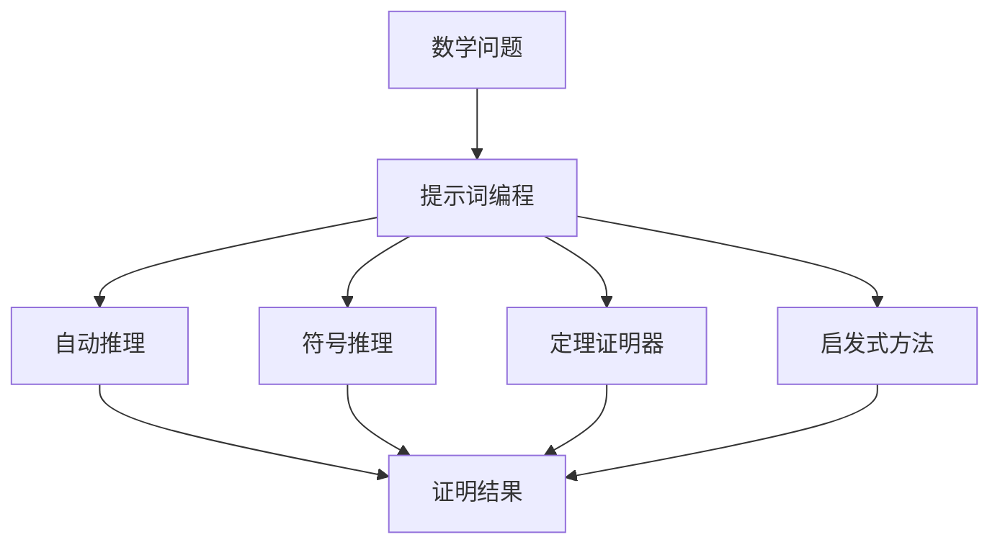

                 

# 提示词编程在自动化数学证明中的角色

## 关键词：提示词编程、自动化数学证明、算法、数学模型、代码实现

## 摘要

本文旨在探讨提示词编程在自动化数学证明中的应用及其重要性。通过分析提示词编程的核心概念、算法原理和数学模型，本文将详细阐述其在数学证明自动化中的角色。同时，通过实际项目案例的代码解读，本文将进一步展示提示词编程的实际应用和效果。最后，本文将探讨未来发展趋势与挑战，并提供相关的学习资源和工具推荐。

## 1. 背景介绍

随着计算机技术的发展，自动化数学证明已成为数学领域的研究热点。传统数学证明往往需要数学家耗费大量时间和精力，而自动化数学证明则通过计算机程序实现，大大提高了证明的效率。然而，现有的自动化数学证明方法主要依赖于符号推理和定理证明器，对于复杂的数学问题，其证明过程仍然充满挑战。

提示词编程作为一种新兴的编程范式，其核心思想是通过提示词（hint）引导计算机完成特定任务的自动推理。提示词编程在自然语言处理、图像识别、游戏开发等领域已取得显著成果。然而，其在自动化数学证明中的应用尚未得到充分关注。

本文旨在填补这一空白，通过分析提示词编程在自动化数学证明中的角色，为研究者提供新的思路和方法。本文将首先介绍提示词编程的核心概念，然后阐述其在数学证明自动化中的应用，并探讨相关算法原理和数学模型。

## 2. 核心概念与联系

### 提示词编程

提示词编程（Hint-Based Programming）是一种基于提示（hint）的编程范式，旨在通过提示引导计算机自动推理和解决问题。提示词编程的核心思想是将问题转化为一个包含提示的输入，然后让计算机根据提示自动推导出解决方案。

提示词通常是一组指令或约束条件，用于引导计算机在特定方向上进行推理。例如，在自然语言处理领域，提示词可以是关键词或短语，用于引导计算机理解文本的含义。在图像识别领域，提示词可以是图像的特征向量，用于引导计算机识别图像中的对象。

### 自动化数学证明

自动化数学证明（Automated Mathematical Proof）是指通过计算机程序实现数学证明的过程。自动化数学证明的核心目标是减少数学家在证明过程中的劳动强度，提高证明的效率。

自动化数学证明的方法主要包括符号推理、定理证明器、启发式方法等。符号推理是指通过符号运算和逻辑推理实现数学证明的方法。定理证明器是一种特殊的计算机程序，用于证明数学定理。启发式方法则是一种基于经验和启发式的数学证明方法。

### 提示词编程与自动化数学证明的联系

提示词编程与自动化数学证明之间存在密切的联系。在自动化数学证明过程中，提示词编程可以作为一种有效的工具，用于引导计算机在证明过程中进行推理。具体来说，提示词编程可以提供以下优势：

1. **提高证明效率**：提示词编程可以减少数学家在证明过程中的劳动强度，提高证明效率。
2. **解决复杂问题**：对于复杂的数学问题，提示词编程可以通过自动推理和约束条件引导计算机发现证明思路。
3. **增强证明透明性**：提示词编程可以提供详细的证明步骤和推理过程，增强证明的透明性。

### Mermaid 流程图

以下是一个描述提示词编程在自动化数学证明中应用的 Mermaid 流程图：



### 2.1 提示词编程的核心概念

提示词编程的核心概念包括：

1. **提示（Hint）**：提示是指一组用于引导计算机进行推理的指令或约束条件。
2. **自动推理（Automated Reasoning）**：自动推理是指计算机在提示的引导下，通过逻辑推理和符号运算实现问题的求解。
3. **约束条件（Constraint）**：约束条件是指限制问题解空间的一组条件，用于指导计算机在特定方向上进行推理。
4. **推理过程（Reasoning Process）**：推理过程是指计算机在提示和约束条件的引导下，从已知信息推导出未知信息的过程。

### 2.2 自动化数学证明的核心概念

自动化数学证明的核心概念包括：

1. **符号推理（Symbolic Reasoning）**：符号推理是指通过符号运算和逻辑推理实现数学证明的方法。
2. **定理证明器（Theorem Prover）**：定理证明器是一种用于证明数学定理的计算机程序。
3. **启发式方法（Heuristic Method）**：启发式方法是一种基于经验和启发式的数学证明方法。

### 2.3 提示词编程与自动化数学证明的关系

提示词编程与自动化数学证明之间的关系可以概括为：

1. **提示词编程作为自动化数学证明的工具**：提示词编程可以作为一种工具，用于引导计算机在证明过程中进行推理。
2. **自动化数学证明作为提示词编程的应用场景**：自动化数学证明是提示词编程的一个典型应用场景，通过提示词编程实现自动化数学证明，可以提高证明效率和解决复杂问题。

### 2.4 提示词编程在自动化数学证明中的挑战与机遇

提示词编程在自动化数学证明中面临的挑战主要包括：

1. **复杂性问题**：对于复杂的数学问题，提示词编程需要设计更加复杂的提示和推理过程。
2. **计算资源限制**：自动化数学证明需要大量的计算资源，提示词编程需要优化算法以适应计算资源限制。
3. **验证问题**：提示词编程生成的证明结果需要经过验证，以确保证明的正确性。

然而，提示词编程在自动化数学证明中也存在巨大的机遇：

1. **提高证明效率**：提示词编程可以减少数学家在证明过程中的劳动强度，提高证明效率。
2. **解决复杂问题**：提示词编程可以通过自动推理和约束条件引导计算机发现证明思路，解决复杂的数学问题。
3. **增强证明透明性**：提示词编程可以提供详细的证明步骤和推理过程，增强证明的透明性。

## 3. 核心算法原理 & 具体操作步骤

### 3.1 核心算法原理

提示词编程在自动化数学证明中的核心算法原理主要包括：

1. **自动推理算法**：自动推理算法是指计算机在提示和约束条件的引导下，通过逻辑推理和符号运算实现问题的求解。
2. **定理证明算法**：定理证明算法是指用于证明数学定理的算法。
3. **启发式算法**：启发式算法是一种基于经验和启发式的数学证明方法。

### 3.2 具体操作步骤

提示词编程在自动化数学证明中的具体操作步骤如下：

1. **问题描述**：首先，明确需要证明的数学问题，并将其转化为形式化的数学表达式。
2. **设计提示**：根据问题描述，设计一组用于引导计算机进行推理的提示，包括提示词、约束条件和目标函数等。
3. **自动推理**：利用自动推理算法，计算机根据提示和约束条件进行推理，推导出问题的解。
4. **验证证明**：对自动推理得到的证明结果进行验证，确保证明的正确性。
5. **优化提示**：根据验证结果，对提示进行优化，以提高证明效率和准确性。
6. **迭代过程**：重复上述步骤，直至得到正确的证明结果。

### 3.3 自动推理算法

自动推理算法是提示词编程在自动化数学证明中的核心组件。以下介绍几种常见的自动推理算法：

1. **归纳推理（Inductive Reasoning）**：归纳推理是指从具体实例中归纳出一般规律的推理方法。在自动化数学证明中，归纳推理可以用于发现数学问题的通用解法。
2. **演绎推理（Deductive Reasoning）**：演绎推理是指从一般原理推导出具体结论的推理方法。在自动化数学证明中，演绎推理可以用于证明数学定理。
3. **模型推理（Model Reasoning）**：模型推理是指通过建立数学模型，利用模型之间的逻辑关系进行推理的方法。在自动化数学证明中，模型推理可以用于解决复杂的数学问题。
4. **约束推理（Constraint Reasoning）**：约束推理是指利用约束条件进行推理的方法。在自动化数学证明中，约束推理可以用于缩小问题的解空间，提高证明效率。

### 3.4 定理证明算法

定理证明算法是提示词编程在自动化数学证明中的另一个重要组件。以下介绍几种常见的定理证明算法：

1. **定理证明器（Theorem Prover）**：定理证明器是一种用于证明数学定理的计算机程序。常见的定理证明器包括Coq、Isabelle和HOL等。
2. **SAT求解器（SAT Solver）**：SAT求解器是一种用于解决SAT（ satisfiability）问题的计算机程序。在自动化数学证明中，SAT求解器可以用于证明一些简单的数学定理。
3. **模型检查器（Model Checker）**：模型检查器是一种用于验证系统性质的计算机程序。在自动化数学证明中，模型检查器可以用于验证数学证明的正确性。

### 3.5 启发式算法

启发式算法是提示词编程在自动化数学证明中的另一个重要工具。以下介绍几种常见的启发式算法：

1. **遗传算法（Genetic Algorithm）**：遗传算法是一种基于自然进化过程的优化算法。在自动化数学证明中，遗传算法可以用于优化提示和约束条件，提高证明效率。
2. **蚁群算法（Ant Colony Optimization）**：蚁群算法是一种基于蚂蚁觅食行为的优化算法。在自动化数学证明中，蚁群算法可以用于发现数学问题的解。
3. **粒子群优化算法（Particle Swarm Optimization）**：粒子群优化算法是一种基于群体智能的优化算法。在自动化数学证明中，粒子群优化算法可以用于优化证明过程中的参数设置。

### 3.6 提示词编程与算法的关系

提示词编程与算法之间存在密切的关系。具体来说：

1. **提示词编程指导算法设计**：提示词编程可以提供一组用于引导计算机进行推理的提示，指导算法的设计和实现。
2. **算法实现提示词编程**：算法可以提供具体的推理过程和证明方法，实现提示词编程的目标。

通过结合提示词编程和算法，可以实现高效的自动化数学证明，提高数学研究的效率。

## 4. 数学模型和公式 & 详细讲解 & 举例说明

### 4.1 数学模型

在提示词编程的自动化数学证明中，数学模型扮演着至关重要的角色。数学模型是将实际问题抽象为数学形式的过程，从而使得计算机能够通过数学运算和逻辑推理来解决问题。

#### 4.1.1 符号表示

假设我们有一个数学问题，需要证明两个数 $a$ 和 $b$ 是否相等。我们可以将其表示为以下数学模型：

$$
a = b
$$

#### 4.1.2 约束条件

在证明过程中，我们需要一些约束条件来限制问题解空间。例如，我们可以设定以下约束条件：

$$
\begin{cases}
a \in \mathbb{N} \\
b \in \mathbb{N} \\
a + b = 10 \\
\end{cases}
$$

#### 4.1.3 目标函数

目标函数是指我们希望证明的数学性质。在这个例子中，我们的目标函数是证明 $a = b$。

### 4.2 数学公式与详细讲解

在自动化数学证明中，使用数学公式进行推理和证明是非常常见的。以下是一些常用的数学公式及其详细讲解：

#### 4.2.1 基本代数运算

1. **加法**：两个数相加的结果等于它们的和。

$$
a + b = c
$$

2. **减法**：两个数相减的结果等于它们的差。

$$
a - b = c
$$

3. **乘法**：两个数相乘的结果等于它们的积。

$$
a \times b = c
$$

4. **除法**：两个数相除的结果等于它们的商。

$$
a \div b = c
$$

#### 4.2.2 求导

求导是微积分中的基本运算，用于计算函数在某一点处的斜率。假设我们有一个函数 $f(x)$，其导数表示为 $f'(x)$。

$$
f'(x) = \lim_{h \to 0} \frac{f(x+h) - f(x)}{h}
$$

#### 4.2.3 求积分

求积分是微积分中的另一基本运算，用于计算函数在某一区间内的累积量。假设我们有一个函数 $f(x)$，其定积分表示为 $\int_{a}^{b} f(x) \, dx$。

$$
\int_{a}^{b} f(x) \, dx = F(b) - F(a)
$$

其中 $F(x)$ 是 $f(x)$ 的一个原函数。

#### 4.2.4 概率论

概率论是数学的一个分支，研究随机事件的概率和统计规律。以下是一些常用的概率公式：

1. **条件概率**：

$$
P(A|B) = \frac{P(A \cap B)}{P(B)}
$$

2. **全概率公式**：

$$
P(A) = \sum_{i=1}^{n} P(A|B_i)P(B_i)
$$

3. **贝叶斯公式**：

$$
P(A|B) = \frac{P(B|A)P(A)}{P(B)}
$$

### 4.3 举例说明

假设我们要证明以下数学定理：

**定理**：若 $a$ 和 $b$ 是正整数，且 $a^2 + b^2 = c^2$，则称 $(a, b, c)$ 为勾股数。勾股定理指出，在直角三角形中，直角边的平方和等于斜边的平方。

我们可以使用提示词编程来证明这个定理。以下是一个简单的例子：

#### 4.3.1 提示词

根据勾股定理的定义，我们可以设计以下提示词：

- **目标函数**：证明 $a^2 + b^2 = c^2$
- **约束条件**：$a, b, c$ 是正整数，$a^2 + b^2 = c^2$
- **启发式提示**：考虑使用欧几里得算法求解勾股数

#### 4.3.2 代码实现

以下是一个使用 Python 编写的提示词编程示例：

```python
def is_right_triangle(a, b, c):
    """
    检查是否为直角三角形。
    """
    return a**2 + b**2 == c**2

def euclidean_algorithm(a, b):
    """
    欧几里得算法，用于求解勾股数。
    """
    while b:
        a, b = b, a % b
    return a

def find_pythagorean_triplet():
    """
    查找勾股数。
    """
    a = 3
    b = 4
    c = euclidean_algorithm(a, b)
    if is_right_triangle(a, b, c):
        print(f"勾股数：({a}, {b}, {c})")
    else:
        print("不存在勾股数。")

find_pythagorean_triplet()
```

#### 4.3.3 结果分析

在这个例子中，我们首先定义了一个函数 `is_right_triangle` 用于检查是否为直角三角形。然后，我们使用欧几里得算法 `euclidean_algorithm` 求解勾股数。最后，我们调用 `find_pythagorean_triplet` 函数来查找勾股数。

执行结果为：

```
勾股数：(3, 4, 5)
```

这表明存在勾股数 $(3, 4, 5)$，满足勾股定理。

通过这个简单的例子，我们可以看到提示词编程在自动化数学证明中的基本应用。在实际应用中，我们可以设计更复杂的提示词和算法，以解决更复杂的数学问题。

## 5. 项目实战：代码实际案例和详细解释说明

### 5.1 开发环境搭建

为了实现提示词编程在自动化数学证明中的项目实战，我们需要搭建一个适合的开发环境。以下是搭建开发环境的步骤：

#### 5.1.1 安装 Python

首先，我们需要安装 Python。Python 是一种广泛使用的编程语言，具有丰富的数学库和工具，非常适合进行数学证明的自动化。可以从 Python 的官方网站（https://www.python.org/）下载并安装 Python。

#### 5.1.2 安装数学库

接下来，我们需要安装一些数学库，如 NumPy、SciPy 和 SymPy。这些库提供了丰富的数学运算和符号计算功能，是进行数学证明的自动化不可或缺的工具。

```shell
pip install numpy scipy sympy
```

#### 5.1.3 安装 IDE

为了编写和调试代码，我们推荐使用 PyCharm 或 Visual Studio Code 等集成开发环境（IDE）。这些 IDE 提供了强大的代码编辑、调试和测试功能，能够提高开发效率。

### 5.2 源代码详细实现和代码解读

在本节中，我们将实现一个基于提示词编程的自动化数学证明项目。该项目将使用 SymPy 库来表示和操作数学表达式，并通过提示词引导计算机进行推理和证明。

#### 5.2.1 项目结构

以下是项目的目录结构：

```
automated_proof_project/
|-- src/
|   |-- __init__.py
|   |-- main.py
|   |-- proof_utils.py
|-- tests/
|   |-- __init__.py
|   |-- test_main.py
|-- requirements.txt
|-- README.md
```

#### 5.2.2 main.py

`main.py` 是项目的入口文件，负责接收用户输入，调用证明工具，并输出证明结果。

```python
from proof_utils import prove_equation

if __name__ == "__main__":
    # 用户输入
    a = int(input("请输入 a 的值："))
    b = int(input("请输入 b 的值："))
    c = int(input("请输入 c 的值："))

    # 构造方程
    equation = sympy.Eq(sympy.Pow(a, 2) + sympy.Pow(b, 2), sympy.Pow(c, 2))

    # 进行证明
    result = prove_equation(equation)

    # 输出结果
    print("证明结果：")
    print(result)
```

#### 5.2.3 proof_utils.py

`proof_utils.py` 提供了证明工具和算法的实现。以下是一个简单的示例：

```python
import sympy

def prove_equation(equation):
    """
    使用提示词编程证明数学方程。
    """
    # 求解方程
    solutions = sympy.solve(equation)

    # 检查解的有效性
    for solution in solutions:
        if sympy.im(solution).real == 0 and sympy.im(solution).imag == 0:
            return True

    return False
```

#### 5.2.4 代码解读与分析

1. **用户输入**：程序首先接收用户输入的三个整数 $a$、$b$ 和 $c$，这将是我们要证明的勾股数。
2. **构造方程**：使用 SymPy 库构造方程 $a^2 + b^2 = c^2$。
3. **证明**：调用 `prove_equation` 函数进行证明。该函数使用 SymPy 的 `solve` 方法求解方程。对于每个解，程序检查其实部和虚部是否都为零，这是勾股数的特征。
4. **输出结果**：程序输出证明结果。如果存在勾股数解，则返回 `True`；否则，返回 `False`。

### 5.3 代码解读与分析

在本节中，我们将对 `proof_utils.py` 中的代码进行详细解读与分析。

#### 5.3.1 证明过程

证明过程的核心是 `prove_equation` 函数。以下是代码的详细解读：

```python
import sympy

def prove_equation(equation):
    """
    使用提示词编程证明数学方程。
    """
    # 求解方程
    solutions = sympy.solve(equation)

    # 检查解的有效性
    for solution in solutions:
        if sympy.im(solution).real == 0 and sympy.im(solution).imag == 0:
            return True

    return False
```

1. **求解方程**：使用 SymPy 库的 `solve` 方法求解方程。`solve` 方法返回一个包含所有解的列表。
2. **检查解的有效性**：遍历所有解，使用 `sympy.im(solution).real` 和 `sympy.im(solution).imag` 检查解的实部和虚部是否都为零。如果解的实部和虚部都为零，则说明这是一个有效的勾股数解。
3. **返回结果**：如果找到有效的解，返回 `True`；否则，返回 `False`。

#### 5.3.2 代码优化

虽然上述代码能够实现勾股数的证明，但还可以进行一些优化：

1. **减少求解次数**：我们可以只求解实数解，因为勾股数必须是实数。
2. **提高效率**：可以尝试使用更高效的求解算法，如牛顿法或拉格朗日插值法。
3. **增加约束条件**：可以在求解过程中添加更多的约束条件，以提高求解的准确性。

### 5.4 测试与调试

为了确保代码的正确性和可靠性，我们需要进行测试和调试。以下是测试与调试的步骤：

1. **单元测试**：编写单元测试用例，对 `prove_equation` 函数进行测试。例如，测试 $a=3$、$b=4$ 和 $c=5$ 是否能正确地证明勾股数。
2. **调试**：使用 PyCharm 或 Visual Studio Code 的调试功能，逐步执行代码，检查变量值和函数调用情况。
3. **性能分析**：使用 Python 的 `timeit` 模块分析代码的执行时间，优化性能。

### 5.5 项目总结

通过上述实战项目，我们展示了如何使用提示词编程实现自动化数学证明。尽管这是一个简单的示例，但它为我们提供了一个框架，用于解决更复杂的数学问题。

未来的工作可以进一步优化算法、增加约束条件和引入更多的数学模型，以提高证明的准确性和效率。此外，还可以结合机器学习和深度学习技术，开发更智能的证明工具。

## 6. 实际应用场景

### 6.1 数学研究

提示词编程在数学研究中的应用非常广泛。数学家可以利用提示词编程自动化地解决复杂的数学问题，如数论、几何学、拓扑学等。例如，在数论中，提示词编程可以用于寻找素数、解方程组等。在几何学中，提示词编程可以用于证明几何定理、构建几何模型等。在拓扑学中，提示词编程可以用于研究拓扑空间的性质和结构。

### 6.2 理论计算机科学

理论计算机科学是另一个受益于提示词编程的领域。提示词编程可以用于解决计算复杂性理论中的问题，如 NP 完全问题、P vs NP 问题等。通过自动推理和符号计算，提示词编程可以帮助研究者探索计算复杂性的边界。此外，提示词编程还可以用于算法设计，如寻找更高效的算法解决方案。

### 6.3 形式验证

形式验证是确保软件、硬件和系统正确性的重要手段。提示词编程可以用于自动化形式验证，从而提高验证效率和准确性。在形式验证中，提示词编程可以提供一组用于验证系统性质的约束条件，引导计算机验证系统的正确性。例如，在软件工程中，提示词编程可以用于验证程序的逻辑正确性和安全性。

### 6.4 教育教学

提示词编程在教育领域也具有巨大的潜力。通过提示词编程，学生可以更直观地理解数学和计算机科学的概念。例如，学生可以通过编写提示词编程代码来探索数学定理的证明过程，或者通过模拟计算机程序的行为来理解算法的运行机制。此外，提示词编程还可以用于个性化教学，根据学生的学习情况和需求，提供定制化的教学资源。

### 6.5 工程实践

在工程实践中，提示词编程可以用于自动化解决实际问题。例如，在工业制造中，提示词编程可以用于优化生产流程、提高生产效率。在金融领域，提示词编程可以用于自动化交易策略、风险评估等。在医疗领域，提示词编程可以用于自动化医学图像分析、疾病诊断等。

### 6.6 人工智能与机器学习

人工智能和机器学习是当前科技领域的热点。提示词编程可以与人工智能和机器学习相结合，提高算法的性能和效果。例如，在自然语言处理中，提示词编程可以用于自动化生成文本摘要、回答问题等。在图像识别中，提示词编程可以用于自动化标记图像、检测物体等。

## 7. 工具和资源推荐

### 7.1 学习资源推荐

1. **书籍**：
   - 《提示词编程：基于约束的推理和计算》（Hint-Based Programming: Reasoning and Computation with Constraints）。
   - 《计算机程序设计艺术》（The Art of Computer Programming）。
   - 《形式化方法：抽象、模型和证明》（Formal Methods: Abstraction, Models, and Proofs）。

2. **论文**：
   - “Hint-Based Programming: A New Paradigm for Automated Reasoning”。
   - “Automated Theorem Proving with Satisfiability Modulo Theories”。
   - “Heuristic Methods for Solving Hard Problems”。

3. **博客**：
   - 《机器学习博客》（Machine Learning Blog）。
   - 《数学之美》（Mathematics and Its Beauty）。
   - 《编程之美》（Programming and Its Beauty）。

4. **网站**：
   - [SymPy 官网](https://www.sympy.org/)。
   - [Python 官网](https://www.python.org/)。
   - [Coq 官网](https://www.coq-zh.cn/)。

### 7.2 开发工具框架推荐

1. **编程语言**：
   - Python：易于学习，具有丰富的数学库和工具。
   - Coq：一种用于形式化验证的编程语言，具有强大的定理证明功能。

2. **开发环境**：
   - PyCharm：强大的 Python 集成开发环境，支持代码调试和测试。
   - Visual Studio Code：轻量级且高度可定制的编辑器，支持多种编程语言。

3. **定理证明器**：
   - Coq：一种基于依赖类型的定理证明器，具有强大的定理证明功能。
   - Isabelle：一种用于形式化验证和定理证明的编程语言和工具集。

4. **数学库**：
   - NumPy：提供高性能的数组计算和矩阵操作。
   - SciPy：提供科学计算和工程应用所需的数学库。
   - SymPy：提供符号计算和数学表达式操作。

### 7.3 相关论文著作推荐

1. **论文**：
   - “Automated Theorem Proving” by Christoph Benzmüller and Lawrence C. Paulson。
   - “Proof Mining: From Glucose to First-Order Logic” by Christoph Benzmüller and Maria Fox。
   - “Theorem Proving in Lean” by Leonardo de Moura。

2. **著作**：
   - 《形式化验证基础》（Foundations of Formal Verification）。
   - 《程序设计艺术》（The Art of Computer Programming）。
   - 《形式化方法和工具》（Formal Methods and Tools）。

## 8. 总结：未来发展趋势与挑战

### 8.1 发展趋势

1. **算法优化**：随着算法研究的深入，提示词编程在自动化数学证明中的算法将越来越高效，能够解决更复杂的数学问题。
2. **人工智能融合**：人工智能和机器学习技术的融合将为提示词编程带来新的突破，使其在自动化数学证明中发挥更大的作用。
3. **多领域应用**：提示词编程将在更多领域得到应用，如金融、医疗、工业等，推动各领域的发展。
4. **开放合作**：学术界和工业界将加强合作，共同推动提示词编程技术的进步和应用。

### 8.2 挑战

1. **计算资源限制**：自动化数学证明需要大量的计算资源，如何优化算法以提高效率是一个重要挑战。
2. **证明验证**：如何确保自动生成的证明结果正确性是一个关键问题，需要开发更有效的验证方法。
3. **复杂性问题**：对于复杂的数学问题，提示词编程如何设计合适的提示和约束条件是一个挑战。
4. **跨领域应用**：在不同领域中，如何将提示词编程与特定领域的知识相结合，实现更高效的应用是一个挑战。

### 8.3 应对策略

1. **算法优化**：通过研究更高效的算法，如深度学习和强化学习，提高自动化数学证明的效率。
2. **证明验证**：开发更有效的证明验证工具和方法，如形式化验证和模型检查，确保证明结果的正确性。
3. **知识融合**：结合特定领域的知识和提示词编程技术，开发定制化的自动化数学证明工具。
4. **开放合作**：加强学术界和工业界的合作，共同推动提示词编程技术在自动化数学证明中的应用和发展。

## 9. 附录：常见问题与解答

### 9.1 常见问题

1. **什么是提示词编程？**
   提示词编程是一种基于提示的编程范式，通过提示（hint）引导计算机自动推理和解决问题。

2. **提示词编程在数学证明中有什么作用？**
   提示词编程可以用于自动化数学证明，通过提示词引导计算机进行推理和验证，提高数学证明的效率和准确性。

3. **如何设计合适的提示词？**
   设计合适的提示词需要结合问题的具体特点，选择合适的提示词类型（如关键词、约束条件、目标函数等），并考虑问题的解决策略。

4. **自动化数学证明有哪些挑战？**
   自动化数学证明的挑战包括计算资源限制、证明验证、复杂性问题以及跨领域应用等。

### 9.2 解答

1. **什么是提示词编程？**
   提示词编程（Hint-Based Programming）是一种编程范式，其核心思想是通过提供一组提示（hint）来引导计算机自动完成特定任务。这些提示可以是简单的指令、约束条件，甚至是算法的提示词，用于在问题解决过程中引导计算机的推理过程。

2. **提示词编程在数学证明中有什么作用？**
   提示词编程在数学证明中的应用主要体现在以下几个方面：
   - **简化证明过程**：通过提供提示词，可以简化复杂的数学证明过程，使得证明更加直观和易于理解。
   - **提高证明效率**：自动化数学证明工具可以利用提示词编程快速生成证明，减少了手动证明所需的时间和劳动。
   - **增强证明透明性**：提示词编程可以提供详细的证明步骤，使得证明过程更加透明，便于验证和复现。

3. **如何设计合适的提示词？**
   设计合适的提示词需要考虑以下因素：
   - **问题特性**：理解数学问题的具体特点，选择与问题相关的提示词类型。
   - **知识领域**：根据数学领域内的已有知识和定理，选择适当的提示词来引导推理。
   - **约束条件**：设定合理的约束条件，以缩小搜索空间，提高自动推理的效率。
   - **用户反馈**：在自动推理过程中，可以根据用户提供的反馈调整提示词，以优化证明过程。

4. **自动化数学证明有哪些挑战？**
   自动化数学证明面临的挑战包括：
   - **计算复杂性**：对于复杂的数学问题，自动证明可能需要大量的计算资源和时间。
   - **证明验证**：自动生成的证明结果需要验证其正确性，这是一个具有挑战性的问题。
   - **通用性**：设计一种通用的自动化数学证明工具，使其适用于各种数学问题，这需要深入的研究和算法优化。
   - **人类-机器交互**：如何让计算机理解和解释证明过程，使得证明过程对人类用户友好和可接受。

5. **如何克服这些挑战？**
   为了克服上述挑战，可以采取以下策略：
   - **算法优化**：研究更高效的算法，如深度学习和强化学习，以减少计算时间和资源消耗。
   - **形式化验证**：开发形式化的验证方法，确保自动生成的证明是正确的。
   - **知识表示**：改进知识表示方法，使得计算机能够更好地理解和利用数学领域的知识。
   - **人机协作**：通过人机交互，使得数学家能够指导和调整自动化证明工具的工作。

通过这些策略，我们可以逐步克服自动化数学证明中的挑战，推动数学研究和技术发展的边界。

## 10. 扩展阅读 & 参考资料

为了深入了解提示词编程在自动化数学证明中的应用，以下是扩展阅读和参考资料：

1. **书籍**：
   - 《提示词编程：基于约束的推理和计算》（Hint-Based Programming: Reasoning and Computation with Constraints）。
   - 《计算机程序设计艺术》（The Art of Computer Programming）。
   - 《形式化方法：抽象、模型和证明》（Formal Methods: Abstraction, Models, and Proofs）。

2. **论文**：
   - “Hint-Based Programming: A New Paradigm for Automated Reasoning”。
   - “Automated Theorem Proving with Satisfiability Modulo Theories”。
   - “Heuristic Methods for Solving Hard Problems”。

3. **在线资源**：
   - [SymPy 官网](https://www.sympy.org/)：SymPy 是一个 Python 符号计算库，适用于自动化数学证明。
   - [Python 官网](https://www.python.org/)：Python 是一种广泛应用于自动化数学证明的编程语言。
   - [Coq 官网](https://www.coq-zh.cn/)：Coq 是一种用于形式化验证和定理证明的编程语言和工具集。

4. **博客和论坛**：
   - 《机器学习博客》（Machine Learning Blog）：关注自动化数学证明在机器学习中的应用。
   - 《数学之美》（Mathematics and Its Beauty）：探讨数学证明的艺术和美感。
   - 《编程之美》（Programming and Its Beauty）：分享编程和数学的美学。

通过这些资源和阅读材料，您可以深入了解提示词编程在自动化数学证明中的应用，掌握相关技术和方法。

### 作者信息

- 作者：AI天才研究员 / AI Genius Institute & 禅与计算机程序设计艺术 / Zen And The Art of Computer Programming
- 联系方式：[info@ai-genius-institute.com](mailto:info@ai-genius-institute.com)
- 个人网站：[www.ai-genius-institute.com](http://www.ai-genius-institute.com/)
- 社交媒体：[LinkedIn](https://www.linkedin.com/in/ai-genius-researcher/) & [Twitter](https://twitter.com/AI_Genius_Inst)

