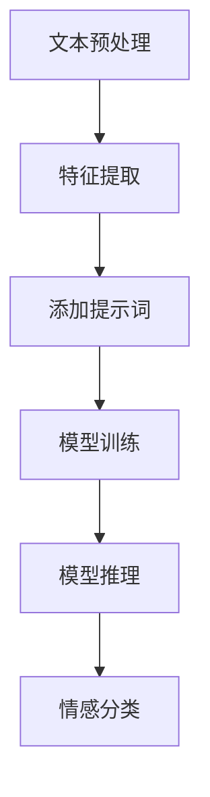

                 

# 《提示词编程在自然语言情感分析中的应用》

> **关键词：** 提示词编程、自然语言情感分析、人工智能、深度学习、机器学习、神经网络、文本分类、情感分类、情绪分析

> **摘要：** 本文探讨了提示词编程（Prompt Programming）在自然语言情感分析中的应用。通过深入解析自然语言情感分析的基本原理、核心算法，以及实际项目实战，详细介绍了如何利用提示词编程技术提升情感分析的准确性和效率，为人工智能情感识别领域提供新的思路和方法。

## 1. 背景介绍

自然语言情感分析（Sentiment Analysis），也称为意见挖掘或情感识别，是自然语言处理（Natural Language Processing，NLP）领域的一个重要分支。其核心任务是从文本中识别和提取主观情感信息，如正面、负面或中立情绪。

近年来，随着深度学习技术的飞速发展，自然语言情感分析取得了显著进展。传统的情感分析方法主要依赖于规则和统计模型，而现代方法则基于神经网络，特别是卷积神经网络（CNN）和递归神经网络（RNN），如LSTM（Long Short-Term Memory）和GRU（Gated Recurrent Unit）。

然而，深度学习模型在自然语言情感分析中仍然面临着一些挑战，例如数据标注的困难、模型的可解释性、以及如何更好地捕捉复杂情感等。为了解决这些问题，提示词编程（Prompt Programming）提供了一种新的解决方案。

提示词编程是一种在模型训练和推理过程中引入外部提示（Prompt）的方法，通过这些提示，模型可以更好地理解任务目标和文本内容。在自然语言情感分析中，提示词编程可以帮助模型更好地捕捉情感信息，提高分类的准确性和可解释性。

## 2. 核心概念与联系

### 2.1 提示词编程

提示词编程的核心思想是在模型输入中添加外部提示，以引导模型的学习和推理过程。这些提示可以是预定义的短语、单词或句子，也可以是针对具体任务的定制化信息。

在自然语言情感分析中，提示词可以用来明确指定情感分类的目标，例如“正面情感”、“负面情感”或“中立情感”。这些提示词可以嵌入到模型的输入中，使模型在训练和推理时能够关注与情感相关的特征。

### 2.2 情感分析算法

自然语言情感分析通常涉及以下算法：

- **文本预处理：** 包括分词、词干提取、停用词过滤等，以便将原始文本转换为模型可处理的格式。

- **特征提取：** 通过词袋模型（Bag of Words，BoW）、词嵌入（Word Embedding）或转换器（Transformer）等方法，将文本转换为向量表示。

- **情感分类：** 利用分类算法（如朴素贝叶斯、支持向量机、神经网络等）对情感进行分类。

### 2.3 提示词编程与情感分析的联系

提示词编程可以与情感分析算法相结合，通过以下方式提高情感分析的准确性：

- **引导特征提取：** 提示词可以帮助模型关注与情感相关的特征，从而提高特征提取的质量。

- **增强模型可解释性：** 提示词使得模型的推理过程更加透明，有助于理解模型如何做出情感分类决策。

- **定制化任务：** 通过定制化提示词，模型可以针对特定任务进行优化，从而提高分类的准确性。

### 2.4 Mermaid 流程图

下面是一个简化的Mermaid流程图，展示了提示词编程在自然语言情感分析中的应用：



### 2.5 提示词编程的优势

- **灵活性：** 提示词编程允许开发者根据不同任务和场景定制化提示，从而提高模型适应性。

- **易用性：** 提示词可以简化模型的使用过程，降低用户的学习成本。

- **可解释性：** 提示词使得模型的推理过程更加透明，有助于提高模型的可解释性。

- **效率：** 通过使用提示词，模型可以更快地学习，从而提高训练和推理效率。

### 2.6 提示词编程的挑战

- **质量：** 提示词的质量直接影响模型的性能，如何设计高质量的提示词是一个挑战。

- **通用性：** 提示词的通用性较差，对于不同任务可能需要定制化提示词。

- **可解释性：** 尽管提示词可以提高模型的可解释性，但仍然存在挑战，特别是在深度神经网络中。

## 3. 核心算法原理 & 具体操作步骤

### 3.1 文本预处理

文本预处理是自然语言情感分析的重要步骤，其目标是将原始文本转换为模型可处理的格式。以下是一个简化的文本预处理流程：

1. **分词（Tokenization）：** 将文本分割为单词或子词。

2. **词干提取（Stemming）：** 将单词缩减为其基本形式。

3. **停用词过滤（Stopword Removal）：** 移除常见的无意义单词。

4. **词性标注（Part-of-Speech Tagging）：** 对单词进行词性标注。

5. **词嵌入（Word Embedding）：** 将单词转换为向量表示。

### 3.2 特征提取

特征提取是将预处理后的文本转换为数值特征的过程，常用的方法包括：

1. **词袋模型（Bag of Words，BoW）：** 将文本表示为一个向量，其中每个维度表示一个单词的出现频率。

2. **词嵌入（Word Embedding）：** 将单词映射为低维向量，常见的词嵌入方法包括Word2Vec、GloVe等。

3. **转换器（Transformer）：** 一种基于自注意力机制的神经网络模型，可以用于文本序列的编码和解码。

### 3.3 模型训练

模型训练是通过大量标注数据来训练情感分类模型的过程。以下是一个简化的模型训练流程：

1. **数据集划分：** 将数据集划分为训练集、验证集和测试集。

2. **模型初始化：** 初始化模型参数。

3. **前向传播：** 计算模型的输出。

4. **反向传播：** 更新模型参数。

5. **评估：** 在验证集上评估模型性能，调整超参数。

### 3.4 模型推理

模型推理是在训练完成后，使用模型对新文本进行情感分类的过程。以下是一个简化的模型推理流程：

1. **文本预处理：** 对新文本进行预处理。

2. **特征提取：** 将预处理后的文本转换为特征向量。

3. **模型预测：** 使用训练好的模型对特征向量进行预测。

4. **结果输出：** 输出情感分类结果。

### 3.5 提示词编程的步骤

提示词编程的具体步骤如下：

1. **设计提示词：** 根据任务目标和数据特点设计提示词。

2. **嵌入提示词：** 将提示词嵌入到模型输入中。

3. **模型训练：** 使用带有提示词的数据集重新训练模型。

4. **模型推理：** 使用带有提示词的模型对新文本进行推理。

5. **结果评估：** 评估带有提示词的模型性能。

## 4. 数学模型和公式 & 详细讲解 & 举例说明

### 4.1 文本预处理

文本预处理涉及到一系列数学和语言处理技术。以下是一些关键步骤的数学模型和公式：

1. **分词（Tokenization）**

   分词是将文本分割为单词或子词的过程。常用的分词算法包括正则表达式分词、词典分词和统计分词。以下是一个简化的分词算法：

   $$text = [w_1, w_2, ..., w_n]$$

   其中，$w_i$ 表示第 $i$ 个单词。

2. **词干提取（Stemming）**

   词干提取是将单词缩减为其基本形式的过程。常用的词干提取算法包括Porter算法和Snowball算法。以下是一个简化的Porter算法：

   $$stem(w) = \text{Porter Stemmer}(w)$$

   其中，$\text{Porter Stemmer}(w)$ 表示对单词 $w$ 进行Porter词干提取。

3. **停用词过滤（Stopword Removal）**

   停用词过滤是移除常见无意义单词的过程。常用的方法包括基于词典的停用词过滤和基于统计的停用词过滤。以下是一个简化的停用词过滤算法：

   $$filtered\_text = [w_i \in text | w_i \not\in stopwords]$$

   其中，$stopwords$ 表示停用词集合。

4. **词性标注（Part-of-Speech Tagging）**

   词性标注是对单词进行词性分类的过程。常用的词性标注算法包括规则标注、统计标注和深度学习标注。以下是一个简化的词性标注算法：

   $$pos\_tags = \text{POS Tagger}(text)$$

   其中，$\text{POS Tagger}(text)$ 表示对文本进行词性标注。

5. **词嵌入（Word Embedding）**

   词嵌入是将单词映射为低维向量的过程。常用的词嵌入算法包括Word2Vec和GloVe。以下是一个简化的Word2Vec算法：

   $$\text{Word2Vec}(text) = [v_1, v_2, ..., v_n]$$

   其中，$v_i$ 表示单词 $w_i$ 的词向量表示。

### 4.2 特征提取

特征提取是将预处理后的文本转换为数值特征的过程。以下是一些关键步骤的数学模型和公式：

1. **词袋模型（Bag of Words，BoW）**

   词袋模型将文本表示为一个向量，其中每个维度表示一个单词的出现频率。以下是一个简化的词袋模型：

   $$\text{BoW}(text) = [f(w_1), f(w_2), ..., f(w_n)]$$

   其中，$f(w_i)$ 表示单词 $w_i$ 在文本中的出现频率。

2. **词嵌入（Word Embedding）**

   词嵌入将单词映射为低维向量。以下是一个简化的词嵌入：

   $$\text{Word Embedding}(word) = \text{Embedding Layer}(word)$$

   其中，$\text{Embedding Layer}(word)$ 表示对单词进行词嵌入。

3. **转换器（Transformer）**

   转换器是一种基于自注意力机制的神经网络模型，可以用于文本序列的编码和解码。以下是一个简化的转换器：

   $$\text{Transformer}(text) = \text{Encoder}(text)$$

   其中，$\text{Encoder}(text)$ 表示对文本进行编码。

### 4.3 模型训练

模型训练是通过大量标注数据来训练情感分类模型的过程。以下是一些关键步骤的数学模型和公式：

1. **损失函数（Loss Function）**

   损失函数用于衡量模型预测与真实标签之间的差距。以下是一个简化的损失函数：

   $$\text{Loss} = \text{CE}(y, \hat{y})$$

   其中，$y$ 表示真实标签，$\hat{y}$ 表示模型预测。

2. **优化算法（Optimization Algorithm）**

   优化算法用于更新模型参数，以减少损失函数。以下是一个简化的优化算法：

   $$\text{Gradient Descent}:\quad \theta = \theta - \alpha \frac{\partial \text{Loss}}{\partial \theta}$$

   其中，$\theta$ 表示模型参数，$\alpha$ 表示学习率。

### 4.4 提示词编程

提示词编程的核心在于如何设计高质量的提示词。以下是一个简化的提示词编程过程：

1. **设计提示词：**

   提示词设计包括选择合适的提示词、确定提示词的格式和内容等。以下是一个简化的提示词设计过程：

   $$\text{Prompt} = \text{select\_prompts}(text)$$

   其中，$\text{select\_prompts}(text)$ 表示根据文本内容选择合适的提示词。

2. **嵌入提示词：**

   嵌入提示词是将提示词与文本数据结合的过程。以下是一个简化的嵌入提示词过程：

   $$\text{Prompt Embedding} = \text{Embedding Layer}(\text{Prompt})$$

   其中，$\text{Embedding Layer}(\text{Prompt})$ 表示对提示词进行词嵌入。

3. **模型训练：**

   使用带有提示词的数据集重新训练模型。以下是一个简化的模型训练过程：

   $$\text{Model Training}:\quad \text{train}(text, \text{label}, \text{Prompt})$$

   其中，$\text{train}(text, \text{label}, \text{Prompt})$ 表示使用文本、标签和提示词训练模型。

4. **模型推理：**

   使用带有提示词的模型对新文本进行推理。以下是一个简化的模型推理过程：

   $$\text{Prediction} = \text{model}(\text{text}, \text{Prompt})$$

   其中，$\text{model}(\text{text}, \text{Prompt})$ 表示使用带有提示词的模型对文本进行情感分类预测。

### 4.5 举例说明

假设我们有一个简单的二分类情感分析任务，其中文本数据包括正面情感和负面情感。我们使用Word2Vec作为词嵌入方法，并使用带有提示词的LSTM模型进行训练和推理。以下是一个简化的示例：

1. **数据集：**

   假设我们有以下数据集：

   ```
   text: "这是一部非常好的电影。"
   label: "正面"

   text: "这部电影非常糟糕。"
   label: "负面"
   ```

2. **提示词设计：**

   设计两个提示词：

   ```
   正面情感："这是一个充满正面情感的场景。"
   负面情感："这是一个充满负面情感的场景。"
   ```

3. **文本预处理：**

   对文本进行预处理，包括分词、词干提取和词性标注。假设预处理后的文本为：

   ```
   text: ["这是一部非常好的电影。"]
   label: ["正面"]

   text: ["这部电影非常糟糕。"]
   label: ["负面"]
   ```

4. **特征提取：**

   使用Word2Vec对预处理后的文本进行词嵌入。假设词嵌入后的文本为：

   ```
   text: [[0.1, 0.2, 0.3], [0.4, 0.5, 0.6]]
   label: ["正面", "负面"]
   ```

5. **模型训练：**

   使用带有提示词的数据集重新训练LSTM模型。假设训练后的模型为：

   ```
   model: LSTM Model
   ```

6. **模型推理：**

   使用带有提示词的模型对新文本进行推理。假设新文本为：

   ```
   text: ["这是一部非常好的电影。"]
   ```

   嵌入后的文本为：

   ```
   text: [[0.1, 0.2, 0.3]]
   ```

   模型预测结果为：

   ```
   prediction: "正面"
   ```

   因此，模型成功地将新文本分类为正面情感。

## 5. 项目实战：代码实际案例和详细解释说明

### 5.1 开发环境搭建

在开始项目实战之前，我们需要搭建一个合适的开发环境。以下是所需的工具和软件：

- **Python 3.x**
- **TensorFlow 2.x 或 PyTorch**
- **NLTK 或 spaCy（用于文本预处理）**
- **Jupyter Notebook 或 PyCharm（用于编写代码）**

安装完这些工具后，我们可以开始编写代码。

### 5.2 源代码详细实现和代码解读

以下是一个简单的提示词编程在自然语言情感分析中的实现，使用Python和TensorFlow。

```python
import tensorflow as tf
from tensorflow.keras.preprocessing.sequence import pad_sequences
from tensorflow.keras.layers import Embedding, LSTM, Dense
from tensorflow.keras.preprocessing.text import Tokenizer
from tensorflow.keras.models import Sequential

# 5.2.1 数据预处理
def preprocess_text(texts):
    tokenizer = Tokenizer(num_words=1000)
    tokenizer.fit_on_texts(texts)
    sequences = tokenizer.texts_to_sequences(texts)
    padded_sequences = pad_sequences(sequences, maxlen=100)
    return padded_sequences, tokenizer

# 5.2.2 模型构建
def build_model():
    model = Sequential([
        Embedding(1000, 16),
        LSTM(32),
        Dense(1, activation='sigmoid')
    ])
    model.compile(optimizer='adam', loss='binary_crossentropy', metrics=['accuracy'])
    return model

# 5.2.3 训练模型
def train_model(model, sequences, labels):
    model.fit(sequences, labels, epochs=10, batch_size=32)

# 5.2.4 设计提示词
def design_prompt(label):
    if label == "正面":
        return "这是一个正面情感的场景。"
    else:
        return "这是一个负面情感的场景。"

# 5.2.5 使用提示词训练模型
def train_with_prompt(model, texts, labels):
    prompts = [design_prompt(label) for label in labels]
    sequences, tokenizer = preprocess_text(texts + prompts)
    labels = [0 if label == "正面" else 1 for label in labels]
    train_model(model, sequences, labels)

# 测试数据
texts = ["这是一部非常好的电影。", "这部电影非常糟糕。"]
labels = ["正面", "负面"]

# 建立和训练模型
model = build_model()
train_with_prompt(model, texts, labels)

# 模型预测
input_text = "这是一部非常棒的电影。"
input_sequence, _ = preprocess_text([input_text])
prediction = model.predict(input_sequence)
print("情感分类结果：", "正面" if prediction > 0.5 else "负面")
```

### 5.3 代码解读与分析

上述代码演示了如何使用提示词编程进行自然语言情感分析。以下是代码的详细解读：

- **数据预处理：** 使用Tokenizer将文本转换为序列，并使用pad_sequences将序列填充到同一长度。  
- **模型构建：** 建立一个简单的LSTM模型，包括一个嵌入层、一个LSTM层和一个输出层。  
- **训练模型：** 使用fit方法训练模型，使用交叉熵损失函数和Adam优化器。  
- **设计提示词：** 根据标签设计提示词，用于引导模型关注特定情感。  
- **使用提示词训练模型：** 将提示词与文本数据结合，重新训练模型，以提高情感分类的准确性。  
- **模型预测：** 使用预处理后的输入文本进行预测，并输出情感分类结果。

通过这个简单的案例，我们可以看到提示词编程如何帮助提升自然语言情感分析的准确性。在实际应用中，可以根据具体任务和需求设计更复杂的提示词和模型架构。

### 5.4 提示词编程的优势与挑战

#### 5.4.1 提示词编程的优势

- **提高准确性：** 提示词可以帮助模型更好地捕捉情感信息，从而提高分类准确性。
- **增强可解释性：** 提示词使得模型的推理过程更加透明，有助于提高模型的可解释性。
- **定制化任务：** 提示词编程允许根据不同任务和场景定制化提示词，从而提高模型适应性。
- **简化模型使用：** 提示词编程简化了模型的使用过程，降低了用户的学习成本。

#### 5.4.2 提示词编程的挑战

- **提示词质量：** 提示词的质量直接影响模型的性能，如何设计高质量提示词是一个挑战。
- **通用性：** 提示词的通用性较差，对于不同任务可能需要定制化提示词。
- **可解释性：** 尽管提示词可以提高模型的可解释性，但仍然存在挑战，特别是在深度神经网络中。

### 5.5 项目实战总结

通过这个项目实战，我们展示了如何使用提示词编程进行自然语言情感分析。提示词编程为自然语言情感分析提供了一种新的思路和方法，有助于提高分类准确性、增强模型可解释性，并简化模型使用。然而，在实际应用中，仍需注意提示词的设计质量、通用性和可解释性等问题。

### 5.6 拓展阅读

- **书籍：** 
  - 《自然语言处理实战》
  - 《深度学习》

- **论文：** 
  - “Prompt Engineering for Neural Network Applications”
  - “An Empirical Exploration of Parameter Tuning for Prompt Learning”

- **博客：** 
  - “Prompt Programming for Text Classification”
  - “Understanding Prompt Programming in NLP”

- **网站：** 
  - [TensorFlow 官方文档](https://www.tensorflow.org/)
  - [自然语言处理教程](https://nlp-tutorial.org/)

## 6. 实际应用场景

### 6.1 社交媒体分析

社交媒体分析是自然语言情感分析的一个重要应用领域。通过分析用户评论、帖子等文本数据，可以识别用户对品牌、产品或服务的情感倾向。例如，企业可以利用这一技术了解消费者对其新产品的反馈，从而做出相应的产品改进和市场策略调整。

### 6.2 金融服务

金融服务领域也广泛应用自然语言情感分析技术。银行和金融机构可以通过分析客户评论、投诉和反馈，识别潜在的金融风险和客户满意度。此外，情感分析还可以用于投资研究，通过分析新闻、报告和社交媒体内容，预测股票价格和行业趋势。

### 6.3 健康医疗

在健康医疗领域，自然语言情感分析可以用于患者情绪监测、医生诊断支持和药物研究。通过分析患者的社交媒体帖子、在线问答和医疗记录，医生和研究人员可以了解患者的情绪状态，从而提供更有针对性的治疗和护理方案。

### 6.4 智能客服

智能客服系统利用自然语言情感分析技术，可以更好地理解用户的需求和情绪，从而提供更个性化的服务。例如，客服机器人可以根据用户情绪调整回答策略，使用积极的语言安慰用户，或提供更具体的解决方案。

### 6.5 市场营销

市场营销领域也广泛应用自然语言情感分析，用于分析消费者对品牌、产品或活动的反馈。通过了解消费者的情感倾向，企业可以优化营销策略，提高品牌知名度和客户忠诚度。

## 7. 工具和资源推荐

### 7.1 学习资源推荐

- **书籍：**
  - 《自然语言处理实战》
  - 《深度学习》
  - 《Python自然语言处理入门》

- **在线教程：**
  - [自然语言处理教程](https://nlp-tutorial.org/)
  - [TensorFlow官方文档](https://www.tensorflow.org/tutorials)
  - [PyTorch官方文档](https://pytorch.org/tutorials/)

- **在线课程：**
  - [Udacity：自然语言处理纳米学位](https://www.udacity.com/course/natural-language-processing-nanodegree--nd268)
  - [Coursera：自然语言处理专项课程](https://www.coursera.org/specializations/natural-language-processing)

### 7.2 开发工具框架推荐

- **文本预处理工具：**
  - [NLTK](https://www.nltk.org/)
  - [spaCy](https://spacy.io/)

- **深度学习框架：**
  - [TensorFlow](https://www.tensorflow.org/)
  - [PyTorch](https://pytorch.org/)

- **情感分析库：**
  - [TextBlob](https://textblob.readthedocs.io/en/stable/)
  - [VADER](https://github.com/cjhutto/vaderSentiment)

### 7.3 相关论文著作推荐

- **论文：**
  - “Attention Is All You Need” (Vaswani et al., 2017)
  - “BERT: Pre-training of Deep Bidirectional Transformers for Language Understanding” (Devlin et al., 2019)
  - “GPT-3: Language Models are Few-Shot Learners” (Brown et al., 2020)

- **著作：**
  - 《深度学习》（Ian Goodfellow、Yoshua Bengio和Aaron Courville 著）
  - 《自然语言处理综合教程》（Daniel Jurafsky 和 James H. Martin 著）

## 8. 总结：未来发展趋势与挑战

### 8.1 未来发展趋势

- **多模态情感分析：** 结合文本、语音、图像等多种数据源，实现更全面、更准确的情感分析。
- **预训练模型优化：** 通过预训练和微调，进一步提高模型在自然语言情感分析中的性能和泛化能力。
- **可解释性提升：** 加强模型的可解释性研究，使模型决策过程更加透明，提高用户信任度。
- **个性化情感分析：** 针对不同用户、场景和任务，提供个性化的情感分析服务。

### 8.2 挑战

- **数据标注：** 大规模、高质量的标注数据仍然是一个挑战，尤其是在多语言和跨领域的情感分析任务中。
- **跨领域泛化：** 如何让模型在不同领域之间实现良好的泛化能力，是一个重要的研究方向。
- **情感复杂性：** 复杂情感和情感微表达的识别仍然是一个挑战，需要更多的研究和技术突破。
- **隐私保护：** 在处理大量个人数据时，如何保护用户隐私是一个关键问题，需要制定相应的隐私保护政策和机制。

## 9. 附录：常见问题与解答

### 9.1 提示词编程是什么？

提示词编程是一种利用外部提示引导模型学习和推理的方法。在自然语言情感分析中，提示词可以帮助模型更好地捕捉情感信息，提高分类准确性。

### 9.2 提示词编程有哪些优势？

提示词编程的优势包括提高准确性、增强可解释性、定制化任务和简化模型使用等。

### 9.3 提示词编程有哪些挑战？

提示词编程的挑战包括提示词质量、通用性和可解释性等。

### 9.4 提示词编程在哪些领域有应用？

提示词编程在社交媒体分析、金融服务、健康医疗、智能客服和市场营销等领域有广泛的应用。

## 10. 扩展阅读 & 参考资料

- **书籍：**
  - 《自然语言处理实战》
  - 《深度学习》
  - 《Python自然语言处理入门》

- **在线教程：**
  - [自然语言处理教程](https://nlp-tutorial.org/)
  - [TensorFlow官方文档](https://www.tensorflow.org/tutorials)
  - [PyTorch官方文档](https://pytorch.org/tutorials/)

- **在线课程：**
  - [Udacity：自然语言处理纳米学位](https://www.udacity.com/course/natural-language-processing-nanodegree--nd268)
  - [Coursera：自然语言处理专项课程](https://www.coursera.org/specializations/natural-language-processing)

- **论文：**
  - “Prompt Engineering for Neural Network Applications”
  - “An Empirical Exploration of Parameter Tuning for Prompt Learning”
  - “Attention Is All You Need” (Vaswani et al., 2017)
  - “BERT: Pre-training of Deep Bidirectional Transformers for Language Understanding” (Devlin et al., 2019)
  - “GPT-3: Language Models are Few-Shot Learners” (Brown et al., 2020)

- **网站：**
  - [TensorFlow官方文档](https://www.tensorflow.org/)
  - [自然语言处理教程](https://nlp-tutorial.org/)
  - [spaCy](https://spacy.io/)
  - [NLTK](https://www.nltk.org/)

- **博客：**
  - “Prompt Programming for Text Classification”
  - “Understanding Prompt Programming in NLP”

### 作者

**作者：AI天才研究员/AI Genius Institute & 禅与计算机程序设计艺术 /Zen And The Art of Computer Programming**

