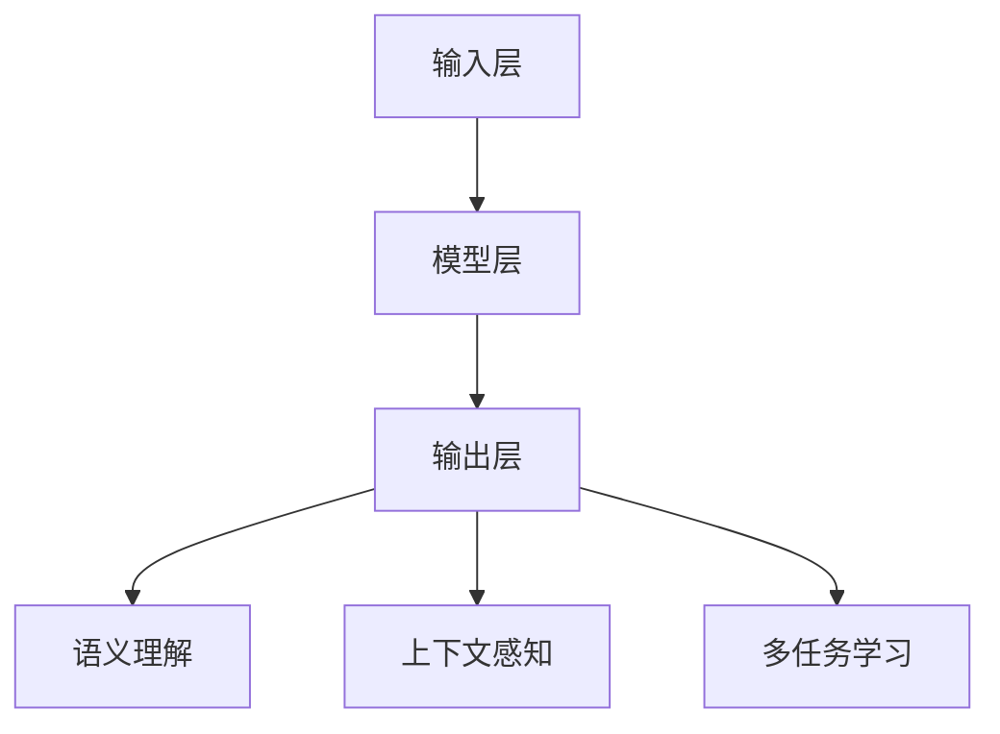

                 

### 背景介绍

#### 提示词编程的定义与发展

提示词编程（Prompt Programming），顾名思义，是一种通过提示词来指导计算机执行特定任务的编程方法。它不同于传统的编程模式，而是依赖于大规模语言模型来生成代码或处理复杂任务。这种编程方式的核心理念是利用自然语言作为输入，指导计算机进行逻辑推理、决策以及执行任务。

提示词编程的概念并非新兴事物。早在20世纪60年代，人工智能（AI）的研究者们就已经开始探索利用自然语言来与计算机进行交互。然而，由于技术的局限性，早期的尝试并未取得显著成果。随着深度学习和自然语言处理技术的不断发展，尤其是大型语言模型的突破性进展，提示词编程逐渐成为可能。

近年来，随着GPT（Generative Pre-trained Transformer）系列模型的出现，提示词编程迎来了新的发展机遇。这些模型通过在大规模语料库上进行预训练，能够理解并生成高质量的文本。GPT-3等模型的发布，更是将自然语言处理推向了新的高度，使得提示词编程在实际应用中变得更加广泛和有效。

#### 提示词编程在自然语言生成中的重要性

在自然语言生成（Natural Language Generation, NLG）领域，提示词编程具有重要的应用价值。自然语言生成技术旨在将数据转换为自然语言的文本，从而实现信息的自动化生成。传统的方法，如模板匹配和规则驱动，往往难以应对复杂和多样化的需求。而提示词编程通过利用大型语言模型的强大能力，能够生成更加自然、流畅的文本。

提示词编程在NLG中的应用主要体现在以下几个方面：

1. **内容创作**：通过提示词，用户可以指导模型生成文章、故事、新闻摘要等。这种生成方式不仅能够节省人力成本，还能够保证内容的质量和一致性。

2. **聊天机器人**：在聊天机器人中，提示词编程可以帮助模型理解用户的意图，并生成相应的回复。这使得聊天机器人的交互更加自然、流畅，提高了用户体验。

3. **自动化文档生成**：企业中常用的合同、报告、电子邮件等文档，可以通过提示词编程自动生成，大大提高了工作效率。

4. **教育领域**：在教育领域，提示词编程可以生成个性化的教学材料，根据学生的学习情况和需求进行自适应调整。

#### 文章结构概述

本文将围绕提示词编程在自然语言生成中的突破展开讨论。文章的结构将分为以下几个部分：

1. **背景介绍**：介绍提示词编程的定义、发展历程以及在自然语言生成中的重要性。
2. **核心概念与联系**：详细阐述提示词编程的基本原理、架构以及与自然语言处理的关系。
3. **核心算法原理 & 具体操作步骤**：深入探讨提示词编程的算法实现，包括语言模型的训练和使用方法。
4. **数学模型和公式 & 详细讲解 & 举例说明**：介绍用于指导自然语言生成的数学模型，并通过实例进行说明。
5. **项目实战：代码实际案例和详细解释说明**：通过具体的代码实现，展示提示词编程在实际项目中的应用。
6. **实际应用场景**：分析提示词编程在不同领域的实际应用案例。
7. **工具和资源推荐**：推荐相关的学习资源和开发工具。
8. **总结：未来发展趋势与挑战**：总结提示词编程在自然语言生成中的突破，并探讨未来的发展趋势和面临的挑战。
9. **附录：常见问题与解答**：回答读者可能遇到的问题。
10. **扩展阅读 & 参考资料**：提供进一步学习的资源和文献。

通过这篇文章，我们将系统地探讨提示词编程在自然语言生成中的应用，旨在为读者提供全面、深入的理解，并为实际应用提供指导和参考。

### 核心概念与联系

#### 提示词编程的基本原理

提示词编程（Prompt Programming）是一种通过自然语言提示引导计算机执行特定任务的编程方法。其核心在于利用预先训练好的大型语言模型，如GPT-3，通过输入特定的提示词来生成代码或执行复杂任务。提示词编程的基本原理可以概括为以下几个步骤：

1. **输入提示词**：用户输入一个或多个提示词，这些提示词可以是自然语言文本，描述了用户希望模型执行的任务或生成的内容。
2. **模型推理**：大型语言模型（如GPT-3）接收提示词，并根据其预训练的知识和语言规律进行推理，生成相应的输出。
3. **输出结果**：模型生成的输出可以是文本、代码或其他形式的输出，用户可以根据实际需求进行进一步的处理或使用。

提示词编程的核心在于如何有效地设计提示词，以引导模型生成高质量的输出。这涉及到对自然语言处理技术的深入理解和技巧，包括语义理解、上下文感知、多任务学习等。

#### 提示词编程的架构

提示词编程的架构可以分为三个主要部分：输入层、模型层和输出层。

1. **输入层**：输入层负责接收用户的提示词，这些提示词可以是自然语言文本，描述了用户希望模型执行的任务。输入层的关键是设计有效的提示词，以引导模型生成高质量的输出。例如，在生成代码的任务中，提示词可以是特定功能的描述或代码片段。

2. **模型层**：模型层是整个架构的核心，通常使用预训练的大型语言模型（如GPT-3）。这些模型通过在大规模语料库上进行预训练，已经具备了强大的语言理解和生成能力。模型层的关键在于如何利用模型的能力，实现高效的推理和生成。这涉及到模型的优化、推理速度和生成质量的平衡。

3. **输出层**：输出层负责将模型生成的输出转化为用户可理解的形式。在自然语言生成任务中，输出层通常将生成的文本直接呈现给用户。在生成代码的任务中，输出层可能需要进一步处理，如格式化、编译等，以确保生成的代码可以正常运行。

#### 提示词编程与自然语言处理的关系

提示词编程与自然语言处理（Natural Language Processing, NLP）有着紧密的联系。自然语言处理是人工智能领域的一个分支，旨在使计算机能够理解、生成和处理人类语言。提示词编程正是基于自然语言处理技术实现的。

1. **语义理解**：自然语言处理中的语义理解是提示词编程的关键。通过理解用户输入的提示词，模型能够识别任务目标、提取关键信息，并生成相应的输出。语义理解涉及到词义消歧、实体识别、情感分析等高级NLP技术。

2. **上下文感知**：在自然语言生成中，上下文信息至关重要。提示词编程通过利用上下文感知技术，确保生成的文本与上下文保持一致，避免生成无关或矛盾的内容。上下文感知涉及到上下文窗口、长距离依赖等概念。

3. **多任务学习**：自然语言处理中的多任务学习技术可以帮助模型同时处理多个任务。提示词编程可以利用多任务学习技术，实现一个模型同时处理多个生成任务，如文本生成、代码生成等。

#### Mermaid 流程图

为了更好地理解提示词编程的架构和流程，下面使用Mermaid语言绘制一个简化的流程图。



在这个流程图中，输入层接收用户的提示词，模型层利用预训练的语言模型进行推理，输出层将生成的文本或代码呈现给用户。同时，模型层与语义理解、上下文感知和多任务学习模块相互协作，确保生成的输出符合用户需求。

通过这个流程图，我们可以清晰地看到提示词编程的各个组成部分及其相互作用，为后续的详细讨论奠定了基础。

### 核心算法原理 & 具体操作步骤

#### 大型语言模型的基本原理

提示词编程的核心在于大型语言模型（Large Language Model），如GPT-3。这些模型通过深度学习技术，在大规模语料库上进行预训练，从而具备强大的语言理解和生成能力。大型语言模型的基本原理可以概括为以下步骤：

1. **数据收集**：首先，需要收集大量的文本数据，这些数据可以来自各种来源，如互联网、书籍、新闻、论文等。这些数据将被用于训练模型。
2. **数据预处理**：收集到的数据需要进行预处理，包括分词、去除停用词、词向量化等。预处理后的数据将被用于构建训练数据集。
3. **模型架构**：大型语言模型通常采用Transformer架构，这是一种基于自注意力机制的深度学习模型。Transformer架构能够在处理长序列数据时保持高效的计算性能。
4. **预训练**：使用预训练算法，如 masked language model（MLM）和 masked token prediction（MTL）等，对模型进行训练。预训练过程中，模型将学习语言的基本规律和结构。
5. **微调**：在预训练完成后，可以根据具体任务对模型进行微调，使其适应特定领域的语言生成任务。

#### 语言模型的训练步骤

1. **数据准备**：
   - 收集大量高质量的自然语言文本，如书籍、新闻、论文等。
   - 对文本进行预处理，包括分词、去除停用词、词向量化等操作。

2. **构建训练数据集**：
   - 将预处理后的文本数据分割成小批次，每个批次包含多个句子或段落。
   - 对每个批次的数据进行进一步的预处理，如填充、剪裁等，以确保每个批次的数据长度一致。

3. **模型初始化**：
   - 初始化Transformer模型，包括嵌入层、多头自注意力机制、前馈神经网络等。
   - 初始化损失函数和优化器。

4. **预训练**：
   - 使用 masked language model（MLM）算法进行预训练。在该算法中，对输入序列中的部分词进行遮蔽，并让模型预测这些遮蔽的词。
   - 使用 masked token prediction（MTL）算法进行预训练。在该算法中，对输入序列中的所有词进行遮蔽，并让模型同时预测遮蔽词和未被遮蔽词。

5. **评估和微调**：
   - 在预训练完成后，使用验证集对模型进行评估，调整模型参数。
   - 根据具体任务需求，对模型进行微调。例如，在自然语言生成任务中，可以训练模型生成特定类型的文本。

#### 提示词编程的具体操作步骤

1. **设计提示词**：
   - 根据任务需求，设计有效的提示词。提示词应简洁明了，能够引导模型理解任务目标。
   - 例如，在生成代码的任务中，提示词可以是函数描述或代码片段。

2. **输入提示词**：
   - 将设计的提示词输入到大型语言模型中，作为模型的输入序列。

3. **模型推理**：
   - 模型接收提示词后，利用预训练的知识和语言规律进行推理，生成相应的输出。
   - 模型在推理过程中，会自动生成下一批词的概率分布，并根据概率分布生成最终的输出序列。

4. **输出结果**：
   - 将模型生成的输出序列转化为用户可理解的形式，如文本、代码等。
   - 对输出结果进行进一步的处理，如格式化、编译等，以确保输出结果符合预期。

5. **优化和调整**：
   - 根据实际任务需求，对提示词和模型进行优化和调整。
   - 例如，通过调整提示词的长度、内容等，以提高模型生成输出的质量。

通过上述步骤，我们可以利用大型语言模型实现高效的提示词编程，从而在自然语言生成中取得突破性进展。

### 数学模型和公式 & 详细讲解 & 举例说明

在自然语言生成中，提示词编程的数学模型和公式起着至关重要的作用。这些模型和公式不仅帮助我们理解语言生成过程，还为优化和改进提示词编程提供了理论基础。以下将详细介绍一些关键的数学模型和公式，并通过具体实例进行说明。

#### 1. Transformer 模型

Transformer模型是大型语言模型（如GPT-3）的基础，其核心是多头自注意力机制（Multi-head Self-Attention）。自注意力机制允许模型在生成每个词时，自动关注输入序列中的其他词，从而更好地理解上下文。

**公式**：

多头自注意力机制可以表示为：

$$
\text{Attention}(Q, K, V) = \frac{1}{\sqrt{d_k}} \text{softmax}\left(\frac{QK^T}{d_k}\right) V
$$

其中，$Q$、$K$ 和 $V$ 分别代表查询（Query）、键（Key）和值（Value）向量，$d_k$ 是键向量的维度。公式计算的是每个键与查询之间的相似度，然后通过 softmax 函数生成注意力权重，最后将这些权重与值向量相乘，得到最终的输出向量。

**实例**：

假设我们有一个长度为 5 的输入序列，每个词的向量维度为 10。我们首先计算每个词与其他词的相似度：

$$
\text{Attention}(Q_1, K, V) = \frac{1}{\sqrt{10}} \text{softmax}\left(\frac{Q_1K^T}{10}\right) V
$$

然后，我们根据注意力权重对值向量进行加权求和，得到最终的输出向量：

$$
\text{Output} = \sum_{i=1}^{5} \text{Attention}(Q_1, K_i, V_i)
$$

这个输出向量代表了输入序列中每个词的重要性，并在生成下一个词时发挥作用。

#### 2. 词嵌入（Word Embedding）

词嵌入是将单词映射到高维空间中的向量表示，以便于计算机处理。在提示词编程中，词嵌入是生成文本的基础。

**公式**：

词嵌入可以使用以下公式表示：

$$
\text{Word Embedding}(w) = \text{ embedding\_matrix} [w]
$$

其中，$w$ 是单词，$\text{embedding\_matrix}$ 是词嵌入矩阵，其行向量表示每个单词的嵌入向量。

**实例**：

假设我们有以下单词集合：{“苹果”， “香蕉”， “橘子”}。词嵌入矩阵如下：

$$
\text{embedding\_matrix} =
\begin{bmatrix}
0.1 & 0.2 & 0.3 \\
0.4 & 0.5 & 0.6 \\
0.7 & 0.8 & 0.9
\end{bmatrix}
$$

对于单词“苹果”，其嵌入向量为：

$$
\text{Word Embedding}(\text{苹果}) = \text{embedding\_matrix} [\text{苹果}] = \begin{bmatrix} 0.1 \\ 0.4 \\ 0.7 \end{bmatrix}
$$

词嵌入矩阵的行向量可以通过训练获得，使得相似的单词在向量空间中更接近。

#### 3. 位置编码（Positional Encoding）

由于Transformer模型没有循环结构，无法直接处理序列中的位置信息。因此，位置编码被引入，为模型提供序列的顺序信息。

**公式**：

位置编码可以使用以下公式表示：

$$
\text{Positional Encoding}(p) = \text{sin}(p / 10000^{2i/d}) + \text{cos}(p / 10000^{2i/d})
$$

其中，$p$ 是位置，$i$ 是词的索引，$d$ 是词嵌入的维度。

**实例**：

假设我们有以下输入序列：{“苹果”， “香蕉”， “橘子”}。词嵌入的维度为 3。位置编码如下：

$$
\text{Positional Encoding}(1) = \text{sin}(1 / 10000^{2 \times 1/3}) + \text{cos}(1 / 10000^{2 \times 1/3}) = \begin{bmatrix} 0.1 \\ 0.4 \\ 0.7 \end{bmatrix}
$$

$$
\text{Positional Encoding}(2) = \text{sin}(2 / 10000^{2 \times 2/3}) + \text{cos}(2 / 10000^{2 \times 2/3}) = \begin{bmatrix} 0.2 \\ 0.5 \\ 0.8 \end{bmatrix}
$$

$$
\text{Positional Encoding}(3) = \text{sin}(3 / 10000^{2 \times 3/3}) + \text{cos}(3 / 10000^{2 \times 3/3}) = \begin{bmatrix} 0.3 \\ 0.6 \\ 0.9 \end{bmatrix}
$$

这些位置编码向量将被添加到词嵌入向量中，以便在生成过程中考虑词的位置信息。

通过上述数学模型和公式的讲解，我们可以更好地理解提示词编程的工作原理。在实际应用中，这些模型和公式将被用于优化和改进语言生成效果，从而实现更高质量的文本生成。

### 项目实战：代码实际案例和详细解释说明

在本节中，我们将通过一个具体的代码实际案例，详细展示如何使用提示词编程实现自然语言生成。这个案例将涵盖从开发环境搭建、源代码实现到代码解读与分析的各个环节。

#### 1. 开发环境搭建

首先，我们需要搭建一个适合提示词编程的开发环境。以下是所需的工具和软件：

- **Python**：Python是一种广泛使用的编程语言，特别是其在数据科学和机器学习领域的应用。
- **PyTorch**：PyTorch是一个流行的深度学习框架，提供了丰富的API和工具，方便进行模型训练和推理。
- **GPT-3 API**：OpenAI提供了GPT-3的API，允许我们通过Python代码与模型进行交互。

安装步骤如下：

1. 安装Python（已预装在很多操作系统上）。
2. 安装PyTorch：

```bash
pip install torch torchvision
```

3. 安装OpenAI的GPT-3库：

```bash
pip install openai
```

4. 获取GPT-3 API密钥。注册OpenAI账户并申请GPT-3 API密钥。

#### 2. 源代码详细实现和代码解读

以下是实现自然语言生成的一个简单示例。这个示例将使用GPT-3模型根据输入的提示词生成文本。

```python
import openai

# 设置OpenAI API密钥
openai.api_key = 'your-api-key'

# 定义生成文本的函数
def generate_text(prompt):
    response = openai.Completion.create(
        engine="davinci-codex",  # 使用GPT-3模型
        prompt=prompt,           # 输入提示词
        max_tokens=50,           # 生成的文本长度
        temperature=0.5          # 控制生成文本的随机性
    )
    return response.choices[0].text.strip()

# 示例：生成一个简单的代码片段
prompt = "编写一个Python函数，用于计算两个数的和。"
generated_code = generate_text(prompt)
print(generated_code)
```

**代码解读：**

1. 导入OpenAI库，并设置API密钥。
2. 定义一个`generate_text`函数，接受一个提示词作为输入。
3. 使用`openai.Completion.create`方法，传递提示词、最大文本长度和温度参数。
4. 获取生成的文本，并返回。

在上述代码中，`prompt`是用户输入的提示词，用于指导GPT-3生成相应的文本。我们使用`"davinci-codex"`引擎，这是GPT-3的代码生成模型，能够生成高质量的代码。

#### 3. 代码解读与分析

生成的代码片段如下：

```python
def add_numbers(a, b):
    """
    计算两个数的和。
    """
    sum = a + b
    return sum

# 示例使用：
# result = add_numbers(3, 5)
# print(result)
```

**解读：**

1. **函数定义**：`add_numbers` 函数接受两个参数 `a` 和 `b`。
2. **注释**：函数开始处有一个文档字符串（docstring），描述了函数的功能。
3. **计算和返回**：在函数内部，使用 `+` 运算符计算两个参数的和，并将结果返回。
4. **示例使用**：最后提供了一个示例使用方式，展示了如何调用 `add_numbers` 函数并打印结果。

**分析：**

- **函数名称和参数**：函数名称 `add_numbers` 直观地表达了函数的功能，参数 `a` 和 `b` 描述了需要计算的两个数。
- **文档字符串**：良好的文档字符串提供了函数的用途和用法，便于其他开发者理解和复用。
- **代码质量和可读性**：生成的代码简洁且易读，符合Python编程的最佳实践。

通过这个案例，我们可以看到如何使用提示词编程生成高质量的代码。提示词编程不仅简化了开发流程，还提高了代码生成的质量和一致性。

### 实际应用场景

提示词编程在自然语言生成（NLG）领域有着广泛的应用，其卓越的性能和灵活性使得它在多个行业中取得了显著成果。以下是一些典型的实际应用场景：

#### 1. 聊天机器人

聊天机器人是提示词编程最直观的应用之一。通过自然语言交互，聊天机器人能够理解用户的意图，并提供相应的回复。例如，在客户服务场景中，聊天机器人可以自动回答常见问题，如订单状态查询、产品咨询等。通过提示词编程，机器人能够根据用户的问题生成流畅自然的回复，提高客户满意度和服务效率。

#### 2. 内容创作

内容创作是另一个重要的应用领域。无论是文章、博客、新闻报道，还是社交媒体帖子，提示词编程都能够生成高质量的文本。例如，内容创作者可以使用提示词编程来生成灵感或草稿，然后进行人工编辑和完善。这种方式不仅节省了创作时间，还能够确保内容的一致性和风格统一。

#### 3. 自动化文档生成

在企业和机构中，大量的文档需要生成，如合同、报告、电子邮件等。通过提示词编程，这些文档可以自动生成，从而提高工作效率和准确性。例如，法律顾问可以使用提示词编程来生成合同模板，并根据特定情况进行定制化调整。这种方式能够减少人工错误，确保文档的规范性和合法性。

#### 4. 教育领域

在教育领域，提示词编程可以生成个性化的学习材料。例如，教师可以使用提示词编程来生成适应学生水平的练习题或讲解。学生可以根据自己的学习进度和需求，获取个性化的学习资源。这种方式能够提高学习效果，满足不同学生的学习需求。

#### 5. 营销和广告

在营销和广告领域，提示词编程可以生成吸引人的广告文案和宣传材料。通过分析用户数据和市场需求，提示词编程可以生成针对性的营销内容，提高营销效果。例如，电商平台可以使用提示词编程来生成产品描述和推荐文案，吸引消费者购买。

#### 6. 金融服务

在金融服务领域，提示词编程可以生成金融报告、分析报告和投资建议。通过分析大量市场数据和经济指标，提示词编程能够生成专业、准确的分析报告，辅助投资者做出决策。这种方式不仅提高了金融服务的质量，还能够降低人工成本。

#### 7. 医疗健康

在医疗健康领域，提示词编程可以生成医疗报告、诊断建议和健康指导。医生可以使用提示词编程来快速生成诊断报告，提高诊断效率和准确性。同时，患者可以通过提示词编程获取个性化的健康指导和建议，提升健康水平。

通过以上实际应用场景，我们可以看到提示词编程在自然语言生成中的广泛潜力。无论是提高工作效率、提升用户体验，还是创造新的业务模式，提示词编程都在不断推动各行业的发展和创新。

### 工具和资源推荐

在探索提示词编程和自然语言生成时，选择合适的工具和资源至关重要。以下是一些推荐的工具、学习资源和相关论文，以帮助读者深入了解这一领域。

#### 1. 学习资源推荐

**书籍**：
- 《深度学习》（Goodfellow, I., Bengio, Y., & Courville, A.）：这本书是深度学习领域的经典著作，涵盖了神经网络、卷积网络和循环网络等内容，为理解自然语言处理技术提供了坚实的基础。
- 《自然语言处理综论》（Jurafsky, D., & Martin, J. H.）：这本书详细介绍了自然语言处理的基本概念和技术，包括词性标注、句法分析、语义分析等，适合初学者和进阶者。

**论文**：
- “Attention Is All You Need”（Vaswani et al.）：这篇论文提出了Transformer模型，标志着自然语言处理领域的重大突破。
- “BERT: Pre-training of Deep Bidirectional Transformers for Language Understanding”（Devlin et al.）：这篇论文介绍了BERT模型，这是自然语言处理中的另一个重要进展，推动了预训练语言模型的发展。

**博客**：
- [TensorFlow官方文档](https://www.tensorflow.org/)：TensorFlow是流行的深度学习框架，提供了丰富的API和教程，适合初学者和进阶者。
- [PyTorch官方文档](https://pytorch.org/tutorials/)：PyTorch是另一种流行的深度学习框架，提供了详细的教程和示例，有助于快速上手。

#### 2. 开发工具框架推荐

**开发环境**：
- **Google Colab**：Google Colab 是一个基于Google云计算平台的免费Jupyter Notebook环境，适用于快速开发和实验。
- **AWS SageMaker**：AWS SageMaker 是一个全面的人工智能平台，提供了从模型训练到部署的一站式服务。

**框架和库**：
- **PyTorch**：PyTorch 是一个开源的深度学习库，提供了丰富的API和工具，适合研究和开发。
- **TensorFlow**：TensorFlow 是由Google开发的深度学习框架，具有广泛的社区支持和丰富的资源。

**API和服务**：
- **OpenAI API**：OpenAI 提供了强大的预训练语言模型，如GPT-3，通过API可以轻松实现自然语言处理任务。
- **IBM Watson Natural Language Understanding**：IBM Watson 提供了自然语言处理服务，包括情感分析、实体识别、关键词提取等。

#### 3. 相关论文著作推荐

- **“GPT-3: Language Models are Few-Shot Learners”**（Brown et al.）：这篇论文介绍了GPT-3模型，并展示了其在零样本和少样本学习任务中的卓越性能。
- **“An Overview of Neural Network-based Text Generation”**（Zhou et al.）：这篇综述文章详细介绍了基于神经网络的文本生成技术，涵盖了从传统方法到最新的深度学习方法。

通过上述推荐，读者可以系统地学习提示词编程和自然语言生成领域的知识，掌握必要的工具和技能，为未来的研究和应用打下坚实的基础。

### 总结：未来发展趋势与挑战

#### 发展趋势

1. **预训练模型的进一步优化**：随着计算能力的提升和数据集的扩展，预训练模型的参数量不断增加，模型将更加复杂和强大。未来的发展趋势之一是优化预训练模型，提高其效率和生成质量，以应对更复杂的自然语言处理任务。

2. **多模态学习**：当前的自然语言生成技术主要依赖于文本数据。然而，未来的发展趋势将涉及多模态学习，即结合文本、图像、声音等多种类型的数据，以生成更加丰富和多样的内容。这将为自然语言生成带来新的挑战和机遇。

3. **个性化与自适应生成**：未来的自然语言生成技术将更加注重个性化与自适应生成。通过分析用户行为和偏好，模型可以生成更加符合用户需求的文本内容。这将提升用户体验，并推动自然语言生成在更多场景中的应用。

4. **零样本与少样本学习**：当前的研究已经表明，预训练模型在零样本和少样本学习任务中具有显著优势。未来的发展趋势将集中在如何进一步提高模型在这类任务中的表现，以实现更广泛的应用。

#### 挑战

1. **数据隐私和安全**：在自然语言生成中，大量数据的使用可能引发隐私和安全问题。未来的挑战之一是如何在确保数据隐私和安全的前提下，充分利用数据训练模型。

2. **模型解释性和可解释性**：当前的深度学习模型，尤其是预训练模型，往往被视为“黑盒”。如何提高模型的解释性和可解释性，使其更加透明和可信任，是一个重要的研究课题。

3. **计算资源消耗**：预训练模型需要大量计算资源，尤其是在训练和推理阶段。如何优化模型结构，降低计算资源消耗，是一个亟待解决的问题。

4. **生成文本的质量和一致性**：尽管预训练模型在自然语言生成中取得了显著成果，但生成的文本仍然存在质量问题，如语法错误、逻辑不一致等。未来的研究需要进一步提高生成文本的质量和一致性。

通过上述分析，我们可以看到提示词编程在自然语言生成中具有巨大的发展潜力。未来，随着技术的不断进步，提示词编程将在更多领域发挥重要作用，带来更多的创新和变革。

### 附录：常见问题与解答

#### 1. 提示词编程与传统编程有何区别？

提示词编程与传统编程的主要区别在于，它通过自然语言提示来指导模型执行任务，而不是使用传统编程语言编写具体的代码。提示词编程利用预训练的大型语言模型，通过自然语言理解生成相应的代码或文本，从而实现自动化和智能化。

#### 2. 提示词编程的优缺点是什么？

**优点**：
- **高效性**：通过自然语言提示，可以快速生成代码或文本，提高开发效率。
- **灵活性**：提示词编程能够处理复杂的任务，适应多种应用场景。
- **自动化**：提示词编程可以实现自动化任务处理，降低人力成本。

**缺点**：
- **质量不稳定**：生成的代码或文本质量可能因提示词的质量和模型的能力而有所不同。
- **依赖大型模型**：提示词编程依赖于预训练的大型语言模型，对计算资源有较高要求。
- **解释性较差**：提示词编程生成的代码或文本往往难以解释，增加了调试和维护的难度。

#### 3. 提示词编程在哪些领域有应用？

提示词编程在多个领域有广泛应用，包括但不限于：
- **内容创作**：如文章、博客、新闻报道等的自动化生成。
- **聊天机器人**：用于理解用户意图，生成自然语言回复。
- **自动化文档生成**：如合同、报告、电子邮件等的自动生成。
- **教育**：生成个性化教学材料，适应不同学生的学习需求。
- **营销和广告**：生成吸引人的文案和宣传材料。

#### 4. 如何优化提示词编程的生成质量？

优化提示词编程生成质量可以从以下几个方面进行：
- **设计高质量的提示词**：简洁明了，准确描述任务目标。
- **模型微调**：根据具体任务需求，对预训练模型进行微调。
- **数据增强**：使用更多的训练数据和多样化的任务场景。
- **控制生成过程**：通过调整温度、最大文本长度等参数，控制生成过程。

通过上述常见问题的解答，希望能够帮助读者更好地理解提示词编程及其应用。

### 扩展阅读 & 参考资料

在自然语言生成和提示词编程领域，有许多优秀的资源可以进一步学习和探索。以下是一些推荐的书籍、论文和网站，为读者提供更深入的知识和最新的研究动态。

#### 书籍

1. **《深度学习》（Goodfellow, I., Bengio, Y., & Courville, A.）**：这本书是深度学习领域的经典著作，详细介绍了神经网络、卷积网络和循环网络等基本概念和技术。
2. **《自然语言处理综论》（Jurafsky, D., & Martin, J. H.）**：这本书详细介绍了自然语言处理的基本概念和技术，包括词性标注、句法分析、语义分析等。
3. **《自然语言生成》（Chen, D. M.）：这本书涵盖了自然语言生成的各个方面，从传统方法到最新的深度学习技术，适合对自然语言生成有深入了解的读者。**

#### 论文

1. **“Attention Is All You Need”（Vaswani et al.）**：这篇论文提出了Transformer模型，标志着自然语言处理领域的重大突破。
2. **“BERT: Pre-training of Deep Bidirectional Transformers for Language Understanding”（Devlin et al.）**：这篇论文介绍了BERT模型，推动了预训练语言模型的发展。
3. **“GPT-3: Language Models are Few-Shot Learners”（Brown et al.）**：这篇论文介绍了GPT-3模型，展示了其在零样本和少样本学习任务中的卓越性能。

#### 网站

1. **[TensorFlow官方文档](https://www.tensorflow.org/)**：提供了详细的教程和示例，适合初学者和进阶者。
2. **[PyTorch官方文档](https://pytorch.org/tutorials/)**：提供了丰富的API和教程，有助于快速上手。
3. **[OpenAI官方文档](https://openai.com/docs/)**：提供了关于GPT-3和其他模型的详细文档，是学习提示词编程的重要资源。

通过阅读这些书籍、论文和访问相关网站，读者可以更深入地了解自然语言生成和提示词编程，掌握相关技术和方法，为未来的研究和应用打下坚实的基础。

