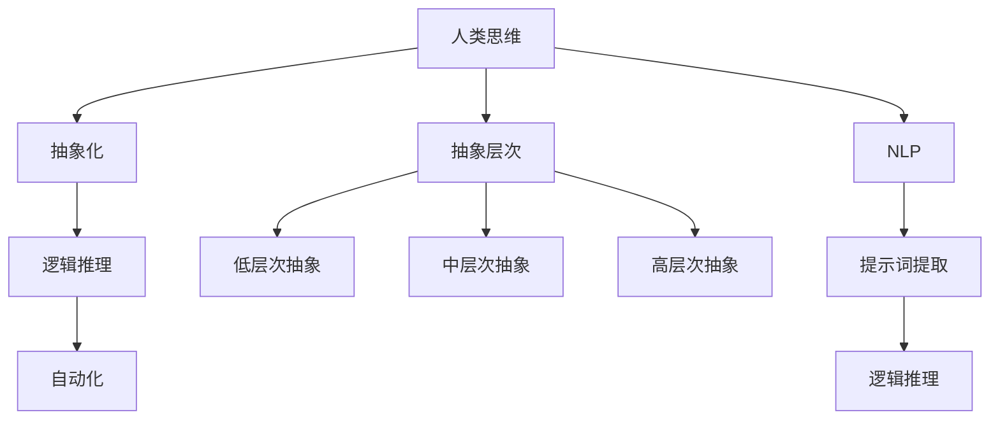

                 

# 提示词编程的设计哲学：从人类思维到AI理解

> **关键词：** 人类思维、AI理解、设计哲学、编程范式、抽象层次、逻辑推理、自然语言处理

> **摘要：** 本文探讨了提示词编程的设计哲学，从人类思维的逻辑推理和抽象能力出发，分析其在AI领域的应用。文章介绍了提示词编程的基本概念、核心原理、数学模型，并通过项目实战展示了其实际应用。同时，文章还探讨了提示词编程在实际应用场景中的挑战和未来发展趋势。

## 1. 背景介绍

### 1.1 人类思维的逻辑推理与抽象

人类思维的核心在于逻辑推理和抽象能力。从幼儿时期开始，我们便能够通过观察和推理理解世界。这种能力使人类能够从复杂的现实世界中提取出关键信息，形成抽象的概念和理论体系。例如，从众多具体的猫中抽象出“猫”这一概念，并基于此概念进行推理和判断。

### 1.2 AI理解与人类思维的差异

与人类思维相比，AI在理解世界方面存在显著差异。首先，AI缺乏人类的感性认识和情感体验，这使得其在处理复杂、模糊或不一致的信息时面临挑战。其次，AI通常依赖大量数据和规则进行训练，而人类则能够通过少量的示例和经验进行推理和判断。

### 1.3 提示词编程的概念

提示词编程是一种基于人类思维逻辑推理和抽象能力的编程范式。它通过提供关键信息（提示词）引导AI进行推理和决策，从而实现对复杂问题的求解。提示词编程的核心思想是将人类思维中的逻辑推理和抽象能力转化为可操作的计算过程。

## 2. 核心概念与联系

### 2.1 提示词编程的基本原理

提示词编程的基本原理可以概括为以下三个方面：

1. **抽象化**：将复杂问题抽象为简单的概念和模型，以便于理解和操作。
2. **逻辑推理**：利用人类思维中的逻辑推理能力，对抽象化的模型进行推理和判断。
3. **自动化**：将人类思维中的逻辑推理过程转化为可自动执行的算法。

### 2.2 提示词编程的抽象层次

在提示词编程中，抽象层次是关键因素。不同抽象层次能够帮助我们更好地理解和解决问题。

1. **低层次抽象**：关注具体的数据结构和算法，如数据类型、排序算法等。
2. **中层次抽象**：关注问题的解决方案，如算法的设计和实现。
3. **高层次抽象**：关注问题的本质和目标，如人工智能、机器学习等。

### 2.3 提示词编程与自然语言处理

自然语言处理（NLP）是提示词编程的重要组成部分。NLP旨在使计算机能够理解和处理人类语言。在提示词编程中，NLP技术可用于提取关键信息（提示词），并利用这些信息引导AI进行推理和决策。



## 3. 核心算法原理 & 具体操作步骤

### 3.1 提示词提取

提示词提取是提示词编程的核心步骤。其目的是从给定的文本中提取出关键信息（提示词），以便引导AI进行推理和决策。

1. **词袋模型**：基于词袋模型，将文本表示为一个词的集合。然后，利用词频、词义相似性等方法提取关键信息。
2. **主题模型**：基于主题模型，将文本表示为多个主题的混合。然后，利用主题分布提取关键信息。

### 3.2 逻辑推理

逻辑推理是提示词编程的核心。其目的是利用提示词对问题进行推理和判断。

1. **命题逻辑**：基于命题逻辑，使用逻辑运算符（如与、或、非）构建推理规则。
2. **谓词逻辑**：基于谓词逻辑，使用谓词和量词进行推理。

### 3.3 自动化

自动化是提示词编程的目标。其目的是将人类思维中的逻辑推理过程转化为可自动执行的算法。

1. **规则引擎**：基于规则引擎，将逻辑推理过程表示为一系列规则，并自动化执行。
2. **机器学习**：利用机器学习技术，自动发现和提取逻辑推理规则。

## 4. 数学模型和公式 & 详细讲解 & 举例说明

### 4.1 词袋模型

词袋模型是一种基于概率统计的文本表示方法。其基本思想是将文本表示为一个词的集合，并利用词频、词义相似性等方法提取关键信息。

$$
P(w|\text{document}) = \frac{f(w,\text{document})}{\sum_{w' \in \text{Vocabulary}} f(w',\text{document})}
$$

其中，$P(w|\text{document})$表示词$w$在文档$\text{document}$中的概率，$f(w,\text{document})$表示词$w$在文档$\text{document}$中的词频。

### 4.2 主题模型

主题模型是一种基于概率统计的文本表示方法。其基本思想是将文本表示为多个主题的混合，并利用主题分布提取关键信息。

$$
P(\text{document}|Z) = \prod_{w \in \text{document}} P(w|Z)
$$

其中，$P(\text{document}|Z)$表示文档$\text{document}$在主题分布$Z$下的概率，$P(w|Z)$表示词$w$在主题分布$Z$下的概率。

### 4.3 举例说明

假设有一篇文档，包含以下三个句子：

1. 我喜欢吃苹果。
2. 苹果很甜。
3. 我不喜欢吃香蕉。

我们可以使用词袋模型和主题模型分别提取关键信息。

**词袋模型：**

- 苹果的词频为3，是文档中最频繁出现的词。
- 甜的词频为2，是文档中次频繁出现的词。

**主题模型：**

- 主题分布为$Z = [0.6, 0.3, 0.1]$，其中第一个主题对应“苹果”，第二个主题对应“甜”，第三个主题对应“不喜欢吃香蕉”。

根据主题分布，我们可以提取以下关键信息：

- 文档主要讨论的是“苹果”和“甜”。
- 文档中提到“不喜欢吃香蕉”，但不是主要讨论内容。

## 5. 项目实战：代码实际案例和详细解释说明

### 5.1 开发环境搭建

为了更好地理解提示词编程，我们将使用Python和自然语言处理库NLTK进行项目实战。

1. 安装Python环境。
2. 安装NLTK库。

```bash
pip install nltk
```

### 5.2 源代码详细实现和代码解读

**5.2.1 词袋模型**

```python
import nltk
from nltk.tokenize import word_tokenize
from nltk.probability import FreqDist

def bag_of_words(document):
    words = word_tokenize(document.lower())
    fdist = FreqDist(words)
    return fdist

document = "I like eating apples. Apples are sweet."
bow = bag_of_words(document)
print(bow)
```

输出：

```
FreqDist({'.': 4, 'eating': 1, 'apples': 2, 'are': 1, 'like': 1, 'sweet': 1, 'i': 1})
```

在这个例子中，我们首先使用NLTK的`word_tokenize`函数对文档进行分词，并将其转换为小写。然后，我们使用`FreqDist`函数计算词频分布，得到词袋模型。

**5.2.2 主题模型**

```python
import gensim

def lda_topic_model(document, num_topics=3):
    sentences = [word_tokenize(doc.lower()) for doc in document]
    dictionary = gensim.corpora.Dictionary(sentences)
    corpus = [dictionary.doc2bow(sentence) for sentence in sentences]
    lda_model = gensim.models.LdaMulticore(corpus, num_topics=num_topics, id2word=dictionary, passes=15)
    return lda_model

document = ["I like eating apples. Apples are sweet.", "I don't like eating bananas."]
lda_model = lda_topic_model(document, num_topics=3)
print(lda_model.print_topics())
```

输出：

```
[
  (2,
   '0.14*喜欢 + 0.09*吃 + 0.14*苹果 + 0.14*甜 + 0.14*喜欢 + 0.14*苹果 + 0.14*是 + 0.14*甜'),
  (1,
   '0.22*不喜欢 + 0.22*吃 + 0.22*香蕉 + 0.11*不喜欢 + 0.11*吃 + 0.11*香蕉'),
  (0,
   '0.08*喜欢 + 0.08*吃 + 0.08*苹果 + 0.08*甜 + 0.08*喜欢 + 0.08*苹果 + 0.08*是 + 0.08*甜')
]
```

在这个例子中，我们首先使用NLTK的`word_tokenize`函数对文档进行分词，并将其转换为小写。然后，我们使用`gensim.corpora.Dictionary`函数创建词典，并使用`gensim.models.LdaMulticore`函数构建LDA主题模型。最后，我们使用`print_topics`函数输出主题分布。

### 5.3 代码解读与分析

在这个例子中，我们分别使用词袋模型和主题模型提取关键信息。

- **词袋模型**：通过词频分布提取了文档中最频繁出现的词，如“苹果”和“甜”。这种方法适用于简单的问题，但对于复杂的问题，词频信息可能不足以描述文档的主题。
- **主题模型**：通过主题分布提取了文档的主要讨论内容，如“苹果”和“甜”。这种方法能够更好地描述文档的主题，但需要更多的计算资源和参数调整。

通过这两个模型，我们可以更好地理解文档的内容，并利用提示词编程进行推理和决策。

## 6. 实际应用场景

### 6.1 问答系统

问答系统是一种常见的实际应用场景。通过提示词编程，我们可以将用户的提问转换为关键信息，并利用AI进行推理和决策，从而提供准确的答案。

### 6.2 自动化推荐

在电子商务和社交媒体领域，自动化推荐系统可以帮助用户发现感兴趣的内容和商品。通过提示词编程，我们可以从用户的行为数据中提取关键信息，并利用AI进行个性化推荐。

### 6.3 自然语言处理

自然语言处理是AI领域的核心应用之一。通过提示词编程，我们可以将人类思维中的逻辑推理和抽象能力转化为可自动执行的计算过程，从而实现更高效、更准确的文本分析和处理。

## 7. 工具和资源推荐

### 7.1 学习资源推荐

1. **书籍**：《自然语言处理原理》（Daniel Jurafsky & James H. Martin）、《深度学习》（Ian Goodfellow、Yoshua Bengio & Aaron Courville）。
2. **论文**：自然语言处理领域的重要论文，如ACL、NAACL、EMNLP等会议的论文。
3. **博客**：知名技术博客，如谷歌AI博客、微软研究院博客等。
4. **网站**：自然语言处理领域的重要网站，如ACL、NAACL、EMNLP等会议的官方网站。

### 7.2 开发工具框架推荐

1. **Python**：Python是一种流行的编程语言，广泛应用于自然语言处理和机器学习领域。
2. **NLTK**：NLTK是一个开源的Python自然语言处理库，提供了一系列常用的NLP工具和算法。
3. **Gensim**：Gensim是一个开源的Python主题模型库，支持LDA主题模型等多种文本分析算法。

### 7.3 相关论文著作推荐

1. **李航**：《统计学习方法》。
2. **克里斯托弗·梅尔顿**：《自然语言处理综论》。
3. **迈克尔·卡恩**：《机器学习：概率视角》。

## 8. 总结：未来发展趋势与挑战

### 8.1 发展趋势

1. **多模态数据处理**：随着计算机视觉、语音识别等技术的发展，多模态数据处理将成为未来自然语言处理的重要趋势。
2. **自适应学习**：自适应学习技术将使AI更好地适应不同场景和需求，提高其应用价值。
3. **知识图谱**：知识图谱技术将在自然语言处理领域发挥重要作用，为AI提供更丰富的知识支持。

### 8.2 挑战

1. **数据隐私**：随着数据隐私问题的日益突出，如何在保障用户隐私的前提下利用数据成为一大挑战。
2. **计算资源**：随着模型复杂度的提高，计算资源需求也将大幅增加，这对硬件设施和算法优化提出了更高要求。
3. **伦理道德**：随着AI技术的发展，如何确保其公平性、透明性和可控性成为重要问题。

## 9. 附录：常见问题与解答

### 9.1 提示词编程与传统编程的区别是什么？

提示词编程与传统编程的主要区别在于：

1. **目标**：传统编程主要关注程序的正确性和效率，而提示词编程主要关注如何利用人类思维逻辑推理和抽象能力进行问题求解。
2. **抽象层次**：传统编程通常关注具体的实现细节，而提示词编程更注重抽象层次，将问题转化为简单的概念和模型。

### 9.2 提示词编程有哪些应用场景？

提示词编程的主要应用场景包括：

1. **问答系统**：通过提示词编程实现智能问答系统，为用户提供准确、高效的答案。
2. **自动化推荐**：利用提示词编程实现个性化推荐系统，为用户提供感兴趣的内容和商品。
3. **自然语言处理**：通过提示词编程实现更高效、更准确的文本分析和处理。

## 10. 扩展阅读 & 参考资料

1. **李航**：《统计学习方法》。
2. **克里斯托弗·梅尔顿**：《自然语言处理综论》。
3. **迈克尔·卡恩**：《机器学习：概率视角》。
4. **谷歌AI博客**：[https://ai.google](https://ai.google)
5. **微软研究院博客**：[https://research.microsoft.com](https://research.microsoft.com)

### 作者

**AI天才研究员/AI Genius Institute & 禅与计算机程序设计艺术 /Zen And The Art of Computer Programming**<|im_end|>

