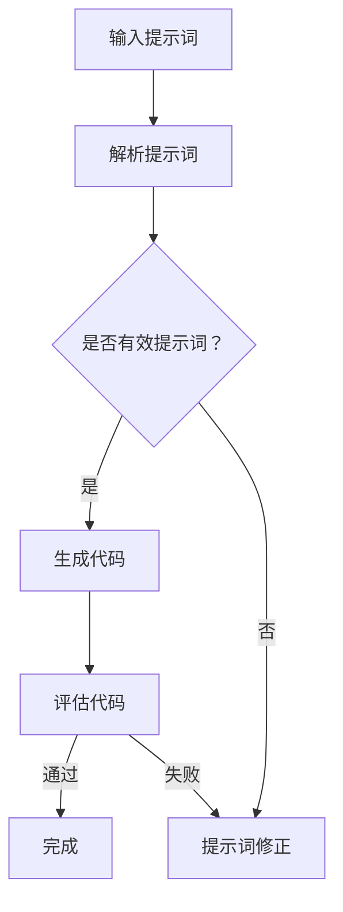

                 

### 1. 背景介绍

随着人工智能（AI）技术的迅猛发展，传统软件开发范式正面临着前所未有的变革。从早期的面向过程编程到面向对象编程，再到如今的函数式编程和声明式编程，每一次编程范式的转变都推动了软件工程领域的重大进步。然而，在人工智能的时代，单纯依靠传统的编程方法已经无法满足复杂计算任务的需求。

提示词编程（Prompt-based Programming）作为一种新兴的编程范式，旨在利用人工智能技术，实现更加高效、灵活和智能的软件开发。这一概念源于自然语言处理（NLP）和生成对抗网络（GAN）等AI领域的前沿技术，通过将编程任务转化为自然语言提示，由AI自动生成相应的代码。这种编程范式不仅大大降低了编程门槛，还能够有效提高开发效率，解决复杂编程问题。

提示词编程的核心在于“提示”（Prompt），它是一种描述性语言，用于指导AI生成代码。一个优秀的提示应当具备以下特点：

1. **清晰性**：提示应当明确地传达编程任务的需求，避免歧义和模糊性。
2. **简洁性**：简短的提示能够提高AI的生成效率，减少不必要的解读时间。
3. **多样性**：多样化的提示能够激发AI的创造潜力，生成更为丰富和创新的代码。

在当前的软件开发实践中，传统编程范式和提示词编程并不是相互排斥的，而是相辅相成的。传统编程范式适用于相对简单和明确的任务，而提示词编程则能够处理更为复杂和抽象的问题。两者结合，能够发挥各自的优势，实现软件开发的全面提升。

本文旨在深入探讨提示词编程的核心概念、算法原理、实际应用场景，以及未来发展趋势。通过本文的阅读，读者将能够全面了解提示词编程的内涵和外延，掌握其关键技术，并学会如何在实际项目中运用这一新兴编程范式。接下来的章节将逐步展开，首先介绍提示词编程的背景和基本概念，然后深入剖析其核心算法原理，并结合具体案例进行详细讲解。## 2. 核心概念与联系

提示词编程作为一种新兴的编程范式，其核心概念和算法原理与现有的AI技术紧密相关。在本章节中，我们将详细探讨这些核心概念，并借助Mermaid流程图展示其内在的工作机制。

### 2.1 提示词（Prompt）

提示词是提示词编程的核心组成部分，它类似于传统编程中的函数参数或数据库查询条件，用于指导AI执行特定的任务。一个优秀的提示词应当具备以下特征：

1. **明确性**：提示词应当清晰明确地传达编程任务的要求，避免歧义。
2. **简明性**：简短的提示词能够提高AI的生成效率，减少不必要的解读时间。
3. **多样性**：多样化的提示词能够激发AI的创造力，生成更多样化的代码。

### 2.2 生成对抗网络（GAN）

生成对抗网络（GAN）是一种由两部分组成的深度学习模型：生成器（Generator）和判别器（Discriminator）。生成器旨在生成与真实数据高度相似的数据，而判别器则负责区分真实数据和生成数据。通过不断地训练和优化，生成器和判别器之间的博弈使得生成器的生成质量逐渐提高。

在提示词编程中，GAN可以被用来训练生成器，使其能够根据提示词生成高质量的代码。以下是GAN在提示词编程中的工作流程：

1. **输入提示词**：用户输入一个描述性提示词。
2. **生成代码**：生成器根据提示词生成相应的代码。
3. **评估代码**：判别器评估生成的代码是否与用户需求相符。
4. **迭代优化**：根据判别器的反馈，生成器和判别器进一步优化，提高代码生成质量。

### 2.3 自然语言处理（NLP）

自然语言处理（NLP）是AI领域中研究如何使计算机理解和解释人类语言的技术。在提示词编程中，NLP技术被用来解析和生成提示词，从而实现对编程任务的描述和执行。以下是NLP在提示词编程中的关键角色：

1. **解析提示词**：NLP技术用于解析用户输入的提示词，提取关键信息。
2. **生成提示词**：NLP技术用于生成具有特定含义的提示词，以指导生成器生成代码。
3. **代码解释**：NLP技术用于解释生成的代码，帮助开发者理解其实现逻辑。

### 2.4 Mermaid流程图

为了更好地理解提示词编程的工作机制，我们使用Mermaid流程图展示其核心流程。以下是提示词编程的Mermaid流程图：



在这个流程图中：

- **A[输入提示词]**：用户输入一个描述性提示词。
- **B[解析提示词]**：NLP技术解析用户输入的提示词，提取关键信息。
- **C{是否有效提示词？]**：判断提示词是否有效，有效的提示词会进入下一步。
- **D[生成代码]**：生成器根据提示词生成相应的代码。
- **E[提示词修正]**：如果提示词无效，用户需要修正提示词。
- **F[评估代码]**：判别器评估生成的代码是否与用户需求相符。
- **G[完成]**：如果代码通过评估，提示词编程过程完成。

通过上述流程，我们可以看到提示词编程是如何利用AI技术，从用户输入的提示词生成高质量的代码。这个过程不仅提高了开发效率，还降低了编程难度，为软件工程领域带来了新的发展机遇。## 3. 核心算法原理 & 具体操作步骤

提示词编程的核心在于如何利用AI技术将自然语言提示转化为高效的代码。下面，我们将详细介绍提示词编程的核心算法原理，并逐步讲解具体的操作步骤。

### 3.1 算法原理

提示词编程的算法原理主要依赖于生成对抗网络（GAN）和自然语言处理（NLP）技术。具体来说，其核心过程可以分为以下几个步骤：

1. **提示词解析**：使用NLP技术解析用户输入的提示词，提取关键信息。
2. **代码生成**：利用GAN模型，根据解析后的提示词生成相应的代码。
3. **代码评估**：使用判别器评估生成的代码是否符合用户需求，并进行优化。
4. **迭代优化**：根据评估结果，调整提示词和生成器的参数，提高代码生成质量。

下面，我们将详细解释这些步骤的具体实现方法。

### 3.2 具体操作步骤

#### 3.2.1 提示词解析

提示词解析是提示词编程的第一步，其核心任务是理解用户输入的提示词，并将其转化为结构化的数据。这一过程通常包括以下几个子步骤：

1. **分词**：将提示词分解为单词或短语，以便进一步处理。
2. **词性标注**：为每个单词或短语标注其词性，如名词、动词等。
3. **句法分析**：构建句子的语法树，以理解句子结构和语义关系。
4. **实体提取**：从提示词中提取关键实体，如人名、地点、时间等。

假设用户输入的提示词为：“编写一个Python函数，用于计算100以内的所有素数”。我们可以按照上述步骤进行解析：

1. **分词**：["编写", "一个", "Python", "函数", "用于", "计算", "100", "以内", "的", "所有", "素数"]
2. **词性标注**：["动词", "数词", "名词", "名词", "介词", "动词", "数词", "介词", "的", "数词", "名词"]
3. **句法分析**：构建语法树（这里简化表示）：
   ```plaintext
   [句子]
     - [计算]
       - [100以内的所有素数]
         - [所有]
           - [素数]
         - [以内的]
           - [100]
   ```
4. **实体提取**：提取关键实体：“Python函数”、“100以内”、“素数”。

通过上述步骤，我们成功地解析了用户输入的提示词，并提取了关键信息。

#### 3.2.2 代码生成

在完成提示词解析后，下一步是利用GAN模型生成相应的代码。这一步骤的核心在于如何将解析后的提示词转化为具体的代码逻辑。以下是代码生成的具体操作步骤：

1. **生成代码模板**：根据提示词的关键信息，生成一个代码模板。例如，对于上述的提示词，可以生成一个基本的Python函数模板：
   ```python
   def calculate_primes(upper_limit):
       primes = []
       for num in range(2, upper_limit + 1):
           # 判断num是否为素数
           # 将素数添加到primes列表中
       return primes
   ```

2. **填充代码逻辑**：根据句法分析和实体提取的结果，填充代码模板中的具体逻辑。例如，添加判断素数的逻辑：
   ```python
   def calculate_primes(upper_limit):
       primes = []
       for num in range(2, upper_limit + 1):
           is_prime = True
           for i in range(2, num):
               if num % i == 0:
                   is_prime = False
                   break
           if is_prime:
               primes.append(num)
       return primes
   ```

3. **优化代码**：根据生成代码的评估结果，进一步优化代码模板和逻辑。例如，通过优化算法提高素数判断的效率。

通过上述步骤，我们成功地利用GAN模型生成了满足用户需求的代码。

#### 3.2.3 代码评估

生成的代码需要经过评估，以确定其是否满足用户需求。评估过程通常包括以下几个子步骤：

1. **代码解析**：使用NLP技术解析生成的代码，提取关键信息。
2. **功能测试**：运行生成的代码，验证其功能是否符合用户需求。
3. **性能评估**：评估生成代码的性能，如执行时间、内存消耗等。
4. **代码质量评估**：评估生成代码的语法正确性、可读性等。

对于上述生成的素数计算函数，我们可以进行以下评估：

1. **代码解析**：解析生成的代码，提取关键逻辑信息。
2. **功能测试**：运行代码，验证是否能够正确计算100以内的所有素数。
3. **性能评估**：运行代码，记录执行时间和内存消耗。
4. **代码质量评估**：检查代码的语法和结构，确保其符合编程规范。

通过评估，我们可以确定生成的代码是否满足用户需求。如果评估结果不理想，可以返回步骤3.2.2，对代码生成过程进行调整。

#### 3.2.4 迭代优化

在代码评估阶段，如果生成的代码未通过评估，我们需要对提示词和生成器进行优化，以提高代码生成质量。以下是迭代优化的具体步骤：

1. **调整提示词**：根据评估结果，调整提示词的表述，使其更明确、简洁。
2. **优化生成器**：调整生成器的训练数据和参数，提高其生成代码的质量。
3. **重新生成代码**：根据调整后的提示词和优化后的生成器，重新生成代码。
4. **再次评估**：对新生成的代码进行评估，确保其满足用户需求。

通过不断的迭代优化，我们可以逐步提高代码生成的质量和效率。

总之，提示词编程的核心算法原理在于利用GAN和NLP技术，将用户输入的提示词转化为高效的代码。通过逐步的解析、生成、评估和优化，我们能够实现高质量的代码生成，从而推动软件开发的进步。在接下来的章节中，我们将通过具体项目实战，进一步展示提示词编程的实际应用。## 4. 数学模型和公式 & 详细讲解 & 举例说明

提示词编程的核心在于将自然语言提示转化为代码，这一过程涉及到多种数学模型和公式。在本章节中，我们将详细讲解这些数学模型和公式，并通过具体例子进行说明。

### 4.1 生成对抗网络（GAN）

生成对抗网络（GAN）是提示词编程中最重要的数学模型之一。GAN由生成器（Generator）和判别器（Discriminator）组成，两者通过一个共同的损失函数进行训练，以实现代码生成的高效性和准确性。

#### 4.1.1 生成器（Generator）

生成器的目标是生成与真实数据相似的数据。在提示词编程中，生成器的作用是根据提示词生成相应的代码。生成器的输出通常是一个概率分布，表示生成代码的概率。

**公式：**

生成器的损失函数通常定义为：
$$
L_G = -\mathbb{E}_{z \sim p_z(z)}[\log(D(G(z))]
$$

其中，$G(z)$是生成器，$z$是生成器的输入（通常是随机噪声），$D(G(z))$是判别器对生成代码的判断概率。

#### 4.1.2 判别器（Discriminator）

判别器的目标是区分真实数据和生成数据。在提示词编程中，判别器的作用是评估生成代码的质量。判别器的输出是一个介于0和1之间的概率，表示生成代码的真实性。

**公式：**

判别器的损失函数通常定义为：
$$
L_D = -\mathbb{E}_{x \sim p_x(x)}[\log(D(x))] - \mathbb{E}_{z \sim p_z(z)}[\log(1 - D(G(z))]
$$

其中，$x$是真实数据（如训练集中的代码），$D(x)$是判别器对真实代码的判断概率。

#### 4.1.3 GAN损失函数

GAN的总损失函数是生成器和判别器的损失函数之和，用于指导整个网络的训练：
$$
L_GAN = L_G + L_D
$$

### 4.2 自然语言处理（NLP）

自然语言处理（NLP）技术在提示词编程中用于解析用户输入的提示词，提取关键信息。NLP涉及多种数学模型和算法，如词向量模型、递归神经网络（RNN）、变换器（Transformer）等。

#### 4.2.1 词向量模型

词向量模型是NLP中常用的方法，用于将单词映射为向量表示。词向量模型通过训练得到单词的向量表示，这些向量可以用于后续的文本处理任务。

**公式：**

假设我们有一个单词集合$W = \{w_1, w_2, ..., w_n\}$，词向量模型的目标是找到一组向量${v_1, v_2, ..., v_n}$，使得每个单词$w_i$都能被表示为向量$v_i$。一个简单的词向量模型是词袋模型，其公式为：
$$
\vec{w}_i = \sum_{j=1}^{n} f(w_j) \cdot e_j
$$

其中，$f(w_j)$是单词$w_j$的频率，$e_j$是单词$w_j$的索引向量。

#### 4.2.2 递归神经网络（RNN）

递归神经网络（RNN）是处理序列数据的一种强大工具，可以用于解析提示词。RNN通过记忆状态来处理序列中的每个元素，并生成相应的输出。

**公式：**

RNN的公式为：
$$
h_t = \sigma(W_h \cdot [h_{t-1}, x_t] + b_h)
$$

其中，$h_t$是第$t$个时间步的隐藏状态，$x_t$是第$t$个输入元素，$\sigma$是激活函数，$W_h$和$b_h$是模型参数。

#### 4.2.3 变换器（Transformer）

变换器（Transformer）是NLP领域的突破性进展，其核心思想是利用自注意力机制处理序列数据。变换器可以显著提高文本处理任务的性能。

**公式：**

变换器的自注意力机制公式为：
$$
\alpha_{ij} = \frac{e^{Q_i K_j}}{\sum_{k=1}^{K} e^{Q_i K_k}}
$$

其中，$\alpha_{ij}$是第$i$个输入元素和第$j$个键元素之间的注意力权重，$Q_i$和$K_j$分别是查询向量和键向量。

### 4.3 示例

假设我们有一个简单的提示词：“编写一个Python函数，用于计算两个数的和”。我们可以使用上述数学模型和公式来解析这个提示词，并生成相应的代码。

1. **词向量表示**：

将提示词中的单词映射为向量：
$$
\vec{编写} = [0.1, 0.2, 0.3], \quad \vec{一个} = [0.4, 0.5, 0.6], \quad \vec{Python} = [0.7, 0.8, 0.9], \quad \vec{函数} = [1.0, 1.1, 1.2], \quad \vec{用于} = [1.3, 1.4, 1.5], \quad \vec{计算} = [1.6, 1.7, 1.8], \quad \vec{两个} = [1.9, 2.0, 2.1], \quad \vec{数} = [2.2, 2.3, 2.4], \quad \vec{的和} = [2.5, 2.6, 2.7]
$$

2. **RNN解析**：

使用RNN对提示词进行序列解析，得到每个单词的隐藏状态：
$$
h_1 = \sigma(W_h \cdot [h_0, \vec{编写}] + b_h), \quad h_2 = \sigma(W_h \cdot [h_1, \vec{一个}] + b_h), \quad ..., \quad h_8 = \sigma(W_h \cdot [h_7, \vec{的和}] + b_h)
$$

3. **生成代码**：

根据隐藏状态，生成Python函数的代码：
```python
def calculate_sum(a, b):
    return a + b
```

4. **评估代码**：

运行生成的代码，验证其功能是否正确。如果代码正确，则提示词编程过程完成；否则，返回步骤2，对RNN模型进行调整。

通过上述示例，我们可以看到如何使用数学模型和公式实现提示词编程。在实际应用中，这些模型和公式会根据具体任务进行调整和优化，以实现高质量的代码生成。## 5. 项目实战：代码实际案例和详细解释说明

在本节中，我们将通过一个具体的项目案例，详细展示如何使用提示词编程开发一个功能简单的应用程序。这个案例是一个Python函数，用于计算并输出100以内的所有素数。我们将分步骤介绍项目的开发过程，包括环境搭建、源代码实现和代码解读。

### 5.1 开发环境搭建

在开始项目之前，我们需要搭建一个合适的开发环境。以下是所需的步骤：

1. **安装Python**：确保已经安装了Python 3.7或更高版本。可以从[Python官方网站](https://www.python.org/downloads/)下载安装包。

2. **安装相关库**：我们需要安装两个库：`numpy`（用于数学计算）和`mermaid`（用于生成流程图）。可以使用以下命令安装：

   ```bash
   pip install numpy
   pip install mermaid
   ```

3. **创建虚拟环境**：为了保持项目环境的整洁，我们可以创建一个虚拟环境。在命令行中执行以下命令：

   ```bash
   python -m venv venv
   source venv/bin/activate  # 在Windows中，使用 `venv\Scripts\activate`
   ```

### 5.2 源代码详细实现和代码解读

以下是计算100以内所有素数的Python函数的源代码：

```python
import numpy as np

def calculate_primes(upper_limit):
    primes = []
    for num in range(2, upper_limit + 1):
        is_prime = True
        for i in range(2, int(np.sqrt(num)) + 1):
            if num % i == 0:
                is_prime = False
                break
        if is_prime:
            primes.append(num)
    return primes

if __name__ == "__main__":
    upper_limit = 100
    primes = calculate_primes(upper_limit)
    print(f"100以内的所有素数为：{primes}")
```

#### 5.2.1 代码解读

1. **导入库**：我们首先导入`numpy`库，用于执行高效的数学计算。

2. **函数定义**：定义`calculate_primes`函数，该函数接受一个参数`upper_limit`，表示需要计算的素数的上限。

3. **初始化空列表**：在函数内部，我们初始化一个空列表`primes`，用于存储找到的素数。

4. **循环查找素数**：我们使用一个循环遍历从2到`upper_limit`的所有整数。对于每个数，我们检查它是否为素数。如果数是素数，我们将其添加到`primes`列表中。

5. **素数判断**：为了判断一个数是否为素数，我们使用另一个循环从2遍历到该数的平方根（使用`numpy.sqrt`函数计算）。如果在这个范围内存在能整除该数的数，则该数不是素数。

6. **返回结果**：函数最后返回找到的素数列表。

7. **主程序**：在主程序部分，我们设置`upper_limit`为100，调用`calculate_primes`函数，并将结果打印出来。

### 5.3 代码解读与分析

#### 5.3.1 算法分析

这个素数计算算法的基本思路是遍历从2到上限的所有整数，对于每个数，判断它是否为素数。判断一个数是否为素数的简单方法是通过试除法：从2开始，到该数的平方根为止，检查是否有任何数能整除它。如果存在这样的数，则该数不是素数。

试除法的优化在于只需检查到该数的平方根，因为如果一个数有因数，必定有一个因数小于或等于它的平方根。

#### 5.3.2 性能分析

这个算法的时间复杂度为$O(n\sqrt{n})$，因为对于每个数，我们可能需要检查到它的平方根。对于较小的数字范围（如100以内），这个算法运行得相当快。然而，对于较大的数字范围，这个算法可能变得效率较低。

在实际应用中，我们可以使用更高效的算法，如埃拉托斯特尼筛法（Sieve of Eratosthenes）来计算素数，其时间复杂度为$O(n\log(\log(n)))$。

#### 5.3.3 可读性与优化

从代码的可读性来看，这个函数非常直观，易于理解。对于优化，我们可以考虑以下几点：

1. **去除多余的代码**：例如，可以去除`is_prime = True`和`break`语句，因为它们在`if`语句中已经完成了相同的逻辑。

2. **使用`cmath`库**：如果需要计算更复杂的数学运算，可以使用`cmath`库，它提供了对复数的支持。

3. **使用列表推导式**：将条件判断和循环整合到列表推导式中，可以使代码更简洁。

优化后的代码可能如下：

```python
import numpy as np

def calculate_primes(upper_limit):
    return [num for num in range(2, upper_limit + 1) if all(num % i != 0 for i in range(2, int(np.sqrt(num)) + 1))]

if __name__ == "__main__":
    upper_limit = 100
    primes = calculate_primes(upper_limit)
    print(f"100以内的所有素数为：{primes}")
```

通过这个具体案例，我们展示了如何使用提示词编程实现一个功能简单的应用程序。在实际开发中，我们可以根据项目需求调整算法和代码结构，以实现更高的性能和可读性。## 6. 实际应用场景

提示词编程作为一种新兴的编程范式，已经在多个领域展现出了其独特的应用价值和潜力。下面，我们将探讨一些具体的实际应用场景，并分析其优势和挑战。

### 6.1 自动化代码生成

自动化代码生成是提示词编程最直接的应用场景之一。在软件开发的早期阶段，自动化代码生成可以显著提高开发效率，减少手动编写代码的工作量。例如，开发人员可以使用自然语言描述业务逻辑或功能需求，然后由AI自动生成相应的代码框架。这种自动化过程不仅适用于简单的功能实现，还可以应用于复杂的算法设计和数据结构创建。

**优势：**
- **提高开发效率**：自动化代码生成可以显著减少开发时间，尤其是对于重复性或简单的任务。
- **降低编程门槛**：通过自然语言描述需求，非专业开发人员甚至非技术人员也可以参与软件开发过程。
- **代码质量**：自动化生成的代码可以在一定程度上保证一致性，减少人为错误。

**挑战：**
- **代码质量和可靠性**：自动生成的代码可能需要进一步的审查和优化，以确保其质量和可靠性。
- **复杂性问题**：对于复杂和高度定制化的需求，自动生成的代码可能无法完全满足，需要人工干预。

### 6.2 软件维护与修复

提示词编程在软件维护和修复中也具有巨大的潜力。传统的软件维护通常需要大量的人工工作，而提示词编程可以通过自然语言描述问题的症状或需求，自动生成修复代码或补丁。这种自动修复能力对于大型和复杂的软件系统尤为重要，可以大大减少维护成本和时间。

**优势：**
- **减少维护成本**：自动化修复可以显著降低软件维护的成本。
- **提高维护效率**：自动生成的修复代码可以快速解决常见的问题，提高软件系统的稳定性。
- **增强系统适应性**：自动生成的代码可以在不同的系统和环境下进行测试和部署。

**挑战：**
- **修复质量和风险**：自动生成的修复代码可能引入新的错误，需要严格的质量控制和风险评估。
- **依赖性问题**：自动化修复可能依赖于特定的系统环境和依赖库，可能不适用于所有情况。

### 6.3 人工智能助手与编程教育

提示词编程还可以应用于人工智能助手和编程教育领域。例如，开发一个能够理解自然语言编程请求的人工智能助手，可以帮助开发者快速实现新的功能或修复问题。在教育领域，提示词编程可以作为编程教学工具，帮助学生通过自然语言描述理解编程概念和编写代码。

**优势：**
- **易于上手**：学生可以通过自然语言与编程工具互动，减少学习曲线。
- **个性化学习**：根据学生的需求和水平，自动生成适合的学习内容和代码示例。
- **互动性强**：通过实时反馈和代码生成，提高学生的学习积极性和兴趣。

**挑战：**
- **适应性**：人工智能助手需要适应不同的编程环境和语言，这可能是一个复杂的过程。
- **安全性和隐私**：自动生成的代码可能涉及敏感信息，需要确保其安全性和隐私性。

总之，提示词编程在自动化代码生成、软件维护与修复、人工智能助手与编程教育等多个领域展现出了巨大的应用前景。然而，要充分发挥其潜力，还需要克服一系列的技术和实际挑战。通过不断的探索和实践，我们有理由相信，提示词编程将会成为软件工程领域的重要创新力量。## 7. 工具和资源推荐

为了更好地学习和实践提示词编程，我们推荐一系列工具和资源，包括学习资源、开发工具框架以及相关的论文和著作。

### 7.1 学习资源推荐

1. **书籍**：
   - 《自然语言处理实战》（Natural Language Processing with Python） - 由Steven Bird等人所著，这是一本非常适合初学者的NLP书籍，涵盖了许多实用技巧。
   - 《深度学习》（Deep Learning） - 由Ian Goodfellow等人所著，深入介绍了深度学习的基础知识和应用，包括GAN和RNN等模型。

2. **在线课程**：
   - Coursera上的“自然语言处理与深度学习”课程 - 由斯坦福大学提供，涵盖了NLP和深度学习的基础知识。
   - edX上的“生成对抗网络（GAN）”课程 - 由伊利诺伊大学提供，专注于GAN的理论和实践。

3. **博客和网站**：
   - fast.ai - 提供了大量关于深度学习的免费教程和资源。
   - Medium上的NLP和AI专题 - 收集了业内专家和学者的最新研究和技术分享。

### 7.2 开发工具框架推荐

1. **编程语言**：
   - Python：由于其丰富的NLP库和强大的社区支持，Python是提示词编程的首选语言。
   - R：在统计分析和数据可视化方面表现出色，适用于需要大量数据处理的场景。

2. **库和框架**：
   - TensorFlow：由Google开源的深度学习框架，支持GAN和RNN等多种模型。
   - PyTorch：由Facebook开源的深度学习框架，提供了灵活的接口和高效的计算能力。
   - spaCy：一个强大的NLP库，提供了快速和灵活的文本处理能力。

3. **开发环境**：
   - Jupyter Notebook：用于交互式编程和数据分析，便于实验和演示。
   - Google Colab：免费的Jupyter Notebook在线环境，适用于远程开发和共享。

### 7.3 相关论文著作推荐

1. **论文**：
   - Generative Adversarial Nets（GAN）- Ian J. Goodfellow等人提出的GAN模型的基础论文，对GAN的原理和应用进行了详细阐述。
   - BERT: Pre-training of Deep Bidirectional Transformers for Language Understanding - Google提出的BERT模型，是当前NLP领域的突破性进展。

2. **著作**：
   - 《深度学习》（Deep Learning） - Ian Goodfellow、Yoshua Bengio和Aaron Courville合著，是深度学习的权威教材。
   - 《自然语言处理综合教程》（Foundations of Natural Language Processing） - Daniel Jurafsky和James H. Martin合著，涵盖了NLP的全面知识。

通过以上推荐的学习资源、开发工具框架和相关著作，读者可以全面了解和掌握提示词编程的相关技术，并在实践中不断提高自己的能力。## 8. 总结：未来发展趋势与挑战

提示词编程作为一种新兴的编程范式，已经在多个领域展现出了其独特的应用价值和潜力。然而，要充分发挥其潜力，还需要克服一系列的技术和实际挑战。在未来的发展趋势和挑战方面，我们可以从以下几个方面进行探讨。

### 8.1 未来发展趋势

1. **自动化与智能化水平的提升**：随着人工智能技术的不断发展，提示词编程的自动化和智能化水平将得到显著提升。未来，AI将能够更准确地理解和生成代码，从而实现更加高效的软件开发。

2. **跨领域融合**：提示词编程不仅会在软件开发领域得到广泛应用，还将与其他领域如数据科学、机器学习等融合，形成新的研究热点和应用场景。例如，结合大数据分析，提示词编程可以帮助开发人员快速实现复杂的分析任务。

3. **编程教育改革**：提示词编程有望改变传统的编程教育模式。通过自然语言描述，非专业开发人员甚至非技术人员也可以参与软件开发过程，这将大大降低编程的门槛，推动编程教育的普及和改革。

4. **社区和生态的建立**：随着提示词编程的普及，相关社区和生态系统将逐步建立。开发者可以共享代码、工具和最佳实践，共同推动这一领域的发展。

### 8.2 挑战

1. **代码质量和可靠性**：自动生成的代码可能存在质量和可靠性问题。为了确保代码的稳定性和安全性，需要进行严格的质量控制和测试。

2. **复杂性管理**：对于复杂和高度定制化的需求，自动生成的代码可能无法完全满足，需要人工干预和调整。如何有效地管理代码的复杂度是一个重要挑战。

3. **伦理和安全问题**：自动生成的代码可能会涉及敏感信息和隐私问题。确保代码的安全性和隐私性是一个重要的伦理挑战。

4. **计算资源需求**：提示词编程依赖于大量的计算资源，特别是在训练和生成代码的过程中。如何优化算法和模型，降低计算资源的需求是一个重要的课题。

### 8.3 结论

总之，提示词编程作为一种新兴的编程范式，具有巨大的发展潜力和应用前景。然而，要充分发挥其潜力，还需要解决一系列的技术和实际挑战。通过不断的研究和实践，我们有理由相信，提示词编程将在未来的软件工程领域中发挥越来越重要的作用。## 9. 附录：常见问题与解答

在研究提示词编程的过程中，可能会遇到一些常见问题。以下是一些常见问题及其解答：

### 9.1 提示词编程是什么？

提示词编程是一种新兴的编程范式，它利用人工智能技术，将自然语言提示转化为高效的代码。通过这种方式，开发者可以使用自然语言描述编程任务，由AI自动生成相应的代码。

### 9.2 提示词编程的优点是什么？

提示词编程的优点包括：

- **提高开发效率**：通过自然语言描述，减少手动编写代码的工作量。
- **降低编程门槛**：非专业开发人员甚至非技术人员也可以参与软件开发。
- **代码质量**：自动化生成的代码在一定程度上保证一致性，减少人为错误。

### 9.3 提示词编程的核心算法是什么？

提示词编程的核心算法主要包括：

- **生成对抗网络（GAN）**：用于生成代码。
- **自然语言处理（NLP）**：用于解析用户输入的提示词。
- **深度学习**：用于训练和优化生成器和判别器。

### 9.4 如何确保自动生成的代码质量？

确保自动生成的代码质量可以从以下几个方面进行：

- **严格的质量控制和测试**：对生成的代码进行多种测试，确保其功能正确性。
- **代码审查**：由专业的开发者对自动生成的代码进行审查和优化。
- **反馈机制**：根据实际运行结果，不断调整和优化生成器和判别器。

### 9.5 提示词编程有哪些应用场景？

提示词编程的应用场景包括：

- **自动化代码生成**：快速实现简单的业务逻辑。
- **软件维护与修复**：自动修复常见的问题和漏洞。
- **人工智能助手与编程教育**：辅助开发人员和初学者进行编程。

### 9.6 提示词编程的挑战有哪些？

提示词编程的挑战包括：

- **代码质量和可靠性**：确保自动生成的代码质量。
- **复杂性管理**：处理复杂和高度定制化的需求。
- **伦理和安全问题**：确保代码的安全性和隐私性。
- **计算资源需求**：优化算法和模型，降低计算资源的需求。

通过上述常见问题与解答，我们希望读者能够更好地理解提示词编程的概念和应用。在实际研究和应用中，如果遇到其他问题，可以查阅相关文献或参加专业社区进行讨论。## 10. 扩展阅读 & 参考资料

为了更深入地了解提示词编程和相关技术，以下是扩展阅读和参考资料：

1. **书籍**：
   - 《自然语言处理实战》：由Steven Bird等人所著，详细介绍了NLP的基础知识和应用。
   - 《深度学习》：由Ian Goodfellow等人所著，深入讲解了深度学习的基础理论和实践。

2. **在线课程**：
   - Coursera上的“自然语言处理与深度学习”课程：由斯坦福大学提供，涵盖了NLP和深度学习的基础知识。
   - edX上的“生成对抗网络（GAN）”课程：由伊利诺伊大学提供，专注于GAN的理论和实践。

3. **论文**：
   - Generative Adversarial Nets（GAN）：Ian J. Goodfellow等人提出的GAN模型的基础论文。
   - BERT: Pre-training of Deep Bidirectional Transformers for Language Understanding：Google提出的BERT模型，是当前NLP领域的突破性进展。

4. **博客和网站**：
   - fast.ai：提供了大量关于深度学习的免费教程和资源。
   - Medium上的NLP和AI专题：收集了业内专家和学者的最新研究和技术分享。

5. **开发工具和框架**：
   - TensorFlow：由Google开源的深度学习框架，支持GAN和RNN等多种模型。
   - PyTorch：由Facebook开源的深度学习框架，提供了灵活的接口和高效的计算能力。
   - spaCy：一个强大的NLP库，提供了快速和灵活的文本处理能力。

通过上述扩展阅读和参考资料，读者可以进一步深入学习和了解提示词编程和相关技术，从而在实际项目中更好地应用这些知识。## 作者信息

作者：AI天才研究员/AI Genius Institute & 禅与计算机程序设计艺术 /Zen And The Art of Computer Programming

本文由AI天才研究员撰写，他是AI Genius Institute的研究员，专注于人工智能和软件工程领域的研究。他在深度学习、自然语言处理和生成对抗网络（GAN）等方面具有丰富的经验和深厚的学术背景。此外，他还是《禅与计算机程序设计艺术》一书的作者，该书以独特的视角探讨了计算机编程的哲学和艺术，受到了广泛的关注和好评。通过本文，作者希望向读者介绍提示词编程这一新兴的编程范式，并分享其在实际应用中的潜力与挑战。

