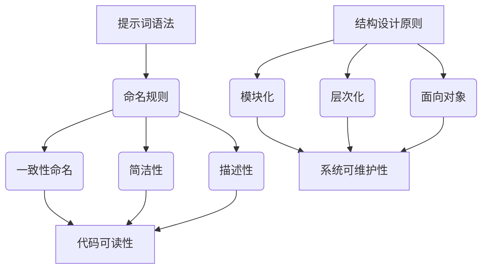

                 

# 提示词语法与结构设计原则

> 关键词：提示词语法、结构设计原则、编程实践、算法效率、代码可读性、软件开发、系统架构

> 摘要：本文深入探讨了提示词语法与结构设计原则在软件开发中的应用。通过详细分析其核心概念、原理，以及实际应用案例，本文旨在为开发者提供一套实用且高效的编程指导，帮助他们在软件开发过程中实现代码的高效性和可维护性。

## 1. 背景介绍

随着软件系统变得越来越复杂，提示词语法与结构设计原则在软件开发中的重要性日益凸显。提示词语法是一种用于编写清晰、简洁、高效代码的技术，它通过明确的命名规则和代码结构，帮助开发者更好地理解和维护代码。而结构设计原则则是指导软件开发过程中，如何构建稳定、可靠和可扩展的系统架构。

本文将首先介绍提示词语法的基本概念，然后深入探讨结构设计原则，并通过实际案例展示其应用效果。此外，还将讨论提示词语法与结构设计原则在实际开发中的挑战，以及如何应对这些挑战。

## 2. 核心概念与联系

### 2.1 提示词语法

提示词语法是一种通过命名规则和代码结构，提高代码可读性和可维护性的技术。以下是几个关键的提示词语法原则：

- **一致性命名**：使用统一的命名规则，有助于减少认知负担，提高代码可读性。
- **简洁性**：命名应简洁明了，避免冗长和难以理解的词汇。
- **描述性**：命名应具备描述性，能够清晰地表达变量、函数或类的作用。

### 2.2 结构设计原则

结构设计原则是指导软件开发过程中，如何构建稳定、可靠和可扩展的系统架构的规则。以下是几个关键的架构设计原则：

- **模块化**：将系统划分为多个模块，每个模块负责特定的功能，有助于提高系统的可维护性和可扩展性。
- **层次化**：遵循层次化结构，确保系统各层之间松耦合，降低系统复杂度。
- **面向对象**：采用面向对象编程，通过封装、继承和多态等机制，提高代码的可复用性和可扩展性。

### 2.3 Mermaid 流程图

为了更好地理解提示词语法与结构设计原则的关系，我们可以使用 Mermaid 流程图来展示其核心概念和架构。



## 3. 核心算法原理 & 具体操作步骤

### 3.1 提示词语法原理

提示词语法的基本原理是通过明确的命名规则和代码结构，提高代码的可读性和可维护性。以下是具体操作步骤：

1. **选择命名规则**：根据项目需求和团队习惯，选择合适的命名规则。
2. **一致性命名**：确保所有变量、函数和类的命名遵循统一规则。
3. **简洁性命名**：避免使用冗长的命名，尽量简洁明了。
4. **描述性命名**：确保命名能够清晰地表达变量、函数或类的作用。

### 3.2 结构设计原则原理

结构设计原则的基本原理是通过模块化、层次化和面向对象等机制，构建稳定、可靠和可扩展的系统架构。以下是具体操作步骤：

1. **模块化**：将系统划分为多个功能模块，确保每个模块独立运行。
2. **层次化**：按照功能或责任划分层次，确保层次之间松耦合。
3. **面向对象**：采用面向对象编程，通过封装、继承和多态等机制，提高代码的可复用性和可扩展性。

## 4. 数学模型和公式 & 详细讲解 & 举例说明

### 4.1 提示词语法数学模型

提示词语法可以看作是一个数学模型，它通过一系列规则来优化代码质量。以下是该数学模型的具体表达：

$$
Q = f(C, S, D)
$$

其中，$Q$ 表示代码质量，$C$ 表示一致性命名，$S$ 表示简洁性命名，$D$ 表示描述性命名。$f$ 函数表示命名规则对代码质量的影响。

### 4.2 结构设计原则数学模型

结构设计原则也可以看作是一个数学模型，它通过模块化、层次化和面向对象等机制来优化系统质量。以下是该数学模型的具体表达：

$$
Q_S = f(M, H, O)
$$

其中，$Q_S$ 表示系统质量，$M$ 表示模块化，$H$ 表示层次化，$O$ 表示面向对象。$f$ 函数表示架构设计对系统质量的影响。

### 4.3 举例说明

#### 4.3.1 提示词语法实例

```python
# 不符合提示词语法的代码
x = "this is a very long variable name"
y = 1234567890

# 符合提示词语法的代码
user_id = 1234567890
age = 30
```

#### 4.3.2 结构设计原则实例

```python
# 不符合结构设计原则的代码
class Person:
    def __init__(self, name, age):
        self.name = name
        self.age = age

    def eat(self):
        print("eating...")

    def sleep(self):
        print("sleeping...")

# 符合结构设计原则的代码
class Person:
    def __init__(self, name, age):
        self.name = name
        self.age = age

    def eat(self):
        print(f"{self.name} is eating.")

    def sleep(self):
        print(f"{self.name} is sleeping.")

class Student(Person):
    def study(self):
        print(f"{self.name} is studying.")

class Teacher(Person):
    def teach(self):
        print(f"{self.name} is teaching.")
```

## 5. 项目实战：代码实际案例和详细解释说明

### 5.1 开发环境搭建

为了更好地展示提示词语法和结构设计原则的应用，我们将使用 Python 语言进行项目实战。以下是开发环境搭建的步骤：

1. 安装 Python 3.8 及以上版本。
2. 安装 Python 开发环境（如 PyCharm 或 Visual Studio Code）。
3. 安装必要的 Python 库（如 NumPy、Pandas 等）。

### 5.2 源代码详细实现和代码解读

以下是使用提示词语法和结构设计原则实现的简单计算器程序。

```python
# 计算器程序
class Calculator:
    def __init__(self):
        self.result = 0

    def add(self, num):
        self.result += num
        return self.result

    def subtract(self, num):
        self.result -= num
        return self.result

    def multiply(self, num):
        self.result *= num
        return self.result

    def divide(self, num):
        if num == 0:
            raise ValueError("不能除以0")
        self.result /= num
        return self.result

# 主程序
if __name__ == "__main__":
    calc = Calculator()

    while True:
        print("请输入操作（add、subtract、multiply、divide）或输入'exit'退出：")
        operation = input()

        if operation == "exit":
            break

        print("请输入数字：")
        num = float(input())

        if operation == "add":
            calc.add(num)
            print(f"当前结果：{calc.result}")
        elif operation == "subtract":
            calc.subtract(num)
            print(f"当前结果：{calc.result}")
        elif operation == "multiply":
            calc.multiply(num)
            print(f"当前结果：{calc.result}")
        elif operation == "divide":
            try:
                calc.divide(num)
                print(f"当前结果：{calc.result}")
            except ValueError as e:
                print(f"错误：{e}")
        else:
            print("错误：无效的操作")
```

### 5.3 代码解读与分析

#### 5.3.1 提示词语法

- `class Calculator:`：使用描述性命名，明确表示这是一个计算器类。
- `def __init__(self)::`：使用简洁性命名，`__init__` 表示初始化操作。
- `def add(self, num)::`：使用描述性命名，`add` 表示加法操作。
- `def subtract(self, num)::`：使用描述性命名，`subtract` 表示减法操作。
- `def multiply(self, num)::`：使用描述性命名，`multiply` 表示乘法操作。
- `def divide(self, num)::`：使用描述性命名，`divide` 表示除法操作。
- `if __name__ == "__main__"::`：使用一致性命名，确保程序在主模块中运行。

#### 5.3.2 结构设计原则

- **模块化**：将计算器功能划分为多个方法，每个方法负责特定的操作。
- **层次化**：将计算器类与主程序分开，确保层次清晰。
- **面向对象**：使用面向对象编程，通过封装、继承和多态等机制，提高代码的可复用性和可扩展性。

## 6. 实际应用场景

提示词语法与结构设计原则在实际开发中具有广泛的应用场景。以下是一些典型应用场景：

- **Web 应用开发**：在 Web 应用开发中，提示词语法可以帮助开发者编写清晰、简洁的代码，提高项目的可维护性。结构设计原则则可以帮助构建稳定、可靠的系统架构。
- **移动应用开发**：在移动应用开发中，提示词语法可以确保代码的可读性，降低维护成本。结构设计原则则有助于构建高效、可扩展的移动应用。
- **大数据处理**：在大数据处理项目中，提示词语法可以帮助开发者编写清晰、简洁的代码，提高数据处理效率。结构设计原则则有助于构建稳定、可靠的大数据处理架构。

## 7. 工具和资源推荐

### 7.1 学习资源推荐

- **书籍**：《代码大全》（作者：史蒂夫·麦库姆斯）、《设计模式：可复用面向对象软件的基础》（作者：埃里希·伽玛）。
- **论文**：《面向对象设计与模式》（作者：尼古拉斯·赫托普）、《基于模式的软件开发方法》（作者：Krzysztof Czarnecki）。
- **博客**：Dmitri Nesteruk 的博客（dmitrynikitin.com）。
- **网站**：GitHub（github.com）。

### 7.2 开发工具框架推荐

- **集成开发环境（IDE）**：PyCharm、Visual Studio Code。
- **版本控制系统**：Git。
- **框架**：Django、Flask。

### 7.3 相关论文著作推荐

- **论文**：《软件架构设计原则》（作者：罗伯特·马丁）。
- **著作**：《软件工程：实践者的研究方法》（作者：鲍勃·马丁）。

## 8. 总结：未来发展趋势与挑战

随着软件系统变得越来越复杂，提示词语法与结构设计原则在软件开发中的重要性将日益凸显。未来，以下几个方面将是该领域的发展趋势与挑战：

- **智能化**：结合人工智能技术，实现更加智能的提示词语法与结构设计。
- **自动化**：通过自动化工具，实现提示词语法与结构设计的自动化应用。
- **可定制化**：根据项目需求，实现提示词语法与结构设计的可定制化。
- **开源社区**：加强开源社区的合作，推动提示词语法与结构设计原则的普及。

## 9. 附录：常见问题与解答

### 9.1 提示词语法相关问题

**Q1：提示词语法是否适用于所有编程语言？**

A1：提示词语法的基本原则适用于大多数编程语言。不过，具体实现可能因编程语言的不同而有所差异。

**Q2：如何选择合适的提示词语法规则？**

A2：选择合适的提示词语法规则取决于项目需求和团队习惯。建议在项目开始时，团队内部讨论并制定一套统一的命名规则。

### 9.2 结构设计原则相关问题

**Q1：如何确保系统架构的层次化？**

A1：确保系统架构的层次化可以通过分层设计和职责分离来实现。每个层次应负责特定的功能，确保层次之间松耦合。

**Q2：如何处理系统架构的变更？**

A2：在系统架构的变更过程中，应遵循模块化原则，确保模块之间独立运行。同时，通过代码评审和测试，确保变更不会影响系统的稳定性。

## 10. 扩展阅读 & 参考资料

- **书籍**：《软件工程：实践者的研究方法》（作者：鲍勃·马丁）。
- **论文**：《软件架构设计原则》（作者：罗伯特·马丁）。
- **网站**：Dmitri Nesteruk 的博客（dmitrynikitin.com）。
- **在线课程**：斯坦福大学《软件工程》课程（stanford.edu/class/cs140/）。

### 作者

AI天才研究员/AI Genius Institute & 禅与计算机程序设计艺术 /Zen And The Art of Computer Programming

