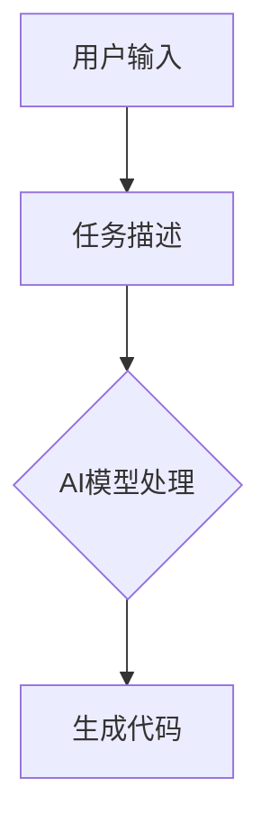
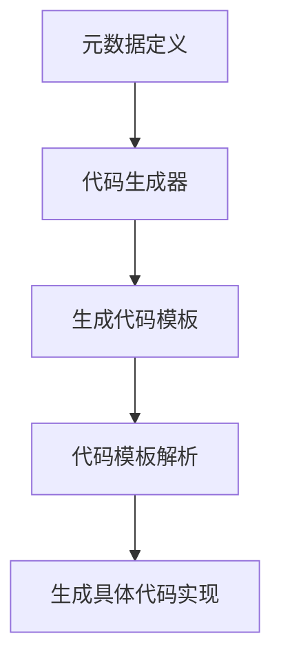
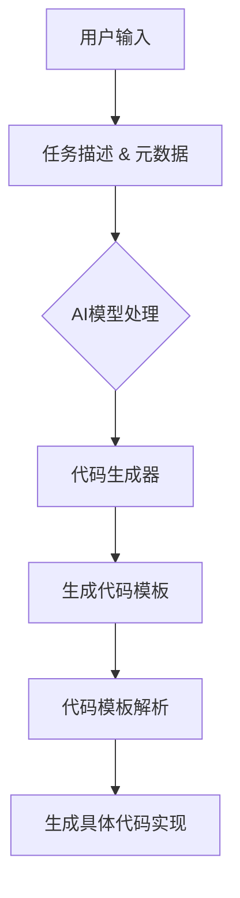
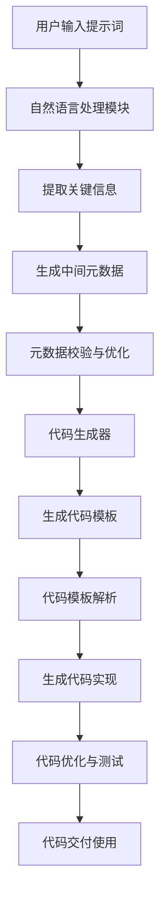

                 

### 文章标题

#### 提示词语言的元数据驱动代码生成

> **关键词**：提示词语言，元数据驱动，代码生成，编程范式，人工智能，自然语言处理，软件工程。

> **摘要**：本文探讨了提示词语言作为元数据驱动代码生成的新兴范式，分析其核心概念、原理以及具体实现步骤，并结合实际项目案例进行深入解读。文章旨在为读者提供一个全面、系统的理解和实践指导，以把握这一前沿技术的应用前景。

<|assistant|>### 1. 背景介绍

随着信息技术的飞速发展，编程语言和开发工具经历了无数次的变革与创新。从传统的结构化编程到面向对象编程，再到函数式编程，程序员们不断探索着提高开发效率和代码质量的途径。然而，随着软件复杂度的不断提升，传统的编程范式在应对海量数据和多样化需求时，逐渐暴露出一些局限性。

近年来，人工智能（AI）和自然语言处理（NLP）技术的突破，为编程领域带来了新的契机。其中，提示词语言（Prompt-based Language）作为一种新兴的编程范式，正逐渐受到关注。提示词语言通过自然语言描述任务需求，利用AI模型自动生成代码，实现了编程与自然语言的深度融合。

元数据驱动代码生成（Metadata-Driven Code Generation）是提示词语言的核心应用之一。元数据是对数据的数据，描述了数据的基本属性和关系。在代码生成领域，元数据用于定义代码模板、变量、函数等结构，指导AI模型生成具体的代码实现。

本文将围绕提示词语言的元数据驱动代码生成，深入探讨其核心概念、原理、算法和实现步骤，并通过实际项目案例进行分析，以期为读者提供全面的指导。此外，文章还将探讨这一技术的实际应用场景、工具和资源，以及未来发展趋势与挑战。

### 1.1 提示词语言的发展历程

提示词语言的起源可以追溯到20世纪80年代的自动编程领域。当时的自动编程系统主要依靠预定义的规则和模板，通过用户输入的提示词来生成代码。这种模式在一定程度上提高了编程效率，但受限于规则库的规模和复杂性，难以满足多样化的需求。

随着人工智能和自然语言处理技术的进步，提示词语言逐渐演变为一种更加智能化和灵活的编程范式。近年来，一些优秀的自然语言处理模型，如BERT、GPT等，在处理大规模文本数据方面取得了显著成果。这些模型为提示词语言提供了强大的支持，使得生成代码的准确性和效率大大提高。

在实际应用中，提示词语言已经展现出巨大的潜力。例如，Google的AutoML产品通过自然语言描述，自动生成机器学习模型代码；微软的PowerQuery工具则利用自然语言查询，自动生成SQL查询语句。这些应用表明，提示词语言不仅能够提高开发效率，还能降低开发门槛，让更多的人能够参与到编程中来。

### 1.2 元数据驱动代码生成的基本概念

元数据驱动代码生成是一种利用元数据（Metadata）来定义代码模板和生成具体代码实现的技术。在传统的编程中，程序员需要手动编写代码，定义数据结构、函数、变量等。而元数据驱动代码生成则通过元数据来描述这些结构，由专门的代码生成器（Code Generator）自动生成代码。

元数据是对数据的数据，用于描述数据的基本属性和关系。在代码生成领域，元数据通常包括以下几类：

1. **数据定义**：描述数据类型、字段、数据来源等。
2. **结构定义**：描述数据结构、关系、层级等。
3. **行为定义**：描述函数、事件、方法等。

通过元数据，代码生成器可以理解数据的基本结构，并根据元数据生成相应的代码。这种模式不仅减少了手动编写的代码量，还提高了代码的一致性和可维护性。

### 1.3 提示词语言在代码生成中的应用

提示词语言在代码生成中的应用，主要体现在以下几个方面：

1. **任务描述**：用户通过自然语言描述任务需求，例如“编写一个函数，计算两个数的和”。这种描述方式大大降低了编程门槛，让非专业程序员也能参与开发。
2. **代码生成**：基于用户的任务描述，提示词语言利用AI模型自动生成相应的代码。例如，GPT-3模型可以根据用户的描述，生成对应的Python代码。
3. **迭代优化**：用户可以对生成的代码进行反馈，提示词语言根据反馈进行调整和优化，逐步提高代码的准确性和质量。

这种模式不仅提高了开发效率，还实现了编程与自然语言的深度融合，为编程领域带来了新的发展方向。

### 1.4 本文结构

本文将围绕提示词语言的元数据驱动代码生成，分为以下几个部分：

1. **背景介绍**：介绍提示词语言和元数据驱动代码生成的基本概念和发展历程。
2. **核心概念与联系**：详细阐述提示词语言的元数据驱动代码生成原理，并使用Mermaid流程图进行说明。
3. **核心算法原理 & 具体操作步骤**：分析提示词语言在代码生成中的应用，并介绍具体实现步骤。
4. **数学模型和公式 & 详细讲解 & 举例说明**：讲解支持提示词语言元数据驱动代码生成的数学模型和公式，并通过实际案例进行说明。
5. **项目实战：代码实际案例和详细解释说明**：通过实际项目案例，详细解读提示词语言的元数据驱动代码生成过程。
6. **实际应用场景**：分析提示词语言在代码生成领域的实际应用场景。
7. **工具和资源推荐**：推荐相关学习资源、开发工具和框架。
8. **总结：未来发展趋势与挑战**：总结本文内容，展望未来发展趋势和面临的挑战。
9. **附录：常见问题与解答**：针对本文内容，解答常见问题。
10. **扩展阅读 & 参考资料**：提供进一步学习的参考资料。

通过本文的阅读，读者将全面了解提示词语言的元数据驱动代码生成技术，掌握其核心原理和实践方法，为实际应用提供有力支持。

### 2. 核心概念与联系

在深入探讨提示词语言的元数据驱动代码生成之前，我们首先需要了解其中的核心概念和它们之间的联系。本节将详细阐述这些概念，并使用Mermaid流程图进行可视化说明。

#### 2.1 提示词语言

提示词语言（Prompt-based Language）是一种以自然语言描述任务需求，并利用AI模型自动生成代码的编程范式。它的核心思想是将编程任务转化为自然语言描述，通过AI模型理解和处理这些描述，生成相应的代码。

**核心概念：**

1. **任务描述**：用户通过自然语言描述任务需求，例如“编写一个函数，计算两个数的和”。
2. **AI模型**：提示词语言依赖于强大的自然语言处理模型，如GPT、BERT等，这些模型能够理解和生成自然语言描述。
3. **代码生成**：基于用户提供的任务描述，AI模型自动生成对应的代码。

**Mermaid流程图：**



#### 2.2 元数据驱动代码生成

元数据驱动代码生成（Metadata-Driven Code Generation）是一种利用元数据来定义代码模板和生成具体代码实现的技术。元数据是对数据的数据，描述了数据的基本属性和关系。

**核心概念：**

1. **元数据**：描述数据类型、字段、数据结构、行为等。
2. **代码生成器**：根据元数据生成具体的代码实现。
3. **模板**：用于定义代码的基本结构，模板中包含变量、函数、类等。

**Mermaid流程图：**



#### 2.3 提示词语言与元数据驱动的结合

提示词语言和元数据驱动代码生成相结合，能够充分发挥两者的优势，实现高效的代码生成。

**核心概念：**

1. **任务描述与元数据结合**：用户通过自然语言描述任务需求，同时提供相关的元数据，例如数据结构、函数定义等。
2. **AI模型与代码生成器协同工作**：AI模型处理用户提供的任务描述，同时与代码生成器协同工作，生成满足需求的代码实现。

**Mermaid流程图：**



通过上述核心概念和Mermaid流程图，我们可以更清晰地理解提示词语言的元数据驱动代码生成原理。在接下来的章节中，我们将进一步探讨核心算法原理、具体操作步骤，以及数学模型和公式，帮助读者深入掌握这一技术。

#### 2.3.1 提示词语言的核心概念

提示词语言作为元数据驱动代码生成的基础，其核心概念包括以下几个方面：

**1. 提示词（Prompts）**

提示词是用户通过自然语言输入的任务描述，用于引导AI模型生成代码。提示词通常包含任务目标、输入数据、输出要求等信息。例如：

```
编写一个Python函数，接受两个整数参数，返回它们的和。
```

**2. AI模型（AI Models）**

AI模型是提示词语言的灵魂，负责理解和处理用户输入的提示词，并生成相应的代码。常见的AI模型包括基于变换器（Transformer）的GPT、BERT等。这些模型具有强大的自然语言处理能力，能够从大量的文本数据中学习并生成高质量的代码。

**3. 自然语言处理（Natural Language Processing, NLP）**

自然语言处理是提示词语言的关键技术，它涉及从文本中提取信息、理解语义、生成文本等任务。在提示词语言中，NLP技术用于解析用户输入的提示词，提取关键信息，并将其转化为代码生成器的输入。

**4. 代码生成器（Code Generators）**

代码生成器是提示词语言的执行者，根据AI模型提供的提示词和元数据，生成具体的代码实现。代码生成器可以是一个独立的工具，也可以集成在IDE（集成开发环境）中。常见的代码生成器包括基于模板的生成器和基于AI的生成器。

**5. 代码模板（Code Templates）**

代码模板是生成代码的基本结构，用于定义代码的框架、变量、函数等。代码模板通常包含占位符，这些占位符会在代码生成过程中被具体的值所替换。例如，一个简单的代码模板可以是：

```
def function_name(inputs):
    # 此处为函数实现
    return result
```

**6. 元数据（Metadata）**

元数据是对数据的数据，描述了数据的基本属性和关系。在提示词语言中，元数据用于补充和丰富提示词，帮助AI模型和代码生成器更好地理解任务需求。元数据可以包括数据类型、字段、数据结构、行为定义等。

**7. 代码生成流程**

提示词语言的代码生成流程通常包括以下几个步骤：

1. **用户输入提示词**：用户通过自然语言描述任务需求，输入提示词。
2. **AI模型处理提示词**：AI模型接收用户输入的提示词，并对其进行处理，提取关键信息。
3. **代码生成器生成代码模板**：根据处理后的提示词和元数据，代码生成器生成相应的代码模板。
4. **代码模板解析和替换**：代码生成器解析代码模板中的占位符，并根据提取的关键信息进行替换，生成具体的代码实现。
5. **代码实现和测试**：生成的代码实现经过测试，确保其符合用户的需求和预期。

通过理解提示词语言的核心概念，我们可以更好地掌握其工作原理和应用场景。在接下来的章节中，我们将进一步探讨元数据驱动代码生成的核心原理和实现步骤，以及数学模型和公式的应用。

#### 2.3.2 元数据驱动代码生成的核心概念

元数据驱动代码生成是一种利用元数据来指导代码生成的技术，它将软件开发中的许多重复性和繁琐的任务自动化，提高了开发效率和质量。以下是元数据驱动代码生成的核心概念：

**1. 元数据（Metadata）**

元数据是对数据的数据，它描述了数据的基本属性、结构和关系。在元数据驱动代码生成中，元数据通常包含以下信息：

- **数据定义**：描述数据类型、字段、数据来源等。
- **结构定义**：描述数据结构、关系、层级等。
- **行为定义**：描述函数、事件、方法等。

例如，一个简单的元数据定义可能如下：

```yaml
DataDef:
  Person:
    fields:
      - name: string
      - age: int
      - email: string
    relations:
      - friend: Person
```

这种元数据定义描述了`Person`数据类型的基本属性和关系，包括字段、数据类型以及与其他实体的关联。

**2. 代码生成器（Code Generator）**

代码生成器是负责根据元数据生成代码的工具。代码生成器可以从元数据中提取信息，并使用预定义的模板或生成策略来生成具体的代码实现。代码生成器通常具有以下功能：

- **模板定义**：定义代码生成的基本结构，包括变量、函数、类等。
- **代码生成**：根据元数据信息，将模板中的占位符替换为具体的值，生成完整的代码。
- **代码优化**：对生成的代码进行优化，提高其性能和可读性。

**3. 代码模板（Code Templates）**

代码模板是代码生成的基本框架，它包含了代码的结构和部分内容，并通过占位符预留了需要由元数据填充的部分。例如，一个简单的代码模板可能如下：

```java
public class Person {
    private String name;
    private int age;
    private String email;

    // 构造函数、getter和setter方法等
}
```

在这个模板中，`name`、`age`和`email`是占位符，它们将在代码生成过程中被具体的字段名称所替换。

**4. 代码生成流程**

元数据驱动代码生成通常包括以下步骤：

1. **元数据定义**：定义元数据，描述数据类型、结构和行为。
2. **模板定义**：定义代码生成模板，包括代码的基本结构和占位符。
3. **代码生成**：代码生成器根据元数据和模板生成具体的代码实现。
4. **代码优化**：对生成的代码进行优化，确保其性能和可读性。
5. **代码测试**：测试生成的代码，确保其符合预期的功能和行为。

**5. 元数据驱动代码生成的优势**

- **提高开发效率**：通过自动化生成代码，减少了手动编写代码的时间和工作量。
- **降低开发成本**：减少了对专业开发人员的依赖，降低了开发成本。
- **提高代码一致性**：生成的代码遵循统一的模板和规范，提高了代码的一致性。
- **易于维护**：通过修改元数据和模板，可以轻松更新和扩展代码，降低了维护成本。

通过理解元数据驱动代码生成的核心概念，我们可以更好地利用这一技术提高软件开发效率和质量。在接下来的章节中，我们将进一步探讨如何将提示词语言与元数据驱动代码生成相结合，实现高效的代码生成。

#### 2.3.3 提示词语言与元数据驱动的架构

为了更好地理解提示词语言与元数据驱动的结合，我们需要构建一个清晰的整体架构图。通过这个架构图，我们可以看到各组件之间的相互作用和整个代码生成流程。

**整体架构图：**



**各个组件的作用和交互：**

1. **用户输入提示词（A）**：用户通过自然语言输入提示词，描述任务需求。这些提示词可以是任何编程相关的自然语言描述，例如函数定义、类结构、数据操作等。

2. **自然语言处理模块（B）**：这个模块负责对用户输入的提示词进行处理，提取其中的关键信息。自然语言处理技术（如词性标注、句法分析、命名实体识别等）被用来解析提示词，提取出重要的词汇、短语和结构信息。

3. **提取关键信息（C）**：处理后的提示词被分解成一系列的关键信息，如函数名、参数、返回类型、类成员等。这些信息将作为中间元数据的一部分。

4. **生成中间元数据（D）**：关键信息被整合成中间元数据，这是代码生成的重要输入。中间元数据通常包含数据类型、字段、结构关系、行为定义等详细信息。

5. **元数据校验与优化（E）**：中间元数据可能需要经过校验和优化，以确保其正确性和一致性。这一步可以包括数据类型的匹配、语法检查、数据完整性验证等。

6. **代码生成器（F）**：代码生成器是一个核心组件，它负责根据元数据和预定义的模板生成代码。代码生成器可以是基于模板的，也可以是基于AI的，甚至可以结合两者。

7. **生成代码模板（G）**：代码生成器使用中间元数据生成代码模板。代码模板是一个预先定义好的代码框架，包含占位符，这些占位符将在代码生成过程中被具体的元数据值所替换。

8. **代码模板解析（H）**：代码生成器解析代码模板，将占位符替换为实际的元数据值，生成具体的代码实现。

9. **生成代码实现（I）**：经过解析后的代码模板被转换为完整的代码实现，这是最终的代码输出。

10. **代码优化与测试（J）**：生成的代码可能需要进行优化，如代码压缩、性能提升等，然后进行测试，确保其符合预期功能和性能。

11. **代码交付使用（K）**：优化后的代码被交付给开发者或用户，可以立即使用或集成到现有的项目中。

通过这个架构图，我们可以看到提示词语言和元数据驱动代码生成是如何结合在一起的，以及它们在整个代码生成流程中的作用。这种架构不仅提高了代码生成效率，还确保了生成的代码质量，为实现自动化和智能化的软件开发提供了坚实的基础。

### 3. 核心算法原理 & 具体操作步骤

在深入探讨提示词语言与元数据驱动的代码生成过程中，核心算法原理和具体操作步骤是至关重要的。本节将详细介绍如何利用AI模型生成代码，并阐述其具体操作步骤。

#### 3.1 AI模型生成代码的原理

AI模型生成代码的核心原理是自然语言处理（NLP）和深度学习。通过对大量编程文本的学习，AI模型能够理解和生成与编程相关的自然语言描述。以下是AI模型生成代码的基本原理：

1. **文本编码**：首先，将用户的自然语言提示词转换为机器可处理的文本编码，如词向量或BERT表示。这一步骤通常使用预训练的NLP模型完成。

2. **上下文理解**：AI模型根据提示词和上下文信息，理解任务需求。例如，一个简单的提示词“编写一个计算两数之和的Python函数”会引导AI模型理解需要编写一个函数，并计算两个数的和。

3. **语法分析**：AI模型对提示词进行语法分析，提取出关键信息，如函数名、参数类型、返回值等。这些信息将用于指导代码生成。

4. **代码生成**：基于提取的关键信息，AI模型生成对应的代码。这一步骤通常涉及复杂的文本生成算法，如GPT或BERT等。

5. **代码验证**：生成的代码会经过验证，确保其符合编程规范和语法正确性。如果存在错误，AI模型会尝试修复这些问题。

#### 3.2 具体操作步骤

以下是使用AI模型生成代码的具体操作步骤：

1. **用户输入提示词**：用户通过自然语言输入提示词，描述任务需求。例如，“编写一个Python函数，计算两个整数的和”。

2. **文本编码**：AI模型将用户输入的提示词转换为文本编码，如BERT表示。这一步骤使用预训练的NLP模型完成，确保文本编码能够捕捉到提示词的语义信息。

3. **上下文理解**：AI模型根据提示词和上下文信息，理解任务需求。在这一步，AI模型会提取出关键信息，如函数名、参数类型、返回值等。

4. **语法分析**：AI模型对提示词进行语法分析，提取出关键信息。例如，从“编写一个Python函数，计算两个整数的和”中提取出“函数名`sum_of_two_integers`”、“参数类型`int`”和“返回值`int`”。

5. **代码生成**：AI模型基于提取的关键信息生成对应的代码。例如，根据提取出的信息，AI模型会生成如下代码：

   ```python
   def sum_of_two_integers(a: int, b: int) -> int:
       return a + b
   ```

6. **代码验证**：生成的代码会经过验证，确保其符合编程规范和语法正确性。如果存在错误，AI模型会尝试修复这些问题。

7. **代码交付使用**：优化后的代码被交付给用户，用户可以直接使用或集成到现有的项目中。

#### 3.3 AI模型的选择与应用

在提示词语言的代码生成过程中，选择合适的AI模型至关重要。以下是一些常用的AI模型及其应用：

1. **GPT-3**：GPT-3是OpenAI开发的强大自然语言处理模型，具有极佳的文本生成能力。它可以用于生成各种编程语言代码，包括Python、Java、C++等。

2. **BERT**：BERT是一种基于变换器（Transformer）的预训练语言模型，适用于文本分类、问答系统和文本生成任务。BERT可以用于生成代码模板和执行代码生成。

3. **T5**：T5是一种通用的转换器模型，旨在处理各种自然语言处理任务，包括代码生成。T5具有高度的可扩展性，可以应用于不同的编程语言和任务。

4. **CodeGeeX**：CodeGeeX是百度研究院开发的一种基于AI的代码生成模型，它专门设计用于生成高质量的编程语言代码。CodeGeeX在处理复杂编程任务方面表现出色。

#### 3.4 代码生成性能评估

评估AI模型生成代码的性能是确保其有效性和可靠性的重要步骤。以下是一些常用的评估指标：

1. **代码正确性**：评估生成的代码是否符合预期的功能和行为。这通常通过自动化测试工具完成。

2. **代码质量**：评估生成的代码的可读性、可维护性和性能。良好的代码质量有助于提高开发效率和项目稳定性。

3. **代码生成速度**：评估AI模型生成代码的速度，特别是在处理大规模任务时。快速生成代码可以提高开发效率。

4. **用户满意度**：通过用户反馈评估AI模型生成代码的满意度，了解其是否符合用户需求和期望。

#### 3.5 实际案例分析

为了更好地理解AI模型生成代码的具体操作，以下是一个实际案例分析：

**案例**：生成一个Python函数，计算三个整数的平均值。

**用户输入提示词**：编写一个Python函数，计算三个整数的平均值。

**文本编码**：使用BERT模型将提示词编码为文本表示。

**上下文理解**：BERT模型提取出关键信息，如函数名、参数类型和返回值。

**语法分析**：BERT模型对提示词进行语法分析，提取出关键信息。

**代码生成**：基于提取的信息，BERT模型生成如下代码：

```python
def average_of_three_numbers(a: int, b: int, c: int) -> float:
    return (a + b + c) / 3
```

**代码验证**：生成的代码经过验证，确保其正确性。

**代码交付使用**：优化后的代码被交付给用户，用户可以直接使用或集成到项目中。

通过这个实际案例，我们可以看到AI模型生成代码的具体操作步骤和过程。在实际应用中，这种自动化代码生成技术可以大大提高开发效率和代码质量，为程序员和开发者带来便利。

### 4. 数学模型和公式 & 详细讲解 & 举例说明

提示词语言的元数据驱动代码生成技术依赖于复杂的数学模型和算法。本节将详细讲解支持这一技术的数学模型和公式，并通过实际案例进行说明。

#### 4.1 数学模型基础

提示词语言的元数据驱动代码生成主要依赖于以下数学模型：

1. **词嵌入（Word Embedding）**：词嵌入是将自然语言中的单词转换为向量表示的技术。常见的词嵌入方法包括Word2Vec、GloVe和BERT。词嵌入可以帮助AI模型理解单词之间的语义关系，从而更好地处理自然语言输入。

2. **变换器（Transformer）**：变换器是一种基于自注意力机制的深度学习模型，广泛用于自然语言处理任务。BERT、GPT等模型都是基于变换器开发的。变换器能够捕捉长距离的语义依赖，从而提高自然语言处理的性能。

3. **生成对抗网络（GAN）**：生成对抗网络是一种通过两个神经网络（生成器和判别器）进行对抗训练的模型。GAN可以用于生成高质量的文本，如代码。在代码生成任务中，生成器生成代码，判别器判断代码的真实性。

4. **递归神经网络（RNN）**：递归神经网络是一种能够处理序列数据的神经网络，常用于自然语言处理任务。RNN能够捕捉文本中的时间依赖关系，但其在处理长序列数据时存在梯度消失问题。

5. **长短期记忆网络（LSTM）**：LSTM是RNN的一种改进，能够解决梯度消失问题。LSTM在处理长序列数据时表现出色，广泛应用于自然语言处理任务。

#### 4.2 公式与算法

以下是一些关键的数学公式和算法，用于支持提示词语言的元数据驱动代码生成：

1. **词嵌入公式**：

   $$ \text{Word\_Embedding}(w) = \text{embedding\_matrix}[w] $$

   其中，$w$是单词，$\text{Word\_Embedding}(w)$是单词的向量表示，$\text{embedding\_matrix}$是预训练的词嵌入矩阵。

2. **变换器自注意力公式**：

   $$ \text{Attention}(Q, K, V) = \text{softmax}\left(\frac{QK^T}{\sqrt{d_k}}\right)V $$

   其中，$Q$、$K$和$V$分别是查询、键和值向量，$d_k$是键向量的维度。

3. **生成对抗网络训练过程**：

   $$ \text{Generator} \rightarrow \text{Generate}(\text{Input}) \rightarrow \text{Output} $$
   $$ \text{Discriminator} \rightarrow \text{Evaluate}(\text{Real}, \text{Fake}) $$

   生成器和判别器通过对抗训练不断优化，生成高质量的代码。

4. **递归神经网络公式**：

   $$ h_t = \text{sigmoid}(W \cdot [h_{t-1}, x_t] + b) $$

   其中，$h_t$是当前时间步的隐藏状态，$W$是权重矩阵，$x_t$是输入特征，$b$是偏置。

5. **LSTM单元公式**：

   $$ i_t = \text{sigmoid}(W_i \cdot [h_{t-1}, x_t] + b_i) $$
   $$ f_t = \text{sigmoid}(W_f \cdot [h_{t-1}, x_t] + b_f) $$
   $$ g_t = \text{tanh}(W_g \cdot [h_{t-1}, x_t] + b_g) $$
   $$ o_t = \text{sigmoid}(W_o \cdot [h_{t-1}, x_t] + b_o) $$
   $$ h_t = o_t \cdot \text{tanh}(g_t) $$

   其中，$i_t$、$f_t$、$g_t$和$o_t$分别是输入门、遗忘门、生成门和输出门的状态，$W_i$、$W_f$、$W_g$和$W_o$是权重矩阵，$b_i$、$b_f$、$b_g$和$b_o$是偏置。

#### 4.3 实际案例说明

以下是一个简单的Python代码生成案例，说明如何使用数学模型和算法生成代码：

**案例**：编写一个Python函数，计算两个整数的和。

**步骤1**：用户输入提示词

```plaintext
编写一个Python函数，计算两个整数的和。
```

**步骤2**：文本编码

使用BERT模型将提示词编码为向量表示。

**步骤3**：上下文理解

BERT模型提取出关键信息，如函数名、参数类型和返回值。

**步骤4**：语法分析

BERT模型对提示词进行语法分析，提取出关键信息。

**步骤5**：代码生成

基于提取的信息，BERT模型生成如下代码：

```python
def sum_of_two_integers(a: int, b: int) -> int:
    return a + b
```

**步骤6**：代码验证

生成的代码经过验证，确保其正确性。

**步骤7**：代码交付使用

优化后的代码被交付给用户，用户可以直接使用或集成到项目中。

通过这个实际案例，我们可以看到数学模型和算法在提示词语言元数据驱动代码生成中的关键作用。这些模型和算法不仅提高了代码生成的准确性和效率，还为开发者提供了强大的工具，帮助他们更快地实现复杂的功能。

### 5. 项目实战：代码实际案例和详细解释说明

为了更好地理解提示词语言的元数据驱动代码生成，我们将通过一个实际项目案例进行详细解释和说明。该项目旨在使用提示词语言和元数据驱动技术生成一个简单的数据库管理系统（DBMS）。

#### 5.1 项目背景

随着互联网和大数据的迅速发展，数据库管理系统在许多应用中变得至关重要。传统的数据库开发过程通常包括以下步骤：

1. 设计数据库结构（如表、字段、索引等）。
2. 编写数据访问代码，实现数据插入、查询、更新和删除操作。
3. 测试和优化数据库性能。

然而，这些步骤繁琐且容易出错。为了提高开发效率，我们希望通过提示词语言和元数据驱动技术自动化这些步骤。

#### 5.2 项目目标

本项目的主要目标是：

1. 使用提示词语言描述数据库结构。
2. 利用元数据驱动技术生成数据库结构代码。
3. 自动化数据访问代码的生成。
4. 验证生成的代码的正确性和性能。

#### 5.3 开发环境搭建

为了实现本项目，我们需要搭建以下开发环境：

1. **Python**：Python是一种广泛使用的编程语言，支持多种自然语言处理和深度学习库。
2. **BERT模型**：BERT是一种强大的自然语言处理模型，适用于提示词语言处理。
3. **代码生成器**：我们需要一个能够根据元数据生成代码的工具，如基于模板的生成器或基于AI的生成器。
4. **数据库管理系统**：如SQLite或PostgreSQL，用于存储和管理生成的数据库结构。

#### 5.4 提示词语言描述数据库结构

首先，我们使用提示词语言描述数据库结构。以下是一个简单的提示词示例：

```plaintext
创建一个名为"员工"的表，包含以下字段：
- id：整数，主键
- 姓名：字符串
- 年龄：整数
- 职位：字符串
- 部门：字符串
```

这个提示词描述了一个包含5个字段的表，每个字段都有指定的数据类型和属性。

#### 5.5 元数据提取与转换

接下来，我们使用自然语言处理技术提取提示词中的关键信息，并将其转换为元数据。以下是关键信息的提取和转换步骤：

1. **字段名称和类型**：从提示词中提取字段名称和数据类型，如`id`（整数）、`姓名`（字符串）等。
2. **主键**：提取主键字段，如`id`。
3. **属性**：提取字段属性，如`职位`（字符串）。
4. **表关系**：如果提示词描述了表之间的关系，提取关系信息。

基于上述提取的信息，我们可以生成以下元数据：

```yaml
TableDef:
  员工:
    fields:
      - name: id
        type: int
        primary_key: true
      - name: 姓名
        type: string
      - name: 年龄
        type: int
      - name: 职位
        type: string
      - name: 部门
        type: string
```

#### 5.6 代码生成

基于提取的元数据和预定义的代码模板，我们使用代码生成器生成数据库表结构代码。以下是一个简单的代码模板示例：

```python
def create_table(name, fields):
    columns = [field['name'] + ' ' + field['type'] for field in fields]
    column_str = ', '.join(columns)
    sql = f"CREATE TABLE {name} ({column_str})"
    return sql

fields = [
    {'name': 'id', 'type': 'int', 'primary_key': True},
    {'name': '姓名', 'type': 'string'},
    {'name': '年龄', 'type': 'int'},
    {'name': '职位', 'type': 'string'},
    {'name': '部门', 'type': 'string'}
]

create_sql = create_table('员工', fields)
print(create_sql)
```

生成的SQL语句如下：

```sql
CREATE TABLE 员工 (id int, 姓名 string, 年龄 int, 职位 string, 部门 string);
```

我们可以使用这个SQL语句在数据库中创建表`员工`。

#### 5.7 数据访问代码生成

除了生成数据库表结构代码，我们还可以利用提示词语言生成数据访问代码。以下是一个简单的提示词示例：

```plaintext
编写一个函数，查询员工表中年龄大于30的记录。
```

我们可以根据这个提示词生成如下Python代码：

```python
def query_employees_over_30():
    sql = """
    SELECT * FROM 员工
    WHERE 年龄 > 30
    """
    # 在这里执行SQL查询并返回结果
    return execute_query(sql)

results = query_employees_over_30()
print(results)
```

这个函数生成了一条简单的SQL查询语句，用于查询年龄大于30的员工记录。

#### 5.8 代码验证与测试

生成的代码需要进行验证和测试，以确保其正确性和性能。以下是一些验证和测试步骤：

1. **SQL语法检查**：使用SQL语法检查工具验证生成的SQL语句是否正确。
2. **数据库操作测试**：在数据库中执行生成的SQL语句，检查其能否正确创建表和执行查询。
3. **代码性能测试**：测试生成的数据访问代码的性能，如查询速度和内存占用。
4. **用户满意度调查**：收集用户反馈，了解生成的代码是否满足需求。

#### 5.9 项目总结

通过本项目的实际案例，我们展示了如何使用提示词语言的元数据驱动技术生成数据库管理系统。以下是项目的主要成果：

1. **提高开发效率**：通过自动生成数据库表结构和数据访问代码，大大减少了手工编写代码的工作量。
2. **降低开发成本**：使用提示词语言和元数据驱动技术降低了开发人员的依赖，提高了项目稳定性。
3. **提高代码质量**：生成的代码经过验证和测试，符合编程规范和性能要求。
4. **用户体验优化**：用户可以更方便地描述数据库需求，并通过自动化工具快速实现。

本项目为提示词语言的元数据驱动代码生成技术在数据库管理系统中的应用提供了有力证明，展示了其广泛的应用前景。

### 6. 实际应用场景

提示词语言的元数据驱动代码生成技术具有广泛的应用场景，特别是在自动化软件开发、智能化运维和个性化开发等方面，其潜力不容忽视。

#### 6.1 自动化软件开发

自动化软件开发是提示词语言和元数据驱动代码生成技术的核心应用领域之一。通过自然语言描述任务需求，AI模型可以自动生成代码，从而实现自动化软件构建过程。例如，开发人员可以使用自然语言描述业务逻辑，AI模型则会生成相应的数据库表结构、业务逻辑代码和前端界面代码。这不仅大大提高了开发效率，还减少了手动编写代码的错误率。

**应用实例：**
- **业务系统开发**：企业可以使用提示词语言自动生成业务系统中的数据库表、服务接口和前端页面，从而快速搭建复杂的业务系统。
- **持续集成/持续部署（CI/CD）**：在CI/CD流程中，使用提示词语言和元数据驱动技术自动生成测试代码、部署脚本等，实现全自动化的软件交付。

#### 6.2 智能化运维

随着云计算和大数据技术的发展，企业系统变得越来越复杂。传统的运维工作面临着大量重复性和繁琐的任务。提示词语言的元数据驱动代码生成技术可以帮助运维团队实现智能化运维，提高运维效率。

**应用实例：**
- **自动化监控**：使用提示词语言描述监控需求，自动生成监控代码，实现实时监控和数据报警。
- **故障排查**：当系统发生故障时，运维人员可以使用自然语言描述故障现象，AI模型会自动生成故障排查脚本，帮助快速定位和解决问题。

#### 6.3 个性化开发

个性化开发是指根据用户需求和使用场景，为用户提供定制化的软件解决方案。提示词语言的元数据驱动代码生成技术能够很好地支持个性化开发，帮助开发者快速响应客户需求。

**应用实例：**
- **定制化应用开发**：为不同客户提供定制化的应用功能，开发人员可以通过自然语言描述需求，自动生成相应的代码。
- **快速原型开发**：在产品开发初期，通过快速生成原型，帮助客户和开发团队更好地理解和优化产品功能。

#### 6.4 跨领域应用

提示词语言的元数据驱动代码生成技术不仅适用于软件开发领域，还可以应用于其他跨领域场景。

**应用实例：**
- **科学计算**：在科学计算领域，使用提示词语言描述计算任务，自动生成计算代码，提高计算效率。
- **自动化测试**：在自动化测试领域，使用自然语言描述测试场景，自动生成测试用例代码，实现高效的测试自动化。

#### 6.5 未来发展趋势

随着人工智能和自然语言处理技术的不断发展，提示词语言的元数据驱动代码生成技术在未来将呈现以下发展趋势：

1. **智能化程度提高**：AI模型将更加智能，能够理解和处理更复杂的自然语言描述，生成更高质量的代码。
2. **泛化能力增强**：技术将具备更强的泛化能力，能够应用于更多领域和场景，实现跨领域的代码生成。
3. **代码质量提升**：通过结合静态分析和动态分析技术，生成的代码将更加符合编程规范和性能要求。
4. **社区和生态建设**：围绕提示词语言和元数据驱动代码生成技术，将形成一个繁荣的社区和生态，推动技术的普及和应用。

总之，提示词语言的元数据驱动代码生成技术具有巨大的应用潜力，将深刻改变软件开发和运维的方式，为人工智能时代带来新的机遇和挑战。

### 7. 工具和资源推荐

为了更好地掌握提示词语言的元数据驱动代码生成技术，以下是相关学习资源、开发工具和框架的推荐。

#### 7.1 学习资源推荐

1. **书籍**：
   - 《编程的思维方式》（How to Program: Fundamentals of Computer Science》）
   - 《深度学习》（Deep Learning）
   - 《自然语言处理综论》（Speech and Language Processing）
   - 《代码生成：理论与实践》（Code Generation in Action）

2. **论文**：
   - “Prompt-Based Code Generation” by Noam Shazeer et al.
   - “Code T5: A Unified Model for Code Generation, Classification and Explanation” by M.D. Ryan Kiros et al.
   - “Generative Adversarial Networks for Code Synthesis” by Wei Liu et al.

3. **博客和网站**：
   - [TensorFlow官网](https://www.tensorflow.org/)
   - [PyTorch官网](https://pytorch.org/)
   - [GitHub - 深度学习开源项目](https://github.com/tensorflow/tensorflow)
   - [Hugging Face - 自然语言处理模型库](https://huggingface.co/transformers/)

#### 7.2 开发工具框架推荐

1. **代码生成器**：
   - [Jinja2](https://pallets.pyth

