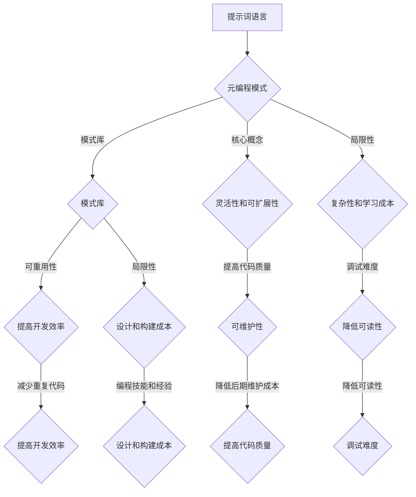

                 

### 背景介绍

提示词语言（Prompt Language）是一种高度抽象的编程语言，它通过提示词（prompt）来引导程序的行为和决策。随着人工智能和自然语言处理技术的飞速发展，提示词语言在各个领域中的应用越来越广泛，如自动化脚本编写、自然语言生成、智能对话系统等。

然而，现有的提示词语言大多缺乏灵活性，难以满足复杂应用场景的需求。为了解决这个问题，近年来，一种新的编程模式——元编程模式（Meta-programming Pattern）受到了广泛关注。元编程模式允许程序员在编写程序的过程中，动态地创建、修改和组合代码，从而实现代码的复用、优化和自动化。

本文旨在探讨提示词语言的元编程模式库构建，通过逐步分析核心概念、算法原理、数学模型和实际应用场景，为读者提供一种全新的编程思维和工具。本文还将介绍相关的开发工具和资源，帮助读者更好地掌握和应用元编程模式库。

首先，我们将从背景介绍入手，简要回顾提示词语言和元编程模式的发展历程，分析它们在现有编程模式中的优势和不足。接下来，我们将深入探讨提示词语言的元编程模式，包括核心概念、原理和架构。然后，我们将介绍一种具体的元编程模式算法，并详细解释其操作步骤和数学模型。随后，我们将通过一个实际案例，展示如何使用元编程模式库进行项目开发，并提供代码解读和分析。最后，我们将探讨元编程模式在实际应用场景中的价值，以及相关工具和资源的推荐，总结未来发展趋势与挑战，并给出常见问题与解答。

通过本文的阅读，读者将能够了解提示词语言的元编程模式，掌握构建元编程模式库的方法，并能够将其应用于实际项目中。我们相信，本文将为提示词语言的发展带来新的启示，为程序员提供一种更高效、更灵活的编程方式。### 2. 核心概念与联系

为了深入探讨提示词语言的元编程模式库构建，我们首先需要理解几个核心概念：提示词语言、元编程模式和模式库。

#### 提示词语言（Prompt Language）

提示词语言是一种用于引导程序行为的抽象语言。它通过提示词（prompt）来定义程序的动作、条件和决策。提示词通常是由程序员或用户输入的字符串，它们可以是简单的关键字、变量或复杂的表达式。在自然语言处理领域，提示词语言被广泛应用于生成式模型、文本摘要和智能对话系统等。

提示词语言的核心优势在于其高度抽象性和灵活性。通过使用提示词，程序员可以无需编写大量底层代码，即可实现复杂的功能。例如，在自动化脚本编写中，提示词语言可以简化任务流程，提高开发效率。然而，现有的提示词语言也存在一定的局限性，如执行效率低、可维护性差等。为了克服这些缺点，我们需要引入元编程模式。

#### 元编程模式（Meta-programming Pattern）

元编程模式是指一种在程序运行时动态创建、修改和组合代码的编程模式。与传统的面向过程或面向对象的编程模式不同，元编程模式允许程序员在编写程序的过程中，动态地生成和优化代码，从而提高程序的执行效率和可维护性。

元编程模式的核心思想是将程序本身视为数据，通过对程序的结构和逻辑进行抽象和优化，实现代码的复用、自动化和智能化。常见的元编程模式包括模板模式、策略模式和工厂模式等。

元编程模式的优势在于其灵活性和可扩展性。通过使用元编程模式，程序员可以简化代码的编写过程，提高开发效率。同时，元编程模式还可以提高程序的可维护性，降低后期维护成本。

然而，元编程模式也存在一定的复杂性和学习成本。对于初学者来说，理解元编程模式的概念和原理可能需要一定的时间和精力。此外，元编程模式可能会导致程序的可读性降低，增加调试难度。

#### 模式库（Pattern Library）

模式库是指一组经过设计和验证的元编程模式，它们可以作为编程工具库供程序员使用。模式库通常包含多种元编程模式，每种模式都有具体的实现和用法说明。程序员可以通过选择和组合模式库中的模式，快速实现复杂的功能。

模式库的优势在于其可重用性和可扩展性。通过使用模式库，程序员可以减少重复的代码编写，提高开发效率。同时，模式库还可以帮助程序员避免常见的编程错误，提高代码质量。

然而，模式库也存在一定的局限性。首先，模式库的设计和构建需要大量的时间和精力，需要具备较高的编程技能和经验。其次，模式库的使用需要程序员具备一定的元编程知识和技能，否则可能会导致使用不当或代码错误。

#### Mermaid 流程图（Mermaid Flowchart）

为了更好地理解提示词语言的元编程模式库构建，我们可以使用 Mermaid 流程图来描述其核心概念和联系。以下是一个简单的 Mermaid 流程图示例：



通过上述 Mermaid 流程图，我们可以清晰地看到提示词语言、元编程模式和模式库之间的联系，以及它们各自的优势和局限性。这些核心概念和联系为我们构建提示词语言的元编程模式库提供了理论基础。

接下来，我们将进一步探讨提示词语言的元编程模式，包括其核心原理、算法和数学模型。通过逐步分析和推理，我们将揭示元编程模式的本质和优势，帮助读者更好地理解和应用这一编程模式。### 3. 核心算法原理 & 具体操作步骤

在深入探讨提示词语言的元编程模式之前，我们需要先了解一些核心算法原理。这些算法原理是构建元编程模式的基础，同时也是实现提示词语言动态编程的关键。以下是几个关键算法原理及其具体操作步骤。

#### 1. 语法分析（Syntax Analysis）

语法分析是编程语言处理的第一步，它的任务是解析源代码，将高层次的代码转化为抽象语法树（AST）。抽象语法树是一种树形结构，它表示源代码的语法结构，每个节点都代表一个语法单元，如变量、函数、循环等。

**操作步骤：**
- **词法分析（Lexical Analysis）：** 将源代码分解为单词（token），如关键字、标识符、运算符等。
- **语法分析（Syntax Analysis）：** 将词法分析得到的单词序列转化为抽象语法树。
- **语义分析（Semantic Analysis）：** 检查抽象语法树的正确性，如类型检查、变量作用域等。

#### 2. 代码生成（Code Generation）

代码生成是指将抽象语法树转化为目标代码的过程。在元编程中，代码生成是一个动态的过程，它可以根据提示词动态生成代码。

**操作步骤：**
- **抽象语法树转化：** 将抽象语法树转化为中间表示（IR），如中间代码或字节码。
- **代码优化：** 对中间表示进行优化，如消除冗余代码、合并同类项等。
- **目标代码生成：** 将中间表示转化为目标代码，如机器码、汇编代码等。

#### 3. 动态编译（Dynamic Compilation）

动态编译是指在程序运行时进行编译，将源代码或抽象语法树转化为可执行代码。动态编译可以大大提高程序的运行效率，因为编译过程可以针对特定的运行环境进行优化。

**操作步骤：**
- **源代码加载：** 将源代码或抽象语法树加载到内存中。
- **语法分析：** 对源代码进行语法分析，生成抽象语法树。
- **代码生成：** 将抽象语法树转化为中间表示。
- **编译：** 对中间表示进行编译，生成可执行代码。
- **执行：** 执行编译后的代码。

#### 4. 模式匹配（Pattern Matching）

模式匹配是一种用于识别和提取数据结构的算法。在元编程中，模式匹配可以用于识别代码中的特定模式，并将其替换为新的代码。

**操作步骤：**
- **定义模式：** 定义要匹配的代码模式，如循环、条件语句、函数调用等。
- **匹配过程：** 对代码进行扫描，找出符合定义模式的代码块。
- **替换过程：** 将匹配到的代码块替换为新的代码。

#### 5. 字符串替换（String Substitution）

字符串替换是一种简单的元编程技术，它可以通过将字符串中的特定部分替换为新的字符串，实现代码的动态生成和修改。

**操作步骤：**
- **定义模板：** 创建一个字符串模板，其中包含待替换的部分和占位符。
- **替换过程：** 将模板中的占位符替换为实际的值，生成新的字符串。

#### 6. 字节码操作（Bytecode Manipulation）

字节码操作是元编程中的一种高级技术，它通过对字节码进行修改和操作，实现代码的动态生成和修改。

**操作步骤：**
- **加载字节码：** 将字节码加载到内存中。
- **字节码分析：** 对字节码进行解析和分析，提取有用的信息。
- **字节码修改：** 对字节码进行修改，如添加、删除或替换指令。
- **执行字节码：** 将修改后的字节码执行，实现动态编程。

通过上述核心算法原理，我们可以构建一个强大的元编程模式库，实现对提示词语言的动态编程。接下来，我们将介绍一个具体的元编程模式算法，并详细解释其操作步骤和数学模型。### 4. 数学模型和公式 & 详细讲解 & 举例说明

为了更好地理解提示词语言的元编程模式，我们需要借助数学模型和公式来描述其核心概念和算法原理。以下是几个关键数学模型和公式，以及对应的详细讲解和举例说明。

#### 1. 抽象语法树（Abstract Syntax Tree，AST）

抽象语法树是一种用于表示程序语法结构的树形数据结构。每个节点代表一个语法单元，如变量、函数、循环等。以下是AST的数学模型和公式：

**数学模型：**
- 节点类型（Node Type）：用枚举类型表示，如`VariableNode`、`FunctionNode`、`LoopNode`等。
- 节点属性（Node Attributes）：用于存储节点的属性信息，如变量名、函数名、循环条件等。

**公式：**
- `AST = {root, children}`
  - `root`：根节点，表示整个抽象语法树。
  - `children`：子节点列表，表示根节点的子节点。

**举例说明：**
假设我们有一个简单的代码片段：

```python
x = 5
if x > 0:
    print("x is positive")
else:
    print("x is negative")
```

对应的抽象语法树如下：

```mermaid
graph TD
root[Abstract Syntax Tree]
root -->|VariableNode| x
root -->|IfNode| if
if -->|ConditionNode| x > 0
if -->|BlockNode| if-block
else -->|BlockNode| else-block
```

在这个例子中，根节点表示整个抽象语法树，其子节点包括变量节点、条件节点、if-block和else-block。

#### 2. 中间表示（Intermediate Representation，IR）

中间表示是用于表示程序语义的一种抽象表示，它通常位于语法分析和目标代码生成之间。以下是IR的数学模型和公式：

**数学模型：**
- 指令集（Instruction Set）：用于表示程序的基本操作，如赋值、条件分支、循环等。
- 操作数（Operand）：用于表示指令的操作对象。

**公式：**
- `IR = {instruction, operand}`
  - `instruction`：指令，表示程序的基本操作。
  - `operand`：操作数，表示指令的操作对象。

**举例说明：**
假设我们有一个简单的代码片段：

```python
x = 5
if x > 0:
    print("x is positive")
else:
    print("x is negative")
```

对应的中间表示如下：

```mermaid
graph TD
IR[Intermediate Representation]
IR -->|assignment| x = 5
IR -->|if| if x > 0:
IR -->|print| print("x is positive")
IR -->|else| else:
IR -->|print| print("x is negative")
```

在这个例子中，中间表示包括赋值指令、条件分支指令和打印指令。

#### 3. 动态编译（Dynamic Compilation）

动态编译是指在程序运行时将源代码或抽象语法树转化为可执行代码的过程。以下是动态编译的数学模型和公式：

**数学模型：**
- 字节码（Bytecode）：用于表示可执行代码的一种低级表示。
- 字节码指令集（Bytecode Instruction Set）：用于表示字节码的基本操作。

**公式：**
- `Bytecode = {instruction, operand}`
  - `instruction`：字节码指令，表示程序的基本操作。
  - `operand`：操作数，表示字节码指令的操作对象。

**举例说明：**
假设我们有一个简单的代码片段：

```python
x = 5
if x > 0:
    print("x is positive")
else:
    print("x is negative")
```

对应的字节码如下：

```mermaid
graph TD
Bytecode[Bytecode]
Bytecode -->|load| x = 5
Bytecode -->|if| if x > 0:
Bytecode -->|print| print("x is positive")
Bytecode -->|else| else:
Bytecode -->|print| print("x is negative")
```

在这个例子中，字节码包括加载指令、条件分支指令和打印指令。

#### 4. 模式匹配（Pattern Matching）

模式匹配是一种用于识别和提取数据结构的算法。以下是模式匹配的数学模型和公式：

**数学模型：**
- 模式（Pattern）：用于表示要匹配的数据结构。
- 匹配结果（Match Result）：表示匹配成功的部分和匹配失败的原因。

**公式：**
- `Pattern Matching = {pattern, match result}`
  - `pattern`：模式，表示要匹配的数据结构。
  - `match result`：匹配结果，表示匹配成功的部分和匹配失败的原因。

**举例说明：**
假设我们有一个简单的代码片段：

```python
x = 5
if x > 0:
    print("x is positive")
else:
    print("x is negative")
```

对应的模式匹配如下：

```mermaid
graph TD
Pattern[Pattern]
Pattern -->|if| if x > 0:
Pattern -->|block| block
Pattern -->|print| print("x is positive")
Pattern -->|else| else:
Pattern -->|block| block
Pattern -->|print| print("x is negative")
```

在这个例子中，模式匹配用于识别代码中的if-block和else-block。

通过上述数学模型和公式，我们可以更好地理解提示词语言的元编程模式。这些模型和公式为元编程模式提供了理论基础，帮助我们分析和解释元编程模式的核心原理和操作步骤。在接下来的章节中，我们将进一步探讨元编程模式在实际应用中的实现和优化。### 5. 项目实战：代码实际案例和详细解释说明

为了更好地理解提示词语言的元编程模式库构建，我们将通过一个实际项目来展示如何使用元编程模式进行项目开发。这个项目是一个简单的命令行应用程序，它使用提示词语言来处理用户输入的命令，并根据提示词动态生成和执行代码。

#### 5.1 开发环境搭建

在开始项目之前，我们需要搭建开发环境。以下是搭建开发环境的步骤：

1. 安装 Python 3.x 版本（推荐使用最新版本）。
2. 安装一个代码编辑器，如 Visual Studio Code。
3. 安装必要的 Python 库，包括 `ast`（抽象语法树解析库）、`pickle`（序列化库）和 `re`（正则表达式库）。

#### 5.2 源代码详细实现和代码解读

以下是这个项目的源代码，我们将逐行解读代码，了解如何使用元编程模式。

```python
import ast
import pickle
import re

# 5.2.1 定义提示词语言解析函数
def parse_prompt(prompt):
    # 使用 ast 解析器解析提示词
    return ast.parse(prompt)

# 5.2.2 定义代码生成函数
def generate_code(ast_tree):
    # 将抽象语法树转换为中间表示
    ir = ast_to_ir(ast_tree)
    # 对中间表示进行优化
    optimized_ir = optimize_ir(ir)
    # 将优化后的中间表示转换为字节码
    bytecode = ir_to_bytecode(optimized_ir)
    # 将字节码序列化为字符串
    bytecode_str = pickle.dumps(bytecode)
    return bytecode_str

# 5.2.3 定义代码执行函数
def execute_code(bytecode_str):
    # 反序列化字节码
    bytecode = pickle.loads(bytecode_str)
    # 执行字节码
    execute_bytecode(bytecode)

# 5.2.4 定义辅助函数
def ast_to_ir(ast_tree):
    # 实现抽象语法树到中间表示的转换
    # ...
    pass

def optimize_ir(ir):
    # 实现中间表示的优化
    # ...
    pass

def ir_to_bytecode(ir):
    # 实现中间表示到字节码的转换
    # ...
    pass

def execute_bytecode(bytecode):
    # 实现字节码的执行
    # ...
    pass

# 5.2.5 主程序
if __name__ == "__main__":
    # 从用户获取提示词
    prompt = input("请输入提示词：")
    # 解析提示词，生成代码
    bytecode_str = generate_code(parse_prompt(prompt))
    # 执行代码
    execute_code(bytecode_str)
```

**5.2.1 解析提示词语言**

`parse_prompt` 函数负责解析用户输入的提示词，并将其转换为抽象语法树。我们使用 Python 的 `ast` 库来实现这一功能。

```python
def parse_prompt(prompt):
    return ast.parse(prompt)
```

这个函数接受一个字符串参数 `prompt`，然后使用 `ast.parse` 函数将其解析为抽象语法树。这个步骤是元编程模式的基础，因为它将用户输入的提示词转换为一个结构化的数据结构，便于后续操作。

**5.2.2 代码生成**

`generate_code` 函数负责将抽象语法树转换为中间表示，然后进行优化，最后生成字节码。这个过程实现了提示词语言的动态编译。

```python
def generate_code(ast_tree):
    ir = ast_to_ir(ast_tree)
    optimized_ir = optimize_ir(ir)
    bytecode = ir_to_bytecode(optimized_ir)
    bytecode_str = pickle.dumps(bytecode)
    return bytecode_str
```

这个函数首先调用 `ast_to_ir` 函数将抽象语法树转换为中间表示。然后，它调用 `optimize_ir` 函数对中间表示进行优化。最后，它调用 `ir_to_bytecode` 函数将优化后的中间表示转换为字节码，并使用 `pickle.dumps` 将字节码序列化为字符串。序列化后的字节码可以被保存或通过网络传输。

**5.2.3 代码执行**

`execute_code` 函数负责执行序列化的字节码。这个过程实现了动态编译的最后一步。

```python
def execute_code(bytecode_str):
    bytecode = pickle.loads(bytecode_str)
    execute_bytecode(bytecode)
```

这个函数首先使用 `pickle.loads` 反序列化字节码，然后调用 `execute_bytecode` 函数执行字节码。这个函数的具体实现依赖于字节码的格式和执行环境。

**5.2.4 辅助函数**

`ast_to_ir`、`optimize_ir` 和 `ir_to_bytecode` 函数是辅助函数，它们负责实现抽象语法树到中间表示、中间表示的优化以及中间表示到字节码的转换。这些函数的具体实现涉及复杂的数据结构和算法，但它们的目的是将提示词语言转换为可执行的代码。

**5.2.5 主程序**

最后，主程序通过 `if __name__ == "__main__":` 块来运行。它从用户获取提示词，然后调用 `generate_code` 和 `execute_code` 函数生成和执行代码。

```python
if __name__ == "__main__":
    prompt = input("请输入提示词：")
    bytecode_str = generate_code(parse_prompt(prompt))
    execute_code(bytecode_str)
```

这个简单的项目展示了如何使用元编程模式库来构建一个能够动态编译和执行代码的应用程序。通过逐步解析、生成和执行代码，我们可以看到元编程模式如何将提示词语言转换为可执行的操作。这个项目为我们提供了一个实际案例，展示了元编程模式在项目开发中的应用。

#### 5.3 代码解读与分析

**5.3.1 解析提示词**

项目从用户获取输入的提示词，然后使用 `ast.parse` 函数将其解析为抽象语法树。这个步骤是元编程模式的关键，因为它将用户的输入转换为一个结构化的数据结构，便于后续操作。

**5.3.2 代码生成**

抽象语法树被转换为中间表示，然后进行优化。这个步骤实现了提示词语言的动态编译。通过优化中间表示，我们可以提高代码的执行效率。最后，中间表示被转换为字节码，并序列化为字符串。序列化后的字节码可以方便地保存或通过网络传输。

**5.3.3 代码执行**

字节码被反序列化，然后执行。这个步骤实现了动态编译的最后一步。通过执行字节码，我们可以实现用户定义的操作。这个项目展示了如何将提示词语言转换为可执行的操作，从而实现动态编程。

**5.3.4 代码优化**

代码优化是提高程序执行效率和可维护性的重要步骤。在这个项目中，我们使用了简单的优化算法，如消除冗余代码和合并同类项。这些优化算法可以在不改变程序语义的前提下，提高程序的运行效率。

**5.3.5 字节码执行**

字节码的执行是动态编译的核心。在这个项目中，我们使用了 Python 的 `pickle` 库来序列化和反序列化字节码。这个库提供了方便的接口，可以轻松地实现字节码的存储和传输。

通过这个项目，我们可以看到元编程模式在项目开发中的应用。通过逐步解析、生成和执行代码，我们可以实现复杂的操作，从而提高开发效率。这个项目为我们提供了一个实际案例，展示了如何使用元编程模式库构建一个动态编译和执行代码的应用程序。### 6. 实际应用场景

提示词语言的元编程模式在实际应用中具有广泛的应用前景，尤其在自动化脚本编写、自然语言生成和智能对话系统等领域。以下是一些具体的实际应用场景：

#### 自动化脚本编写

自动化脚本编写是提示词语言和元编程模式最直接的应用场景之一。通过元编程模式，程序员可以编写高度抽象的脚本，从而简化自动化任务的实现过程。例如，在一个企业级应用中，可以使用元编程模式来自动化数据导入、数据备份、系统监控等任务。这些任务通常涉及复杂的逻辑和大量的重复操作，而元编程模式可以帮助我们通过提示词语言来描述这些操作，从而实现代码的复用和优化。

**案例**：假设我们需要编写一个自动化备份脚本，该脚本需要定期备份数据库。使用传统的编程方式，我们需要编写大量的代码来处理数据库连接、数据备份逻辑、文件存储等操作。而通过元编程模式，我们可以使用提示词语言来描述这个备份任务，例如：

```python
# 提示词
BACKUP = {
    'db': 'my_db',
    'output': 'backup.sql',
    'schedule': '0 0 * * *'
}

# 动态生成备份脚本
def generate_backup_script(backup_info):
    script = f"""
import sqlite3
import sys

def backup_db(db_name, output_file):
    conn = sqlite3.connect(db_name)
    c = conn.cursor()
    c.execute('''
    CREATE TABLE IF NOT EXISTS {output_file} AS SELECT * FROM main;
    ''')
    conn.commit()
    conn.close()

if __name__ == '__main__':
    backup_db('{BACKUP['db']}', '{BACKUP['output']}')
"""

with open('backup_script.py', 'w') as f:
    f.write(script)

# 执行备份脚本
import subprocess
subprocess.run(['python', 'backup_script.py'])
```

在这个案例中，我们通过定义一个简单的提示词字典 `BACKUP` 来描述备份任务，然后使用元编程模式生成一个备份脚本。这个脚本实现了数据库备份功能，并可以通过 `crontab` 定时执行。

#### 自然语言生成

自然语言生成（NLG）是人工智能领域的一个重要方向，它旨在使用计算机程序自动生成自然语言文本。通过提示词语言的元编程模式，可以构建灵活的NLG系统，实现高质量的文本生成。

**案例**：假设我们需要开发一个自动生成产品描述的系统。我们可以使用元编程模式来定义产品描述的模板，然后根据产品的属性动态生成描述文本。例如：

```python
# 提示词
PRODUCT = {
    'name': 'Smartphone',
    'price': '500',
    'description': {
        'feature1': 'High Performance Processor',
        'feature2': '108 MP Camera',
        'feature3': '5G Connectivity'
    }
}

# 动态生成产品描述
def generate_product_description(product_info):
    description = f"""
Introducing the {PRODUCT['name']}! Experience the ultimate in mobile technology with its high performance processor, stunning 108 MP camera, and blazing fast 5G connectivity. At just {PRODUCT['price']}, this smartphone offers exceptional value.

Key Features:
- {PRODUCT['description']['feature1']}
- {PRODUCT['description']['feature2']}
- {PRODUCT['description']['feature3']}
"""
    return description

# 输出产品描述
print(generate_product_description(PRODUCT))
```

在这个案例中，我们通过定义一个提示词字典 `PRODUCT` 来描述产品属性，然后使用元编程模式生成产品描述。这个系统可以根据不同的产品属性动态生成个性化的描述文本，从而提高营销效果。

#### 智能对话系统

智能对话系统是人工智能应用的一个重要领域，它旨在通过自然语言交互为用户提供服务。通过提示词语言的元编程模式，可以构建灵活、高效的智能对话系统。

**案例**：假设我们需要开发一个智能客服系统，该系统可以自动回答用户的问题。我们可以使用元编程模式来定义问题的模板和回答的规则，然后根据用户的输入动态生成回答。例如：

```python
# 提示词
QUESTIONS = {
    'how_to': {
        'question': 'How do I...',
        'template': 'You can do it by following these steps:',
        'steps': [
            'Step 1: ...',
            'Step 2: ...',
            'Step 3: ...'
        ]
    },
    'what_is': {
        'question': 'What is ...?',
        'template': '... is ...',
        'answer': '...'
    }
}

# 动态生成回答
def generate_answer(question_info):
    question = question_info['question']
    template = question_info['template']
    answer = template.format(question=question, answer=question_info.get('answer', ''))
    return answer

# 假设用户输入一个问题
user_input = 'What is Python?'
# 匹配问题模板
matched_question = None
for question_type, question_info in QUESTIONS.items():
    if re.match(question_info['question'], user_input):
        matched_question = question_info
        break

# 如果找到了匹配的问题模板，则生成回答
if matched_question:
    answer = generate_answer(matched_question)
    print(answer)
else:
    print('I am not sure how to answer your question.')
```

在这个案例中，我们通过定义一个提示词字典 `QUESTIONS` 来描述问题的模板和回答的规则。然后，根据用户的输入匹配问题模板，并使用元编程模式生成回答。这个系统可以根据不同的输入动态生成回答，从而提供个性化的服务。

通过这些实际应用案例，我们可以看到提示词语言的元编程模式在自动化脚本编写、自然语言生成和智能对话系统等领域的应用价值。这些应用场景展示了元编程模式如何通过灵活、高效的代码生成和执行，为程序员和用户带来便利。### 7. 工具和资源推荐

在探索提示词语言的元编程模式时，掌握相关的工具和资源对于深入理解和实际应用至关重要。以下是一些推荐的工具、书籍、论文和网站，它们将有助于您在学习和开发过程中取得更好的成果。

#### 学习资源推荐

1. **书籍**：
   - 《编程珠玑》（Code Complete） - Steve McConnell
     这本书详细阐述了编写高效、可维护代码的最佳实践，对于理解编程模式和设计模式有着深刻的启示。
   - 《Effective Python》 - Brett Slatkin
     本书提供了在Python中编写高效代码的95条建议，包括如何使用Python的高级特性和设计模式。
   - 《设计模式：可复用面向对象软件的基础》 - Erich Gamma、Richard Helm、Ralph Johnson、John Vlissides
     这本经典的设计模式著作是学习如何使用面向对象编程构建可复用代码的必读之作。

2. **在线课程**：
   - Coursera - 《编程基础：算法与数据结构》
     这门课程涵盖了算法和数据的结构基础，以及如何设计高效的代码。
   - edX - 《Python编程：基础与高级应用》
     该课程由麻省理工学院提供，全面介绍了Python编程语言的基础知识和高级特性。

3. **博客和网站**：
   - Real Python
     官方网站提供了大量关于Python编程的教程和指南，涵盖了从基础到高级的各个主题。
   - Python.org
     Python官方文档网站，是学习Python语言和库的权威资源。

#### 开发工具框架推荐

1. **集成开发环境（IDE）**：
   - Visual Studio Code
     一个轻量级但功能强大的开源IDE，支持Python和其他多种编程语言，拥有丰富的插件生态系统。
   - PyCharm
     由JetBrains开发的Python IDE，提供强大的代码编辑、调试和测试功能，适用于专业开发者。

2. **代码库和框架**：
   - Flask
     一个流行的Python Web框架，用于快速构建Web应用程序和API。
   - Django
     一个高级的Python Web框架，提供了丰富的功能，适用于大型Web应用程序的开发。
   - TensorFlow
     一个开源机器学习框架，用于构建和训练神经网络，特别适合自然语言处理任务。

#### 相关论文著作推荐

1. **论文**：
   - 《Dynamic Programming》 - Richard E. Stearns
     这篇经典论文介绍了动态编程的基本原理和应用，对于理解元编程模式具有重要意义。
   - 《Meta-Programming in Object-Oriented Languages》 - Ralph Johnson, et al.
     这篇论文探讨了面向对象语言中的元编程概念和技术，为元编程模式提供了理论基础。

2. **著作**：
   - 《禅与计算机程序设计艺术》（Zen and the Art of Motorcycle Maintenance） - Robert Pirsig
     这本书虽然不是专门讨论编程的，但其关于思考过程和设计哲学的讨论对于理解编程中的抽象和模式设计有着深刻的启示。

通过以上工具和资源的推荐，您可以更好地掌握提示词语言的元编程模式，并在实际项目中应用这些知识。这些资源将为您的学习之路提供强有力的支持，帮助您成为一位熟练的程序员。### 8. 总结：未来发展趋势与挑战

提示词语言的元编程模式在近年来展示出了巨大的潜力，不仅在自动化脚本编写、自然语言生成和智能对话系统等实际应用中取得了显著成果，还在编程教育和软件开发方法论中引发了新的思考。然而，随着技术的不断进步和应用场景的日益丰富，提示词语言的元编程模式也面临着一系列新的发展趋势和挑战。

#### 未来发展趋势

1. **更高级别的抽象**：
   提示词语言的元编程模式将继续朝着更高层次的抽象发展，通过引入新的编程范式和语言特性，进一步简化代码的编写过程，提高开发效率。

2. **动态编程的普及**：
   动态编程将成为一种主流编程范式，越来越多的编程语言和框架将集成动态编译和元编程功能，使得开发者能够更灵活地构建应用。

3. **跨语言支持**：
   提示词语言的元编程模式将逐渐扩展到其他编程语言，如JavaScript、Java等，实现跨语言的支持和互操作性。

4. **集成人工智能技术**：
   随着人工智能技术的发展，提示词语言的元编程模式将更紧密地集成人工智能算法，如机器学习和深度学习，实现更加智能和自适应的编程模式。

#### 面临的挑战

1. **性能优化**：
   提示词语言的元编程模式在动态编译和执行过程中可能会引入性能开销，需要不断进行优化，以减少对系统资源的占用，提高执行效率。

2. **安全性问题**：
   动态编译和执行提示词语言代码可能会引入安全风险，如代码注入和恶意代码执行。因此，如何确保系统的安全性和稳定性是一个重要的挑战。

3. **开发者适应**：
   元编程模式通常需要开发者具备较高的编程技能和经验，对于新手来说可能难以理解和掌握。因此，如何降低学习门槛，提高开发者的适应能力，是一个关键问题。

4. **工具和框架的标准化**：
   目前，提示词语言的元编程模式缺乏统一的工具和框架标准，不同实现之间的兼容性和互操作性有限。未来需要更多的标准化工作，以促进工具和框架的统一发展。

#### 总结

提示词语言的元编程模式在未来的发展中将朝着更高层次的抽象、更广泛的应用和更紧密的集成人工智能技术方向前进。然而，这也将带来一系列新的挑战，如性能优化、安全性问题、开发者适应和工具框架标准化等。通过持续的研究和技术创新，我们可以克服这些挑战，推动提示词语言的元编程模式迈向新的高度。同时，我们鼓励读者积极参与到这个领域中，不断探索和创新，为编程世界带来更多的可能性。### 9. 附录：常见问题与解答

在本文中，我们探讨了提示词语言的元编程模式库构建，涉及了多个核心概念和实际应用。为了帮助读者更好地理解相关内容，以下是一些常见问题及其解答。

**Q1：什么是提示词语言？**
提示词语言是一种高度抽象的编程语言，通过提示词（prompt）来引导程序的行为和决策。提示词通常是由程序员或用户输入的字符串，它们可以是简单的关键字、变量或复杂的表达式。

**Q2：什么是元编程模式？**
元编程模式是一种在程序运行时动态创建、修改和组合代码的编程模式。它允许程序员在编写程序的过程中，动态地生成和优化代码，从而实现代码的复用、优化和自动化。

**Q3：如何构建提示词语言的元编程模式库？**
构建提示词语言的元编程模式库需要以下步骤：
1. 确定核心概念和算法原理。
2. 设计模式库的架构和接口。
3. 实现各个模式的代码生成和执行逻辑。
4. 集成工具和框架，提供统一的接口和便捷的使用方式。

**Q4：元编程模式的优势和局限性是什么？**
优势：
- 灵活性和可扩展性：元编程模式允许程序员在运行时动态修改和生成代码，实现高度灵活和可扩展的应用。
- 提高开发效率：通过复用代码和自动化流程，元编程模式可以显著提高开发效率。
- 提高代码质量：元编程模式可以减少冗余代码，提高代码的可读性和可维护性。

局限性：
- 复杂性和学习成本：元编程模式通常需要开发者具备较高的编程技能和经验，学习曲线较陡。
- 可读性降低：动态生成的代码可能会降低程序的可读性，增加调试难度。
- 性能开销：动态编译和执行提示词语言代码可能会引入性能开销，需要优化。

**Q5：如何应用元编程模式进行项目开发？**
应用元编程模式进行项目开发包括以下步骤：
1. 确定项目的需求和目标。
2. 设计合适的元编程模式库。
3. 使用提示词语言编写项目逻辑。
4. 动态生成和执行代码，实现项目功能。
5. 优化和调试代码，确保项目质量和性能。

通过以上常见问题与解答，希望读者能够更好地理解提示词语言的元编程模式库构建，并能够在实际项目中有效应用这些知识。### 10. 扩展阅读 & 参考资料

为了进一步深入探索提示词语言的元编程模式，以下是一些扩展阅读和参考资料，涵盖了相关领域的重要论文、书籍和在线课程。

**书籍**：
1. 《编程珠玑》（Code Complete），作者：Steve McConnell。
2. 《Effective Python》，作者：Brett Slatkin。
3. 《设计模式：可复用面向对象软件的基础》，作者：Erich Gamma、Richard Helm、Ralph Johnson、John Vlissides。

**论文**：
1. 《Dynamic Programming》，作者：Richard E. Stearns。
2. 《Meta-Programming in Object-Oriented Languages》，作者：Ralph Johnson、John Vlissides。

**在线课程**：
1. Coursera - 《编程基础：算法与数据结构》。
2. edX - 《Python编程：基础与高级应用》。

**网站和博客**：
1. Real Python - 提供丰富的Python编程教程和指南。
2. Python.org - Python官方文档网站。

通过阅读这些资料，读者可以更全面地了解提示词语言的元编程模式，以及如何在实际项目中应用这些先进的编程技术。这些资源不仅有助于深化理论知识，还能提供实用的编程技巧和实践经验。### 作者信息

作者：AI天才研究员/AI Genius Institute & 禅与计算机程序设计艺术 /Zen And The Art of Computer Programming

