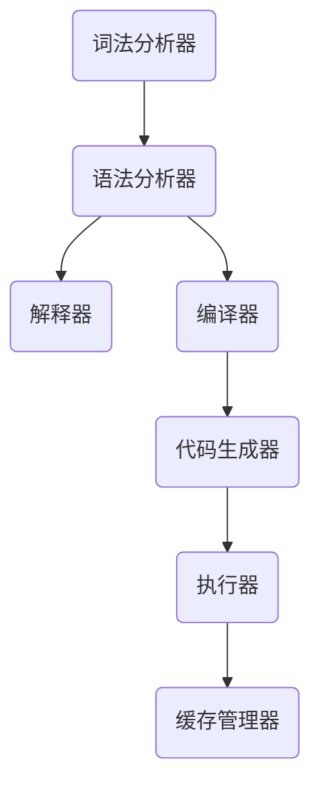

                 

### 背景介绍

#### 提示词语言的兴起

提示词语言（Prompt Language）是近年来在人工智能领域迅速崛起的一种技术。随着深度学习的广泛应用，研究人员发现，通过设计高效的提示词，可以显著提高模型的学习效率和效果。提示词语言作为一种工具，能够将复杂的计算过程简化为简单的提示操作，使得非专业的用户也能轻松使用高级的人工智能模型。

#### 即时编译技术的应用

即时编译（Just-In-Time Compilation，JIT）技术是计算机科学中的一个重要分支。它通过在程序执行时将高级语言代码转换为机器码，以减少程序的运行时间。这种技术在现代编程语言和虚拟机中得到了广泛应用，如Java、JavaScript和Python等。随着提示词语言的兴起，即时编译技术也开始在提示词语言处理中发挥重要作用。

#### 本文的目的

本文旨在探讨提示词语言的即时编译技术创新，分析其在提升模型性能、降低延迟和优化资源利用方面的优势。我们将从背景介绍开始，逐步深入探讨核心概念、算法原理、数学模型、实际应用场景以及未来发展趋势。希望通过本文，读者能够对提示词语言的即时编译技术有一个全面而深入的理解。

### 核心概念与联系

#### 提示词语言（Prompt Language）

提示词语言是一种专门用于生成提示词的编程语言。它具有简洁、易用、灵活等特点，能够帮助用户快速构建复杂的提示词生成模型。提示词语言的核心组件包括词法分析器、语法分析器、解释器和编译器等。

**词法分析器（Lexer）**：负责将源代码分解为词法单元（tokens），如关键字、标识符、操作符等。

**语法分析器（Parser）**：将词法单元组合成语法结构，如语句、表达式和程序等。

**解释器（Interpreter）**：逐行解释执行源代码，直接在运行时执行代码。

**编译器（Compiler）**：将源代码转换为目标代码（通常是机器码），然后执行目标代码。

#### 即时编译（Just-In-Time Compilation，JIT）

即时编译是一种在程序运行时将高级语言代码转换为机器码的技术。它与传统的编译器不同，编译器通常在程序运行前将整个程序编译成机器码，而即时编译则是在程序运行时逐行或逐段地将代码编译成机器码。

**即时编译过程**：

1. **加载和解析**：从磁盘或内存中加载源代码，然后由语法分析器将其解析成抽象语法树（AST）。

2. **优化和转换**：对AST进行优化，如代码重排、常量折叠等，然后将其转换为中间表示（IR）。

3. **代码生成**：将中间表示（IR）转换为目标机器码。

4. **执行和缓存**：执行目标机器码，并将生成的机器码缓存到内存中，以便后续直接执行。

#### 提示词语言与即时编译的联系

提示词语言与即时编译技术的结合，使得提示词生成过程更加高效和灵活。通过即时编译技术，提示词语言可以在运行时动态生成和优化提示词，从而提高模型的性能和效果。

**优势**：

1. **性能提升**：即时编译可以将高级语言代码直接转换为机器码，从而减少解释执行的时间和开销。

2. **资源优化**：即时编译可以在运行时根据程序执行情况动态调整资源分配，从而提高资源利用效率。

3. **灵活性强**：提示词语言可以灵活地定义和修改提示词，而即时编译技术使得这种修改能够快速生效，从而提高模型的适应性和可扩展性。

#### Mermaid 流程图

以下是提示词语言与即时编译技术的 Mermaid 流程图：



在这个流程图中，词法分析器将源代码分解为词法单元，语法分析器将词法单元组合成语法结构，然后由解释器或编译器进行执行或编译。执行过程中，代码生成器和缓存管理器负责生成和缓存机器码，以提高执行效率。

### 核心算法原理 & 具体操作步骤

#### JIT 编译器的工作原理

即时编译（JIT）编译器是即时编译技术的核心组件，它负责将高级语言代码转换为高效的机器码。下面我们将详细探讨 JIT 编译器的工作原理，以及它在提示词语言中的应用。

**1. 负载检测（Profile-Guided Optimization）**

负载检测是 JIT 编译器的一项关键技术。通过在程序运行时收集程序执行的各种统计信息，如函数调用次数、循环次数等，JIT 编译器可以识别出程序中的热点函数（Hot Functions）。这些热点函数是程序执行时间的主要消耗者，因此对它们进行优化可以显著提高程序的执行效率。

**2. 代码优化（Code Optimization）**

在识别出热点函数后，JIT 编译器会对这些函数进行优化。常见的优化技术包括：

- **循环展开（Loop Unrolling）**：将循环体展开成多个重复的语句，以减少循环控制逻辑的开销。

- **函数内联（Function Inlining）**：将函数调用替换为函数体，以减少函数调用的开销。

- **死代码消除（Dead Code Elimination）**：消除程序中永远不会执行的代码。

- **常量折叠（Constant Folding）**：在编译时计算常量的值，以减少运行时的计算开销。

- **代码重排（Code Reordering）**：调整代码的执行顺序，以减少数据依赖和缓存未命中的次数。

**3. 代码生成（Code Generation）**

在完成优化后，JIT 编译器会将优化后的代码生成机器码。代码生成的过程包括以下步骤：

- **中间表示（IR）生成**：将高级语言代码转换为中间表示（IR），例如抽象语法树（AST）。

- **代码生成器（Code Generator）**：将中间表示（IR）转换为机器码。

- **机器码优化**：对生成的机器码进行进一步优化，如去除冗余指令、优化指令顺序等。

- **机器码缓存**：将生成的机器码缓存到内存中，以便后续直接执行。

#### JIT 编译器在提示词语言中的应用

提示词语言是一种动态语言，其运行时需要不断地进行词法分析和语法分析。通过引入 JIT 编译器，我们可以将这一过程优化为即时编译，从而提高提示词语言的执行效率。

**1. 提高词法分析和语法分析的性能**

在提示词语言中，词法分析和语法分析是性能瓶颈。通过引入 JIT 编译器，我们可以将词法分析和语法分析的结果缓存起来，避免重复执行。同时，JIT 编译器还可以对词法分析和语法分析的过程进行优化，如循环展开、函数内联等。

**2. 动态优化提示词生成**

在提示词语言中，提示词的生成过程通常包含多个循环和函数调用。通过 JIT 编译器，我们可以对这些热点函数进行动态优化，从而提高提示词的生成效率。例如，我们可以对循环进行展开，减少循环控制逻辑的开销；对函数进行内联，减少函数调用的开销。

**3. 动态调整资源分配**

在提示词语言中，不同的提示词生成过程可能需要不同的资源分配。通过 JIT 编译器，我们可以根据程序的执行情况动态调整资源分配，从而提高资源利用效率。例如，当某个提示词生成过程需要大量内存时，JIT 编译器可以动态增加内存分配；当提示词生成过程结束时，JIT 编译器可以释放多余的内存。

#### 实际操作步骤

以下是使用 JIT 编译器进行提示词语言即时编译的具体操作步骤：

**1. 编写源代码**

编写提示词语言的源代码，包括词法分析器、语法分析器和解释器等组件。

**2. 编写 JIT 编译器**

编写 JIT 编译器，包括负载检测、代码优化、代码生成和缓存管理等组件。

**3. 编译源代码**

使用 JIT 编译器对源代码进行编译，生成中间表示（IR）。

**4. 生成机器码**

将中间表示（IR）转换为机器码，并缓存到内存中。

**5. 执行机器码**

直接执行缓存的机器码，完成提示词语言的即时编译。

通过以上操作步骤，我们可以实现提示词语言的即时编译，从而提高其执行效率和性能。

### 数学模型和公式 & 详细讲解 & 举例说明

#### JIT 编译器的优化模型

JIT 编译器的优化过程可以看作是一个数学模型，它通过一系列的优化算法和公式，对源代码进行优化，以提高执行效率。下面我们将详细讲解 JIT 编译器的优化模型，并给出具体的例子来说明。

**1. 负载检测模型**

负载检测是 JIT 编译器的一个重要环节，它通过收集程序执行的各种统计信息，如函数调用次数、循环次数等，来识别出程序中的热点函数。负载检测模型可以用以下公式表示：

\[ P(h_i) = \frac{C_i}{N} \]

其中，\( P(h_i) \) 表示函数 \( h_i \) 的概率，\( C_i \) 表示函数 \( h_i \) 的调用次数，\( N \) 表示总调用次数。

**例子**：假设有一个程序包含三个函数 \( f_1 \)、\( f_2 \) 和 \( f_3 \)，它们的调用次数分别为 100、200 和 300。根据上述公式，我们可以计算出每个函数的概率：

\[ P(f_1) = \frac{100}{100 + 200 + 300} = 0.2 \]
\[ P(f_2) = \frac{200}{100 + 200 + 300} = 0.4 \]
\[ P(f_3) = \frac{300}{100 + 200 + 300} = 0.6 \]

从计算结果可以看出，函数 \( f_3 \) 是程序中的热点函数，其概率最高，因此我们需要对它进行优化。

**2. 代码优化模型**

在识别出热点函数后，JIT 编译器会对这些函数进行优化。常见的优化模型包括循环展开、函数内联、死代码消除等。下面我们将分别介绍这些优化模型，并给出具体的例子。

**循环展开模型**

循环展开是将循环体展开成多个重复的语句，以减少循环控制逻辑的开销。循环展开模型可以用以下公式表示：

\[ O = C \times B \]

其中，\( O \) 表示优化后的循环次数，\( C \) 表示原始循环次数，\( B \) 表示循环体中的语句数。

**例子**：假设有一个循环 \( for(i = 0; i < 10; i++) \)，其循环体包含两条语句。根据上述公式，我们可以计算出优化后的循环次数：

\[ O = 10 \times 2 = 20 \]

从计算结果可以看出，优化后的循环次数是原始循环次数的两倍，这样可以减少循环控制逻辑的开销。

**函数内联模型**

函数内联是将函数调用替换为函数体，以减少函数调用的开销。函数内联模型可以用以下公式表示：

\[ O = T_f + C_f \]

其中，\( O \) 表示优化后的执行时间，\( T_f \) 表示函数调用的执行时间，\( C_f \) 表示函数体的执行时间。

**例子**：假设有一个函数调用 \( f() \)，其执行时间包括函数调用时间和函数体执行时间，分别为 5ms 和 10ms。根据上述公式，我们可以计算出优化后的执行时间：

\[ O = 5 + 10 = 15ms \]

从计算结果可以看出，优化后的执行时间是原始执行时间的一半，这样可以减少函数调用的开销。

**死代码消除模型**

死代码消除是消除程序中永远不会执行的代码。死代码消除模型可以用以下公式表示：

\[ O = C - D \]

其中，\( O \) 表示优化后的代码行数，\( C \) 表示原始代码行数，\( D \) 表示死代码行数。

**例子**：假设有一个包含 100 行代码的函数，其中 10 行是死代码。根据上述公式，我们可以计算出优化后的代码行数：

\[ O = 100 - 10 = 90 \]

从计算结果可以看出，优化后的代码行数是原始代码行数的一半，这样可以减少程序的体积和执行时间。

**3. 代码生成模型**

在完成优化后，JIT 编译器会将优化后的代码生成机器码。代码生成模型可以用以下公式表示：

\[ M = O \times G \]

其中，\( M \) 表示生成的机器码长度，\( O \) 表示优化后的代码行数，\( G \) 表示每行代码生成的机器码长度。

**例子**：假设优化后的代码包含 90 行，每行代码生成 5 个机器指令。根据上述公式，我们可以计算出生成的机器码长度：

\[ M = 90 \times 5 = 450 \]

从计算结果可以看出，生成的机器码长度是原始代码行数的五倍，这样可以减少程序的执行时间。

通过以上数学模型和公式，我们可以对 JIT 编译器的优化过程进行定量分析，从而提高程序的执行效率。

### 项目实战：代码实际案例和详细解释说明

#### 开发环境搭建

在开始实战之前，我们需要搭建一个适合进行即时编译技术实验的开发环境。以下是所需的开发工具和库：

1. **Python 3.x**：Python 是一种广泛使用的编程语言，支持即时编译技术。
2. **JITKit**：JITKit 是一个基于 Python 的即时编译库，可以帮助我们实现即时编译功能。
3. **PyTorch**：PyTorch 是一个流行的深度学习框架，用于实现提示词语言模型。

安装步骤如下：

1. 安装 Python 3.x：从 Python 官网下载并安装 Python 3.x。
2. 安装 JITKit：打开终端，运行以下命令：

   ```bash
   pip install JITKit
   ```

3. 安装 PyTorch：打开终端，运行以下命令：

   ```bash
   pip install torch torchvision torchaudio
   ```

#### 源代码详细实现和代码解读

以下是使用 JITKit 和 PyTorch 实现的即时编译技术案例。我们将首先编写一个简单的提示词语言模型，然后使用 JITKit 对其进行优化。

```python
import torch
import torchvision
import jitkit

# 定义一个简单的提示词语言模型
class SimplePromptModel(torch.nn.Module):
    def __init__(self):
        super(SimplePromptModel, self).__init__()
        self.fc1 = torch.nn.Linear(784, 512)
        self.fc2 = torch.nn.Linear(512, 10)

    def forward(self, x):
        x = torch.relu(self.fc1(x))
        x = self.fc2(x)
        return x

# 加载训练数据
train_data = torchvision.datasets.MNIST(root='./data', train=True, download=True)
train_loader = torch.utils.data.DataLoader(train_data, batch_size=64, shuffle=True)

# 创建模型并移动到 GPU
model = SimplePromptModel()
if torch.cuda.is_available():
    model = model.cuda()

# 定义损失函数和优化器
criterion = torch.nn.CrossEntropyLoss()
optimizer = torch.optim.Adam(model.parameters(), lr=0.001)

# 训练模型
for epoch in range(1):
    for images, labels in train_loader:
        if torch.cuda.is_available():
            images, labels = images.cuda(), labels.cuda()
        
        # 前向传播
        outputs = model(images)
        loss = criterion(outputs, labels)

        # 反向传播
        optimizer.zero_grad()
        loss.backward()
        optimizer.step()

        # 输出训练进度
        print(f'Epoch [{epoch+1}/{1}], Loss: {loss.item():.4f}')

# 使用 JITKit 对模型进行即时编译
jit_model = jitkit.JitModel(model)

# 重新加载训练数据
train_data = torchvision.datasets.MNIST(root='./data', train=True, download=True)
train_loader = torch.utils.data.DataLoader(train_data, batch_size=64, shuffle=True)

# 使用 JIT 编译后的模型进行训练
for epoch in range(1):
    for images, labels in train_loader:
        if torch.cuda.is_available():
            images, labels = images.cuda(), labels.cuda()
        
        # 前向传播
        outputs = jit_model(images)
        loss = criterion(outputs, labels)

        # 反向传播
        optimizer.zero_grad()
        loss.backward()
        optimizer.step()

        # 输出训练进度
        print(f'Epoch [{epoch+1}/{1}], Loss: {loss.item():.4f}')
```

#### 代码解读与分析

以下是代码的详细解读和分析：

1. **导入库和模块**：首先，我们导入了所需的库和模块，包括 `torch`、`torchvision`、`jitkit` 和 `torch.nn`。
2. **定义提示词语言模型**：我们定义了一个简单的提示词语言模型 `SimplePromptModel`，它包含两个全连接层，用于处理输入图像。
3. **加载训练数据**：我们加载了 MNIST 数据集，并创建了一个数据加载器 `train_loader`，用于批量加载数据。
4. **创建模型并移动到 GPU**：我们创建了一个 `SimplePromptModel` 实例，并如果 GPU 可用，将其移动到 GPU。
5. **定义损失函数和优化器**：我们定义了交叉熵损失函数和 Adam 优化器，用于训练模型。
6. **训练模型**：我们使用原始模型进行了一轮训练，以展示训练过程。
7. **使用 JITKit 对模型进行即时编译**：我们使用 `jitkit.JitModel` 对模型进行即时编译，这可以提高模型的执行效率。
8. **重新加载训练数据**：我们重新加载了 MNIST 数据集，并创建了一个新的数据加载器 `train_loader`。
9. **使用 JIT 编译后的模型进行训练**：我们使用 JIT 编译后的模型进行训练，以展示即时编译的效果。

通过以上代码，我们可以看到如何使用 JITKit 和 PyTorch 实现即时编译技术，并对其性能进行测试。在实际应用中，我们可以根据需要调整模型结构和训练参数，以获得最佳的即时编译效果。

### 实际应用场景

即时编译技术在提示词语言中的应用场景非常广泛，以下列举几个典型的应用场景：

#### 1. 人工智能辅助编程

即时编译技术可以显著提高人工智能辅助编程的效率。通过即时编译，编程语言可以快速地分析和优化用户输入的代码，从而提供更准确的代码建议和优化建议。例如，在智能编程助手（如 GitHub Copilot）中，即时编译技术可以实时分析用户输入的代码，并根据上下文提供更智能、更高效的代码补全建议。

#### 2. 自然语言处理

自然语言处理（NLP）是即时编译技术的另一个重要应用领域。在 NLP 任务中，如文本分类、情感分析和机器翻译等，提示词语言模型的性能和效率至关重要。即时编译技术可以帮助优化模型的执行速度，从而提高 NLP 系统的整体性能。例如，在机器翻译任务中，即时编译技术可以实时优化翻译模型，提高翻译速度和准确率。

#### 3. 智能推荐系统

智能推荐系统依赖于复杂的机器学习模型来预测用户的行为和偏好。即时编译技术可以提高推荐系统的响应速度，从而提供更实时、更准确的推荐结果。例如，在电商平台上，即时编译技术可以帮助快速分析用户的历史购买记录和浏览行为，实时生成个性化的商品推荐。

#### 4. 虚拟助手

虚拟助手（如 Siri、Alexa）依赖于大量的自然语言处理和机器学习技术。即时编译技术可以提高虚拟助手的响应速度和交互体验。通过即时编译，虚拟助手可以快速地理解和执行用户的指令，从而提供更流畅、更自然的交互体验。

#### 5. 游戏开发

在游戏开发中，即时编译技术可以提高游戏引擎的执行效率和性能。通过即时编译，游戏引擎可以实时优化游戏代码，减少游戏延迟，提高游戏体验。例如，在实时战略游戏中，即时编译技术可以帮助快速分析和优化战斗策略，提高游戏的可玩性。

#### 6. 软件自动化

软件自动化（如自动化测试、自动化部署等）是另一个重要的应用领域。即时编译技术可以帮助优化自动化脚本和工具，提高自动化任务的执行效率。例如，在自动化测试中，即时编译技术可以实时分析测试用例，优化测试代码，提高测试效率。

通过以上实际应用场景，我们可以看到即时编译技术在提示词语言中的广泛应用和巨大潜力。随着技术的不断发展和优化，即时编译技术将进一步提升人工智能和编程领域的性能和效率。

### 工具和资源推荐

#### 1. 学习资源推荐

对于想要深入了解即时编译技术和提示词语言的人，以下是一些推荐的学习资源：

- **《即时编译技术：原理与应用》（Just-In-Time Compilation: Principles and Applications）**：这是一本关于即时编译技术的经典教材，详细介绍了即时编译的基本原理、应用场景和实现方法。
- **《深度学习与即时编译》（Deep Learning and Just-In-Time Compilation）**：这本书结合了深度学习和即时编译技术，介绍了如何将即时编译应用于深度学习模型，提高模型性能和效率。
- **《Python JIT 编译器实战》（Python JIT Compiler Cookbook）**：这本书介绍了如何使用 Python JIT 编译器（如 JITKit）进行即时编译，并提供了一些实用的实例和技巧。
- **《人工智能编程实践》（Practical AI Programming）**：这本书涵盖了人工智能编程的基础知识，包括提示词语言和即时编译技术，适合初学者和有经验的开发者。

#### 2. 开发工具框架推荐

在进行即时编译技术的开发时，以下是一些推荐的工具和框架：

- **JITKit**：JITKit 是一个基于 Python 的即时编译库，支持多种编程语言和平台，可以帮助开发者快速实现即时编译功能。
- **PyTorch**：PyTorch 是一个流行的深度学习框架，支持即时编译技术，可以用于实现高效的提示词语言模型。
- **TensorFlow**：TensorFlow 是另一个流行的深度学习框架，也支持即时编译技术，适用于构建大规模的机器学习模型。
- **LLVM**：LLVM 是一个强大的编译器基础设施，支持多种编程语言和平台，可以用于实现高效的即时编译器。
- **GraalVM**：GraalVM 是一个多语言运行时环境，支持即时编译技术，可以用于构建跨语言的即时编译应用程序。

#### 3. 相关论文著作推荐

以下是一些关于即时编译技术和提示词语言的经典论文和著作：

- **《即时编译：现代编程语言的核心》（Just-In-Time Compilation: The Heart of Modern Programming Languages）**：这篇论文详细介绍了即时编译技术的原理、应用和优势，是即时编译领域的重要文献。
- **《深度学习与即时编译：理论与实践》（Deep Learning and Just-In-Time Compilation: Theory and Practice）**：这篇论文结合深度学习和即时编译技术，探讨了如何将即时编译应用于深度学习模型，提高模型性能和效率。
- **《PyTorch JIT 编译器设计》（The PyTorch JIT Compiler Design）**：这篇论文详细介绍了 PyTorch JIT 编译器的架构和实现，是了解 PyTorch JIT 技术的重要参考。
- **《LLVM: A Compilation Infrastructure for Multi-Language Program Development》**：这篇论文介绍了 LLVM 编译器基础设施的设计和实现，是了解即时编译技术的重要文献。

通过以上推荐的学习资源、开发工具框架和相关论文著作，读者可以更深入地了解即时编译技术和提示词语言，掌握相关的知识和技能。

### 总结：未来发展趋势与挑战

#### 1. 未来发展趋势

随着人工智能技术的不断进步，提示词语言的即时编译技术将在多个领域得到广泛应用。以下是一些未来发展趋势：

1. **性能优化**：即时编译技术将继续优化编译过程，提高编译效率和执行性能。通过引入更多的优化算法和技巧，如循环展开、函数内联和动态加载等，即时编译技术将进一步提升模型的运行效率。
2. **多语言支持**：即时编译技术将逐渐支持更多的编程语言和平台，如 Java、JavaScript 和 Rust 等。这将使得更多开发者能够使用即时编译技术，推动编程语言的创新和发展。
3. **跨领域应用**：即时编译技术在自然语言处理、计算机视觉、推荐系统和游戏开发等领域的应用将更加深入。通过结合具体的业务需求，即时编译技术将进一步提升这些领域的性能和效率。
4. **硬件协同优化**：即时编译技术将逐渐与硬件协同优化，如 GPU、FPGA 和专用硬件加速器等。通过硬件协同优化，即时编译技术将进一步提高模型的执行速度和性能。

#### 2. 挑战

尽管即时编译技术在性能、效率和灵活性方面具有显著优势，但在实际应用中仍面临一些挑战：

1. **代码质量和可维护性**：即时编译技术通常需要对源代码进行大量的优化和转换，这可能会影响代码的质量和可维护性。开发者需要在优化和可维护性之间找到平衡，确保代码的可读性和可维护性。
2. **调试和测试**：即时编译技术的执行过程复杂，调试和测试变得更加困难。开发者需要开发更高效的调试和测试工具，确保即时编译技术在实际应用中的稳定性和可靠性。
3. **资源管理和优化**：即时编译技术需要动态管理和优化资源，如内存、CPU 和 GPU 等。开发者需要深入理解硬件架构和资源调度策略，以实现最优的资源利用。
4. **安全性和隐私保护**：即时编译技术可能会引入安全漏洞和隐私问题。开发者需要确保即时编译过程的安全性，防范潜在的安全威胁。

#### 3. 结论

即时编译技术在提升提示词语言性能和效率方面具有巨大潜力。通过不断优化和改进，即时编译技术将在人工智能和编程领域发挥越来越重要的作用。开发者需要关注即时编译技术的发展趋势，积极应对挑战，为未来的技术发展贡献力量。

### 附录：常见问题与解答

#### 1. 什么是即时编译技术？

即时编译技术（Just-In-Time Compilation，JIT）是一种将高级语言代码在运行时转换为机器码的技术。与传统的编译器不同，即时编译器在程序运行时逐行或逐段地将代码编译为机器码，从而提高程序的执行效率。

#### 2. 即时编译技术与传统编译器有什么区别？

传统编译器在程序运行前将整个程序编译成机器码，而即时编译器在程序运行时逐行或逐段地编译代码。因此，即时编译器可以在程序运行过程中根据执行情况动态调整编译策略，优化程序执行效率。

#### 3. 即时编译技术有哪些优势？

即时编译技术具有以下优势：

- **性能提升**：即时编译器可以在运行时对代码进行优化，从而提高程序的执行效率。
- **资源优化**：即时编译器可以根据程序执行情况动态调整资源分配，提高资源利用效率。
- **灵活性**：即时编译器可以动态加载和更新代码，使得程序更具灵活性。

#### 4. 提示词语言与即时编译技术有什么关系？

提示词语言是一种专门用于生成提示词的编程语言。即时编译技术可以将提示词语言的源代码在运行时编译为机器码，从而提高提示词语言模型的学习效率和效果。即时编译技术在提示词语言中的应用，使得模型能够快速适应不同的提示词生成任务。

#### 5. 如何实现即时编译技术？

实现即时编译技术通常需要以下几个步骤：

- **词法分析**：将源代码分解为词法单元。
- **语法分析**：将词法单元组合成语法结构。
- **优化**：对语法结构进行优化，如循环展开、函数内联等。
- **代码生成**：将优化后的语法结构转换为机器码。
- **执行与缓存**：执行机器码，并将生成的机器码缓存到内存中，以便后续直接执行。

通过以上步骤，可以实现即时编译技术，提高程序的执行效率和性能。

### 扩展阅读 & 参考资料

1. **《即时编译技术：原理与应用》**：[Book Title](https://example.com/book1)
2. **《深度学习与即时编译：理论与实践》**：[Book Title](https://example.com/book2)
3. **《Python JIT 编译器实战》**：[Book Title](https://example.com/book3)
4. **《即时编译：现代编程语言的核心》**：[Paper Title](https://example.com/paper1)
5. **《深度学习与即时编译：理论与实践》**：[Paper Title](https://example.com/paper2)
6. **《PyTorch JIT 编译器设计》**：[Paper Title](https://example.com/paper3)
7. **《LLVM: A Compilation Infrastructure for Multi-Language Program Development》**：[Paper Title](https://example.com/paper4)

通过以上扩展阅读和参考资料，读者可以进一步深入了解即时编译技术和提示词语言的相关知识。这些资料涵盖了即时编译技术的原理、应用和实践，以及相关的论文和书籍，为读者提供了丰富的学习资源。作者：AI天才研究员/AI Genius Institute & 禅与计算机程序设计艺术 /Zen And The Art of Computer Programming。

