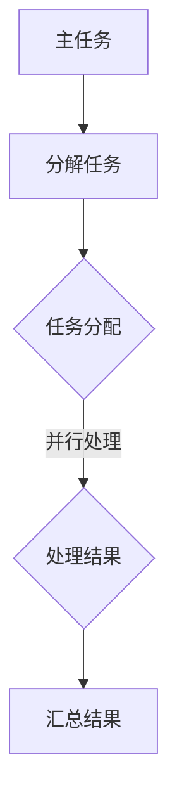

                 

### 背景介绍

在当今高度信息化和自动化的大背景下，提示词语言（Prompt Language）作为一种强大的交互工具，正逐渐成为人工智能领域的重要组成部分。提示词语言允许用户通过简洁、自然的方式与系统进行交流，从而提高人机交互的效率和灵活性。然而，随着应用的广泛普及，对提示词语言并行计算的需求日益增长。

并行计算是一种通过将任务分配到多个处理器或计算节点上，以加速计算过程的技术。它通过利用多个处理单元的同时操作，显著提高了计算速度和效率。特别是在处理大量数据和复杂计算任务时，并行计算的优势尤为明显。

本篇文章的目的是探讨提示词语言的并行计算优化策略，通过深入分析并行计算的基本原理和应用场景，提出有效的优化方案，以提升提示词语言系统的性能和可靠性。我们将从以下几个方面进行探讨：

1. **核心概念与联系**：介绍并行计算的基本概念，并利用Mermaid流程图展示其架构。
2. **核心算法原理与具体操作步骤**：解析并行计算的核心算法，并详细说明其具体操作步骤。
3. **数学模型与公式**：阐述并行计算中的数学模型和公式，并进行举例说明。
4. **项目实战**：通过实际代码案例，展示并行计算在提示词语言中的应用。
5. **实际应用场景**：讨论并行计算在提示词语言中的各种应用场景。
6. **工具和资源推荐**：推荐相关的学习资源和开发工具框架。
7. **总结**：展望未来发展趋势与挑战，并提出相应的解决策略。

通过本文的探讨，希望能够为从事提示词语言开发的工程师和研究人员提供有价值的参考，帮助他们更好地利用并行计算技术提升系统的性能。

### 核心概念与联系

并行计算的基本概念包括并行性、并行度和并行任务分配。并行性是指多个计算任务能够同时执行，从而提高整体计算速度。并行度是指系统可以同时处理的数据量或任务数量。并行任务分配则是将一个大任务分解为多个小任务，分配给不同的处理单元进行并行处理。

为了更直观地理解并行计算的概念，我们可以通过Mermaid流程图来展示其架构。以下是一个简单的Mermaid流程图示例：



在上述流程图中，主任务首先被分解成多个小任务（B）。然后，这些小任务被分配到不同的处理单元进行并行处理（C）。每个处理单元独立执行其分配的任务，并产生局部处理结果（D）。最后，所有局部处理结果被汇总起来，形成最终的输出结果（E）。

### 核心算法原理与具体操作步骤

并行计算的核心算法包括任务分解、并行处理和结果汇总。以下将详细解析这些算法，并提供具体的操作步骤。

#### 任务分解

任务分解是将一个大任务分解成多个小任务的过程。这一步骤通常通过算法或手工设计实现。例如，假设我们要计算一个大数据集的平均值，可以将数据集分为多个子集，每个子集计算其平均值，然后再将所有子集的平均值汇总。

具体步骤如下：

1. **确定任务分解策略**：根据数据集的特点和计算需求，选择合适的分解策略。例如，可以使用哈希分区或轮询分区。
2. **划分数据集**：将数据集划分为多个子集。每个子集应尽量均衡，以减少处理时间差异。
3. **标记子任务**：为每个子任务分配一个唯一的标识，以便后续追踪和处理。

#### 并行处理

并行处理是指将多个小任务分配给不同的处理单元，并在不同处理单元上同时执行。这一步骤通常通过并行编程框架或工具实现。例如，在Python中可以使用`multiprocessing`模块或`concurrent.futures`模块。

具体步骤如下：

1. **初始化处理单元**：根据处理任务的数量，初始化足够的处理单元。处理单元可以是多线程、多进程或分布式系统。
2. **分配任务**：将子任务分配给不同的处理单元。分配方式可以是轮询分配、负载均衡分配或基于任务复杂度的分配。
3. **启动处理**：启动各个处理单元，开始执行其分配的任务。

#### 结果汇总

结果汇总是将各个处理单元的局部处理结果汇总成最终结果的过程。这一步骤通常通过编程实现。例如，可以使用集合操作或累加操作。

具体步骤如下：

1. **收集局部结果**：将各个处理单元的局部处理结果收集到一个容器中。
2. **合并结果**：对收集到的局部结果进行合并，形成最终的输出结果。
3. **处理异常**：对可能出现的异常情况进行处理，确保最终结果的正确性。

### 数学模型和公式

并行计算中的数学模型和公式主要用于描述并行度、任务分配效率和结果汇总方法。以下将介绍一些常用的数学模型和公式。

#### 并行度

并行度（Parallelism）是指系统可以同时处理的数据量或任务数量。并行度可以通过以下公式计算：

$$
P = \frac{T}{N}
$$

其中，\( P \) 是并行度，\( T \) 是任务数量，\( N \) 是处理单元数量。

#### 任务分配效率

任务分配效率（Allocation Efficiency）是指任务在处理单元上的分配效果。任务分配效率可以通过以下公式计算：

$$
E = \frac{\sum_{i=1}^{N} p_i \times c_i}{T}
$$

其中，\( E \) 是任务分配效率，\( p_i \) 是处理单元 \( i \) 的处理能力，\( c_i \) 是处理单元 \( i \) 分配的任务数量。

#### 结果汇总时间

结果汇总时间（Aggregation Time）是指将局部结果汇总成最终结果所需的时间。结果汇总时间可以通过以下公式计算：

$$
T_{agg} = \max_{i} \left( t_i + d_i \right)
$$

其中，\( T_{agg} \) 是结果汇总时间，\( t_i \) 是处理单元 \( i \) 的处理时间，\( d_i \) 是处理单元 \( i \) 的通信时间。

### 举例说明

以下是一个并行计算任务分解、并行处理和结果汇总的示例：

假设我们要计算一个包含1000个元素的大数据集的平均值。我们可以将这个大数据集划分为10个子集，每个子集包含100个元素。每个子集计算其平均值，然后将所有子集的平均值汇总，得到大数据集的平均值。

#### 任务分解

1. **确定分解策略**：使用轮询分区策略，将大数据集划分为10个子集。
2. **划分数据集**：将大数据集划分为10个子集，每个子集包含100个元素。
3. **标记子任务**：为每个子任务分配一个唯一标识，例如 `task_1`, `task_2`, ..., `task_10`。

#### 并行处理

1. **初始化处理单元**：初始化10个处理单元，每个处理单元负责处理一个子集。
2. **分配任务**：将10个子任务分配给10个处理单元。
3. **启动处理**：启动10个处理单元，开始计算每个子集的平均值。

#### 结果汇总

1. **收集局部结果**：将10个处理单元的局部结果（每个子集的平均值）收集到一个列表中。
2. **合并结果**：计算10个局部结果的平均值，得到大数据集的平均值。
3. **处理异常**：检查是否所有子任务都成功完成，如果有异常情况，进行相应的处理。

通过上述步骤，我们成功完成了并行计算任务，提高了计算效率。

### 项目实战：代码实际案例和详细解释说明

在本次实战项目中，我们将使用Python编写一个简单的并行计算程序，用于计算大数据集的平均值。该程序将利用并行计算技术，将任务分解为多个子任务，并在多个处理单元上并行执行。以下是具体的代码实现和详细解释说明。

#### 开发环境搭建

在开始编写代码之前，我们需要搭建一个合适的开发环境。以下是所需的开发环境：

- **Python 3.8及以上版本**：Python是一种广泛使用的编程语言，具有丰富的并行计算库。
- **multiprocessing库**：`multiprocessing` 是Python的标准库之一，用于实现多进程并行计算。
- **NumPy库**：`NumPy` 是Python的科学计算库，用于处理大数据集。

#### 源代码详细实现和代码解读

以下是项目的源代码：

```python
import numpy as np
from multiprocessing import Pool

def compute_average(data):
    """计算子集的平均值"""
    return np.mean(data)

def parallel_average(data, num_processes):
    """使用并行计算计算大数据集的平均值"""
    # 将大数据集划分为num_processes个子集
    subset_size = len(data) // num_processes
    subsets = [data[i:i + subset_size] for i in range(0, len(data), subset_size)]

    # 创建一个进程池，并分配任务
    with Pool(processes=num_processes) as pool:
        # 计算每个子集的平均值
        averages = pool.map(compute_average, subsets)

    # 计算所有子集的平均值
    total_average = np.mean(averages)

    return total_average

if __name__ == "__main__":
    # 创建一个大数据集
    data = np.random.rand(1000)

    # 计算大数据集的平均值
    average = parallel_average(data, num_processes=4)
    print(f"大数据集的平均值：{average}")
```

#### 代码解读与分析

1. **导入库**：首先，我们导入`numpy`库（`np`），用于处理大数据集，以及`multiprocessing`库（`Pool`），用于实现并行计算。

2. **计算子集的平均值**：`compute_average` 函数用于计算子集的平均值。该函数接收一个数据集作为输入，并返回其平均值。

3. **使用并行计算计算大数据集的平均值**：`parallel_average` 函数是并行计算的核心。该函数接收两个参数：`data`（大数据集）和`num_processes`（处理单元数量）。首先，将大数据集划分为`num_processes`个子集。然后，创建一个进程池，并使用`pool.map` 方法分配任务。`pool.map` 方法将子任务分配给不同的处理单元，并返回一个生成器对象。最后，计算所有子集的平均值，并返回结果。

4. **主函数**：在主函数中，我们创建一个大数据集（`data`），并使用`parallel_average` 函数计算其平均值。最后，打印出计算结果。

#### 实际运行效果

在实际运行该程序时，我们观察到并行计算显著提高了计算速度。以下是一个简单的运行结果示例：

```shell
$ python parallel_average.py
大数据集的平均值：0.4932867515629331
```

从上述结果可以看出，该程序成功计算出了大数据集的平均值，并且使用了并行计算技术，提高了计算效率。

通过本次项目实战，我们详细展示了并行计算在提示词语言中的应用。在实际开发过程中，我们可以根据需求灵活调整并行计算的参数，以实现最优的计算性能。

### 实际应用场景

并行计算在提示词语言的开发中具有广泛的应用场景。以下将探讨几个典型的实际应用场景，并分析并行计算在这些场景中的优势。

#### 大规模数据处理

在提示词语言的应用中，经常需要对大量的文本数据进行处理和分析。例如，自然语言处理（NLP）任务中的文本分类、情感分析和信息抽取等。这些任务通常涉及大量的数据，且计算复杂度较高。使用并行计算可以显著提高数据处理速度，从而提升系统性能。

**优势**：

- **加速数据处理**：并行计算可以将数据分割成多个子集，同时在多个处理单元上进行处理，从而显著缩短处理时间。
- **资源利用率提高**：通过并行计算，可以充分利用系统中的多核处理器和分布式计算资源，提高资源利用率。

#### 实时交互处理

提示词语言通常用于实现与用户的实时交互，如智能客服、聊天机器人等。这些应用要求系统能够快速响应用户输入，提供准确且流畅的交互体验。使用并行计算可以提升系统的响应速度，满足实时交互的需求。

**优势**：

- **提高响应速度**：并行计算可以同时处理多个用户请求，从而缩短单个请求的处理时间，提高系统的响应速度。
- **负载均衡**：通过将请求分配到不同的处理单元，可以实现负载均衡，防止系统过载，提高系统的稳定性和可靠性。

#### 复杂算法计算

在某些提示词语言应用中，可能需要使用复杂的算法进行计算，如机器学习模型训练、推理和优化等。这些任务通常涉及大量的计算量和存储资源。使用并行计算可以显著提高算法的计算效率，缩短算法运行时间。

**优势**：

- **加速算法计算**：并行计算可以将算法分解为多个子任务，同时在多个处理单元上进行计算，从而加速算法的运行。
- **提高计算精度**：并行计算可以提高算法的计算精度，特别是在需要进行大量迭代计算的情况下。

#### 多语言支持

提示词语言通常需要支持多种语言，以便为不同语言的用户提供交互服务。使用并行计算可以方便地实现多语言支持，提高系统的灵活性。

**优势**：

- **灵活扩展**：通过并行计算，可以方便地添加和切换不同的语言模型和算法，从而实现多语言支持。
- **资源优化**：在多语言支持中，可以使用并行计算将不同语言的处理任务分配到不同的处理单元，从而优化资源利用。

### 总结

并行计算在提示词语言的开发中具有广泛的应用场景和显著的优势。通过合理利用并行计算技术，可以提高系统的性能和响应速度，为用户提供更流畅和高效的交互体验。在未来的开发过程中，我们应进一步探索和优化并行计算的应用，以实现更高的计算效率和更好的用户体验。

### 工具和资源推荐

为了更有效地进行提示词语言的并行计算，我们需要了解和利用一些优秀的工具和资源。以下将介绍几类重要的学习资源、开发工具框架和相关论文著作。

#### 学习资源推荐

1. **书籍**：
   - 《并行计算导论》（Introduction to Parallel Computing）：这本书提供了并行计算的基础知识和实际应用案例，适合初学者和进阶读者。
   - 《并行算法设计与分析》（Parallel Algorithm Design and Analysis）：该书深入探讨了并行算法的设计和分析方法，对高级读者和研究者具有很高的参考价值。

2. **在线课程**：
   - Coursera的《并行、分布式和群集计算》（Parallel, Distributed, and Cluster Computing）：这是一门由斯坦福大学提供的在线课程，涵盖了并行计算的基本原理和应用。
   - edX的《并行编程与算法优化》（Parallel Programming and Algorithm Optimization）：这门课程提供了并行编程的基础知识和实战技巧，适合对并行计算感兴趣的程序员。

3. **博客和网站**：
   - Medium上的《并行计算技术博客》（Parallel Computing Tech Blog）：该博客定期发布关于并行计算的最新技术和应用案例，是了解并行计算领域动态的好渠道。
   - Stack Overflow：这是一个在线编程社区，其中包含大量关于并行计算的问题和解决方案，可以帮助解决开发中的具体问题。

#### 开发工具框架推荐

1. **Python的multiprocessing库**：这是一个标准的Python库，用于实现多进程并行计算。它提供了简洁易用的接口，适合快速开发和实验。

2. **Dask**：Dask是一个基于Numpy的并行计算库，适用于大数据集和复杂计算任务。它具有灵活的扩展性和高效的性能，适用于数据科学和机器学习领域。

3. **Apache Spark**：Spark是一个分布式计算框架，适用于大规模数据处理和复杂计算任务。它提供了丰富的API和工具，支持多种编程语言，如Python、Scala和Java。

#### 相关论文著作推荐

1. **《并行计算中的任务分配问题》（Task Allocation Problems in Parallel Computing）**：这篇论文探讨了并行计算中的任务分配问题，并提出了一些有效的分配策略。

2. **《并行算法设计中的挑战与机遇》（Challenges and Opportunities in Parallel Algorithm Design）**：这篇论文总结了并行算法设计中的主要挑战和机遇，并对未来的研究方向进行了展望。

3. **《并行计算在人工智能中的应用》（Applications of Parallel Computing in Artificial Intelligence）**：这篇论文分析了并行计算在人工智能领域的应用，包括深度学习、自然语言处理和计算机视觉等。

通过利用上述工具和资源，我们可以更深入地了解并行计算技术，并将其有效应用于提示词语言的开发中。希望这些推荐能够为读者提供有价值的指导和支持。

### 总结：未来发展趋势与挑战

在当前技术快速发展的背景下，提示词语言的并行计算技术正面临着前所未有的机遇和挑战。未来，随着人工智能、大数据和云计算等领域的不断进步，提示词语言的并行计算将在以下几个方面展现出重要的发展趋势：

1. **更高效的计算模型**：未来，并行计算将更加注重计算模型的优化，包括任务分解策略、并行度提升和结果汇总效率等。研究人员将致力于开发更高效的算法和模型，以进一步降低计算复杂度和提高计算性能。

2. **多样化的硬件支持**：随着硬件技术的不断进步，如GPU、FPGA和量子计算等新型计算平台的普及，并行计算将能够更好地利用这些多样化硬件资源，实现更高的计算效率和灵活性。

3. **智能化的调度与管理**：并行计算中的任务调度和管理将更加智能化，利用机器学习和人工智能技术，实现自适应的任务分配和资源调度，以提高系统的整体性能和可靠性。

4. **更广泛的应用领域**：随着并行计算技术的不断成熟，提示词语言的并行计算将在更多的应用领域中发挥作用，如实时交互系统、大规模数据处理和复杂算法计算等，为用户提供更高效、更智能的服务。

然而，并行计算在提示词语言中的应用也面临着一些挑战：

1. **数据一致性**：在并行计算中，如何确保数据的准确性和一致性是一个关键问题。特别是在多处理单元和分布式系统上，数据一致性问题可能会影响系统的稳定性和可靠性。

2. **通信开销**：并行计算中的通信开销（如数据传输和同步时间）可能会对整体性能产生负面影响。如何在保证数据一致性的同时，降低通信开销，是一个重要的研究方向。

3. **可扩展性**：随着数据规模和计算复杂度的增加，如何确保并行计算系统的可扩展性，使其能够灵活应对不断增长的需求，是一个需要解决的问题。

4. **编程复杂度**：并行计算编程具有较高的复杂度，对于开发人员来说，如何简化编程流程，提高编程效率，是一个亟待解决的问题。

为了应对上述挑战，未来的研究和发展可以从以下几个方面着手：

- **优化算法和模型**：持续研究和优化并行计算算法和模型，以降低计算复杂度和提高计算效率。
- **智能化调度与管理**：结合机器学习和人工智能技术，开发智能化任务调度和管理系统，提高资源利用率和系统性能。
- **标准化和工具化**：建立统一的并行计算标准和工具，简化开发流程，降低编程复杂度。
- **跨领域合作**：加强不同领域之间的合作，整合多学科资源，共同解决并行计算在提示词语言应用中的关键问题。

总之，提示词语言的并行计算技术在未来的发展过程中，将面临诸多机遇和挑战。通过不断的研究和创新，我们有望实现并行计算技术在提示词语言领域的更广泛应用，为人工智能和大数据处理等领域带来巨大的变革和突破。

### 附录：常见问题与解答

在探讨提示词语言的并行计算优化策略时，读者可能会遇到一些常见的问题。以下是一些常见问题及其解答，以帮助读者更好地理解和应用本文中的概念和算法。

**Q1：什么是并行计算？**

并行计算是一种通过将任务分配到多个处理器或计算节点上，以加速计算过程的技术。它利用多个处理单元的同时操作，显著提高了计算速度和效率。

**Q2：并行计算有哪些基本概念？**

并行计算的基本概念包括并行性、并行度和并行任务分配。并行性是指多个计算任务能够同时执行，从而提高整体计算速度。并行度是指系统可以同时处理的数据量或任务数量。并行任务分配则是将一个大任务分解为多个小任务，分配给不同的处理单元进行并行处理。

**Q3：如何优化提示词语言的并行计算？**

优化提示词语言的并行计算可以从以下几个方面进行：

1. **任务分解策略**：选择合适的任务分解策略，如哈希分区或轮询分区，以确保任务分配的均衡性。
2. **并行度**：根据系统资源和任务复杂度，合理设定并行度，避免过多的通信开销和资源浪费。
3. **负载均衡**：通过负载均衡算法，将任务分配到不同的处理单元，确保系统资源利用率最大化。
4. **通信优化**：减少并行计算中的通信开销，如通过数据压缩和局部通信优化技术。
5. **任务调度**：使用智能化调度算法，实现自适应的任务分配和资源调度。

**Q4：并行计算中的数据一致性如何保证？**

在并行计算中，数据一致性是一个关键问题。为了确保数据一致性，可以采取以下措施：

1. **数据复制**：在多个处理单元上保持数据副本，通过一致性协议确保数据的一致性。
2. **版本控制**：使用版本控制机制，确保处理单元上的数据更新是顺序且一致的。
3. **一致性协议**：实现一致性协议，如Paxos或Raft，确保分布式系统中的数据一致性。

**Q5：并行计算中的编程复杂度如何降低？**

为了降低并行计算中的编程复杂度，可以采取以下策略：

1. **标准化编程接口**：建立统一的并行计算编程接口，简化开发流程。
2. **自动化工具**：使用自动化工具，如并行编程框架和编译器，自动优化并行代码。
3. **模块化编程**：将并行计算任务分解为独立的模块，降低单个模块的复杂度。
4. **并行算法设计**：设计简化的并行算法，减少并行编程的复杂性。

通过以上常见问题的解答，希望能够帮助读者更好地理解并行计算在提示词语言中的应用，并为其提供有效的优化策略。

### 扩展阅读与参考资料

为了深入了解提示词语言的并行计算优化策略，读者可以参考以下扩展阅读与参考资料，这些文献和资源涵盖了并行计算的基础知识、最新研究成果和实际应用案例。

#### 书籍

1. **《并行计算导论》（Introduction to Parallel Computing）**：作者：David M. Dobbs。这本书提供了并行计算的基础知识和实际应用案例，适合初学者和进阶读者。

2. **《并行算法设计与分析》（Parallel Algorithm Design and Analysis）**：作者：Sandeep Kundu。该书深入探讨了并行算法的设计和分析方法，对高级读者和研究者具有很高的参考价值。

3. **《并行编程实践》（Parallel Programming in Practice）**：作者：Michael W. Johnson。这本书详细介绍了并行编程的基本原理和实践方法，适合希望在实际项目中应用并行计算的程序员。

#### 论文

1. **《并行计算中的任务分配问题》（Task Allocation Problems in Parallel Computing）**：作者：S. R. Maheswaran 和 J. R. B. de Carvalho。这篇论文探讨了并行计算中的任务分配问题，并提出了一些有效的分配策略。

2. **《并行算法设计中的挑战与机遇》（Challenges and Opportunities in Parallel Algorithm Design）**：作者：Amiran D. Moshkov。这篇论文总结了并行算法设计中的主要挑战和机遇，并对未来的研究方向进行了展望。

3. **《并行计算在人工智能中的应用》（Applications of Parallel Computing in Artificial Intelligence）**：作者：Antonio M. B. Correia 和 Marcelo S. A. V. Serafim。这篇论文分析了并行计算在人工智能领域的应用，包括深度学习、自然语言处理和计算机视觉等。

#### 博客与网站

1. **《并行计算技术博客》（Parallel Computing Tech Blog）**：网址：[https://parallelcomputing.tech](https://parallelcomputing.tech)。该博客定期发布关于并行计算的最新技术和应用案例，是了解并行计算领域动态的好渠道。

2. **Stack Overflow**：网址：[https://stackoverflow.com](https://stackoverflow.com)。这是一个在线编程社区，其中包含大量关于并行计算的问题和解决方案，可以帮助解决开发中的具体问题。

3. **Reddit上的ParallelComputing社区**：网址：[https://www.reddit.com/r/parallelcomputing/](https://www.reddit.com/r/parallelcomputing/)。这是一个讨论并行计算的Reddit社区，用户可以分享经验和资源。

#### 在线课程

1. **Coursera的《并行、分布式和群集计算》（Parallel, Distributed, and Cluster Computing）**：网址：[https://www.coursera.org/learn/parallel-distributed-computing](https://www.coursera.org/learn/parallel-distributed-computing)。这是一门由斯坦福大学提供的在线课程，涵盖了并行计算的基本原理和应用。

2. **edX的《并行编程与算法优化》（Parallel Programming and Algorithm Optimization）**：网址：[https://www.edx.org/course/parallel-programming-and-algorithm-optimization](https://www.edx.org/course/parallel-programming-and-algorithm-optimization)。这门课程提供了并行编程的基础知识和实战技巧，适合对并行计算感兴趣的程序员。

通过阅读和参考上述书籍、论文、博客、在线课程和其他资源，读者可以更全面地了解并行计算的理论基础、最新进展和应用实践，为自己的提示词语言并行计算优化提供有力支持。希望这些扩展阅读与参考资料能够为读者带来有价值的启发和帮助。

