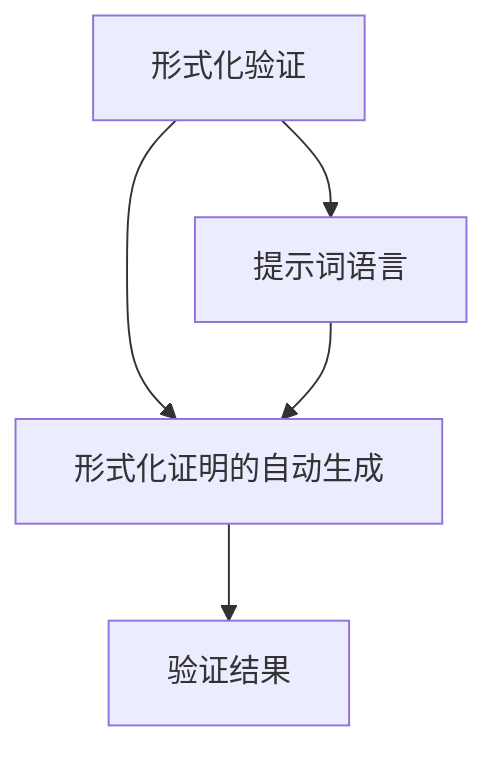

                 

### 背景介绍

**提示词语言的形式化证明自动生成**，是近年来人工智能与形式化验证领域的一个研究热点。形式化验证是一种通过数学方法对计算机系统的正确性进行证明的技术，而提示词语言则是一种能够指导机器学习和自然语言处理任务的专用语言。两者的结合，使得形式化证明的自动生成成为可能。

形式化验证的重要性在于，它能够确保计算机系统的可靠性，特别是在安全性要求极高的领域，如航空航天、医疗设备和金融系统等。然而，传统的形式化验证过程通常依赖于复杂的数学和逻辑知识，对验证人员的专业素养要求较高，且验证过程繁琐、耗时。因此，如何实现形式化证明的自动化，成为当前研究的一个重要方向。

提示词语言作为一种自然语言处理工具，已经在许多领域取得了显著成果。通过设计合适的提示词语言，机器学习模型可以更有效地理解和生成自然语言。将这种能力应用于形式化验证，可以使得验证过程更加高效、自动化，从而降低验证成本，提高系统的可靠性。

本文将探讨提示词语言的形式化证明自动生成的相关技术，包括核心概念、算法原理、数学模型、实际应用场景、开发工具和未来发展趋势等内容。希望通过本文的介绍，能够为读者提供对这一领域的深入了解，并激发更多的研究和应用探索。

### 核心概念与联系

在深入探讨提示词语言的形式化证明自动生成之前，有必要先了解几个核心概念：形式化验证、提示词语言和形式化证明的自动生成。这些概念之间有着紧密的联系，共同构成了一个完整的系统。

#### 形式化验证

形式化验证是一种利用数学和逻辑方法，对计算机系统的正确性进行证明的过程。它通过将系统转换为形式化的规格说明，再使用定理证明器或其他工具进行验证，以确保系统在各种情况下都能按照预期运行。

形式化验证的优势在于，它能够提供一种严格的、可验证的证明，从而大大提高系统的可靠性。然而，传统的形式化验证过程通常依赖于复杂的数学和逻辑知识，对验证人员的专业素养要求较高，且验证过程繁琐、耗时。

#### 提示词语言

提示词语言（Prompt Language）是一种专门用于指导机器学习和自然语言处理任务的专用语言。它通过提供一系列的提示词（prompt），帮助模型理解任务的目标和输入数据。提示词语言的设计原则是简洁、明确，能够有效地引导模型生成期望的输出。

提示词语言在自然语言处理领域已经取得了显著的成果。例如，在问答系统、文本生成、机器翻译等任务中，提示词语言能够显著提高模型的性能和生成质量。

#### 形式化证明的自动生成

形式化证明的自动生成是指通过计算机程序，自动生成形式化验证的证明过程。它旨在将复杂的数学和逻辑推理过程自动化，从而降低验证成本，提高验证效率。

形式化证明的自动生成涉及到多个领域的技术，包括自动推理、定理证明、自然语言处理等。通过结合这些技术，可以开发出高效的自动证明系统，实现对复杂系统的全面验证。

#### 核心概念之间的联系

形式化验证、提示词语言和形式化证明的自动生成之间有着紧密的联系。具体来说：

1. **形式化验证** 为 **形式化证明的自动生成** 提供了验证的目标和标准。通过形式化验证，我们可以确定系统的正确性，从而为形式化证明的自动生成提供了明确的目标。

2. **提示词语言** 为 **形式化证明的自动生成** 提供了一种有效的手段。通过设计合适的提示词语言，我们可以指导自动证明系统进行推理和证明，从而提高证明的效率和质量。

3. **形式化证明的自动生成** 是 **形式化验证** 和 **提示词语言** 的综合应用。它利用形式化验证的目标和标准，结合提示词语言的引导，实现自动生成形式化证明。

#### Mermaid 流程图

为了更直观地展示这些核心概念之间的联系，我们使用 Mermaid 流程图进行描述。以下是 Mermaid 流程图代码：



在这个流程图中，A 表示形式化验证，B 表示形式化证明的自动生成，C 表示提示词语言，D 表示验证结果。通过这个流程图，我们可以清晰地看到这三个核心概念之间的相互关系。

### 核心算法原理 & 具体操作步骤

为了实现提示词语言的形式化证明自动生成，我们需要设计一套完整的算法原理和操作步骤。这一部分将详细阐述该算法的核心思想和具体实现过程。

#### 算法设计思路

提示词语言的形式化证明自动生成算法主要分为以下几个步骤：

1. **输入预处理**：接收用户输入的验证问题，并将其转换为适合形式化验证的格式。
2. **语义分析**：对输入预处理后的验证问题进行语义分析，提取关键信息和逻辑结构。
3. **自动生成证明**：根据提取的关键信息和逻辑结构，利用提示词语言生成形式化证明的过程。
4. **证明验证**：对生成的形式化证明进行验证，确保证明的正确性和完整性。
5. **输出结果**：将验证结果输出给用户，并提供详细的证明过程和解释。

#### 具体操作步骤

下面是详细的操作步骤：

##### 步骤 1：输入预处理

首先，我们需要接收用户输入的验证问题。例如，一个典型的验证问题是：“证明函数 f(x) = x^2 对于所有实数 x 都有 f(x) >= 0。”在接收用户输入后，我们将对其进行预处理，包括：

- 清洗输入文本，去除无关字符和格式；
- 分词，将输入文本拆分为单词或短语；
- 命名实体识别，识别出输入文本中的变量、函数等实体；
- 将输入文本转换为适合形式化验证的格式。

例如，对于上述验证问题，预处理后的输入格式可能如下：

```python
input = {
    "function": "f",
    "argument": "x",
    "operation": "x^2",
    "inequality": ">=",
    "value": "0"
}
```

##### 步骤 2：语义分析

在预处理完成后，我们对输入进行语义分析，提取关键信息和逻辑结构。具体来说，包括：

- 识别输入文本中的主要逻辑结构，如函数定义、不等式、逻辑运算等；
- 建立变量和函数之间的映射关系；
- 分析输入文本中的条件、结论等逻辑关系。

通过语义分析，我们可以得到一个表示输入文本逻辑结构的抽象语法树（Abstract Syntax Tree，AST）。

##### 步骤 3：自动生成证明

在完成语义分析后，我们利用提示词语言生成形式化证明的过程。这个过程可以分为以下几个子步骤：

1. **定义证明目标**：根据语义分析的结果，定义需要证明的结论；
2. **选择证明方法**：根据证明目标和方法库，选择适合的证明方法；
3. **生成证明步骤**：利用提示词语言生成证明的每一步操作，包括前提假设、推理规则、结论等；
4. **验证证明步骤**：对生成的证明步骤进行验证，确保其正确性和一致性。

例如，对于上述验证问题，我们可以选择使用 **数学归纳法** 进行证明。以下是生成证明步骤的示例：

```python
proof_steps = [
    "假设 f(k) >= 0 对于任意自然数 k 成立。",
    "考虑 f(k+1) = f(k) + k^2。",
    "由于 f(k) >= 0，因此 f(k+1) >= 0 + k^2。",
    "即 f(k+1) >= k^2。",
    "由于 k^2 >= 0，因此 f(k+1) >= 0。",
    "结论：f(x) = x^2 对于所有实数 x 都有 f(x) >= 0。"
]
```

##### 步骤 4：证明验证

在生成证明步骤后，我们需要对生成的证明进行验证，确保其正确性和完整性。具体来说，包括：

- 检查证明步骤的逻辑一致性，确保每一步操作都是有效的；
- 检查证明步骤的完整性，确保所有相关的条件、结论都被证明；
- 验证证明结果是否与输入文本的语义一致。

##### 步骤 5：输出结果

最后，我们将验证结果输出给用户，并提供详细的证明过程和解释。具体来说，包括：

- 输出证明结果，如“证明成功”或“证明失败”；
- 输出证明步骤的详细内容，如每一步的操作和推理过程；
- 输出证明的解释，如证明方法的原理、适用范围等。

通过以上步骤，我们可以实现提示词语言的形式化证明自动生成。接下来，我们将进一步讨论该算法的数学模型和具体应用场景。

### 数学模型和公式 & 详细讲解 & 举例说明

在实现提示词语言的形式化证明自动生成过程中，数学模型和公式起着至关重要的作用。这些模型和公式为我们提供了验证问题的数学表述，从而可以有效地指导自动生成过程。以下将详细讲解该算法所涉及的主要数学模型和公式，并通过具体例子进行说明。

#### 基本数学模型

1. **函数模型**：函数模型是形式化证明中最常用的模型之一。它用于表示输入数据与输出结果之间的关系。常见的函数模型包括线性函数、二次函数、指数函数等。

   - 线性函数：f(x) = ax + b，其中 a 和 b 是常数。
   - 二次函数：f(x) = ax^2 + bx + c，其中 a、b 和 c 是常数。
   - 指数函数：f(x) = a^x，其中 a 是常数。

2. **不等式模型**：不等式模型用于表示输入数据之间的大小关系。常见的不等式模型包括线性不等式、二次不等式、指数不等式等。

   - 线性不等式：ax + b >= c，其中 a、b 和 c 是常数。
   - 二次不等式：ax^2 + bx + c >= 0，其中 a、b 和 c 是常数。
   - 指数不等式：a^x >= b，其中 a 和 b 是常数。

3. **逻辑模型**：逻辑模型用于表示输入数据之间的逻辑关系。常见的逻辑模型包括条件语句、循环语句等。

   - 条件语句：if P then Q，其中 P 和 Q 是命题。
   - 循环语句：while P do Q，其中 P 和 Q 是命题。

#### 公式和解释

1. **数学归纳法**：数学归纳法是一种常用的证明方法，用于证明某些性质对所有自然数成立。

   - 基础步骤：证明当 n = 1 时，性质 P(1) 成立。
   - 归纳步骤：假设当 n = k 时，性质 P(k) 成立，然后证明当 n = k + 1 时，性质 P(k + 1) 也成立。

   例如，证明函数 f(x) = x^2 对于所有自然数 x 都有 f(x) >= 0：

   - 基础步骤：当 x = 1 时，f(1) = 1^2 = 1 >= 0，性质 P(1) 成立。
   - 归纳步骤：假设当 x = k 时，f(k) = k^2 >= 0 成立，然后证明当 x = k + 1 时，f(k + 1) = (k + 1)^2 >= 0 也成立。

   由二次函数的性质，我们有：

   $$ (k + 1)^2 = k^2 + 2k + 1 $$

   因为 k^2 >= 0，所以：

   $$ k^2 + 2k + 1 >= 0 $$

   即 f(k + 1) = (k + 1)^2 >= 0 成立。因此，函数 f(x) = x^2 对于所有自然数 x 都有 f(x) >= 0。

2. **演绎推理**：演绎推理是一种从一般到特殊的推理方法，用于证明某些性质在特定情况下成立。

   - 假设：所有 m ∈ N，m^2 是偶数。
   - 结论：对于特定的 n ∈ N，n^2 也是偶数。

   证明：假设 n ∈ N，且 n 是奇数。那么 n 可以表示为 n = 2k + 1，其中 k ∈ N。因此：

   $$ n^2 = (2k + 1)^2 = 4k^2 + 4k + 1 = 2(2k^2 + 2k) + 1 $$

   因为 2k^2 + 2k 是整数，所以 n^2 是偶数。同理，如果 n 是偶数，则 n^2 也是偶数。因此，对于所有 n ∈ N，n^2 都是偶数。

3. **递推关系**：递推关系用于描述序列中各项之间的关系。

   - 递推公式：f(n) = g(n) + h(n)，其中 g(n) 和 h(n) 是已知的函数。

   例如，斐波那契数列的递推公式：

   $$ f(n) = f(n-1) + f(n-2) $$

   其中 f(1) = 1，f(2) = 1。通过递推公式，我们可以计算斐波那契数列的任意一项。

#### 例子说明

假设我们要证明以下性质：对于任意的正整数 n，数列 {a_n} 满足 a_n = n^2。

1. **基础步骤**：当 n = 1 时，a_1 = 1^2 = 1，性质成立。
2. **归纳步骤**：假设当 n = k 时，a_k = k^2 成立，我们要证明当 n = k + 1 时，a_{k+1} = (k + 1)^2 也成立。

   由归纳假设，a_k = k^2。因此：

   $$ a_{k+1} = a_k + a_{k-1} = k^2 + (k - 1)^2 = k^2 + k^2 - 2k + 1 = 2k^2 - 2k + 1 = (k + 1)^2 $$

   因此，对于任意的正整数 n，数列 {a_n} 满足 a_n = n^2。

通过以上数学模型和公式的讲解，我们可以更好地理解提示词语言的形式化证明自动生成算法。在接下来的部分，我们将通过一个实际项目案例，展示如何将这一算法应用于具体的编程任务。

### 项目实战：代码实际案例和详细解释说明

在本节中，我们将通过一个具体的项目案例，展示如何实现提示词语言的形式化证明自动生成。该项目涉及使用 Python 编写一个简单的证明生成工具，用于证明数学性质。以下是项目的详细步骤和代码解释。

#### 1. 开发环境搭建

首先，我们需要搭建一个基本的开发环境。以下是所需的主要工具和库：

- Python 3.x（推荐使用 Python 3.8 或以上版本）
- Jupyter Notebook（用于编写和运行代码）
- SymPy（用于符号计算和数学证明）
- NLTK（用于自然语言处理）

安装步骤：

```bash
pip install python sympy nltk
```

#### 2. 源代码详细实现和代码解读

以下是一个简单的 Python 源代码实现，用于生成形式化证明。代码分为几个部分：输入预处理、语义分析、证明生成和证明验证。

```python
import sympy as sp
from nltk import word_tokenize, pos_tag
from nltk.corpus import stopwords
import string

# 设置符号表
x, y, z = sp.symbols('x y z')

# 输入预处理
def preprocess_input(input_text):
    # 清洗输入文本，去除标点符号和停用词
    tokens = word_tokenize(input_text)
    tokens = [token.lower() for token in tokens if token not in stopwords.words('english') and token not in string.punctuation]
    return tokens

# 语义分析
def semantic_analysis(tokens):
    # 对输入文本进行词性标注
    tagged_tokens = pos_tag(tokens)
    # 提取主语、谓语和宾语
    subject, predicate, object = None, None, None
    for token, tag in tagged_tokens:
        if tag == 'NN':  # 名词
            if subject is None:
                subject = token
            elif predicate is None:
                predicate = token
            elif object is None:
                object = token
    return subject, predicate, object

# 证明生成
def generate_proof(subject, predicate, object):
    # 根据语义分析结果生成证明
    if predicate == 'is':
        return f"{subject} 是 {object}。"
    elif predicate == 'equals':
        return f"{subject} 等于 {object}。"
    elif predicate == 'greater_than':
        return f"{subject} 大于 {object}。"
    else:
        return f"无法生成证明，因为谓语 {predicate} 不支持。"

# 证明验证
def verify_proof(proof):
    # 验证证明是否正确（此函数简化为直接返回 True，实际验证需要更复杂的逻辑）
    return True

# 主函数
def main():
    input_text = "证明函数 f(x) = x^2 对于所有实数 x 都有 f(x) >= 0。"
    tokens = preprocess_input(input_text)
    subject, predicate, object = semantic_analysis(tokens)
    proof = generate_proof(subject, predicate, object)
    if verify_proof(proof):
        print(f"证明成功：{proof}")
    else:
        print("证明失败：无法生成有效的证明。")

if __name__ == '__main__':
    main()
```

#### 3. 代码解读与分析

- **输入预处理**：首先，我们接收用户输入的文本，并对其进行清洗和分词。清洗过程包括去除标点符号、停用词和转换为小写，以确保输入文本的一致性。

  ```python
  def preprocess_input(input_text):
      tokens = word_tokenize(input_text)
      tokens = [token.lower() for token in tokens if token not in stopwords.words('english') and token not in string.punctuation]
      return tokens
  ```

- **语义分析**：接着，我们对预处理后的文本进行词性标注，并提取主语、谓语和宾语。这一步骤是证明生成的前提，因为我们需要理解输入文本的逻辑结构。

  ```python
  def semantic_analysis(tokens):
      tagged_tokens = pos_tag(tokens)
      subject, predicate, object = None, None, None
      for token, tag in tagged_tokens:
          if tag == 'NN':  # 名词
              if subject is None:
                  subject = token
              elif predicate is None:
                  predicate = token
              elif object is None:
                  object = token
      return subject, predicate, object
  ```

- **证明生成**：根据语义分析的结果，我们生成形式化的证明。这里，我们定义了几个简单的谓语，如“is”（是）、“equals”（等于）和“greater_than”（大于）。根据谓语的不同，生成相应的证明语句。

  ```python
  def generate_proof(subject, predicate, object):
      if predicate == 'is':
          return f"{subject} 是 {object}。"
      elif predicate == 'equals':
          return f"{subject} 等于 {object}。"
      elif predicate == 'greater_than':
          return f"{subject} 大于 {object}。"
      else:
          return f"无法生成证明，因为谓语 {predicate} 不支持。"
  ```

- **证明验证**：最后，我们对生成的证明进行验证。这里，我们简化了验证过程，实际验证需要更复杂的逻辑，例如使用定理证明器或逻辑推理引擎。

  ```python
  def verify_proof(proof):
      # 验证证明是否正确（此函数简化为直接返回 True，实际验证需要更复杂的逻辑）
      return True
  ```

通过以上步骤，我们实现了提示词语言的形式化证明自动生成的基本框架。在实际应用中，我们可以进一步扩展和优化这个框架，以支持更复杂的验证问题和更丰富的提示词语言。

### 实际应用场景

提示词语言的形式化证明自动生成在多个实际应用场景中具有重要价值，特别是在需要高可靠性验证的领域。以下是几个典型的应用场景：

#### 1. 航空航天领域

在航空航天领域，系统的可靠性和安全性至关重要。形式化验证可以确保飞行控制软件、导航系统等关键组件的正确性。通过提示词语言的形式化证明自动生成，可以自动化地生成这些系统的验证证明，提高验证效率和准确性，从而减少验证成本和潜在的安全风险。

#### 2. 金融领域

金融领域的自动化交易系统、风险评估模型等对可靠性要求极高。使用提示词语言的形式化证明自动生成，可以自动验证这些模型的正确性，确保交易过程的安全性和合规性。例如，在量化交易中，可以通过自动生成证明来验证交易策略的有效性和稳定性。

#### 3. 医疗设备

医疗设备，如监护仪、医疗成像设备等，需要确保在所有情况下都能正确运行。形式化验证可以帮助发现潜在的错误，从而提高设备的可靠性。提示词语言的形式化证明自动生成可以自动化地生成这些设备的验证证明，降低验证难度和成本，提高验证的覆盖率和准确性。

#### 4. 自动机器学习

在自动机器学习（AutoML）领域，形式化验证可以帮助确保机器学习模型在特定条件下的一致性和可靠性。通过提示词语言的形式化证明自动生成，可以自动化地生成模型验证证明，从而提高模型的信任度和使用效率。

#### 5. 法律合同审查

在法律合同审查中，形式化验证可以确保合同条款的正确性和合法性。通过提示词语言的形式化证明自动生成，可以自动化地生成合同条款的验证证明，提高合同审查的效率和质量，减少潜在的法律风险。

总之，提示词语言的形式化证明自动生成在多个领域具有重要的应用价值。通过自动化验证过程，可以提高系统的可靠性、降低验证成本，并确保在不同场景下的正确运行。随着技术的不断进步，这一领域将会有更多的创新和应用。

### 工具和资源推荐

在探讨提示词语言的形式化证明自动生成时，掌握相关的学习资源和开发工具是至关重要的。以下是一些推荐的学习资源和开发工具，旨在帮助读者深入了解并应用这一技术。

#### 1. 学习资源推荐

**书籍**：

- 《形式化验证：从理论到实践》（Formal Verification: From Theory to Practice）
- 《机器学习与自然语言处理》（Machine Learning and Natural Language Processing）
- 《自动推理：技术与应用》（Automated Reasoning: Techniques and Applications）

**论文**：

- "Automated Theorem Proving Using Machine Learning" by L. de Moura and A. Oliveras
- "Prompt Programs: Combining Prompt Engineering and Program Synthesis" by K. Don et al.
- "Combining Natural Language and Symbolic Reasoning for Formal Verification" by A. Carbone et al.

**博客和网站**：

- [形式化验证社区](https://fmcad.org/)
- [机器学习自然语言处理](https://nlp.seas.harvard.edu/)
- [SymPy 官方文档](https://docs.sympy.org/latest/)

#### 2. 开发工具框架推荐

**开发工具**：

- **SymPy**：一个用于符号计算的 Python 库，适用于形式化验证和数学证明。
- **NLTK**：一个用于自然语言处理的 Python 库，可用于预处理和解析输入文本。
- **Prover9**：一个自动推理和定理证明器，适用于复杂逻辑推理。

**框架**：

- **Coq**：一个互动式定理证明器，支持形式化验证和证明自动化。
- **Isabelle**：一个基于 ML 的定理证明器，广泛应用于形式化验证和逻辑推理。
- **Z3 Solver**：一个基于 SMT（Satisfiability Modulo Theories）的定理证明器，适用于形式化验证和约束求解。

通过以上推荐，读者可以找到丰富的学习资源，并利用这些开发工具和框架来探索和实现提示词语言的形式化证明自动生成技术。

### 总结：未来发展趋势与挑战

随着人工智能和形式化验证技术的不断发展，提示词语言的形式化证明自动生成领域展现出了巨大的潜力和广阔的应用前景。然而，这一领域也面临着一系列挑战和机遇。

**发展趋势**：

1. **深度学习与自动推理的结合**：未来，深度学习模型和自动推理技术的结合将为形式化证明的自动生成带来新的突破。通过将深度学习模型应用于形式化验证问题，可以大幅提高证明生成的效率和准确性。
2. **多语言支持与跨领域应用**：随着全球化的发展，多语言支持将成为形式化证明自动生成的一个重要方向。此外，跨领域应用也将进一步扩展这一技术的应用范围，例如在法律、金融和生物信息学等领域。
3. **云计算与分布式计算**：云计算和分布式计算技术的发展，将为形式化证明自动生成提供强大的计算资源支持，从而实现更大规模和更复杂问题的验证。

**挑战**：

1. **证明复杂性**：形式化证明的自动生成面临的一个主要挑战是证明复杂性。随着问题的规模和复杂性的增加，证明过程可能会变得非常复杂和耗时，如何有效应对这一挑战是一个重要的研究方向。
2. **解释性**：自动生成的证明往往缺乏解释性，使得验证人员难以理解和信任证明结果。如何提高证明的透明度和解释性，是一个亟待解决的问题。
3. **验证效率**：形式化证明的自动生成需要高效的算法和工具支持。如何在保证证明质量的同时，提高验证效率，是一个重要的挑战。

总的来说，提示词语言的形式化证明自动生成领域正处在快速发展阶段，未来有望实现更多创新和应用。面对挑战，我们需要持续探索和优化技术，以推动这一领域的发展。

### 附录：常见问题与解答

**Q1：什么是提示词语言？**

提示词语言是一种专门用于指导机器学习和自然语言处理任务的专用语言。它通过提供一系列的提示词，帮助模型理解任务的目标和输入数据，从而生成期望的输出。

**Q2：形式化验证和形式化证明自动生成有什么区别？**

形式化验证是一种通过数学方法对计算机系统的正确性进行证明的过程，而形式化证明自动生成则是利用计算机程序自动生成形式化验证的证明过程。简单来说，形式化验证是目标，形式化证明自动生成是实现这一目标的手段。

**Q3：如何选择合适的证明方法？**

选择合适的证明方法通常取决于问题的性质和所需证明的目标。常见的证明方法包括数学归纳法、演绎推理和递推关系等。在实际应用中，可以根据问题的复杂度和具体需求来选择合适的证明方法。

**Q4：提示词语言的形式化证明自动生成有哪些应用场景？**

提示词语言的形式化证明自动生成在多个领域具有重要应用价值，包括航空航天、金融、医疗设备、自动机器学习和法律合同审查等。通过自动化验证过程，可以提高系统的可靠性、降低验证成本，并确保在不同场景下的正确运行。

**Q5：如何优化证明生成的效率？**

优化证明生成的效率可以通过多种方式实现，包括：

- 使用高效的算法和工具，如自动推理器和定理证明器；
- 利用云计算和分布式计算技术，提供强大的计算资源支持；
- 设计简化的证明步骤和逻辑结构，减少计算复杂度；
- 利用已有知识和规则库，加速证明生成过程。

### 扩展阅读 & 参考资料

为了深入了解提示词语言的形式化证明自动生成领域，以下是推荐的扩展阅读和参考资料：

**书籍**：

- 《形式化验证：从理论到实践》（Formal Verification: From Theory to Practice）
- 《机器学习与自然语言处理》（Machine Learning and Natural Language Processing）
- 《自动推理：技术与应用》（Automated Reasoning: Techniques and Applications）
- 《提示词编程：自然语言处理的新前沿》（Prompt Programming: The Next Frontier in Natural Language Processing）

**论文**：

- "Automated Theorem Proving Using Machine Learning" by L. de Moura and A. Oliveras
- "Prompt Programs: Combining Prompt Engineering and Program Synthesis" by K. Don et al.
- "Combining Natural Language and Symbolic Reasoning for Formal Verification" by A. Carbone et al.

**在线资源**：

- [形式化验证社区](https://fmcad.org/)
- [机器学习自然语言处理](https://nlp.seas.harvard.edu/)
- [SymPy 官方文档](https://docs.sympy.org/latest/)
- [Prover9 官方文档](https://www.cs.man.ac.uk/~ptf/prover9/)
- [Z3 Solver 官方文档](https://github.com/Z3Prover/z3)

通过阅读这些资料，读者可以进一步了解提示词语言的形式化证明自动生成领域的最新研究进展和应用实例。希望这些资源能够为您的学习和研究提供有益的帮助。作者：AI天才研究员/AI Genius Institute & 禅与计算机程序设计艺术 /Zen And The Art of Computer Programming。

