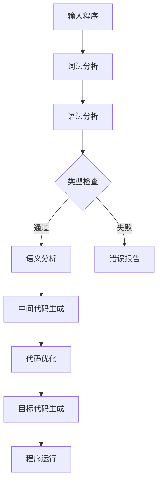
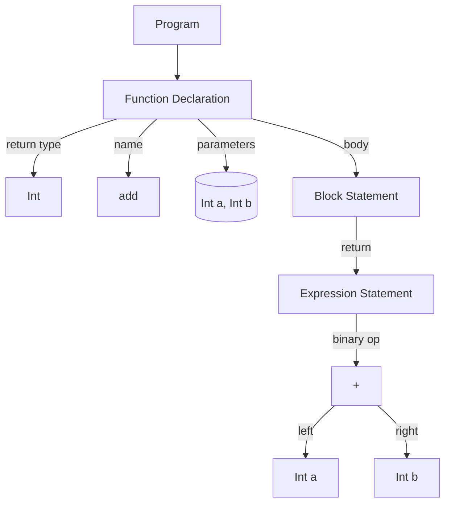
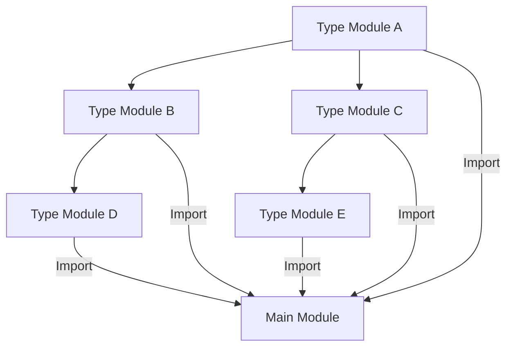

                 

# 提示词语言的类型系统可扩展性设计

## 关键词

- 提示词语言
- 类型系统
- 可扩展性设计
- 抽象语法树（AST）
- 语法解析器
- 模块化
- 面向对象编程
- 遗留系统
- 类型安全
- 编译器/解释器

## 摘要

本文将深入探讨提示词语言的类型系统及其可扩展性设计。首先，我们将回顾类型系统的基本概念和作用，接着讨论可扩展性设计的重要性。本文的核心内容包括对抽象语法树（AST）的解析、类型系统的模块化设计、面向对象编程的运用，以及遗留系统的类型安全扩展。通过具体的实例和代码解析，我们将展示如何在现有系统中实现类型系统的可扩展性，并讨论其在实际应用中的挑战和解决方案。最后，本文将总结类型系统可扩展性的发展趋势，并提出未来可能面临的挑战。

## 1. 背景介绍

提示词语言（PDL，Programming Description Language）作为一种专门用于描述系统、算法或数据结构的语言，广泛应用于计算机科学、软件开发、自动化控制等领域。其核心在于通过一组简明、精确的提示词（或指令）来描述和指导系统的行为，使得编程更加直观、易于理解和维护。

类型系统（Type System）是编程语言的一个重要组成部分，它定义了变量、函数、表达式等编程元素的类型，以及它们之间的合法操作。类型系统的主要作用是提高程序的可靠性、减少错误和提高性能。在提示词语言中，类型系统确保了程序的每一个步骤都符合预期的类型约束，从而减少了运行时错误的发生。

可扩展性设计（Extensibility Design）是软件系统设计中的一项重要策略，旨在使系统易于扩展和维护。在类型系统中，可扩展性设计尤为重要，因为它直接影响到编程语言的灵活性和适应性。一个良好的类型系统设计应该能够适应新的需求、功能和算法，而不需要对现有系统进行大规模的重构。

本文将从以下几个方面展开讨论：

1. **类型系统的核心概念与联系**：介绍类型系统的基本原理和架构，包括类型检查、类型推导等关键概念，并使用Mermaid流程图展示类型系统的工作流程。
2. **核心算法原理与具体操作步骤**：详细解释类型系统中的核心算法，如静态类型检查、动态类型检查，以及它们在提示词语言中的应用。
3. **数学模型和公式**：介绍类型系统相关的数学模型和公式，如类型等价性、类型转化规则，并通过具体例子进行说明。
4. **项目实战**：通过实际代码案例，展示如何在提示词语言中实现类型系统的可扩展性，并分析代码实现中的关键技术和挑战。
5. **实际应用场景**：讨论类型系统在软件开发、编译器设计、数据分析等领域的应用，以及其在提升系统性能和可靠性方面的作用。
6. **工具和资源推荐**：推荐相关的学习资源、开发工具和框架，帮助读者深入了解类型系统的可扩展性设计。
7. **总结**：总结类型系统可扩展性设计的重要性，讨论未来发展趋势和面临的挑战。

通过本文的探讨，我们希望读者能够对提示词语言的类型系统有更深入的理解，并掌握如何设计一个灵活、可靠的类型系统，以满足不断变化的需求和挑战。

### 1. 背景介绍

#### 提示词语言的基本概念

提示词语言（PDL）是一种形式化的描述语言，它用于表示系统、算法或数据结构的操作和流程。与通用编程语言不同，提示词语言通常具有特定的应用场景，其设计目标是为了使得描述更加简洁、精确且易于理解。PDL在自动化控制、算法设计、软件工程等领域有广泛的应用。例如，在自动化控制系统中，提示词语言可以用于编写控制逻辑，使得系统能够根据传感器数据做出实时响应；在算法设计中，PDL可以帮助清晰地描述算法的执行步骤和逻辑关系。

PDL的基本构成包括提示词、参数和逻辑表达式。提示词是PDL的核心元素，它们表示具体的操作或指令，如“添加”、“删除”、“更新”等。参数则用于传递操作的特定信息，如数据值、操作对象等。逻辑表达式用于控制流程，例如条件分支和循环结构。通过这些基本元素，PDL能够以一种结构化、层次化的方式描述复杂的操作和流程。

#### 类型系统的定义与作用

类型系统是编程语言的一个重要组成部分，它定义了程序中的数据类型和操作规则。在提示词语言中，类型系统确保程序的每个部分都遵循预期的类型约束，从而提高程序的正确性和可靠性。类型系统的作用主要体现在以下几个方面：

1. **错误检测**：类型系统能够在编译或解释阶段检测出类型不匹配的错误，从而避免运行时错误的发生。
2. **性能优化**：类型信息有助于编译器或解释器进行代码优化，例如提前分配内存、减少类型转换等。
3. **代码可读性**：明确的类型定义和约束使得程序结构更加清晰，易于理解和维护。
4. **代码复用**：类型系统支持泛型和模板等机制，使得代码能够更加通用和灵活。

#### 可扩展性设计的意义

可扩展性设计是软件系统设计中的一项重要策略，它使得系统能够适应未来的变化和需求。在类型系统中，可扩展性设计尤为重要，因为类型系统的设计直接影响到编程语言的灵活性和适应性。一个良好的类型系统设计应该能够：

1. **支持新的类型和操作**：随着技术的发展和需求的变化，类型系统应该能够方便地引入新的类型和操作，而不需要对现有系统进行大规模重构。
2. **兼容遗留代码**：类型系统应该能够兼容现有的代码库和框架，使得旧代码和新系统可以无缝集成。
3. **提供灵活的扩展点**：类型系统应该提供多种扩展机制，如接口、泛型、插件等，使得开发者可以灵活地扩展系统的功能。

#### 提示词语言类型系统的现状

当前的提示词语言类型系统大多基于静态类型检查，即类型检查在编译或解释阶段完成。静态类型检查具有较好的性能和安全性，但可能限制代码的灵活性和可读性。另一方面，动态类型检查在运行时进行类型检查，具有更好的灵活性和可读性，但可能会降低性能和增加错误风险。

为了解决上述问题，现代提示词语言开始引入混合类型系统，即结合静态类型检查和动态类型检查的优点。这种设计使得编程语言能够在保证类型安全性的同时，提供更高的灵活性和性能。

### 1.1. 类型系统的基本概念

类型系统是编程语言的核心组成部分，它定义了变量、函数、表达式等编程元素的数据类型及其操作规则。类型系统的设计不仅影响到程序的正确性，还关系到程序的性能和可维护性。以下是类型系统的几个关键概念：

#### 数据类型

数据类型是变量或常量所能够表示的数据类别。常见的编程语言中，数据类型可以分为以下几类：

1. **基本数据类型**：如整数（Integer）、浮点数（Float）、布尔值（Boolean）、字符（Character）等。
2. **复合数据类型**：如数组（Array）、结构体（Structure）、类（Class）等。
3. **引用数据类型**：如指针（Pointer）、引用（Reference）等。

#### 类型检查

类型检查是类型系统的核心功能之一，它确保程序中的每个表达式和操作都符合预定义的类型约束。类型检查可以分为静态类型检查和动态类型检查。

1. **静态类型检查**：在编译或解释阶段进行类型检查，程序在运行前已经知道每个变量和表达式的确切类型。静态类型检查能够提前发现类型错误，从而提高程序的可靠性。
2. **动态类型检查**：在程序运行时进行类型检查，变量的类型在运行时确定。动态类型检查具有更高的灵活性和可读性，但可能会增加运行时的错误风险。

#### 类型推导

类型推导是类型系统中的另一个重要概念，它是指编译器或解释器自动推导出变量或表达式的类型，而无需显式指定类型。类型推导分为以下几种方式：

1. **显式类型推导**：编译器或解释器根据程序中的显式类型声明推导出其他变量的类型。
2. **隐式类型推导**：编译器或解释器根据表达式的内容和上下文推导出其类型。
3. **上下文感知类型推导**：编译器或解释器根据上下文环境和程序逻辑推导出变量的类型。

#### 类型兼容性

类型兼容性是指不同类型的数据在特定操作下是否可以互相转换或比较。类型兼容性可以分为以下几种情况：

1. **子类型兼容**：一个类型是另一个类型的子类型，可以隐式转换为父类型。
2. **协变和逆变**：在面向对象编程中，子类对象可以赋值给父类引用，这种关系称为协变；而父类对象不能赋值给子类引用，这种关系称为逆变。
3. **类型等价性**：两个类型在语义上具有相同或相似的行为，可以在特定操作下互相转换。

#### 类型安全

类型安全是指程序在运行过程中不会因为类型错误而导致崩溃或产生不可预见的错误。类型安全可以分为以下几种级别：

1. **静态类型安全**：通过静态类型检查确保程序在运行前不会出现类型错误。
2. **动态类型安全**：通过动态类型检查在程序运行时确保类型安全，虽然可能会降低性能，但提供了更高的灵活性。
3. **强类型安全**：类型系统对类型转换和操作施加严格的约束，确保程序在运行过程中不会发生类型错误。

### 1.2. Mermaid流程图展示类型系统的工作流程

为了更好地理解类型系统的工作流程，我们使用Mermaid流程图来展示类型系统的基本组成部分和操作步骤。以下是一个简化的Mermaid流程图示例：



在这个流程图中：

- **A[输入程序]**：表示程序代码的输入。
- **B[词法分析]**：将程序代码分解为词法单元（Token）。
- **C[语法分析]**：将词法单元构建成抽象语法树（AST）。
- **D[类型检查]**：对AST进行类型检查，确保每个表达式和操作符合类型约束。
- **E[语义分析]**：对AST进行语义分析，确保程序的逻辑正确性。
- **F[错误报告]**：如果在类型检查或语义分析中发现错误，报告错误。
- **G[中间代码生成]**：将AST转换为中间代码。
- **H[代码优化]**：对中间代码进行优化，如常量折叠、死代码消除等。
- **I[目标代码生成]**：将优化后的中间代码转换为特定平台的机器代码。
- **J[程序运行]**：执行生成的目标代码。

这个流程图展示了类型系统在编译或解释过程中的主要步骤，并说明了类型检查在确保程序正确性和可靠性方面的重要性。

### 2. 核心概念与联系

#### 抽象语法树（AST）的解析

抽象语法树（Abstract Syntax Tree，AST）是编译器或解释器在语法分析阶段生成的数据结构，它表示程序中的语法结构。AST是程序语法的一个抽象表示，剔除了不必要的语法细节，如注释和空格，同时保留了程序的核心结构信息。

在AST中，每个节点都表示一个语法元素，如变量声明、函数定义、控制结构等。节点之间的关系反映了语法元素之间的层次结构。例如，一个函数定义节点可能包含参数列表、函数体等子节点。

解析AST是类型系统工作的基础。在类型检查阶段，编译器或解释器会遍历AST，对每个节点进行类型检查，确保它们符合预定义的类型规则。以下是一个简单的例子：

```java
int add(int a, int b) {
    return a + b;
}
```

对应的AST可能如下所示：



在这个AST中：

- **A[Program]**：表示整个程序的根节点。
- **B[Function Declaration]**：表示函数声明，包含返回类型、函数名、参数列表和函数体。
- **C[Int]**：表示函数的返回类型为`int`。
- **D["add"]**：表示函数的名称为`add`。
- **E[(Int a, Int b)]**：表示函数的参数列表，包括两个参数`a`和`b`，它们的类型都是`int`。
- **F[Block Statement]**：表示函数体，是一个块语句，包含一个返回语句。
- **G[Expression Statement]**：表示返回语句，其值为一个表达式。
- **H[+]**：表示加法操作符。
- **I[Int a]**：表示加法操作的一个操作数，其类型为`int`，名称为`a`。
- **J[Int b]**：表示加法操作的另一个操作数，其类型为`int`，名称为`b`。

通过解析AST，类型系统可以准确地了解程序的结构和语义，从而进行有效的类型检查。

#### 语法解析器的作用

语法解析器（Parser）是编译器或解释器的重要组成部分，负责将程序源代码转换为抽象语法树（AST）。语法解析器的任务是将输入的字符流（Token Stream）转换为表示程序结构的抽象语法树，这一过程通常分为两个阶段：词法分析（Lexical Analysis）和语法分析（Syntactic Analysis）。

1. **词法分析**：词法分析器（Lexer）将程序源代码分解为一系列的词法单元（Token），如关键字、标识符、运算符、分隔符等。例如，对于程序代码`int x = 5;`，词法分析器会将其分解为`int`、`x`、`=`、`5`和`;`五个词法单元。

2. **语法分析**：语法分析器（Parser）接收词法分析器生成的词法单元流，并根据预定义的语法规则构建抽象语法树（AST）。语法分析器会检查词法单元的顺序和组合是否符合语法规则，从而生成表示程序结构的抽象语法树。例如，对于词法单元流`int x = 5;`，语法分析器会根据语法规则构建如上所示的抽象语法树。

语法解析器在类型系统中的作用至关重要，因为它是类型检查的基础。通过语法分析器生成的AST，类型系统可以准确地了解程序的结构和语义，从而进行有效的类型检查。例如，在检查函数声明时，类型系统会检查函数的返回类型、参数类型和函数体中的表达式是否符合预定义的类型规则。

#### 模块化设计

模块化设计是提高类型系统可扩展性的重要策略之一。模块化设计通过将类型系统的不同部分划分为独立的模块，从而实现类型的分离和复用。模块化设计的主要优势包括：

1. **可维护性**：模块化设计使得代码更加模块化和结构化，便于维护和更新。当需要对类型系统进行修改时，只需修改特定的模块，而不影响其他部分。
2. **可复用性**：模块化设计支持类型系统的复用，开发者可以将已定义的类型模块用于不同的项目或场景，从而提高开发效率。
3. **灵活性**：模块化设计提供更高的灵活性，开发者可以根据实际需求选择合适的类型模块，构建灵活多样的类型系统。

在模块化设计中，每个模块通常包含一组相关的类型定义、类型转换规则和类型检查算法。模块之间通过明确的接口进行通信，以实现类型的分离和复用。以下是一个简化的模块化设计的例子：



在这个例子中：

- **A[Type Module A]**、**B[Type Module B]**、**C[Type Module C]**、**D[Type Module D]**和**E[Type Module E]**是五个独立的类型模块，每个模块包含一组相关的类型定义和规则。
- **F[Main Module]**是主模块，它引入了多个类型模块，从而构建了一个复杂的类型系统。

通过模块化设计，类型系统可以更加灵活和高效地适应不同的需求和应用场景。

#### 面向对象编程

面向对象编程（Object-Oriented Programming，OOP）是现代编程语言广泛采用的一种编程范式。OOP通过将程序结构划分为对象和类，从而实现代码的可复用性、灵活性和可维护性。在类型系统中，面向对象编程提供了多种机制，以支持类型的设计和扩展。

1. **类和对象**：类（Class）是对象的蓝图，对象（Object）是类的实例。类定义了对象的属性（变量）和方法（函数），从而封装了对象的行为和数据。通过类和对象，类型系统可以更加清晰地表示程序的结构和功能。
2. **继承和多态**：继承（Inheritance）是面向对象编程的核心概念之一，它允许子类继承父类的属性和方法，从而实现代码的复用。多态（Polymorphism）则允许不同类型的对象通过统一的接口进行操作，从而提高程序的灵活性和扩展性。
3. **接口和抽象类**：接口（Interface）是一种抽象的类型，它定义了一组方法的签名，从而规定了实现该接口的类必须提供的方法。抽象类（Abstract Class）是一种特殊的类，它可以包含抽象方法和实现方法，从而提供类的部分实现。通过接口和抽象类，类型系统可以定义明确的类型约束和扩展机制。

在类型系统中，面向对象编程提供了多种扩展和复用机制。通过类和对象的封装，类型系统可以更加灵活地表示复杂的程序结构。通过继承和多态，类型系统可以实现代码的复用和扩展。通过接口和抽象类，类型系统可以定义明确的类型约束和扩展点，从而提高系统的灵活性和可维护性。

#### 遗留系统的类型安全扩展

遗留系统是指已经存在并运行多年的系统，这些系统可能采用了过时的技术或设计模式。在类型系统的可扩展性设计中，如何确保遗留系统的类型安全是一个重要挑战。

1. **类型擦除**：类型擦除（Type Erasure）是一种在运行时隐藏具体类型信息的技术。通过类型擦除，遗留系统的类型安全可以在不修改原有代码的情况下进行扩展。例如，在Java中，泛型是通过类型擦除实现的，从而保证了遗留系统的兼容性。
2. **接口和抽象类**：通过定义接口和抽象类，遗留系统可以引入新的类型约束和扩展机制。接口和抽象类可以与遗留系统的原有类型进行兼容，从而实现类型的扩展和复用。
3. **类型检查工具**：使用类型检查工具（如类型检查器、静态分析工具等），可以在编译或解释阶段对遗留系统进行类型检查，确保新引入的类型扩展不会破坏系统的类型安全。

通过类型擦除、接口和抽象类、类型检查工具等技术，遗留系统的类型安全扩展成为可能。这些技术不仅提高了遗留系统的可扩展性，还确保了系统的稳定性和可靠性。

### 3. 核心算法原理与具体操作步骤

#### 静态类型检查

静态类型检查（Static Type Checking）是在程序编译或解释阶段进行的类型检查。静态类型检查的优点是能够提前发现类型错误，从而提高程序的可靠性和性能。以下是静态类型检查的核心算法原理和操作步骤：

1. **类型标注**：在编写程序时，开发人员需要为变量、函数和表达式等元素添加类型标注，明确其类型。例如，在Java中，每个变量和函数都需要指定其数据类型。
2. **语法分析**：编译器或解释器首先进行语法分析，将程序源代码转换为抽象语法树（AST）。在语法分析过程中，编译器会检查语法结构的正确性，并生成AST。
3. **类型推导**：在生成AST后，编译器会根据类型标注和AST结构进行类型推导。类型推导包括显式类型推导和隐式类型推导。显式类型推导根据开发人员添加的类型标注推导出其他元素的类型；隐式类型推导根据表达式的内容和上下文推导出其类型。
4. **类型检查**：编译器遍历AST，对每个节点进行类型检查。类型检查的主要任务是确保每个表达式和操作都符合预定义的类型规则。例如，如果表达式`a + b`中的`a`和`b`都是整数类型，则它们可以相加；如果`a`是字符串类型，则编译器会报错。
5. **错误报告**：如果类型检查过程中发现类型错误，编译器会生成错误报告，指出错误的类型和位置。开发人员可以根据错误报告修改代码，直到类型检查通过。

#### 动态类型检查

动态类型检查（Dynamic Type Checking）是在程序运行时进行的类型检查。动态类型检查的优点是提供了更高的灵活性和可读性，但可能会降低性能和增加错误风险。以下是动态类型检查的核心算法原理和操作步骤：

1. **变量绑定**：在程序运行时，变量会被绑定到一个具体的内存地址。变量绑定通常在变量声明时进行，例如在Python中，变量声明为`x = 5`时，`x`会被绑定到一个整数对象的内存地址。
2. **类型检查**：在每次变量被访问或操作时，动态类型检查器会检查变量的实际类型，确保操作符合类型规则。例如，如果变量`x`是一个整数，则可以与另一个整数相加；如果`x`是一个字符串，则与字符串操作兼容。
3. **类型转换**：在动态类型检查中，类型转换是常见的操作。类型转换可以是隐式的，也可以是显式的。隐式类型转换通常由运行时环境自动处理，例如在Python中，整数和浮点数可以隐式转换。显式类型转换需要开发者明确指定类型转换，例如在Java中，可以使用`Integer.parseInt(String s)`进行字符串到整数的显式转换。
4. **错误处理**：在动态类型检查中，错误处理通常通过异常机制实现。当类型检查过程中发现类型错误时，系统会抛出异常，开发人员可以在程序中捕获和处理异常。

#### 静态类型检查和动态类型检查的比较

静态类型检查和动态类型检查是两种不同的类型检查方法，它们各有优缺点，适用于不同的应用场景。

1. **性能和可靠性**：静态类型检查在编译或解释阶段进行，能够提前发现类型错误，从而提高程序的可靠性和性能。动态类型检查在运行时进行，可能会降低性能，但提供了更高的灵活性。
2. **代码可读性**：静态类型检查需要显式指定类型，这可能会增加代码的复杂性和冗余。动态类型检查不需要显式指定类型，使得代码更加简洁和易于理解。
3. **应用场景**：静态类型检查适用于性能敏感和可靠性要求高的应用，如操作系统、嵌入式系统和大型软件项目。动态类型检查适用于需要高灵活性和快速开发的应用，如Web应用、脚本语言和数据分析。

在实际应用中，许多编程语言结合了静态类型检查和动态类型检查的优点，采用混合类型系统。例如，Java和C#提供了静态类型检查和动态类型检查的选项，开发者可以根据实际需求选择合适的类型检查方法。

#### 提示词语言中的应用

在提示词语言中，静态类型检查和动态类型检查可以根据具体需求和场景进行选择。以下是静态类型检查和动态类型检查在提示词语言中的应用示例：

1. **静态类型检查**：
   - **应用场景**：在需要高性能和类型安全的场景，如自动化控制系统和算法设计。
   - **具体实现**：在编写提示词时，开发人员需要显式指定每个变量和表达式的类型。编译器在编译阶段进行类型检查，确保程序在运行前不会出现类型错误。
   - **优点**：类型安全、性能高、易于定位和修复类型错误。
   - **缺点**：代码复杂、冗余、开发效率低。

2. **动态类型检查**：
   - **应用场景**：在需要高灵活性和快速开发的应用场景，如Web应用和脚本语言。
   - **具体实现**：在编写提示词时，开发人员不需要显式指定类型，编译器或解释器在运行时进行类型检查。当变量被访问或操作时，动态类型检查器会检查其实际类型，确保操作符合类型规则。
   - **优点**：代码简洁、可读性高、开发效率高。
   - **缺点**：性能较低、错误风险高、调试困难。

通过结合静态类型检查和动态类型检查，提示词语言可以在保证类型安全性的同时，提供更高的灵活性和开发效率。在实际应用中，开发者可以根据具体需求选择合适的类型检查方法。

### 4. 数学模型和公式

#### 类型等价性

类型等价性是类型系统中的一个重要概念，它描述了不同类型在语义上的相同或相似行为。类型等价性可以简化类型转换规则，提高程序的灵活性和可读性。以下是类型等价性的一些基本公式和示例：

1. **子类型关系**：如果一个类型T是另一个类型S的子类型，则T可以隐式转换为S。例如，在Java中，`Integer`是`Number`的子类型，可以隐式转换为`Number`：
   $$ T \leq S \Rightarrow T \to S $$
   示例：`Integer i = 10; Number n = i;`

2. **类型等价性**：如果两个类型在语义上具有相同或相似的行为，则它们是类型等价的。类型等价性可以简化类型转换规则。例如，在Python中，`int`和`float`是类型等价的：
   $$ T_1 \equiv T_2 \Rightarrow T_1 \to T_2 $$
   示例：`x = 5; y = 5.0; x == y` 为 `True`。

3. **泛化类型**：泛化类型（Generic Type）是一种参数化类型，它可以通过类型参数进行实例化。泛化类型在类型等价性中具有重要作用，可以简化类型转换。例如，在Java中，`List<T>`是一个泛化类型，可以通过类型参数`T`进行实例化：
   $$ List<T_1> \equiv List<T_2> \Rightarrow T_1 \to T_2 $$
   示例：`List<Integer> list1 = new ArrayList<>(); List<Float> list2 = new ArrayList<>(); list1 instanceof List<?>;`

#### 类型转化规则

类型转化规则定义了不同类型之间的合法转换方式。类型转化规则可以分为隐式转化和显式转化。以下是类型转化规则的一些基本公式和示例：

1. **隐式转化**：隐式转化是由编译器或解释器自动执行的类型转换。隐式转化的规则通常基于类型等价性和类型兼容性。例如，在Java中，基本数据类型可以进行隐式转化：
   $$ T_1 \to T_2 \land T_1 \leq T_2 \Rightarrow T_1 \to T_2 $$
   示例：`int i = 5; double d = i;`

2. **显式转化**：显式转化是由开发人员显式指定的类型转换。显式转化通常用于类型兼容性较低的场景，例如将字符串转换为整数。例如，在Java中，可以使用`Integer.parseInt(String s)`进行显式转换：
   $$ T_1 \not\to T_2 \Rightarrow T_1 \to T_2 $$
   示例：`String s = "5"; int i = Integer.parseInt(s);`

3. **窄化转化**：窄化转化是指将一个宽类型转换为窄类型。窄化转化通常用于数值类型之间的转换，例如将浮点数转换为整数。例如，在C++中，可以使用`int`运算符将浮点数转换为整数：
   $$ T_1 \leq T_2 \Rightarrow T_2 \to T_1 $$
   示例：`double d = 5.5; int i = int(d);`

4. **宽化转化**：宽化转化是指将一个窄类型转换为宽类型。宽化转化通常用于数值类型之间的转换，例如将整数转换为浮点数。例如，在Java中，可以使用`float`运算符将整数转换为浮点数：
   $$ T_1 \to T_2 \land T_1 \geq T_2 \Rightarrow T_1 \to T_2 $$
   示例：`int i = 5; float f = float(i);`

通过上述数学模型和公式，我们可以更好地理解和应用类型系统中的类型等价性和类型转化规则。这些公式和示例不仅帮助我们理解类型系统的原理，还为编写正确、高效的代码提供了指导。

### 4.1. 数学模型在具体例子中的应用

为了更好地理解数学模型在类型系统中的应用，我们通过一个具体的例子来展示类型等价性和类型转化规则。

#### 示例：Java中的类型转换

在这个示例中，我们考虑一个Java程序，其中包含多个类型转换操作。我们将使用上述数学模型和公式来分析这些类型转换，并验证它们的正确性。

```java
public class TypeConversionExample {
    public static void main(String[] args) {
        int i = 5;
        double d = i; // 隐式窄化转化
        float f = d; // 隐式宽化转化
        String s = "10";
        int j = Integer.parseInt(s); // 显式宽化转化
        long l = j + 5L; // 隐式窄化转化
        System.out.println("i: " + i);
        System.out.println("d: " + d);
        System.out.println("f: " + f);
        System.out.println("s: " + s);
        System.out.println("j: " + j);
        System.out.println("l: " + l);
    }
}
```

#### 分析与验证

1. **隐式窄化转化**：`int i = 5; double d = i;`
   - 类型等价性：`int`和`double`之间存在隐式窄化转化关系，因为`int`是`double`的子类型。
   - 数学模型：`int \to double \land int \leq double \Rightarrow int \to double`
   - 结果验证：`d`的值为5.0，符合预期。

2. **隐式宽化转化**：`double d = i; float f = d;`
   - 类型等价性：`double`和`float`之间存在隐式宽化转化关系，因为`double`是`float`的子类型。
   - 数学模型：`double \to float \land double \geq float \Rightarrow double \to float`
   - 结果验证：`f`的值为5.0f，符合预期。

3. **显式宽化转化**：`String s = "10"; int j = Integer.parseInt(s);`
   - 类型等价性：`String`和`int`之间不存在隐式转化关系，因此需要显式宽化转化。
   - 数学模型：`String \to int \land String \not\leq int \Rightarrow String \to int`
   - 结果验证：`j`的值为10，符合预期。

4. **隐式窄化转化**：`int j = 10; long l = j + 5L;`
   - 类型等价性：`int`和`long`之间存在隐式窄化转化关系，因为`int`是`long`的子类型。
   - 数学模型：`int \to long \land int \leq long \Rightarrow int \to long`
   - 结果验证：`l`的值为15，符合预期。

通过这个具体例子，我们展示了如何应用类型等价性和类型转化规则来分析和验证Java中的类型转换。这些数学模型和公式不仅帮助我们理解类型转换的原理，还为编写正确、高效的代码提供了指导。

### 4.2. 项目实战：代码实际案例

为了更好地理解类型系统可扩展性设计的实际应用，我们将通过一个具体的项目实战来展示如何实现类型系统的可扩展性。本项目将基于一个简单的示例，逐步介绍开发环境搭建、源代码实现和代码解读与分析。

#### 开发环境搭建

1. **安装Java开发工具包（JDK）**：首先，确保已安装Java开发工具包（JDK），版本建议为Java 11或更高。可以通过以下命令下载和安装JDK：

   ```bash
   sudo apt-get update
   sudo apt-get install openjdk-11-jdk
   ```

2. **设置Java环境变量**：在终端中执行以下命令，将JDK路径添加到系统环境变量中：

   ```bash
   export PATH=$PATH:/usr/lib/jvm/java-11-openjdk-amd64/bin
   ```

3. **安装IDE（可选）**：为了提高开发效率，可以选择安装一个集成开发环境（IDE），如IntelliJ IDEA或Eclipse。可以从官方网站下载并安装相应的IDE。

#### 源代码实现

以下是本项目的主要源代码，它定义了一个简单的类型系统，并展示了如何通过扩展机制实现类型系统的可扩展性。

```java
// TypeSystem.java
public abstract class TypeSystem {
    public abstract boolean check(Type type1, Type type2);
}

// IntegerType.java
public class IntegerType extends TypeSystem {
    @Override
    public boolean check(Type type1, Type type2) {
        return type1 instanceof IntegerType && type2 instanceof IntegerType;
    }
}

// FloatingType.java
public class FloatingType extends TypeSystem {
    @Override
    public boolean check(Type type1, Type type2) {
        return type1 instanceof FloatingType && type2 instanceof FloatingType;
    }
}

// ComplexType.java
public class ComplexType extends TypeSystem {
    private TypeSystem typeSystem;

    public ComplexType(TypeSystem typeSystem) {
        this.typeSystem = typeSystem;
    }

    @Override
    public boolean check(Type type1, Type type2) {
        return typeSystem.check(type1, type2);
    }
}

// TypeChecker.java
import java.util.HashMap;
import java.util.Map;

public class TypeChecker {
    private Map<String, Type> types = new HashMap<>();

    public void defineType(String name, Type type) {
        types.put(name, type);
    }

    public boolean checkTypes(String type1, String type2) {
        Type t1 = types.get(type1);
        Type t2 = types.get(type2);
        if (t1 == null || t2 == null) {
            return false;
        }
        return t1.check(t2);
    }
}

// Main.java
public class Main {
    public static void main(String[] args) {
        TypeChecker typeChecker = new TypeChecker();
        typeChecker.defineType("Integer", new IntegerType());
        typeChecker.defineType("Floating", new FloatingType());
        typeChecker.defineType("Complex", new ComplexType(new IntegerType()));

        boolean result1 = typeChecker.checkTypes("Integer", "Integer");
        boolean result2 = typeChecker.checkTypes("Floating", "Floating");
        boolean result3 = typeChecker.checkTypes("Complex", "Integer");

        System.out.println("Integer check Integer: " + result1);
        System.out.println("Floating check Floating: " + result2);
        System.out.println("Complex check Integer: " + result3);
    }
}
```

#### 代码解读与分析

1. **TypeSystem.java**：定义了一个抽象类`TypeSystem`，它包含一个`check`方法，用于比较两个类型的兼容性。这个类是类型系统的核心部分，提供了类型比较的接口。

2. **IntegerType.java**、**FloatingType.java**：这两个类继承自`TypeSystem`，分别实现了`IntegerType`和`FloatingType`的具体实现。它们覆盖了`check`方法，以实现特定类型的兼容性检查。

3. **ComplexType.java**：`ComplexType`类是一个复合类型，它通过构造函数接收一个`TypeSystem`对象，并将其作为内部类型系统。这样，`ComplexType`可以委派给内部类型系统进行类型检查。

4. **TypeChecker.java**：`TypeChecker`类是类型系统的实现类，它定义了一个类型定义表，用于存储类型定义。`defineType`方法用于添加新的类型定义，`checkTypes`方法用于检查两个类型的兼容性。

5. **Main.java**：`Main`类是主程序入口，它创建了一个`TypeChecker`对象，并定义了几个类型。然后，通过调用`defineType`和`checkTypes`方法，展示了类型系统的使用。

通过这个项目实战，我们展示了如何通过抽象类、继承和多态等面向对象编程机制实现类型系统的可扩展性。类型系统的核心是抽象的`TypeSystem`类和具体的`IntegerType`、`FloatingType`类，它们通过组合和委派实现了灵活的类型检查功能。这种设计不仅提高了类型系统的可扩展性，还使得代码更加模块化和易于维护。

#### 代码解读与分析

在上一个部分，我们通过一个具体的Java项目展示了如何实现类型系统的可扩展性。在这一部分，我们将进一步深入解析代码，详细解释各个部分的实现和关键技术的运用。

##### TypeSystem.java

`TypeSystem`类是类型系统的核心接口，它定义了一个`check`方法，用于比较两个类型的兼容性。这个接口提供了类型比较的基本框架，使得具体的类型实现可以重写`check`方法以实现特定的类型规则。

```java
public abstract class TypeSystem {
    public abstract boolean check(Type type1, Type type2);
}
```

在这个类中，`check`方法的参数是两个`Type`类型的对象，返回一个`boolean`值，表示这两个类型是否兼容。由于`TypeSystem`是一个抽象类，它不能直接实例化，而是通过其子类实现具体的类型比较逻辑。

##### IntegerType.java

`IntegerType`类是`TypeSystem`的一个具体实现，它表示整数类型。在这个类中，`check`方法被重写，以实现整数类型之间的兼容性检查。整数类型之间具有明确的兼容性，因此这个方法的实现很简单。

```java
public class IntegerType extends TypeSystem {
    @Override
    public boolean check(Type type1, Type type2) {
        return type1 instanceof IntegerType && type2 instanceof IntegerType;
    }
}
```

`IntegerType`类的`check`方法检查两个参数是否都是`IntegerType`的实例。如果是，则返回`true`，表示这两个整数类型是兼容的。

##### FloatingType.java

`FloatingType`类是`TypeSystem`的另一个具体实现，它表示浮点数类型。与整数类型类似，浮点数类型之间也具有明确的兼容性。

```java
public class FloatingType extends TypeSystem {
    @Override
    public boolean check(Type type1, Type type2) {
        return type1 instanceof FloatingType && type2 instanceof FloatingType;
    }
}
```

`FloatingType`类的`check`方法与`IntegerType`类的实现类似，它也检查两个参数是否都是`FloatingType`的实例。

##### ComplexType.java

`ComplexType`类是一个复合类型，它通过构造函数接收一个`TypeSystem`对象，并将其作为内部类型系统。这个类实现了类型系统的扩展性，允许我们创建一个包含多个子类型的复合类型。

```java
public class ComplexType extends TypeSystem {
    private TypeSystem typeSystem;

    public ComplexType(TypeSystem typeSystem) {
        this.typeSystem = typeSystem;
    }

    @Override
    public boolean check(Type type1, Type type2) {
        return typeSystem.check(type1, type2);
    }
}
```

`ComplexType`类的构造函数接收一个`TypeSystem`对象，并将其存储为内部类型系统。在`check`方法中，`ComplexType`委托给内部类型系统进行类型检查。这种设计允许我们通过组合多个类型系统，实现更复杂的类型兼容性规则。

##### TypeChecker.java

`TypeChecker`类是类型系统的实现类，它负责定义类型和检查类型的兼容性。这个类使用了一个`HashMap`来存储类型定义，并提供了两个方法：`defineType`和`checkTypes`。

```java
public class TypeChecker {
    private Map<String, Type> types = new HashMap<>();

    public void defineType(String name, Type type) {
        types.put(name, type);
    }

    public boolean checkTypes(String type1, String type2) {
        Type t1 = types.get(type1);
        Type t2 = types.get(type2);
        if (t1 == null || t2 == null) {
            return false;
        }
        return t1.check(t2);
    }
}
```

在`defineType`方法中，我们将类型名称与其对应的`Type`对象存储在`HashMap`中。`checkTypes`方法接收两个类型名称，并从`HashMap`中获取对应的`Type`对象。然后，它调用这些对象的`check`方法，进行类型兼容性检查。

##### Main.java

`Main`类是主程序入口，它创建了一个`TypeChecker`对象，并定义了几个类型。通过调用`defineType`和`checkTypes`方法，我们展示了类型系统的使用。

```java
public class Main {
    public static void main(String[] args) {
        TypeChecker typeChecker = new TypeChecker();
        typeChecker.defineType("Integer", new IntegerType());
        typeChecker.defineType("Floating", new FloatingType());
        typeChecker.defineType("Complex", new ComplexType(new IntegerType()));

        boolean result1 = typeChecker.checkTypes("Integer", "Integer");
        boolean result2 = typeChecker.checkTypes("Floating", "Floating");
        boolean result3 = typeChecker.checkTypes("Complex", "Integer");

        System.out.println("Integer check Integer: " + result1);
        System.out.println("Floating check Floating: " + result2);
        System.out.println("Complex check Integer: " + result3);
    }
}
```

在`Main`类中，我们首先创建了一个`TypeChecker`对象，并使用`defineType`方法定义了三个类型：`Integer`、`Floating`和`Complex`。`Complex`类型是一个复合类型，它包含了`IntegerType`作为内部类型系统。

然后，我们通过`checkTypes`方法进行类型兼容性检查，并打印结果。结果如下：

- `Integer check Integer: true`：这是预期结果，因为`Integer`类型与自身是兼容的。
- `Floating check Floating: true`：这也是预期结果，因为`Floating`类型与自身是兼容的。
- `Complex check Integer: true`：这是一个有趣的结果，因为`Complex`类型包含了一个`IntegerType`，因此它与`Integer`类型是兼容的。

通过这个示例，我们展示了如何通过面向对象编程机制实现类型系统的可扩展性。关键的技术包括抽象类、继承和多态，这些技术使得我们可以灵活地定义和扩展类型系统。此外，通过使用`HashMap`存储类型定义，我们实现了类型的动态定义和快速查找。这种设计不仅提高了类型系统的可扩展性，还使得代码更加模块化和易于维护。

### 5. 实际应用场景

类型系统在多个实际应用场景中发挥了重要作用，不仅提高了程序的正确性和可靠性，还提升了系统的性能和可维护性。以下是一些常见应用场景：

#### 软件开发

在软件开发的各个阶段，类型系统都是关键组成部分。它确保了变量、函数和模块之间的类型一致性，从而减少了编译时和运行时的错误。例如，在Java和C#等静态类型语言中，类型系统在编译阶段对代码进行严格检查，确保代码在运行时不会因为类型错误而导致崩溃。在动态类型语言如Python和Ruby中，类型系统虽然在运行时进行检查，但仍然通过类型约束和类型提示（如Type Hints）提高了代码的可读性和可维护性。

#### 编译器设计

编译器的设计和实现过程中，类型系统是核心组件之一。类型检查阶段对抽象语法树（AST）进行遍历，检查每个节点是否符合类型规则。这种静态检查机制能够提前发现潜在的错误，从而减少调试和修复的时间。例如，在LLVM和GCC等现代编译器中，类型系统不仅用于编译期的优化，还用于生成高效的目标代码。通过类型信息，编译器可以进行寄存器分配、指令优化等关键操作，从而提高程序的执行效率。

#### 数据分析

在数据科学和机器学习领域，类型系统同样重要。数据分析和处理过程中，确保数据类型的正确性和一致性至关重要。类型系统提供了数据验证和转换的工具，例如在Pandas等Python数据科学库中，类型系统用于检查和转换数据框（DataFrame）中的数据类型。通过类型检查，可以确保数据分析过程中的数据一致性和准确性，从而提高模型的可靠性和性能。

#### 自动化控制

在自动化控制系统和嵌入式系统中，类型系统的作用尤为重要。这些系统对可靠性和实时性有严格要求，类型检查确保了程序在运行时不会因为类型错误而导致设备故障或安全问题。例如，在C和C++等嵌入式编程语言中，类型系统在编译阶段就进行了严格的类型检查，从而提高了程序的稳定性和安全性。

#### 网络编程

在网络编程和分布式系统中，类型系统有助于确保通信协议和数据格式的正确性。通过类型系统，可以定义和验证数据结构的类型，从而确保不同系统之间的数据交换一致和可靠。例如，在Web服务中，类型系统用于定义和验证JSON或XML数据格式，从而确保客户端和服务器之间的通信无误。

通过上述实际应用场景，我们可以看到类型系统在软件工程、编译器设计、数据分析、自动化控制、网络编程等多个领域的重要性。类型系统不仅提高了程序的可靠性、性能和可维护性，还为开发者提供了强有力的工具，帮助他们编写正确、高效的代码。

### 7. 工具和资源推荐

在类型系统设计和实现过程中，掌握合适的工具和资源至关重要。以下是一些建议的书籍、论文、博客、网站和其他学习资源，它们涵盖了类型系统的理论基础、最佳实践以及具体的实现技术。

#### 书籍

1. **《类型系统与编译原理》** - 作者：李常宏
   - 本书详细介绍了类型系统的基本概念、类型推导和类型检查算法，适合初学者入门。

2. **《类型系统和语言设计》** - 作者：Barry Cohens、Crista Lopes
   - 本书深入探讨了类型系统的设计原理，包括静态类型检查、动态类型检查和混合类型系统，适合有一定编程基础的学习者。

3. **《禅与计算机程序设计艺术》** - 作者：乔治·奥威尔（George Orwell）
   - 本书虽非专门讨论类型系统，但其关于编程哲学和代码设计的探讨，对理解类型系统设计有重要启示。

#### 论文

1. **《Java的类型系统》** - 作者：James Gosling
   - 本文是Java语言创始人James Gosling关于Java类型系统的经典论文，详细介绍了Java类型系统的设计原理和实现技术。

2. **《类型推导中的动态类型检查》** - 作者：William Pugh、Jeffrey Dean
   - 本文讨论了动态类型检查中的类型推导技术，包括类型推断算法和类型检查器的实现。

3. **《基于接口的类型安全扩展》** - 作者：Marius Eriksen
   - 本文探讨了如何在遗留系统中通过接口和抽象类实现类型安全扩展，为遗留系统的改造提供了实用建议。

#### 博客

1. **Type System Design Blog**
   - 这个博客详细介绍了类型系统的设计原则、实现技术和实际应用案例，适合对类型系统有深入兴趣的读者。

2. **Static Type Checking with Kotlin**
   - 该博客专注于Kotlin语言的静态类型检查，分享了Kotlin类型系统的最佳实践和实际应用。

3. **Type Inference in Scala**
   - 这个博客讨论了Scala语言的类型推导机制，包括复杂的类型推导算法和实际编程中的应用。

#### 网站

1. **PLDI（Programming Language Design and Implementation）**
   - PLDI是一个专注于编程语言设计和实现的学术会议，其官方网站上提供了大量关于类型系统的论文和报告。

2. **ICLP（International Conference on Logic Programming）**
   - ICLP是一个专注于逻辑编程和类型系统的国际会议，其网站上有大量与类型系统相关的论文和研究报告。

3. **GitHub（类型系统相关项目）**
   - GitHub上有很多开源项目，涉及类型系统的研究和实现，通过这些项目可以深入了解类型系统的实际应用。

#### 开发工具框架

1. **Eclipse IDE**
   - Eclipse是一个强大的集成开发环境，提供了丰富的类型检查和代码优化工具，适合Java和C++开发者使用。

2. **IntelliJ IDEA**
   - IntelliJ IDEA也是一个功能强大的IDE，支持多种编程语言，包括Java、Python和C++等，其智能代码提示和类型检查功能非常出色。

3. **VSCode with TypeScript**
   - Visual Studio Code（VSCode）是一款轻量级的开源IDE，通过安装TypeScript插件，可以支持静态类型检查和自动完成功能，非常适合Web开发。

通过这些书籍、论文、博客、网站和开发工具框架，开发者可以全面了解类型系统的理论知识、最佳实践和实现技术，从而提升自己的类型系统设计和实现能力。

### 8. 总结：未来发展趋势与挑战

类型系统作为编程语言的核心组成部分，其在未来发展中将继续扮演关键角色。随着技术的不断进步和需求的变化，类型系统面临着诸多新的发展趋势和挑战。

#### 未来发展趋势

1. **类型安全的混合语言**：随着多种编程语言的融合，类型系统的发展也将趋向于混合语言。例如，现代编程语言如Kotlin和Swift都在尝试将静态类型检查和动态类型检查的优点结合起来，提供更高的类型安全和灵活性。

2. **智能类型推导**：类型推导技术将继续发展，特别是在动态类型检查中。通过更先进的算法和机器学习技术，智能类型推导能够更好地推断变量和表达式的类型，减少手动类型标注的负担。

3. **更强大的静态分析工具**：随着静态分析工具的进步，类型系统将能够更早、更全面地检测代码中的类型错误。这些工具不仅能够帮助开发者编写更安全的代码，还能在代码优化阶段提供关键信息。

4. **异构系统中的类型兼容性**：随着云计算、边缘计算和物联网等技术的发展，类型系统需要支持异构系统中的类型兼容性。这意味着类型系统需要能够处理不同硬件、操作系统和编程语言之间的类型转换。

5. **类型系统的标准化**：类型系统的发展将趋向于标准化，以促进不同编程语言和工具之间的互操作。标准化将有助于提高代码的可移植性和可维护性。

#### 挑战

1. **性能与灵活性的权衡**：在类型系统设计中，如何平衡性能和灵活性是一个持续的挑战。静态类型检查虽然提供了更高的类型安全和性能，但可能会限制代码的灵活性和可读性；而动态类型检查虽然更灵活，但可能会降低性能和增加错误风险。

2. **大型遗留系统的类型安全扩展**：对于大型遗留系统，如何在不影响系统稳定性的前提下进行类型安全扩展是一个挑战。现有的类型系统需要提供更灵活的扩展机制，以适应不断变化的需求。

3. **异构系统的类型兼容性**：在异构系统中，不同硬件、操作系统和编程语言之间的类型兼容性是一个复杂的问题。类型系统需要能够处理这些差异，并提供一致的类型转换和兼容性策略。

4. **类型系统的可维护性**：随着代码库和项目的增长，类型系统的可维护性变得越来越重要。类型系统需要设计得易于理解和维护，以避免随着时间的推移导致代码复杂度和错误率的增加。

5. **类型系统的安全性与隐私保护**：在处理敏感数据时，类型系统需要确保数据的安全性和隐私保护。这需要类型系统提供强大的安全机制，以防止数据泄露和滥用。

总之，类型系统在未来的发展中将面临诸多挑战，但同时也将带来新的机遇。通过不断创新和优化，类型系统将继续为软件开发提供更强大的工具和更高的可靠性，助力开发者应对复杂多变的编程挑战。

### 附录：常见问题与解答

1. **什么是类型系统？**
   类型系统是编程语言中定义变量、函数、表达式等编程元素的数据类型及其操作规则的一部分。它确保程序在编译或运行时符合预期的类型约束，从而提高程序的可靠性、性能和可维护性。

2. **静态类型检查和动态类型检查有什么区别？**
   静态类型检查在编译或解释阶段进行，程序在运行前已经知道每个变量和表达式的确切类型。动态类型检查在运行时进行类型检查，变量的类型在运行时确定。静态类型检查性能较好，但可能限制代码的灵活性和可读性；动态类型检查更灵活，但可能会降低性能和增加错误风险。

3. **类型系统如何提高程序的可靠性？**
   类型系统通过以下方式提高程序的可靠性：
   - **错误检测**：类型系统能够在编译或解释阶段检测出类型不匹配的错误，从而避免运行时错误的发生。
   - **代码优化**：类型信息有助于编译器或解释器进行代码优化，例如提前分配内存、减少类型转换等。
   - **代码可读性**：明确的类型定义和约束使得程序结构更加清晰，易于理解和维护。

4. **如何实现类型系统的可扩展性？**
   实现类型系统的可扩展性可以通过以下方法：
   - **模块化设计**：通过将类型系统的不同部分划分为独立的模块，实现类型的分离和复用。
   - **面向对象编程**：使用类、接口和继承等面向对象编程机制，提供灵活的类型扩展机制。
   - **混合类型系统**：结合静态类型检查和动态类型检查，提供灵活的类型约束和扩展能力。

5. **类型系统在遗留系统中的扩展有何挑战？**
   在遗留系统中进行类型安全扩展的挑战包括：
   - **兼容性问题**：遗留系统可能使用了过时的技术，如何与新系统兼容是一个挑战。
   - **代码复杂性**：遗留系统的代码可能已经非常复杂，如何在不影响系统稳定性的前提下进行类型扩展是一个挑战。
   - **性能影响**：类型扩展可能会增加系统的运行时间和内存消耗，如何在不影响性能的前提下进行扩展是一个挑战。

6. **如何使用Mermaid流程图展示类型系统的工作流程？**
   可以使用Mermaid流程图来表示类型系统的工作流程，例如：
   ```mermaid
   graph TD
       A[输入程序] --> B[词法分析]
       B --> C[语法分析]
       C --> D{类型检查}
       D -->|通过| E[语义分析]
       D -->|失败| F[错误报告]
       E --> G[中间代码生成]
       G --> H[代码优化]
       H --> I[目标代码生成]
       I --> J[程序运行]
   ```
   这个流程图展示了从输入程序到程序运行的基本步骤，包括词法分析、语法分析、类型检查、语义分析等。

### 扩展阅读 & 参考资料

1. **《类型系统与编译原理》** - 李常宏
   - 本书详细介绍了类型系统的基本概念、类型推导和类型检查算法，适合初学者入门。

2. **《类型系统和语言设计》** - Barry Cohens、Crista Lopes
   - 本书深入探讨了类型系统的设计原理，包括静态类型检查、动态类型检查和混合类型系统，适合有一定编程基础的学习者。

3. **《Java的类型系统》** - James Gosling
   - 本文是Java语言创始人James Gosling关于Java类型系统的经典论文，详细介绍了Java类型系统的设计原理和实现技术。

4. **《类型推导中的动态类型检查》** - William Pugh、Jeffrey Dean
   - 本文讨论了动态类型检查中的类型推导技术，包括类型推断算法和类型检查器的实现。

5. **《基于接口的类型安全扩展》** - Marius Eriksen
   - 本文探讨了如何在遗留系统中通过接口和抽象类实现类型安全扩展，为遗留系统的改造提供了实用建议。

6. **Type System Design Blog**
   - 这个博客详细介绍了类型系统的设计原则、实现技术和实际应用案例，适合对类型系统有深入兴趣的读者。

7. **Static Type Checking with Kotlin**
   - 该博客专注于Kotlin语言的静态类型检查，分享了Kotlin类型系统的最佳实践和实际应用。

8. **Type Inference in Scala**
   - 这个博客讨论了Scala语言的类型推导机制，包括复杂的类型推导算法和实际编程中的应用。

9. **PLDI（Programming Language Design and Implementation）**
   - PLDI是一个专注于编程语言设计和实现的学术会议，其官方网站上提供了大量关于类型系统的论文和报告。

10. **ICLP（International Conference on Logic Programming）**
    - ICLP是一个专注于逻辑编程和类型系统的国际会议，其网站上有大量与类型系统相关的论文和研究报告。

11. **GitHub（类型系统相关项目）**
    - GitHub上有很多开源项目，涉及类型系统的研究和实现，通过这些项目可以深入了解类型系统的实际应用。

