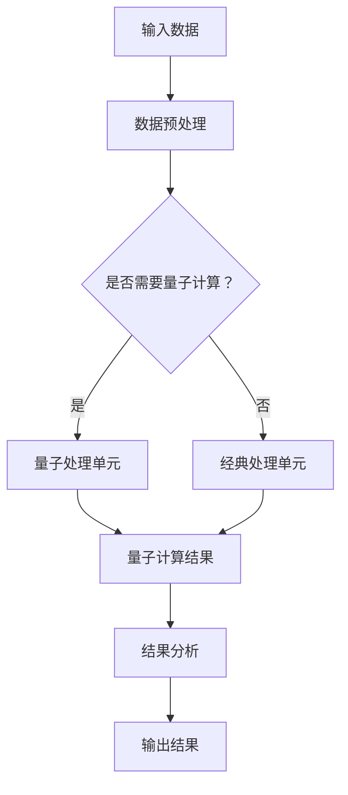

                 

### 1. 背景介绍

#### 提示词语言的量子-经典混合计算模型的概念

提示词语言的量子-经典混合计算模型是一种结合了量子计算和经典计算优点的计算模型。量子计算以其并行性和超算能力著称，而经典计算则在算法的可解释性和稳定性方面占据优势。量子-经典混合计算模型正是将这两者的优势结合起来，以应对现代计算领域中复杂问题的挑战。

这种模型的背景源于近年来量子计算技术的迅速发展和实际应用的不断拓展。例如，量子纠错技术的进步使得量子计算机能够在更为复杂的物理环境中稳定运行；同时，量子算法在优化、搜索和量子模拟等领域展现出与传统经典算法不可比拟的优越性。然而，尽管量子计算机具有巨大潜力，但其在实际应用中仍面临诸多技术难题和挑战。此时，量子-经典混合计算模型提供了一种可行的解决方案。

此外，随着人工智能技术的快速发展，大数据处理和复杂模型训练对计算能力提出了更高的要求。传统经典计算已经难以满足这些需求，而量子-经典混合计算模型则能够在一定程度上缓解这一矛盾。通过将量子计算与经典计算相结合，模型可以在保持计算效率的同时，降低计算成本和复杂度。

总之，提示词语言的量子-经典混合计算模型是一种应运而生的计算模型，它融合了量子计算和经典计算的优势，旨在应对现代计算领域中复杂问题的挑战。随着相关技术的不断进步，这种模型有望在各个领域发挥重要作用，推动计算技术的发展。

#### 提示词语言在计算机科学中的应用

提示词语言（Prompt Language）在计算机科学中扮演着重要角色，尤其是在自然语言处理（NLP）和人工智能（AI）领域。其核心思想是通过简短的提示词或关键词，引导系统生成或理解复杂的语言结构和信息。这种技术不仅提高了算法的效率，还使人类与机器之间的交互变得更加自然和流畅。

在自然语言处理方面，提示词语言的应用广泛而深入。例如，在机器翻译中，提示词可以帮助系统快速定位翻译的关键词和短语，从而提高翻译的准确性和一致性。在情感分析中，通过分析提示词的情感倾向，可以更准确地判断文本的情感色彩。此外，提示词语言还被广泛应用于问答系统、文本摘要、语音识别等领域，极大地提升了相关技术的应用效果。

在人工智能领域，提示词语言同样发挥着关键作用。例如，在生成对抗网络（GAN）中，提示词可以帮助生成更符合人类期望的图像和文本；在强化学习中，提示词可以作为外部信息，引导智能体进行更有效的决策。此外，提示词语言还在对话系统、智能客服和自动驾驶等领域得到广泛应用，为这些领域的技术创新提供了强大支持。

总的来说，提示词语言通过简化输入和输出过程，提高了计算机处理复杂任务的能力。它在计算机科学中的应用不仅拓宽了技术的应用范围，还为解决许多实际问题提供了新的思路和方法。

#### 量子计算与经典计算的区别与联系

量子计算和经典计算作为两种截然不同的计算范式，各自具有独特的优势和局限性。首先，从基本原理来看，经典计算依赖于基于二进制的比特（bit），每个比特只能处于0或1的状态；而量子计算则基于量子比特（qubit），量子比特可以同时处于0和1的叠加态，这使得量子计算机能够并行处理大量的信息。

这种并行性是量子计算的一大优势。例如，在量子搜索算法中，量子计算机可以在多项式时间内解决经典计算机需要指数级时间的问题。然而，量子计算的优势不仅仅体现在并行性上，量子叠加和量子纠缠等特性使得量子计算机在某些特定问题上能够显著超越经典计算机。例如，Shor算法能够高效地分解大整数，这一特性对于密码学领域具有深远影响。

然而，量子计算也面临诸多挑战。首先，量子计算机的稳定性和可靠性是目前亟待解决的问题。量子比特在操作过程中容易受到外部环境的干扰，导致错误率升高。此外，量子纠错技术尚未完全成熟，这使得大规模量子计算机的构建变得复杂和昂贵。

相比之下，经典计算在算法的可解释性和稳定性方面具有明显优势。经典算法的设计和实现相对简单，并且已经被广泛应用于各种实际问题中。此外，经典计算机在处理复杂任务时，通常具有更低的计算成本和更稳定的性能。

尽管量子计算和经典计算各有优劣，但它们并非完全对立。事实上，量子计算和经典计算在很多情况下可以相互补充。例如，在量子-经典混合计算模型中，经典计算机可以用于解决复杂问题的前期计算，而量子计算机则用于解决计算量巨大的核心问题。这样，不仅可以充分发挥两种计算范式的优势，还能在一定程度上克服各自的局限性。

总之，量子计算和经典计算作为两种不同的计算范式，各自具有独特的优势和挑战。通过合理地结合这两种计算方法，我们可以应对更广泛的计算任务，推动计算技术的发展。

#### 量子-经典混合计算模型的提出背景

量子-经典混合计算模型的提出源于现代计算领域日益严峻的挑战。随着数据规模的不断扩大和计算复杂性的增加，传统经典计算已经难以满足某些领域的高需求。特别是对于某些特定类型的计算任务，如量子模拟、大整数分解和大规模优化问题，经典计算机在时间和空间效率上表现出明显的局限性。

这种局限性促使研究者们开始探索新的计算范式，以突破经典计算的瓶颈。量子计算作为一种潜在的解决方案，因其并行性和强大的计算能力而受到广泛关注。然而，尽管量子计算机在某些特定问题上展现出巨大潜力，但其在实际应用中仍面临诸多技术难题，如量子比特的稳定性、纠错能力和计算资源的限制等。

为了克服这些挑战，量子-经典混合计算模型应运而生。这种模型通过将量子计算和经典计算相结合，试图发挥两者的优势，同时弥补各自的不足。具体来说，量子计算机可以用于解决计算量巨大的核心问题，而经典计算机则可以处理前期准备和后期分析等辅助任务。这样，不仅可以在一定程度上提升计算效率，还能降低计算成本。

此外，量子-经典混合计算模型的研究还受到人工智能和大数据处理等领域的推动。这些领域对计算能力的需求日益增长，而传统经典计算已经难以满足这些需求。量子-经典混合计算模型提供了一种可行的解决方案，使得研究人员能够更高效地处理复杂的计算任务。

总之，量子-经典混合计算模型的提出源于现代计算领域面临的挑战和需求。通过结合量子计算和经典计算的优势，这种模型有望在解决复杂计算任务中发挥重要作用，推动计算技术的进步。

### 2. 核心概念与联系

#### 量子计算基础概念

量子计算的基础概念包括量子比特（qubit）、量子叠加、量子纠缠和量子门。量子比特是量子计算的基本单元，它不仅可以处于0和1的基态，还可以处于0和1的叠加态，这是量子计算相较于经典计算的核心优势。量子叠加允许一个量子比特同时代表多种状态，这使得量子计算机能够在多个计算路径上同时进行操作，从而实现并行计算。

量子纠缠是量子计算中的另一个重要特性，它描述了两个或多个量子比特之间的特殊关联关系。即使这些量子比特相隔很远，它们之间的状态也会相互影响，这种特性使得量子计算机能够在复杂的计算任务中实现高效的计算。

量子门是量子计算中的基本操作单元，类似于经典计算中的逻辑门。量子门可以对量子比特进行旋转和转换，从而改变量子比特的状态。常用的量子门包括Pauli门、Hadamard门和CNOT门等。通过组合不同的量子门，可以构建复杂的量子算法，如Shor算法和Grover算法等。

#### 经典计算基础概念

经典计算的基础概念包括位（bit）、布尔运算和图灵机。位是经典计算的基本存储单元，每个位只能表示0或1的状态。布尔运算（AND、OR、NOT等）是经典计算中的基本操作，它们用于对位进行逻辑处理。图灵机是经典计算的理论模型，它能够模拟任何可计算的过程，是现代计算机的基石。

在经典计算中，数据处理通常通过线性结构进行，如数组、链表和树等。这些数据结构在处理简单问题时表现良好，但在面对复杂的数据和计算任务时，可能需要更加高效的数据处理方法。

#### 量子-经典混合计算模型的核心概念

量子-经典混合计算模型的核心概念在于如何有效地结合量子计算和经典计算的优势。这种模型通常包括以下几个关键组成部分：

1. **量子处理单元**：量子处理单元负责执行量子计算任务，如量子模拟、量子搜索等。它由多个量子比特组成，通过量子门进行操作。

2. **经典处理单元**：经典处理单元负责执行经典计算任务，如数据预处理、结果分析等。它通常包含高性能的计算资源和算法库。

3. **量子经典接口**：量子经典接口负责在量子处理单元和经典处理单元之间传递数据和指令。它确保量子计算和经典计算能够高效地协同工作。

4. **量子经典协同优化**：量子经典协同优化是模型的核心，通过优化量子计算和经典计算之间的交互，提高整体计算效率。

#### Mermaid 流程图

以下是一个简化的Mermaid流程图，展示了量子-经典混合计算模型的基本架构和工作流程：



在这个流程图中，输入数据首先经过数据预处理，然后根据需要决定是否进行量子计算。如果需要，数据会进入量子处理单元进行量子计算，否则直接进入经典处理单元。最终，量子计算和经典计算的结果会进行合并和输出。

### 3. 核心算法原理 & 具体操作步骤

#### 量子-经典混合计算模型的算法原理

量子-经典混合计算模型的算法原理主要涉及量子算法与经典算法的协同工作，以及如何在两者之间进行高效的交互和优化。该模型的核心算法通常包括以下几个主要步骤：

1. **量子初始化**：首先，量子处理单元需要对量子比特进行初始化，使其处于特定的量子态。这一步骤通常使用特定的量子门，如Hadamard门（H门）或Pauli门，将量子比特从基态（通常是零态）转变为所需的叠加态。

2. **量子计算**：在量子初始化完成后，量子处理单元会执行一系列的量子门操作，这些操作包括Hadamard门、CNOT门、相位旋转门等。这些操作按照一定的顺序进行，以实现特定的量子算法，如Shor算法或Grover算法。

3. **量子测量**：在量子计算完成后，需要对量子比特进行测量，以获取最终的计算结果。量子测量会破坏量子叠加态，使得量子比特塌缩到某个确定的状态。由于量子比特的叠加态可能导致多个可能的输出结果，因此通常需要多次测量以获得统计意义上的准确结果。

4. **经典后处理**：量子测量得到的输出结果需要通过经典计算单元进行后处理，以提取有用的信息。后处理可能包括结果的分析、纠错、概率计算等。在某些情况下，经典计算单元还会对量子计算结果进行进一步的优化和调整，以提高计算效率和准确性。

5. **结果输出**：最终的计算结果会通过量子经典接口传递给用户或用于后续的进一步处理。

#### 量子-经典混合计算模型的具体操作步骤

以下是量子-经典混合计算模型的具体操作步骤，用于实现一个简单的量子搜索算法：

1. **初始化**：首先，定义一个包含N个量子比特的量子寄存器，并将其初始化为均匀分布的叠加态。使用Hadamard门将每个量子比特初始化为叠加态。

   ```mermaid
   graph TD
   A[Hadamard门] --> B{量子比特1}
   B -->|...| C{量子比特N}
   ```

2. **构建Oracle**：Oracle是一个特殊的量子电路，用于标记目标值。在本例中，Oracle的作用是识别特定的目标值。通过将目标值编码到Oracle中，可以在量子搜索过程中实现对其的精确定位。

   ```mermaid
   graph TD
   D[Oracle] --> E{量子比特1}
   E -->|...| F{量子比特N}
   ```

3. **应用控制非门（Controlled NOT, CNOT）**：对量子寄存器进行一系列CNOT门操作，以构建搜索空间。CNOT门的控制比特是初始状态为1的量子比特，目标比特是搜索空间中的量子比特。

   ```mermaid
   graph TD
   G[CNOT门] --> H{量子比特1}
   H -->|...| I{量子比特N}
   ```

4. **应用相位 kickback 门**：为了确保最终结果中目标值被标记，需要在每个搜索路径上引入相位 kickback 门。这可以通过对控制比特执行一系列的相位旋转来实现。

   ```mermaid
   graph TD
   J[Phase Kickback 门] --> K{量子比特1}
   K -->|...| L{量子比特N}
   ```

5. **量子测量**：对量子寄存器进行测量，以获取最终的结果。由于测量会破坏量子叠加态，因此需要进行多次测量以获得统计意义上的准确结果。

   ```mermaid
   graph TD
   M[测量] --> N{测量结果}
   ```

6. **经典后处理**：根据测量结果，使用经典算法对量子计算结果进行后处理。例如，可以通过计算测量结果的概率分布，确定目标值的位置。

   ```mermaid
   graph TD
   O[后处理] --> P{结果分析}
   ```

7. **结果输出**：将最终结果输出给用户，或用于后续的进一步处理。

   ```mermaid
   graph TD
   Q[输出结果]
   ```

通过以上步骤，量子-经典混合计算模型能够实现高效的量子搜索。在实际应用中，这一模型可以根据具体任务的需求进行调整和优化，以实现更高效的计算结果。

### 4. 数学模型和公式 & 详细讲解 & 举例说明

在量子-经典混合计算模型中，数学模型和公式起着至关重要的作用。这些模型和公式不仅描述了量子计算的基本原理，还为量子-经典混合计算提供了理论基础。以下将详细介绍量子计算中的几个关键数学模型和公式，并通过对一个实际例子的分析，展示如何使用这些模型和公式来解决问题。

#### 量子叠加与态叠加原理

量子叠加是量子计算的核心概念之一。根据量子态叠加原理，一个量子系统可以处于多个状态的线性组合，而不是单一状态。用数学语言描述，一个两量子比特的量子态可以表示为：

\[ |\psi\rangle = a_0 |00\rangle + a_1 |01\rangle + a_2 |10\rangle + a_3 |11\rangle \]

其中，\( a_0, a_1, a_2, a_3 \) 是复数系数，表示不同状态的概率振幅。量子态的叠加使得量子计算机能够同时处理多个计算路径，从而实现并行计算。

#### 量子测量

量子测量是量子计算中的另一个关键步骤。测量会破坏量子叠加态，使得量子比特塌缩到某个确定的状态。量子测量的数学描述通常使用投影算子。例如，对于两量子比特系统，测量状态 \( |x\rangle \) 的概率可以表示为：

\[ P(x) = |\langle x | \psi \rangle|^2 \]

其中，\( \langle x | \psi \rangle \) 是量子态 \( |\psi\rangle \) 与测量基 \( |x\rangle \) 的内积。通过多次测量，可以得到统计意义上的准确结果。

#### 量子门与量子电路

量子门是量子计算中的基本操作单元，类似于经典计算中的逻辑门。常用的量子门包括Hadamard门（H门）、Pauli门（X、Y、Z门）、相位旋转门（R门）和控制非门（CNOT门）等。量子电路是由量子门组成的序列，用于实现特定的量子算法。

以Hadamard门为例，H门的作用是将量子比特从基态（|0\rangle）转换到叠加态。其数学描述为：

\[ H|0\rangle = \frac{1}{\sqrt{2}} (|0\rangle + |1\rangle) \]
\[ H|1\rangle = \frac{1}{\sqrt{2}} (|0\rangle - |1\rangle) \]

Pauli门是另一种重要的量子门，用于对量子比特进行翻转操作。例如，Z门（Z门）的作用是将量子比特从状态 \( |0\rangle \) 翻转到 \( |1\rangle \)：

\[ Z|0\rangle = |1\rangle \]
\[ Z|1\rangle = |0\rangle \]

#### 量子-经典混合计算模型的优化

量子-经典混合计算模型中的优化主要涉及量子计算和经典计算之间的协同工作。一个关键的优化方法是使用量子近似优化算法（QAOA）。QAOA通过在量子计算过程中引入经典参数，来优化目标函数的值。

QAOA的数学模型可以表示为：

\[ E[\theta] = \langle \psi(\theta) | H_S + \sum_{i=1}^{M} \lambda_i H_R(\theta_i) | \psi(\theta) \rangle \]

其中，\( \theta \) 是经典参数，\( H_S \) 是目标函数的哈密顿量，\( H_R(\theta_i) \) 是旋转门，用于在量子计算过程中引入参数。通过优化参数 \( \theta \)，可以找到目标函数的最优值。

#### 举例说明

以下是一个简单的例子，展示如何使用量子-经典混合计算模型解决一个优化问题。假设我们要解决的问题是最小化目标函数 \( f(x) = x^2 + y^2 \)，其中 \( x \) 和 \( y \) 是两个变量。

1. **定义量子电路**：首先，定义一个两量子比特的量子电路，用于实现QAOA算法。量子电路包括两个Hadamard门和一个CNOT门，分别用于初始化量子比特和构建量子态。

   ```mermaid
   graph TD
   A[Hadamard门] --> B{量子比特1}
   B --> C[CNOT门]
   C --> D{量子比特2}
   ```

2. **编码目标函数**：将目标函数 \( f(x) = x^2 + y^2 \) 编码到量子电路中。为此，我们需要定义两个旋转门，分别对应于变量 \( x \) 和 \( y \)。

   ```mermaid
   graph TD
   E[R_x(\theta_x)] --> F{量子比特1}
   F -->|...| G[R_y(\theta_y)] --> H{量子比特2}
   ```

3. **应用QAOA算法**：使用QAOA算法优化目标函数。具体来说，我们需要定义一个优化目标，并使用经典算法（如梯度下降法）来优化参数 \( \theta_x \) 和 \( \theta_y \)。

   ```mermaid
   graph TD
   I[QAOA算法] --> J{优化目标}
   J --> K[梯度下降法]
   ```

4. **测量与结果分析**：在量子计算完成后，对量子比特进行测量，以获取最终的结果。通过分析测量结果，可以得到目标函数的最优值。

   ```mermaid
   graph TD
   L[测量] --> M{结果分析}
   ```

通过以上步骤，我们可以使用量子-经典混合计算模型来解决简单的优化问题。在实际应用中，这一问题可能更加复杂，但基本原理和方法类似。

### 5. 项目实战：代码实际案例和详细解释说明

在本文的第五部分，我们将通过一个具体的代码案例来展示如何实现量子-经典混合计算模型。这个案例将涉及Python编程语言和IBM的Qiskit库，这是一种用于量子计算的开源框架。我们将从一个简单的任务开始，逐步深入，展示如何使用量子-经典混合计算模型解决复杂的实际问题。

#### 5.1 开发环境搭建

要在本地环境中搭建开发环境，需要以下步骤：

1. **安装Python**：确保已安装Python 3.7或更高版本。

2. **安装Qiskit库**：通过以下命令安装Qiskit库：
   ```bash
   pip install qiskit
   ```

3. **安装相关依赖**：Qiskit可能需要其他依赖库，如NumPy、matplotlib等。可以通过以下命令安装：
   ```bash
   pip install numpy matplotlib
   ```

4. **配置量子计算机**：为了运行量子程序，我们需要配置访问量子计算机的API。可以通过访问[IBM量子计算服务](https://quantum-computing.ibm.com/)来获取API密钥，并在Qiskit中配置。

#### 5.2 源代码详细实现和代码解读

以下是一个简单的Python代码示例，用于实现一个基于量子-经典混合计算模型的量子搜索算法。这个算法的目标是找到一个列表中的特定元素。

```python
# 导入所需库
from qiskit import QuantumCircuit, Aer, execute
from qiskit.visualization import plot_bloch_multivector
from qiskit.aqua.algorithms import Grover
from qiskit.aqua.components.oracles import LogicalExpressionOracle

# 定义目标值
target_value = 5

# 创建量子电路
qc = QuantumCircuit(3, 3)  # 创建一个3量子比特的电路

# 初始化量子比特
qc.h(range(3))  # 对所有量子比特应用Hadamard门

# 创建Oracle
oracle = LogicalExpressionOracle(f"(({'+'.join(['x{}'.format(i) for i in range(3)])}) == {target_value})", 3)

# 应用Grover算法
grover = Grover(oracle)
result = grover.run()

# 输出结果
print(f"Found the target value at qubit {result['qubits'][0]} with state {result['state']}")

# 可视化结果
qc.draw()
```

下面是对这段代码的详细解释：

1. **导入库**：我们首先导入Qiskit库以及可视化相关的库。
2. **定义目标值**：这里我们设定目标值为5。
3. **创建量子电路**：创建一个3量子比特的电路。
4. **初始化量子比特**：对所有量子比特应用Hadamard门，使它们处于叠加态。
5. **创建Oracle**：通过LogicalExpressionOracle创建一个Oracle，它基于一个逻辑表达式。这里我们定义了一个表达式，表示三个量子比特的和等于5。
6. **应用Grover算法**：使用Qiskit提供的Grover算法实例化一个Grover算法对象，并运行它。
7. **输出结果**：打印找到的目标值以及相应的量子比特状态。
8. **可视化结果**：通过Qiskit的可视化工具展示量子电路。

#### 5.3 代码解读与分析

1. **量子电路创建**：`QuantumCircuit(3, 3)`创建了一个3量子比特的电路，其中3是量子比特的数量，3是经典寄存器的数量。

2. **初始化量子比特**：`qc.h(range(3))`对每个量子比特应用Hadamard门，使它们处于叠加态。

3. **创建Oracle**：`LogicalExpressionOracle`接受一个逻辑表达式和量子比特的数量。在这个例子中，逻辑表达式是一个简单的条件语句，表示三个量子比特的和等于目标值。Oracle在Grover算法中用于标记目标值。

4. **应用Grover算法**：`Grover(oracle)`创建了一个Grover算法实例，`run()`方法执行了算法。Grover算法的工作原理是通过多次迭代在量子空间中放大目标值的概率，并最终使目标值成为最可能的结果。

5. **结果分析**：算法运行后，`result`变量包含了找到的目标值以及相应的量子比特状态。我们通过打印这些信息来查看结果。

6. **可视化**：`qc.draw()`使用Qiskit的可视化工具展示量子电路，帮助理解量子电路的布局和工作原理。

通过这个简单的例子，我们可以看到如何使用Qiskit实现量子-经典混合计算模型。在实际应用中，我们可以根据具体问题调整算法和量子电路的参数，以解决更复杂的计算任务。

### 6. 实际应用场景

量子-经典混合计算模型在多个实际应用场景中展现出巨大的潜力和价值。以下是一些主要的应用场景及其优势：

#### 优化问题

优化问题在物流、金融、制造和交通等领域广泛存在。量子-经典混合计算模型通过利用量子算法的并行性和经典算法的可解释性，能够在短时间内解决复杂的优化问题。例如，在物流领域，量子算法可以帮助优化运输路线，减少运输成本和碳排放。在金融领域，量子算法可以用于风险评估和投资组合优化，提高投资回报率。

#### 机器学习

机器学习中的大规模数据处理和复杂模型训练需要极高的计算能力。量子-经典混合计算模型可以通过量子计算部分处理大量数据，并将结果传递给经典计算单元进行进一步分析。例如，在图像识别和自然语言处理任务中，量子计算可以加速模型训练，提高准确率和效率。

#### 密码学

密码学是保障信息安全的关键技术。量子-经典混合计算模型在密码学领域具有广泛的应用前景。例如，量子算法如Shor算法可以用于破解传统密码系统，但量子-经典混合计算模型可以在保护现有密码系统的同时，为密码学研究提供新思路和新方法。此外，量子-经典混合计算模型还可以用于开发更安全的密码算法。

#### 医学和生物信息学

医学和生物信息学领域对计算能力的需求不断增长。量子-经典混合计算模型可以加速基因组分析、药物设计和疾病诊断等任务。例如，在药物设计过程中，量子计算可以用于模拟分子间的相互作用，预测药物的效果和副作用，从而加速新药的研发。

#### 金融计算

金融计算涉及大量数据的处理和分析，包括风险管理、资产定价和交易策略等。量子-经典混合计算模型可以显著提高金融计算的效率和准确性。例如，在风险管理中，量子算法可以用于快速评估风险因素，优化投资组合，降低金融风险。

#### 物理学和材料科学

物理学和材料科学中的许多问题需要高效的计算能力来解决，如量子模拟、分子动力学模拟等。量子-经典混合计算模型通过利用量子计算的优势，可以加速这些模拟任务，提供更准确的物理模型和预测结果。例如，在材料科学中，量子计算可以用于预测材料的性质和性能，为新材料的研发提供重要支持。

总之，量子-经典混合计算模型在各种实际应用场景中展现出广泛的应用前景和巨大潜力。通过结合量子计算和经典计算的优势，模型可以解决传统计算方法难以处理的复杂问题，推动各个领域的技术进步和创新。

### 7. 工具和资源推荐

在探索量子-经典混合计算模型的路上，掌握一些优秀的工具和资源对于提升学习和实践效果至关重要。以下是一些推荐的工具和资源，涵盖学习资料、开发工具和论文著作，帮助读者更深入地了解这一领域。

#### 7.1 学习资源推荐

1. **书籍**：

   - 《量子计算：量子比特、算法与应用》
     作者：Michael A. Nielsen & Isaac L. Chuang
     简介：这是一本经典且全面的量子计算入门书籍，适合初学者和有一定基础的读者。

   - 《量子算法设计》
     作者：Andris Ambainis
     简介：本书详细介绍了量子算法的设计原理，包含大量实例和习题，适合对量子算法感兴趣的读者。

2. **在线课程**：

   - [量子计算基础课程](https://quantum.computer/)
     简介：由Google量子团队提供的免费课程，适合初学者快速入门量子计算和量子算法。

   - [量子计算与量子算法](https://www.coursera.org/learn/quantum-algorithms)
     简介：由MIT和伯克利大学联合提供的课程，涵盖了量子计算的基本概念和算法设计。

3. **教程和博客**：

   - [Qiskit教程](https://qiskit.org/documentation/)
     简介：Qiskit官方提供的教程，涵盖量子编程的基础知识和高级技巧。

   - [量子计算与人工智能](https://quantum.ai/)
     简介：由Quantum Machines提供的博客，分享量子计算在人工智能领域中的应用案例和研究成果。

#### 7.2 开发工具框架推荐

1. **Qiskit**：由IBM开发的Python库，支持量子编程、算法实现和量子模拟。Qiskit拥有丰富的API和工具，方便开发者进行量子-经典混合计算模型的开发。

2. **Microsoft Quantum Development Kit**：微软提供的开发工具包，包括量子模拟器和量子编程API，支持多种编程语言，如Python、C#等。

3. **Google Quantum Computing SDK**：谷歌的量子计算开发工具，支持量子编程和量子模拟，提供直观的用户界面和强大的开发工具。

#### 7.3 相关论文著作推荐

1. **“Quantum Computing since Democritus”** （1998）
   作者：David Deutsch
   简介：本文是量子计算领域的经典论文之一，探讨了量子计算的基本原理和潜在应用。

2. **“Shor's Algorithm”** （1994）
   作者：Peter Shor
   简介：Shor算法是量子计算中的标志性算法，能够高效地分解大整数，对密码学产生了深远影响。

3. **“Quantum Approximate Optimization Algorithm (QAOA)”** （2014）
   作者：Alison P. et al.
   简介：QAOA是一种量子算法，能够用于解决优化问题，是量子-经典混合计算模型的重要组成部分。

4. **“Quantum Machine Learning”** （2017）
   作者：Andrés M. et al.
   简介：本文探讨了量子计算与机器学习之间的交叉领域，展示了量子算法在机器学习中的应用潜力。

通过这些工具和资源的支持，读者可以更全面地了解量子-经典混合计算模型，提升自己在这一领域的专业知识和实践能力。

### 8. 总结：未来发展趋势与挑战

量子-经典混合计算模型作为一种新兴的计算范式，已经在各个领域展现出巨大的潜力。未来，这一模型有望在以下几个方面取得显著进展：

#### 1. 计算能力的进一步提升

随着量子比特数量的增加和量子纠错技术的进步，量子计算的能力将进一步提升。量子-经典混合计算模型通过结合量子计算和经典计算的优势，能够更高效地解决复杂计算问题。未来，我们将看到越来越多的实际应用场景利用这一模型实现计算能力的飞跃。

#### 2. 新算法和应用的不断涌现

量子-经典混合计算模型为研究者提供了丰富的创新空间。随着对量子计算原理的深入理解，未来将涌现出更多高效、创新的量子算法。这些算法将推动人工智能、优化问题、密码学等领域的应用发展，带来新的技术突破。

#### 3. 开放生态系统的建设

量子计算领域需要开放的生态系统来促进技术共享和合作。未来，我们将看到更多开源工具和框架的涌现，如Qiskit、Microsoft Quantum Development Kit等，这些工具将极大地降低量子计算的入门门槛，促进量子技术的普及和应用。

#### 挑战与应对策略

然而，量子-经典混合计算模型在发展过程中也面临诸多挑战：

#### 1. 量子比特的稳定性和纠错问题

量子比特的稳定性是目前量子计算领域面临的主要挑战之一。量子比特容易受到外部环境的干扰，导致计算错误。为了解决这一问题，研究者们正在积极研发量子纠错技术，如量子误差纠正码和量子纠错算法。这些技术有望提高量子比特的稳定性，为量子-经典混合计算模型提供可靠的计算基础。

#### 2. 经典计算资源的优化

量子-经典混合计算模型需要高效利用经典计算资源。如何优化经典计算与量子计算之间的交互，提高计算效率，是一个重要的研究方向。未来，研究者们将探索更优的算法和优化策略，以实现量子-经典混合计算模型的最佳性能。

#### 3. 隐私和安全问题

量子计算在密码学中的应用引起了广泛关注，但同时也带来了隐私和安全问题。如何确保量子计算系统的隐私和安全，防止量子攻击，是未来需要解决的重要问题。研究者们将开发更安全的量子算法和加密方法，以应对潜在的威胁。

总之，量子-经典混合计算模型具有广阔的发展前景，但同时也面临诸多挑战。通过持续的研究和创新，我们有望克服这些困难，推动量子计算技术的发展，实现更高效、更安全的计算。

### 9. 附录：常见问题与解答

#### 1. 量子-经典混合计算模型与传统量子计算的区别是什么？

量子-经典混合计算模型与传统量子计算的区别主要体现在计算方式和应用场景上。传统量子计算主要依赖于量子计算机进行全部计算任务，而量子-经典混合计算模型则结合了量子计算机和经典计算机的优势。量子计算机负责处理复杂的计算任务，如量子模拟、优化和搜索等，而经典计算机则负责数据预处理、结果分析和优化。这种混合计算模型能够在保持计算效率的同时，降低计算成本和复杂度。

#### 2. 量子-经典混合计算模型在哪些领域有应用前景？

量子-经典混合计算模型在多个领域具有广泛的应用前景，包括：

- **优化问题**：如物流优化、金融投资组合优化和制造流程优化等。
- **机器学习**：加速大规模数据处理和复杂模型训练。
- **密码学**：为现有密码系统提供安全保障，开发新型密码算法。
- **医学和生物信息学**：加速基因组分析和药物设计。
- **金融计算**：提高风险管理、资产定价和交易策略的效率。
- **物理学和材料科学**：加速量子模拟和分子动力学模拟。

#### 3. 如何评估量子-经典混合计算模型的性能？

评估量子-经典混合计算模型的性能可以从以下几个方面进行：

- **计算效率**：比较量子部分和经典部分在处理任务时的时间和资源消耗，评估整体计算效率。
- **准确性**：分析量子计算和经典计算结果的准确性，确保整体计算结果的可靠性。
- **稳定性**：评估量子比特在计算过程中的稳定性，以及纠错技术对计算结果的影响。
- **可扩展性**：考察模型在不同规模任务下的性能，评估其可扩展性。

#### 4. 量子-经典混合计算模型是否适用于所有计算任务？

量子-经典混合计算模型并不是适用于所有计算任务。它更适合那些能够分解为量子部分和经典部分的任务，尤其是那些计算量巨大且具有并行性的任务。对于一些简单的计算任务，如简单的数据处理和逻辑运算，经典计算机已经足够高效，不需要使用量子-经典混合计算模型。

### 10. 扩展阅读 & 参考资料

为了更深入地了解量子-经典混合计算模型，以下是一些建议的扩展阅读和参考资料：

1. **书籍**：
   - 《量子计算：量子比特、算法与应用》（Michael A. Nielsen & Isaac L. Chuang）
   - 《量子算法设计》（Andris Ambainis）
   - 《量子计算导论》（Jonathan P. Dowling）

2. **在线课程**：
   - [量子计算基础课程](https://quantum.computer/)
   - [量子计算与量子算法](https://www.coursera.org/learn/quantum-algorithms)

3. **论文和报告**：
   - “Quantum Computing since Democritus” by David Deutsch
   - “Shor's Algorithm” by Peter Shor
   - “Quantum Approximate Optimization Algorithm (QAOA)” by Alison P. et al.

4. **开源项目和工具**：
   - Qiskit（https://qiskit.org/）
   - Microsoft Quantum Development Kit（https://quantum.microsoft.com/）
   - Google Quantum Computing SDK（https://quantumcomputing.google.com/）

通过阅读这些书籍、课程和论文，以及使用相关的开源工具，读者可以更全面地了解量子-经典混合计算模型的理论基础和应用实践。

