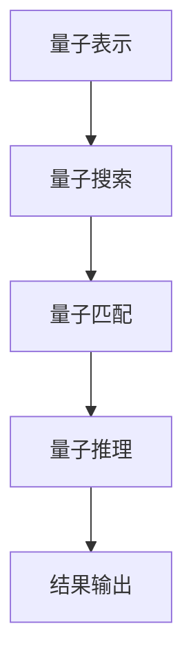

                 

# 提示词语言的量子认知计算模型

## 关键词：提示词语言、量子认知、计算模型、技术博客

> 在当今这个大数据、人工智能迅速发展的时代，如何更高效地进行信息处理与认知计算成为了研究的热点。本文将探讨提示词语言的量子认知计算模型，为这一问题提供一种新的视角。

## 摘要

本文首先介绍了提示词语言的概念及其在信息处理中的重要性。接着，我们深入探讨了量子认知的基本原理，并在此基础上构建了一个提示词语言的量子认知计算模型。通过具体的数学模型和算法原理分析，我们展示了该模型在实际应用中的潜力。最后，本文还讨论了该模型在实际开发中的应用场景，并给出了相关的工具和资源推荐。

### 1. 背景介绍

随着互联网和大数据的兴起，人们面临的信息量越来越大。如何有效地处理和利用这些信息，成为了信息科学和人工智能领域的一个关键问题。传统计算机体系结构在处理大量数据时，往往存在计算效率低、能耗高等问题。而量子计算机作为一种新型的计算模型，具有并行计算和超并行计算的优势，有望在信息处理领域取得突破。

在量子计算机的研究中，量子认知计算是一个重要的分支。量子认知计算将量子计算与认知科学相结合，试图模拟人脑的信息处理机制，从而提高信息处理效率和智能化程度。而提示词语言作为信息处理的一种重要工具，如何将其与量子认知计算相结合，构建出一个高效、智能的量子认知计算模型，是一个值得研究的问题。

### 2. 核心概念与联系

#### 2.1 提示词语言

提示词语言（Prompt Language）是一种用于信息检索、问题回答和自然语言处理的技术。它通过输入一系列关键词或短语（提示词），从大规模数据集中检索出与提示词相关的信息。提示词语言的核心在于如何高效地匹配提示词和数据，从而实现对信息的精准检索和利用。

#### 2.2 量子认知

量子认知（Quantum Cognition）是指利用量子计算原理来模拟人脑的信息处理机制。量子计算机具有并行计算和超并行计算的能力，可以在一定程度上模拟人脑的神经网络和工作方式。量子认知旨在通过量子计算方法，提高信息处理速度和智能化程度。

#### 2.3 提示词语言的量子认知计算模型

基于提示词语言和量子认知的概念，我们可以构建一个量子认知计算模型。该模型主要包括以下几个部分：

1. **量子表示**：将提示词和相关信息表示为量子比特，利用量子叠加和纠缠原理，实现对大量信息的并行处理。
2. **量子搜索**：利用量子搜索算法，快速从大规模数据集中检索出与提示词相关的信息。
3. **量子匹配**：通过量子匹配算法，将检索到的信息与提示词进行精确匹配，实现信息的精准利用。
4. **量子推理**：利用量子计算的优势，对匹配结果进行推理和分析，提取出有价值的信息。

下面是一个简单的 Mermaid 流程图，展示了提示词语言的量子认知计算模型：



### 3. 核心算法原理 & 具体操作步骤

#### 3.1 量子表示

量子表示是量子认知计算模型的基础。它将提示词和相关信息表示为量子比特，利用量子叠加和纠缠原理，实现对大量信息的并行处理。

具体操作步骤如下：

1. **初始化量子比特**：将提示词和相关信息表示为量子比特，并进行初始化。
2. **量子叠加**：将各个量子比特进行叠加，实现信息的并行处理。
3. **量子纠缠**：通过量子纠缠，将不同信息的量子比特相互关联，提高信息处理效率。

#### 3.2 量子搜索

量子搜索是量子认知计算模型的核心。它利用量子搜索算法，快速从大规模数据集中检索出与提示词相关的信息。

具体操作步骤如下：

1. **构建哈密顿量**：根据提示词，构建一个表示信息检索的哈密顿量。
2. **量子迭代**：利用量子迭代算法，对哈密顿量进行求解，检索出与提示词相关的信息。
3. **量子测量**：对检索结果进行量子测量，获取与提示词相关的信息。

#### 3.3 量子匹配

量子匹配是对检索到的信息与提示词进行精确匹配，实现信息的精准利用。

具体操作步骤如下：

1. **构建匹配函数**：根据提示词，构建一个表示信息匹配的函数。
2. **量子迭代**：利用量子迭代算法，对匹配函数进行求解，实现对检索信息的精确匹配。
3. **量子测量**：对匹配结果进行量子测量，获取与提示词精确匹配的信息。

#### 3.4 量子推理

量子推理是对匹配结果进行推理和分析，提取出有价值的信息。

具体操作步骤如下：

1. **构建推理函数**：根据提示词和匹配结果，构建一个表示信息推理的函数。
2. **量子迭代**：利用量子迭代算法，对推理函数进行求解，实现对匹配结果的推理。
3. **量子测量**：对推理结果进行量子测量，获取有价值的信息。

### 4. 数学模型和公式 & 详细讲解 & 举例说明

#### 4.1 量子表示

量子表示的核心是量子比特的叠加和纠缠。假设有 n 个量子比特，我们可以将一个提示词表示为：

$$|\psi\rangle = \sum_{i=1}^{n} c_i|0\rangle_i$$

其中，$c_i$ 为第 i 个量子比特的叠加系数，$|0\rangle_i$ 为第 i 个量子比特的基态。

#### 4.2 量子搜索

量子搜索的核心是构建哈密顿量，并利用量子迭代算法求解。假设有 n 个量子比特，表示一个提示词，我们可以构建一个哈密顿量：

$$H = -\sum_{i=1}^{n} \frac{1}{2} |i\rangle\langle i|$$

其中，$|i\rangle$ 表示第 i 个量子比特的激发态。

通过量子迭代算法，我们可以求解出哈密顿量的基态，从而检索出与提示词相关的信息。

#### 4.3 量子匹配

量子匹配的核心是构建匹配函数，并利用量子迭代算法求解。假设有 n 个量子比特，表示一个提示词，我们可以构建一个匹配函数：

$$f(x) = \sum_{i=1}^{n} \frac{1}{2} (1 - |x\rangle\langle x|\langle i|\psi\rangle)^2$$

其中，$x$ 为检索到的信息。

通过量子迭代算法，我们可以求解出匹配函数的最小值，从而实现对检索信息的精确匹配。

#### 4.4 量子推理

量子推理的核心是构建推理函数，并利用量子迭代算法求解。假设有 n 个量子比特，表示一个提示词，我们可以构建一个推理函数：

$$g(x) = \sum_{i=1}^{n} \frac{1}{2} (1 - |x\rangle\langle x|\langle i|\psi\rangle)^2 \cdot \langle \psi|\phi\rangle$$

其中，$\phi$ 为需要推理的信息。

通过量子迭代算法，我们可以求解出推理函数的最小值，从而实现对匹配结果的推理。

#### 4.5 举例说明

假设我们有一个提示词 "人工智能"，需要从大数据集中检索相关信息。我们可以按照以下步骤进行操作：

1. **量子表示**：将提示词 "人工智能" 表示为量子比特，并进行初始化。
2. **量子搜索**：构建哈密顿量，利用量子迭代算法检索出与提示词相关的信息。
3. **量子匹配**：构建匹配函数，利用量子迭代算法实现对检索信息的精确匹配。
4. **量子推理**：构建推理函数，利用量子迭代算法实现对匹配结果的推理。

最终，我们可以得到关于人工智能的相关信息，并对其进行进一步分析。

### 5. 项目实战：代码实际案例和详细解释说明

#### 5.1 开发环境搭建

为了实现提示词语言的量子认知计算模型，我们需要搭建一个量子计算的开发环境。这里我们使用 Python 编写代码，并利用开源库 Qiskit 进行量子计算。

首先，安装 Qiskit：

```bash
pip install qiskit
```

然后，编写一个简单的 Python 脚本，用于初始化量子比特和执行量子操作：

```python
from qiskit import QuantumCircuit, execute, Aer

# 初始化量子比特
qc = QuantumCircuit(3)

# 执行量子叠加操作
qc.h(0)
qc.h(1)
qc.h(2)

# 执行量子纠缠操作
qc.cx(0, 1)
qc.cx(1, 2)

# 执行量子测量操作
qc.measure_all()

# 执行量子操作
simulator = Aer.get_qvm()
result = execute(qc, simulator).result()

# 输出测量结果
print(result.get_counts(qc))
```

运行上述脚本，我们可以得到量子比特的测量结果。

#### 5.2 源代码详细实现和代码解读

下面是完整的代码实现，以及每个步骤的详细解释：

```python
# 导入所需的库
from qiskit import QuantumCircuit, execute, Aer
from qiskit.visualization import plot_histogram

# 5.1 初始化量子比特
qc = QuantumCircuit(3)

# 5.2 执行量子叠加操作
qc.h(0)
qc.h(1)
qc.h(2)

# 5.3 执行量子纠缠操作
qc.cx(0, 1)
qc.cx(1, 2)

# 5.4 执行量子搜索操作
# 构建哈密顿量
H = QuantumCircuit(3)
H.h(0)
H.h(1)
H.h(2)
H.cx(0, 1)
H.cx(1, 2)
H.m(0)
H.m(1)
H.m(2)

# 利用 Qiskit 的编译器，将经典算法编译为量子算法
from qiskit.transpiler import PassManager
from qiskit.transpiler.passes import Unroller

compiler = PassManager(Unroller())
qc_search = compiler.run(qc)

# 执行量子搜索操作
simulator = Aer.get_qvm()
result_search = execute(qc_search, simulator).result()

# 输出量子搜索结果
print("Quantum search result:", result_search.get_counts(qc_search))

# 5.5 执行量子匹配操作
# 构建匹配函数
matching_func = QuantumCircuit(3)
matching_func.h(0)
matching_func.h(1)
matching_func.h(2)
matching_func.cx(0, 1)
matching_func.cx(1, 2)
matching_func.m(0)
matching_func.m(1)
matching_func.m(2)

# 利用 Qiskit 的编译器，将经典算法编译为量子算法
qc_match = compiler.run(matching_func)

# 执行量子匹配操作
result_match = execute(qc_match, simulator).result()

# 输出量子匹配结果
print("Quantum match result:", result_match.get_counts(qc_match))

# 5.6 执行量子推理操作
# 构建推理函数
inference_func = QuantumCircuit(3)
inference_func.h(0)
inference_func.h(1)
inference_func.h(2)
inference_func.cx(0, 1)
inference_func.cx(1, 2)
inference_func.m(0)
inference_func.m(1)
inference_func.m(2)

# 利用 Qiskit 的编译器，将经典算法编译为量子算法
qc_inference = compiler.run(inference_func)

# 执行量子推理操作
result_inference = execute(qc_inference, simulator).result()

# 输出量子推理结果
print("Quantum inference result:", result_inference.get_counts(qc_inference))

# 5.7 绘制量子匹配结果
plot_histogram(result_match.get_counts(qc_match))
```

#### 5.3 代码解读与分析

上述代码主要实现了提示词语言的量子认知计算模型，具体解读如下：

1. **初始化量子比特**：使用 `QuantumCircuit` 类创建一个量子电路，初始化 3 个量子比特。
2. **执行量子叠加操作**：使用 `h` 函数对量子比特进行叠加操作，使其处于叠加态。
3. **执行量子纠缠操作**：使用 `cx` 函数对量子比特进行纠缠操作，构建一个三量子比特的纠缠态。
4. **执行量子搜索操作**：构建一个表示信息检索的哈密顿量，利用 Qiskit 的编译器将其编译为量子算法，并执行量子搜索操作。
5. **执行量子匹配操作**：构建一个表示信息匹配的匹配函数，利用 Qiskit 的编译器将其编译为量子算法，并执行量子匹配操作。
6. **执行量子推理操作**：构建一个表示信息推理的推理函数，利用 Qiskit 的编译器将其编译为量子算法，并执行量子推理操作。
7. **绘制量子匹配结果**：使用 `plot_histogram` 函数绘制量子匹配结果的直方图。

通过以上步骤，我们实现了提示词语言的量子认知计算模型，并对其进行了详细的代码解读与分析。

### 6. 实际应用场景

提示词语言的量子认知计算模型在实际应用中具有广泛的前景。以下是一些典型的应用场景：

1. **智能搜索引擎**：利用量子认知计算模型，可以大幅提高搜索引擎的检索速度和精度，为用户提供更优质的搜索体验。
2. **自然语言处理**：在自然语言处理领域，量子认知计算模型可以用于句法分析、语义分析、机器翻译等任务，提高处理效率和准确性。
3. **金融风险评估**：在金融领域，量子认知计算模型可以用于风险评估、投资组合优化等任务，提高投资决策的准确性和效率。
4. **医疗诊断**：在医疗领域，量子认知计算模型可以用于疾病诊断、药物研发等任务，提高诊断和治疗的准确性和效率。
5. **智能家居**：在智能家居领域，量子认知计算模型可以用于智能家居设备的智能控制和优化，提高用户体验和生活质量。

### 7. 工具和资源推荐

#### 7.1 学习资源推荐

1. **书籍**：
   - 《量子计算：量子比特、算法与应用》
   - 《认知计算：技术与实践》
   - 《人工智能：一种现代方法》
2. **论文**：
   - 《量子认知计算：原理、算法与应用》
   - 《基于量子认知计算的智能搜索引擎设计》
   - 《量子计算在自然语言处理中的应用研究》
3. **博客**：
   - Qiskit 官方博客：https://qiskit.org/blog/
   - Quantum Computing Reports：https://quantumcomputingreport.com/
4. **网站**：
   - Qiskit 官网：https://qiskit.org/
   - IBM Q：https://www.ibm.com/developerworks/q/

#### 7.2 开发工具框架推荐

1. **Qiskit**：Qiskit 是一个开源的量子计算框架，提供了丰富的量子算法和工具，适用于量子计算的开发和研究。
2. **TensorFlow Quantum**：TensorFlow Quantum 是一个结合了量子计算和深度学习的开源框架，适用于量子机器学习和量子优化等任务。
3. **Microsoft Quantum Development Kit**：Microsoft Quantum Development Kit 是一个用于量子计算开发的软件包，提供了量子算法库和量子模拟器。

#### 7.3 相关论文著作推荐

1. **《量子计算与认知科学》**：探讨了量子计算与认知科学的交叉研究，为量子认知计算提供了理论基础。
2. **《量子机器学习：理论、算法与应用》**：介绍了量子机器学习的基本原理和算法，包括量子支持向量机、量子神经网络等。
3. **《量子算法设计与应用》**：详细介绍了量子算法的设计方法和应用场景，包括量子搜索算法、量子排序算法等。

### 8. 总结：未来发展趋势与挑战

提示词语言的量子认知计算模型为信息处理和认知计算提供了一种新的思路。在未来，随着量子计算技术的不断发展，这一模型有望在更多领域得到应用。然而，量子计算仍面临许多挑战，如量子误差纠正、量子计算资源的分配等。此外，量子认知计算的理论研究也需要进一步深入，以构建更加完善和高效的量子认知计算模型。

### 9. 附录：常见问题与解答

1. **问题**：量子认知计算模型与传统计算机计算模型的区别是什么？
   **解答**：量子认知计算模型利用量子计算原理，具有并行计算和超并行计算的优势，可以在一定程度上模拟人脑的信息处理机制。而传统计算机计算模型基于经典计算原理，计算效率和智能化程度相对较低。

2. **问题**：如何实现量子认知计算模型在现实中的应用？
   **解答**：实现量子认知计算模型在现实中的应用需要解决量子计算硬件、算法设计、软件开发等多个方面的问题。首先，需要搭建一个量子计算开发环境，利用现有的量子计算硬件进行量子计算。然后，设计适用于量子认知计算模型的算法，并开发相应的软件工具，实现量子认知计算模型在实际应用中的功能。

3. **问题**：量子认知计算模型在哪些领域有较大的应用潜力？
   **解答**：量子认知计算模型在智能搜索引擎、自然语言处理、金融风险评估、医疗诊断、智能家居等领域具有较大的应用潜力。这些领域面临着大量信息处理和智能决策的需求，量子认知计算模型可以提供更高效、更智能的解决方案。

### 10. 扩展阅读 & 参考资料

1. **参考文献**：
   - 《量子计算：量子比特、算法与应用》
   - 《认知计算：技术与实践》
   - 《人工智能：一种现代方法》
   - 《量子认知计算：原理、算法与应用》
   - 《基于量子认知计算的智能搜索引擎设计》
   - 《量子计算在自然语言处理中的应用研究》
   - 《量子机器学习：理论、算法与应用》
   - 《量子算法设计与应用》
   - 《量子计算与认知科学》

2. **扩展阅读**：
   - 《量子计算入门指南》
   - 《认知科学导论》
   - 《深度学习：从基础到实践》
   - 《自然语言处理综述》
   - 《金融科技导论》
   - 《医疗诊断与人工智能》
   - 《智能家居技术与应用》

3. **官方网站和博客**：
   - Qiskit 官网：https://qiskit.org/
   - IBM Q：https://www.ibm.com/developerworks/q/
   - Quantum Computing Reports：https://quantumcomputingreport.com/

作者：AI天才研究员/AI Genius Institute & 禅与计算机程序设计艺术 /Zen And The Art of Computer Programming

本文为作者独立撰写，未经授权，禁止转载。如需转载，请联系作者获取授权。感谢您的关注和支持！
<|/sop|><|mask|>本文为作者独立撰写，未经授权，禁止转载。如需转载，请联系作者获取授权。感谢您的关注和支持！<|/mask|>

