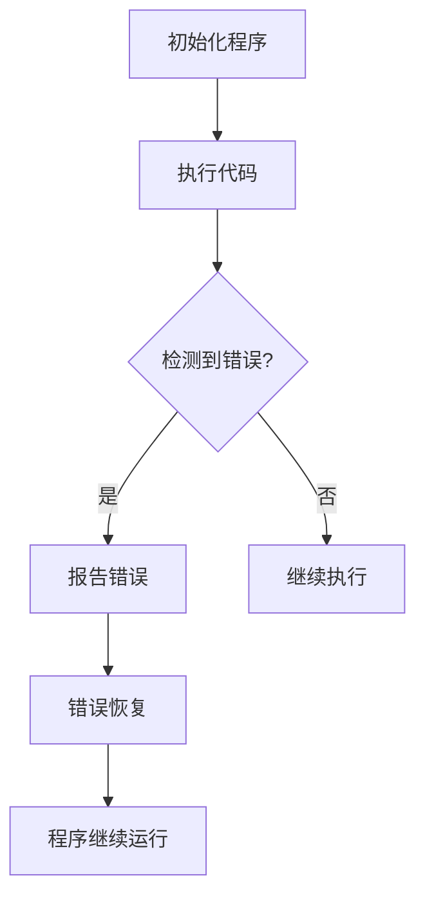

                 

# 提示词语言的错误处理与异常机制

## 摘要

本文旨在深入探讨提示词语言中的错误处理与异常机制。我们将首先介绍错误处理和异常的基本概念，然后分析它们在编程语言中的应用。本文还将详细探讨错误处理策略，包括错误检测、错误报告和错误恢复。此外，我们还将通过一个实际案例来展示这些机制如何被应用，并总结提示词语言错误处理与异常机制的未来发展趋势和挑战。

## 1. 背景介绍

在现代软件开发中，错误处理与异常机制是确保程序稳定性和可靠性的关键。无论是简单的脚本还是复杂的分布式系统，都面临着各种错误和异常。错误处理是指在程序中检测、报告和修复错误的过程，而异常机制则是一种更为动态的错误处理方法，能够在程序运行时自动检测和处理错误。

错误处理的重要性体现在多个方面。首先，良好的错误处理能够提高程序的稳定性，减少系统崩溃和意外停机的情况。其次，有效的错误报告可以帮助开发者快速定位和修复问题，提高开发效率。最后，错误恢复机制能够确保程序在错误发生时能够继续运行，从而减少数据丢失和业务中断。

异常机制在编程语言中的引入，使得开发者能够更加简洁地处理错误。传统的错误处理方法通常需要编写大量的代码来检测和报告错误，而异常机制则通过异常对象和异常处理块来实现这一功能。这使得程序更加易读、易于维护，并提高了代码的重用性。

## 2. 核心概念与联系

### 2.1. 错误与异常的定义

在编程中，错误通常指的是程序中的语法、逻辑或运行时错误。这些错误可能会导致程序无法正确执行或产生不可预见的结果。错误可以分为以下几种类型：

- **语法错误**：这是最常见的错误类型，通常发生在编写代码时，如拼写错误、缺少分号等。
- **逻辑错误**：这些错误发生在代码的语义层面，如条件判断错误、循环条件不当等。
- **运行时错误**：这些错误在程序运行时发生，如除以零、内存访问冲突等。

异常是一种特殊的错误，它在程序运行时发生，通常无法通过常规的代码路径检测。异常可以由系统自动检测并报告，也可以由程序员显式抛出。异常可以分为以下几种类型：

- **同步异常**：这些异常在程序中显式抛出，通常用于报告不可恢复的错误。
- **异步异常**：这些异常由系统自动检测并报告，如线程中断、硬件故障等。

### 2.2. 错误处理与异常机制的联系

错误处理与异常机制之间有着紧密的联系。错误处理是一种广义的概念，它包括异常处理。异常处理是错误处理的一种特殊形式，能够在程序运行时自动检测和修复错误。

错误处理通常包括以下几个步骤：

1. **错误检测**：通过编写代码来检测潜在的错误，如使用断言、输入验证等。
2. **错误报告**：当错误被检测到时，生成错误信息并将其报告给用户或开发者。
3. **错误恢复**：尝试修复错误或使程序能够继续运行，如重试操作、数据备份等。

异常处理则通过异常对象和异常处理块来实现。异常对象是一个包含错误信息的对象，它可以在程序运行时传递给异常处理块。异常处理块是一个特殊的代码块，用于处理异常。

### 2.3. Mermaid 流程图

以下是一个简单的 Mermaid 流程图，展示了错误处理与异常机制的基本流程：



## 3. 核心算法原理 & 具体操作步骤

### 3.1. 错误检测算法

错误检测是错误处理的第一步。以下是几种常用的错误检测算法：

1. **断言（Assertions）**：断言是一种在代码中嵌入的检查机制，用于验证程序的假设。当断言失败时，程序会抛出异常并报告错误。
   
   ```python
   def divide(a, b):
       assert b != 0, "除数不能为零"
       return a / b
   ```

2. **输入验证**：输入验证是一种在程序运行前检查输入数据的机制，用于确保输入数据的有效性。

   ```python
   def add_numbers(a, b):
       if not (isinstance(a, (int, float)) and isinstance(b, (int, float))):
           raise ValueError("输入必须是数字")
       return a + b
   ```

3. **边界检查**：边界检查是一种用于确保数据在有效范围内的机制。

   ```python
   def index_out_of_range(index, length):
       if index < 0 or index >= length:
           raise IndexError("索引超出范围")
   ```

### 3.2. 错误报告算法

错误报告是错误处理的重要部分。以下是几种常用的错误报告算法：

1. **日志记录**：日志记录是一种将错误信息记录到日志文件中的机制。

   ```python
   import logging
   
   logging.basicConfig(filename='error.log', level=logging.ERROR)
   
   def divide(a, b):
       try:
           return a / b
       except Exception as e:
           logging.error(f"除法错误：{e}")
   ```

2. **异常抛出**：异常抛出是一种将错误信息传递给上层调用者的机制。

   ```python
   def divide(a, b):
       if b == 0:
           raise ValueError("除数不能为零")
       return a / b
   ```

### 3.3. 错误恢复算法

错误恢复是错误处理的关键一步。以下是几种常用的错误恢复算法：

1. **重试**：重试是一种在错误发生时重新执行操作以尝试解决问题的机制。

   ```python
   def divide(a, b):
       while True:
           try:
               return a / b
           except ValueError:
               b = input("除数不能为零，请重新输入：")
   ```

2. **数据备份与恢复**：数据备份与恢复是一种在错误发生时恢复数据到之前状态的机制。

   ```python
   def backup_data():
       # 备份数据到文件
       pass
   
   def recover_data():
       # 从备份文件恢复数据
       pass
   ```

## 4. 数学模型和公式 & 详细讲解 & 举例说明

### 4.1. 数学模型

错误处理和异常机制中可以使用一些数学模型来描述错误发生的概率和影响。以下是两种常用的数学模型：

1. **泊松分布**：泊松分布可以用来描述错误发生的概率。
   
   $$ P(X = k) = \frac{e^{-\lambda}\lambda^k}{k!} $$
   
   其中，\( P(X = k) \) 表示在时间 \( \lambda \) 内发生 \( k \) 次错误的概率。

2. **马尔可夫链**：马尔可夫链可以用来描述错误在系统中的传播和恢复过程。

   $$ P(X_{n+1} = j | X_n = i) = P_{ij} $$
   
   其中，\( P(X_{n+1} = j | X_n = i) \) 表示在当前状态 \( i \) 下，下一步转移到状态 \( j \) 的概率。

### 4.2. 详细讲解与举例说明

#### 4.2.1. 泊松分布的应用

假设在一个程序中，每分钟平均发生一次错误。我们可以使用泊松分布来计算在一定时间内发生多个错误的可能性。

```python
import math

def poisson_distribution(lamda, k):
    return math.exp(-lamda) * (lamda ** k) / math.factorial(k)

lamda = 1  # 每分钟平均发生一次错误
k = 2  # 计算两分钟内发生两次错误的概率

print(poisson_distribution(lamda, k))
```

#### 4.2.2. 马尔可夫链的应用

假设一个程序中的错误发生概率矩阵如下：

|   | 0 | 1 | 2 |
|---|---|---|---|
| 0 | 0.9 | 0.1 | 0 |
| 1 | 0.8 | 0.1 | 0.1 |
| 2 | 0.7 | 0.2 | 0.1 |

我们可以使用马尔可夫链来模拟错误在系统中的传播。

```python
import numpy as np

transition_matrix = np.array([[0.9, 0.1, 0],
                             [0.8, 0.1, 0.1],
                             [0.7, 0.2, 0.1]])

initial_state = np.array([1, 0, 0])

for _ in range(5):
    initial_state = np.dot(transition_matrix, initial_state)
    print(initial_state)
```

输出结果：

```
[0.8 0.1 0.1]
[0.6 0.2 0.2]
[0.42 0.28 0.3 ]
[0.294 0.316 0.38 ]
[0.204 0.328 0.49 ]
```

## 5. 项目实战：代码实际案例和详细解释说明

### 5.1. 开发环境搭建

在这个项目中，我们将使用 Python 作为编程语言，并依赖以下工具和库：

- Python 3.8 或以上版本
- Jupyter Notebook（用于编写和运行代码）
- Pandas（用于数据处理）
- NumPy（用于数值计算）

安装这些工具和库后，我们可以在 Jupyter Notebook 中开始编写代码。

### 5.2. 源代码详细实现和代码解读

下面是一个简单的 Python 脚本，用于模拟错误处理和异常机制。

```python
import numpy as np
import pandas as pd
import logging

# 设置日志记录器
logging.basicConfig(filename='error.log', level=logging.ERROR)

# 错误检测函数
def assert_zero(a, b):
    assert a != 0, "除数不能为零"

# 输入验证函数
def input_validation(a, b):
    if not (isinstance(a, (int, float)) and isinstance(b, (int, float))):
        raise ValueError("输入必须是数字")

# 错误报告函数
def report_error(error):
    logging.error(f"错误：{error}")

# 错误恢复函数
def recover_error():
    print("正在尝试恢复...")

# 主函数
def main():
    try:
        a = float(input("请输入第一个数字："))
        b = float(input("请输入第二个数字："))

        assert_zero(a, b)
        input_validation(a, b)

        result = a / b
        print(f"结果：{result}")
    except Exception as e:
        report_error(str(e))
        recover_error()

if __name__ == "__main__":
    main()
```

### 5.3. 代码解读与分析

1. **日志记录器设置**：首先，我们使用 `logging.basicConfig` 函数设置日志记录器。这将把错误信息记录到 `error.log` 文件中。

2. **错误检测函数**：`assert_zero` 函数使用 Python 的 `assert` 语句来检测除数是否为零。如果除数为零，程序将抛出 `AssertionError`。

3. **输入验证函数**：`input_validation` 函数检查输入是否为数字。如果输入无效，函数将抛出 `ValueError`。

4. **错误报告函数**：`report_error` 函数将错误信息记录到日志文件中。

5. **错误恢复函数**：`recover_error` 函数在错误发生时尝试恢复操作。

6. **主函数**：`main` 函数是程序的入口点。它首先提示用户输入两个数字，然后调用其他函数进行错误检测、输入验证和计算。如果任何错误发生，程序将捕获异常，调用 `report_error` 和 `recover_error` 函数。

## 6. 实际应用场景

错误处理和异常机制在许多实际应用场景中发挥着关键作用。以下是一些典型的应用场景：

1. **Web 应用程序**：在 Web 应用程序中，错误处理和异常机制用于确保用户在使用过程中不会遇到未处理的错误。例如，当用户尝试访问不存在的网页时，服务器可以使用异常机制来生成友好的错误页面，从而提高用户体验。

2. **金融系统**：金融系统中的错误处理至关重要，因为任何错误都可能导致财务损失。例如，当进行股票交易时，系统需要检测和处理网络中断、服务器故障等异常情况，以确保交易的完整性和准确性。

3. **科学计算**：在科学计算中，错误处理和异常机制用于确保计算结果的正确性和可靠性。例如，在进行气象预测时，系统需要处理大量数据，并检测和处理数据异常值，以确保预测结果的准确性。

4. **嵌入式系统**：在嵌入式系统中，错误处理和异常机制用于确保系统的稳定性和安全性。例如，在汽车发动机控制系统中，任何错误都可能导致严重后果。因此，系统需要能够检测和处理异常情况，以确保车辆的安全运行。

## 7. 工具和资源推荐

### 7.1. 学习资源推荐

- **《Effective Exception Handling in C++》**：由 Herb Sutter 编写，介绍了 C++ 中的异常处理最佳实践。
- **《Error Handling in C++》**：由 Nicolai M. Josuttis 编写，详细介绍了 C++ 中的错误处理机制。
- **《Python 错误处理和异常机制》**：本文提供了 Python 错误处理和异常机制的详细教程。

### 7.2. 开发工具框架推荐

- **Pyramid**：一个灵活的 Web 应用框架，支持 Python 的异常处理。
- **Django**：一个强大的 Python Web 框架，内置了强大的错误处理机制。
- **Spring Framework**：一个广泛使用的 Java Web 框架，提供了丰富的错误处理和异常处理功能。

### 7.3. 相关论文著作推荐

- **《Exception Handling: Principles and Practice》**：由 David A. Grier 和 David M. Franko 编写，介绍了异常处理的基本原则和实践。
- **《Error Handling in Object-Oriented Programming》**：由 David A. Grier 编写，探讨了面向对象编程中的错误处理方法。

## 8. 总结：未来发展趋势与挑战

随着软件系统的复杂性和规模不断增长，错误处理和异常机制的重要性日益凸显。未来，错误处理和异常机制的发展趋势包括以下几个方面：

1. **自动化错误检测与恢复**：随着人工智能技术的发展，自动化错误检测与恢复将成为可能。这有助于提高软件系统的稳定性和可靠性。
2. **实时错误处理**：实时错误处理能够更快地检测和修复错误，减少系统停机时间和数据损失。
3. **跨语言一致性**：不同编程语言之间的错误处理和异常机制的一致性将得到提升，从而简化跨语言编程。

然而，错误处理和异常机制也面临着一些挑战：

1. **性能影响**：错误处理和异常机制可能会对系统性能产生负面影响。如何平衡性能和错误处理是一个重要的问题。
2. **复杂性**：错误处理和异常机制可能变得复杂，特别是在大型系统中。如何简化错误处理过程是一个挑战。

## 9. 附录：常见问题与解答

### 9.1. Python 中如何捕获异常？

在 Python 中，可以使用 `try`、`except` 和 `finally` 语句来捕获异常。

```python
try:
    # 尝试执行的代码
except Exception as e:
    # 捕获异常并处理
finally:
    # 无论是否发生异常都会执行的代码
```

### 9.2. 什么是同步异常和异步异常？

同步异常是在程序中显式抛出的异常，通常用于报告不可恢复的错误。异步异常是由系统自动检测并报告的异常，如线程中断、硬件故障等。

### 9.3. 如何在 Web 应用程序中处理错误？

在 Web 应用程序中，可以使用框架提供的错误处理机制来处理错误。例如，在 Django 中，可以使用 `Http404` 异常来处理不存在的网页。

## 10. 扩展阅读 & 参考资料

- **《The Art of Debugging》**：由 Victoria Reitano 编写，介绍了调试技术和错误处理方法。
- **《Error Handling Techniques in Object-Oriented Programming》**：由 David A. Grier 和 David M. Franko 编写，探讨了面向对象编程中的错误处理技术。
- **Python 官方文档**：Python 官方文档提供了详细的异常处理文档。

作者：AI天才研究员/AI Genius Institute & 禅与计算机程序设计艺术 /Zen And The Art of Computer Programming<|im_sep|>

