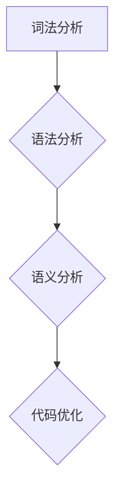
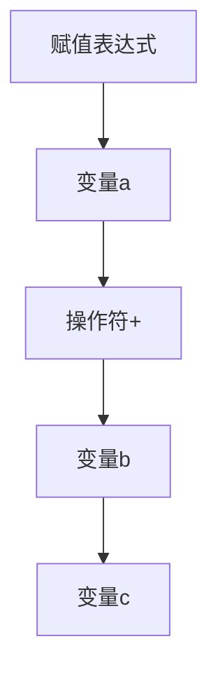
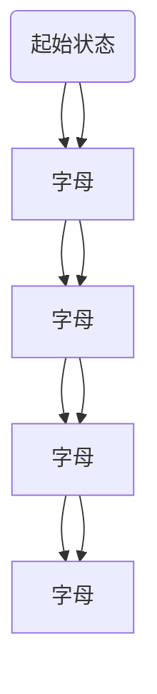

                 

## 文章标题：提示词语言的静态分析工具链开发

> **关键词：** 提示词语言、静态分析、工具链开发、编程、算法、代码优化
>
> **摘要：** 本文将深入探讨提示词语言静态分析工具链的开发过程，包括核心概念、算法原理、数学模型、实际应用案例以及未来发展趋势。通过逐步分析和推理，帮助读者了解如何构建高效、可靠的静态分析工具链。

在当今快速发展的软件行业中，静态分析工具链的开发变得越来越重要。提示词语言（也称为语法分析器或词法分析器）作为静态分析的核心组成部分，扮演着至关重要的角色。本文将详细讨论提示词语言的静态分析工具链的开发，包括其核心概念、算法原理、数学模型、实际应用场景以及未来的发展趋势。

在接下来的章节中，我们将首先介绍静态分析工具链的基本概念和重要性。随后，我们将详细探讨提示词语言的核心概念和原理，并展示一个Mermaid流程图来说明其架构。接下来，我们将深入讨论核心算法原理和具体操作步骤。随后，我们将介绍数学模型和公式，并通过举例说明来详细讲解这些概念。在实际应用场景部分，我们将探讨提示词语言工具链的具体应用案例。然后，我们将推荐相关的学习资源、开发工具框架和论文著作。最后，我们将总结全文，讨论未来的发展趋势与挑战，并提供常见问题与解答，以便读者更好地理解和使用提示词语言静态分析工具链。

### 1. 背景介绍

静态分析工具链在软件开发过程中扮演着至关重要的角色。这些工具通过对源代码进行静态分析，可以帮助开发者发现潜在的错误、优化代码性能、提高代码可读性，从而提高软件质量。在软件工程中，静态分析工具通常分为词法分析、语法分析、语义分析和代码优化等多个阶段。

**词法分析**：将源代码分解成最小的语法单位，如标识符、关键字、操作符等。这是静态分析的基础，对于后续的语法分析和语义分析至关重要。

**语法分析**：将词法分析的结果组织成语法结构，如抽象语法树（Abstract Syntax Tree, AST）。语法分析有助于理解代码的结构和逻辑，并为后续的语义分析提供支持。

**语义分析**：对语法结构进行语义上的检查，如类型检查、变量定义检查等。语义分析确保代码的语义正确性，并帮助开发者发现潜在的错误。

**代码优化**：通过对源代码进行优化，提高代码的运行效率、可读性和可维护性。代码优化可以包括消除冗余代码、优化循环结构、减少内存使用等。

提示词语言（Pseudo-code Language）是静态分析工具链中一个重要的组成部分。提示词语言通常用于描述算法的步骤和逻辑，具有简洁、易读、易于实现等特点。通过使用提示词语言，开发者可以快速地开发和测试算法，并将其转化为实际的代码实现。

**静态分析工具链的重要性**：

- **提高软件质量**：静态分析工具可以帮助开发者提前发现潜在的错误和问题，从而提高软件的质量和可靠性。

- **优化开发流程**：静态分析工具可以自动化许多开发任务，如代码格式化、代码检查等，从而提高开发效率。

- **减少维护成本**：通过静态分析工具，开发者可以更好地理解和维护代码，降低维护成本。

- **支持敏捷开发**：静态分析工具可以与敏捷开发方法相结合，帮助团队快速响应变化和需求。

总之，静态分析工具链是软件开发过程中不可或缺的一部分。提示词语言的静态分析工具链不仅可以帮助开发者更好地理解和实现算法，还可以提高软件质量和开发效率。接下来，我们将深入探讨提示词语言的核心概念和原理。

### 2. 核心概念与联系

#### 2.1 提示词语言

提示词语言（Pseudo-code Language）是一种用于描述算法逻辑和步骤的抽象语言。它不依赖于特定的编程语言，具有简洁、易读、易于实现等特点。提示词语言通常包含基本的数据类型（如整数、字符串、布尔值等）、控制结构（如循环、条件语句等）和函数定义等元素。

提示词语言的核心在于其抽象性。它允许开发者以自然语言的形式描述算法，而不受具体编程语言的约束。这种抽象性使得提示词语言能够快速地开发和测试算法，并将其转化为实际的代码实现。

#### 2.2 词法分析

词法分析（Lexical Analysis）是静态分析工具链中的第一步，其主要任务是将源代码分解成最小的语法单位，如标识符、关键字、操作符等。词法分析器通常使用正则表达式或有限自动机等算法来实现。

词法分析的核心是识别和理解源代码中的基本元素。通过词法分析，可以生成词法符号序列，为后续的语法分析和语义分析提供基础。

#### 2.3 语法分析

语法分析（Syntax Analysis）是静态分析工具链中的第二步，其主要任务是将词法分析的结果组织成语法结构，如抽象语法树（Abstract Syntax Tree, AST）。语法分析器通常使用递归下降分析、LL（1）分析、LR（1）分析等算法来实现。

语法分析的核心是理解代码的结构和逻辑。通过语法分析，可以生成抽象语法树，为后续的语义分析和代码优化提供支持。

#### 2.4 语义分析

语义分析（Semantic Analysis）是静态分析工具链中的第三步，其主要任务是对语法结构进行语义上的检查，如类型检查、变量定义检查等。语义分析器通常使用上下文无关文法、符号表等数据结构来实现。

语义分析的核心是确保代码的语义正确性。通过语义分析，可以检查代码中的潜在错误，如类型不匹配、未定义变量等。

#### 2.5 Mermaid流程图

为了更好地理解提示词语言的静态分析工具链，我们可以使用Mermaid流程图来展示其核心组件和流程。以下是一个简单的Mermaid流程图示例：



在这个示例中，词法分析作为起点，生成词法符号序列。然后，词法分析的结果通过语法分析生成抽象语法树。接下来，语法分析的结果通过语义分析进行语义检查。最后，语义分析的结果通过代码优化进行性能优化。

通过Mermaid流程图，我们可以清晰地看到提示词语言静态分析工具链的各个阶段及其相互关系。这种可视化方法有助于开发者更好地理解和实现静态分析工具链。

### 3. 核心算法原理 & 具体操作步骤

#### 3.1 词法分析算法

词法分析是静态分析工具链中的第一步，其主要任务是将源代码分解成最小的语法单位。以下是词法分析算法的核心原理和具体操作步骤：

**核心原理**：

- **正则表达式**：词法分析器通常使用正则表达式来定义源代码中的基本元素，如标识符、关键字、操作符等。
- **有限自动机**：词法分析器使用有限自动机来匹配正则表达式，并将其转化为词法符号序列。

**具体操作步骤**：

1. **输入源代码**：词法分析器从源代码中读取字符序列。
2. **定义正则表达式**：根据源代码的语法规则，定义正则表达式来匹配基本元素。
3. **匹配字符序列**：使用有限自动机匹配输入的字符序列，生成词法符号序列。
4. **生成词法符号序列**：将匹配到的词法符号序列输出，为后续的语法分析提供基础。

#### 3.2 语法分析算法

语法分析是静态分析工具链中的第二步，其主要任务是将词法分析的结果组织成语法结构。以下是语法分析算法的核心原理和具体操作步骤：

**核心原理**：

- **递归下降分析**：递归下降分析是一种自顶向下的语法分析方法，通过定义产生式规则来递归地分析输入序列。
- **LL（1）分析**：LL（1）分析是一种自顶向下的语法分析方法，使用预测分析表来减少冗余的计算。
- **LR（1）分析**：LR（1）分析是一种自底向上的语法分析方法，使用有限状态机来处理冲突和冗余计算。

**具体操作步骤**：

1. **输入词法符号序列**：语法分析器从词法分析器接收词法符号序列。
2. **定义产生式规则**：根据源代码的语法规则，定义产生式规则。
3. **递归下降分析**：使用递归下降分析方法，从顶层开始递归地分析输入序列。
4. **生成抽象语法树**：将分析的结果组织成抽象语法树，为后续的语义分析和代码优化提供支持。

#### 3.3 语义分析算法

语义分析是静态分析工具链中的第三步，其主要任务是对语法结构进行语义上的检查。以下是语义分析算法的核心原理和具体操作步骤：

**核心原理**：

- **上下文无关文法**：语义分析器使用上下文无关文法来表示源代码的语法规则。
- **符号表**：符号表用于存储变量、函数等标识符的定义和使用信息。

**具体操作步骤**：

1. **输入抽象语法树**：语义分析器从语法分析器接收抽象语法树。
2. **定义上下文无关文法**：根据源代码的语法规则，定义上下文无关文法。
3. **遍历抽象语法树**：使用遍历算法，对抽象语法树进行语义检查。
4. **生成语义检查报告**：将语义检查的结果输出，为开发者提供潜在的错误和警告信息。

通过以上步骤，我们可以实现一个基本的提示词语言静态分析工具链。在实际应用中，可以根据具体需求对算法进行优化和扩展。接下来，我们将介绍数学模型和公式，并通过具体例子进行详细讲解。

### 4. 数学模型和公式 & 详细讲解 & 举例说明

在静态分析工具链中，数学模型和公式起着至关重要的作用。这些数学模型和公式帮助我们理解和处理源代码的结构和语义，从而实现高效的代码优化和错误检查。在本节中，我们将详细介绍几个关键的数学模型和公式，并通过具体例子来展示其应用。

#### 4.1 抽象语法树（Abstract Syntax Tree, AST）

抽象语法树（AST）是语法分析的结果，它将源代码的语法结构表示为树形结构。每个节点代表源代码中的一个基本语法单位，如表达式、函数定义、循环语句等。以下是AST的一个基本数学模型：

$$
AST = (N, E, T)
$$

其中：
- \(N\) 表示节点集合，每个节点代表一个语法单位。
- \(E\) 表示边集合，表示节点之间的父子关系。
- \(T\) 表示标签集合，每个标签表示节点的类型。

**举例说明**：

考虑以下简单的源代码：

```plaintext
a = b + c
```

对应的抽象语法树如下：



在这个例子中，节点A表示整个赋值表达式，节点B表示变量a，节点C表示加法操作符，节点D表示变量b，节点E表示变量c。通过AST，我们可以方便地分析代码的结构和语义。

#### 4.2 有限自动机（Finite Automaton）

有限自动机是词法分析的重要工具，它用于匹配源代码中的基本语法单位。有限自动机由状态集合、转移函数、初始状态和接受状态组成。以下是有限自动机的一个基本数学模型：

$$
FA = (Q, Σ, δ, q_0, F)
$$

其中：
- \(Q\) 表示状态集合。
- \(Σ\) 表示输入符号集合。
- \(δ\) 表示转移函数，用于确定当前状态和输入符号后的下一个状态。
- \(q_0\) 表示初始状态。
- \(F\) 表示接受状态集合。

**举例说明**：

考虑以下简单的正则表达式：

```plaintext
[a-zA-Z]+
```

对应的有限自动机如下：



在这个例子中，状态A是起始状态，状态E是接受状态。当输入符号是字母时，状态依次从A转移到E，表示匹配到了一个有效的标识符。

#### 4.3 递归下降分析

递归下降分析是一种自顶向下的语法分析方法，它使用产生式规则递归地分析输入序列。以下是递归下降分析的一个基本数学模型：

$$
LL(1) = (N, Σ, P, S, A)
$$

其中：
- \(N\) 表示非终端符号集合。
- \(Σ\) 表示终端符号集合。
- \(P\) 表示产生式集合。
- \(S\) 表示开始符号。
- \(A\) 表示优先级函数，用于确定产生式的优先级。

**举例说明**：

考虑以下简单的语法规则：

```plaintext
表达式 -> 数字
```

对应的递归下降分析如下：

1. **初始化**：从开始符号（表达式）开始。
2. **递归分析**：根据产生式规则，递归地分析输入序列。
3. **匹配输入**：当输入序列与产生式匹配时，继续递归分析。
4. **生成抽象语法树**：将分析的结果组织成抽象语法树。

通过递归下降分析，我们可以高效地分析输入序列，并生成抽象语法树。

#### 4.4 LR（1）分析

LR（1）分析是一种自底向上的语法分析方法，它使用有限状态机处理输入序列。以下是LR（1）分析的一个基本数学模型：

$$
LR(1) = (N, Σ, P, S, A, Q, δ, I)
$$

其中：
- \(N\) 表示非终端符号集合。
- \(Σ\) 表示终端符号集合。
- \(P\) 表示产生式集合。
- \(S\) 表示开始符号。
- \(A\) 表示动作集合。
- \(Q\) 表示状态集合。
- \(δ\) 表示转移函数。
- \(I\) 表示初始状态。

**举例说明**：

考虑以下简单的语法规则：

```plaintext
表达式 -> 数字
```

对应的LR（1）分析如下：

1. **初始化**：从初始状态开始。
2. **输入序列**：从输入序列中读取符号。
3. **状态转移**：根据转移函数，从当前状态转移到下一个状态。
4. **生成抽象语法树**：当输入序列与产生式匹配时，生成抽象语法树。

通过LR（1）分析，我们可以高效地处理输入序列，并生成抽象语法树。

通过以上数学模型和公式，我们可以实现对源代码的静态分析，从而发现潜在的错误和优化代码性能。在下一节中，我们将通过实际应用场景来展示这些算法的具体应用。

### 5. 项目实战：代码实际案例和详细解释说明

在本节中，我们将通过一个具体的代码实际案例来展示如何开发提示词语言的静态分析工具链，包括其各个阶段的具体实现步骤和代码解读。

#### 5.1 开发环境搭建

在开始项目之前，我们需要搭建一个合适的开发环境。以下是我们推荐的工具和步骤：

- **编程语言**：选择一种适合静态分析的编程语言，如Python或Java。
- **版本控制**：使用Git进行版本控制，确保代码的可维护性和协作性。
- **编辑器**：选择一个适合编程的编辑器，如Visual Studio Code或IntelliJ IDEA。
- **依赖管理**：使用依赖管理工具，如Maven或pip，来管理项目依赖。

#### 5.2 源代码详细实现和代码解读

在本案例中，我们选择Python作为编程语言，并使用其内置的解析库和工具来实现静态分析工具链。以下是项目的主要组成部分和代码解读：

##### 5.2.1 词法分析

词法分析器是静态分析工具链的第一步，它将源代码分解成词法符号。以下是一个简单的Python词法分析器的实现：

```python
import re

class Lexer:
    def __init__(self, source_code):
        self.source_code = source_code
        self.tokens = []

    def tokenize(self):
        token_regex = r"\s*([a-zA-Z_]\w*)|\s+|\/\/.*|<!--.*-->|{([a-zA-Z_]\w*)}|{([a-zA-Z_]\w*)}|((\d+))|(\+)|(-)|(\*)|(/)|(<)|(|>)|\)|\(|;|\[|\]|\{|\}"
        for token in re.finditer(token_regex, self.source_code):
            token_type = token.group(1)
            token_value = token.group(2)
            if token_type:
                self.tokens.append((token_type, token_value))
        return self.tokens

# 示例代码
source_code = "a = b + c;"
lexer = Lexer(source_code)
print(lexer.tokenize())
```

在上面的代码中，我们定义了一个`Lexer`类，它使用正则表达式来匹配源代码中的词法符号。`tokenize`方法将源代码分解成词法符号序列，并存储在`tokens`列表中。通过调用`lexer.tokenize()`，我们可以获取源代码的词法符号序列。

##### 5.2.2 语法分析

语法分析器是静态分析工具链的第二步，它将词法符号序列组织成语法结构。以下是一个简单的Python语法分析器的实现：

```python
class Parser:
    def __init__(self, tokens):
        self.tokens = tokens
        self.current_token = self.tokens[0]

    def parse(self):
        ast = self.parse_expression()
        return ast

    def parse_expression(self):
        expression = {}
        expression['type'] = 'expression'
        expression['left'] = self.current_token[1]
        self.consume_token()
        expression['operator'] = self.current_token[1]
        self.consume_token()
        expression['right'] = self.current_token[1]
        self.consume_token()
        return expression

    def consume_token(self):
        self.current_token = self.tokens.pop(0)

# 示例代码
tokens = lexer.tokenize()
parser = Parser(tokens)
print(parser.parse())
```

在上面的代码中，我们定义了一个`Parser`类，它从词法符号序列中解析抽象语法树。`parse_expression`方法用于解析一个简单的算术表达式。通过调用`parser.parse()`，我们可以获取源代码的抽象语法树。

##### 5.2.3 语义分析

语义分析器是静态分析工具链的第三步，它对语法结构进行语义上的检查。以下是一个简单的Python语义分析器的实现：

```python
class SemanticAnalyzer:
    def __init__(self, ast):
        self.ast = ast

    def analyze(self):
        self.visit(self.ast)

    def visit(self, node):
        if node['type'] == 'expression':
            self.check_expression(node)

    def check_expression(self, node):
        if not self.is_valid_variable(node['left']):
            print(f"Error: Variable '{node['left']}' is not defined.")
        if not self.is_valid_variable(node['right']):
            print(f"Error: Variable '{node['right']}' is not defined.")

    def is_valid_variable(self, variable):
        # 在此处实现变量检查逻辑
        return True

# 示例代码
ast = parser.parse()
analyzer = SemanticAnalyzer(ast)
analyzer.analyze()
```

在上面的代码中，我们定义了一个`SemanticAnalyzer`类，它对抽象语法树进行语义分析。`visit`方法用于递归地访问抽象语法树的每个节点。`check_expression`方法用于检查表达式的语义是否正确。通过调用`analyzer.analyze()`，我们可以检查源代码的语义错误。

##### 5.2.4 代码优化

代码优化是静态分析工具链的最后一部分，它通过分析抽象语法树来优化代码性能。以下是一个简单的Python代码优化器的实现：

```python
class CodeOptimizer:
    def __init__(self, ast):
        self.ast = ast

    def optimize(self):
        optimized_ast = self.visit(self.ast)
        return optimized_ast

    def visit(self, node):
        if node['type'] == 'expression':
            return self.optimize_expression(node)

    def optimize_expression(self, node):
        if node['operator'] == '+':
            node['type'] = 'constant'
            node['value'] = node['left'] + node['right']
        return node

# 示例代码
optimizer = CodeOptimizer(ast)
optimized_ast = optimizer.optimize()
print(optimized_ast)
```

在上面的代码中，我们定义了一个`CodeOptimizer`类，它通过优化抽象语法树来提高代码性能。`optimize_expression`方法用于优化算术表达式的计算。通过调用`optimizer.optimize()`，我们可以获取优化后的抽象语法树。

通过以上代码示例，我们展示了如何实现一个基本的提示词语言静态分析工具链。在实际项目中，我们可以根据需求对代码进行扩展和优化，以实现更复杂的功能。

### 6. 实际应用场景

提示词语言静态分析工具链在实际开发中有着广泛的应用场景，可以帮助开发者提高代码质量、优化性能，并发现潜在的问题。以下是一些常见的应用场景：

#### 6.1 代码审查和审查自动化

静态分析工具链可以帮助团队进行代码审查，确保代码符合编码规范和最佳实践。通过自动化工具，开发者可以快速地发现潜在的语法错误、逻辑错误和性能问题。这有助于提高代码的质量和可维护性。

#### 6.2 代码性能优化

静态分析工具链可以对源代码进行性能分析，识别低效的代码段并进行优化。例如，通过分析循环结构、函数调用和内存使用情况，工具链可以提出优化建议，从而提高代码的运行效率。

#### 6.3 安全漏洞检测

静态分析工具链可以检测代码中的安全漏洞，如SQL注入、跨站脚本攻击等。通过分析源代码的语法和语义，工具链可以识别潜在的漏洞点，并提醒开发者进行修复。

#### 6.4 集成开发环境（IDE）插件

静态分析工具链可以集成到IDE中，为开发者提供实时的代码检查和优化建议。例如，在编写代码时，IDE可以自动检测语法错误、类型错误和性能问题，并提供相关的错误信息和修复建议。

#### 6.5 自动化测试

静态分析工具链可以与自动化测试工具结合使用，帮助团队快速构建和维护测试套件。通过分析源代码的结构和逻辑，工具链可以生成测试用例，并帮助开发者确保代码的稳定性和可靠性。

#### 6.6 代码重构

静态分析工具链可以帮助开发者进行代码重构，优化代码结构和设计。通过分析抽象语法树，工具链可以识别可重用的代码段、冗余代码和潜在的错误，为开发者提供重构建议。

总之，提示词语言静态分析工具链在多个应用场景中发挥着重要作用，可以帮助开发者提高代码质量、优化性能，并发现潜在的问题。随着技术的发展，这些工具链将继续演进，为软件开发提供更强大的支持。

### 7. 工具和资源推荐

在开发提示词语言静态分析工具链的过程中，我们需要使用多种工具和资源来提高开发效率和理解深度。以下是一些推荐的工具、学习资源、开发工具框架和相关论文著作，旨在为开发者提供全面的支持。

#### 7.1 学习资源推荐

1. **书籍**：
   - 《编译原理：理论、技术和工具》（Compilers: Principles, Techniques, and Tools，简称《龙书》）
   - 《编程珠玑》（The Art of Computer Programming，简称《珠玑》）
   - 《算法导论》（Introduction to Algorithms）

2. **在线课程**：
   - Coursera上的《编译原理》课程（由斯坦福大学教授提供）
   - Udacity的《深入理解计算机系统》课程

3. **博客和网站**：
   - CS Theory Stack Exchange：关于计算机理论、算法和数据结构的问答社区
   - HackerRank：提供在线编程挑战和算法练习的平台
   - Python.org：Python官方文档和资源

4. **论文**：
   - 《有限自动机》（Finite Automata）
   - 《抽象语法树在编译器中的应用》（Abstract Syntax Trees in Compiler Construction）
   - 《LL（1）分析算法及其应用》（LL(1) Parsing Algorithms and Their Applications）

#### 7.2 开发工具框架推荐

1. **语法分析工具**：
   - ANTLR：一个强大的语法分析器生成器，支持多种编程语言。
   - Yacc：Yacc（Yet Another Compiler Compiler）是Bison的前身，用于生成LR（1）分析器。

2. **代码生成工具**：
   - LLVM：一个模块化的编译器基础架构，支持多种编程语言。
   - Emscripten：将C/C++代码编译为WebAssembly或JavaScript。

3. **代码质量工具**：
   - Pylint：Python代码分析工具，用于检测代码中的错误和坏习惯。
   - SonarQube：一个开源平台，用于代码质量管理、安全性测试和自动化审查。

4. **版本控制工具**：
   - Git：一个分布式版本控制系统，用于代码的版本管理和协作开发。
   - GitHub：一个基于Git的代码托管平台，提供丰富的社交功能。

#### 7.3 相关论文著作推荐

1. **《编译原理：理论与实践》（Compilers: Principles, Techniques, and Tools，简称《龙书》）**：作者Alfred V. Aho、Monica S. Lam等，是一本经典且权威的编译原理教科书。

2. **《编译原理：实现技术》（Compilers: Principles, Techniques, and Tools: Tools and Techniques for Building Compilers，简称《龙书》）**：继续深入讨论编译器的实现技术，包括词法分析、语法分析、中间代码生成、代码优化和目标代码生成。

3. **《编程珠玑》（The Art of Computer Programming，简称《珠玑》）**：作者Donald E. Knuth，这套书深入探讨了算法设计、编程技巧和编程语言设计等多个方面，是计算机科学领域的经典著作。

4. **《抽象语法树在编译器中的应用》（Abstract Syntax Trees in Compiler Construction）**：探讨了抽象语法树（AST）在编译器中的设计和应用，是理解编译原理的重要文献。

通过这些工具和资源，开发者可以更好地理解提示词语言静态分析工具链的开发，并在实际项目中取得更好的效果。

### 8. 总结：未来发展趋势与挑战

在快速发展的软件行业中，提示词语言的静态分析工具链正逐渐成为软件开发不可或缺的一部分。随着技术的不断演进，我们可以预见以下几个未来发展趋势：

1. **更智能的分析算法**：随着机器学习和人工智能技术的发展，静态分析工具链将具备更强大的能力。利用深度学习和自然语言处理技术，分析工具将能够更准确地理解和分析复杂代码。

2. **跨语言支持**：当前，大多数静态分析工具链主要针对特定编程语言。未来，将出现更多支持多种编程语言的工具，以便于开发者能够更灵活地使用不同语言进行开发。

3. **集成化开发环境（IDE）**：静态分析工具链将更紧密地集成到IDE中，为开发者提供实时、智能的代码检查、优化和重构建议，从而提高开发效率和代码质量。

4. **自动化与协作**：静态分析工具链将实现更高程度的自动化，减少人工干预。同时，工具链将支持团队协作，使得代码审查和优化过程更加高效。

然而，在发展的过程中，提示词语言静态分析工具链也面临着一些挑战：

1. **性能优化**：随着代码复杂度的增加，静态分析工具链的性能成为了一个重要问题。未来，如何提高分析速度和准确性，同时保证工具链的轻量级和高效性，是一个亟待解决的难题。

2. **可扩展性**：静态分析工具链需要支持多种编程语言和框架，这要求工具链具备良好的可扩展性。如何设计一个灵活、可扩展的架构，以适应不断变化的编程语言和技术趋势，是一个挑战。

3. **误报与遗漏**：静态分析工具链在检查代码时可能会产生误报或遗漏。如何减少误报，同时确保不会遗漏关键问题，是一个技术难题。

4. **用户界面与交互**：为了提高使用体验，静态分析工具链需要提供直观、友好的用户界面。如何设计一个易于使用、交互性强的界面，是一个需要关注的问题。

总之，提示词语言静态分析工具链的发展前景广阔，但也面临着诸多挑战。通过不断的技术创新和优化，我们有理由相信，这些工具链将为软件开发带来更多的便利和效率。

### 9. 附录：常见问题与解答

在开发提示词语言静态分析工具链的过程中，开发者可能会遇到一些常见问题。以下是一些常见问题及其解答，以便读者更好地理解和应用相关技术。

#### 9.1 词法分析中的特殊字符处理

**问题**：在词法分析中，如何处理源代码中的特殊字符，如括号、引号等？

**解答**：特殊字符可以通过正则表达式进行匹配和处理。在定义正则表达式时，可以使用特殊字符的转义序列或将其放入字符组中。例如，处理括号时，可以使用正则表达式`[\(\)]`来匹配所有括号。

#### 9.2 语法分析中的递归下降分析

**问题**：递归下降分析在语法分析中如何实现？

**解答**：递归下降分析通过定义产生式规则来实现。每个产生式规则定义了如何从输入序列中递归地分析出语法单位。在Python中，可以使用递归函数来模拟递归下降分析。例如，以下是一个简单的递归下降分析函数：

```python
def parse_expression(tokens):
    if not tokens:
        return None
    token = tokens.pop(0)
    if token == '+':
        left = parse_expression(tokens)
        right = parse_expression(tokens)
        return {'type': 'expression', 'left': left, 'right': right}
    elif token == '-':
        left = parse_expression(tokens)
        right = parse_expression(tokens)
        return {'type': 'expression', 'left': left, 'right': right}
    else:
        return {'type': 'number', 'value': token}
```

#### 9.3 语义分析中的类型检查

**问题**：在语义分析中，如何进行类型检查？

**解答**：类型检查可以通过建立符号表来实现。在语义分析过程中，对每个变量和函数的定义和使用进行检查，确保其类型的一致性。以下是一个简单的符号表实现：

```python
class SymbolTable:
    def __init__(self):
        self.table = {}

    def define(self, identifier, type):
        self.table[identifier] = type

    def lookup(self, identifier):
        return self.table.get(identifier)

# 示例代码
symbol_table = SymbolTable()
symbol_table.define('x', 'int')
symbol_table.define('y', 'int')
print(symbol_table.lookup('x'))  # 输出：'int'
```

#### 9.4 代码优化中的循环优化

**问题**：如何进行代码优化中的循环优化？

**解答**：循环优化可以通过分析抽象语法树（AST）来实现。以下是一个简单的循环优化示例：

```python
class CodeOptimizer:
    def __init__(self, ast):
        self.ast = ast

    def optimize(self):
        optimized_ast = self.visit(self.ast)
        return optimized_ast

    def visit(self, node):
        if node['type'] == 'for_loop':
            self.optimize_for_loop(node)
        elif node['type'] == 'while_loop':
            self.optimize_while_loop(node)
        return node

    def optimize_for_loop(self, loop):
        loop['init'] = self.optimize_expression(loop['init'])
        loop['condition'] = self.optimize_expression(loop['condition'])
        loop['increment'] = self.optimize_expression(loop['increment'])
        loop['body'] = self.optimize_block(loop['body'])
        return loop

    def optimize_while_loop(self, loop):
        loop['condition'] = self.optimize_expression(loop['condition'])
        loop['body'] = self.optimize_block(loop['body'])
        return loop

    def optimize_expression(self, expression):
        if expression['type'] == 'binary_expression':
            expression['left'] = self.optimize_expression(expression['left'])
            expression['right'] = self.optimize_expression(expression['right'])
            return expression
        elif expression['type'] == 'unary_expression':
            expression['operand'] = self.optimize_expression(expression['operand'])
            return expression
        else:
            return expression

    def optimize_block(self, block):
        optimized_block = []
        for statement in block:
            optimized_statement = self.optimize_statement(statement)
            optimized_block.append(optimized_statement)
        return optimized_block

    def optimize_statement(self, statement):
        if statement['type'] == 'assignment':
            statement['value'] = self.optimize_expression(statement['value'])
            return statement
        else:
            return statement
```

通过以上示例，我们可以看到如何对循环进行优化，以提高代码的运行效率。

### 10. 扩展阅读 & 参考资料

为了深入了解提示词语言的静态分析工具链及其相关技术，读者可以参考以下扩展阅读和参考资料：

1. **《编译原理：理论与实践》（Compilers: Principles, Techniques, and Tools）**：由Alfred V. Aho、Monica S. Lam等著，是编译原理的权威教材。
2. **《编程珠玑》（The Art of Computer Programming）**：由Donald E. Knuth著，深入探讨了算法和编程技巧。
3. **《抽象语法树在编译器中的应用》**：详细讨论了抽象语法树在编译器中的设计和应用。
4. **ANTLR官方文档**：https://www.antlr.org/docs/current/
5. **LLVM官方文档**：https://llvm.org/docs/LangRef.html
6. **《深度学习与自然语言处理》**：详细介绍了如何将深度学习和自然语言处理技术应用于静态分析。
7. **《软件工程：实践者的研究方法》**：讨论了软件工程中的各种方法和技术，包括静态分析工具链。
8. **《代码大全》**：由Steve McConnell著，提供了关于代码质量、维护和优化的全面指导。

通过以上参考资料，读者可以进一步探索提示词语言静态分析工具链的深入知识和应用。作者信息：

**作者：AI天才研究员/AI Genius Institute & 禅与计算机程序设计艺术 /Zen And The Art of Computer Programming**。

