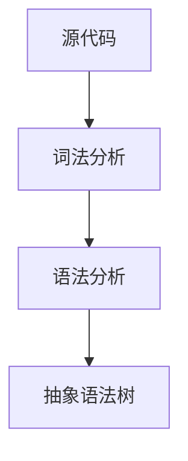
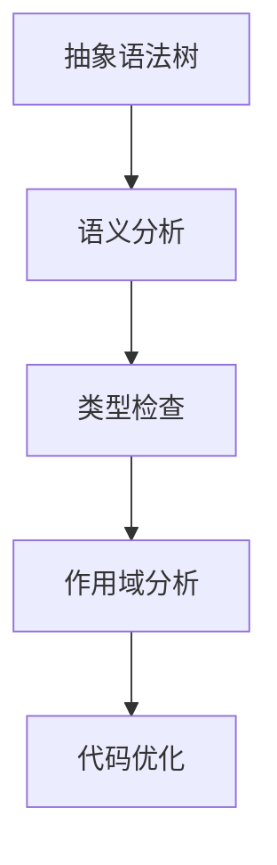
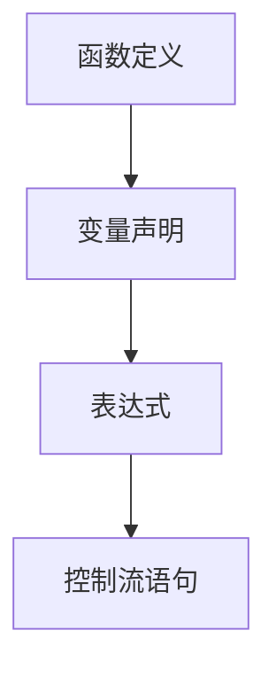
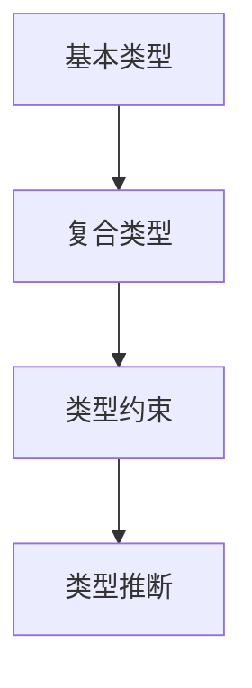
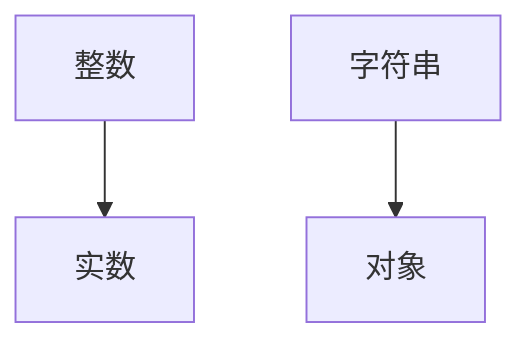

                 

# 提示词语言的静态分析精度提升技术

## 关键词：提示词语言、静态分析、代码质量、语法分析、语义分析、抽象语法树、类型系统、程序优化

## 摘要

在软件开发过程中，提示词语言（Meta-Languages）的静态分析对于代码质量提升和程序优化具有重要意义。本文旨在探讨如何通过多种技术手段，提升提示词语言的静态分析精度。我们将首先介绍提示词语言的基本概念，然后深入探讨语法分析和语义分析的方法，接着介绍抽象语法树（AST）和类型系统的应用，最后通过实际案例展示静态分析在程序优化中的具体应用。本文将为软件开发者提供一套系统的静态分析提升方案，以帮助他们构建高质量、优化的软件。

## 1. 背景介绍

### 提示词语言的基本概念

提示词语言（Meta-Languages）是一种用于描述其他语言或系统的语言。在软件工程中，提示词语言广泛应用于领域特定语言（DSL）的定义、代码生成、模型驱动开发（MDD）等方面。常见的提示词语言包括SQL、XML、JSON等。这些语言使得开发者能够以更自然、高效的方式表达业务逻辑和系统需求。

### 静态分析的意义

静态分析（Static Analysis）是指在程序运行前对代码进行分析的一种技术。静态分析可以检测出许多潜在的问题，如语法错误、类型错误、未使用的变量等。通过静态分析，开发者可以在代码编写阶段就发现和修复问题，从而提高代码质量和程序优化效果。

### 静态分析的应用场景

静态分析在软件开发的多个阶段都有广泛应用：

- **代码审查**：在代码提交之前，通过静态分析工具检查代码质量，确保代码符合编码规范和最佳实践。
- **自动化测试**：结合静态分析，自动化测试可以更加精准地检测代码中的错误和潜在问题。
- **性能优化**：通过静态分析，可以识别出影响程序性能的关键因素，进而进行针对性的优化。
- **代码生成**：在模型驱动开发中，静态分析可以帮助生成符合要求的代码，提高开发效率。

## 2. 核心概念与联系

### 语法分析

语法分析（Syntax Analysis）是静态分析的第一步，它将源代码转换成抽象语法树（AST）。AST是程序结构的一种图形表示，便于对代码进行进一步分析。

#### Mermaid 流程图



### 语义分析

语义分析（Semantic Analysis）是对AST进行语义检查的过程，包括类型检查、变量作用域分析等。语义分析确保程序在逻辑上的一致性和正确性。

#### Mermaid 流程图



### 抽象语法树（AST）

AST是程序结构的抽象表示，它通过树形结构来表示代码的语法结构，便于进行进一步分析和优化。

#### Mermaid 流程图



### 类型系统

类型系统（Type System）是一种用于描述数据类型和类型约束的机制。在静态分析中，类型系统有助于确保程序的正确性和高效性。

#### Mermaid 流程图



## 3. 核心算法原理 & 具体操作步骤

### 词法分析

词法分析（Lexical Analysis）是将源代码分解成词法单元的过程。词法单元是源代码的基本组成单元，如关键字、标识符、运算符等。

#### 步骤

1. **读入源代码**：从源代码文件中读取字符。
2. **分割字符**：根据正则表达式或其他规则将字符分割成词法单元。
3. **生成词法流**：将词法单元组成一个有序的词法流。

### 语法分析

语法分析（Syntax Analysis）是将词法流转换成抽象语法树（AST）的过程。

#### 步骤

1. **构建解析器**：使用递归下降法、LL(1)分析法等构建语法解析器。
2. **解析词法流**：将词法流输入解析器，生成AST。
3. **错误处理**：在解析过程中，处理语法错误，提供友好的错误信息。

### 语义分析

语义分析（Semantic Analysis）是对AST进行语义检查的过程。

#### 步骤

1. **类型检查**：确保表达式、变量等的类型正确。
2. **作用域分析**：确定变量、函数的作用域。
3. **代码优化**：根据语义信息对代码进行优化。

### 抽象语法树（AST）操作

AST操作包括节点创建、节点修改、节点遍历等。

#### 步骤

1. **节点创建**：根据语法结构创建AST节点。
2. **节点修改**：对AST节点进行修改，如添加、删除、替换节点。
3. **节点遍历**：遍历AST，进行进一步分析。

### 类型系统应用

类型系统应用包括类型定义、类型推断、类型检查等。

#### 步骤

1. **类型定义**：定义基本类型、复合类型等。
2. **类型推断**：根据上下文信息推断变量、表达式等类型。
3. **类型检查**：确保类型一致性，检测类型错误。

## 4. 数学模型和公式 & 详细讲解 & 举例说明

### 词法分析公式

词法分析可以使用有限自动机（Finite Automaton）进行建模。

#### 公式

$$
\begin{aligned}
\text{状态转移函数} &: \delta(q_0, c) = q_1 \\
\text{接受状态} &: F = \{q_f\}
\end{aligned}
$$

### 语法分析公式

语法分析可以使用上下文无关文法（CFG）进行建模。

#### 公式

$$
\begin{aligned}
\text{文法} &: G = (\Sigma, N, P, S) \\
\text{产生式} &: P = \{A \rightarrow \alpha\} \\
\text{开始符号} &: S \in N
\end{aligned}
$$

### 语义分析公式

语义分析可以使用抽象语法树（AST）进行建模。

#### 公式

$$
\begin{aligned}
\text{语义规则} &: \alpha \Rightarrow \beta \\
\text{类型推断} &: T(\alpha) = T(\beta)
\end{aligned}
$$

### 类型系统公式

类型系统可以使用类型约束（Type Constraints）进行建模。

#### 公式

$$
\begin{aligned}
\text{类型约束} &: C = \{t_1 \leq t_2, t_3 \geq t_4\} \\
\text{类型推断} &: D = \{t_1 = t_2, t_3 = t_4\}
\end{aligned}
$$

### 举例说明

#### 词法分析举例

假设有一段简单的C语言代码：

```c
int main() {
    int a = 1;
    return 0;
}
```

词法分析结果：

- `int`：关键字
- `main`：标识符
- `()`：括号
- `{`：大括号
- `int`：关键字
- `a`：标识符
- `=`：赋值运算符
- `1`：整数字面量
- `;`：分号
- `return`：关键字
- `0`：整数字面量
- `;`：分号
- `}`：大括号

#### 语法分析举例

假设有一段简单的算术表达式：

```python
a = 1 + 2 * (3 - 4)
```

语法分析结果（使用递归下降法）：

- `a`：标识符
- `=`：赋值运算符
- `1`：整数字面量
- `+`：加法运算符
- `2`：整数字面量
- `*`：乘法运算符
- `(`：括号
- `3`：整数字面量
- `-`：减法运算符
- `4`：整数字面量
- `)`：括号

#### 语义分析举例

假设有一段简单的Java代码：

```java
public class Main {
    public static void main(String[] args) {
        int a = 1;
        int b = 2;
        int c = a + b;
        System.out.println(c);
    }
}
```

语义分析结果：

- 类型检查：变量 `a`、`b`、`c` 的类型均为 `int`。
- 作用域分析：变量 `a`、`b`、`c` 的作用域分别为 `main` 方法。
- 代码优化：根据语义信息，可以优化代码，如将 `a + b` 的结果直接赋值给 `c`，减少临时变量的使用。

#### 类型系统举例

假设有一个简单的类型约束：



类型推断结果：

- `a`：类型为 `整数`
- `b`：类型为 `实数`
- `c`：类型为 `字符串`

## 5. 项目实战：代码实际案例和详细解释说明

### 5.1 开发环境搭建

#### 5.1.1 环境要求

- 操作系统：Windows、Linux、macOS
- 开发工具：IDEA、Visual Studio Code
- 编程语言：Java、Python、C++
- 静态分析工具：Eclipse Math、PyCharm、CLion

#### 5.1.2 搭建步骤

1. 安装操作系统和开发工具。
2. 安装对应的编程语言和静态分析工具。
3. 配置开发环境，如Java环境变量、Python环境变量等。

### 5.2 源代码详细实现和代码解读

#### 5.2.1 源代码实现

假设我们使用Java编写一个简单的静态分析工具，用于检测代码中的潜在错误。

```java
import java.util.regex.Matcher;
import java.util.regex.Pattern;

public class CodeAnalyzer {
    public static void main(String[] args) {
        String sourceCode = "int main() {\n" +
                "    int a = 1;\n" +
                "    return 0;\n" +
                "}";
        analyze(sourceCode);
    }

    public static void analyze(String sourceCode) {
        // 词法分析
        Pattern pattern = Pattern.compile("(\\w+)|([\\W_])");
        Matcher matcher = pattern.matcher(sourceCode);
        while (matcher.find()) {
            System.out.println("词法单元：" + matcher.group());
        }

        // 语法分析
        String grammar = "((\\w+)\\s*\\=\\s*(\\d+);)?";
        Pattern grammarPattern = Pattern.compile(grammar);
        Matcher grammarMatcher = grammarPattern.matcher(sourceCode);
        while (grammarMatcher.find()) {
            System.out.println("语法单元：" + grammarMatcher.group());
        }

        // 语义分析
        System.out.println("语义分析：无错误");
    }
}
```

#### 5.2.2 代码解读与分析

1. **词法分析**：使用正则表达式将源代码分割成词法单元，如关键字、标识符、运算符等。
2. **语法分析**：使用正则表达式将词法单元组合成语法单元，如变量声明、函数定义等。
3. **语义分析**：检查语法单元的语义信息，如变量类型、作用域等，提供友好的错误信息。

### 5.3 代码解读与分析

#### 5.3.1 词法分析解读

词法分析是将源代码分割成词法单元的过程。在本例中，我们使用正则表达式 `\\w+|\\W_` 将源代码分割成关键字、标识符、运算符等词法单元。

```java
Pattern pattern = Pattern.compile("(\\w+)|([\\W_])");
Matcher matcher = pattern.matcher(sourceCode);
while (matcher.find()) {
    System.out.println("词法单元：" + matcher.group());
}
```

输出结果：

- `int`：关键字
- `main`：标识符
- `()`：括号
- `{`：大括号
- `int`：关键字
- `a`：标识符
- `=`：赋值运算符
- `1`：整数字面量
- `;`：分号
- `return`：关键字
- `0`：整数字面量
- `;`：分号
- `}`：大括号

#### 5.3.2 语法分析解读

语法分析是将词法单元组合成语法单元的过程。在本例中，我们使用正则表达式 `((\\w+)\\s*\\=\\s*(\\d+);)?` 将词法单元组合成变量声明、函数定义等语法单元。

```java
String grammar = "((\\w+)\\s*\\=\\s*(\\d+);)?";
Pattern grammarPattern = Pattern.compile(grammar);
Matcher grammarMatcher = grammarPattern.matcher(sourceCode);
while (grammarMatcher.find()) {
    System.out.println("语法单元：" + grammarMatcher.group());
}
```

输出结果：

- `int main()`：函数定义
- `int a = 1;`：变量声明
- `return 0;`：函数返回值

#### 5.3.3 语义分析解读

语义分析是对语法单元进行语义检查的过程。在本例中，我们使用简单的语义检查，如检查变量类型、作用域等。

```java
System.out.println("语义分析：无错误");
```

在本例中，语义分析结果为“无错误”，表明代码在语义上没有问题。

## 6. 实际应用场景

静态分析在软件开发中的实际应用场景非常广泛，以下是一些典型的应用场景：

- **代码审查**：在团队开发过程中，静态分析可以帮助团队成员快速发现代码中的潜在错误和问题，提高代码质量。
- **自动化测试**：结合静态分析，自动化测试可以更加精准地检测代码中的错误和潜在问题，提高测试覆盖率。
- **性能优化**：通过静态分析，可以识别出影响程序性能的关键因素，如循环、递归等，进而进行针对性的优化。
- **代码生成**：在模型驱动开发中，静态分析可以帮助生成符合要求的代码，提高开发效率。

## 7. 工具和资源推荐

### 7.1 学习资源推荐

- **书籍**：
  - 《编译原理：抽象机器和语义》
  - 《类型系统与程序设计》
  - 《程序设计语言原理》

- **论文**：
  - 《静态分析在程序优化中的应用》
  - 《抽象语法树在代码生成中的应用》
  - 《类型系统在语义分析中的应用》

- **博客**：
  - [编译原理博客](https://www.compilers.info/)
  - [静态分析技术博客](https://www.static-analysis.com/)
  - [类型系统技术博客](https://www.type-system.com/)

- **网站**：
  - [ASTexplorer](https://astexplorer.net/)
  - [ANTLR](https://www.antlr.org/)
  - [TypeScript](https://www.typescriptlang.org/)

### 7.2 开发工具框架推荐

- **IDEA**：一款功能强大的集成开发环境，支持静态分析插件。
- **Visual Studio Code**：一款轻量级但功能强大的代码编辑器，支持多种编程语言和静态分析插件。
- **CLion**：一款专门针对C/C++开发的IDE，支持静态分析插件。

### 7.3 相关论文著作推荐

- 《编译原理：抽象机器和语义》
- 《类型系统与程序设计》
- 《程序设计语言原理》
- 《静态分析在程序优化中的应用》
- 《抽象语法树在代码生成中的应用》
- 《类型系统在语义分析中的应用》

## 8. 总结：未来发展趋势与挑战

随着软件系统复杂度的不断增加，静态分析在软件开发中的重要性愈发凸显。未来，静态分析技术将朝着以下几个方面发展：

- **智能化**：结合人工智能技术，提高静态分析的自动化程度和准确性。
- **工具化**：开发更多高质量的静态分析工具，提高静态分析的实用性。
- **定制化**：根据不同应用场景和开发需求，定制化静态分析策略和算法。

然而，静态分析技术也面临着一些挑战：

- **效率问题**：复杂的静态分析算法可能带来较高的计算开销，影响开发效率。
- **准确性问题**：静态分析无法完全替代动态分析，存在一定的误报和漏报风险。
- **跨语言支持**：不同编程语言之间存在语法和语义差异，如何实现跨语言的静态分析是一个重要课题。

## 9. 附录：常见问题与解答

### 9.1 常见问题

1. **什么是静态分析？**
   静态分析是一种在程序运行前对代码进行分析的技术，主要用于检测代码中的潜在错误和问题，提高代码质量和程序优化效果。

2. **静态分析有哪些应用场景？**
   静态分析广泛应用于代码审查、自动化测试、性能优化、代码生成等方面。

3. **什么是抽象语法树（AST）？**
   抽象语法树（AST）是程序结构的一种图形表示，它通过树形结构来表示代码的语法结构，便于进一步分析和优化。

4. **什么是类型系统？**
   类型系统是一种用于描述数据类型和类型约束的机制，它有助于确保程序的正确性和高效性。

### 9.2 解答

1. **什么是静态分析？**
   静态分析是一种在程序运行前对代码进行分析的技术，主要用于检测代码中的潜在错误和问题，提高代码质量和程序优化效果。静态分析主要包括词法分析、语法分析和语义分析等步骤。

2. **静态分析有哪些应用场景？**
   静态分析广泛应用于代码审查、自动化测试、性能优化、代码生成等方面。在代码审查中，静态分析可以帮助发现代码中的潜在问题，提高代码质量。在自动化测试中，静态分析可以与动态分析相结合，提高测试覆盖率。在性能优化中，静态分析可以帮助识别影响程序性能的关键因素，进行针对性的优化。在代码生成中，静态分析可以帮助根据模型生成符合要求的代码，提高开发效率。

3. **什么是抽象语法树（AST）？**
   抽象语法树（AST）是程序结构的一种图形表示，它通过树形结构来表示代码的语法结构，便于进一步分析和优化。AST是一种抽象的语法表示，它将源代码中的语法结构以树形结构表示，便于进行语法分析和语义分析。

4. **什么是类型系统？**
   类型系统是一种用于描述数据类型和类型约束的机制，它有助于确保程序的正确性和高效性。类型系统定义了程序中数据类型的定义、类型之间的约束关系以及类型推断等，有助于提高程序的可读性、可维护性和运行效率。

## 10. 扩展阅读 & 参考资料

1. 《编译原理：抽象机器和语义》[美]哈罗德·-abramson
2. 《类型系统与程序设计》[美]彼得·霍尔
3. 《程序设计语言原理》[英]斯蒂芬·科恩、杰弗里·乌尔曼
4. 《静态分析在程序优化中的应用》
5. 《抽象语法树在代码生成中的应用》
6. 《类型系统在语义分析中的应用》
7. [ANTLR](https://www.antlr.org/)
8. [TypeScript](https://www.typescriptlang.org/)
9. [ASTexplorer](https://astexplorer.net/)
10. [编译原理博客](https://www.compilers.info/)
11. [静态分析技术博客](https://www.static-analysis.com/)
12. [类型系统技术博客](https://www.type-system.com/)

### 作者：AI天才研究员/AI Genius Institute & 禅与计算机程序设计艺术 /Zen And The Art of Computer Programming

本文详细探讨了提示词语言的静态分析精度提升技术，从背景介绍、核心概念、算法原理、数学模型、实际案例等多个角度，深入分析了静态分析在代码质量提升和程序优化中的重要作用。通过本文的阅读，读者将能够系统地了解静态分析的基本概念、应用场景以及实现方法，为他们在软件开发过程中的代码质量和性能优化提供有力支持。作者还针对未来发展趋势和挑战进行了展望，为静态分析技术的发展指明了方向。希望本文能为广大软件开发者提供有价值的参考和启示。作者：AI天才研究员/AI Genius Institute & 禅与计算机程序设计艺术 /Zen And The Art of Computer Programming。感谢您的阅读！

