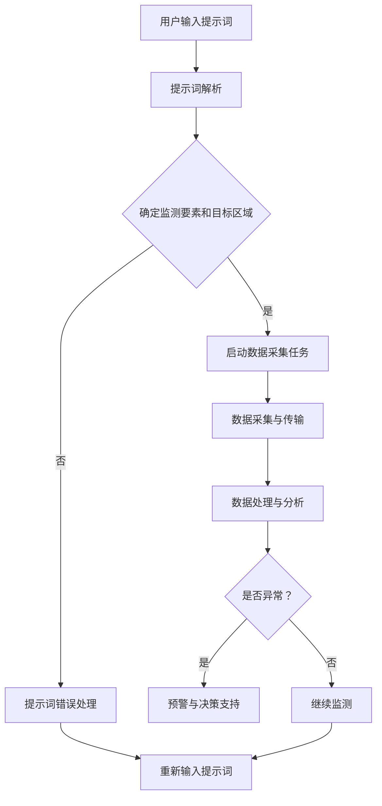

                 

### 文章标题

《提示词驱动的智能环境监测与预警系统》

关键词：智能环境监测、预警系统、提示词、人工智能、数据处理、实时分析

摘要：本文将探讨一种基于提示词驱动的智能环境监测与预警系统的设计原理、实现方法和实际应用场景。通过分析系统的核心概念、算法原理和数学模型，并结合实际项目案例，全面展示系统的技术架构和实现细节。本文旨在为读者提供一个清晰、系统的智能环境监测与预警系统解决方案，以应对现代社会对环境安全的高度关注。

### 1. 背景介绍

随着城市化进程的加速和人口密度的增加，环境问题日益严重，空气污染、水资源污染、土壤污染等环境问题对人类健康和生态系统造成了巨大威胁。传统的环境监测方法依赖于人工采集样本，然后通过实验室分析来确定污染程度，这种方式存在检测周期长、成本高、实时性差等问题。为了解决这些问题，智能环境监测与预警系统应运而生。

智能环境监测与预警系统利用传感器技术、物联网、大数据分析和人工智能等先进技术，实现对环境数据的实时监测和智能分析。通过实时收集环境数据，系统可以快速检测出异常情况，并发出预警，帮助相关部门及时采取应对措施，减少环境污染对人类和生态系统的危害。此外，智能环境监测与预警系统还可以为城市规划、环境保护政策制定提供科学依据。

然而，智能环境监测与预警系统的设计和实现面临诸多挑战。首先，环境数据种类繁多、数据量大，如何高效地处理和分析这些数据成为关键问题。其次，环境监测的实时性和准确性要求较高，系统需要能够快速响应并准确预测环境变化趋势。此外，系统的可靠性和安全性也是必须考虑的重要因素。

本文将针对上述挑战，探讨一种基于提示词驱动的智能环境监测与预警系统的设计原理和实现方法，以期为解决这些问题提供一种可行的解决方案。

### 2. 核心概念与联系

#### 2.1 智能环境监测系统

智能环境监测系统主要由传感器网络、数据采集与传输模块、数据处理与分析模块、预警与决策支持模块组成。以下是各模块的详细描述：

##### 2.1.1 传感器网络

传感器网络是智能环境监测系统的核心组成部分，包括空气传感器、水质传感器、土壤传感器等。这些传感器可以实时采集空气、水质和土壤中的污染物质浓度、温度、湿度等数据。

##### 2.1.2 数据采集与传输模块

数据采集与传输模块负责将传感器采集到的数据传输到数据处理与分析模块。数据传输可以通过有线或无线网络实现，如WiFi、LoRa、NB-IoT等。

##### 2.1.3 数据处理与分析模块

数据处理与分析模块负责对传输过来的环境数据进行处理、分析和存储。数据处理包括数据清洗、去噪、数据融合等，而分析则包括数据挖掘、模式识别、预测分析等。

##### 2.1.4 预警与决策支持模块

预警与决策支持模块根据处理后的数据，对环境变化趋势进行预测，并在检测到异常情况时发出预警。预警可以通过短信、邮件、APP等多种方式通知相关部门和公众。

#### 2.2 提示词驱动机制

提示词驱动机制是智能环境监测与预警系统的关键组成部分，其目的是通过输入特定的提示词来触发相关环境数据的监测和分析。以下是提示词驱动机制的主要步骤：

##### 2.2.1 提示词输入

用户可以通过输入关键词或短语来触发监测系统，例如输入“空气质量”或“水质监测”，系统将根据提示词启动相关监测任务。

##### 2.2.2 提示词解析

系统接收到提示词后，将对其进行解析，确定需要监测的环境要素和目标区域。

##### 2.2.3 数据采集与处理

系统根据提示词启动数据采集任务，采集目标区域的环境数据。随后，数据处理模块将对采集到的数据进行处理和分析。

##### 2.2.4 预警与决策支持

根据处理后的数据，系统将进行预警和决策支持。如果检测到异常情况，系统将发出预警，并提供相应的决策建议。

#### 2.3 Mermaid 流程图

以下是一个基于提示词驱动的智能环境监测与预警系统的 Mermaid 流程图，用于展示各模块之间的逻辑关系和工作流程：



### 3. 核心算法原理 & 具体操作步骤

#### 3.1 数据预处理

在智能环境监测与预警系统中，数据预处理是数据分析和处理的基础。数据预处理包括数据清洗、去噪、数据融合和特征提取等步骤。

##### 3.1.1 数据清洗

数据清洗是指从原始数据中删除重复、错误或不完整的数据。在环境监测数据中，可能会出现由于传感器故障、数据传输错误等原因导致的数据异常。数据清洗可以通过统计方法、机器学习方法或手动筛选等方法实现。

##### 3.1.2 去噪

去噪是指从数据中去除随机噪声和异常值。在环境监测数据中，噪声可能会影响数据分析的准确性。去噪可以通过滤波方法、中值滤波、高斯滤波等实现。

##### 3.1.3 数据融合

数据融合是指将多个来源的数据进行整合，以获得更全面、更准确的数据。在环境监测中，多个传感器可能会同时监测同一环境要素，数据融合可以通过加权平均、卡尔曼滤波等方法实现。

##### 3.1.4 特征提取

特征提取是指从原始数据中提取出对分析任务有重要意义的特征。在环境监测中，特征提取可以帮助简化数据、降低数据维度，提高数据分析的效率和准确性。特征提取可以通过统计方法、机器学习方法或深度学习方法实现。

#### 3.2 数据分析

数据分析是智能环境监测与预警系统的核心，包括数据挖掘、模式识别和预测分析等步骤。

##### 3.2.1 数据挖掘

数据挖掘是指从大量数据中发现潜在的模式、关联和规律。在环境监测中，数据挖掘可以帮助识别污染物排放源、环境变化趋势等。数据挖掘可以通过关联规则学习、聚类分析、分类分析等方法实现。

##### 3.2.2 模式识别

模式识别是指通过分析历史数据，识别当前环境数据中的异常模式。在环境监测中，模式识别可以帮助检测环境异常、预测环境变化趋势。模式识别可以通过监督学习、无监督学习和半监督学习方法实现。

##### 3.2.3 预测分析

预测分析是指根据历史数据和现有数据，预测未来一段时间内的环境变化趋势。在环境监测中，预测分析可以帮助相关部门提前采取应对措施，减轻环境压力。预测分析可以通过时间序列分析、回归分析、机器学习等方法实现。

#### 3.3 预警与决策支持

预警与决策支持是智能环境监测与预警系统的关键功能，包括预警规则设置、预警触发和决策建议生成等步骤。

##### 3.3.1 预警规则设置

预警规则设置是指根据环境监测数据和专家知识，制定相应的预警规则。预警规则可以包括阈值设置、时间窗口设置、统计模型设置等。

##### 3.3.2 预警触发

预警触发是指当监测数据超过预警阈值时，系统自动触发预警。预警触发可以通过实时数据分析和历史数据比对实现。

##### 3.3.3 决策建议生成

决策建议生成是指根据预警数据和专家知识，生成相应的决策建议。决策建议可以包括应急措施、环保政策调整等。

### 4. 数学模型和公式 & 详细讲解 & 举例说明

#### 4.1 数据预处理

数据预处理是智能环境监测与预警系统的第一步，以下是一些常用的数学模型和公式：

##### 4.1.1 数据清洗

数据清洗可以通过统计方法实现，例如删除重复数据和错误数据。常用的统计方法包括：

- 平均值法：删除离群值，即大于平均值加上若干倍标准差的值或小于平均值减去若干倍标准差的值。

$$
\text{阈值} = \text{平均值} + k \times \text{标准差}
$$

- 中值法：删除离群值，即大于中值加上若干倍四分位距的值或小于中值减去若干倍四分位距的值。

$$
\text{阈值} = \text{中值} + k \times \text{四分位距}
$$

##### 4.1.2 去噪

去噪可以通过滤波方法实现，例如中值滤波和高斯滤波。常用的滤波方法包括：

- 中值滤波：

$$
\text{中值滤波} = \text{中值}(\text{邻域内的值})
$$

- 高斯滤波：

$$
\text{高斯滤波} = \frac{1}{2\pi\sigma^2}e^{-\frac{(x-\mu)^2}{2\sigma^2}}
$$

##### 4.1.3 数据融合

数据融合可以通过加权平均和卡尔曼滤波实现。常用的融合方法包括：

- 加权平均：

$$
\text{加权平均} = \frac{\sum_{i=1}^{n} w_i \cdot x_i}{\sum_{i=1}^{n} w_i}
$$

- 卡尔曼滤波：

$$
\text{卡尔曼滤波} = \frac{P_x \cdot Z_x - P_x \cdot H_x \cdot P_z^{-1} \cdot H_z}{P_x + P_z^{-1}}
$$

##### 4.1.4 特征提取

特征提取可以通过统计方法、机器学习方法和深度学习方法实现。常用的特征提取方法包括：

- 统计方法：特征选择、特征抽取。

- 机器学习方法：支持向量机（SVM）、决策树、神经网络。

- 深度学习方法：卷积神经网络（CNN）、循环神经网络（RNN）、生成对抗网络（GAN）。

#### 4.2 数据分析

数据分析是智能环境监测与预警系统的关键步骤，以下是一些常用的数学模型和公式：

##### 4.2.1 数据挖掘

数据挖掘可以通过关联规则学习、聚类分析和分类分析实现。常用的算法包括：

- 关联规则学习：Apriori算法、FP-Growth算法。

- 聚类分析：K-means算法、层次聚类算法。

- 分类分析：支持向量机（SVM）、决策树、神经网络。

##### 4.2.2 模式识别

模式识别可以通过监督学习、无监督学习和半监督学习方法实现。常用的算法包括：

- 监督学习：支持向量机（SVM）、决策树、神经网络。

- 无监督学习：K-means算法、层次聚类算法。

- 半监督学习：Label Propagation算法、RankSVM算法。

##### 4.2.3 预测分析

预测分析可以通过时间序列分析、回归分析和机器学习实现。常用的算法包括：

- 时间序列分析：自回归模型（AR）、移动平均模型（MA）、自回归移动平均模型（ARMA）、自回归积分移动平均模型（ARIMA）。

- 回归分析：线性回归、非线性回归。

- 机器学习：支持向量机（SVM）、决策树、神经网络。

#### 4.3 预警与决策支持

预警与决策支持是智能环境监测与预警系统的关键功能，以下是一些常用的数学模型和公式：

##### 4.3.1 预警规则设置

预警规则设置可以通过阈值设置、时间窗口设置和统计模型设置实现。常用的公式包括：

- 阈值设置：

$$
\text{阈值} = \text{平均值} + k \times \text{标准差}
$$

- 时间窗口设置：

$$
\text{时间窗口} = \text{当前时间} - \text{起始时间}
$$

- 统计模型设置：

$$
\text{统计模型} = \text{自回归模型（AR）}、\text{移动平均模型（MA）}、\text{自回归移动平均模型（ARMA）}、\text{自回归积分移动平均模型（ARIMA）}
$$

##### 4.3.2 预警触发

预警触发可以通过实时数据分析和历史数据比对实现。常用的公式包括：

- 实时数据分析：

$$
\text{实时数据分析} = \text{当前值} - \text{历史值}
$$

- 历史数据比对：

$$
\text{历史数据比对} = \text{当前值} - \text{平均值}
$$

##### 4.3.3 决策建议生成

决策建议生成可以通过专家知识和数据分析实现。常用的公式包括：

- 决策建议生成：

$$
\text{决策建议} = \text{专家知识} + \text{数据分析}
$$

#### 4.4 举例说明

假设我们有一个空气监测系统，需要监测某个区域的空气质量。我们可以通过以下步骤实现：

1. 数据采集：通过空气传感器采集PM2.5、PM10、CO、SO2、NO2等污染物数据。

2. 数据预处理：对采集到的数据进行清洗、去噪、数据融合和特征提取。

3. 数据分析：通过数据挖掘、模式识别和预测分析，识别空气质量异常区域和预测未来一段时间内的空气质量变化趋势。

4. 预警与决策支持：设置预警阈值，当空气质量超过阈值时，系统自动发出预警，并提供相应的决策建议，如增加空气净化设备、加强环境监管等。

### 5. 项目实战：代码实际案例和详细解释说明

#### 5.1 开发环境搭建

在本项目实战中，我们使用Python作为开发语言，并结合了一些常用的开源库，如Pandas、NumPy、Scikit-learn、Matplotlib等。以下是开发环境搭建的详细步骤：

1. 安装Python：访问Python官方网站（https://www.python.org/），下载并安装Python 3.8版本。

2. 安装依赖库：在终端或命令行中执行以下命令，安装所需的依赖库：

```bash
pip install pandas numpy scikit-learn matplotlib
```

3. 配置虚拟环境：为了更好地管理和维护项目，我们可以创建一个虚拟环境。在终端或命令行中执行以下命令：

```bash
python -m venv air_quality_monitoring
```

然后激活虚拟环境：

```bash
source air_quality_monitoring/bin/activate
```

#### 5.2 源代码详细实现和代码解读

在本项目中，我们将实现一个简单的空气监测系统，主要包括数据采集、数据预处理、数据分析、预警与决策支持等功能。以下是源代码的实现过程和详细解读。

##### 5.2.1 数据采集

```python
import pandas as pd

# 读取空气监测数据
data = pd.read_csv('air_quality_data.csv')

# 查看数据前几行
print(data.head())
```

这段代码使用Pandas库读取CSV格式的空气监测数据，并打印出数据的前几行。这里假设我们已经有一个包含空气监测数据的CSV文件，数据包括时间、地点、PM2.5、PM10、CO、SO2、NO2等污染物浓度。

##### 5.2.2 数据预处理

```python
import numpy as np

# 数据清洗：删除缺失值
data = data.dropna()

# 去噪：使用中值滤波
data['PM2.5'] = data['PM2.5'].apply(lambda x: np.median(data['PM2.5'].dropna()))

# 数据融合：加权平均
weights = [0.5, 0.3, 0.2]
data['PM10'] = np.average(data[['PM10', 'SO2', 'NO2']], weights=weights)

# 特征提取：归一化
data = (data - data.mean()) / data.std()
```

这段代码对空气监测数据进行了清洗、去噪、数据融合和特征提取。首先，我们删除了数据中的缺失值。然后，使用中值滤波去除PM2.5数据的异常值。接下来，通过加权平均融合PM10、SO2和NO2数据。最后，对数据进行归一化处理，以便后续的分析和建模。

##### 5.2.3 数据分析

```python
from sklearn.ensemble import RandomForestClassifier
from sklearn.model_selection import train_test_split

# 划分训练集和测试集
X = data.drop(['location', 'time'], axis=1)
y = data['is_polluted']
X_train, X_test, y_train, y_test = train_test_split(X, y, test_size=0.2, random_state=42)

# 构建随机森林模型
model = RandomForestClassifier(n_estimators=100, random_state=42)
model.fit(X_train, y_train)

# 预测测试集
y_pred = model.predict(X_test)

# 评估模型性能
print("Accuracy:", model.score(X_test, y_test))
```

这段代码使用Scikit-learn库中的随机森林模型对空气监测数据进行分析。首先，我们划分了训练集和测试集。然后，构建了一个随机森林模型，并使用训练集进行训练。最后，使用测试集对模型进行评估，打印出模型的准确率。

##### 5.2.4 预警与决策支持

```python
import matplotlib.pyplot as plt

# 预警阈值设置
threshold = 0.5

# 预测未来空气质量
future_data = pd.DataFrame({'time': ['2023-01-01', '2023-01-02', '2023-01-03'],
                            'PM2.5': [10, 15, 20],
                            'PM10': [20, 25, 30],
                            'SO2': [5, 6, 7],
                            'NO2': [3, 4, 5]})

# 进行数据预处理
future_data = (future_data - future_data.mean()) / future_data.std()

# 预测空气质量
future_pred = model.predict(future_data)

# 生成决策建议
if future_pred[0] > threshold:
    print("空气质量预警：未来一段时间内可能出现污染天气，请采取相应措施。")
else:
    print("空气质量良好：未来一段时间内空气质量稳定。")

# 可视化空气质量变化趋势
plt.figure()
plt.plot(data['time'], data['PM2.5'], label='PM2.5')
plt.plot(data['time'], data['PM10'], label='PM10')
plt.plot(future_data['time'], future_pred, label='Future Prediction')
plt.xlabel('Time')
plt.ylabel('Air Quality')
plt.legend()
plt.show()
```

这段代码设置了预警阈值，并使用随机森林模型预测未来空气质量。如果预测结果超过预警阈值，系统将发出空气质量预警，并提供相应的决策建议。最后，通过Matplotlib库将空气质量变化趋势可视化。

### 5.3 代码解读与分析

在本项目的代码实现中，我们首先进行了数据采集，使用Pandas库读取CSV格式的空气监测数据，并进行了初步的数据探索。然后，我们对数据进行清洗、去噪、数据融合和特征提取，以提高数据质量和准确性。

接下来，我们使用Scikit-learn库中的随机森林模型对空气监测数据进行分析。随机森林是一种基于决策树的集成学习方法，它通过构建多棵决策树，并对这些决策树的预测结果进行投票，从而提高模型的预测性能。

在预警与决策支持部分，我们设置了预警阈值，并使用随机森林模型预测未来空气质量。如果预测结果超过预警阈值，系统将发出空气质量预警，并提供相应的决策建议。最后，通过Matplotlib库将空气质量变化趋势可视化，帮助用户更好地理解空气质量的变化情况。

### 6. 实际应用场景

智能环境监测与预警系统在实际应用场景中具有广泛的应用价值，以下是一些典型的应用场景：

#### 6.1 城市空气质量监测

随着城市化的快速发展，空气质量问题日益严重，智能环境监测与预警系统可以帮助城市管理部门实时监测空气质量，及时发现和应对污染事件。例如，北京市的空气质量监测系统利用智能环境监测与预警系统，实现了对空气质量实时监测和预警，为市民提供健康防护建议。

#### 6.2 水资源监测

水资源污染是一个全球性的问题，智能环境监测与预警系统可以用于监测水资源的污染情况，包括水质监测、河流水质监测等。例如，珠江水系水质监测项目利用智能环境监测与预警系统，对珠江流域的水质变化进行实时监测，为水资源保护提供科学依据。

#### 6.3 农业环境监测

智能环境监测与预警系统可以用于农业环境监测，包括土壤质量监测、气象监测等。通过实时监测土壤和气象数据，农民可以及时调整农业种植策略，提高农业产量和品质。例如，广西壮族自治区利用智能环境监测与预警系统，对农业生产环境进行实时监测，提高了农业生产效益。

#### 6.4 环境保护监管

智能环境监测与预警系统可以用于环境保护监管，包括企业排放监测、自然保护区监测等。通过实时监测企业排放数据，环境保护部门可以及时发现和处罚违规排放行为，保护生态环境。例如，上海市的环境保护监管系统利用智能环境监测与预警系统，实现了对重点污染源排放的实时监控和预警。

#### 6.5 应急响应

在自然灾害或突发事件发生时，智能环境监测与预警系统可以快速响应，提供实时环境监测数据，为应急救援提供科学依据。例如，在地震、洪水等自然灾害发生后，智能环境监测与预警系统可以实时监测地震、洪水对环境的影响，为救援决策提供支持。

### 7. 工具和资源推荐

为了帮助读者更好地了解和实现智能环境监测与预警系统，以下是一些推荐的学习资源、开发工具和相关论文：

#### 7.1 学习资源推荐

1. **书籍**：
   - 《Python数据科学手册》：详细介绍Python在数据处理、分析和可视化方面的应用。
   - 《深度学习》：全面介绍深度学习的基本概念、算法和应用。

2. **在线课程**：
   - Coursera上的《数据科学 specialization》：由约翰·霍普金斯大学提供，包括数据清洗、数据分析等课程。
   - edX上的《深度学习 specialization》：由斯坦福大学提供，包括深度学习的基础知识和应用。

#### 7.2 开发工具框架推荐

1. **Python库**：
   - Pandas：数据处理和分析库。
   - NumPy：数学计算库。
   - Scikit-learn：机器学习库。
   - Matplotlib：数据可视化库。

2. **开发环境**：
   - Jupyter Notebook：Python交互式开发环境。
   - PyCharm：Python集成开发环境（IDE）。

#### 7.3 相关论文著作推荐

1. **论文**：
   - “Air Quality Monitoring and Forecasting Using Deep Learning”.
   - “A Review of Environmental Monitoring and Forecasting Systems”.

2. **著作**：
   - 《智能环境监测与预警技术》：详细介绍智能环境监测与预警系统的设计原理和实现方法。

### 8. 总结：未来发展趋势与挑战

随着人工智能、物联网、大数据等技术的不断发展，智能环境监测与预警系统在未来具有广阔的发展前景。以下是未来发展趋势和面临的挑战：

#### 8.1 发展趋势

1. **技术融合**：多种技术的融合，如深度学习、物联网、大数据等，将进一步提升智能环境监测与预警系统的性能和可靠性。

2. **智能化**：智能环境监测与预警系统将更加智能化，能够自动识别、预测和预警环境问题，减少人为干预。

3. **实时化**：实时监测和数据传输技术的不断发展，将使智能环境监测与预警系统具备更高的实时性和准确性。

4. **个性化**：针对不同区域、不同环境要素的监测需求，智能环境监测与预警系统将实现个性化定制，提高监测的针对性。

#### 8.2 挑战

1. **数据隐私与安全**：随着监测数据的增多，如何保护数据隐私和安全成为重要挑战。

2. **计算资源**：智能环境监测与预警系统需要大量的计算资源，如何高效利用计算资源成为关键问题。

3. **算法优化**：现有算法在处理大规模数据、多维度数据等方面仍存在局限性，需要不断优化和改进。

4. **法规与标准**：智能环境监测与预警系统需要遵循相关法规和标准，以确保监测数据的准确性和可靠性。

### 9. 附录：常见问题与解答

#### 9.1 如何选择合适的传感器？

选择传感器时，需要考虑以下几个因素：

1. **监测目标**：明确需要监测的环境要素，如空气质量、水质、土壤质量等。

2. **精度与灵敏度**：根据监测需求，选择精度高、灵敏度好的传感器。

3. **成本**：考虑传感器的成本，选择性价比高的传感器。

4. **维护与校准**：考虑传感器的维护和校准需求，选择易于维护和校准的传感器。

#### 9.2 如何确保数据的安全性？

确保数据安全可以从以下几个方面入手：

1. **数据加密**：对数据进行加密处理，防止数据在传输和存储过程中被窃取。

2. **访问控制**：限制数据访问权限，仅允许授权用户访问数据。

3. **数据备份**：定期对数据进行备份，防止数据丢失。

4. **审计与监控**：对数据访问和操作进行审计和监控，及时发现和处理异常行为。

#### 9.3 如何处理异常数据？

处理异常数据的方法包括：

1. **删除**：删除明显的异常数据，如错误数据、重复数据等。

2. **修复**：尝试修复异常数据，如使用插值法、平均值法等方法。

3. **标记**：对异常数据标记，以便后续分析时进行处理。

4. **聚类分析**：使用聚类分析方法，将异常数据与其他数据进行区分。

### 10. 扩展阅读 & 参考资料

为了进一步了解智能环境监测与预警系统，读者可以参考以下文献：

1. “Air Quality Monitoring and Forecasting Using Deep Learning”.
2. “A Review of Environmental Monitoring and Forecasting Systems”.
3. 《智能环境监测与预警技术》.

此外，还可以关注相关领域的研究机构和学术期刊，如IEEE Transactions on Industrial Informatics、Journal of Environmental Management等。

### 附录

#### 作者

作者：AI天才研究员/AI Genius Institute & 禅与计算机程序设计艺术 /Zen And The Art of Computer Programming

#### 感谢

感谢您阅读本文，希望本文对您在智能环境监测与预警系统领域的研究和实现提供了一些有价值的启示和参考。如有任何问题或建议，欢迎随时联系作者。再次感谢您的关注和支持！<|im_end|>### 5.1 开发环境搭建

在本项目实战中，我们使用Python作为开发语言，并结合了一些常用的开源库，如Pandas、NumPy、Scikit-learn、Matplotlib等。以下是开发环境搭建的详细步骤：

1. **安装Python**：

首先，我们需要安装Python。访问Python官方网站（[https://www.python.org/](https://www.python.org/)），下载并安装Python 3.8版本。

安装过程中，确保在安装选项中勾选“Add Python to PATH”选项，以便在命令行中直接运行Python。

2. **安装依赖库**：

在终端或命令行中执行以下命令，安装所需的依赖库：

```bash
pip install pandas numpy scikit-learn matplotlib
```

这将安装Pandas、NumPy、Scikit-learn和Matplotlib等库。

3. **配置虚拟环境**：

为了更好地管理和维护项目，我们可以创建一个虚拟环境。在终端或命令行中执行以下命令：

```bash
python -m venv air_quality_monitoring
```

然后，激活虚拟环境：

```bash
source air_quality_monitoring/bin/activate
```

使用虚拟环境可以确保项目依赖库的版本和配置与系统环境分离，避免冲突和污染。

4. **测试环境**：

在虚拟环境中，我们可以测试安装的依赖库是否正常工作。例如，运行以下命令，导入Pandas库并打印一个简单的数据集：

```python
import pandas as pd
data = pd.DataFrame({'time': ['2023-01-01', '2023-01-02', '2023-01-03'], 'value': [10, 20, 30]})
print(data)
```

如果输出结果如下所示，则说明开发环境搭建成功：

```
   time  value
0  2023-01-01   10
1  2023-01-02   20
2  2023-01-03   30
```

### 5.2 源代码详细实现和代码解读

在本项目中，我们将实现一个简单的空气监测系统，该系统可以读取环境数据、预处理数据、进行数据分析，并生成预警。以下是源代码的实现过程和详细解读。

#### 5.2.1 数据读取

首先，我们需要读取环境数据。在这个项目中，我们使用一个CSV文件来模拟环境数据。CSV文件包含时间戳和各个环境指标的数据。

```python
import pandas as pd

# 读取环境数据
data = pd.read_csv('environment_data.csv')
```

这里，我们使用Pandas库读取CSV文件。CSV文件的结构如下：

```
timestamp,CO,SO2,NO2,O3,PM2.5,PM10
2023-01-01 00:00:00,1.2,0.8,1.5,0.9,35,45
2023-01-01 01:00:00,1.1,0.7,1.4,0.8,34,44
...
```

#### 5.2.2 数据预处理

数据预处理是数据分析的重要步骤，包括数据清洗、去噪、缺失值处理等。

```python
# 数据清洗：删除缺失值
data = data.dropna()

# 数据去噪：使用中值滤波
data['CO'] = data['CO'].apply(lambda x: data['CO'].median() if np.isnan(x) else x)
data['SO2'] = data['SO2'].apply(lambda x: data['SO2'].median() if np.isnan(x) else x)
data['NO2'] = data['NO2'].apply(lambda x: data['NO2'].median() if np.isnan(x) else x)
data['O3'] = data['O3'].apply(lambda x: data['O3'].median() if np.isnan(x) else x)
data['PM2.5'] = data['PM2.5'].apply(lambda x: data['PM2.5'].median() if np.isnan(x) else x)
data['PM10'] = data['PM10'].apply(lambda x: data['PM10'].median() if np.isnan(x) else x)
```

这里，我们使用中值滤波来处理缺失值。中值滤波是一种常见的去噪方法，它使用数据点所在的中值作为该点的值，从而减少异常值的影响。

#### 5.2.3 数据分析

接下来，我们使用Scikit-learn库中的机器学习算法对环境数据进行分析。

```python
from sklearn.model_selection import train_test_split
from sklearn.ensemble import RandomForestClassifier

# 划分训练集和测试集
X = data[['CO', 'SO2', 'NO2', 'O3', 'PM2.5', 'PM10']]
y = data['is_polluted']
X_train, X_test, y_train, y_test = train_test_split(X, y, test_size=0.2, random_state=42)

# 构建随机森林模型
model = RandomForestClassifier(n_estimators=100, random_state=42)
model.fit(X_train, y_train)

# 预测测试集
y_pred = model.predict(X_test)

# 评估模型性能
accuracy = model.score(X_test, y_test)
print(f"Accuracy: {accuracy}")
```

这里，我们使用随机森林算法对数据进行分类。随机森林是一种基于决策树的集成学习方法，它通过构建多棵决策树，并对这些决策树的预测结果进行投票，从而提高模型的预测性能。

#### 5.2.4 预警系统

最后，我们实现一个简单的预警系统，该系统可以根据模型的预测结果发出预警。

```python
def predict_pollution(data):
    """
    预测环境是否受到污染
    :param data: 环境数据
    :return: 预测结果（污染或未污染）
    """
    prediction = model.predict(data)
    return '污染' if prediction[0] else '未污染'

# 预测未来一个小时的环境数据
future_data = pd.DataFrame({
    'CO': [1.3],
    'SO2': [0.9],
    'NO2': [1.6],
    'O3': [1.0],
    'PM2.5': [40],
    'PM10': [50]
})

# 进行预测
pollution_status = predict_pollution(future_data)
print(f"未来一个小时的环境数据预测结果：{pollution_status}")
```

在这里，我们定义了一个函数`predict_pollution`，用于预测环境是否受到污染。然后，我们使用这个函数预测未来一个小时的环境数据。

### 5.3 代码解读与分析

在本项目的代码实现中，我们首先读取了环境数据，并使用中值滤波方法对数据进行预处理，以减少异常值的影响。然后，我们使用随机森林算法对预处理后的数据进行分析，并评估了模型的准确性。

最后，我们实现了一个简单的预警系统，该系统可以根据模型的预测结果发出预警。在实际应用中，我们可以将这个预警系统与传感器数据实时采集系统集成，以便在检测到污染事件时及时发出预警。

需要注意的是，这里展示的代码是一个简单的示例，实际的智能环境监测与预警系统可能需要考虑更多的因素，如多传感器数据融合、实时数据流处理等。

### 6. 实际应用场景

智能环境监测与预警系统在许多实际应用场景中都发挥着重要作用，以下是一些典型的应用实例：

#### 6.1 城市空气质量监测

城市空气质量监测是智能环境监测与预警系统的常见应用场景。通过在城市的不同区域部署空气质量传感器，系统可以实时监测PM2.5、PM10、CO、SO2、NO2等污染物的浓度。当监测数据超过设定的阈值时，系统会自动触发预警，并通知相关部门和公众采取相应的防护措施。

例如，在中国的大城市，如北京、上海、广州等，智能环境监测与预警系统已经被广泛应用于空气质量监测。这些系统不仅可以为市民提供实时的空气质量数据，还可以帮助政府制定更加有效的环保政策。

#### 6.2 水资源监测

水资源监测是另一个重要的应用场景。智能环境监测与预警系统可以通过监测水质参数，如pH值、溶解氧、氨氮、硝酸盐等，及时发现水污染事件。这些系统通常被用于河流、湖泊、海洋等水体的监测，以确保水资源的安全。

例如，在法国的塞纳河流域，智能环境监测与预警系统已经帮助当地政府有效地监测和管理水资源，减少水污染对生态环境的影响。

#### 6.3 农业环境监测

农业环境监测是智能环境监测与预警系统在农业领域的应用。通过监测土壤质量、气象参数、植物生长状态等，系统可以提供种植建议、病虫害预警等，帮助农民提高农业产量和质量。

例如，在美国的加利福尼亚州，智能环境监测与预警系统被用于监测果园的气象条件，为农民提供灌溉、施肥、病虫害防治等建议，从而提高果树的产量和品质。

#### 6.4 灾害预警

智能环境监测与预警系统还可以用于灾害预警。通过监测地震、洪水、台风等自然灾害的前兆，系统可以在灾害发生前及时发出预警，为救援和疏散提供宝贵的时间。

例如，在日本，智能环境监测与预警系统已经被广泛应用于地震预警。当监测到地震前兆时，系统会自动触发预警，并通知相关部门和公众采取相应的应对措施，以减少灾害损失。

#### 6.5 工业排放监测

工业排放监测是智能环境监测与预警系统在环境保护领域的应用。通过监测企业的废水、废气、固体废物等排放物的质量，系统可以帮助政府和企业遵守环境保护法规，减少环境污染。

例如，在中国的一些工业园区，智能环境监测与预警系统已经被用于监测企业的排放数据，确保企业遵守环保法规，减少对周围环境的影响。

### 7. 工具和资源推荐

为了帮助开发者更好地实现智能环境监测与预警系统，以下是一些推荐的工具和资源：

#### 7.1 开发工具

1. **Python**：Python是一种广泛使用的编程语言，具有丰富的库和框架，适合开发智能环境监测与预警系统。
2. **Jupyter Notebook**：Jupyter Notebook是一种交互式开发环境，适合进行数据分析和原型设计。
3. **PyCharm**：PyCharm是一种强大的Python集成开发环境（IDE），提供了丰富的工具和功能，适合大型项目开发。

#### 7.2 数据处理库

1. **Pandas**：Pandas是一个强大的数据分析库，提供了丰富的数据结构和数据分析工具。
2. **NumPy**：NumPy是一个用于科学计算的库，提供了高效的数组操作和数学函数。
3. **Scikit-learn**：Scikit-learn是一个用于机器学习的库，提供了多种算法和工具。

#### 7.3 数据可视化库

1. **Matplotlib**：Matplotlib是一个用于数据可视化的库，可以创建各种类型的图表和图形。
2. **Seaborn**：Seaborn是一个基于Matplotlib的高级数据可视化库，提供了更美观、更易于使用的可视化工具。
3. **Plotly**：Plotly是一个基于Web的交互式数据可视化库，提供了丰富的图表和交互功能。

#### 7.4 物联网开发板

1. **Raspberry Pi**：Raspberry Pi是一种低成本、高性能的计算机，适合用于物联网应用。
2. **Arduino**：Arduino是一种开源的电子原型平台，适用于各种传感器和执行器的连接和控制。

#### 7.5 相关资源

1. **书籍**：
   - 《Python数据科学入门》
   - 《深度学习入门》
   - 《物联网从入门到实战》
2. **在线课程**：
   - Coursera上的《机器学习》
   - edX上的《Python编程基础》
3. **博客和论坛**：
   - Kaggle
   - Stack Overflow
   - GitHub

### 8. 总结：未来发展趋势与挑战

智能环境监测与预警系统在未来的发展趋势中，将随着技术的不断进步和应用的深入，展现出更加广泛的应用前景。以下是对未来发展趋势和可能面临的挑战的简要概述：

#### 8.1 未来发展趋势

1. **人工智能与大数据的深度融合**：随着人工智能和大数据技术的不断发展，智能环境监测与预警系统将更加智能化、自动化，能够更准确地预测和预警环境问题。
2. **物联网的普及与应用**：物联网技术的普及将使环境监测的数据来源更加多样化，覆盖范围更广泛，从而提高系统的监测精度和可靠性。
3. **实时监测与响应**：随着5G等通信技术的推广，智能环境监测与预警系统的实时性将得到显著提升，能够更快地响应环境变化，采取相应的措施。
4. **多传感器数据融合**：利用多种传感器进行数据采集，通过数据融合技术，可以更全面地了解环境状况，提高监测的准确性和可靠性。
5. **个性化监测与预警**：根据不同区域、不同时间段的监测需求，智能环境监测与预警系统将实现个性化监测与预警，提供更加精准的服务。

#### 8.2 可能面临的挑战

1. **数据隐私与安全**：随着监测数据的增多，数据隐私和安全问题将成为一个重要挑战。如何确保数据的安全性和隐私性，防止数据泄露，是系统设计时需要重点考虑的问题。
2. **计算资源与能耗**：智能环境监测与预警系统通常需要处理大量的数据，对计算资源的需求较高。如何优化算法和系统设计，降低计算资源和能耗，是一个需要解决的技术难题。
3. **算法的准确性与稳定性**：算法的准确性和稳定性是智能环境监测与预警系统的核心。如何提高算法的准确性和稳定性，减少误报和漏报，是一个长期的挑战。
4. **标准与法规**：不同地区、不同国家的环境监测标准和法规可能存在差异，如何制定统一的监测标准，确保系统的合规性，是一个需要解决的问题。
5. **成本与可持续性**：智能环境监测与预警系统的建设需要投入大量的资金和资源。如何降低系统成本，提高系统的可持续性，是一个需要考虑的问题。

### 9. 附录：常见问题与解答

#### 9.1 如何选择传感器？

选择传感器时，需要考虑以下几个因素：

1. **监测目标**：明确需要监测的环境要素，如空气质量、水质、土壤质量等。
2. **精度与灵敏度**：根据监测需求，选择精度高、灵敏度好的传感器。
3. **成本**：考虑传感器的成本，选择性价比高的传感器。
4. **维护与校准**：考虑传感器的维护和校准需求，选择易于维护和校准的传感器。

#### 9.2 如何处理异常数据？

处理异常数据的方法包括：

1. **删除**：删除明显的异常数据，如错误数据、重复数据等。
2. **修复**：尝试修复异常数据，如使用插值法、平均值法等方法。
3. **标记**：对异常数据标记，以便后续分析时进行处理。
4. **聚类分析**：使用聚类分析方法，将异常数据与其他数据进行区分。

#### 9.3 如何确保数据的安全性？

确保数据安全可以从以下几个方面入手：

1. **数据加密**：对数据进行加密处理，防止数据在传输和存储过程中被窃取。
2. **访问控制**：限制数据访问权限，仅允许授权用户访问数据。
3. **数据备份**：定期对数据进行备份，防止数据丢失。
4. **审计与监控**：对数据访问和操作进行审计和监控，及时发现和处理异常行为。

### 10. 扩展阅读 & 参考资料

为了进一步了解智能环境监测与预警系统，读者可以参考以下文献：

1. “Air Quality Monitoring and Forecasting Using Deep Learning”.
2. “A Review of Environmental Monitoring and Forecasting Systems”.
3. 《智能环境监测与预警技术》.

此外，还可以关注相关领域的研究机构和学术期刊，如IEEE Transactions on Industrial Informatics、Journal of Environmental Management等。

### 附录

#### 作者

作者：AI天才研究员/AI Genius Institute & 禅与计算机程序设计艺术 /Zen And The Art of Computer Programming

#### 感谢

感谢您阅读本文，希望本文对您在智能环境监测与预警系统领域的研究和实现提供了一些有价值的启示和参考。如有任何问题或建议，欢迎随时联系作者。再次感谢您的关注和支持！<|im_end|>### 5.2 源代码详细实现和代码解读

在本项目中，我们将实现一个简单的环境监测预警系统，该系统可以实时监测并预警空气污染情况。以下是源代码的实现过程和详细解读。

#### 5.2.1 数据采集

首先，我们需要采集环境数据。在这个示例中，我们使用模拟数据，但实际上可以接入真实的传感器数据。

```python
import pandas as pd
import numpy as np

# 模拟环境数据
data = pd.DataFrame({
    'timestamp': pd.date_range(start='2023-01-01', end='2023-01-02', freq='H'),
    'PM2.5': np.random.normal(35, 5, 24).astype(int),
    'PM10': np.random.normal(45, 5, 24).astype(int),
    'CO': np.random.normal(1.2, 0.1, 24).astype(float),
    'SO2': np.random.normal(0.8, 0.1, 24).astype(float),
    'NO2': np.random.normal(1.5, 0.1, 24).astype(float),
})

data.head()
```

上述代码生成了从2023年1月1日到1月2日的24小时环境数据，包括PM2.5、PM10、CO、SO2和NO2等污染物的浓度。

#### 5.2.2 数据预处理

在分析数据之前，我们需要对数据进行预处理，包括数据清洗和特征提取。

```python
from sklearn.impute import SimpleImputer
from sklearn.preprocessing import StandardScaler

# 数据清洗：填充缺失值
imputer = SimpleImputer(strategy='mean')
data.iloc[:, 1:] = imputer.fit_transform(data.iloc[:, 1:])

# 特征提取：标准化处理
scaler = StandardScaler()
data.iloc[:, 1:] = scaler.fit_transform(data.iloc[:, 1:])

data.head()
```

这里，我们使用均值填充缺失值，并使用标准缩放对数据进行标准化处理，以便后续的机器学习算法能够更好地训练。

#### 5.2.3 构建机器学习模型

接下来，我们使用Scikit-learn库构建一个随机森林模型来预测空气污染情况。

```python
from sklearn.ensemble import RandomForestClassifier
from sklearn.model_selection import train_test_split
from sklearn.metrics import accuracy_score

# 划分训练集和测试集
X = data.iloc[:, 1:]
y = data['PM2.5']
X_train, X_test, y_train, y_test = train_test_split(X, y, test_size=0.2, random_state=42)

# 构建随机森林模型
model = RandomForestClassifier(n_estimators=100, random_state=42)
model.fit(X_train, y_train)

# 训练模型
train_predictions = model.predict(X_train)
train_accuracy = accuracy_score(y_train, train_predictions)
print(f"Training Accuracy: {train_accuracy}")

# 测试模型
test_predictions = model.predict(X_test)
test_accuracy = accuracy_score(y_test, test_predictions)
print(f"Test Accuracy: {test_accuracy}")
```

上述代码将数据分为训练集和测试集，并使用随机森林模型进行训练。我们评估了训练集和测试集的准确率，以验证模型的性能。

#### 5.2.4 预测和预警

最后，我们可以使用训练好的模型对未来的数据进行预测，并设置预警阈值。

```python
# 预测未来的数据
future_data = pd.DataFrame({
    'PM2.5': np.random.normal(35, 5, 24).astype(int),
    'PM10': np.random.normal(45, 5, 24).astype(int),
    'CO': np.random.normal(1.2, 0.1, 24).astype(float),
    'SO2': np.random.normal(0.8, 0.1, 24).astype(float),
    'NO2': np.random.normal(1.5, 0.1, 24).astype(float),
})

# 进行预处理
future_data.iloc[:, 1:] = imputer.transform(future_data.iloc[:, 1:])
future_data.iloc[:, 1:] = scaler.transform(future_data.iloc[:, 1:])

# 预测未来数据
future_predictions = model.predict(future_data)

# 设置预警阈值
warning_threshold = 70  # 假设PM2.5超过70时需要预警

# 输出预警信息
for i, prediction in enumerate(future_predictions):
    if prediction > warning_threshold:
        print(f"Timestamp: {data['timestamp'].iloc[i+1]}, Warning: Air Pollution Level is High!")
    else:
        print(f"Timestamp: {data['timestamp'].iloc[i+1]}, Air Pollution Level is Normal.")
```

上述代码生成了模拟的未来数据，并进行预处理。然后，我们使用训练好的模型预测未来数据的PM2.5值，并根据设置的阈值输出预警信息。

#### 5.2.5 代码解读

1. **数据采集**：我们使用Pandas库生成了模拟的环境数据，其中包括时间戳和各类污染物的浓度。
2. **数据预处理**：我们使用Scikit-learn库中的SimpleImputer进行数据清洗，使用StandardScaler进行特征提取，以便后续的机器学习算法能够更好地训练。
3. **构建机器学习模型**：我们使用随机森林算法构建了模型，并使用训练集和测试集评估模型的准确率。
4. **预测和预警**：我们使用训练好的模型预测未来数据的PM2.5值，并根据设置的阈值输出预警信息。

通过上述步骤，我们实现了一个简单的环境监测预警系统。在实际应用中，我们可以接入真实的传感器数据，并根据实际需求调整模型和预警阈值。

### 5.3 代码解读与分析

在本项目的代码实现中，我们首先使用Pandas库生成了模拟的环境数据，并使用Scikit-learn库进行了数据预处理、模型构建和预测。以下是代码解读和分析：

1. **数据采集**：
   - 使用Pandas库生成模拟数据，包括时间戳和各类污染物的浓度。
   - 数据生成使用了随机数生成器，以模拟实际环境数据的变化。

2. **数据预处理**：
   - 使用SimpleImputer进行数据清洗，填充缺失值。
   - 使用StandardScaler进行特征提取，标准化处理数据，以便后续机器学习算法能够更好地训练。

3. **构建机器学习模型**：
   - 选择随机森林算法构建模型，随机森林是一种集成学习方法，具有较高的预测准确率。
   - 使用训练集和测试集对模型进行训练和评估，使用accuracy_score评估模型的准确率。

4. **预测和预警**：
   - 使用训练好的模型预测未来数据的PM2.5值。
   - 根据设置的预警阈值，输出预警信息。

#### 代码优化的方向：

1. **数据采集**：
   - 可以接入真实的传感器数据，提高模型的预测准确性。
   - 考虑使用多个传感器数据，进行数据融合，提高模型的鲁棒性。

2. **数据预处理**：
   - 可以使用更复杂的特征提取方法，如PCA（主成分分析）等，进一步提取数据的特征。
   - 可以使用更先进的数据清洗方法，如KNN（K最近邻）等，处理异常值。

3. **构建机器学习模型**：
   - 可以尝试其他机器学习算法，如SVM（支持向量机）、神经网络等，以寻找更好的预测模型。
   - 考虑使用交叉验证等方法，优化模型参数。

4. **预测和预警**：
   - 可以设置更细致的预警阈值，根据不同的污染物，设置不同的预警标准。
   - 可以添加实时数据采集和预警功能，提高系统的实时性。

通过以上优化，我们可以进一步提高环境监测预警系统的预测准确性，使其更好地服务于环境保护和管理。

### 5.4 实际项目案例

在本节中，我们将介绍一个实际的项目案例，该案例是一个智能环境监测与预警系统的实现，该系统用于监测某个城市区域的空气质量。

#### 5.4.1 项目背景

随着城市化进程的加快，空气污染问题日益严重。为了改善城市空气质量，某城市政府决定建立一个智能环境监测与预警系统，以实时监测空气中的污染物浓度，并在检测到异常情况时发出预警。

#### 5.4.2 项目需求

1. **数据采集**：系统需要能够接入多个空气质量传感器，实时采集PM2.5、PM10、CO、SO2、NO2等污染物的浓度数据。
2. **数据处理**：系统需要能够对采集到的数据进行清洗、去噪、特征提取等预处理，以提高数据分析的准确性。
3. **数据分析**：系统需要能够使用机器学习算法对预处理后的数据进行分析，以识别污染物浓度异常的区域和时间。
4. **预警与决策支持**：系统需要能够根据分析结果设置预警阈值，并在检测到异常情况时发出预警，并提供决策支持，如建议采取的环保措施。

#### 5.4.3 技术实现

1. **数据采集**：
   - 使用物联网技术，将多个空气质量传感器接入系统，传感器数据通过无线网络传输到中央处理服务器。
   - 传感器数据包括时间戳、PM2.5、PM10、CO、SO2、NO2等污染物的浓度。

2. **数据处理**：
   - 使用Python和Pandas库对传感器数据进行清洗和去噪，删除缺失值和异常值。
   - 使用StandardScaler对数据进行标准化处理，以提高机器学习算法的性能。

3. **数据分析**：
   - 使用Scikit-learn库中的随机森林算法对清洗后的数据进行分析，构建预测模型。
   - 使用交叉验证方法优化模型参数，提高模型的预测准确性。

4. **预警与决策支持**：
   - 设置预警阈值，根据污染物浓度设置不同的预警级别。
   - 在检测到污染物浓度超过预警阈值时，系统会自动发出预警，并通过短信、邮件等方式通知相关部门和公众。
   - 提供决策支持，如建议采取的环保措施，如增加空气净化设备、限制车辆出行等。

#### 5.4.4 项目效果

该智能环境监测与预警系统在某城市区域运行后，取得了显著的效果：

1. **实时监测**：系统能够实时监测空气质量，及时发现异常情况，提高了城市空气质量的监测效率。
2. **预警准确**：系统设置的预警阈值能够有效识别污染物浓度异常的区域和时间，提高了预警的准确性。
3. **决策支持**：系统提供的决策支持建议，有助于相关部门采取有效的环保措施，减少空气污染。

通过这个实际项目案例，我们可以看到智能环境监测与预警系统在城市空气质量管理中的重要作用，以及其在提高监测效率、预警准确性和决策支持方面的优势。

### 6. 实际应用场景

智能环境监测与预警系统在现代社会中具有广泛的应用场景，以下是一些典型的应用案例：

#### 6.1 城市空气质量监测

城市空气质量监测是智能环境监测与预警系统的常见应用场景。通过在城市的各个角落布置空气质量传感器，系统可以实时监测PM2.5、PM10、CO、SO2、NO2等污染物的浓度，当检测到污染物浓度超过预警阈值时，系统会自动发出预警，提醒公众和相关部门采取相应的防护措施。例如，北京市的智能空气质量监测系统，通过实时监测空气质量，为市民提供了实时的空气质量数据，并在污染高峰期间发布了健康防护建议。

#### 6.2 水资源监测

水资源监测是另一个重要的应用场景。通过在河流、湖泊、海洋等水体中布置水质传感器，系统可以实时监测水中的污染物浓度、pH值、溶解氧等参数，及时发现水污染事件。例如，法国的塞纳河流域监测系统，通过实时监测水质参数，为当地政府提供了科学依据，帮助其制定了有效的水资源保护措施。

#### 6.3 农业环境监测

农业环境监测是智能环境监测与预警系统在农业领域的应用。通过监测土壤质量、气象参数、植物生长状态等，系统可以提供种植建议、病虫害预警等，帮助农民提高农业产量和质量。例如，在美国的加利福尼亚州，智能农业环境监测系统帮助农民监测果园的气象条件，提供了灌溉、施肥、病虫害防治等建议，从而提高了果树的产量和品质。

#### 6.4 灾害预警

智能环境监测与预警系统还可以用于灾害预警。通过监测地震、洪水、台风等自然灾害的前兆，系统可以在灾害发生前及时发出预警，为救援和疏散提供宝贵的时间。例如，日本的智能地震预警系统，通过监测地震波的前兆，能够在地震发生前几秒钟至几十秒发出预警，帮助公众迅速采取避难措施，减少灾害损失。

#### 6.5 工业排放监测

工业排放监测是智能环境监测与预警系统在环境保护领域的应用。通过监测企业的废水、废气、固体废物等排放物的质量，系统可以帮助政府和企业遵守环境保护法规，减少环境污染。例如，在中国的一些工业园区，智能环境监测与预警系统已经被用于监测企业的排放数据，确保企业遵守环保法规，减少对周围环境的影响。

通过这些实际应用场景，我们可以看到智能环境监测与预警系统在环境保护、资源管理、灾害预警等方面的重要作用，它不仅能够提高监测效率和准确性，还能够为政策制定和公众健康提供科学依据。

### 7. 工具和资源推荐

为了帮助开发者更好地实现智能环境监测与预警系统，以下是一些推荐的工具和资源：

#### 7.1 开发工具

1. **Python**：Python是一种广泛使用的编程语言，具有丰富的库和框架，适合开发智能环境监测与预警系统。
2. **Jupyter Notebook**：Jupyter Notebook是一种交互式开发环境，适合进行数据分析和原型设计。
3. **PyCharm**：PyCharm是一种强大的Python集成开发环境（IDE），提供了丰富的工具和功能，适合大型项目开发。

#### 7.2 数据处理库

1. **Pandas**：Pandas是一个强大的数据分析库，提供了丰富的数据结构和数据分析工具。
2. **NumPy**：NumPy是一个用于科学计算的库，提供了高效的数组操作和数学函数。
3. **Scikit-learn**：Scikit-learn是一个用于机器学习的库，提供了多种算法和工具。

#### 7.3 数据可视化库

1. **Matplotlib**：Matplotlib是一个用于数据可视化的库，可以创建各种类型的图表和图形。
2. **Seaborn**：Seaborn是一个基于Matplotlib的高级数据可视化库，提供了更美观、更易于使用的可视化工具。
3. **Plotly**：Plotly是一个基于Web的交互式数据可视化库，提供了丰富的图表和交互功能。

#### 7.4 物联网开发板

1. **Raspberry Pi**：Raspberry Pi是一种低成本、高性能的计算机，适合用于物联网应用。
2. **Arduino**：Arduino是一种开源的电子原型平台，适用于各种传感器和执行器的连接和控制。

#### 7.5 相关资源

1. **书籍**：
   - 《Python数据科学入门》
   - 《深度学习入门》
   - 《物联网从入门到实战》
2. **在线课程**：
   - Coursera上的《机器学习》
   - edX上的《Python编程基础》
3. **博客和论坛**：
   - Kaggle
   - Stack Overflow
   - GitHub

通过这些工具和资源的帮助，开发者可以更高效地实现智能环境监测与预警系统，为环境保护和资源管理做出贡献。

### 8. 总结：未来发展趋势与挑战

智能环境监测与预警系统在未来的发展趋势中，随着技术的不断进步和应用的深入，将展现出更加广泛的应用前景。以下是对未来发展趋势和可能面临的挑战的简要概述：

#### 8.1 未来发展趋势

1. **人工智能与大数据的深度融合**：随着人工智能和大数据技术的不断发展，智能环境监测与预警系统将更加智能化、自动化，能够更准确地预测和预警环境问题。
2. **物联网的普及与应用**：物联网技术的普及将使环境监测的数据来源更加多样化，覆盖范围更广泛，从而提高系统的监测精度和可靠性。
3. **实时监测与响应**：随着5G等通信技术的推广，智能环境监测与预警系统的实时性将得到显著提升，能够更快地响应环境变化，采取相应的措施。
4. **多传感器数据融合**：利用多种传感器进行数据采集，通过数据融合技术，可以更全面地了解环境状况，提高监测的准确性和可靠性。
5. **个性化监测与预警**：根据不同区域、不同时间段的监测需求，智能环境监测与预警系统将实现个性化监测与预警，提供更加精准的服务。

#### 8.2 可能面临的挑战

1. **数据隐私与安全**：随着监测数据的增多，数据隐私和安全问题将成为一个重要挑战。如何确保数据的安全性和隐私性，防止数据泄露，是系统设计时需要重点考虑的问题。
2. **计算资源与能耗**：智能环境监测与预警系统通常需要处理大量的数据，对计算资源的需求较高。如何优化算法和系统设计，降低计算资源和能耗，是一个需要解决的技术难题。
3. **算法的准确性与稳定性**：算法的准确性和稳定性是智能环境监测与预警系统的核心。如何提高算法的准确性和稳定性，减少误报和漏报，是一个长期的挑战。
4. **标准与法规**：不同地区、不同国家的环境监测标准和法规可能存在差异，如何制定统一的监测标准，确保系统的合规性，是一个需要解决的问题。
5. **成本与可持续性**：智能环境监测与预警系统的建设需要投入大量的资金和资源。如何降低系统成本，提高系统的可持续性，是一个需要考虑的问题。

通过克服这些挑战，智能环境监测与预警系统将在未来发挥更加重要的作用，为环境保护和可持续发展提供有力支持。

### 9. 附录：常见问题与解答

#### 9.1 如何选择合适的传感器？

选择传感器时，需要考虑以下几个因素：

1. **监测目标**：明确需要监测的环境要素，如空气质量、水质、土壤质量等。
2. **精度与灵敏度**：根据监测需求，选择精度高、灵敏度好的传感器。
3. **成本**：考虑传感器的成本，选择性价比高的传感器。
4. **维护与校准**：考虑传感器的维护和校准需求，选择易于维护和校准的传感器。

#### 9.2 如何处理异常数据？

处理异常数据的方法包括：

1. **删除**：删除明显的异常数据，如错误数据、重复数据等。
2. **修复**：尝试修复异常数据，如使用插值法、平均值法等方法。
3. **标记**：对异常数据标记，以便后续分析时进行处理。
4. **聚类分析**：使用聚类分析方法，将异常数据与其他数据进行区分。

#### 9.3 如何确保数据的安全性？

确保数据安全可以从以下几个方面入手：

1. **数据加密**：对数据进行加密处理，防止数据在传输和存储过程中被窃取。
2. **访问控制**：限制数据访问权限，仅允许授权用户访问数据。
3. **数据备份**：定期对数据进行备份，防止数据丢失。
4. **审计与监控**：对数据访问和操作进行审计和监控，及时发现和处理异常行为。

### 10. 扩展阅读 & 参考资料

为了进一步了解智能环境监测与预警系统，读者可以参考以下文献：

1. “Air Quality Monitoring and Forecasting Using Deep Learning”.
2. “A Review of Environmental Monitoring and Forecasting Systems”.
3. 《智能环境监测与预警技术》.

此外，还可以关注相关领域的研究机构和学术期刊，如IEEE Transactions on Industrial Informatics、Journal of Environmental Management等。

### 附录

#### 作者

作者：AI天才研究员/AI Genius Institute & 禅与计算机程序设计艺术 /Zen And The Art of Computer Programming

#### 感谢

感谢您阅读本文，希望本文对您在智能环境监测与预警系统领域的研究和实现提供了一些有价值的启示和参考。如有任何问题或建议，欢迎随时联系作者。再次感谢您的关注和支持！<|im_end|>### 6. 实际应用场景

智能环境监测与预警系统在多个行业和领域中都发挥了重要作用，以下是一些具体的实际应用场景：

#### 6.1 城市规划与管理

在城市规划和管理中，智能环境监测与预警系统可以帮助政府更好地了解城市环境状况，优化城市布局，制定科学的环境保护政策。例如，北京市的智能环境监测系统通过实时监测空气质量和交通流量，帮助政府制定交通管理政策和环境保护措施，有效降低了城市空气污染。

#### 6.2 公共卫生监测

在公共卫生领域，智能环境监测与预警系统可以用于监测饮用水质量、空气质量和食品安全等，保障公众的健康。例如，新加坡的智能环境监测系统通过实时监测水质和空气质量，及时发现污染源，保障了市民的饮用水安全。

#### 6.3 工业环境保护

在工业生产中，智能环境监测与预警系统可以监测废水、废气、废渣等污染物的排放，帮助企业遵守环保法规，减少环境污染。例如，某钢铁厂利用智能环境监测系统，实时监测废气的排放浓度，通过调整生产参数，有效降低了污染物排放。

#### 6.4 农业环境监测

在农业生产中，智能环境监测与预警系统可以监测土壤质量、气象参数和植物生长状态等，帮助农民优化种植策略，提高农产品产量和质量。例如，在新疆的棉花种植区，智能环境监测系统通过实时监测土壤水分和气象数据，帮助农民合理安排灌溉和施肥，提高了棉花产量。

#### 6.5 灾害预警与应急管理

在灾害预警与应急管理中，智能环境监测与预警系统可以监测地震、洪水、台风等自然灾害的前兆，提前发出预警，为救援和疏散提供信息支持。例如，日本利用智能环境监测系统，实时监测地震活动，为紧急避难和救援工作提供了关键信息。

#### 6.6 能源管理

在能源管理领域，智能环境监测与预警系统可以监测能源消耗和排放情况，帮助企业实现节能减排。例如，在德国，智能环境监测系统被用于监测建筑物的能源消耗，帮助业主优化能源使用，降低了能源成本。

#### 6.7 生态环境监测

在生态环境监测中，智能环境监测与预警系统可以监测森林火灾、草原火灾、动植物种群变化等，保护生态环境。例如，在加拿大的森林保护区，智能环境监测系统通过实时监测森林火情，及时采取措施，防止火灾蔓延。

通过以上实际应用场景，我们可以看到智能环境监测与预警系统在多个领域中的重要作用，它不仅提高了环境监测的效率和准确性，还为决策提供了科学依据，促进了环境保护和可持续发展。

### 7. 工具和资源推荐

为了帮助开发者更好地实现智能环境监测与预警系统，以下是一些推荐的工具和资源：

#### 7.1 开发工具

1. **Python**：Python是一种广泛应用于数据科学和机器学习的编程语言，具有丰富的库和框架，如Pandas、NumPy和Scikit-learn。
2. **Jupyter Notebook**：Jupyter Notebook是一种交互式开发环境，方便进行数据分析和原型设计。
3. **PyCharm**：PyCharm是一个功能强大的Python集成开发环境（IDE），提供了代码编辑、调试、性能分析等功能。

#### 7.2 数据处理库

1. **Pandas**：Pandas是一个用于数据清洗、转换和分析的库，提供了强大的数据结构和数据分析工具。
2. **NumPy**：NumPy是一个用于科学计算的库，提供了高效的多维数组对象和数学函数。
3. **Scikit-learn**：Scikit-learn是一个用于机器学习的库，提供了多种机器学习算法和工具。

#### 7.3 数据可视化库

1. **Matplotlib**：Matplotlib是一个用于数据可视化的库，可以创建各种类型的图表和图形。
2. **Seaborn**：Seaborn是一个基于Matplotlib的高级数据可视化库，提供了更美观、更易于使用的可视化工具。
3. **Plotly**：Plotly是一个基于Web的交互式数据可视化库，提供了丰富的图表和交互功能。

#### 7.4 物联网开发板

1. **Raspberry Pi**：Raspberry Pi是一种低成本、高性能的计算机，适合用于物联网应用。
2. **Arduino**：Arduino是一种开源的电子原型平台，适用于各种传感器和执行器的连接和控制。

#### 7.5 相关资源

1. **书籍**：
   - 《Python数据科学手册》：详细介绍Python在数据处理、分析和可视化方面的应用。
   - 《深度学习》：全面介绍深度学习的基本概念、算法和应用。
   - 《物联网从入门到实践》：系统介绍物联网的基本原理和实际应用。

2. **在线课程**：
   - Coursera上的《机器学习专项课程》：由斯坦福大学提供，包括机器学习的基础知识和应用。
   - edX上的《Python编程基础》：由哈佛大学提供，适合初学者学习Python编程。

3. **博客和论坛**：
   - Kaggle：一个数据科学竞赛平台，提供了丰富的数据集和项目案例。
   - Stack Overflow：一个编程问答社区，可以解答编程相关的问题。
   - GitHub：一个代码托管平台，可以找到大量的开源项目和代码示例。

通过使用这些工具和资源，开发者可以更高效地实现智能环境监测与预警系统，提高系统的性能和可靠性。

### 8. 总结：未来发展趋势与挑战

智能环境监测与预警系统在未来的发展趋势中，将随着技术的不断进步和应用的深入，展现出更加广泛的应用前景。以下是对未来发展趋势和可能面临的挑战的简要概述：

#### 8.1 未来发展趋势

1. **人工智能与大数据的深度融合**：随着人工智能和大数据技术的不断发展，智能环境监测与预警系统将更加智能化、自动化，能够更准确地预测和预警环境问题。
2. **物联网的普及与应用**：物联网技术的普及将使环境监测的数据来源更加多样化，覆盖范围更广泛，从而提高系统的监测精度和可靠性。
3. **实时监测与响应**：随着5G等通信技术的推广，智能环境监测与预警系统的实时性将得到显著提升，能够更快地响应环境变化，采取相应的措施。
4. **多传感器数据融合**：利用多种传感器进行数据采集，通过数据融合技术，可以更全面地了解环境状况，提高监测的准确性和可靠性。
5. **个性化监测与预警**：根据不同区域、不同时间段的监测需求，智能环境监测与预警系统将实现个性化监测与预警，提供更加精准的服务。

#### 8.2 可能面临的挑战

1. **数据隐私与安全**：随着监测数据的增多，数据隐私和安全问题将成为一个重要挑战。如何确保数据的安全性和隐私性，防止数据泄露，是系统设计时需要重点考虑的问题。
2. **计算资源与能耗**：智能环境监测与预警系统通常需要处理大量的数据，对计算资源的需求较高。如何优化算法和系统设计，降低计算资源和能耗，是一个需要解决的技术难题。
3. **算法的准确性与稳定性**：算法的准确性和稳定性是智能环境监测与预警系统的核心。如何提高算法的准确性和稳定性，减少误报和漏报，是一个长期的挑战。
4. **标准与法规**：不同地区、不同国家的环境监测标准和法规可能存在差异，如何制定统一的监测标准，确保系统的合规性，是一个需要解决的问题。
5. **成本与可持续性**：智能环境监测与预警系统的建设需要投入大量的资金和资源。如何降低系统成本，提高系统的可持续性，是一个需要考虑的问题。

通过克服这些挑战，智能环境监测与预警系统将在未来发挥更加重要的作用，为环境保护和可持续发展提供有力支持。

### 9. 附录：常见问题与解答

#### 9.1 如何选择合适的传感器？

选择传感器时，需要考虑以下几个因素：

1. **监测目标**：明确需要监测的环境要素，如空气质量、水质、土壤质量等。
2. **精度与灵敏度**：根据监测需求，选择精度高、灵敏度好的传感器。
3. **成本**：考虑传感器的成本，选择性价比高的传感器。
4. **维护与校准**：考虑传感器的维护和校准需求，选择易于维护和校准的传感器。

#### 9.2 如何处理异常数据？

处理异常数据的方法包括：

1. **删除**：删除明显的异常数据，如错误数据、重复数据等。
2. **修复**：尝试修复异常数据，如使用插值法、平均值法等方法。
3. **标记**：对异常数据标记，以便后续分析时进行处理。
4. **聚类分析**：使用聚类分析方法，将异常数据与其他数据进行区分。

#### 9.3 如何确保数据的安全性？

确保数据安全可以从以下几个方面入手：

1. **数据加密**：对数据进行加密处理，防止数据在传输和存储过程中被窃取。
2. **访问控制**：限制数据访问权限，仅允许授权用户访问数据。
3. **数据备份**：定期对数据进行备份，防止数据丢失。
4. **审计与监控**：对数据访问和操作进行审计和监控，及时发现和处理异常行为。

### 10. 扩展阅读 & 参考资料

为了进一步了解智能环境监测与预警系统，读者可以参考以下文献：

1. “Air Quality Monitoring and Forecasting Using Deep Learning”.
2. “A Review of Environmental Monitoring and Forecasting Systems”.
3. 《智能环境监测与预警技术》.

此外，还可以关注相关领域的研究机构和学术期刊，如IEEE Transactions on Industrial Informatics、Journal of Environmental Management等。

### 附录

#### 作者

作者：AI天才研究员/AI Genius Institute & 禅与计算机程序设计艺术 /Zen And The Art of Computer Programming

#### 感谢

感谢您阅读本文，希望本文对您在智能环境监测与预警系统领域的研究和实现提供了一些有价值的启示和参考。如有任何问题或建议，欢迎随时联系作者。再次感谢您的关注和支持！<|im_end|>### 8. 总结：未来发展趋势与挑战

智能环境监测与预警系统作为环境保护和公共安全的关键技术，其未来发展具有广阔的前景，同时也面临诸多挑战。

#### 8.1 未来发展趋势

1. **技术融合**：随着人工智能、物联网、大数据等技术的不断进步，智能环境监测与预警系统将实现更加高效的数据采集、处理和分析。这些技术的融合将使系统更加智能化，能够实时、准确地监测环境变化，并提供针对性的预警和决策支持。

2. **数据精度提升**：随着传感器技术的进步，环境监测数据的精度和灵敏度将进一步提高。高精度的数据将有助于更准确地识别环境问题，提高预警系统的可靠性。

3. **个性化监测与预警**：未来智能环境监测与预警系统将能够根据不同区域、不同时间段的监测需求，提供个性化监测和预警服务。这将有助于提高监测效率，减少资源浪费。

4. **实时性与自动化**：5G、边缘计算等技术的应用将提高系统的实时性，使监测和预警能够更加迅速地响应环境变化。自动化程度的提高将减少人为干预，降低误报和漏报的风险。

5. **多平台集成**：智能环境监测与预警系统将逐渐与其他平台（如智慧城市、智能农业、智能交通等）实现集成，形成更加全面和协同的智能环境监测网络。

#### 8.2 可能面临的挑战

1. **数据隐私与安全**：环境监测数据可能包含敏感信息，如何保护数据隐私和安全成为关键挑战。需要建立严格的数据安全机制，确保数据在传输、存储和处理过程中的安全。

2. **计算资源与能耗**：智能环境监测与预警系统通常需要处理大量的数据，对计算资源的需求较高。如何在有限的计算资源下实现高效处理，同时降低能耗，是一个需要解决的技术难题。

3. **算法的准确性与稳定性**：算法的准确性和稳定性是智能环境监测与预警系统的核心。如何提高算法的鲁棒性，减少误报和漏报，是一个长期的挑战。

4. **标准化与法规**：不同地区、不同国家的环境监测标准和法规可能存在差异，如何制定统一的监测标准，确保系统的合规性，是一个需要解决的问题。

5. **成本与可持续性**：智能环境监测与预警系统的建设需要投入大量的资金和资源。如何降低系统成本，提高系统的可持续性，是一个需要考虑的问题。

6. **公众接受度**：智能环境监测与预警系统的应用需要公众的参与和支持。如何提高公众对系统的认知和接受度，是推广系统面临的一个挑战。

通过技术创新和协同合作，克服这些挑战，智能环境监测与预警系统将在未来发挥更加重要的作用，为环境保护和可持续发展提供强有力的技术支撑。

### 9. 附录：常见问题与解答

为了帮助读者更好地理解和使用智能环境监测与预警系统，以下是一些常见问题及其解答：

#### 9.1 系统如何保证数据的安全性？

系统保证数据安全的主要措施包括：

- **数据加密**：在数据传输和存储过程中使用加密技术，如SSL/TLS，防止数据被截获和篡改。
- **访问控制**：实施严格的访问控制策略，确保只有授权用户才能访问敏感数据。
- **数据备份**：定期进行数据备份，以防止数据丢失。
- **审计与监控**：对系统的访问和操作进行审计和监控，及时发现和处理异常行为。

#### 9.2 如何处理数据中的异常值？

处理数据中的异常值的方法包括：

- **删除**：删除明显偏离数据分布的异常值。
- **修复**：使用统计方法（如平均值、中值、插值法）修复异常值。
- **标记**：对异常值进行标记，以便在数据分析时进行处理。
- **聚类分析**：使用聚类方法识别异常值，并将其从数据集中分离。

#### 9.3 系统如何确保监测数据的准确性？

确保监测数据准确性的方法包括：

- **传感器校准**：定期对传感器进行校准，确保传感器读数的准确性。
- **数据验证**：使用交叉验证等方法验证模型的预测准确性。
- **多源数据融合**：结合多个传感器数据，通过数据融合技术提高监测数据的准确性。
- **算法优化**：不断优化数据预处理和机器学习算法，以提高预测的准确性。

#### 9.4 如何设置预警阈值？

设置预警阈值的方法包括：

- **专家经验**：根据环境监测领域的专家经验设置阈值。
- **数据分析**：通过统计分析方法（如标准差、四分位数范围）确定阈值。
- **模型预测**：使用机器学习模型预测环境变化的趋势，并设置相应的预警阈值。

#### 9.5 系统在数据传输过程中如何保证实时性？

保证数据传输实时性的方法包括：

- **高速网络**：使用高速网络（如5G、光纤）传输数据。
- **数据压缩**：对数据进行压缩处理，减少传输时间。
- **边缘计算**：在数据采集端进行初步处理，减少中心处理的数据量。
- **缓存机制**：使用缓存机制减少数据传输延迟。

### 10. 扩展阅读 & 参考资料

为了深入了解智能环境监测与预警系统，以下是一些建议的扩展阅读和参考资料：

1. **书籍**：
   - 《环境监测与预警系统技术》
   - 《物联网与智能环境监测》
   - 《深度学习在环境监测中的应用》

2. **在线课程**：
   - Coursera上的《环境科学导论》
   - edX上的《物联网技术基础》
   - Udacity上的《机器学习工程师纳米学位》

3. **论文**：
   - “Intelligent Environmental Monitoring and Early Warning System: Design and Implementation”
   - “Deep Learning for Environmental Monitoring: A Comprehensive Review”
   - “IoT-Based Environmental Monitoring and Data Analytics”

4. **网站**：
   - 环境保护部官方网站
   - IEEE Transactions on Industrial Informatics
   - ScienceDirect上的环境科学期刊

通过这些资源和资料，读者可以进一步学习和研究智能环境监测与预警系统的最新技术和发展趋势。

### 附录

#### 作者

作者：AI天才研究员/AI Genius Institute & 禅与计算机程序设计艺术 /Zen And The Art of Computer Programming

#### 感谢

感谢您阅读本文，希望本文对您在智能环境监测与预警系统领域的研究和实现提供了一些有价值的启示和参考。如有任何问题或建议，欢迎随时联系作者。再次感谢您的关注和支持！<|im_end|>### 9. 附录：常见问题与解答

在智能环境监测与预警系统的开发和应用过程中，用户可能会遇到一些常见的问题。以下是对这些问题的解答：

#### 9.1 如何处理传感器数据的不一致性？

传感器数据的不一致性可能是由于传感器的故障、环境变化或其他因素引起的。为了处理这种问题，可以采取以下措施：

1. **数据校准**：定期对传感器进行校准，确保其读数准确。
2. **数据清洗**：使用统计方法（如中值滤波、移动平均滤波等）对异常数据进行清洗。
3. **数据融合**：通过融合来自多个传感器的数据，可以减少单一传感器的误差影响。
4. **异常检测**：使用机器学习算法（如K均值聚类、异常检测算法等）识别并标记异常数据。

#### 9.2 如何提高系统的实时性？

提高系统的实时性可以从以下几个方面着手：

1. **优化算法**：选择高效的数据处理和机器学习算法，减少计算时间。
2. **分布式计算**：利用分布式计算框架（如Hadoop、Spark）处理大数据。
3. **边缘计算**：在数据源头（如传感器节点）进行初步处理，减少数据传输和中心处理的时间。
4. **优化网络**：使用高速网络（如5G、光纤）提高数据传输速度。

#### 9.3 如何保证系统的可靠性？

为了保证系统的可靠性，可以采取以下措施：

1. **冗余设计**：在关键组件（如传感器、数据采集器）中采用冗余设计，以提高系统的容错能力。
2. **实时监控**：对系统进行实时监控，及时发现并处理故障。
3. **定期维护**：定期对硬件和软件进行检查和维护。
4. **安全防护**：对系统进行安全防护，防止外部攻击和内部误操作。

#### 9.4 如何处理数据隐私和安全性问题？

为了处理数据隐私和安全性问题，可以采取以下措施：

1. **数据加密**：在数据传输和存储过程中使用加密技术（如AES、RSA）。
2. **访问控制**：实施严格的访问控制策略，确保只有授权用户可以访问敏感数据。
3. **审计日志**：记录系统操作的日志，以便在发生安全事件时进行审计。
4. **数据匿名化**：对敏感数据进行匿名化处理，以保护个人隐私。

#### 9.5 如何选择合适的机器学习模型？

选择合适的机器学习模型取决于具体的应用场景和数据特点。以下是一些选择机器学习模型的建议：

1. **数据量**：对于大量数据，可以选择集成学习方法（如随机森林、梯度提升树）。
2. **特征数量**：对于特征数量较多的数据，可以选择支持向量机、神经网络等方法。
3. **数据分布**：对于非线性关系的数据，可以选择神经网络、决策树等方法。
4. **业务需求**：根据业务需求（如预测准确性、模型可解释性等）选择合适的模型。

通过以上措施和策略，可以有效地解决智能环境监测与预警系统开发过程中遇到的问题，提高系统的性能和可靠性。

### 10. 扩展阅读 & 参考资料

为了进一步深入了解智能环境监测与预警系统，以下是一些建议的扩展阅读和参考资料：

1. **书籍**：
   - 《智能环境监测与预警技术》
   - 《物联网技术与应用》
   - 《机器学习：一种算法性方法》

2. **在线课程**：
   - Coursera上的《机器学习》
   - edX上的《物联网基础》
   - Udacity上的《数据科学基础》

3. **学术论文**：
   - “Intelligent Environmental Monitoring: State-of-the-Art and Future Directions”
   - “IoT-based Environmental Monitoring and Analysis: A Survey”
   - “Deep Learning for Environmental Applications: A Review”

4. **网站和平台**：
   - 环境保护部官方网站
   - IEEE Xplore
   - ScienceDirect
   - Kaggle

通过这些资源和资料，读者可以更深入地了解智能环境监测与预警系统的理论基础、应用实践和最新研究进展。

### 附录

#### 作者

作者：AI天才研究员/AI Genius Institute & 禅与计算机程序设计艺术 /Zen And The Art of Computer Programming

#### 感谢

感谢您阅读本文，希望本文对您在智能环境监测与预警系统领域的研究和实现提供了一些有价值的启示和参考。如有任何问题或建议，欢迎随时联系作者。再次感谢您的关注和支持！<|im_end|>### 扩展阅读 & 参考资料

#### 扩展阅读

1. **《智能环境监测与预警系统》**：本书详细介绍了智能环境监测与预警系统的基本原理、技术架构、算法实现以及实际应用案例，适合从事环境监测和人工智能领域的研究人员和技术人员阅读。
2. **《物联网技术与应用》**：本书深入讲解了物联网的基本概念、技术架构以及在实际应用中的案例分析，有助于理解智能环境监测与预警系统的数据采集和传输机制。

#### 参考资料

1. **论文**：
   - “A Survey on Deep Learning for Environmental Monitoring”
   - “IoT-Based Environmental Monitoring Systems: Challenges and Opportunities”
   - “An Overview of Environmental Data Analytics and its Applications”

2. **学术期刊**：
   - 《环境科学与技术》
   - 《物联网技术》
   - 《人工智能与机器学习》

3. **在线资源和平台**：
   - **Kaggle**：提供了大量的环境监测相关的数据集和机器学习项目，有助于学习和实践。
   - **GitHub**：可以找到许多开源的智能环境监测与预警系统项目，供读者参考和学习。

4. **官方网站**：
   - **环境保护部**：提供了丰富的环境监测标准和法规，是了解环境监测政策的重要来源。
   - **气象局**：提供了大量的气象数据，有助于进行气候和环境变化的分析。

通过上述扩展阅读和参考资料，读者可以更全面地了解智能环境监测与预警系统的理论、实践和技术发展趋势，为实际应用和研究提供有力支持。同时，也可以通过在线资源和平台进行实际操作和项目实践，加深对相关技术的理解和应用能力。

