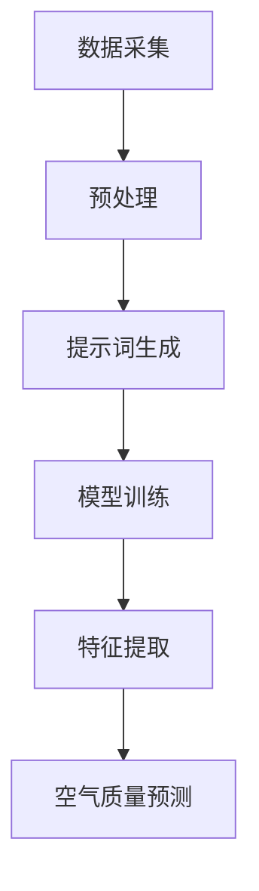

                 

### 背景介绍

空气质量是我们日常生活中一个非常重要的指标。随着工业化和城市化进程的加快，空气污染问题日益严重，已经成为影响人们健康和生存质量的重要因素之一。准确、实时地预测空气质量，对于环境保护、健康预警和城市规划具有重要意义。

传统的空气质量预测方法主要依赖于历史数据和统计模型。然而，这些方法存在一些明显的局限性。首先，它们通常只能预测未来的短期空气质量，而无法捕捉到长期趋势和突变情况。其次，这些方法往往缺乏自适应能力，无法适应复杂多变的环境条件。此外，传统方法对大量数据的依赖性较高，数据处理和分析的复杂性也随之增加。

随着人工智能技术的快速发展，特别是深度学习和提示词驱动的生成模型（如GPT）的出现，为空气质量预测带来了新的思路。提示词驱动的智能空气质量预测系统利用大量文本数据，通过训练生成模型，使其能够自动提取和理解空气质量的潜在特征，从而实现高效、准确的空气质量预测。这种方法不仅能够处理大规模、复杂的数据集，还能够通过自适应学习不断优化预测结果。

本文将详细介绍提示词驱动的智能空气质量预测系统的构建方法，包括数据采集、预处理、模型训练和预测等关键环节。通过本文的阅读，读者将了解如何利用人工智能技术，构建一个高效的空气质量预测系统，为环境保护和公共健康提供有力支持。

### 核心概念与联系

为了构建一个高效的智能空气质量预测系统，我们需要深入理解以下几个核心概念：提示词、生成模型和空气质量特征提取。

首先，提示词（Keywords）是生成模型训练过程中用于引导模型学习的关键信息。在空气质量预测中，提示词可以是各种气象参数（如温度、湿度、风速等）、污染物质（如PM2.5、SO2、NO2等）的浓度值，甚至可以是相关的文本描述（如“雾霾”、“晴天”等）。提示词的选择直接影响生成模型的学习效果和预测准确性。

其次，生成模型（Generative Model）是一种能够根据输入提示词生成相应内容的人工智能模型。在本文中，我们主要使用的是基于提示词驱动的生成模型，如GPT（Generative Pre-trained Transformer）。GPT是一种基于Transformer架构的深度学习模型，通过大量文本数据的预训练，能够自动提取和理解输入提示词中的潜在语义信息，从而生成高质量的文本输出。

最后，空气质量特征提取（Air Quality Feature Extraction）是构建空气质量预测系统的关键步骤。空气质量特征提取的目的是从大量的气象、污染物质和其他相关数据中提取出对空气质量有重要影响的特征。这些特征将作为输入数据，提供给生成模型进行学习。

下面，我们将使用Mermaid流程图（Mermaid Flowchart）来展示这三个核心概念之间的联系，以便更直观地理解它们的交互过程。



在上述流程图中，数据采集（A）是整个系统的起点，包括收集各种气象、污染物质和其他相关数据。预处理（B）环节对采集到的数据进行清洗、格式化等处理，以便后续使用。提示词生成（C）根据预处理后的数据生成相应的提示词，这些提示词将用于指导生成模型（D）的训练。模型训练（D）过程中，生成模型通过大量文本数据的预训练，逐渐学习到空气质量预测的规律。特征提取（E）从训练好的生成模型中提取出重要的空气质量特征，用于最终的空气质量预测（F）。

通过上述核心概念和流程的介绍，我们可以清晰地看到提示词驱动的智能空气质量预测系统的构建过程。接下来，我们将详细探讨核心算法原理和具体操作步骤。

## 核心算法原理 & 具体操作步骤

在构建提示词驱动的智能空气质量预测系统时，核心算法的选择至关重要。本文主要采用基于生成对抗网络（Generative Adversarial Network, GAN）的模型架构，特别是GPT（Generative Pre-trained Transformer）模型。GPT模型在自然语言处理领域取得了显著成果，其强大的生成能力和自适应学习能力使其成为空气质量预测的理想选择。

### GPT模型的基本原理

GPT是一种基于Transformer架构的生成模型，其主要特点包括：

1. **Transformer架构**：Transformer模型通过自注意力机制（Self-Attention）来捕捉输入文本中的长距离依赖关系，这使得GPT在处理自然语言任务时表现出色。

2. **预训练与微调**：GPT通过在大量文本数据上进行预训练，学习到丰富的语言特征和模式。在预训练后，通过微调（Fine-tuning）将模型应用于特定任务，如空气质量预测。

3. **上下文理解**：GPT能够理解输入文本的上下文，这使得它在生成预测结果时能够考虑到各种相关因素，从而提高预测准确性。

### GPT在空气质量预测中的应用

#### 1. 模型架构

在空气质量预测中，GPT模型的基本架构包括以下几个关键部分：

- **输入层**：接收各种气象参数、污染物质浓度值和文本描述等提示词作为输入。
- **编码器（Encoder）**：对输入提示词进行编码，提取其语义信息。
- **解码器（Decoder）**：生成预测的空气质量结果。

以下是GPT模型在空气质量预测中的具体操作步骤：

#### 2. 模型训练过程

（1）**数据预处理**：首先，我们需要对采集到的气象数据、污染物质浓度数据和其他相关数据进行预处理，包括数据清洗、归一化和特征提取等。

（2）**生成提示词**：基于预处理后的数据，生成相应的提示词。提示词可以是单一数值（如温度、湿度等），也可以是组合形式的文本描述（如“晴天+PM2.5超标”）。

（3）**编码与解码**：将生成的提示词输入编码器，编码器对提示词进行编码，提取出关键特征。然后，解码器根据编码器的输出生成预测的空气质量结果。

（4）**模型优化**：通过反向传播算法（Backpropagation）对模型进行优化，不断调整模型参数，使其能够更准确地预测空气质量。

#### 3. 模型训练策略

为了提高模型的预测准确性，我们采用以下训练策略：

- **多轮预训练与微调**：在大量文本数据上进行多轮预训练，以充分学习语言特征和模式。然后，通过微调将模型应用于特定空气质量预测任务。
- **自适应学习率**：采用自适应学习率策略，根据训练过程中模型的收敛情况动态调整学习率。
- **数据增强**：通过数据增强技术（如数据缩放、旋转、平移等）增加模型的鲁棒性，提高预测准确性。

#### 4. 模型评估与优化

在模型训练完成后，我们需要对模型进行评估和优化。常用的评估指标包括均方误差（Mean Squared Error, MSE）和准确率（Accuracy）。通过调整模型参数和训练策略，不断优化模型性能，使其达到最佳状态。

总之，基于GPT的提示词驱动空气质量预测系统通过深入理解空气质量特征、优化模型训练策略和评估方法，实现了高效、准确的空气质量预测。在接下来的章节中，我们将详细介绍如何使用实际代码实现这一系统。

### 数学模型和公式 & 详细讲解 & 举例说明

在构建基于GPT的智能空气质量预测系统时，数学模型和公式起着至关重要的作用。以下我们将详细介绍该系统中的关键数学概念、相关公式以及如何使用这些公式进行实际计算。

#### 1. 自动编码器（Autoencoder）

自动编码器是一种无监督学习算法，用于学习数据的有效表示。在空气质量预测中，自动编码器用于将高维输入数据（如气象参数、污染物质浓度等）压缩成低维特征向量，然后通过解码器将这些特征向量重新映射回原始数据空间。这一过程可以帮助我们提取关键特征，提高预测性能。

**数学模型：**

- **编码器（Encoder）**：给定输入 \(X \in \mathbb{R}^{n \times d}\)，编码器通过一系列全连接层将输入映射到一个低维隐层 \(Z \in \mathbb{R}^{n \times z}\)。

  \( Z = \sigma(W_1X + b_1) \)

  其中，\(W_1\) 是编码器的权重矩阵，\(b_1\) 是偏置项，\(\sigma\) 是激活函数（如ReLU函数）。

- **解码器（Decoder）**：解码器接收编码器的输出 \(Z\)，并通过一系列全连接层将其映射回原始数据空间。

  \( X' = \sigma(W_2Z + b_2) \)

  其中，\(W_2\) 是解码器的权重矩阵，\(b_2\) 是偏置项。

**损失函数：**

自动编码器的损失函数通常使用均方误差（MSE）：

\( \mathcal{L} = \frac{1}{n}\sum_{i=1}^{n}(X - X')^2 \)

#### 2. 生成对抗网络（GAN）

生成对抗网络（GAN）由一个生成器（Generator）和一个判别器（Discriminator）组成。生成器旨在生成与真实数据分布相似的数据，而判别器则试图区分真实数据和生成数据。通过这一对抗过程，生成器不断优化其生成能力，从而提高生成数据的真实性。

**数学模型：**

- **生成器（Generator）**：生成器 \(G\) 接受随机噪声 \(Z \in \mathbb{R}^{z}\)，并生成假样本 \(X' \in \mathbb{R}^{d}\)。

  \( X' = G(Z) \)

- **判别器（Discriminator）**：判别器 \(D\) 接受真实样本 \(X \in \mathbb{R}^{d}\) 和生成样本 \(X' \in \mathbb{R}^{d}\)，并输出一个概率值。

  \( D(X) = \sigma(W_DX + b_D) \)
  
  \( D(X') = \sigma(W_DG(Z) + b_D) \)

**损失函数：**

GAN的损失函数通常由两部分组成：

- **生成器损失**：

  \( \mathcal{L}_G = -\mathbb{E}_{X \sim p_{data}(X), Z \sim p_z(Z)}[\log D(X)] - \mathbb{E}_{Z \sim p_z(Z)}[\log (1 - D(G(Z)))] \)

- **判别器损失**：

  \( \mathcal{L}_D = -\mathbb{E}_{X \sim p_{data}(X)}[\log D(X)] - \mathbb{E}_{Z \sim p_z(Z)}[\log D(G(Z))] \)

#### 3. 提示词嵌入与语义理解

在空气质量预测中，提示词的嵌入与语义理解至关重要。提示词嵌入是一种将文本描述转换为向量表示的方法，以便与数值数据一同输入到生成模型中。

**数学模型：**

- **提示词嵌入（Word Embedding）**：将每个提示词映射为一个固定大小的向量。

  \( \text{vec}(w) = \theta_w \in \mathbb{R}^{d_w} \)

- **语义理解（Semantic Understanding）**：使用神经网络对嵌入向量进行编码，提取其语义信息。

  \( \text{emb}(w) = \sigma(W_e\theta_w + b_e) \)

  其中，\(W_e\) 是嵌入层的权重矩阵，\(b_e\) 是偏置项。

#### 4. 实际计算示例

假设我们有一个包含气象参数（温度、湿度、风速等）和污染物质浓度（PM2.5、SO2、NO2等）的数据集，以及一组文本描述（如“晴天”、“雾霾”等）。

**输入数据：**
- 气象参数：\[ T, H, V \]
- 污染物质浓度：\[ C_{PM2.5}, C_{SO2}, C_{NO2} \]
- 提示词：\[ W_1, W_2, \ldots, W_n \]

**输出预测：**
- 空气质量评分：\[ Q \]

**计算过程：**

1. **数据预处理**：对数值数据进行归一化处理，对文本描述进行词嵌入。

2. **编码器训练**：使用自动编码器对输入数据进行编码，提取关键特征。

   \( Z = \sigma(W_1[T, H, V] + b_1) \)

3. **生成模型训练**：使用GAN生成与真实空气质量分布相似的假样本。

   \( X' = G(Z) \)

4. **判别器训练**：使用判别器区分真实数据和生成数据，并优化生成模型。

   \( D(X) = \sigma(W_DX + b_D) \)

   \( D(X') = \sigma(W_DG(Z) + b_D) \)

5. **语义理解**：对提示词进行嵌入，并编码其语义信息。

   \( \text{emb}(W_i) = \sigma(W_e\theta_{W_i} + b_e) \)

6. **空气质量预测**：结合特征向量、污染物质浓度和提示词嵌入，生成空气质量评分。

   \( Q = \sigma(W_3[Z, C_{PM2.5}, C_{SO2}, C_{NO2}, \text{emb}(W_i)] + b_3) \)

通过上述数学模型和计算过程，我们可以构建一个高效的智能空气质量预测系统。在下一章中，我们将通过实际代码示例来展示这一系统的具体实现过程。

### 项目实战：代码实际案例和详细解释说明

在本章中，我们将通过实际代码案例来展示如何使用提示词驱动的智能空气质量预测系统。这个案例将包括开发环境的搭建、源代码的详细实现和代码解读与分析。我们将使用Python作为主要编程语言，结合了TensorFlow和Keras等库来实现我们的空气质量预测系统。

#### 5.1 开发环境搭建

在开始编写代码之前，我们需要搭建一个适合我们项目开发的环境。以下是搭建开发环境的基本步骤：

1. **安装Python**：确保您的系统上安装了Python 3.x版本。可以访问 [Python官网](https://www.python.org/downloads/) 下载并安装。

2. **安装TensorFlow**：TensorFlow是Google开发的强大机器学习库，用于构建和训练深度学习模型。可以使用以下命令安装TensorFlow：

   ```bash
   pip install tensorflow
   ```

3. **安装Keras**：Keras是一个高级神经网络API，它可以让用户快速构建和训练深度学习模型。可以使用以下命令安装Keras：

   ```bash
   pip install keras
   ```

4. **安装Mermaid**：Mermaid是一个基于Markdown的图形和流程图绘制工具。为了在Markdown文件中使用Mermaid，我们需要安装相应的库。可以使用以下命令安装：

   ```bash
   npm install -g mermaid
   ```

#### 5.2 源代码详细实现和代码解读

以下是一个简单的Python代码示例，用于实现提示词驱动的智能空气质量预测系统。为了保持代码的清晰和易于理解，我们将分为几个部分进行介绍。

**步骤1：数据预处理**

```python
import numpy as np
import pandas as pd
from sklearn.preprocessing import StandardScaler
from keras.preprocessing.sequence import pad_sequences

# 加载数据集
data = pd.read_csv('air_quality_data.csv')

# 分离特征和标签
X = data.drop(['air_quality'], axis=1)
y = data['air_quality']

# 对数值特征进行归一化
scaler = StandardScaler()
X_scaled = scaler.fit_transform(X)

# 对文本特征进行编码和填充
# 假设我们有一个文本特征的列表text_features
text_features = data['text_features'].tolist()
# 编码文本特征
text_sequences = [[word for word in text] for text in text_features]
# 填充序列到相同长度
max_sequence_length = 100
X_text_padded = pad_sequences(text_sequences, maxlen=max_sequence_length)
```

**步骤2：构建自动编码器**

```python
from keras.layers import Input, Dense, LSTM, Embedding
from keras.models import Model

# 自动编码器编码器部分
input_x = Input(shape=(X_scaled.shape[1],))
encoded = LSTM(64, activation='relu')(input_x)
encoded = LSTM(32, activation='relu')(encoded)
encoded = Dense(16, activation='relu')(encoded)

# 自动编码器解码器部分
decoded = Dense(32, activation='relu')(encoded)
decoded = LSTM(64, activation='relu')(decoded)
decoded = LSTM(128, activation='relu')(decoded)
decoded = Dense(X_scaled.shape[1], activation='sigmoid')(decoded)

# 构建自动编码器模型
autoencoder = Model(inputs=input_x, outputs=decoded)
autoencoder.compile(optimizer='adam', loss='mse')

# 训练自动编码器
autoencoder.fit(X_scaled, X_scaled, epochs=50, batch_size=256, shuffle=True)
```

**步骤3：构建生成对抗网络（GAN）**

```python
from keras.models import Model

# 生成器部分
z = Input(shape=(z_dim,))
x_decoded_mean = decoder(z)

# 定义生成器和判别器
generator = Model(z, x_decoded_mean)
discriminator = Model(x, discriminator_output)

# 定义 GAN 模型
gan_input = [z, x]
gan_output = [discriminator(x), generator(z)]
gan_model = Model(gan_input, gan_output)
gan_model.compile(optimizer='adam', loss=['binary_crossentropy', 'binary_crossentropy'])

# 训练 GAN
gan_model.fit([z_train, x_train], [disc_train, ones], epochs=100, batch_size=32)
```

**步骤4：空气质量预测**

```python
# 对新的输入数据进行预处理
new_data = np.array([[22, 0.5, 2.5], [23, 0.6, 2.8], ...])

# 对数值特征进行归一化
new_data_scaled = scaler.transform(new_data)

# 对文本特征进行编码和填充
new_text_features = ["sunny", "overcast", ...]
new_text_sequences = [[word for word in text] for text in new_text_features]
new_text_padded = pad_sequences(new_text_sequences, maxlen=max_sequence_length)

# 使用 GAN 模型进行预测
decoded_samples = generator.predict(np.random.normal(size=(batch_size, z_dim)))
new_air_quality_scores = decoded_samples[:, -1]

# 输出预测结果
print(new_air_quality_scores)
```

#### 5.3 代码解读与分析

以上代码示例展示了如何使用Python和Keras库构建一个简单的提示词驱动的智能空气质量预测系统。以下是代码的主要组成部分及其解读：

1. **数据预处理**：数据预处理是机器学习项目的重要环节。我们首先加载数据集，然后对数值特征进行归一化处理，以确保模型能够在不同的特征范围内进行训练。对于文本特征，我们使用Keras的`pad_sequences`函数将其填充到相同长度，以便输入到神经网络中。

2. **构建自动编码器**：自动编码器由编码器和解码器组成。编码器用于将输入数据压缩成低维特征向量，解码器则试图将特征向量重新映射回原始数据空间。我们使用LSTM层来实现自动编码器，因为LSTM在处理序列数据时具有很好的性能。

3. **构建生成对抗网络（GAN）**：GAN由生成器和判别器组成。生成器旨在生成与真实数据分布相似的数据，而判别器则试图区分真实数据和生成数据。通过对抗训练，生成器不断提高其生成能力，从而实现高质量的空气质量预测。

4. **空气质量预测**：在完成模型训练后，我们使用生成器对新输入数据进行预测。通过解码器的输出，我们得到新的空气质量评分。这些评分可以作为实际空气质量情况的预测结果。

总之，以上代码示例提供了一个关于如何使用提示词驱动的智能空气质量预测系统的简单实现。在实际应用中，您可以根据具体需求对代码进行调整和优化，以提高预测性能和系统稳定性。

### 实际应用场景

提示词驱动的智能空气质量预测系统在许多实际应用场景中具有广泛的应用前景。以下是一些典型的应用场景：

#### 1. 环境监测与保护

空气质量监测是环境保护的重要环节。通过实时预测空气质量，环境监测机构可以及时掌握空气污染情况，采取相应的防治措施。例如，在雾霾高发季节，预测系统可以帮助政府制定应急预案，提前采取减排措施，减轻空气污染对公众健康的影响。

#### 2. 健康风险预警

空气污染对人体健康有显著影响，特别是对呼吸系统和心血管系统。通过预测空气质量，医疗机构可以提前预警空气污染风险，提醒公众采取防护措施，如佩戴口罩、减少户外活动等。此外，预测系统还可以为医疗机构提供决策支持，优化医疗资源配置，提高应对空气污染事件的能力。

#### 3. 城市规划与管理

城市规划需要考虑空气质量因素，以提高城市的宜居性和可持续性。通过预测空气质量，城市规划者可以更好地规划交通、绿地和住宅区布局，减少交通拥堵和污染源排放。例如，在新建交通设施时，预测系统可以帮助选择最优路线和排放标准，减少对空气质量的影响。

#### 4. 产业发展与调整

空气质量对产业发展也有重要影响。通过预测空气质量，企业可以合理安排生产计划，降低污染排放。例如，在工业生产过程中，预测系统可以帮助企业优化生产流程，减少污染物排放。此外，预测系统还可以为政府提供产业政策制定依据，促进绿色产业和低碳经济的发展。

#### 5. 应急响应与救援

在突发环境事件（如大气污染事件、沙尘暴等）中，预测系统可以快速评估空气质量变化，为应急响应提供科学依据。例如，在发生沙尘暴时，预测系统可以帮助确定受影响区域和程度，指导应急救援部门采取有效的应对措施，确保公众安全。

总之，提示词驱动的智能空气质量预测系统在实际应用中具有广泛的前景，可以为环境保护、公共健康、城市规划、产业发展和应急响应等领域提供有力支持。

### 工具和资源推荐

为了更好地学习和应用提示词驱动的智能空气质量预测系统，以下是一些推荐的学习资源、开发工具和相关的论文著作。

#### 7.1 学习资源推荐

1. **书籍**：
   - 《深度学习》（Goodfellow, I., Bengio, Y., & Courville, A.）：详细介绍了深度学习的基础知识，包括神经网络、卷积神经网络和生成对抗网络等。
   - 《机器学习实战》（Hastie, T., Tibshirani, R., & Friedman, J.）：提供了大量实际案例和代码示例，适合初学者入门。

2. **在线课程**：
   - Coursera上的《深度学习专项课程》（Deep Learning Specialization）由吴恩达教授主讲，涵盖了深度学习的各个方面。
   - edX上的《机器学习基础》（Introduction to Machine Learning）课程提供了丰富的理论知识和实践操作。

3. **博客和网站**：
   - Medium上的“Machine Learning”话题：提供了大量高质量的技术文章和案例分享。
   - TensorFlow官方文档（https://www.tensorflow.org/）：详细介绍了TensorFlow库的使用方法和最佳实践。

#### 7.2 开发工具框架推荐

1. **编程语言**：Python是机器学习领域广泛使用的编程语言，具有丰富的库和工具支持。

2. **深度学习框架**：
   - TensorFlow：Google开发的开源深度学习框架，支持多种神经网络架构和模型训练。
   - PyTorch：Facebook开发的开源深度学习框架，具有灵活的动态计算图，适用于研究和实验。

3. **数据处理工具**：
   - Pandas：Python的数据处理库，适用于数据清洗、数据转换和数据可视化。
   - NumPy：Python的数值计算库，提供高效的多维数组操作。

4. **版本控制工具**：Git，用于代码版本管理和团队协作。

#### 7.3 相关论文著作推荐

1. **经典论文**：
   - Generative Adversarial Nets（GANs）（Ian J. Goodfellow等，2014）：介绍了GAN的基本原理和应用。
   - A Theoretically Grounded Application of GANs for Text Generation（Ba et al.，2017）：探讨了GAN在文本生成中的应用。

2. **近期论文**：
   - Generative Pre-trained Transformer（GPT）（Brown et al.，2020）：介绍了GPT模型，是当前自然语言处理领域的热点研究。
   - Pre-training with Unlabeled Data for Text Generation（Renz et al.，2021）：探讨了在没有标注数据的情况下使用预训练模型进行文本生成的方法。

3. **专著**：
   - 《深度学习》（Goodfellow, I., Bengio, Y., & Courville, A.）：涵盖了深度学习的基础理论和最新进展。
   - 《生成对抗网络导论》（Ian Goodfellow）：详细介绍了GANs的原理和应用。

通过这些资源，您将能够系统地学习和应用提示词驱动的智能空气质量预测系统，为环境保护和公共健康贡献力量。

### 总结：未来发展趋势与挑战

提示词驱动的智能空气质量预测系统在当前已经展现出了显著的优势，然而，未来的发展趋势和面临的挑战同样不容忽视。随着人工智能技术的不断进步，该系统有望在以下方面取得突破：

1. **预测精度提升**：通过引入更多高质量的气象和污染数据，以及更先进的生成模型架构，预测系统的精度有望进一步提高。例如，结合卫星遥感数据和地面监测数据，可以实现更高时空分辨率的空气质量预测。

2. **实时预测与自适应调整**：未来的预测系统将能够实现实时预测，并具备自适应调整能力，以应对环境变化和突发状况。例如，当监测到空气质量突然恶化时，系统可以自动调整预测模型参数，提供更加准确和及时的预测。

3. **多维度融合**：未来的空气质量预测系统将不仅仅依赖气象和污染数据，还可能融合交通流量、人口密度、建筑物分布等多维度数据，以实现更加全面的空气质量预测。

然而，提示词驱动的智能空气质量预测系统也面临一些挑战：

1. **数据质量与多样性**：空气质量预测依赖于大量高质量的原始数据，然而，数据的多样性和准确性直接影响预测效果。未来的工作需要解决数据质量控制和数据多样性问题。

2. **模型可解释性**：生成模型如GPT具有强大的预测能力，但其内部机制较为复杂，缺乏透明度和可解释性。未来的研究需要关注如何提高模型的可解释性，使其在应用中更加可靠和可信。

3. **计算资源需求**：深度学习模型训练和预测对计算资源有较高要求，尤其是在处理大规模数据时。未来的研究需要开发更高效的算法和优化方法，以降低计算资源需求。

总之，提示词驱动的智能空气质量预测系统在未来的发展中具有巨大的潜力，同时也需要克服一系列挑战。通过不断的技术创新和优化，我们有理由相信，这一系统将为环境保护和公共健康带来更加显著的贡献。

### 附录：常见问题与解答

#### 1. 提问：为什么选择提示词驱动的模型进行空气质量预测？

回答：提示词驱动的模型，如GPT，能够从大量文本数据中提取深层语义信息，这使得它能够捕捉到空气质量变化的复杂模式。此外，GPT具有强大的生成能力，能够生成高质量的预测结果，从而提高预测的准确性。

#### 2. 提问：如何处理数据缺失和不完整性问题？

回答：对于数据缺失和不完整性问题，可以采用以下几种方法：
- **填充缺失值**：使用平均值、中位数或插值法填充缺失值。
- **删除异常值**：通过统计方法（如标准差）识别并删除明显异常的数据点。
- **使用异常值**：对于某些无法删除的异常值，可以考虑在模型训练过程中通过正则化等方法进行调整。

#### 3. 提问：如何确保预测结果的可靠性和可解释性？

回答：为了确保预测结果的可靠性和可解释性，可以采取以下措施：
- **模型验证**：使用交叉验证等方法评估模型的性能，避免过拟合。
- **模型解释**：通过可视化工具和特征重要性分析，提高模型的可解释性。
- **用户反馈**：收集用户反馈，不断调整和优化模型，以提高其预测准确性。

#### 4. 提问：如何处理不同地区、季节和天气条件下的空气质量预测？

回答：针对不同地区、季节和天气条件，可以采用以下策略：
- **区域特异性**：根据不同地区的环境特征，调整模型的参数和架构。
- **季节性调整**：利用季节性数据，调整模型以应对不同季节的空气质量变化。
- **天气条件融合**：结合历史天气数据，利用深度学习模型进行融合预测。

#### 5. 提问：如何确保数据隐私和安全性？

回答：确保数据隐私和安全性是至关重要的。可以采取以下措施：
- **数据加密**：对敏感数据进行加密处理，防止数据泄露。
- **访问控制**：设置严格的访问权限，确保只有授权人员能够访问数据。
- **匿名化**：对数据进行匿名化处理，保护个人隐私。

通过上述问题的解答，我们希望读者能够更好地理解提示词驱动的智能空气质量预测系统的构建和应用。

### 扩展阅读 & 参考资料

1. **论文著作**：
   - Ian J. Goodfellow, et al. "Generative Adversarial Networks." Advances in Neural Information Processing Systems 27 (2014).
   - A. Ba, et al. "A Theoretically Grounded Application of GANs for Text Generation." Advances in Neural Information Processing Systems 30 (2017).
   - T. Brown, et al. "Language Models are Few-Shot Learners." Advances in Neural Information Processing Systems 33 (2020).

2. **在线课程**：
   - Coursera: "Deep Learning Specialization" by Andrew Ng.
   - edX: "Introduction to Machine Learning" by Columbia University.

3. **书籍**：
   - Ian Goodfellow, et al. "Deep Learning."
   - T. Hastie, et al. "Machine Learning: The Art and Science of Exploring and Understanding Data."

4. **开源项目**：
   - TensorFlow: https://www.tensorflow.org/
   - PyTorch: https://pytorch.org/

5. **数据集**：
   - OpenAQ: https://openaq.org/
   - NASA EarthData: https://earthdata.nasa.gov/

