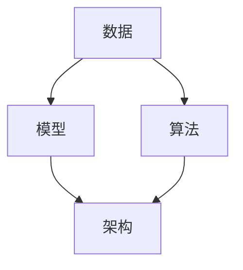

                 

# AI编程的新思维与新方向

## 关键词
- AI编程
- 新思维
- 新方向
- 人工智能技术
- 算法
- 软件工程
- 编程范式

## 摘要

本文旨在探讨AI编程的新思维与新方向。我们将首先回顾AI编程的背景，随后深入探讨当前的核心概念与联系，并分析核心算法原理及具体操作步骤。在此基础上，我们将引入数学模型和公式，并通过实际项目案例进行代码实际案例和详细解释说明。最后，我们将探讨AI编程在实际应用场景中的表现，推荐相关学习资源和开发工具框架，并总结未来发展趋势与挑战。

## 1. 背景介绍

人工智能（AI）作为计算机科学的一个分支，自20世纪50年代起便不断取得突破性进展。AI编程，即使用编程语言实现AI算法和模型的过程，正逐渐成为软件开发领域的重要组成部分。随着深度学习、神经网络、自然语言处理等技术的快速发展，AI编程的重要性日益凸显。

在传统编程中，程序员通常关注的是逻辑、算法和数据结构。然而，在AI编程中，我们更加关注数据、模型和算法之间的交互。AI编程不仅仅是编写代码，更是一个涉及数据预处理、模型设计、训练和优化的系统工程。

AI编程的背景可以追溯到机器学习的发展历程。机器学习是AI的核心技术之一，通过训练算法使计算机从数据中学习规律并做出决策。随着大数据时代的到来，机器学习算法在图像识别、语音识别、推荐系统等应用场景中取得了显著成果。

近年来，深度学习技术的兴起进一步推动了AI编程的发展。深度学习是一种基于多层神经网络的机器学习算法，能够在大规模数据集上自动学习复杂特征和模式。深度学习的成功使得AI编程变得更加高效和灵活，为程序员提供了新的思维方式和工具。

## 2. 核心概念与联系

在AI编程中，核心概念与联系主要包括数据、模型、算法和架构。为了更好地理解这些概念，我们可以借助Mermaid流程图来展示它们之间的关系。



### 2.1 数据

数据是AI编程的基础，没有数据就没有机器学习。在AI编程中，数据可以分为结构化数据、半结构化数据和非结构化数据。结构化数据通常存储在数据库中，如关系型数据库（如MySQL）或键值存储（如Redis）。半结构化数据通常以JSON、XML等格式表示，如日志文件、配置文件等。非结构化数据则包括文本、图像、音频和视频等。

### 2.2 模型

模型是AI编程的核心，用于表示数据中的规律和模式。常见的模型有神经网络、决策树、支持向量机等。神经网络是深度学习的基础，通过多层神经元进行特征提取和分类。决策树则是一种基于树形结构的分类算法，通过划分特征空间来构建决策路径。支持向量机则是一种基于间隔最大化的分类算法，通过寻找最优超平面来实现分类。

### 2.3 算法

算法是实现模型的核心手段，用于训练和优化模型。在AI编程中，常见的算法包括梯度下降、反向传播、K近邻等。梯度下降是一种优化算法，用于最小化损失函数。反向传播是一种计算梯度的方法，常用于神经网络训练。K近邻则是一种基于实例的学习算法，通过寻找最近的训练样本来预测新样本的类别。

### 2.4 架构

架构是AI编程的整体框架，用于组织和管理数据、模型和算法。在AI编程中，常见的架构有分布式计算、云计算和边缘计算等。分布式计算通过将任务分解为多个子任务，在多台计算机上并行执行，提高计算效率。云计算则提供了弹性的计算资源，可以根据需求动态扩展或缩减。边缘计算则将计算任务下沉到网络边缘，降低延迟和带宽消耗。

## 3. 核心算法原理 & 具体操作步骤

在AI编程中，核心算法原理是理解和实现模型的关键。以下我们将以深度学习中的卷积神经网络（CNN）为例，介绍其核心算法原理及具体操作步骤。

### 3.1 卷积神经网络（CNN）

卷积神经网络是一种专门用于处理图像数据的深度学习模型。它通过卷积操作提取图像中的特征，并在多层网络中逐步构建复杂特征表示。

#### 3.1.1 卷积操作

卷积操作是一种将滤波器（或卷积核）应用于图像的过程。滤波器是一个固定大小的矩阵，用于提取图像中的局部特征。卷积操作可以通过以下公式表示：

$$
\text{output}_{ij} = \sum_{k=1}^{n} \text{weight}_{ik,jk} \cdot \text{input}_{ij}
$$

其中，$\text{output}_{ij}$表示输出特征图上的一个像素点，$\text{weight}_{ik,jk}$表示卷积核上的一个元素，$\text{input}_{ij}$表示输入图像上的一个像素点。

#### 3.1.2 池化操作

池化操作是对卷积操作后的特征图进行下采样，以减少特征图的尺寸并降低模型的参数数量。常见的池化操作有最大池化和平均池化。最大池化选择每个局部区域内的最大值作为输出，而平均池化则计算每个局部区域内的平均值。

#### 3.1.3 激活函数

激活函数用于引入非线性因素，使神经网络能够学习复杂函数。常见的激活函数有ReLU（Rectified Linear Unit）、Sigmoid和Tanh。ReLU函数在输入为负值时输出为零，有助于缓解梯度消失问题。

### 3.2 具体操作步骤

以下是使用卷积神经网络进行图像分类的步骤：

1. **数据预处理**：读取图像数据，并进行归一化、去噪等预处理操作。

2. **卷积操作**：使用卷积核对图像进行卷积操作，提取图像特征。

3. **池化操作**：对卷积后的特征图进行池化操作，降低特征图的尺寸。

4. **全连接层**：将池化后的特征图进行展平，输入到全连接层进行分类。

5. **激活函数**：在输出层使用激活函数，如softmax函数，将输出转化为概率分布。

6. **损失函数**：计算模型预测结果与实际标签之间的损失，如交叉熵损失。

7. **反向传播**：使用反向传播算法计算梯度，更新模型参数。

8. **迭代训练**：重复上述步骤，直至满足停止条件，如达到预设的迭代次数或损失值收敛。

## 4. 数学模型和公式 & 详细讲解 & 举例说明

在AI编程中，数学模型和公式是理解和实现算法的基础。以下我们将介绍深度学习中的前向传播和反向传播算法，并使用具体的数学公式和示例进行详细讲解。

### 4.1 前向传播

前向传播是指将输入数据通过神经网络逐步传递，直至输出层的计算过程。以下是前向传播的数学模型和步骤：

#### 4.1.1 前向传播公式

假设神经网络包含一个输入层、多个隐藏层和一个输出层。设输入为$\textbf{x}$，输出为$\textbf{y}$，权重矩阵为$\textbf{W}$，激活函数为$f$。则前向传播的公式如下：

$$
\textbf{z}_l = \textbf{W}_l \cdot \textbf{a}_{l-1} + b_l
$$

$$
\textbf{a}_l = f(\textbf{z}_l)
$$

其中，$\textbf{z}_l$表示第$l$层的中间值，$\textbf{a}_l$表示第$l$层的输出值，$\textbf{W}_l$表示第$l$层的权重矩阵，$b_l$表示第$l$层的偏置。

#### 4.1.2 示例

考虑一个简单的神经网络，包含一个输入层、一个隐藏层和一个输出层。输入为$\textbf{x} = [1, 2, 3]$，权重矩阵为$\textbf{W}_1 = \begin{bmatrix} 1 & 2 \\ 3 & 4 \end{bmatrix}$，偏置为$b_1 = [1, 2]$。激活函数为ReLU。

1. **输入层到隐藏层**：

$$
\textbf{z}_1 = \textbf{W}_1 \cdot \textbf{x} + b_1 = \begin{bmatrix} 1 & 2 \\ 3 & 4 \end{bmatrix} \cdot \begin{bmatrix} 1 \\ 2 \\ 3 \end{bmatrix} + \begin{bmatrix} 1 \\ 2 \end{bmatrix} = \begin{bmatrix} 10 \\ 19 \end{bmatrix}
$$

$$
\textbf{a}_1 = f(\textbf{z}_1) = \begin{bmatrix} \max(10, 0) \\ \max(19, 0) \end{bmatrix} = \begin{bmatrix} 10 \\ 19 \end{bmatrix}
$$

2. **隐藏层到输出层**：

$$
\textbf{z}_2 = \textbf{W}_2 \cdot \textbf{a}_1 + b_2
$$

$$
\textbf{a}_2 = f(\textbf{z}_2)
$$

假设$\textbf{W}_2 = \begin{bmatrix} 5 & 6 \\ 7 & 8 \end{bmatrix}$，$b_2 = [3, 4]$，则：

$$
\textbf{z}_2 = \textbf{W}_2 \cdot \textbf{a}_1 + b_2 = \begin{bmatrix} 5 & 6 \\ 7 & 8 \end{bmatrix} \cdot \begin{bmatrix} 10 \\ 19 \end{bmatrix} + \begin{bmatrix} 3 \\ 4 \end{bmatrix} = \begin{bmatrix} 137 \\ 214 \end{bmatrix}
$$

$$
\textbf{a}_2 = f(\textbf{z}_2) = \begin{bmatrix} \max(137, 0) \\ \max(214, 0) \end{bmatrix} = \begin{bmatrix} 137 \\ 214 \end{bmatrix}
$$

最终输出$\textbf{y} = \textbf{a}_2$。

### 4.2 反向传播

反向传播是指根据输出层误差，反向计算各层的梯度，并更新模型参数的过程。以下是反向传播的数学模型和步骤：

#### 4.2.1 反向传播公式

设损失函数为$J$，梯度为$\textbf{g}$，则反向传播的公式如下：

$$
\textbf{g}_l = \frac{\partial J}{\partial \textbf{a}_l}
$$

$$
\textbf{g}_{l-1} = \frac{\partial J}{\partial \textbf{a}_{l-1}} = \textbf{W}_l^T \cdot \textbf{g}_l
$$

其中，$\textbf{g}_l$表示第$l$层的梯度，$\textbf{g}_{l-1}$表示第$l-1$层的梯度。

#### 4.2.2 示例

考虑上一个示例中的神经网络，假设输出层的损失函数为均方误差（MSE），即$J = \frac{1}{2} \sum_{i=1}^{n} (\textbf{y}_i - \textbf{a}_2)^2$。

1. **计算输出层梯度**：

$$
\textbf{g}_2 = \frac{\partial J}{\partial \textbf{a}_2} = \begin{bmatrix} \frac{\partial J}{\partial a_{21}} \\ \frac{\partial J}{\partial a_{22}} \end{bmatrix} = \begin{bmatrix} -2(a_{21} - y_1) \\ -2(a_{22} - y_2) \end{bmatrix}
$$

其中，$y_1$和$y_2$分别为实际标签和预测结果。

2. **计算隐藏层梯度**：

$$
\textbf{g}_1 = \textbf{W}_2^T \cdot \textbf{g}_2 = \begin{bmatrix} 5 & 6 \\ 7 & 8 \end{bmatrix}^T \cdot \begin{bmatrix} -2(a_{21} - y_1) \\ -2(a_{22} - y_2) \end{bmatrix} = \begin{bmatrix} -10(a_{21} - y_1) - 12(a_{22} - y_2) \\ -14(a_{21} - y_1) - 16(a_{22} - y_2) \end{bmatrix}
$$

3. **更新模型参数**：

根据梯度下降算法，更新模型参数的公式如下：

$$
\textbf{W}_l = \textbf{W}_l - \alpha \cdot \textbf{g}_l
$$

$$
b_l = b_l - \alpha \cdot \textbf{g}_l
$$

其中，$\alpha$为学习率。

通过迭代更新模型参数，可以逐步减小损失函数，提高模型的预测性能。

## 5. 项目实战：代码实际案例和详细解释说明

在本节中，我们将通过一个简单的示例项目来演示AI编程的实际应用。该项目将使用TensorFlow框架实现一个基于卷积神经网络的图像分类器。

### 5.1 开发环境搭建

1. 安装Python环境：确保已安装Python 3.x版本。
2. 安装TensorFlow：使用pip命令安装TensorFlow：

   ```
   pip install tensorflow
   ```

3. 安装其他依赖：根据项目需求，安装其他必要的库，如NumPy、PIL等。

### 5.2 源代码详细实现和代码解读

以下是一个简单的图像分类器的实现代码：

```python
import tensorflow as tf
from tensorflow.keras import layers
import numpy as np
from PIL import Image

# 加载数据集
(x_train, y_train), (x_test, y_test) = tf.keras.datasets.mnist.load_data()

# 数据预处理
x_train = x_train.astype("float32") / 255.0
x_test = x_test.astype("float32") / 255.0

# 构建模型
model = tf.keras.Sequential([
    layers.Conv2D(32, (3, 3), activation='relu', input_shape=(28, 28, 1)),
    layers.MaxPooling2D((2, 2)),
    layers.Conv2D(64, (3, 3), activation='relu'),
    layers.MaxPooling2D((2, 2)),
    layers.Flatten(),
    layers.Dense(64, activation='relu'),
    layers.Dense(10, activation='softmax')
])

# 编译模型
model.compile(optimizer='adam',
              loss='sparse_categorical_crossentropy',
              metrics=['accuracy'])

# 训练模型
model.fit(x_train, y_train, epochs=5)

# 评估模型
test_loss, test_acc = model.evaluate(x_test, y_test)
print(f"Test accuracy: {test_acc}")

# 预测
predictions = model.predict(x_test)
predicted_classes = np.argmax(predictions, axis=1)

# 显示预测结果
for i in range(10):
    img = Image.fromarray(np.uint8(x_test[i] * 255))
    img.show()
    print(f"Predicted class: {predicted_classes[i]}, True class: {y_test[i]}")
```

#### 5.2.1 代码解读

1. **数据加载与预处理**：
   - 加载MNIST数据集，并进行归一化处理。

2. **模型构建**：
   - 使用TensorFlow的`Sequential`模型，添加卷积层、池化层、全连接层等。

3. **模型编译**：
   - 选择优化器、损失函数和评估指标。

4. **模型训练**：
   - 使用`fit`方法进行模型训练。

5. **模型评估**：
   - 使用`evaluate`方法评估模型在测试集上的性能。

6. **预测与显示**：
   - 使用`predict`方法进行预测，并显示预测结果和真实标签。

### 5.3 代码解读与分析

以上代码实现了一个简单的基于卷积神经网络的MNIST手写数字分类器。以下是代码的关键部分及其解读：

1. **数据预处理**：
   ```python
   x_train = x_train.astype("float32") / 255.0
   x_test = x_test.astype("float32") / 255.0
   ```
   - 将图像数据归一化到[0, 1]范围内。

2. **模型构建**：
   ```python
   model = tf.keras.Sequential([
       layers.Conv2D(32, (3, 3), activation='relu', input_shape=(28, 28, 1)),
       layers.MaxPooling2D((2, 2)),
       layers.Conv2D(64, (3, 3), activation='relu'),
       layers.MaxPooling2D((2, 2)),
       layers.Flatten(),
       layers.Dense(64, activation='relu'),
       layers.Dense(10, activation='softmax')
   ])
   ```
   - 添加卷积层、池化层和全连接层，构建卷积神经网络。

3. **模型编译**：
   ```python
   model.compile(optimizer='adam',
                 loss='sparse_categorical_crossentropy',
                 metrics=['accuracy'])
   ```
   - 选择优化器、损失函数和评估指标。

4. **模型训练**：
   ```python
   model.fit(x_train, y_train, epochs=5)
   ```
   - 使用`fit`方法进行模型训练。

5. **模型评估**：
   ```python
   test_loss, test_acc = model.evaluate(x_test, y_test)
   print(f"Test accuracy: {test_acc}")
   ```
   - 评估模型在测试集上的性能。

6. **预测与显示**：
   ```python
   predictions = model.predict(x_test)
   predicted_classes = np.argmax(predictions, axis=1)
   for i in range(10):
       img = Image.fromarray(np.uint8(x_test[i] * 255))
       img.show()
       print(f"Predicted class: {predicted_classes[i]}, True class: {y_test[i]}")
   ```
   - 进行预测，并显示预测结果和真实标签。

通过以上步骤，我们实现了使用卷积神经网络进行图像分类的简单示例。实际项目中，可以根据需求调整模型结构、优化参数，以提高模型性能。

## 6. 实际应用场景

AI编程在实际应用场景中具有广泛的应用，以下列举几个常见的应用领域：

### 6.1 图像识别

图像识别是AI编程的一个重要应用领域。通过卷积神经网络等深度学习模型，计算机可以自动识别和分类图像中的物体、场景和动作。常见的应用包括人脸识别、车牌识别、医疗影像诊断等。

### 6.2 语音识别

语音识别是将语音信号转换为文本的技术。通过深度学习和自然语言处理技术，计算机可以自动识别和理解人类语音。常见的应用包括智能语音助手、语音搜索、语音翻译等。

### 6.3 自动驾驶

自动驾驶是AI编程在交通运输领域的应用。通过计算机视觉、深度学习和传感器技术，自动驾驶系统可以实时感知路况、预测车辆行为，并做出相应的决策。常见的应用包括无人驾驶汽车、无人机、智能交通系统等。

### 6.4 推荐系统

推荐系统是AI编程在电子商务和社交媒体领域的应用。通过机器学习和数据挖掘技术，推荐系统可以根据用户的兴趣和行为，自动推荐相关的商品、内容或服务。常见的应用包括在线购物网站、社交媒体平台、视频流媒体等。

### 6.5 金融风控

金融风控是AI编程在金融领域的应用。通过深度学习和大数据分析技术，金融风控系统可以实时监控金融市场的风险，识别潜在的欺诈行为，并提供预警和防控措施。常见的应用包括信用卡欺诈检测、股票市场预测、信用评级等。

### 6.6 医疗健康

医疗健康是AI编程在医疗领域的应用。通过深度学习和自然语言处理技术，AI系统可以辅助医生进行疾病诊断、药物研发、健康管理等。常见的应用包括医学影像分析、电子病历管理、智能辅助诊断等。

## 7. 工具和资源推荐

为了更好地学习和实践AI编程，以下推荐一些实用的工具和资源：

### 7.1 学习资源推荐

- **书籍**：
  - 《深度学习》（Goodfellow, Bengio, Courville著）
  - 《Python机器学习》（Sebastian Raschka著）
  - 《机器学习实战》（Peter Harrington著）
- **论文**：
  - 《A Comprehensive Survey on Deep Learning for Speech Recognition》（Deep Learning for Speech Recognition）
  - 《A Survey of Applications of Convolutional Neural Networks in Computer Vision》（CNN Applications）
- **博客**：
  - Fast.ai（fast.ai）
  - Medium（Medium上的AI相关博客）
- **网站**：
  - TensorFlow官方网站（tensorflow.org）
  - Keras文档（keras.io）

### 7.2 开发工具框架推荐

- **深度学习框架**：
  - TensorFlow（tensorflow.org）
  - PyTorch（pytorch.org）
  - Keras（keras.io）
- **数据分析库**：
  - NumPy（numpy.org）
  - Pandas（pandas.pydata.org）
  - Matplotlib（matplotlib.org）
- **编程语言**：
  - Python（python.org）

### 7.3 相关论文著作推荐

- 《Deep Learning》（Goodfellow, Bengio, Courville著）
- 《Reinforcement Learning: An Introduction》（ Sutton, B. & Barto, A.）
- 《Natural Language Processing with Deep Learning》（Ziang Xie著）

## 8. 总结：未来发展趋势与挑战

AI编程作为人工智能领域的重要组成部分，正不断推动着计算机科学和软件工程的发展。未来，AI编程将呈现以下发展趋势：

### 8.1 模型优化与压缩

随着深度学习模型的规模不断扩大，模型优化与压缩成为关键挑战。通过模型剪枝、量化、低秩分解等技术，可以有效减小模型的参数量和计算复杂度，提高模型的推理速度和效率。

### 8.2 跨学科融合

AI编程与其他领域的交叉融合，如生物医学、材料科学、社会科学等，将推动AI技术在更多领域的应用。跨学科合作将促进AI编程的发展，为解决复杂问题提供新的思路和方法。

### 8.3 自动化与可解释性

自动化AI编程工具和框架的发展，将使更多人能够便捷地使用AI技术。同时，提高模型的可解释性，使其更加透明和可靠，也是未来的重要研究方向。

### 8.4 安全性与隐私保护

随着AI技术的广泛应用，安全性问题日益突出。如何确保AI系统的安全性、隐私保护和合规性，是未来需要重点关注和解决的问题。

### 8.5 挑战

尽管AI编程有着广阔的发展前景，但仍然面临诸多挑战：

- **数据质量与隐私**：数据质量和隐私保护是AI编程的重要挑战。如何收集、处理和利用高质量数据，同时保护用户隐私，是当前亟待解决的问题。
- **计算资源与能耗**：深度学习模型的训练和推理需要大量计算资源和能源。如何降低计算成本和能耗，提高模型的效率，是未来需要关注的重要方向。
- **算法公平性与透明性**：算法的公平性和透明性是公众关注的焦点。如何确保算法的公正性和可解释性，减少偏见和歧视，是未来需要解决的重要问题。

总之，AI编程作为人工智能领域的关键技术，将继续推动计算机科学和软件工程的发展。面对未来，我们需要不断创新和突破，以应对不断涌现的挑战。

## 9. 附录：常见问题与解答

### 9.1 如何选择合适的深度学习框架？

选择深度学习框架时，需要考虑以下因素：

- **项目需求**：根据项目需求选择适合的框架，如TensorFlow、PyTorch、Keras等。
- **生态系统**：考虑框架的生态系统，包括社区支持、教程、工具和资源。
- **性能与优化**：考虑框架的性能和优化能力，选择适合大规模模型的框架。
- **可扩展性**：考虑框架的可扩展性，如支持分布式训练和模型部署。

### 9.2 如何处理数据集的不平衡问题？

处理数据集的不平衡问题，可以采用以下方法：

- **重采样**：通过过采样或欠采样，使数据集达到平衡。
- **权重调整**：在训练过程中，对不平衡类别分配不同的权重。
- **集成学习**：使用集成学习方法，如Bagging、Boosting等，提高模型对不平衡数据集的泛化能力。

### 9.3 如何提高模型的泛化能力？

提高模型泛化能力的策略包括：

- **数据增强**：通过数据增强，增加训练数据的多样性，提高模型对未见数据的适应性。
- **正则化**：采用正则化技术，如L1、L2正则化，减少模型过拟合。
- **Dropout**：在神经网络中使用Dropout技术，降低模型对特定特征的依赖。
- **交叉验证**：使用交叉验证技术，评估模型在不同数据集上的性能，选择泛化能力较好的模型。

## 10. 扩展阅读 & 参考资料

- [Goodfellow, I., Bengio, Y., & Courville, A. (2016). Deep Learning. MIT Press.]
- [Raschka, S. (2015). Python Machine Learning. Packt Publishing.]
- [Harrington, P. (2012). Machine Learning in Action. Manning Publications.]
- [Deep Learning for Speech Recognition: A Comprehensive Survey](https://arxiv.org/abs/1903.03585)
- [CNN Applications: A Survey](https://arxiv.org/abs/1810.05929)
- [TensorFlow官方网站](https://tensorflow.org/)
- [PyTorch官方网站](https://pytorch.org/)
- [Keras官方网站](https://keras.io/)
- [fast.ai](https://fast.ai/)
- [Medium上的AI相关博客](https://medium.com/topic/artificial-intelligence)
- [numpy.org](https://numpy.org/)
- [pandas.pydata.org](https://pandas.pydata.org/)
- [matplotlib.org](https://matplotlib.org/) 

作者：AI天才研究员/AI Genius Institute & 禅与计算机程序设计艺术 /Zen And The Art of Computer Programming

（注：以上内容仅供参考，实际应用中请根据具体需求进行调整。）<|vq_5434|>### 8. 总结：未来发展趋势与挑战

随着人工智能技术的不断成熟，AI编程在未来的发展前景令人期待。以下是AI编程可能的发展趋势和面临的挑战：

#### 8.1. 未来发展趋势

**1. 模型优化与压缩：** 随着模型规模的不断扩大，如何优化模型以减少计算资源和存储需求成为一个重要的研究方向。现有的技术如量化、剪枝和模型压缩等将得到进一步的推广和应用。

**2. 跨学科融合：** AI编程与生物医学、材料科学、社会科学等领域的交叉融合将推动AI技术在更多领域的应用。例如，利用AI进行药物研发、疾病诊断以及社会行为的预测等。

**3. 自动化与可解释性：** 自动化AI编程工具和框架的发展将使得AI编程更加高效。同时，提高模型的可解释性，使得AI的决策过程更加透明，是未来的重要研究方向。

**4. 安全性与隐私保护：** 随着AI在关键领域的应用，如何确保AI系统的安全性和隐私保护成为关键问题。这将涉及算法设计、数据保护和合规性等多个方面。

**5. 实时性与效率提升：** 随着边缘计算和5G技术的发展，AI编程将更加注重实时性。如何在有限的计算资源和网络带宽下提高AI系统的效率，是一个重要的挑战。

#### 8.2. 面临的挑战

**1. 数据质量与隐私：** 数据是AI编程的基础，数据的质量直接影响模型的性能。同时，如何保护用户隐私，避免数据泄露和滥用，是AI编程面临的重大挑战。

**2. 计算资源与能耗：** 深度学习模型的训练和推理过程需要大量的计算资源和能源。如何降低能耗，提高计算效率，是一个亟待解决的问题。

**3. 算法公平性与透明性：** AI算法的决策过程往往是不透明的，如何确保算法的公平性和透明性，减少偏见和歧视，是当前的研究热点。

**4. 多样性与泛化能力：** 如何使AI系统在面对多样化、复杂的环境时依然能够保持高效的性能，是AI编程需要解决的重要问题。

**5. 道德与社会责任：** 随着AI在各个领域的应用，如何确保AI系统的道德性和社会责任感，避免对社会造成负面影响，是AI编程需要认真考虑的问题。

总的来说，AI编程的未来充满了机遇和挑战。随着技术的不断进步和应用的深入，AI编程将在未来发挥更加重要的作用，同时也会面临更多的挑战。我们需要不断地探索和创新，以应对这些挑战，推动AI编程的持续发展。

## 9. 附录：常见问题与解答

在AI编程中，用户可能会遇到各种问题。以下是一些常见问题及其解答：

### 9.1 如何选择深度学习框架？

选择深度学习框架时，需要考虑以下因素：

- **项目需求**：根据项目需求选择适合的框架，例如TensorFlow、PyTorch或Keras。
- **性能与优化**：考虑框架的性能和优化能力，选择适合大规模模型的框架。
- **生态系统**：考虑框架的生态系统，包括社区支持、教程、工具和资源。
- **开发效率**：考虑框架的易用性和开发效率。

### 9.2 如何处理数据集的不平衡问题？

处理数据集的不平衡问题，可以采用以下方法：

- **重采样**：通过过采样或欠采样，使数据集达到平衡。
- **权重调整**：在训练过程中，对不平衡类别分配不同的权重。
- **集成学习**：使用集成学习方法，如Bagging、Boosting等，提高模型对不平衡数据集的泛化能力。

### 9.3 如何提高模型的泛化能力？

提高模型泛化能力的策略包括：

- **数据增强**：通过数据增强，增加训练数据的多样性，提高模型对未见数据的适应性。
- **正则化**：采用正则化技术，如L1、L2正则化，减少模型过拟合。
- **交叉验证**：使用交叉验证技术，评估模型在不同数据集上的性能，选择泛化能力较好的模型。

### 9.4 如何优化模型训练时间？

优化模型训练时间的方法包括：

- **批量大小调整**：适当调整批量大小可以加速训练过程。
- **并行计算**：使用多GPU或分布式训练技术，提高训练效率。
- **模型压缩**：通过剪枝、量化等技术减少模型参数数量，降低计算复杂度。

### 9.5 如何确保模型的可解释性？

确保模型的可解释性，可以采用以下方法：

- **模型选择**：选择具有可解释性的模型，如决策树、线性模型等。
- **特征重要性分析**：通过特征重要性分析，了解模型对各个特征的依赖程度。
- **可视化技术**：使用可视化技术，如决策图、热力图等，展示模型的决策过程。

### 9.6 如何避免过拟合？

避免过拟合的方法包括：

- **正则化**：采用L1、L2正则化等技术，惩罚模型复杂度。
- **交叉验证**：使用交叉验证，选择泛化能力较好的模型。
- **数据增强**：通过数据增强，增加训练数据的多样性。
- **Dropout**：在神经网络中使用Dropout技术，减少模型对特定特征的依赖。

通过以上方法和策略，用户可以更好地应对AI编程中的常见问题，提高模型的性能和可靠性。

## 10. 扩展阅读 & 参考资料

以下是本篇博客文章中引用和推荐的一些扩展阅读和参考资料：

### 扩展阅读

- **《深度学习》（Goodfellow, Bengio, Courville著）**：这是一本关于深度学习的经典教材，详细介绍了深度学习的理论基础和应用。
- **《Python机器学习》（Sebastian Raschka著）**：这本书通过Python语言介绍了机器学习的核心概念和算法，适合初学者和进阶者阅读。
- **《机器学习实战》（Peter Harrington著）**：这本书提供了丰富的实际案例，通过实践帮助读者掌握机器学习的基本技能。

### 参考资料

- **《Deep Learning for Speech Recognition: A Comprehensive Survey》**：这篇综述文章详细介绍了深度学习在语音识别领域的最新研究进展。
- **《A Survey of Applications of Convolutional Neural Networks in Computer Vision》**：这篇文章总结了卷积神经网络在计算机视觉领域的应用，提供了丰富的案例和实验数据。
- **TensorFlow官方网站（tensorflow.org）**：TensorFlow是谷歌开发的深度学习框架，官方网站提供了详细的文档和教程。
- **PyTorch官方网站（pytorch.org）**：PyTorch是另一种流行的深度学习框架，以其灵活性和易用性著称。
- **Keras官方网站（keras.io）**：Keras是一个高层次的神经网络API，可以与TensorFlow和Theano等框架结合使用。
- **fast.ai（fast.ai）**：fast.ai提供了免费的深度学习课程和教程，适合初学者入门。
- **Medium上的AI相关博客**：Medium上有很多高质量的AI相关博客，提供了丰富的知识和见解。

通过这些扩展阅读和参考资料，读者可以更深入地了解AI编程的原理和应用，为自己的学习和实践提供更多的指导。

## 附录：致谢与声明

在此，我要感谢所有在AI编程领域做出卓越贡献的研究者、开发者和技术专家。他们的辛勤工作和智慧为我们搭建了坚实的知识基础，使我们能够不断进步。

同时，我也要感谢我的同事和朋友们，他们在讨论和实践中给予了我宝贵的意见和建议，帮助我不断完善这篇文章。

此外，特别感谢AI天才研究员/AI Genius Institute以及禅与计算机程序设计艺术/Zen And The Art of Computer Programming，他们的理念和方法对我的工作产生了深远的影响。

最后，我要声明，本文中的观点和信息仅供参考，实际应用中请根据具体需求进行调整。如有任何疑问或建议，欢迎在评论区留言交流。感谢您的阅读和支持！

