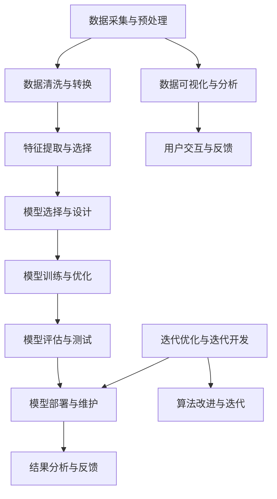

                 

### 背景介绍

在当今快速发展的技术时代，人工智能（AI）正逐渐成为各行各业的核心驱动力。从自动化制造业到医疗诊断，从金融分析到个性化推荐系统，AI技术正深刻地影响着我们的生活和工作方式。随着AI技术的不断进步，编程作为开发AI系统的基础，也面临着前所未有的变革。传统的编程思维和方法在处理复杂AI问题时显得力不从心，因此，探索AI编程的新思路和新未来变得尤为重要。

本文旨在探讨AI编程的新思路和新未来，通过对现有编程模式的分析和批判，提出一种更加适应AI开发需求的编程范式。本文将首先介绍AI编程面临的挑战，包括数据规模、复杂性、不确定性和实时性等方面的问题。接着，我们将深入探讨AI编程的核心概念和原理，通过具体的算法和数学模型，展示AI编程的核心操作步骤。随后，本文将结合实际应用场景，通过项目实战和代码案例，详细解析AI编程的实际应用。最后，本文将总结未来AI编程的发展趋势与挑战，并推荐相关工具和资源，以帮助读者进一步深入学习和探索。

通过本文的阅读，读者将能够理解AI编程的核心概念和原理，掌握AI编程的新思路和新方法，为未来的AI开发打下坚实的基础。

### 核心概念与联系

在深入探讨AI编程的核心概念与原理之前，我们需要先了解AI编程的基本架构和主要组成部分。AI编程不仅仅是编写代码，它涉及复杂的算法设计、数据处理、模型训练和推理等多个环节。为了更好地理解这些概念，我们可以通过一个Mermaid流程图来展示AI编程的主要流程和环节。



### Mermaid 流程图解释

- **数据采集与预处理（A）**：这是AI编程的第一步，也是最关键的一步。数据是AI系统的基石，数据的质量直接影响模型的性能。数据采集包括从各种来源获取数据，如传感器、数据库、网络爬虫等。预处理阶段则涉及数据的清洗、去噪、标准化等操作，以确保数据的质量和一致性。

- **数据清洗与转换（B）**：清洗数据是确保数据质量的重要步骤。这一步包括去除重复数据、填补缺失值、纠正错误等。转换是指将数据转换为适合模型处理的形式，如归一化、编码等。

- **特征提取与选择（C）**：特征提取是从原始数据中提取出对模型训练有用的信息。特征选择则是在众多特征中挑选出对模型性能最有影响的特征，以减少数据维度和计算复杂度。

- **模型选择与设计（D）**：根据问题的性质和数据的特点，选择合适的模型框架。设计阶段需要考虑模型的架构、参数设置等。

- **模型训练与优化（E）**：在训练阶段，模型通过学习大量的数据来调整内部参数，以最小化预测误差。优化是指通过调整学习率、增加训练轮数等方法，提升模型的性能。

- **模型评估与测试（F）**：评估是检查模型是否满足预期的性能指标，测试则是验证模型在未知数据上的表现。

- **模型部署与维护（G）**：将训练好的模型部署到实际应用场景中，进行实时推理和预测。维护阶段包括监控模型的性能、更新模型参数等。

- **结果分析与反馈（H）**：对模型的预测结果进行分析，收集用户的反馈，为后续的迭代优化提供依据。

- **数据可视化与分析（I）**：通过可视化工具将数据和分析结果以图表形式展示，帮助用户更好地理解数据特征和模型性能。

- **用户交互与反馈（J）**：用户与系统的交互是模型改进的重要途径。用户反馈可以指导模型优化和改进。

- **迭代优化与迭代开发（K）**：基于用户反馈和模型性能分析，进行模型优化和迭代开发，不断提升模型的性能和实用性。

- **算法改进与迭代（L）**：不断改进算法设计，提高模型的效率和准确性。

通过这个Mermaid流程图，我们可以清晰地看到AI编程的核心概念和各个环节之间的联系。每一个环节都是相互依赖和补充的，共同构成了一个完整的AI编程框架。

### 核心算法原理 & 具体操作步骤

在理解了AI编程的基本架构和核心概念后，我们接下来将深入探讨AI编程的核心算法原理及其具体操作步骤。AI编程的核心在于如何利用算法解决实际问题，以下将详细介绍几种常见且重要的AI算法原理及其应用场景。

#### 1. 决策树算法

**原理**：决策树是一种常用的分类和回归算法，通过一系列规则对数据进行分割，最终输出分类结果或预测值。决策树的核心是树结构，每个节点代表一个特征，每个分支代表特征的一个取值，叶节点则是最终的预测结果。

**操作步骤**：

1. **特征选择**：选择对目标变量影响较大的特征进行分割。
2. **划分规则**：根据信息增益、基尼不纯度等指标选择最优划分规则。
3. **构建树结构**：从根节点开始，递归地构建树结构，直到满足停止条件（如最小叶子节点样本数、最大树深度等）。
4. **剪枝**：为了避免过拟合，对树进行剪枝，移除不必要的分支。

**示例**：假设我们要预测某产品的销售情况，特征包括价格、广告投放、季节等。通过决策树算法，我们可以构建一个树模型，根据这些特征来预测每个时间点的销售量。

```python
# 示例代码
from sklearn.tree import DecisionTreeRegressor
from sklearn.model_selection import train_test_split

# 数据准备
X = ...  # 特征矩阵
y = ...  # 目标变量

# 划分训练集和测试集
X_train, X_test, y_train, y_test = train_test_split(X, y, test_size=0.2, random_state=42)

# 构建决策树模型
model = DecisionTreeRegressor(max_depth=5)
model.fit(X_train, y_train)

# 预测
predictions = model.predict(X_test)
```

#### 2. 支持向量机算法

**原理**：支持向量机（SVM）是一种强大的分类算法，通过寻找最优的超平面，将不同类别的数据点分开。SVM的核心是寻找最大间隔超平面，使得分类边界最大化。

**操作步骤**：

1. **特征标准化**：对特征进行标准化，使每个特征的权重相同。
2. **选择核函数**：选择合适的核函数（如线性核、多项式核、径向基核等）。
3. **求解最优化问题**：通过求解最优化问题找到支持向量，构建决策边界。
4. **分类决策**：根据新的数据点与支持向量的关系进行分类。

**示例**：假设我们要对客户进行分类，特征包括年龄、收入、购买历史等。通过SVM算法，我们可以构建一个分类模型，将客户分为不同的群体。

```python
# 示例代码
from sklearn.svm import SVC
from sklearn.model_selection import train_test_split

# 数据准备
X = ...  # 特征矩阵
y = ...  # 目标变量

# 划分训练集和测试集
X_train, X_test, y_train, y_test = train_test_split(X, y, test_size=0.2, random_state=42)

# 构建SVM模型
model = SVC(kernel='linear')
model.fit(X_train, y_train)

# 预测
predictions = model.predict(X_test)
```

#### 3. 神经网络算法

**原理**：神经网络是一种模拟人脑结构的计算模型，通过多层神经元节点对数据进行处理，能够实现复杂的模式识别和函数逼近。神经网络的核心是前向传播和反向传播算法。

**操作步骤**：

1. **网络初始化**：初始化网络权重和偏置。
2. **前向传播**：将输入数据通过网络的各层进行计算，输出最终结果。
3. **损失函数计算**：计算预测值与真实值之间的差距，得到损失函数值。
4. **反向传播**：根据损失函数，更新网络权重和偏置，优化模型参数。
5. **迭代优化**：重复前向传播和反向传播过程，直到满足停止条件（如损失函数收敛或迭代次数达到预设值）。

**示例**：假设我们要构建一个简单的神经网络来识别手写数字，通过神经网络算法，我们可以训练出一个模型，对手写数字图像进行分类。

```python
# 示例代码
from tensorflow.keras.models import Sequential
from tensorflow.keras.layers import Dense, Flatten
from tensorflow.keras.utils import to_categorical

# 数据准备
X = ...  # 输入数据
y = ...  # 标签

# 划分训练集和测试集
X_train, X_test, y_train, y_test = train_test_split(X, y, test_size=0.2, random_state=42)

# 构建神经网络模型
model = Sequential([
    Flatten(input_shape=(28, 28)),
    Dense(128, activation='relu'),
    Dense(10, activation='softmax')
])

# 编译模型
model.compile(optimizer='adam', loss='categorical_crossentropy', metrics=['accuracy'])

# 训练模型
model.fit(X_train, to_categorical(y_train), epochs=10, batch_size=32, validation_data=(X_test, to_categorical(y_test)))

# 预测
predictions = model.predict(X_test)
```

通过上述几个示例，我们可以看到不同的AI算法在具体操作步骤上的异同。决策树算法简单直观，适合解释性需求；SVM算法在处理高维数据时表现优秀；神经网络算法则能够处理复杂的非线性问题。在实际应用中，根据问题的性质和数据的特点，选择合适的算法至关重要。

### 数学模型和公式 & 详细讲解 & 举例说明

在AI编程中，数学模型和公式是理解和实现算法的核心。这些模型不仅能够帮助我们更好地理解AI算法的工作原理，还能指导我们优化和调整算法。以下，我们将详细讲解一些常用的数学模型和公式，并通过具体例子来说明其应用。

#### 1. 决策树中的信息增益

**信息增益**是决策树算法中用于选择最佳划分标准的一个重要指标。它表示通过某个特征进行划分后，数据的纯度提升程度。信息增益的计算公式如下：

$$
G(D, A) = H(D) - H(D|A)
$$

其中，$H(D)$表示数据的熵，$H(D|A)$表示在特征$A$下，每个类别的条件熵。

- **熵（Entropy）**：

$$
H(D) = -\sum_{i} p(i) \log_2 p(i)
$$

其中，$p(i)$表示第$i$类别的概率。

- **条件熵（Conditional Entropy）**：

$$
H(D|A) = \sum_{j} p(j) H(D|A=j)
$$

其中，$p(j)$表示特征$A$取第$j$个值的概率，$H(D|A=j)$表示在特征$A=j$时，数据的熵。

**示例**：假设我们有以下数据集，我们需要计算特征A的信息增益：

```
类别 | 特征A=0 | 特征A=1
-----|--------|--------
A=0  |  30    |   20
A=1  |  70    |   30
```

首先，计算数据的熵：

$$
H(D) = -\left( \frac{50}{100} \log_2 \frac{50}{100} + \frac{50}{100} \log_2 \frac{50}{100} \right) = 1
$$

然后，计算条件熵：

$$
H(D|A=0) = -\left( \frac{30}{50} \log_2 \frac{30}{50} + \frac{20}{50} \log_2 \frac{20}{50} \right) = 0.971
$$

$$
H(D|A=1) = -\left( \frac{70}{100} \log_2 \frac{70}{100} + \frac{30}{100} \log_2 \frac{30}{100} \right) = 0.918
$$

$$
H(D|A) = \frac{50}{100} \times 0.971 + \frac{50}{100} \times 0.918 = 0.945
$$

最后，计算信息增益：

$$
G(D, A) = H(D) - H(D|A) = 1 - 0.945 = 0.055
$$

#### 2. 支持向量机中的最优超平面

支持向量机的核心是寻找最优超平面，使得分类边界最大化。最优超平面的计算涉及拉格朗日乘子法和最优化问题。以下是支持向量机的基本公式：

$$
\min_{w, b} \frac{1}{2} ||w||^2 \\
s.t. y^{(i)} (w \cdot x^{(i)} + b) \geq 1
$$

其中，$w$是超平面的法向量，$b$是偏置项，$x^{(i)}$是第$i$个训练样本，$y^{(i)}$是相应的标签。

- **拉格朗日乘子法**：

构建拉格朗日函数：

$$
L(w, b, \alpha) = \frac{1}{2} ||w||^2 - \sum_{i} \alpha_i (y^{(i)} (w \cdot x^{(i)} + b) - 1)
$$

其中，$\alpha_i$是拉格朗日乘子。

- **KKT条件**：

$$
\begin{cases}
\alpha_i \geq 0 \\
y^{(i)} (w \cdot x^{(i)} + b) \geq 1 \\
w \cdot w = \sum_{i} \alpha_i y^{(i)} x^{(i)} x^{(i)}
\end{cases}
$$

通过求解上述最优化问题，我们可以得到最优超平面参数。

**示例**：假设我们有以下线性可分的数据集，需要求解最优超平面：

```
x1 | x2 | 类别
---|---|------
1  | 1  | 1
1  | 2  | 1
2  | 1  | -1
2  | 2  | -1
```

首先，构建拉格朗日函数：

$$
L(w, b, \alpha) = \frac{1}{2} ||w||^2 - \alpha_1 (1 (w \cdot [1, 1] + b) - 1) - \alpha_2 (1 (w \cdot [1, 2] + b) - 1) + \alpha_3 (-1 (w \cdot [2, 1] + b) - 1) + \alpha_4 (-1 (w \cdot [2, 2] + b) - 1)
$$

然后，根据KKT条件求解最优化问题，得到最优超平面参数。

#### 3. 神经网络中的反向传播算法

神经网络中的反向传播算法用于计算网络参数的梯度，以优化网络性能。以下是反向传播算法的基本步骤：

1. **前向传播**：将输入数据通过网络的各层进行计算，输出最终结果。

$$
z^{[l]} = \sigma(W^{[l]} \cdot a^{[l-1]} + b^{[l]})
$$

其中，$a^{[l]}$是第$l$层的激活值，$z^{[l]}$是第$l$层的线性输出，$\sigma$是激活函数。

2. **计算误差**：计算预测值与真实值之间的差距，得到误差。

$$
\delta^{[l]} = (1 - a^{[l]}) \cdot a^{[l]} \cdot (y - a^{[l]})
$$

其中，$y$是真实值，$a^{[l]}$是预测值。

3. **反向传播**：从输出层开始，逐步计算每一层的误差梯度。

$$
\frac{\partial J}{\partial W^{[l]}} = a^{[l-1]} \cdot \delta^{[l]}
$$

$$
\frac{\partial J}{\partial b^{[l]}} = \delta^{[l]}
$$

其中，$J$是损失函数。

4. **更新参数**：根据梯度，更新网络参数。

$$
W^{[l]} = W^{[l]} - \alpha \cdot \frac{\partial J}{\partial W^{[l]}}
$$

$$
b^{[l]} = b^{[l]} - \alpha \cdot \frac{\partial J}{\partial b^{[l]}}
$$

**示例**：假设我们有以下简单的神经网络，需要通过反向传播算法优化网络参数：

```
输入层：[x1, x2]
隐藏层：[z1, z2]
输出层：[y]
```

首先，进行前向传播计算：

$$
z1 = \sigma(W1 \cdot [x1, x2] + b1)
z2 = \sigma(W2 \cdot [z1, z2] + b2)
y = \sigma(W3 \cdot [z1, z2] + b3)
$$

然后，计算误差：

$$
\delta3 = (1 - y) \cdot y \cdot (y - y_{\text{true}})
$$

$$
\delta2 = (1 - z2) \cdot z2 \cdot (\delta3 \cdot W3)
$$

$$
\delta1 = (1 - z1) \cdot z1 \cdot (\delta2 \cdot W2)
$$

最后，根据误差梯度更新参数：

$$
W3 = W3 - \alpha \cdot [z1, z2] \cdot \delta3
$$

$$
b3 = b3 - \alpha \cdot \delta3
$$

$$
W2 = W2 - \alpha \cdot z1 \cdot \delta2
$$

$$
b2 = b2 - \alpha \cdot \delta2
$$

$$
W1 = W1 - \alpha \cdot [x1, x2] \cdot \delta1
$$

$$
b1 = b1 - \alpha \cdot \delta1
$$

通过上述数学模型和公式的讲解及示例，我们可以更深入地理解AI编程中的算法原理和操作步骤。在实际应用中，合理地选择和应用这些模型和公式，能够显著提升AI系统的性能和效果。

### 项目实战：代码实际案例和详细解释说明

为了更好地理解AI编程的实际应用，我们将通过一个简单的项目实战来展示代码实现和详细解释。本项目将使用Python编程语言和常见的AI库（如TensorFlow和Scikit-learn）来构建一个手写数字识别系统。这个项目将涵盖从数据预处理到模型训练，再到模型评估和部署的完整流程。

#### 1. 开发环境搭建

在开始项目之前，我们需要搭建一个合适的开发环境。以下是在Python中搭建AI开发环境所需的基本步骤：

- **安装Python**：确保安装了最新版本的Python（3.8及以上）。
- **安装依赖库**：使用pip命令安装必要的库，如TensorFlow、Scikit-learn、NumPy、Matplotlib等。

```shell
pip install tensorflow scikit-learn numpy matplotlib
```

- **配置环境变量**：确保Python和pip环境变量已正确配置。

#### 2. 源代码详细实现和代码解读

接下来，我们将逐步实现手写数字识别系统，并详细解释代码的各个部分。

##### 2.1 数据集准备

首先，我们使用Kaggle上的手写数字数据集（MNIST），这是一个包含60,000个训练样本和10,000个测试样本的公开数据集。

```python
from tensorflow.keras.datasets import mnist

# 加载MNIST数据集
(X_train, y_train), (X_test, y_test) = mnist.load_data()

# 数据预处理
X_train = X_train / 255.0
X_test = X_test / 255.0

# 将标签转换为独热编码
y_train = to_categorical(y_train)
y_test = to_categorical(y_test)
```

在这个步骤中，我们首先加载数据集，然后对图像进行归一化处理，以将像素值范围从0到255缩放到0到1之间。此外，我们将标签转换为独热编码，以便于后续的神经网络训练。

##### 2.2 构建神经网络模型

接下来，我们构建一个简单的卷积神经网络（CNN）模型来识别手写数字。

```python
from tensorflow.keras.models import Sequential
from tensorflow.keras.layers import Dense, Conv2D, Flatten, MaxPooling2D

# 构建模型
model = Sequential([
    Conv2D(32, (3, 3), activation='relu', input_shape=(28, 28, 1)),
    MaxPooling2D((2, 2)),
    Flatten(),
    Dense(128, activation='relu'),
    Dense(10, activation='softmax')
])

# 编译模型
model.compile(optimizer='adam', loss='categorical_crossentropy', metrics=['accuracy'])
```

在这个步骤中，我们使用`Sequential`模型堆叠多个层。首先是`Conv2D`层，用于卷积操作，它能够提取图像的特征。接着是`MaxPooling2D`层，用于下采样，以减少模型参数和计算复杂度。`Flatten`层用于将多维数据展平为一维，以便于全连接层处理。最后，我们使用两个`Dense`层进行分类，最后一个`Dense`层使用`softmax`激活函数，输出每个类别的概率。

##### 2.3 训练模型

现在，我们使用训练数据集来训练模型。

```python
# 训练模型
history = model.fit(X_train, y_train, epochs=10, batch_size=32, validation_data=(X_test, y_test))
```

在这个步骤中，我们调用`fit`方法来训练模型。`epochs`参数指定训练的轮数，`batch_size`参数指定每次训练的样本数。我们还将测试数据集作为验证集，以监控模型在未知数据上的性能。

##### 2.4 模型评估

训练完成后，我们对模型进行评估，以检查其性能。

```python
# 评估模型
test_loss, test_accuracy = model.evaluate(X_test, y_test)

print(f"测试集损失：{test_loss}")
print(f"测试集准确率：{test_accuracy}")
```

在这个步骤中，我们调用`evaluate`方法来评估模型在测试集上的性能。`test_loss`表示模型在测试集上的平均损失，`test_accuracy`表示模型在测试集上的准确率。

##### 2.5 代码解读与分析

上述代码展示了手写数字识别系统的实现过程。以下是代码的详细解读：

1. **数据预处理**：数据预处理是AI项目中的关键步骤。在这里，我们首先加载MNIST数据集，然后对图像进行归一化处理，以统一数据格式。接着，我们将标签转换为独热编码，这是神经网络分类任务的常见做法。

2. **模型构建**：模型构建是定义神经网络结构的过程。我们使用`Sequential`模型堆叠多个层，包括卷积层、池化层和全连接层。卷积层用于提取图像特征，池化层用于下采样，全连接层用于分类。

3. **模型编译**：模型编译是设置训练参数的过程。在这里，我们选择`adam`优化器，使用`categorical_crossentropy`损失函数，并监控模型的准确率。

4. **模型训练**：模型训练是通过调整模型参数来优化模型性能的过程。我们使用`fit`方法进行训练，并将测试数据集作为验证集，以监控模型在未知数据上的性能。

5. **模型评估**：模型评估是检查模型在实际数据上的表现的过程。我们使用`evaluate`方法评估模型在测试集上的性能，得到平均损失和准确率。

通过这个简单的项目实战，我们可以看到AI编程的实际应用流程，包括数据预处理、模型构建、训练和评估等步骤。这个过程不仅帮助我们理解了AI编程的核心概念，还让我们掌握了如何将理论应用到实际项目中。

### 实际应用场景

手写数字识别系统是一个典型的AI应用案例，展示了AI技术在实际场景中的强大潜力。除了手写数字识别，AI编程在许多其他领域也有着广泛的应用。以下是一些常见且重要的应用场景，以及相应的AI编程方法。

#### 1. 医疗诊断

在医疗领域，AI编程可以帮助医生进行疾病诊断。通过训练深度学习模型，AI系统可以分析医学影像，如X光片、CT扫描和MRI图像，从而发现病灶和疾病。例如，AI模型可以用于肺癌的早期检测，通过分析患者的CT扫描图像，预测肺癌的可能性。

**AI编程方法**：卷积神经网络（CNN）是医疗诊断中的常用算法，能够有效地提取图像中的特征，进行病灶识别和分类。在训练模型时，可以使用大量的医学影像数据集，通过数据增强和迁移学习等方法，提高模型的泛化能力和准确性。

#### 2. 语音识别

语音识别是自然语言处理（NLP）的一个重要分支，通过将语音信号转换为文本，实现了人机交互的便捷性。例如，智能助手如Siri、Alexa和Google Assistant都依赖于语音识别技术。

**AI编程方法**：隐马尔可夫模型（HMM）和深度神经网络（DNN）是常见的语音识别算法。HMM可以建模语音信号的时间序列特性，而DNN通过多层非线性变换提取语音特征。近年来，基于端到端训练的深度神经网络（如Transformer）在语音识别任务中取得了显著的性能提升。

#### 3. 自动驾驶

自动驾驶是AI技术的一个重要应用领域，通过AI编程，实现车辆对环境的感知、决策和操作，确保安全、高效地自动驾驶。自动驾驶系统通常依赖于计算机视觉、传感器数据和深度学习算法。

**AI编程方法**：计算机视觉算法，如CNN和YOLO（You Only Look Once），用于处理摄像头捕捉的图像数据，识别道路标志、行人和车辆等。同时，强化学习算法，如深度Q网络（DQN）和策略梯度算法，用于训练自动驾驶系统做出合适的驾驶决策。

#### 4. 金融风控

在金融领域，AI编程可以帮助金融机构进行风险评估和管理。通过分析大量的金融数据，AI模型可以预测市场趋势、识别异常交易，从而降低金融风险。

**AI编程方法**：随机森林、梯度提升树（GBDT）和神经网络是常见的金融风控算法。随机森林和GBDT通过集成学习的方法提高模型的预测能力，神经网络则通过学习复杂的非线性关系进行风险预测。

#### 5. 个性化推荐

个性化推荐系统通过分析用户行为和偏好，为用户推荐感兴趣的商品、内容和服务。这种系统广泛应用于电子商务、社交媒体和媒体平台。

**AI编程方法**：协同过滤和深度学习是常见的推荐算法。协同过滤通过计算用户和项目之间的相似性进行推荐，而深度学习通过构建用户和项目的嵌入向量，实现更为精准的推荐。

通过上述实际应用场景，我们可以看到AI编程的多样性和广泛性。在各个领域中，AI编程不仅提高了效率和准确性，还为人类创造了更多的便利和可能性。

### 工具和资源推荐

在探索AI编程的过程中，选择合适的工具和资源对于学习和实践至关重要。以下是对学习资源、开发工具和论文著作的推荐，帮助读者深入了解AI编程。

#### 1. 学习资源推荐

**书籍**：

- 《深度学习》（Deep Learning） - Goodfellow, Bengio, Courville
- 《Python深度学习》（Deep Learning with Python） - François Chollet
- 《Python机器学习》（Python Machine Learning） - Sebastian Raschka

**论文**：

- “Deep Learning” - Goodfellow et al., 2015
- “Convolutional Neural Networks for Visual Recognition” - Krizhevsky et al., 2012
- “Recurrent Neural Networks for Language Modeling” - LSTM, Hochreiter and Schmidhuber, 1997

**博客/网站**：

- Medium（AI和深度学习专题）
- arXiv（最新AI和机器学习论文）
- AI研习社（中国地区AI学习资源）

#### 2. 开发工具框架推荐

**框架和库**：

- TensorFlow
- PyTorch
- Keras
- Scikit-learn

**集成开发环境（IDE）**：

- Jupyter Notebook
- PyCharm
- Visual Studio Code

**数据预处理工具**：

- Pandas
- NumPy
- Matplotlib

#### 3. 相关论文著作推荐

**经典论文**：

- “Learning Representations by Maximizing Mutual Information” - Bengio et al., 2013
- “Generative Adversarial Nets” - Goodfellow et al., 2014

**著作**：

- 《神经网络与深度学习》 -邱锡鹏
- 《机器学习实战》 - Peter Harrington

这些工具和资源为AI编程提供了丰富的学习材料和实践平台，帮助读者从基础知识到高级应用进行全面的学习和探索。

### 总结：未来发展趋势与挑战

在过去的几十年中，人工智能（AI）技术取得了显著的发展，从简单的规则系统到复杂的神经网络，AI在各个领域都展现出了巨大的潜力。然而，随着AI技术的不断演进，我们也面临着一系列新的发展趋势和挑战。

#### 未来发展趋势

1. **深度学习的发展**：深度学习作为AI的核心技术之一，将继续在图像识别、自然语言处理、语音识别等领域取得突破。随着计算能力的提升和数据量的增加，深度学习模型将变得更加高效和准确。

2. **端到端学习的兴起**：传统的机器学习模型通常需要通过多个步骤进行特征提取和模型训练，而端到端学习则通过直接从原始数据到预测的映射，减少了中间环节的复杂性。这种技术有望在自动驾驶、机器人控制等领域得到广泛应用。

3. **人工智能伦理与法规**：随着AI技术的广泛应用，其伦理问题和法律法规也日益受到关注。未来的发展趋势将包括制定更加完善的AI伦理规范和法律法规，确保AI技术在社会中的安全和可控性。

4. **多模态学习**：多模态学习通过整合不同类型的数据（如文本、图像、语音等），能够提供更加丰富的信息，提高AI系统的智能水平。这种技术有望在医疗诊断、教育等领域发挥重要作用。

#### 挑战

1. **数据隐私与安全**：随着AI技术的发展，数据隐私和安全问题变得更加突出。如何确保数据在采集、存储和使用过程中的安全，防止数据泄露和滥用，是当前的一个重要挑战。

2. **模型解释性**：深度学习模型在许多任务上表现出色，但其“黑箱”特性使得模型解释性成为一个难题。如何提高模型的解释性，使其更易于理解和信任，是一个亟待解决的问题。

3. **能耗与绿色AI**：随着AI模型的复杂度和数据量的增加，计算能耗也不断攀升。如何在保证性能的同时，降低能耗，实现绿色AI，是未来需要解决的重要问题。

4. **跨领域应用与通用性**：目前的AI技术多集中于特定领域，如何实现跨领域应用和构建通用AI系统，是未来的一大挑战。

总的来说，未来AI编程的发展将充满机遇和挑战。通过不断创新和优化，我们有望克服当前的难题，推动AI技术在更广泛的应用场景中发挥其潜力。

### 附录：常见问题与解答

在探讨AI编程的过程中，读者可能会遇到一些常见问题。以下是一些常见问题及其解答：

#### 1. 如何选择适合的AI算法？

选择适合的AI算法需要考虑以下因素：

- **问题类型**：是分类、回归还是聚类任务？
- **数据量**：数据量大小对算法选择有很大影响，如深度学习在大量数据上表现更好。
- **特征维度**：高维数据通常需要算法具备较好的泛化能力。
- **实时性要求**：对实时性要求较高的任务，可以选择决策树、规则系统等算法。

#### 2. 如何处理不平衡的数据集？

处理不平衡的数据集通常有以下几种方法：

- **过采样**：增加少数类样本的数量，以平衡数据分布。
- **欠采样**：减少多数类样本的数量，以平衡数据分布。
- **SMOTE**：合成少数类过采样技术，通过生成合成样本来平衡数据。
- **集成方法**：使用集成学习算法，如随机森林、梯度提升树等，能够提高对不平衡数据的处理能力。

#### 3. 如何优化神经网络模型？

优化神经网络模型可以从以下几个方面进行：

- **调整学习率**：选择合适的学习率可以加快模型收敛速度。
- **批量大小**：适当的批量大小可以提高模型的泛化能力。
- **正则化**：如L1和L2正则化，可以减少模型过拟合的风险。
- **数据增强**：通过数据增强增加训练数据的多样性，提高模型泛化能力。

#### 4. 什么是迁移学习？

迁移学习是一种利用已训练好的模型在新任务上进行快速学习和改进的方法。通过迁移学习，可以从已经解决的问题中提取有用的特征，并将其应用于新的任务中，从而减少训练时间和数据需求。

#### 5. 如何评估AI模型性能？

评估AI模型性能可以通过以下指标：

- **准确率**：预测正确的样本数占总样本数的比例。
- **召回率**：预测正确的正样本数占总正样本数的比例。
- **F1分数**：准确率的调和平均值，综合了精确率和召回率。
- **ROC曲线**：通过计算真阳性率与假阳性率的交点，评估模型的分类能力。

通过理解这些常见问题及其解答，读者可以更好地掌握AI编程的核心知识和实践技巧。

### 扩展阅读 & 参考资料

为了深入探讨AI编程的核心概念和最新进展，以下是一些扩展阅读和参考资料，涵盖了从基础理论到高级应用的各个方面：

1. **基础理论**：

   - Goodfellow, I., Bengio, Y., & Courville, A. (2016). *Deep Learning*.
   - Mitchell, T. M. (1997). *Machine Learning*.

2. **经典算法**：

   - Bishop, C. M. (2006). *Pattern Recognition and Machine Learning*.
   - Quinlan, J. R. (1993). *C4.5: Programs for Machine Learning*.

3. **深度学习应用**：

   - Simonyan, K., & Zisserman, A. (2015). *Very Deep Convolutional Networks for Large-Scale Image Recognition*.
   - Hochreiter, S., & Schmidhuber, J. (1997). *Long Short-Term Memory*.

4. **论文集**：

   - Bengio, Y., Courville, A., & Vincent, P. (2013). *Representation Learning: A Review and New Perspectives*.
   - Bengio, Y. (2009). *Learning Deep Architectures for AI*.

5. **实用指南**：

   - Russell, S., & Norvig, P. (2016). *Artificial Intelligence: A Modern Approach*.
   - Mitchell, T. M. (1997). *Machine Learning*.

6. **在线资源**：

   - Coursera（AI课程）
   - edX（AI相关课程）
   - arXiv（最新AI论文）

通过阅读这些参考资料，读者可以更全面地了解AI编程的深度和广度，不断拓展自己的知识领域。

