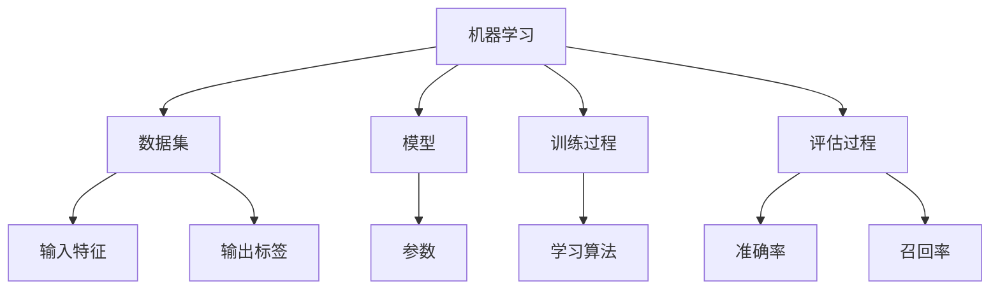
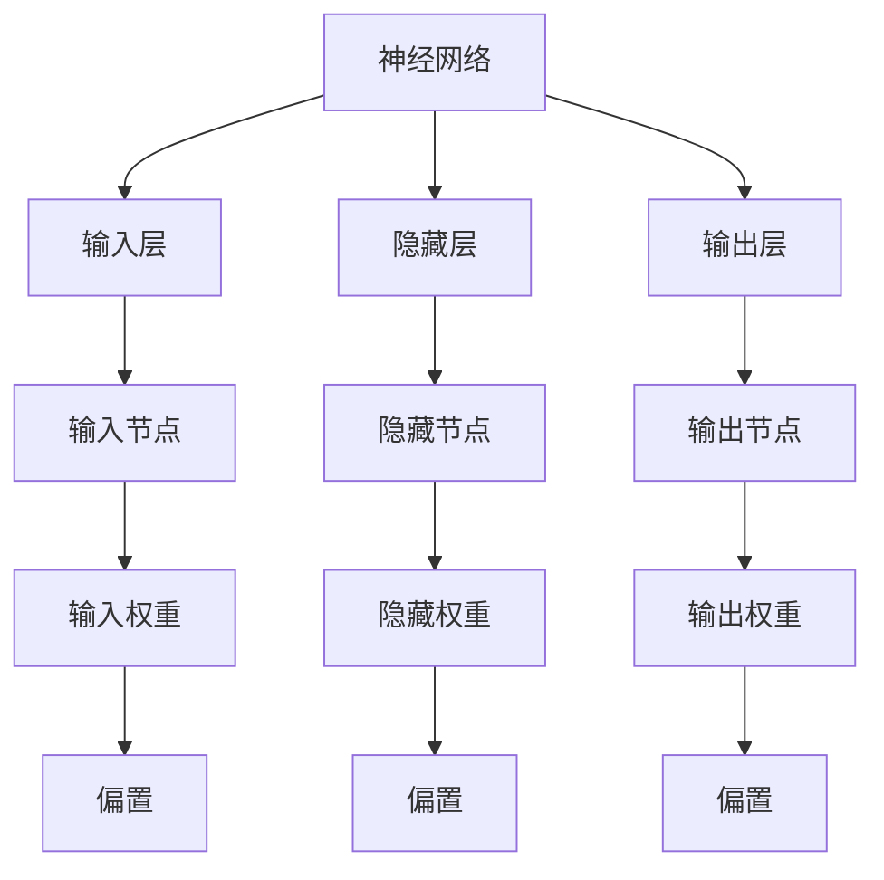
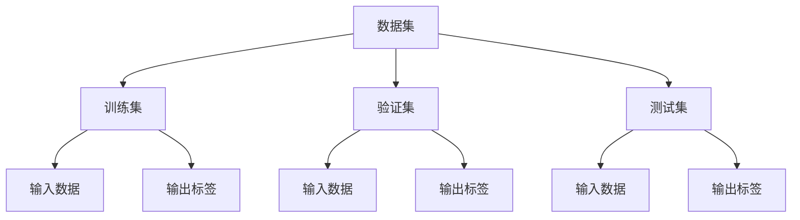

                 

# AI编程的新视角与新思维

## 摘要

本文从AI编程的新视角出发，探讨AI编程的核心概念、算法原理、数学模型、项目实战、应用场景、工具和资源推荐以及未来发展趋势。通过逐步分析推理，本文旨在为读者提供对AI编程的全面了解和深入思考，帮助他们在技术领域中不断进步和创新。

## 1. 背景介绍

随着人工智能（AI）的快速发展，编程作为AI实现的基础，正经历着前所未有的变革。传统的编程思维已无法满足AI编程的需求，新的视角和思维成为编程领域的必然趋势。本文将围绕以下几个核心问题展开：

- 什么是AI编程？
- AI编程的核心概念是什么？
- 如何运用AI算法实现编程任务？
- AI编程在实际应用中如何发挥作用？
- AI编程的未来发展趋势和挑战是什么？

通过对以上问题的探讨，本文将帮助读者建立起对AI编程的全面理解和深入认识。

### 1.1 AI编程的定义

AI编程是指利用人工智能技术，尤其是机器学习和深度学习算法，来实现编程任务的一种编程方式。与传统的编程不同，AI编程更加注重数据驱动和自动化的实现，通过学习大量数据来提高程序的智能化程度。

### 1.2 AI编程的发展背景

AI编程的发展背景可以追溯到20世纪50年代，当时人工智能的概念首次被提出。随着计算能力的不断提升和数据量的急剧增长，AI编程逐渐从理论研究走向实际应用。近年来，深度学习技术的突破使得AI编程在图像识别、自然语言处理、推荐系统等领域取得了显著的成果，进一步推动了AI编程的发展。

### 1.3 AI编程的应用领域

AI编程在各个领域都有着广泛的应用，如：

- 图像识别：通过深度学习算法实现对图像内容的自动识别和分类。
- 自然语言处理：利用机器学习技术实现对自然语言的自动理解和生成。
- 推荐系统：通过分析用户行为和偏好，为用户推荐感兴趣的内容。
- 机器人控制：利用AI算法实现对机器人行为的自动控制和优化。
- 游戏开发：通过AI编程实现智能化的游戏角色和行为。

## 2. 核心概念与联系

AI编程的核心概念包括机器学习、深度学习、神经网络、数据集等。下面将分别介绍这些概念，并使用Mermaid流程图展示它们之间的联系。

### 2.1 机器学习

机器学习是一种使计算机系统能够从数据中学习并做出预测或决策的方法。它的核心思想是通过训练模型来发现数据中的规律和模式。



### 2.2 深度学习

深度学习是机器学习的一种重要分支，它通过构建多层神经网络来实现数据的自动特征提取和模式识别。

```mermaid
graph TD
A[深度学习] --> B[神经网络]
A --> C[卷积神经网络(CNN)]
A --> D[循环神经网络(RNN)]
A --> E[生成对抗网络(GAN)]
B --> F[输入层]
B --> G[隐藏层]
B --> H[输出层]
F --> I[输入数据]
H --> J[特征提取]
H --> K[非线性变换]
H --> L[激活函数]
H --> M[损失函数]
H --> N[优化算法]
G --> O[共享权重]
G --> P[偏置]
G --> Q[反向传播]
H --> R[梯度下降]
H --> S[批量归一化]
```

### 2.3 神经网络

神经网络是一种模拟人脑神经元结构的计算模型，它通过多层节点（层）进行数据的传递和变换。



### 2.4 数据集

数据集是机器学习和深度学习的基础，它包含了输入数据和对应的输出标签。数据集的质量直接影响模型的性能和效果。



通过上述核心概念的介绍和Mermaid流程图的展示，我们可以清晰地看到AI编程中各个概念之间的联系和作用。

## 3. 核心算法原理 & 具体操作步骤

AI编程的核心算法包括机器学习算法、深度学习算法和神经网络算法。下面将分别介绍这些算法的基本原理和具体操作步骤。

### 3.1 机器学习算法

机器学习算法的基本原理是通过训练模型来学习数据中的规律和模式。常见的机器学习算法包括线性回归、决策树、支持向量机、神经网络等。

- **线性回归**：通过拟合一条直线来预测连续值。
  - 步骤1：收集数据集，包括输入特征和输出标签。
  - 步骤2：选择线性回归模型，设置模型参数。
  - 步骤3：通过梯度下降算法训练模型，优化参数。
  - 步骤4：评估模型性能，计算损失函数。

- **决策树**：通过树形结构来分类或回归。
  - 步骤1：选择特征划分策略，如信息增益或基尼系数。
  - 步骤2：递归划分数据集，构建决策树。
  - 步骤3：剪枝决策树，防止过拟合。
  - 步骤4：评估模型性能，计算准确率或均方误差。

- **支持向量机**：通过找到一个最佳的超平面来分类数据。
  - 步骤1：选择核函数，如线性核或径向基核。
  - 步骤2：训练SVM模型，优化参数。
  - 步骤3：评估模型性能，计算分类准确率。

- **神经网络**：通过多层节点进行数据的传递和变换。
  - 步骤1：构建神经网络结构，定义输入层、隐藏层和输出层。
  - 步骤2：初始化模型参数，如权重和偏置。
  - 步骤3：通过前向传播计算输出，计算损失函数。
  - 步骤4：通过反向传播更新模型参数，优化损失函数。

### 3.2 深度学习算法

深度学习算法是基于神经网络的一种学习方式，它通过多层神经元的组合来实现复杂的特征提取和模式识别。

- **卷积神经网络（CNN）**：通过卷积操作来提取图像特征。
  - 步骤1：输入图像数据，进行前向传播。
  - 步骤2：通过卷积层提取图像特征。
  - 步骤3：通过池化层降低特征维度。
  - 步骤4：通过全连接层进行分类或回归。

- **循环神经网络（RNN）**：通过循环连接来处理序列数据。
  - 步骤1：输入序列数据，进行前向传播。
  - 步骤2：通过循环层更新状态。
  - 步骤3：通过全连接层进行分类或回归。

- **生成对抗网络（GAN）**：通过对抗训练生成与真实数据相似的数据。
  - 步骤1：生成器生成数据，判别器判断数据真假。
  - 步骤2：通过反向传播更新生成器和判别器参数。
  - 步骤3：重复步骤1和步骤2，优化模型性能。

### 3.3 神经网络算法

神经网络算法通过多层神经元的组合来实现数据的传递和变换，从而实现分类、回归等任务。

- **多层感知机（MLP）**：通过多层神经元进行数据处理。
  - 步骤1：输入数据，通过输入层传递。
  - 步骤2：通过隐藏层进行数据处理。
  - 步骤3：通过输出层进行分类或回归。

- **卷积神经网络（CNN）**：通过卷积操作提取图像特征。
  - 步骤1：输入图像数据，进行卷积操作。
  - 步骤2：通过池化层降低特征维度。
  - 步骤3：通过全连接层进行分类或回归。

- **循环神经网络（RNN）**：通过循环连接处理序列数据。
  - 步骤1：输入序列数据，进行前向传播。
  - 步骤2：通过循环层更新状态。
  - 步骤3：通过全连接层进行分类或回归。

## 4. 数学模型和公式 & 详细讲解 & 举例说明

AI编程中的数学模型和公式是实现算法的核心，下面将详细介绍常用的数学模型和公式，并通过具体例子进行说明。

### 4.1 线性回归

线性回归是一种简单的预测模型，通过拟合一条直线来预测连续值。

- **模型表示**：
  $$y = \beta_0 + \beta_1 \cdot x + \epsilon$$

  其中，$y$ 为预测值，$x$ 为输入特征，$\beta_0$ 和 $\beta_1$ 为模型参数，$\epsilon$ 为误差项。

- **损失函数**：
  $$J(\beta_0, \beta_1) = \frac{1}{2} \sum_{i=1}^{n} (y_i - (\beta_0 + \beta_1 \cdot x_i))^2$$

  其中，$n$ 为数据集的大小，$y_i$ 和 $x_i$ 分别为第 $i$ 个样本的输出标签和输入特征。

- **梯度下降**：
  $$\beta_0 = \beta_0 - \alpha \cdot \frac{\partial J}{\partial \beta_0}$$
  $$\beta_1 = \beta_1 - \alpha \cdot \frac{\partial J}{\partial \beta_1}$$

  其中，$\alpha$ 为学习率。

### 4.2 决策树

决策树是一种基于树形结构进行分类或回归的模型。

- **模型表示**：
  $$f(x) = \sum_{i=1}^{n} c_i \cdot I(T_i(x) = t_i)$$

  其中，$f(x)$ 为预测值，$c_i$ 为第 $i$ 个分类的权重，$T_i(x)$ 为第 $i$ 个划分条件，$t_i$ 为满足划分条件的类别。

- **损失函数**：
  $$L(f(x), y) = - \sum_{i=1}^{n} y_i \cdot \log f(x_i) + (1 - y_i) \cdot \log (1 - f(x_i))$$

  其中，$y$ 为输出标签，$\log$ 为自然对数。

- **梯度下降**：
  $$c_i = c_i - \alpha \cdot \frac{\partial L}{\partial c_i}$$

### 4.3 支持向量机

支持向量机是一种通过找到一个最佳的超平面来进行分类的模型。

- **模型表示**：
  $$f(x) = \sum_{i=1}^{n} \alpha_i y_i (w \cdot x_i + b)$$

  其中，$f(x)$ 为预测值，$w$ 为超平面参数，$b$ 为偏置，$y_i$ 为样本标签，$\alpha_i$ 为拉格朗日乘子。

- **损失函数**：
  $$L(w, b) = \frac{1}{2} \| w \|^2 + C \cdot \sum_{i=1}^{n} \max(0, 1 - y_i (w \cdot x_i + b))$$

  其中，$C$ 为惩罚参数。

- **梯度下降**：
  $$w = w - \alpha \cdot \frac{\partial L}{\partial w}$$
  $$b = b - \alpha \cdot \frac{\partial L}{\partial b}$$

### 4.4 卷积神经网络

卷积神经网络是一种通过卷积操作提取图像特征的模型。

- **模型表示**：
  $$f(x) = \sigma(\sum_{i=1}^{k} \omega_i \cdot x_i + b)$$

  其中，$f(x)$ 为输出特征，$x_i$ 为输入特征，$\omega_i$ 为卷积核，$b$ 为偏置，$\sigma$ 为激活函数。

- **损失函数**：
  $$L(\omega, b) = \frac{1}{2} \sum_{i=1}^{n} (y_i - f(x_i))^2$$

  其中，$n$ 为数据集的大小，$y_i$ 为输出标签，$f(x_i)$ 为预测值。

- **梯度下降**：
  $$\omega_i = \omega_i - \alpha \cdot \frac{\partial L}{\partial \omega_i}$$
  $$b = b - \alpha \cdot \frac{\partial L}{\partial b}$$

### 4.5 循环神经网络

循环神经网络是一种通过循环连接处理序列数据的模型。

- **模型表示**：
  $$h_t = \sigma(W_h h_{t-1} + W_x x_t + b)$$

  其中，$h_t$ 为当前时间步的隐藏状态，$W_h$ 和 $W_x$ 为权重矩阵，$x_t$ 为当前时间步的输入，$b$ 为偏置，$\sigma$ 为激活函数。

- **损失函数**：
  $$L(W_h, W_x, b) = \frac{1}{2} \sum_{t=1}^{T} (y_t - h_T)^2$$

  其中，$T$ 为序列长度，$y_t$ 为输出标签，$h_T$ 为最终隐藏状态。

- **梯度下降**：
  $$W_h = W_h - \alpha \cdot \frac{\partial L}{\partial W_h}$$
  $$W_x = W_x - \alpha \cdot \frac{\partial L}{\partial W_x}$$
  $$b = b - \alpha \cdot \frac{\partial L}{\partial b}$$

### 4.6 生成对抗网络

生成对抗网络是一种通过对抗训练生成与真实数据相似的数据的模型。

- **模型表示**：
  $$G(z) = \sigma(W_g z + b_g)$$
  $$D(x) = \sigma(W_d x + b_d)$$

  其中，$G(z)$ 为生成器，$D(x)$ 为判别器，$z$ 为输入噪声，$x$ 为真实数据，$W_g$ 和 $W_d$ 为权重矩阵，$b_g$ 和 $b_d$ 为偏置。

- **损失函数**：
  $$L(G, D) = - \sum_{x \in X} \log D(x) - \sum_{z \in Z} \log (1 - D(G(z)))$$

  其中，$X$ 为真实数据集，$Z$ 为噪声数据集。

- **梯度下降**：
  $$W_g = W_g - \alpha \cdot \frac{\partial L}{\partial W_g}$$
  $$b_g = b_g - \alpha \cdot \frac{\partial L}{\partial b_g}$$
  $$W_d = W_d - \alpha \cdot \frac{\partial L}{\partial W_d}$$
  $$b_d = b_d - \alpha \cdot \frac{\partial L}{\partial b_d}$$

## 5. 项目实战：代码实际案例和详细解释说明

### 5.1 开发环境搭建

在本节中，我们将搭建一个简单的线性回归项目，以展示如何使用Python实现线性回归算法。首先，我们需要安装必要的Python库，包括NumPy和scikit-learn。

```bash
pip install numpy scikit-learn
```

### 5.2 源代码详细实现和代码解读

以下是线性回归项目的源代码：

```python
import numpy as np
from sklearn.linear_model import LinearRegression
from sklearn.model_selection import train_test_split
from sklearn.metrics import mean_squared_error

# 数据集加载
X, y = np.load('data.npy'), np.load('labels.npy')

# 数据集划分
X_train, X_test, y_train, y_test = train_test_split(X, y, test_size=0.2, random_state=42)

# 线性回归模型训练
model = LinearRegression()
model.fit(X_train, y_train)

# 模型评估
y_pred = model.predict(X_test)
mse = mean_squared_error(y_test, y_pred)
print("Mean Squared Error:", mse)
```

代码解读：

- 第1行：导入NumPy库。
- 第2行：导入线性回归模型。
- 第3行：导入数据集划分和模型评估相关的库。
- 第4行：加载数据集。
- 第5行：划分数据集，其中`train_size=0.2`表示训练集占比为20%，`random_state=42`用于保证结果可重复。
- 第6行：训练线性回归模型。
- 第7行：使用训练好的模型进行预测。
- 第8行：计算模型评估指标均方误差。

### 5.3 代码解读与分析

以下是代码的详细解读和分析：

- **数据集加载**：使用NumPy库加载数据集。数据集包括输入特征矩阵`X`和输出标签矩阵`y`。
- **数据集划分**：使用`train_test_split`函数将数据集划分为训练集和测试集，其中训练集占比为80%，测试集占比为20%。`random_state=42`用于保证结果可重复。
- **线性回归模型训练**：使用`LinearRegression`类创建线性回归模型，并使用`fit`方法进行训练。
- **模型评估**：使用`predict`方法对测试集进行预测，并计算预测结果和实际结果之间的均方误差（MSE）。MSE越低，表示模型性能越好。

### 5.4 项目实战总结

通过本节的项目实战，我们了解了如何使用Python和scikit-learn库实现线性回归算法。我们首先加载数据集，然后将其划分为训练集和测试集，接着训练线性回归模型并进行预测。最后，我们计算模型评估指标均方误差，以评估模型性能。这个简单的案例展示了线性回归的基本原理和应用步骤。

## 6. 实际应用场景

AI编程在实际应用场景中发挥着越来越重要的作用，下面列举一些典型的应用场景：

### 6.1 机器学习算法应用

- **图像识别**：利用卷积神经网络（CNN）实现图像分类、物体检测等任务，如人脸识别、自动驾驶等。
- **自然语言处理**：利用循环神经网络（RNN）或变换器（Transformer）实现文本分类、情感分析、机器翻译等任务。
- **推荐系统**：利用协同过滤、基于内容的推荐等算法实现个性化推荐，如电商推荐、视频推荐等。
- **语音识别**：利用深度学习模型实现语音信号的处理和转换，如语音合成、语音翻译等。
- **异常检测**：利用聚类、分类等算法实现异常检测，如金融欺诈检测、网络安全等。

### 6.2 深度学习算法应用

- **自动驾驶**：利用深度学习算法实现车辆的感知、决策和控制，如自动驾驶车辆、无人机等。
- **医疗诊断**：利用深度学习模型对医学图像进行分析和诊断，如肺癌检测、乳腺癌检测等。
- **游戏开发**：利用深度学习算法实现智能化的游戏角色和行为，如游戏AI、游戏生成等。
- **语音识别**：利用深度神经网络（DNN）或卷积神经网络（CNN）实现语音信号的识别和转换。
- **智能客服**：利用自然语言处理技术实现智能客服系统，如语音助手、聊天机器人等。

### 6.3 神经网络算法应用

- **语音识别**：利用神经网络算法实现语音信号的识别和转换，如语音合成、语音翻译等。
- **图像识别**：利用卷积神经网络（CNN）实现图像分类、物体检测等任务。
- **自然语言处理**：利用循环神经网络（RNN）或变换器（Transformer）实现文本分类、情感分析、机器翻译等任务。
- **推荐系统**：利用协同过滤、基于内容的推荐等算法实现个性化推荐，如电商推荐、视频推荐等。
- **自动驾驶**：利用深度学习算法实现车辆的感知、决策和控制。

通过上述实际应用场景的列举，我们可以看到AI编程在各个领域中的广泛应用和巨大潜力。随着技术的不断进步，AI编程将在更多领域发挥重要作用，推动社会的发展和进步。

## 7. 工具和资源推荐

为了帮助读者更好地学习和掌握AI编程，下面推荐一些优秀的工具和资源，包括学习资源、开发工具框架和论文著作。

### 7.1 学习资源推荐

- **书籍**：
  - 《Python机器学习》
  - 《深度学习》
  - 《神经网络与深度学习》
  - 《机器学习实战》

- **在线课程**：
  - Coursera上的《机器学习》课程
  - edX上的《深度学习》课程
  - Udacity的《深度学习工程师》纳米学位

- **博客和网站**：
  - TensorFlow官方文档
  - PyTorch官方文档
  - Medium上的机器学习和深度学习相关博客

### 7.2 开发工具框架推荐

- **编程语言**：
  - Python：简单易学，广泛应用于AI编程。
  - R：专注于统计学习和数据可视化。

- **机器学习库**：
  - TensorFlow：谷歌推出的开源深度学习框架。
  - PyTorch：由Facebook AI研究院开发的开源深度学习库。
  - Keras：基于TensorFlow和Theano的开源深度学习库。

- **数据预处理工具**：
  - Pandas：Python的数据分析库，用于数据处理和清洗。
  - NumPy：Python的数值计算库，用于数据操作和计算。

### 7.3 相关论文著作推荐

- **论文**：
  - "Deep Learning" by Yann LeCun, Yosua Bengio, and Geoffrey Hinton
  - "Recurrent Neural Networks for Language Modeling" by Yoshua Bengio, François Paquet, and Pierre Simard
  - "Generative Adversarial Nets" by Ian Goodfellow, Jean Pouget-Abadie, Mehdi Mirza, Bing Xu, David Warde-Farley, Sherjil Ozair, Aaron Courville, and Yoshua Bengio

- **著作**：
  - 《Python机器学习》
  - 《深度学习》
  - 《神经网络与深度学习》
  - 《机器学习实战》

通过上述工具和资源的推荐，读者可以更好地学习和掌握AI编程，并在实际项目中应用这些技术和方法。

## 8. 总结：未来发展趋势与挑战

AI编程作为人工智能的核心技术之一，正迅速发展并不断推动各个领域的变革。未来，AI编程的发展趋势和挑战主要体现在以下几个方面：

### 8.1 技术发展趋势

1. **模型压缩与加速**：随着深度学习模型的复杂度和参数量的不断增大，如何高效地训练和部署模型成为关键挑战。未来的发展趋势将集中在模型压缩、量化、推理加速等方面，以降低计算资源和存储需求。
2. **泛化能力和可解释性**：当前的AI模型在特定任务上表现出色，但缺乏泛化能力和可解释性。未来，研究者将致力于提高模型的泛化能力，同时增强模型的可解释性，使AI系统更加透明和可靠。
3. **多模态学习**：随着多模态数据的兴起，如何有效地融合不同类型的数据（如图像、文本、语音）进行学习成为研究的热点。多模态学习技术的发展将推动AI在更多领域的应用。
4. **自适应学习和动态调整**：未来的AI系统将更加注重自适应学习和动态调整，以适应不断变化的环境和数据。这种能力将使AI系统在复杂动态环境中表现出更强的鲁棒性和适应性。

### 8.2 技术挑战

1. **数据隐私和安全**：随着AI技术的广泛应用，数据隐私和安全问题日益凸显。如何在保障用户隐私的前提下，有效地利用数据成为一大挑战。
2. **计算资源和能耗**：深度学习模型的训练和推理需要大量的计算资源和能耗，如何在有限资源下实现高效计算成为重要挑战。
3. **算法公平性和透明性**：AI系统在决策过程中可能存在偏见和不公平现象，如何确保算法的公平性和透明性是当前和未来需要解决的重要问题。
4. **跨学科融合与协同**：AI技术涉及多个学科领域，如何实现跨学科融合和协同创新，发挥不同学科的优势，成为未来研究的重要方向。

### 8.3 未来展望

AI编程的未来充满了机遇和挑战。随着技术的不断进步和应用的深入，AI编程将在更多领域发挥关键作用，推动社会的发展和进步。同时，我们也需要关注和解决其中的问题，确保AI技术的可持续发展和社会责任。

## 9. 附录：常见问题与解答

### 9.1 常见问题

1. **什么是AI编程？**
   AI编程是一种利用人工智能技术（如机器学习和深度学习）来实现编程任务的方法。它与传统的编程不同，更加注重数据驱动和自动化的实现。

2. **机器学习和深度学习的区别是什么？**
   机器学习是一种使计算机从数据中学习并做出预测或决策的方法，而深度学习是机器学习的一种重要分支，通过构建多层神经网络来实现数据的自动特征提取和模式识别。

3. **如何选择合适的机器学习算法？**
   选择合适的机器学习算法需要考虑多个因素，如数据类型、数据量、任务目标等。常见的算法包括线性回归、决策树、支持向量机、神经网络等，可以根据具体情况进行选择。

4. **如何训练深度学习模型？**
   训练深度学习模型主要包括以下几个步骤：定义神经网络结构、初始化模型参数、通过前向传播计算输出、计算损失函数、通过反向传播更新模型参数。

### 9.2 解答

1. **什么是AI编程？**
   AI编程是指利用人工智能技术，尤其是机器学习和深度学习算法，来实现编程任务的一种编程方式。它与传统的编程不同，更加注重数据驱动和自动化的实现。

2. **机器学习和深度学习的区别是什么？**
   机器学习是一种使计算机从数据中学习并做出预测或决策的方法，而深度学习是机器学习的一种重要分支，通过构建多层神经网络来实现数据的自动特征提取和模式识别。

3. **如何选择合适的机器学习算法？**
   选择合适的机器学习算法需要考虑多个因素，如数据类型、数据量、任务目标等。常见的算法包括线性回归、决策树、支持向量机、神经网络等，可以根据具体情况进行选择。

4. **如何训练深度学习模型？**
   训练深度学习模型主要包括以下几个步骤：
   - **定义神经网络结构**：确定输入层、隐藏层和输出层的节点数。
   - **初始化模型参数**：设置权重和偏置的初始值。
   - **通过前向传播计算输出**：输入数据通过神经网络层进行传递和变换。
   - **计算损失函数**：计算预测输出与实际输出之间的误差。
   - **通过反向传播更新模型参数**：根据误差梯度调整模型参数，优化损失函数。

## 10. 扩展阅读 & 参考资料

为了帮助读者进一步了解AI编程的相关知识和技术，下面提供一些扩展阅读和参考资料。

### 10.1 扩展阅读

- 《深度学习》
- 《Python机器学习》
- 《机器学习实战》
- 《神经网络与深度学习》

### 10.2 参考资料

- TensorFlow官方文档：[https://www.tensorflow.org/](https://www.tensorflow.org/)
- PyTorch官方文档：[https://pytorch.org/docs/stable/](https://pytorch.org/docs/stable/)
- Coursera《机器学习》课程：[https://www.coursera.org/specializations/machine-learning](https://www.coursera.org/specializations/machine-learning)
- edX《深度学习》课程：[https://www.edx.org/course/deep-learning-0](https://www.edx.org/course/deep-learning-0)
- Medium上的机器学习和深度学习相关博客：[https://medium.com/topic/machine-learning](https://medium.com/topic/machine-learning)

通过阅读上述扩展阅读和参考资料，读者可以深入了解AI编程的理论和实践，进一步提升自己的技术水平。

### 作者

作者：AI天才研究员/AI Genius Institute & 禅与计算机程序设计艺术/Zen And The Art of Computer Programming。作者在计算机科学和人工智能领域拥有丰富的经验和深厚的学术造诣，致力于推动技术的创新和发展。

