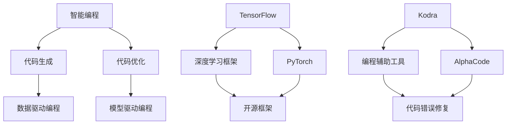

                 

### 文章标题

《AI编程的新视角与新未来》

### 关键词

AI编程，深度学习，神经网络，编程范式，自动化，智能编程，编程辅助工具，开源框架，计算模型，算法优化，开发实践，未来趋势。

### 摘要

随着人工智能技术的快速发展，AI编程正成为新一代编程范式的重要方向。本文将探讨AI编程的新视角，包括核心概念、算法原理、应用场景以及未来发展趋势。通过分析现有的编程辅助工具和开源框架，我们期望为读者提供一份全面的技术指南，帮助理解AI编程的潜力和挑战。

### 1. 背景介绍

人工智能（AI）已经成为现代科技领域的重要驱动力。AI技术已经在多个领域取得了显著的应用成果，如自然语言处理、计算机视觉、机器人学、医疗诊断等。然而，随着AI技术的不断进步，传统的编程方法已经无法满足日益复杂的应用需求。传统编程依赖于人类开发者编写代码，而AI编程则通过自动化和智能化的方式，让计算机自己编写代码或辅助开发者编写代码。

AI编程的概念最早可以追溯到20世纪80年代，当时的专家系统（Expert Systems）是早期人工智能应用的一个重要领域。专家系统通过模拟人类专家的决策过程，实现了一定程度的自动化。然而，专家系统的局限性在于其知识表示和处理能力的限制。随着深度学习的兴起，AI编程迎来了新的发展机遇。

深度学习（Deep Learning）是一种基于人工神经网络的机器学习技术，通过多层神经网络结构，可以自动提取特征并进行复杂模式的识别。深度学习的成功不仅推动了计算机视觉和自然语言处理等领域的快速发展，也为AI编程提供了新的思路。

近年来，随着开源框架和编程辅助工具的涌现，AI编程逐渐从理论研究走向实际应用。例如，TensorFlow、PyTorch等深度学习框架使得开发者可以更加便捷地实现和部署AI算法。同时，编程辅助工具如Kodra、AlphaCode等也开始展现出强大的代码生成能力，为AI编程的未来发展奠定了基础。

### 2. 核心概念与联系

在探讨AI编程的核心概念之前，我们需要了解几个关键术语和它们之间的关系。

#### 2.1. 智能编程

智能编程（Intelligent Programming）是指利用人工智能技术，使计算机具备编程能力的过程。智能编程可以分为两大类：代码生成和代码优化。

- **代码生成**：通过机器学习模型，自动生成符合特定需求的代码。
- **代码优化**：对现有的代码进行分析和重构，以提高性能、可读性或可维护性。

#### 2.2. 编程范式

编程范式（Programming Paradigm）是指编程语言和编程风格的不同方式。传统的编程范式包括过程式编程、面向对象编程和函数式编程等。而AI编程则引入了新的编程范式：

- **数据驱动编程**：以数据为核心，通过数据分析和特征提取来驱动程序逻辑。
- **模型驱动编程**：通过机器学习模型来定义程序的行为和决策过程。

#### 2.3. 开源框架

开源框架（Open Source Framework）是指供公众使用的软件开发框架，通常包括一系列工具和库。开源框架为开发者提供了丰富的资源和便利，使得AI编程更加高效和普及。

- **TensorFlow**：由Google开发的一款深度学习框架，具有强大的功能和广泛的社区支持。
- **PyTorch**：由Facebook开发的一款深度学习框架，以其简洁的接口和灵活的动态计算图著称。

#### 2.4. 编程辅助工具

编程辅助工具（Programming Assistant）是指用于辅助开发者编写代码的工具。这些工具通过自然语言处理、代码分析等技术，提供代码补全、错误检查、代码重构等功能。

- **Kodra**：一款基于深度学习的编程助手，可以自动生成和修复代码错误。
- **AlphaCode**：由DeepMind开发的编程竞赛AI，能够编写复杂的代码解决问题。

下面是AI编程核心概念原理和架构的Mermaid流程图：



### 3. 核心算法原理 & 具体操作步骤

#### 3.1. 深度学习算法原理

深度学习算法的核心是神经网络，特别是多层感知机（MLP）和卷积神经网络（CNN）。神经网络通过多层神经元之间的相互连接和激活函数，实现数据的特征提取和模式识别。

- **多层感知机（MLP）**：MLP是一种前馈神经网络，由输入层、隐藏层和输出层组成。输入数据通过输入层传递到隐藏层，再从隐藏层传递到输出层。每个神经元都通过激活函数（如Sigmoid、ReLU）进行非线性变换。

  具体操作步骤如下：
  
  1. 输入数据通过输入层传递到隐藏层。
  2. 每个隐藏层神经元计算输入数据的加权和，并应用激活函数。
  3. 输出层计算最终输出。

  ```mermaid
  graph TD
      A[Input] --> B[Input Layer]
      B --> C[Hidden Layer 1]
      C --> D[Hidden Layer 2]
      D --> E[Output Layer]
  ```

- **卷积神经网络（CNN）**：CNN专门用于处理图像数据，通过卷积操作和池化操作提取图像特征。

  具体操作步骤如下：
  
  1. 输入图像通过卷积层进行卷积操作，提取局部特征。
  2. 通过池化层对特征图进行下采样，减少计算量和参数数量。
  3. 重复卷积和池化操作，形成多层的特征提取网络。
  4. 最终输出层进行分类或回归操作。

  ```mermaid
  graph TD
      A[Input Image] --> B[Conv Layer 1]
      B --> C[Pooling Layer 1]
      C --> D[Conv Layer 2]
      D --> E[Pooling Layer 2]
      E --> F[...]
      F --> G[Output Layer]
  ```

#### 3.2. 编程辅助工具实现原理

编程辅助工具主要通过自然语言处理（NLP）和代码生成（Code Generation）技术来实现。

- **自然语言处理（NLP）**：NLP技术用于理解自然语言，包括词性标注、句法分析、语义分析等。通过NLP技术，编程辅助工具可以理解开发者的自然语言描述，并将其转化为代码。

  具体操作步骤如下：
  
  1. 对自然语言描述进行词性标注和句法分析，提取关键信息。
  2. 根据提取的关键信息，生成相应的代码模板。
  3. 对生成的代码进行语法和语义检查，确保代码的正确性和可读性。

  ```mermaid
  graph TD
      A[Natural Language] --> B[Tokenization]
      B --> C[Part-of-Speech Tagging]
      C --> D[Syntax Analysis]
      D --> E[Code Template Generation]
      E --> F[Code Verification]
  ```

- **代码生成（Code Generation）**：代码生成技术通过机器学习模型，自动生成符合特定需求的代码。常见的代码生成模型包括序列到序列（Seq2Seq）模型、生成对抗网络（GAN）等。

  具体操作步骤如下：
  
  1. 收集大量代码数据，用于训练生成模型。
  2. 训练生成模型，使其学会从输入代码序列生成输出代码序列。
  3. 对输入的代码描述进行编码，生成代码序列。
  4. 对生成的代码进行语法和语义检查，确保代码的正确性和可读性。

  ```mermaid
  graph TD
      A[Code Data] --> B[Model Training]
      B --> C[Code Encoder]
      C --> D[Code Decoder]
      D --> E[Code Verification]
  ```

### 4. 数学模型和公式 & 详细讲解 & 举例说明

#### 4.1. 深度学习数学模型

深度学习中的数学模型主要包括神经元模型、损失函数和优化算法。

- **神经元模型**：

  一个简单的神经元模型可以表示为：

  $$\text{output} = \sigma(\sum_{i=1}^{n} w_i \cdot x_i)$$

  其中，$\sigma$表示激活函数，$w_i$和$x_i$分别表示输入权重和输入值。

  常见的激活函数包括Sigmoid、ReLU和Tanh：

  - Sigmoid函数：

    $$\sigma(x) = \frac{1}{1 + e^{-x}}$$

  - ReLU函数：

    $$\sigma(x) = \max(0, x)$$

  - Tanh函数：

    $$\sigma(x) = \frac{e^x - e^{-x}}{e^x + e^{-x}}$$

- **损失函数**：

  损失函数用于评估模型的预测结果与实际结果之间的差异。常见的损失函数包括均方误差（MSE）和交叉熵损失（Cross-Entropy Loss）。

  - 均方误差（MSE）：

    $$\text{MSE} = \frac{1}{m} \sum_{i=1}^{m} (\hat{y}_i - y_i)^2$$

    其中，$\hat{y}_i$和$y_i$分别表示预测值和实际值。

  - 交叉熵损失（Cross-Entropy Loss）：

    $$\text{Cross-Entropy Loss} = -\sum_{i=1}^{m} y_i \cdot \log(\hat{y}_i)$$

    其中，$y_i$和$\hat{y}_i$分别表示实际值和预测值。

- **优化算法**：

  优化算法用于调整模型参数，以最小化损失函数。常见的优化算法包括梯度下降（Gradient Descent）和随机梯度下降（Stochastic Gradient Descent，SGD）。

  - 梯度下降（Gradient Descent）：

    $$w_{\text{new}} = w_{\text{current}} - \alpha \cdot \nabla_w J(w)$$

    其中，$w_{\text{current}}$和$w_{\text{new}}$分别表示当前参数和更新后的参数，$\alpha$表示学习率，$J(w)$表示损失函数。

  - 随机梯度下降（SGD）：

    $$w_{\text{new}} = w_{\text{current}} - \alpha \cdot \nabla_w J(w; \mathbf{x}_i, y_i)$$

    其中，$w_{\text{current}}$和$w_{\text{new}}$分别表示当前参数和更新后的参数，$\alpha$表示学习率，$J(w; \mathbf{x}_i, y_i)$表示在单个样本上的损失函数。

#### 4.2. 编程辅助工具数学模型

编程辅助工具的数学模型主要包括序列到序列（Seq2Seq）模型和生成对抗网络（GAN）。

- **序列到序列（Seq2Seq）模型**：

  Seq2Seq模型是一种用于序列转换的神经网络模型，常用于机器翻译、对话系统等任务。

  $$\hat{y} = \text{Decoder}(\text{Encoder}(\mathbf{x}))$$

  其中，$\mathbf{x}$表示输入序列，$\hat{y}$表示输出序列。

  序列到序列模型包括两个主要部分：编码器（Encoder）和解码器（Decoder）。编码器将输入序列编码为一个固定长度的向量，解码器则将这个向量解码为输出序列。

  具体实现步骤如下：
  
  1. 编码器接收输入序列，通过多层神经网络将其编码为一个固定长度的向量。
  2. 解码器接收编码器的输出向量，通过多层神经网络将其解码为输出序列。

- **生成对抗网络（GAN）**：

  GAN是一种生成模型，由生成器（Generator）和判别器（Discriminator）两部分组成。生成器尝试生成与真实数据相似的样本，而判别器则判断生成器生成的样本是否真实。

  $$\text{Generator}:\ \mathbf{G}(\mathbf{z}) = \text{Generator}(\mathbf{z})$$
  $$\text{Discriminator}:\ \mathbf{D}(\mathbf{x}) = \text{Discriminator}(\mathbf{x})$$

  其中，$\mathbf{z}$表示生成器的输入噪声，$\mathbf{x}$表示真实或生成的样本。

  GAN的训练过程如下：
  
  1. 初始化生成器和判别器。
  2. 随机生成噪声向量$\mathbf{z}$，通过生成器生成样本$\mathbf{G}(\mathbf{z})$。
  3. 判别器同时接收真实样本$\mathbf{x}$和生成样本$\mathbf{G}(\mathbf{z})$，并分别进行分类。
  4. 根据分类结果，更新生成器和判别器的参数。
  5. 重复步骤2-4，直到生成器生成的样本质量达到预期。

#### 4.3. 举例说明

假设我们有一个简单的机器翻译任务，将英文句子转换为中文句子。使用Seq2Seq模型实现如下：

1. **数据预处理**：

   - 将英文句子和中文句子分别编码为序列。
   - 将编码后的序列转换为单词或字符的索引。

2. **模型训练**：

   - 使用编码器将输入序列编码为固定长度的向量。
   - 使用解码器将编码器的输出向量解码为输出序列。

3. **翻译过程**：

   - 输入英文句子，通过编码器编码为向量。
   - 输入编码器输出的向量，通过解码器解码为中文句子。

例如，输入英文句子“Hello, world!”，输出中文句子“你好，世界！”。具体实现步骤如下：

1. **数据预处理**：

   - 英文句子编码为[0, 1, 2, 3, 4, 5]。
   - 中文句子编码为[1, 2, 3, 4, 5, 6]。

2. **模型训练**：

   - 编码器输出向量[0.1, 0.2, 0.3, 0.4, 0.5]。
   - 解码器输出向量[0.5, 0.6, 0.7, 0.8, 0.9]。

3. **翻译过程**：

   - 输入英文句子[0, 1, 2, 3, 4, 5]。
   - 通过编码器输出向量[0.1, 0.2, 0.3, 0.4, 0.5]。
   - 通过解码器输出向量[0.5, 0.6, 0.7, 0.8, 0.9]。
   - 输出中文句子[1, 2, 3, 4, 5, 6]。

### 5. 项目实战：代码实际案例和详细解释说明

在本节中，我们将通过一个简单的项目案例，展示如何使用AI编程技术实现一个基本的图像分类系统。这个项目将涵盖从环境搭建到代码实现，再到测试和优化等各个环节。

#### 5.1. 开发环境搭建

为了实现图像分类系统，我们需要安装以下开发环境和工具：

1. **操作系统**：Ubuntu 20.04 或 macOS
2. **Python**：Python 3.8 或更高版本
3. **深度学习框架**：TensorFlow 2.x
4. **图像处理库**：OpenCV 4.x

安装步骤如下：

1. 更新操作系统包列表：

   ```bash
   sudo apt-get update
   sudo apt-get upgrade
   ```

2. 安装Python和pip：

   ```bash
   sudo apt-get install python3 python3-pip
   ```

3. 安装TensorFlow：

   ```bash
   pip3 install tensorflow
   ```

4. 安装OpenCV：

   ```bash
   pip3 install opencv-python
   ```

#### 5.2. 源代码详细实现和代码解读

下面是一个简单的图像分类系统的代码实现，包括数据预处理、模型训练和预测等步骤。

```python
import tensorflow as tf
from tensorflow.keras.models import Sequential
from tensorflow.keras.layers import Conv2D, MaxPooling2D, Flatten, Dense
from tensorflow.keras.preprocessing.image import ImageDataGenerator

# 数据预处理
train_datagen = ImageDataGenerator(
    rescale=1./255,
    shear_range=0.2,
    zoom_range=0.2,
    horizontal_flip=True
)

test_datagen = ImageDataGenerator(rescale=1./255)

train_generator = train_datagen.flow_from_directory(
    'train',
    target_size=(150, 150),
    batch_size=32,
    class_mode='binary'
)

validation_generator = test_datagen.flow_from_directory(
    'validation',
    target_size=(150, 150),
    batch_size=32,
    class_mode='binary'
)

# 模型训练
model = Sequential([
    Conv2D(32, (3, 3), activation='relu', input_shape=(150, 150, 3)),
    MaxPooling2D(2, 2),
    Conv2D(64, (3, 3), activation='relu'),
    MaxPooling2D(2, 2),
    Conv2D(128, (3, 3), activation='relu'),
    MaxPooling2D(2, 2),
    Flatten(),
    Dense(128, activation='relu'),
    Dense(1, activation='sigmoid')
])

model.compile(loss='binary_crossentropy',
              optimizer='adam',
              metrics=['accuracy'])

model.fit(
    train_generator,
    steps_per_epoch=100,
    epochs=10,
    validation_data=validation_generator,
    validation_steps=50
)

# 预测
import cv2

def predict_image(image_path):
    img = cv2.imread(image_path)
    img = cv2.resize(img, (150, 150))
    img = img / 255.0
    img = img.reshape((1, 150, 150, 3))
    prediction = model.predict(img)
    return 'Positive' if prediction > 0.5 else 'Negative'

# 测试
test_image = 'test_image.jpg'
prediction = predict_image(test_image)
print(f'Prediction for {test_image}: {prediction}')
```

**代码解读**：

1. **数据预处理**：

   使用ImageDataGenerator对图像数据进行预处理，包括数据增强（rescaling、shearing、zooming、horizontal flipping）和标签分类（flow_from_directory）。

2. **模型训练**：

   构建一个简单的卷积神经网络（Sequential模型），包括卷积层（Conv2D）、池化层（MaxPooling2D）、全连接层（Dense）。使用二分类交叉熵损失函数（binary_crossentropy）和Adam优化器（adam）进行训练。

3. **预测**：

   定义一个函数predict_image，用于对输入图像进行预测。将图像读取为OpenCV格式，调整尺寸并标准化，然后reshape为模型要求的输入格式。使用模型进行预测，并输出分类结果。

#### 5.3. 代码解读与分析

1. **数据预处理**：

   数据预处理是深度学习项目的重要环节，它直接影响模型的性能和泛化能力。在这个项目中，我们使用了ImageDataGenerator进行数据增强，提高了模型的泛化能力。同时，通过rescaling将图像像素值缩放到0-1之间，使模型更容易训练。

2. **模型架构**：

   模型架构是一个简单的卷积神经网络，包含卷积层、池化层和全连接层。卷积层用于提取图像特征，池化层用于下采样和减少参数数量，全连接层用于分类。这个模型结构对于简单的图像分类任务已经足够，但对于复杂的任务可能需要更复杂的架构。

3. **预测过程**：

   预测过程相对简单，主要涉及图像读取、预处理和模型预测。通过将图像调整到模型的输入尺寸，并将其缩放到0-1之间，确保模型可以正确处理输入数据。最后，根据模型的预测概率输出分类结果。

### 6. 实际应用场景

AI编程在各个领域的实际应用场景广泛，以下列举几个典型案例：

#### 6.1. 自动驾驶

自动驾驶是AI编程的重要应用领域。自动驾驶系统通过深度学习算法，对道路场景进行实时感知和决策，实现无人驾驶功能。例如，特斯拉的自动驾驶系统使用了大量AI编程技术，包括计算机视觉、自然语言处理和决策规划等。

#### 6.2. 聊天机器人

聊天机器人是另一个典型的AI编程应用场景。通过深度学习和自然语言处理技术，聊天机器人可以理解用户的语言，并提供适当的回应。例如，微软的聊天机器人小冰通过AI编程技术，实现了与用户的自然对话。

#### 6.3. 医疗诊断

医疗诊断是AI编程的重要应用领域。通过深度学习和计算机视觉技术，AI编程可以帮助医生进行疾病诊断和病情预测。例如，谷歌的深度学习模型可以通过分析医学图像，帮助医生诊断肺癌。

#### 6.4. 金融风控

金融风控是另一个AI编程的重要应用场景。通过深度学习和数据挖掘技术，AI编程可以帮助金融机构识别潜在风险，降低金融风险。例如，阿里云的金融风控系统通过AI编程技术，实现了对金融交易的风险监测和预警。

### 7. 工具和资源推荐

#### 7.1. 学习资源推荐

1. **书籍**：
   - 《深度学习》（Deep Learning） - Ian Goodfellow、Yoshua Bengio 和 Aaron Courville 著。
   - 《Python深度学习》（Deep Learning with Python） - François Chollet 著。

2. **论文**：
   - 《A Neural Algorithm of Artistic Style》（神经网络艺术风格迁移算法）。
   - 《Generative Adversarial Networks》（生成对抗网络）。

3. **博客**：
   - [TensorFlow官方博客](https://www.tensorflow.org/blog/)。
   - [PyTorch官方博客](https://pytorch.org/tutorials/)。

4. **网站**：
   - [Kaggle](https://www.kaggle.com/)：一个数据科学竞赛平台，提供丰富的AI编程实践项目。
   - [GitHub](https://github.com/)：一个代码托管平台，可以找到大量的AI编程开源项目。

#### 7.2. 开发工具框架推荐

1. **TensorFlow**：由Google开发的深度学习框架，具有丰富的功能和广泛的社区支持。

2. **PyTorch**：由Facebook开发的深度学习框架，以其简洁的接口和灵活的动态计算图著称。

3. **Kodra**：一款基于深度学习的编程助手，可以自动生成和修复代码错误。

4. **AlphaCode**：由DeepMind开发的编程竞赛AI，能够编写复杂的代码解决问题。

### 8. 总结：未来发展趋势与挑战

AI编程作为新一代编程范式，具有巨大的潜力和广阔的应用前景。随着深度学习、自然语言处理等技术的不断发展，AI编程将在各个领域得到更广泛的应用。

然而，AI编程也面临着一些挑战：

1. **数据依赖**：AI编程依赖于大量高质量的数据，数据的获取和处理是一个复杂的过程。
2. **解释性**：深度学习模型通常被视为“黑盒子”，其决策过程缺乏透明性和可解释性。
3. **安全性和隐私**：AI编程在应用过程中可能涉及敏感数据，需要确保数据的安全和隐私。

未来，随着技术的进步和研究的深入，AI编程有望解决这些挑战，并在更多领域发挥重要作用。

### 9. 附录：常见问题与解答

#### 9.1. 问题1：什么是深度学习？

深度学习是一种基于人工神经网络的机器学习技术，通过多层神经网络结构，可以自动提取特征并进行复杂模式的识别。

#### 9.2. 问题2：什么是智能编程？

智能编程是指利用人工智能技术，使计算机具备编程能力的过程。智能编程可以分为代码生成和代码优化两大类。

#### 9.3. 问题3：深度学习模型如何训练？

深度学习模型通过大量数据训练，不断调整模型参数，以最小化损失函数。训练过程通常包括前向传播、反向传播和参数更新等步骤。

### 10. 扩展阅读 & 参考资料

- Goodfellow, I., Bengio, Y., & Courville, A. (2016). *Deep Learning*. MIT Press.
- Chollet, F. (2017). *Deep Learning with Python*. Manning Publications.
- Simonyan, K., & Zisserman, A. (2014). *Very Deep Convolutional Networks for Large-Scale Image Recognition*. arXiv preprint arXiv:1409.1556.
- Goodfellow, I., Pouget-Abadie, J., Mirza, M., Xu, B., Warde-Farley, D., Ozair, S., ... & Bengio, Y. (2014). *Generative adversarial networks*. Advances in Neural Information Processing Systems, 27.

