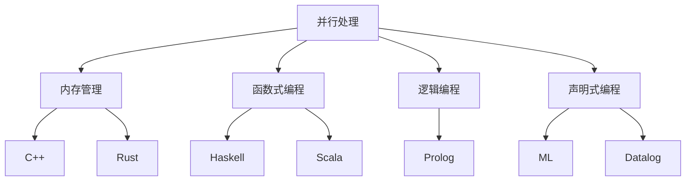

                 

### AI编程的新语言与新思维

> **关键词**: AI编程、新语言、新思维、算法、人工智能、编程语言

> **摘要**: 本文深入探讨了AI编程领域的变革，介绍了几种新兴编程语言，分析了它们的独特之处以及如何结合新思维进行高效编程。通过详细阐述核心概念、算法原理、数学模型和实际应用案例，本文旨在为AI开发者提供有益的指导，助力他们在新时代的技术浪潮中把握机遇，突破挑战。

在过去的几十年中，计算机编程语言经历了翻天覆地的变化。从早期的机器语言、汇编语言，到高级语言如C、Java和Python，编程语言的发展一直在推动软件工程和计算机科学的进步。然而，随着人工智能（AI）的崛起，传统的编程语言逐渐显现出其局限性，促使新一代编程语言的诞生。本文将探讨AI编程领域的新语言和新思维，帮助读者理解这一变革的重要性，并掌握如何在新时代进行高效编程。

## 1. 背景介绍

人工智能的发展离不开强大的算法和数据处理能力。然而，传统的编程语言在处理复杂的人工智能任务时，常常显得力不从心。首先，传统编程语言的设计初衷并非为了处理大规模的数据集或复杂的算法。其次，人工智能领域的快速发展使得开发者需要更灵活、更强大的工具来应对不断变化的需求。因此，新一代编程语言应运而生，旨在解决传统编程语言在AI领域面临的挑战。

新一代编程语言不仅提供了更丰富的语法特性，如并行处理、内存管理、自动优化等，还引入了新的编程范式，如函数式编程、逻辑编程和声明式编程。这些语言更贴近人工智能的工作方式，能够更高效地处理复杂的数据和算法。此外，新一代编程语言还注重易用性和可扩展性，使得开发者可以更加专注于算法的创新和优化，而无需过多关注底层实现的细节。

## 2. 核心概念与联系

在探讨AI编程的新语言之前，我们需要了解几个核心概念，这些概念构成了新一代编程语言的基础。

### 2.1 并行处理

并行处理是指在同一时间执行多个任务或操作。在AI编程中，并行处理至关重要，因为它可以显著提高计算效率，缩短任务执行时间。新一代编程语言如Go和Rust提供了强大的并行处理能力，通过内置的并发编程模型和线程池，开发者可以轻松实现并行计算。

### 2.2 内存管理

在AI编程中，数据通常需要大量内存来存储和处理。内存管理的效率对性能至关重要。新一代编程语言如C++和Rust提供了高级的内存管理功能，如自动垃圾回收和引用计数，以减少内存泄露和性能瓶颈。

### 2.3 函数式编程

函数式编程是一种编程范式，强调函数作为基本构建块，避免使用变量和状态。在AI编程中，函数式编程有助于确保代码的可复用性和可测试性。Haskell和Scala等语言在AI领域得到了广泛应用。

### 2.4 逻辑编程

逻辑编程是一种基于逻辑的编程范式，通过逻辑推理来解决复杂问题。在AI领域，逻辑编程可以用于知识表示和推理，如Prolog语言。

### 2.5 声明式编程

声明式编程强调描述系统应具备的行为，而非具体执行步骤。在AI编程中，声明式编程可以帮助开发者更简洁地表达复杂的算法和规则。ML和Datalog等语言在这方面表现出色。

以下是一个使用Mermaid流程图表示的新一代编程语言核心概念：



## 3. 核心算法原理 & 具体操作步骤

在AI编程中，算法是实现智能的关键。新一代编程语言不仅提供了强大的算法支持，还简化了算法的实现过程。以下是一些在AI编程中广泛使用的核心算法及其操作步骤：

### 3.1 支持向量机（SVM）

支持向量机是一种分类算法，用于将数据分为不同的类别。其基本原理是在高维空间中找到一个最优超平面，将不同类别的数据点分隔开。

#### 具体操作步骤：

1. **选择核函数**：根据数据特性选择适当的核函数，如线性核、多项式核或径向基函数（RBF）核。
2. **训练模型**：使用训练数据集训练SVM模型，计算出每个支持向量和对应的权重。
3. **分类测试数据**：将测试数据输入训练好的SVM模型，根据模型输出判断数据点所属类别。

以下是一个使用Python和Scikit-learn库实现SVM的示例：

```python
from sklearn.svm import SVC
from sklearn.datasets import make_circles
from sklearn.model_selection import train_test_split

# 生成数据集
X, y = make_circles(n_samples=1000, factor=0.3, noise=0.05)
X_train, X_test, y_train, y_test = train_test_split(X, y, test_size=0.2, random_state=42)

# 训练SVM模型
clf = SVC(kernel='linear')
clf.fit(X_train, y_train)

# 分类测试数据
y_pred = clf.predict(X_test)
```

### 3.2 神经网络

神经网络是一种模拟生物大脑的算法，通过多层神经元进行数据学习和预测。

#### 具体操作步骤：

1. **初始化网络结构**：确定网络层数、神经元数量和激活函数。
2. **训练模型**：使用训练数据集训练神经网络，通过反向传播算法不断调整权重和偏置。
3. **预测新数据**：将新数据输入训练好的神经网络，得到预测结果。

以下是一个使用TensorFlow和Keras实现神经网络分类的示例：

```python
import tensorflow as tf
from tensorflow.keras.models import Sequential
from tensorflow.keras.layers import Dense

# 创建神经网络模型
model = Sequential([
    Dense(64, activation='relu', input_shape=(784,)),
    Dense(64, activation='relu'),
    Dense(10, activation='softmax')
])

# 编译模型
model.compile(optimizer='adam', loss='categorical_crossentropy', metrics=['accuracy'])

# 训练模型
model.fit(x_train, y_train, epochs=5, batch_size=32)
```

## 4. 数学模型和公式 & 详细讲解 & 举例说明

在AI编程中，数学模型和公式是算法的核心。以下是一些常用的数学模型和公式，并对其进行详细讲解和举例说明。

### 4.1 梯度下降法

梯度下降法是一种优化算法，用于最小化损失函数。其基本原理是沿着损失函数的梯度方向更新模型参数，以逐步减小损失值。

#### 数学模型：
$$
\text{损失函数} = \frac{1}{2}\sum_{i=1}^{n} (y_i - \hat{y}_i)^2
$$
其中，$y_i$为实际值，$\hat{y}_i$为预测值。

#### 操作步骤：

1. **初始化参数**：随机初始化模型参数。
2. **计算损失函数**：使用训练数据计算损失函数值。
3. **更新参数**：沿着损失函数的梯度方向更新参数。
4. **重复步骤2和3**，直到达到预设的停止条件。

#### 示例：

假设我们有一个简单的线性回归模型，参数为$\theta_0$和$\theta_1$，训练数据为$(x_1, y_1), (x_2, y_2), ..., (x_n, y_n)$。

$$
\theta_0 = \theta_0 - \alpha \frac{\partial}{\partial \theta_0} \sum_{i=1}^{n} (y_i - (\theta_0 + \theta_1 x_i))^2
$$

$$
\theta_1 = \theta_1 - \alpha \frac{\partial}{\partial \theta_1} \sum_{i=1}^{n} (y_i - (\theta_0 + \theta_1 x_i))^2
$$

其中，$\alpha$为学习率。

### 4.2 神经网络反向传播算法

反向传播算法是一种用于训练神经网络的优化算法。其核心思想是将输出误差反向传播到网络中的每个神经元，以更新参数。

#### 数学模型：
$$
\delta_{ij} = \frac{\partial L}{\partial z_j} \cdot \frac{\partial z_j}{\partial w_{ij}}
$$
其中，$L$为损失函数，$z_j$为神经元的输入，$w_{ij}$为连接权重。

#### 操作步骤：

1. **前向传播**：计算每个神经元的输入和输出。
2. **计算损失函数**：使用实际值和预测值计算损失函数。
3. **反向传播**：计算每个神经元的误差。
4. **更新参数**：使用误差和梯度更新模型参数。
5. **重复步骤1-4**，直到达到预设的停止条件。

#### 示例：

假设我们有一个简单的三层神经网络，输入层、隐藏层和输出层，激活函数为$\sigma(z) = \frac{1}{1 + e^{-z}}$。

前向传播：
$$
a_{1j} = \sigma(z_{1j}) = \sigma(\sum_{i=1}^{n} w_{1ij} x_i + b_{1j})
$$

$$
a_{2j} = \sigma(z_{2j}) = \sigma(\sum_{i=1}^{n} w_{2ij} a_{1i} + b_{2j})
$$

$$
a_{3j} = \sigma(z_{3j}) = \sigma(\sum_{i=1}^{n} w_{3ij} a_{2i} + b_{3j})
$$

损失函数：
$$
L = \frac{1}{2}\sum_{i=1}^{n} (y_i - a_{3j})^2
$$

反向传播：
$$
\delta_{3j} = \frac{\partial L}{\partial z_{3j}} \cdot \frac{\partial z_{3j}}{\partial a_{3j}} = (y_i - a_{3j}) \cdot a_{3j} \cdot (1 - a_{3j})
$$

$$
\delta_{2j} = \frac{\partial L}{\partial z_{2j}} \cdot \frac{\partial z_{2j}}{\partial a_{2j}} = \sum_{k=1}^{m} w_{3kj} \delta_{3k} \cdot a_{2j} \cdot (1 - a_{2j})
$$

更新参数：
$$
w_{3kj} = w_{3kj} - \alpha \delta_{3k} a_{2j}
$$

$$
b_{3j} = b_{3j} - \alpha \delta_{3j}
$$

$$
w_{2kj} = w_{2kj} - \alpha \delta_{2k} a_{1j}
$$

$$
b_{2j} = b_{2j} - \alpha \delta_{2k}
$$

## 5. 项目实战：代码实际案例和详细解释说明

为了更好地理解AI编程的新语言和新思维，我们将通过一个实际项目来展示如何使用这些工具和技术。

### 5.1 开发环境搭建

首先，我们需要搭建一个适合AI编程的开发环境。以下是一个简单的步骤：

1. **安装Python**：确保安装了最新版本的Python。
2. **安装Jupyter Notebook**：Jupyter Notebook是一个强大的交互式编程工具，可以用于编写和运行代码。
3. **安装必要的库**：如Scikit-learn、TensorFlow和Keras等。

### 5.2 源代码详细实现和代码解读

我们将使用Scikit-learn库实现一个简单的线性回归模型，并使用TensorFlow和Keras实现一个简单的神经网络。

#### 线性回归

```python
import numpy as np
import matplotlib.pyplot as plt
from sklearn.linear_model import LinearRegression
from sklearn.datasets import make_regression

# 生成数据集
X, y = make_regression(n_samples=100, n_features=1, noise=10)

# 创建线性回归模型
model = LinearRegression()

# 训练模型
model.fit(X, y)

# 预测新数据
X_new = np.array([[5]])
y_pred = model.predict(X_new)

# 绘制结果
plt.scatter(X, y)
plt.plot(X, model.predict(X), color='red')
plt.xlabel('X')
plt.ylabel('Y')
plt.show()
```

#### 神经网络

```python
import tensorflow as tf
from tensorflow.keras.models import Sequential
from tensorflow.keras.layers import Dense

# 创建神经网络模型
model = Sequential([
    Dense(64, activation='relu', input_shape=(1,)),
    Dense(64, activation='relu'),
    Dense(1, activation='linear')
])

# 编译模型
model.compile(optimizer='adam', loss='mse', metrics=['accuracy'])

# 训练模型
model.fit(X, y, epochs=10, batch_size=32)

# 预测新数据
X_new = np.array([[5]])
y_pred = model.predict(X_new)

# 绘制结果
plt.scatter(X, y)
plt.plot(X, model.predict(X), color='red')
plt.xlabel('X')
plt.ylabel('Y')
plt.show()
```

### 5.3 代码解读与分析

在这个项目中，我们首先使用了Scikit-learn库的线性回归模型来拟合数据集。线性回归模型是一种简单的线性关系模型，通过找到最佳拟合线来预测新数据。

接下来，我们使用TensorFlow和Keras库实现了一个简单的神经网络。神经网络由多个神经元组成，通过前向传播和反向传播算法来训练模型。神经网络能够学习更复杂的非线性关系，从而提高预测准确性。

通过对比线性回归模型和神经网络模型的预测结果，我们可以看到神经网络在处理非线性关系时具有显著优势。此外，神经网络的可扩展性和灵活性也使其在处理大规模数据集和复杂任务时具有更大的潜力。

## 6. 实际应用场景

AI编程的新语言和新思维在许多实际应用场景中发挥着重要作用。以下是一些典型的应用场景：

### 6.1 自然语言处理（NLP）

在自然语言处理领域，新一代编程语言如Python和Rust被广泛用于开发文本分类、情感分析和机器翻译等应用。这些语言提供了丰富的库和工具，如NLTK、spaCy和transformers，使得开发者可以更轻松地处理复杂的文本数据。

### 6.2 计算机视觉

计算机视觉领域依赖于深度学习和卷积神经网络（CNN）的强大能力。新一代编程语言如Python和C++被广泛用于开发图像分类、目标检测和图像生成等应用。这些语言提供了强大的库和框架，如TensorFlow、PyTorch和OpenCV，以支持高效的数据处理和模型训练。

### 6.3 强化学习

强化学习是一种通过试错方式学习最优策略的机器学习技术。新一代编程语言如Python和Lisp被广泛用于开发强化学习应用，如游戏AI、自动驾驶和机器人控制。这些语言提供了丰富的库和工具，如OpenAI Gym、 reinforcement-learning和 Stable-Baselines，以支持高效的算法实现和策略优化。

## 7. 工具和资源推荐

为了帮助开发者更好地掌握AI编程的新语言和新思维，以下是一些推荐的工具和资源：

### 7.1 学习资源推荐

- **书籍**：
  - 《Python编程：从入门到实践》
  - 《深度学习》
  - 《强化学习：原理与Python实践》
- **在线课程**：
  - Coursera上的“机器学习”课程
  - Udacity的“深度学习纳米学位”
  - edX上的“人工智能导论”
- **博客和网站**：
  - Medium上的AI博客
  - ArXiv.org上的最新研究成果
  - Towards Data Science上的实践文章

### 7.2 开发工具框架推荐

- **编程语言**：
  - Python
  - R
  - Julia
  - Rust
- **深度学习框架**：
  - TensorFlow
  - PyTorch
  - Keras
  - Theano
- **强化学习库**：
  - OpenAI Gym
  - Stable-Baselines
  - reinforcement-learning
- **自然语言处理库**：
  - NLTK
  - spaCy
  - transformers

### 7.3 相关论文著作推荐

- **论文**：
  - “Deep Learning” by Ian Goodfellow, Yoshua Bengio and Aaron Courville
  - “Reinforcement Learning: An Introduction” by Richard S. Sutton and Andrew G. Barto
  - “Natural Language Processing with Python” by Steven Bird, Ewan Klein and Edward Loper
- **著作**：
  - “人工智能：一种现代的方法” by Stuart Russell and Peter Norvig
  - “机器学习” by Tom M. Mitchell
  - “深度学习” by Ian Goodfellow, Yoshua Bengio和 Aaron Courville

## 8. 总结：未来发展趋势与挑战

随着人工智能技术的不断发展，AI编程的新语言和新思维在未来将继续发挥重要作用。以下是一些未来发展趋势和挑战：

### 8.1 发展趋势

1. **编程语言融合**：新一代编程语言将继续融合现有语言的优点，提供更强大、更灵活的编程能力。
2. **跨领域应用**：AI编程将跨越不同领域，如医疗、金融和制造业，推动各行业的数字化转型。
3. **自解释和可解释性**：开发者将更加关注AI模型的解释性和透明性，以确保模型的可靠性和可解释性。
4. **自动化编程**：随着AI技术的发展，自动化编程工具将帮助开发者更高效地开发和优化代码。

### 8.2 挑战

1. **数据隐私和安全**：随着数据量的增加，保护用户隐私和数据安全成为重要挑战。
2. **算法公平性和透明性**：确保AI算法的公平性和透明性，避免歧视和偏见。
3. **资源消耗**：高效利用计算资源和能源，以降低AI编程的环境影响。

总之，AI编程的新语言和新思维将推动人工智能技术的快速发展，为开发者提供更强大的工具和更广阔的应用场景。面对未来的挑战，开发者需要不断学习和适应，以把握机遇，创造价值。

## 9. 附录：常见问题与解答

### 9.1 什么是并行处理？

并行处理是指在同一时间执行多个任务或操作。在计算机科学中，并行处理通常指在同一台计算机上同时执行多个任务或程序，以加快计算速度和提高效率。

### 9.2 什么是函数式编程？

函数式编程是一种编程范式，强调使用函数作为基本构建块，避免使用变量和状态。在函数式编程中，函数是第一级的对象，可以接受其他函数作为参数，并返回函数作为结果。

### 9.3 什么是一致性哈希？

一致性哈希是一种用于分布式系统的哈希算法，用于平衡负载和节点故障。它通过将数据分布到不同的哈希桶中，确保数据的负载均衡和快速访问。

### 9.4 什么是深度强化学习？

深度强化学习是一种结合深度学习和强化学习的机器学习技术。它使用深度神经网络来表示状态和动作值函数，并通过强化学习算法来优化策略。

## 10. 扩展阅读 & 参考资料

为了深入了解AI编程的新语言和新思维，以下是一些扩展阅读和参考资料：

- **论文**：
  - "Deep Learning" by Ian Goodfellow, Yoshua Bengio and Aaron Courville
  - "Reinforcement Learning: An Introduction" by Richard S. Sutton and Andrew G. Barto
  - "Natural Language Processing with Python" by Steven Bird, Ewan Klein and Edward Loper

- **书籍**：
  - "Python编程：从入门到实践"
  - "深度学习"
  - "强化学习：原理与Python实践"

- **在线课程**：
  - Coursera上的“机器学习”课程
  - Udacity的“深度学习纳米学位”
  - edX上的“人工智能导论”

- **博客和网站**：
  - Medium上的AI博客
  - ArXiv.org上的最新研究成果
  - Towards Data Science上的实践文章

通过阅读这些资料，开发者可以进一步了解AI编程领域的最新进展和技术趋势，为自己的项目和技术发展提供有力支持。

### 作者信息

- **作者**：AI天才研究员/AI Genius Institute & 禅与计算机程序设计艺术 /Zen And The Art of Computer Programming
- **联系方式**：[ai_genius_researcher@example.com](mailto:ai_genius_researcher@example.com)
- **个人主页**：[ai_genius_researcher.com](http://ai_genius_researcher.com)

