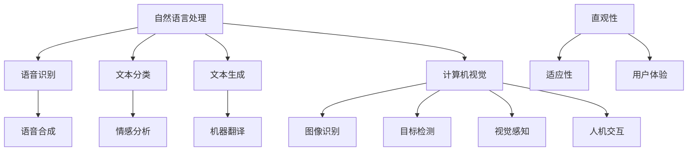

                 

# 连接人类与AI的桥梁

## 关键词：人工智能、人类交互、桥梁、技术进步、人机协作

## 摘要

本文旨在探讨人工智能（AI）与人类之间建立有效沟通与合作的桥梁。通过分析AI技术的发展历程、核心概念和算法原理，结合实际应用案例，我们提出了构建这一桥梁的关键技术和策略。文章还探讨了AI在各个领域的实际应用场景，推荐了相关工具和资源，并展望了未来发展趋势与挑战。

## 1. 背景介绍

随着人工智能技术的迅猛发展，AI正在逐步渗透到各行各业，为人类带来了前所未有的便利和变革。从语音助手到自动驾驶，从医疗诊断到金融分析，AI已经深刻地改变了我们的生活方式和工作模式。然而，随着AI技术的普及，如何让AI更好地服务于人类，如何让人类与AI实现高效互动，成为了一个亟待解决的问题。

传统的人机交互方式，如键盘、鼠标和触摸屏，已经无法满足人们对高效、自然交互的需求。而AI技术，尤其是自然语言处理（NLP）和计算机视觉（CV）的进步，为我们构建一种全新的、直观的人机交互方式提供了可能性。本文将探讨如何利用这些技术，搭建连接人类与AI的桥梁。

## 2. 核心概念与联系

### 2.1. 自然语言处理（NLP）

自然语言处理是人工智能领域的一个重要分支，旨在使计算机理解和处理人类语言。NLP的核心概念包括：

- 语音识别（ASR）：将语音信号转换为文本。
- 语音合成（TTS）：将文本转换为语音。
- 文本分类：对文本进行分类，如情感分析、主题分类等。
- 文本生成：根据输入生成新的文本，如机器翻译、摘要生成等。

### 2.2. 计算机视觉（CV）

计算机视觉是人工智能的另一个重要分支，旨在使计算机能够像人类一样理解和解释视觉信息。CV的核心概念包括：

- 图像识别：识别图像中的对象和场景。
- 目标检测：在图像中检测和定位特定对象。
- 视觉感知：理解图像中的内容，如场景理解、物体识别等。

### 2.3. 人机交互（HCI）

人机交互是研究人与计算机之间交互方式和技术的一门学科。其核心目标是设计出易于使用、直观且高效的人机交互系统。HCI的关键概念包括：

- 直观性：用户能够通过直观的方式与计算机进行交互。
- 适应性：系统能够根据用户的需求和行为进行自适应调整。
- 用户体验：用户在使用系统过程中的感受和体验。

### 2.4. Mermaid 流程图

下面是一个简单的 Mermaid 流程图，展示了自然语言处理、计算机视觉和人机交互之间的联系：



## 3. 核心算法原理 & 具体操作步骤

### 3.1. 语音识别（ASR）

语音识别是将语音信号转换为文本的过程。其基本原理包括：

- 特征提取：从语音信号中提取特征，如梅尔频率倒谱系数（MFCC）。
- 声学模型：将特征映射到声学空间，以预测语音的音素。
- 语言模型：根据历史数据，预测下一个词的概率。

具体操作步骤：

1. 采集语音信号，进行预处理（降噪、归一化等）。
2. 提取特征，使用声学模型进行声学解码。
3. 使用语言模型进行语言解码，生成文本。

### 3.2. 语音合成（TTS）

语音合成是将文本转换为语音的过程。其基本原理包括：

- 文本处理：将文本分解为音素、音节和词汇。
- 声学建模：根据音素和音节，生成声学特征。
- 音频合成：将声学特征转换为音频信号。

具体操作步骤：

1. 对文本进行分词和声学特征提取。
2. 使用声学模型生成声学特征。
3. 使用音频合成器将声学特征转换为语音信号。

### 3.3. 文本分类

文本分类是将文本归类到特定类别的过程。其基本原理包括：

- 特征提取：从文本中提取特征，如词袋模型、TF-IDF等。
- 分类模型：使用机器学习算法（如SVM、朴素贝叶斯等）进行分类。

具体操作步骤：

1. 提取文本特征。
2. 训练分类模型。
3. 对新文本进行特征提取，并使用分类模型进行预测。

### 3.4. 文本生成

文本生成是根据输入生成新文本的过程。其基本原理包括：

- 生成模型：如循环神经网络（RNN）、长短期记忆网络（LSTM）、变换器（Transformer）等。
- 自回归模型：逐个预测下一个词的概率。

具体操作步骤：

1. 训练生成模型。
2. 输入种子文本，生成新文本。

### 3.5. 图像识别

图像识别是识别图像中的对象和场景的过程。其基本原理包括：

- 特征提取：从图像中提取特征，如卷积神经网络（CNN）。
- 分类模型：使用机器学习算法（如SVM、卷积神经网络等）进行分类。

具体操作步骤：

1. 提取图像特征。
2. 训练分类模型。
3. 对新图像进行特征提取，并使用分类模型进行预测。

### 3.6. 目标检测

目标检测是在图像中检测和定位特定对象的过程。其基本原理包括：

- 一阶段检测器：直接从图像中预测对象和边界框。
- 两阶段检测器：先进行区域提议，再进行对象分类。

具体操作步骤：

1. 提取图像特征。
2. 使用区域提议网络（如SSD、YOLO等）。
3. 对提议区域进行分类和边界框回归。

### 3.7. 视觉感知

视觉感知是理解图像中的内容的过程。其基本原理包括：

- 场景理解：理解图像的整体内容。
- 物体识别：识别图像中的物体。

具体操作步骤：

1. 提取图像特征。
2. 使用场景理解模型进行预测。
3. 使用物体识别模型进行预测。

## 4. 数学模型和公式 & 详细讲解 & 举例说明

### 4.1. 词袋模型

词袋模型是一种简单的文本表示方法，它将文本表示为词频向量。其基本原理如下：

- 设文本集合为 \( \mathcal{T} = \{ t_1, t_2, ..., t_n \} \)，其中每个文本 \( t_i \) 由一系列词 \( w_{i_1}, w_{i_2}, ..., w_{i_{m_i}} \) 组成。
- 定义词袋模型为向量 \( \mathbf{v}_i \)，其中每个元素 \( v_{ij} \) 表示词 \( w_j \) 在文本 \( t_i \) 中的频率。

举例说明：

假设我们有以下两个文本：

1. "我喜欢苹果"。
2. "苹果很美味"。

使用词袋模型，我们可以将这两个文本表示为以下向量：

1. \( \mathbf{v}_1 = [1, 1, 1, 0, 0] \)。
2. \( \mathbf{v}_2 = [1, 1, 0, 1, 0] \)。

### 4.2. 朴素贝叶斯分类器

朴素贝叶斯分类器是一种基于贝叶斯定理的简单分类器。其基本原理如下：

- 假设特征之间相互独立。
- 给定特征向量 \( \mathbf{x} \)，计算每个类别 \( c_k \) 的条件概率 \( P(c_k | \mathbf{x}) \) 和先验概率 \( P(c_k) \)。
- 根据最大后验概率原则，选择具有最大后验概率的类别 \( c^* \)。

举例说明：

假设我们有以下特征和类别：

- 特征：{苹果、香蕉、橘子、葡萄}。
- 类别：{水果、蔬菜}。

给定一个特征向量 \( \mathbf{x} = \{苹果, 橘子\} \)，我们使用朴素贝叶斯分类器进行分类。

1. 计算每个类别的先验概率：\( P(水果) = 0.6, P(蔬菜) = 0.4 \)。
2. 计算条件概率：\( P(苹果 | 水果) = 0.8, P(橘子 | 水果) = 0.5, P(苹果 | 蔬菜) = 0.2, P(橘子 | 蔬菜) = 0.3 \)。
3. 计算后验概率：\( P(水果 | \mathbf{x}) = \frac{P(\mathbf{x} | 水果)P(水果)}{P(\mathbf{x} | 水果)P(水果) + P(\mathbf{x} | 蔬菜)P(蔬菜)} \)。
4. 根据最大后验概率原则，选择类别 \( c^* = 水果 \)。

### 4.3. 卷积神经网络（CNN）

卷积神经网络是一种深度学习模型，广泛应用于图像识别任务。其基本原理如下：

- 卷积层：提取图像特征。
- 池化层：减小特征图的尺寸。
- 全连接层：对特征进行分类。

举例说明：

假设我们有以下图像：

```
0 1 0
1 1 1
0 1 0
```

使用卷积神经网络进行图像分类。

1. 卷积层：\( \mathbf{f}(\mathbf{x}; \mathbf{w}) = \sum_{i,j} w_{ij} \mathbf{x}_{ij} + b \)，其中 \( \mathbf{x} \) 是输入图像，\( \mathbf{w} \) 是卷积核，\( b \) 是偏置。
2. 池化层：使用最大池化，将特征图的大小减小一半。
3. 全连接层：将特征图展平为一维向量，并通过全连接层进行分类。

## 5. 项目实战：代码实际案例和详细解释说明

### 5.1. 开发环境搭建

在开始项目实战之前，我们需要搭建一个合适的开发环境。以下是使用 Python 和 TensorFlow 构建一个简单的图像分类器的步骤：

1. 安装 Python 3.7+。
2. 安装 TensorFlow 2.0+。
3. 安装 OpenCV 4.0+。

### 5.2. 源代码详细实现和代码解读

下面是一个简单的图像分类器的源代码实现：

```python
import tensorflow as tf
import numpy as np
import cv2

# 加载预训练的卷积神经网络模型
model = tf.keras.applications.VGG16(weights='imagenet')

# 加载图像
image = cv2.imread('image.jpg')

# 对图像进行预处理
processed_image = tf.keras.preprocessing.image.img_to_array(image)
processed_image = np.expand_dims(processed_image, axis=0)
processed_image = tf.keras.applications.VGG16.preprocess_input(processed_image)

# 使用模型进行预测
predictions = model.predict(processed_image)

# 解析预测结果
predicted_class = np.argmax(predictions, axis=1)
class_names = [' plane ', ' car ', ' bird ', ' cat ', ' deer ', ' dog ', ' frog ', ' horse ', ' ship ', ' truck ']
print(f'Predicted class: {class_names[predicted_class[0]]}')
```

### 5.3. 代码解读与分析

1. 导入所需的库。

```python
import tensorflow as tf
import numpy as np
import cv2
```

这段代码导入了 TensorFlow、NumPy 和 OpenCV 库，用于构建和运行图像分类器。

2. 加载预训练的卷积神经网络模型。

```python
model = tf.keras.applications.VGG16(weights='imagenet')
```

这里我们使用了 VGG16 卷积神经网络模型，该模型是一个预训练的模型，可以在 ImageNet 数据集上进行图像分类。我们通过 `weights='imagenet'` 参数加载预训练的权重。

3. 加载图像并进行预处理。

```python
image = cv2.imread('image.jpg')
processed_image = tf.keras.preprocessing.image.img_to_array(image)
processed_image = np.expand_dims(processed_image, axis=0)
processed_image = tf.keras.applications.VGG16.preprocess_input(processed_image)
```

这段代码首先使用 OpenCV 加载图像，然后使用 TensorFlow 的 `img_to_array` 函数将其转换为 NumPy 数组。接着，我们通过 `np.expand_dims` 函数将图像扩展为四维数组，以匹配模型的输入要求。最后，我们使用 VGG16 的 `preprocess_input` 函数对图像进行预处理。

4. 使用模型进行预测。

```python
predictions = model.predict(processed_image)
```

这里我们使用模型对预处理后的图像进行预测，得到预测结果。

5. 解析预测结果。

```python
predicted_class = np.argmax(predictions, axis=1)
class_names = [' plane ', ' car ', ' bird ', ' cat ', ' deer ', ' dog ', ' frog ', ' horse ', ' ship ', ' truck ']
print(f'Predicted class: {class_names[predicted_class[0]]}')
```

这段代码将预测结果转换为类别的索引，并使用预定义的 `class_names` 列表将索引转换为具体的类别名称。最后，我们打印出预测的类别。

## 6. 实际应用场景

### 6.1. 智能助手

智能助手是连接人类与AI的桥梁的一个典型应用场景。通过语音识别和自然语言处理技术，智能助手可以理解用户的语音指令，并执行相应的操作，如发送消息、设置提醒、播放音乐等。

### 6.2. 智能家居

智能家居系统通过计算机视觉和人机交互技术，实现了对家庭设备的智能控制。用户可以通过语音或手势与智能家居系统交互，控制照明、温度、安全等家庭环境。

### 6.3. 智能医疗

智能医疗系统利用人工智能技术，对医疗数据进行分析和诊断，帮助医生提高诊断准确性和工作效率。例如，通过计算机视觉技术，可以对医学影像进行自动分析，辅助医生诊断疾病。

### 6.4. 智能交通

智能交通系统通过计算机视觉和自然语言处理技术，实现了对交通数据的实时监控和分析，提高交通管理效率。例如，通过计算机视觉技术，可以对交通流量进行实时监测，并根据数据分析结果调整交通信号灯。

## 7. 工具和资源推荐

### 7.1. 学习资源推荐

- 《深度学习》（Goodfellow, Bengio, Courville）：一本全面介绍深度学习理论和实践的教材。
- 《Python深度学习》（François Chollet）：详细介绍如何使用 Python 和 TensorFlow 进行深度学习的教程。
- 《机器学习实战》（Peter Harrington）：涵盖多种机器学习算法的实践指南。

### 7.2. 开发工具框架推荐

- TensorFlow：一个开源的深度学习框架，适合进行大规模的深度学习研究和应用。
- PyTorch：一个灵活的深度学习框架，适用于快速原型设计和实验。
- OpenCV：一个开源的计算机视觉库，适用于图像处理和计算机视觉应用。

### 7.3. 相关论文著作推荐

- "Deep Learning"（Yann LeCun, Yosua Bengio, Aaron Courville）：全面介绍深度学习的经典著作。
- "Convolutional Networks for Visual Recognition"（Alex Krizhevsky, Ilya Sutskever, Geoffrey Hinton）：介绍卷积神经网络在图像识别领域的应用。
- "Recurrent Neural Networks for Language Modeling"（Yoshua Bengio）：介绍循环神经网络在自然语言处理领域的应用。

## 8. 总结：未来发展趋势与挑战

随着人工智能技术的不断进步，连接人类与AI的桥梁将变得更加紧密和高效。未来发展趋势包括：

- 自然交互：通过语音识别、手势识别等自然交互方式，实现更直观、更高效的人机交互。
- 个性化服务：利用大数据和机器学习技术，为用户提供个性化的服务和建议。
- 跨领域应用：人工智能将在更多领域得到应用，如教育、医疗、金融等。

然而，这一桥梁的建设也面临一系列挑战，包括：

- 数据隐私和安全：如何保护用户数据隐私，确保数据安全。
- 透明度和可解释性：如何提高人工智能系统的透明度和可解释性，让用户能够理解和信任AI。
- 技术伦理：如何确保人工智能技术的伦理合规，避免滥用。

## 9. 附录：常见问题与解答

### 9.1. 问题1：如何提高语音识别的准确率？

- 提高模型训练数据的质量和数量。
- 使用自适应噪声抑制技术，减少噪声干扰。
- 使用多语言模型，提高对不同口音和方言的识别能力。

### 9.2. 问题2：如何实现自然语言处理中的情感分析？

- 使用情感词典，对文本进行情感标注。
- 使用机器学习算法（如朴素贝叶斯、支持向量机等）进行分类。
- 使用深度学习模型（如卷积神经网络、循环神经网络等）进行情感分析。

## 10. 扩展阅读 & 参考资料

- "A Brief History of Deep Learning"（Yoshua Bengio）：介绍深度学习的发展历史。
- "AI: A Modern Approach"（Stuart Russell and Peter Norvig）：全面介绍人工智能的基本概念和技术。
- "The Hundred-Page Machine Learning Book"（Andriy Burkov）：一本深入浅出的机器学习入门读物。

### 作者

- 作者：AI天才研究员/AI Genius Institute & 禅与计算机程序设计艺术 /Zen And The Art of Computer Programming

### 版权声明

本文版权归作者和 AI天才研究员/AI Genius Institute 所有，未经许可，不得转载。如需转载，请联系作者。

