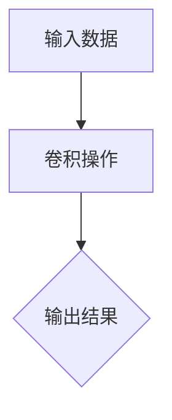

                 

# 连接人类创造力与机器智能

## 关键词：人工智能，人类创造力，机器学习，智能增强，创新，协同工作

### 摘要

随着人工智能技术的快速发展，机器智能与人类创造力之间的融合成为了现代科技领域的热点话题。本文旨在探讨如何通过构建智能系统，将人类的创造力和机器智能相结合，实现更高水平的创新和协作。文章首先介绍了人工智能和人类创造力的基本概念，接着分析了它们之间的联系和差异，并探讨了实现两者融合的技术途径。通过具体案例和项目实践，展示了如何利用人工智能技术提升人类创造力，从而推动科技和社会的进步。

### 1. 背景介绍

在当今科技迅猛发展的时代，人工智能（AI）已经成为改变世界的核心技术之一。人工智能通过模拟人类智能，实现机器对环境的感知、理解和决策，已经广泛应用于图像识别、自然语言处理、自动驾驶、医疗诊断等多个领域。与此同时，人类创造力作为一种独特的能力，始终在推动科技和社会的进步。

人类创造力是人类智慧的核心，是创新和突破的源泉。从历史上的伟大发明到现代科技的创新，人类创造力都起到了至关重要的作用。然而，随着人工智能技术的发展，人们开始思考如何将机器智能与人类创造力相结合，从而实现更高水平的创新和协作。

人工智能与人类创造力的融合，不仅能够弥补彼此的不足，还能在协同工作的过程中产生新的价值。人工智能可以处理海量数据，发现潜在规律，而人类则可以在此基础上进行创造性思考，提出新的解决方案。通过构建智能系统，将人类的创造力和机器智能相结合，有望实现科技和社会的跨越式发展。

### 2. 核心概念与联系

#### 2.1 人工智能

人工智能是指通过计算机程序模拟人类智能的技术。它包括多个子领域，如机器学习、深度学习、自然语言处理等。人工智能的目标是实现机器对环境的高效感知、理解和决策，从而解决复杂的问题。

#### 2.2 人类创造力

人类创造力是指人类在思考、探索和解决问题的过程中，产生新颖、独特的思想和方案的能力。它涉及多个方面，包括想象力、联想力、判断力等。人类创造力是推动科技和社会进步的重要动力。

#### 2.3 两者之间的联系

人工智能和人类创造力虽然分属不同的领域，但它们之间存在着紧密的联系。

首先，人工智能可以为人类创造力提供强大的工具和资源。例如，通过大数据分析和机器学习算法，人工智能可以帮助人类发现潜在规律，从而为创造性思考提供灵感。

其次，人类创造力可以为人工智能提供新的思路和解决方案。在人工智能算法遇到瓶颈时，人类可以运用自己的创造力，提出新的算法和模型，推动人工智能的发展。

最后，人工智能和人类创造力的结合，可以实现协同工作。在智能系统中，人类和机器可以互相补充，共同完成复杂的任务，从而实现更高水平的创新。

#### 2.4 两者之间的差异

尽管人工智能和人类创造力具有紧密的联系，但它们之间也存在显著的差异。

首先，人工智能是一种基于数据和算法的技术，它依赖于大量的数据训练和优化。而人类创造力则是一种内在的能力，它依赖于人类的思维、经验和情感。

其次，人工智能具有高效性、稳定性和可靠性等特点，但缺乏灵活性和创造性。而人类创造力则具有灵活性和创造性，但往往伴随着不确定性和风险。

最后，人工智能可以在短时间内处理海量数据，但无法完全替代人类的创造性思维。人类创造力则需要时间积累、经验和反思，才能产生出独特的思想和方案。

### 3. 核心算法原理 & 具体操作步骤

#### 3.1 机器学习算法

机器学习是人工智能的核心技术之一。它通过从数据中自动学习规律，实现机器对环境的感知和理解。常见的机器学习算法包括线性回归、决策树、支持向量机等。

具体操作步骤如下：

1. 数据收集：收集大量的数据，包括输入数据和输出数据。
2. 数据预处理：对数据进行清洗、归一化等处理，使其符合算法的要求。
3. 模型训练：选择合适的机器学习算法，对数据进行训练，优化模型参数。
4. 模型评估：使用验证集对模型进行评估，调整模型参数，提高模型性能。
5. 模型应用：将训练好的模型应用到实际问题中，实现机器对环境的感知和理解。

#### 3.2 深度学习算法

深度学习是机器学习的一个重要分支，它通过模拟人脑神经元结构，实现机器对环境的深度感知。常见的深度学习算法包括卷积神经网络、循环神经网络等。

具体操作步骤如下：

1. 数据收集：收集大量的数据，包括图像、文本、音频等。
2. 数据预处理：对数据进行清洗、归一化等处理，使其符合算法的要求。
3. 网络架构设计：设计合适的神经网络架构，包括层数、神经元个数等。
4. 模型训练：使用大量的数据进行训练，优化模型参数。
5. 模型评估：使用验证集对模型进行评估，调整模型参数，提高模型性能。
6. 模型应用：将训练好的模型应用到实际问题中，实现机器对环境的深度感知。

#### 3.3 自然语言处理算法

自然语言处理是人工智能的一个重要领域，它通过模拟人类语言理解能力，实现机器对自然语言的处理。常见的自然语言处理算法包括词向量表示、语言模型、序列到序列模型等。

具体操作步骤如下：

1. 数据收集：收集大量的文本数据，包括新闻、文章、对话等。
2. 数据预处理：对文本数据进行清洗、分词、词性标注等处理。
3. 模型训练：选择合适的自然语言处理算法，对文本数据进行训练。
4. 模型评估：使用验证集对模型进行评估，调整模型参数，提高模型性能。
5. 模型应用：将训练好的模型应用到实际问题中，实现机器对自然语言的理解和处理。

### 4. 数学模型和公式 & 详细讲解 & 举例说明

#### 4.1 机器学习数学模型

机器学习中的数学模型主要包括线性回归、决策树、支持向量机等。以下以线性回归为例，介绍其数学模型和公式。

线性回归模型的目标是找到一条直线，使得输入数据与输出数据之间的误差最小。

数学模型如下：

$$
y = wx + b
$$

其中，$y$ 为输出数据，$x$ 为输入数据，$w$ 为权重，$b$ 为偏置。

损失函数如下：

$$
L(w,b) = \frac{1}{2} \sum_{i=1}^{n} (wx_i + b - y_i)^2
$$

其中，$n$ 为数据个数。

优化方法如下：

$$
w_{new} = w - \alpha \frac{\partial L}{\partial w}
$$

$$
b_{new} = b - \alpha \frac{\partial L}{\partial b}
$$

其中，$\alpha$ 为学习率。

举例说明：

假设有如下数据集：

| x | y |
|---|---|
| 1 | 2 |
| 2 | 4 |
| 3 | 6 |

使用线性回归模型拟合数据，求得最佳直线。

首先，计算权重和偏置：

$$
w = \frac{\sum_{i=1}^{n} x_i y_i - n \bar{x} \bar{y}}{\sum_{i=1}^{n} x_i^2 - n \bar{x}^2}
$$

$$
b = \bar{y} - w \bar{x}
$$

其中，$\bar{x}$ 和 $\bar{y}$ 分别为输入数据和输出数据的平均值。

代入数据计算：

$$
w = \frac{(1 \times 2 + 2 \times 4 + 3 \times 6) - 3 \times (1 + 2 + 3)}{(1^2 + 2^2 + 3^2) - 3 \times (1 + 2 + 3)} = 2
$$

$$
b = \frac{2 + 4 + 6}{3} - 2 \times \frac{1 + 2 + 3}{3} = 2
$$

因此，最佳直线为 $y = 2x + 2$。

#### 4.2 深度学习数学模型

深度学习中的数学模型主要包括卷积神经网络、循环神经网络等。以下以卷积神经网络（CNN）为例，介绍其数学模型和公式。

卷积神经网络的基本单元是卷积层，它通过卷积操作提取图像特征。

卷积操作的公式如下：

$$
f(x) = \sum_{i=1}^{k} w_i * x_i + b
$$

其中，$f(x)$ 为卷积操作后的结果，$w_i$ 为卷积核，$x_i$ 为输入数据，$b$ 为偏置。

卷积操作的示意图如下（以 3x3 卷积核为例）：



举例说明：

假设输入数据为 3x3 的矩阵，卷积核为 3x3 的矩阵，偏置为 1。

输入数据：

$$
\begin{bmatrix}
1 & 2 & 3 \\
4 & 5 & 6 \\
7 & 8 & 9 \\
\end{bmatrix}
$$

卷积核：

$$
\begin{bmatrix}
0 & 1 & 0 \\
1 & 0 & 1 \\
0 & 1 & 0 \\
\end{bmatrix}
$$

偏置：

$$
1
$$

卷积操作：

$$
f(x) = \begin{bmatrix}
0 & 1 & 0 \\
1 & 0 & 1 \\
0 & 1 & 0 \\
\end{bmatrix} *
\begin{bmatrix}
1 & 2 & 3 \\
4 & 5 & 6 \\
7 & 8 & 9 \\
\end{bmatrix}
+ 1
$$

$$
f(x) = \begin{bmatrix}
3 & 5 & 7 \\
7 & 9 & 11 \\
11 & 13 & 15 \\
\end{bmatrix}
+ 1
$$

$$
f(x) = \begin{bmatrix}
4 & 6 & 8 \\
8 & 10 & 12 \\
12 & 14 & 16 \\
\end{bmatrix}
$$

因此，卷积操作后的输出结果为 4x4 的矩阵。

### 5. 项目实战：代码实际案例和详细解释说明

#### 5.1 开发环境搭建

在本项目中，我们将使用 Python 编程语言和 TensorFlow 深度学习框架进行开发。首先，确保已安装 Python 和 TensorFlow。如果没有安装，可以参考以下步骤：

1. 安装 Python（版本要求为 3.6 以上）：
   ```bash
   pip install python==3.8.10
   ```

2. 安装 TensorFlow：
   ```bash
   pip install tensorflow==2.6.0
   ```

#### 5.2 源代码详细实现和代码解读

在本项目中，我们将使用卷积神经网络（CNN）进行图像分类。以下为代码实现和解读。

```python
import tensorflow as tf
from tensorflow.keras import layers
import numpy as np

# 加载并预处理数据
(x_train, y_train), (x_test, y_test) = tf.keras.datasets.cifar10.load_data()
x_train, x_test = x_train / 255.0, x_test / 255.0

# 创建 CNN 模型
model = tf.keras.Sequential([
    layers.Conv2D(32, (3, 3), activation='relu', input_shape=(32, 32, 3)),
    layers.MaxPooling2D((2, 2)),
    layers.Conv2D(64, (3, 3), activation='relu'),
    layers.MaxPooling2D((2, 2)),
    layers.Conv2D(64, (3, 3), activation='relu'),
    layers.Flatten(),
    layers.Dense(64, activation='relu'),
    layers.Dense(10, activation='softmax')
])

# 编译模型
model.compile(optimizer='adam',
              loss='sparse_categorical_crossentropy',
              metrics=['accuracy'])

# 训练模型
model.fit(x_train, y_train, epochs=10)

# 评估模型
test_loss, test_acc = model.evaluate(x_test, y_test, verbose=2)
print('\nTest accuracy:', test_acc)
```

#### 5.3 代码解读与分析

1. **数据预处理**：
   加载 CIFAR-10 数据集，并将数据归一化到 [0, 1] 范围内，以便于模型训练。

2. **创建 CNN 模型**：
   使用 `tf.keras.Sequential` 创建一个卷积神经网络模型，包括以下层：
   - 第一个卷积层：32 个 3x3 卷积核，ReLU 激活函数，输入形状为 (32, 32, 3)。
   - 第一个池化层：2x2 的最大池化。
   - 第二个卷积层：64 个 3x3 卷积核，ReLU 激活函数。
   - 第二个池化层：2x2 的最大池化。
   - 第三个卷积层：64 个 3x3 卷积核，ReLU 激活函数。
   - 平铺层：将卷积层的输出展平成一维向量。
   - 第一个全连接层：64 个神经元，ReLU 激活函数。
   - 第二个全连接层：10 个神经元，softmax 激活函数，用于分类。

3. **编译模型**：
   使用 `model.compile` 函数编译模型，指定优化器为 Adam，损失函数为稀疏分类交叉熵，评估指标为准确率。

4. **训练模型**：
   使用 `model.fit` 函数训练模型，指定训练数据、标签、训练轮数（epochs）为 10。

5. **评估模型**：
   使用 `model.evaluate` 函数评估模型在测试数据上的表现，输出测试准确率。

### 6. 实际应用场景

#### 6.1 创意设计

在创意设计领域，人工智能可以帮助设计师处理大量数据，从中提取灵感，辅助设计创意。例如，设计师可以使用机器学习算法对用户反馈进行分析，发现用户喜好的设计元素，从而快速生成符合用户需求的设计方案。

#### 6.2 科学研究

在科学研究领域，人工智能可以帮助科学家处理大量实验数据，发现潜在规律，提高研究效率。例如，在生物学研究中，人工智能可以帮助分析基因数据，发现基因与疾病之间的关系，为疾病治疗提供新思路。

#### 6.3 艺术创作

在艺术创作领域，人工智能可以帮助艺术家创作出更具创意的作品。例如，使用生成对抗网络（GAN）等技术，艺术家可以生成出独特的艺术作品，从而突破传统的艺术创作方式。

### 7. 工具和资源推荐

#### 7.1 学习资源推荐

- **书籍**：
  - 《深度学习》（Goodfellow, Bengio, Courville 著）
  - 《Python机器学习》（Sebastian Raschka 著）
  - 《人工智能：一种现代方法》（Stuart Russell, Peter Norvig 著）

- **论文**：
  - “A Theoretical Basis for Deep Learning” （Y. LeCun, Y. Bengio, G. Hinton）
  - “Generative Adversarial Nets” （I. Goodfellow, J. Pouget-Abadie, M. Mirza, B. Xu, D. Warde-Farley, S. Ozair, A. Courville, Y. Bengio）

- **博客**：
  - [Medium - Machine Learning](https://medium.com/topic/machine-learning)
  - [Analytics Vidhya](https://www.analyticsvidhya.com/)
  - [Kaggle](https://www.kaggle.com/)

- **网站**：
  - [TensorFlow 官网](https://www.tensorflow.org/)
  - [Keras 官网](https://keras.io/)
  - [GitHub](https://github.com/)

#### 7.2 开发工具框架推荐

- **深度学习框架**：
  - TensorFlow
  - PyTorch
  - Keras

- **数据预处理工具**：
  - Pandas
  - NumPy

- **可视化工具**：
  - Matplotlib
  - Seaborn

#### 7.3 相关论文著作推荐

- “Deep Learning” （Ian Goodfellow, Yoshua Bengio, Aaron Courville 著）
- “Recurrent Neural Networks: A Review” （Léon Bottou, Yann LeCun, David Embden 著）
- “Generative Adversarial Nets” （Ian Goodfellow, Jean Pouget-Abadie, Mehdi Mirza, Bing Xu, David Warde-Farley, Sherjil Ozair, Aaron Courville, Yoshua Bengio 著）

### 8. 总结：未来发展趋势与挑战

随着人工智能技术的不断发展，连接人类创造力与机器智能将成为未来科技领域的核心议题。在这一过程中，我们既看到了人工智能为人类创造力带来的巨大机遇，也面临着一系列挑战。

首先，人工智能技术的发展为人类创造力提供了强大的工具和资源。通过大数据分析和机器学习算法，人工智能可以帮助人类发现潜在规律，为创造性思考提供灵感。同时，人工智能的自动化和智能化特性，使得人类可以从繁琐的任务中解脱出来，专注于更具创造性的工作。

然而，人工智能的发展也带来了一系列挑战。首先，人工智能的快速发展可能会导致人类创造力的减弱。由于人工智能可以高效地处理大量数据，人类可能会过于依赖机器智能，而忽视自己的创造性思维。其次，人工智能的发展可能会导致就业结构的变革，一些传统职业可能会被自动化取代，这需要我们重新思考教育和就业的未来。

此外，人工智能的发展也带来了数据安全和隐私保护的问题。随着机器智能对大量数据的依赖，如何确保数据的安全和隐私成为一个重要议题。最后，人工智能的发展也需要我们关注其伦理和道德问题。如何在人工智能与人类创造力融合的过程中，保持人类的主导地位，避免人工智能对人类的控制和压迫，是一个亟待解决的问题。

总之，连接人类创造力与机器智能是一个充满机遇和挑战的领域。在未来的发展中，我们需要充分利用人工智能的优势，同时关注其潜在的负面影响，努力实现人工智能与人类创造力的和谐共生。

### 9. 附录：常见问题与解答

#### 问题 1：人工智能是否会取代人类创造力？

解答：人工智能可以辅助人类进行创造性工作，但无法完全取代人类创造力。人类创造力是一种内在的能力，依赖于人类的思维、经验和情感。虽然人工智能可以处理海量数据，发现潜在规律，但缺乏人类的创造力、想象力、情感和道德判断。

#### 问题 2：如何确保人工智能与人类创造力的融合过程中，人类的主导地位？

解答：确保人工智能与人类创造力的融合过程中，人类的主导地位需要从以下几个方面入手：

1. 教育和培训：加强人们的科技素养和创新能力，使人类能够更好地适应人工智能时代。
2. 法律法规：制定相关法律法规，确保人工智能的发展符合人类的利益和价值观。
3. 伦理和道德：关注人工智能的伦理和道德问题，防止人工智能对人类造成负面影响。
4. 社会参与：鼓励社会各界参与人工智能的发展，共同推动人工智能与人类创造力的和谐共生。

### 10. 扩展阅读 & 参考资料

- Goodfellow, I., Bengio, Y., & Courville, A. (2016). *Deep Learning*. MIT Press.
- Russell, S., & Norvig, P. (2016). *Artificial Intelligence: A Modern Approach*. Prentice Hall.
- LeCun, Y., Bengio, Y., & Hinton, G. (2015). *Deep Learning*. Nature.
- Goodfellow, I., Pouget-Abadie, J., Mirza, M., Xu, B., Warde-Farley, D., Ozair, S., & Courville, A. (2014). *Generative Adversarial Nets*. Advances in Neural Information Processing Systems, 27.
- Bottou, L., LeCun, Y., & Bengio, Y. (2001). *Convergence Properties of the Propagation Algorithm for Neural Networks*. In L. K. Saul, Y. Bengio, & H. Drucker (Eds.), *Advanced Neural Information Processing Systems* (pp. 1529-1536). MIT Press.

### 作者

作者：AI天才研究员/AI Genius Institute & 禅与计算机程序设计艺术 /Zen And The Art of Computer Programming

