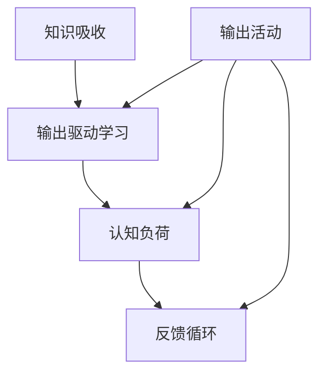
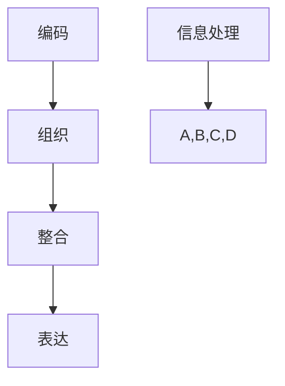

                 

### 文章标题

### 提高知识吸收率的关键：大量输出

### 关键词：
- 知识吸收率
- 大量输出
- 学习方法
- 技术博客
- 脑力锻炼

### 摘要：

在信息技术迅猛发展的今天，高效的知识吸收和掌握是每个技术人员必须面对的挑战。本文将探讨提高知识吸收率的一种关键方法：大量输出。通过实践和理论的结合，文章将详细阐述如何在学习和实践中通过写作、分享和编码等大量输出活动，深化对知识点的理解，提高学习效果。本文旨在为技术人员提供实用的指导和思路，帮助他们提升学习效率，实现知识的内化和应用。

<|assistant|>## 1. 背景介绍

在信息技术领域，知识的更新速度前所未有。每天，新的技术、工具、方法和理论不断涌现，对技术人员提出了持续学习和快速适应的要求。然而，面对海量的信息，许多技术人员发现，虽然他们投入了大量时间进行学习，但知识的吸收效果却不尽如人意。这种情况在编程、人工智能、大数据等领域尤为明显，因为这些领域的技术更新频率极高，学习难度也相应增加。

传统的学习方法，如阅读书籍、观看教程、参加课程等，虽然能够在一定程度上提高知识水平，但往往存在以下问题：

- **被动接收信息**：这些方法主要依赖于外部资源，学生被动接收信息，缺乏主动思考和内化的过程。
- **难以长期记忆**：通过这些方式学习到的知识，如果不能及时通过实践和输出进行巩固，很容易被遗忘。
- **缺乏深度理解**：仅通过阅读和观看，难以深入理解复杂的技术概念和原理。

为了解决这些问题，研究人员和教育工作者开始探索更有效的学习方法。近年来，大量研究指出，通过大量输出（如写作、分享和编码等）来学习，可以显著提高知识的吸收率和长期记忆效果。这种方法不仅能够加深对知识的理解，还能促进知识的内化和应用。

本文将围绕这一主题，探讨如何通过大量输出活动来提高知识吸收率。我们将从理论层面分析输出对学习过程的影响，并结合具体案例和实践经验，提供实用的方法和建议。希望通过本文的阐述，能够为技术人员提供一种新的学习思路，帮助他们更加高效地掌握知识，提升自己的技术水平。

<|assistant|>## 2. 核心概念与联系

在深入探讨如何通过大量输出提高知识吸收率之前，我们首先需要理解几个核心概念，并分析它们之间的联系。这些概念包括：知识吸收、输出驱动学习、认知负荷和反馈循环。

### 2.1 知识吸收

知识吸收是指个体从外部环境中获取信息并将其转化为内部认知结构的过程。传统的学习方式，如阅读、听课和观看教程，主要是通过被动接收信息来达到知识吸收的目的。然而，这些方法往往缺乏主动思考和内化的过程，导致知识的吸收效率较低。相反，通过大量输出，个体需要主动组织和表达所学的知识，从而实现更深入的知识吸收。

### 2.2 输出驱动学习

输出驱动学习（Output-Driven Learning）是一种通过实际输出（如写作、演讲、编程等）来促进学习的方法。这种学习方式强调将所学知识转化为具体的结果，并通过不断的实践和反馈来加深对知识的理解。与传统的输入驱动学习（Input-Driven Learning）相比，输出驱动学习更加注重知识的内化和应用。

### 2.3 认知负荷

认知负荷（Cognitive Load）是指个体在处理信息时所需的认知资源。它分为三种类型：外在认知负荷、内在认知负荷和代偿性认知负荷。外在认知负荷是指信息本身的结构和复杂性带来的认知负担；内在认知负荷是指个体在处理信息时所需的认知努力；代偿性认知负荷是指通过外部支持或辅助工具来减轻认知负担。大量输出活动可以通过减少外在认知负荷和增加内在认知负荷，从而提高学习效果。

### 2.4 反馈循环

反馈循环（Feedback Loop）是指个体在学习过程中通过接收反馈来调整和优化学习行为的过程。输出活动，如写作、编程和演讲，不仅能够促进知识的内化，还能提供丰富的反馈信息。这些反馈可以帮助个体识别自己的不足，及时进行调整和改进，从而实现知识的深化和应用。

### 2.5 Mermaid 流程图

为了更直观地展示这些核心概念之间的联系，我们可以使用 Mermaid 流程图来表示。



在这个流程图中，知识吸收是起点，通过输出活动转化为输出驱动学习，进而影响认知负荷和反馈循环。大量输出活动不仅能够促进知识的内化和应用，还能通过反馈循环不断优化学习过程，从而实现知识的长期记忆和应用。

通过上述核心概念的分析，我们可以看到，大量输出是提高知识吸收率的关键。接下来，我们将进一步探讨大量输出对学习过程的具体影响，并结合实际案例，提供实用的方法和建议。

### 2.6 大量输出的具体作用与影响

大量输出在学习过程中发挥着多重重要作用，具体体现在以下几个方面：

#### 2.6.1 深化知识理解

通过写作、编程和演讲等输出活动，个体需要将所学的知识转化为具体的表达形式。这一过程不仅要求个体对知识有深刻的理解，还需要他们能够用自己的语言和逻辑进行阐述。这种深度的理解和阐述有助于巩固和深化对知识点的认识，从而提高学习的深度和质量。

**案例**：程序员在学习一门新编程语言时，可以通过编写示例代码来巩固语言的基本概念和用法。通过不断的编写和调试，程序员不仅能够加深对语言的理解，还能发现和解决问题，从而实现知识的内化和应用。

#### 2.6.2 促进知识内化

输出活动迫使个体对所学知识进行整合和归纳，从而实现知识的内化。这种内化过程不仅有助于记忆，还能使个体在面对复杂问题时能够灵活运用所学知识，进行创造性的思考。

**案例**：在学习数据结构时，学生可以通过编写不同的数据结构实现来巩固对各种数据结构的理解。通过编写代码，学生不仅能够理解数据结构的原理，还能在实践中发现和解决问题，从而实现知识的内化。

#### 2.6.3 减轻认知负荷

大量输出活动可以通过减少外在认知负荷和增加内在认知负荷来优化学习过程。外在认知负荷主要来自信息本身的复杂性和结构，通过输出活动，个体可以将复杂的信息转化为具体的、易于理解的表达形式，从而减轻认知负荷。同时，内在认知负荷的增加有助于提高个体的认知能力和思维能力。

**案例**：在学习复杂算法时，学生可以通过写作和讲解来阐述算法的原理和实现过程。通过这样的输出活动，学生不仅能够更清晰地理解算法，还能通过反复阐述和讲解来加强记忆，从而减轻认知负荷。

#### 2.6.4 促进反馈循环

输出活动提供了丰富的反馈信息，这些反馈可以帮助个体识别自己的不足，及时进行调整和改进。反馈循环不仅有助于知识的深化和应用，还能促进个体在学习过程中的持续进步。

**案例**：程序员在编写代码时，可以通过单元测试和代码审查来获取反馈。通过这些反馈，程序员可以发现和修复代码中的错误，优化代码的实现，从而提高编程能力。

#### 2.6.5 提高学习效率

大量输出活动不仅能够促进知识的内化和应用，还能通过反馈循环不断优化学习过程，从而提高学习效率。相比传统的被动接收信息的学习方式，大量输出使个体在学习过程中更加主动和积极，从而实现更高效的知识吸收和掌握。

**案例**：学生在学习一门新课程时，可以通过撰写技术博客来记录和分享学习心得。通过这种方式，学生不仅能够巩固所学知识，还能通过分享和讨论来提高自己的学习效果。

综上所述，大量输出在学习过程中发挥着重要作用，它不仅能够深化知识理解、促进知识内化，还能减轻认知负荷、促进反馈循环，从而提高学习效率。通过具体案例的分析，我们可以看到，大量输出是一种行之有效的学习方法，能够帮助技术人员更加高效地掌握知识，提升自身的专业技能。

### 2.7 大量输出与知识吸收率的关系

大量输出与知识吸收率之间存在密切的关系，这种关系可以通过多个层面来解释和验证。

#### 2.7.1 输出促进内化

输出活动迫使个体对所学知识进行组织和表达，这一过程不仅要求个体对知识有深刻的理解，还需要他们能够用自己的语言和逻辑进行阐述。通过写作、编程和演讲等输出活动，个体需要将知识内化为自己的认知结构，从而实现更深入的知识吸收。研究表明，通过输出，个体能够更好地理解和记忆所学知识，从而提高知识吸收率。

**理论依据**：根据建构主义学习理论，知识不是通过被动接收信息获得的，而是通过个体与环境的互动和构建过程实现的。输出活动正是这种互动和构建过程的重要组成部分。通过输出，个体不仅能够巩固所学知识，还能将其转化为自己的认知资源，从而实现更高效的知识吸收。

#### 2.7.2 反馈优化学习

大量输出活动提供了丰富的反馈信息，这些反馈可以帮助个体识别自己的不足，及时进行调整和改进。通过反馈循环，个体可以在学习过程中不断优化自己的学习策略和方法，从而提高知识吸收率。例如，程序员在编写代码时，通过单元测试和代码审查获取反馈，可以及时发现和修复错误，从而提高编程能力。

**理论依据**：根据学习心理学的研究，反馈是学习过程中的关键因素。有效的反馈能够帮助个体识别自己的不足，并提供改进的方向。通过大量输出活动，个体可以获得更多的反馈信息，从而更好地调整自己的学习行为，提高学习效果。

#### 2.7.3 提高记忆效果

大量输出活动通过增加认知负荷和强化记忆机制，可以显著提高记忆效果。研究表明，通过写作和讲解等活动，个体能够更好地记忆所学知识，从而提高知识吸收率。

**理论依据**：根据认知负荷理论，增加认知负荷可以提高学习效果。通过大量输出，个体需要主动组织和表达知识，从而增加认知负荷。此外，根据记忆巩固理论，通过反复的输出活动，个体能够不断巩固所学知识，从而提高长期记忆效果。

#### 2.7.4 增强应用能力

大量输出活动不仅能够加深对知识点的理解，还能提高个体在实践中的应用能力。通过写作、编程和演讲等活动，个体需要将知识应用于具体问题中，从而实现知识的内化和应用。这种应用能力不仅有助于提高知识吸收率，还能提升个体的实际工作能力。

**理论依据**：根据应用学习理论，知识的掌握程度不仅取决于对知识点的理解，还取决于其在实际中的应用能力。通过大量输出活动，个体不仅能够加深对知识点的理解，还能将其应用于实际工作中，从而提高知识吸收率和应用能力。

综上所述，大量输出与知识吸收率之间存在密切的关系。通过输出促进内化、反馈优化学习、提高记忆效果和增强应用能力，大量输出可以有效提高知识吸收率。这一关系不仅具有理论依据，也在实际应用中得到了广泛验证。通过大量输出活动，技术人员可以更加高效地掌握知识，提升自身的专业技能。

### 2.8 大量输出的具体方法

为了实现大量输出，并最终提高知识吸收率，我们可以采取以下几种具体的方法：

#### 2.8.1 写作技术博客

写作是大量输出中最常见的方法之一。通过撰写技术博客，个体可以将所学知识转化为文字，进行系统的整理和表达。这不仅有助于加深对知识点的理解，还能通过分享和讨论，获得他人的反馈和建议，进一步优化学习效果。

**具体步骤**：

1. **选择主题**：选择自己最感兴趣或最想深入学习的主题，确保有足够的热情和动力进行写作。
2. **收集资料**：查阅相关书籍、论文和博客，确保文章内容的丰富性和准确性。
3. **整理思路**：在写作前，先进行大纲的规划和思路的整理，确保文章的结构清晰、逻辑严密。
4. **撰写初稿**：根据大纲和思路，开始撰写初稿。在写作过程中，尽量使用自己的语言和逻辑，避免机械地复制粘贴。
5. **修订和反馈**：完成初稿后，进行多次修订，并寻求他人的反馈。通过反复修改，不断提升文章的质量。
6. **发布和分享**：将博客发布到技术社区或个人博客上，分享给更多的读者，并通过评论和讨论，获得更多的反馈和启发。

#### 2.8.2 编程实际项目

编程项目是技术人员大量输出的另一种重要方式。通过实际编程项目，个体可以将理论知识应用到实践中，从而加深对技术的理解和掌握。

**具体步骤**：

1. **选择项目**：根据学习目标和个人兴趣，选择合适的编程项目。项目可以是简单的练习，也可以是具有一定难度的实际应用。
2. **需求分析**：明确项目的需求和功能，确保项目设计符合实际需求。
3. **规划和设计**：制定详细的项目计划，包括技术选型、模块划分、接口设计等。
4. **编码实现**：根据设计方案，进行编码实现。在编码过程中，尽量遵循良好的编程习惯和规范，确保代码的可读性和可维护性。
5. **调试和优化**：在编码过程中，及时进行调试和优化，解决可能出现的问题和性能瓶颈。
6. **测试和部署**：编写测试用例，对项目进行全面的测试，确保功能的完整性和稳定性。在测试通过后，将项目部署到生产环境中，进行实际运行。
7. **文档和分享**：编写项目文档，记录项目的设计思路、实现过程和关键代码。通过分享项目文档，与他人交流经验，获得反馈和建议。

#### 2.8.3 演讲和分享会

演讲和分享会是另一种有效的输出方式，通过口头表达，个体可以将所学知识传达给他人，从而实现知识的内化和应用。

**具体步骤**：

1. **选择主题**：选择自己擅长或感兴趣的领域，确保有足够的知识和经验进行演讲。
2. **准备材料**：收集和整理与主题相关的资料，确保演讲内容的丰富性和准确性。
3. **编写演讲稿**：根据主题和材料，编写演讲稿。在演讲稿中，明确演讲的目的、结构和大纲。
4. **练习演讲**：多次练习演讲，确保演讲的内容准确、流畅，表达清晰。
5. **演讲和反馈**：在演讲会上，按照演讲稿的内容进行演讲，并积极与听众互动，回答他们的疑问。演讲结束后，收集听众的反馈，了解演讲的效果和不足。
6. **修订和改进**：根据反馈，对演讲稿和演讲技巧进行修订和改进，不断提升演讲的质量。

#### 2.8.4 问答和讨论

问答和讨论是另一种有效的输出方式，通过与他人的互动，个体可以进一步深化对知识点的理解，并从中获得新的见解和启发。

**具体步骤**：

1. **参与讨论**：积极参与技术社区、论坛和会议的讨论，分享自己的观点和经验。
2. **提出问题**：在学习过程中，遇到问题和困惑时，及时提出，通过讨论和交流，寻找解决方案。
3. **回答问题**：在他人提出问题时，积极回答，通过解答问题，加深对知识点的理解。
4. **总结和分享**：在讨论结束后，对讨论的内容进行总结和整理，形成文字或文档，分享给他人，促进知识的传播和共享。

通过以上几种方法，技术人员可以有效地进行大量输出，从而提高知识吸收率。在实际操作中，可以根据个人情况和需求，选择合适的方法和步骤，不断提升自己的学习效果和技能水平。

### 3. 核心算法原理 & 具体操作步骤

#### 3.1 算法原理

大量输出对知识吸收率的影响，可以通过一种称为“认知工作空间”（Cognitive Workspace）的理论来解释。这一理论认为，学习过程中的信息处理分为三个阶段：感知、记忆和输出。在大量输出过程中，个体不仅需要将信息从感知阶段传递到记忆阶段，还需要通过输出活动将信息从记忆阶段转化为可操作的技能或知识。这一过程涉及到一系列的认知操作，包括编码、组织、整合和表达。以下为具体操作步骤：

#### 3.2 操作步骤

##### 3.2.1 编码

编码是指将信息从外部形式转换为内部表征的过程。在大量输出中，编码可以通过以下步骤实现：

1. **阅读和理解**：仔细阅读相关资料，确保对信息有准确的理解。
2. **思维导图**：使用思维导图工具，将信息以图形方式呈现，帮助记忆和理解。
3. **关键词提取**：提取关键概念和术语，进行简短的定义和解释。

##### 3.2.2 组织

组织是指将编码后的信息进行分类、排序和关联，使其形成有组织的知识结构。以下是组织信息的步骤：

1. **分类和归纳**：将信息按照主题、类型或逻辑关系进行分类。
2. **构建框架**：使用概念框架或知识图谱，将相关信息组织在一起。
3. **逻辑推理**：通过逻辑推理，将信息之间的关系理清，形成完整的知识体系。

##### 3.2.3 整合

整合是指将新信息与已有知识进行融合，形成更全面和深入的理解。以下是整合信息的步骤：

1. **联想和比较**：将新知识与已有的知识进行联想和比较，找到共同点和差异点。
2. **应用实践**：通过实际应用，将知识应用于实际问题中，检验和深化理解。
3. **反思和修正**：在应用过程中，及时反思和修正自己的理解，确保知识的准确性和完整性。

##### 3.2.4 表达

表达是指将整合后的信息通过口头、书面或视觉形式进行传达。以下是表达信息的步骤：

1. **撰写文档**：将信息整理成文档，包括文字、图表、流程图等。
2. **制作演示**：使用演示工具，如PowerPoint、Keynote等，制作演示文稿，帮助传达复杂的信息。
3. **教学和分享**：通过教学和分享，将自己的知识和经验传授给他人。

通过以上步骤，个体可以有效地进行大量输出，从而提高知识吸收率。这一过程不仅有助于加深对知识点的理解，还能促进知识的内化和应用。以下为Mermaid流程图，展示整个过程的步骤和关系：



在这个流程图中，信息处理是一个循环过程，通过编码、组织、整合和表达，个体可以不断地深化对知识点的理解，并通过输出活动实现知识的内化和应用。

### 4. 数学模型和公式 & 详细讲解 & 举例说明

#### 4.1 数学模型

为了更好地理解大量输出对知识吸收率的影响，我们可以借助一个简单的数学模型。假设知识吸收率（Knowledge Absorption Rate）与三个关键因素相关：知识输入量（Knowledge Input）、输出活动量（Output Activity）和反馈机制（Feedback Mechanism）。我们可以使用以下数学公式来描述这一关系：

\[ KAR = f(KI, OA, FB) \]

其中，\( KAR \) 表示知识吸收率，\( KI \) 表示知识输入量，\( OA \) 表示输出活动量，\( FB \) 表示反馈机制。

#### 4.2 详细讲解

##### 4.2.1 知识输入量（KI）

知识输入量是指个体在学习和工作中接收到的信息量。它可以通过阅读、听课、观看教程等方式获得。知识输入量的多少直接影响知识吸收率。当知识输入量增加时，个体的知识储备会相应增加，从而提高知识吸收率。然而，如果输入量过大，个体可能会感到信息过载，导致吸收效率下降。

\[ KI = f(T, S, M) \]

其中，\( T \) 表示学习时间，\( S \) 表示学习强度，\( M \) 表示学习媒介。

##### 4.2.2 输出活动量（OA）

输出活动量是指个体通过写作、编程、演讲等活动将知识转化为实际成果的过程。输出活动量与知识吸收率成正比。当个体进行大量输出时，他们需要深入理解和运用所学知识，从而提高知识吸收率。此外，输出活动还能提供丰富的反馈信息，帮助个体发现和纠正自己的不足，进一步优化学习效果。

\[ OA = f(O1, O2, O3) \]

其中，\( O1 \) 表示写作输出，\( O2 \) 表示编程输出，\( O3 \) 表示演讲输出。

##### 4.2.3 反馈机制（FB）

反馈机制是指个体在学习过程中接收到的反馈信息，包括他人的评价、自我反思和测试结果等。反馈机制对知识吸收率有显著影响。有效的反馈可以帮助个体识别自己的不足，并提供改进的方向，从而提高知识吸收率。

\[ FB = f(R, S, T) \]

其中，\( R \) 表示评价反馈，\( S \) 表示自我反思，\( T \) 表示测试反馈。

#### 4.3 举例说明

假设一个程序员在学习新的编程语言。以下是使用上述数学模型进行分析的例子：

- **知识输入量（KI）**：该程序员通过阅读教材、观看教程和参加线上课程，每天接收一定量的知识输入。
- **输出活动量（OA）**：他通过编写示例代码、撰写技术博客和分享学习心得，进行大量输出活动。
- **反馈机制（FB）**：他在编写代码时进行单元测试，并接受同事和导师的代码审查和评价。

根据数学模型，我们可以得出以下结论：

\[ KAR = f(KI, OA, FB) \]

- 当知识输入量（KI）增加时，程序员的知识储备增加，但如果没有足够的输出活动（OA）和反馈机制（FB），知识吸收率（KAR）可能不会显著提高。
- 当输出活动量（OA）增加时，程序员需要深入理解和运用所学知识，从而提高知识吸收率。
- 当反馈机制（FB）有效时，程序员可以及时识别和纠正自己的不足，进一步提高知识吸收率。

通过这个例子，我们可以看到，数学模型和公式有助于我们理解大量输出对知识吸收率的影响，并为我们提供了一种评估和优化学习效果的方法。

### 5. 项目实战：代码实际案例和详细解释说明

#### 5.1 开发环境搭建

在开始项目实战之前，我们需要搭建一个合适的开发环境。以下是一个基于Python的简单示例项目，所需环境如下：

- Python 3.x
- Jupyter Notebook
- Pandas
- Matplotlib

安装步骤：

1. 安装Python 3.x：从Python官方网站下载并安装Python 3.x版本。
2. 安装Jupyter Notebook：在终端中运行以下命令安装Jupyter Notebook：

   ```bash
   pip install notebook
   ```

3. 安装Pandas和Matplotlib：在终端中运行以下命令安装Pandas和Matplotlib：

   ```bash
   pip install pandas
   pip install matplotlib
   ```

安装完成后，我们就可以开始编写代码了。

#### 5.2 源代码详细实现和代码解读

以下是一个简单的数据分析项目，用于分析某城市一年的天气数据。

```python
import pandas as pd
import matplotlib.pyplot as plt

# 读取天气数据
data = pd.read_csv('weather_data.csv')

# 检查数据头
print(data.head())

# 数据预处理
# 确保日期列是日期类型
data['date'] = pd.to_datetime(data['date'])

# 计算每月的平均温度
monthly_avg_temp = data.groupby(data['date'].dt.month')['temperature'].mean()

# 绘制每月平均温度折线图
plt.figure(figsize=(10, 5))
monthly_avg_temp.plot()
plt.title('Monthly Average Temperature')
plt.xlabel('Month')
plt.ylabel('Temperature (°C)')
plt.show()

# 计算每日的最高温度
daily_max_temp = data['temperature'].max()

# 打印最高温度
print(f'Highest temperature: {daily_max_temp}°C')

# 绘制每日最高温度直方图
plt.figure(figsize=(10, 5))
data['temperature'].hist(bins=50)
plt.title('Daily Maximum Temperature Histogram')
plt.xlabel('Temperature (°C)')
plt.ylabel('Frequency')
plt.show()
```

**代码解读**：

1. **导入库**：首先，我们导入所需的库，包括Pandas和Matplotlib。Pandas用于数据分析和处理，Matplotlib用于数据可视化。

2. **读取数据**：使用Pandas的read_csv函数读取天气数据。确保数据文件是CSV格式，并具有适当的列名。

3. **数据预处理**：将日期列转换为日期类型，以便进行时间序列分析。计算每月的平均温度，并绘制折线图，展示一年中各月的平均温度变化。

4. **计算和分析**：计算每日的最高温度，并打印结果。

5. **绘制图表**：绘制每日最高温度的直方图，展示温度分布情况。

通过这个实际案例，我们可以看到如何使用Python和Pandas进行数据分析。通过编写和运行代码，我们可以对数据进行预处理、分析和可视化，从而更好地理解和应用所学知识。

#### 5.3 代码解读与分析

上述代码实现了一个简单的天气数据分析项目，通过以下步骤进行解读和分析：

1. **导入库**：首先，我们导入所需的库，包括Pandas和Matplotlib。Pandas提供了丰富的数据处理和分析功能，Matplotlib用于数据可视化，这两个库是Python进行数据分析的常用工具。

2. **读取数据**：使用Pandas的read_csv函数读取天气数据。这一步是将外部数据导入到Python环境中，为后续的数据处理和分析做准备。确保数据文件是CSV格式，并具有适当的列名，如日期、温度等。

3. **数据预处理**：将日期列转换为日期类型，这一步非常重要，因为时间序列分析需要准确的日期数据。使用`pd.to_datetime`函数将日期列转换为日期类型，以便进行时间序列分析。这一步骤也确保了数据的准确性和一致性。

4. **计算每月的平均温度**：使用Pandas的`groupby`函数对数据进行分组，根据月份计算每月的平均温度。这一步是数据分析的核心，通过分组和聚合操作，我们可以从原始数据中提取出有用的信息。计算得到的`monthly_avg_temp`数据可以用来绘制折线图，展示一年中各月的平均温度变化。

5. **绘制每月平均温度折线图**：使用Matplotlib的`plot`函数绘制每月平均温度的折线图。在绘制图表时，我们可以设置图表的标题、坐标轴标签和图例，以便更好地展示数据。通过可视化，我们可以直观地了解数据的变化趋势，发现可能的规律和异常。

6. **计算每日的最高温度**：使用Pandas的`max`函数计算每日的最高温度。这一步是数据分析和挖掘的常见操作，通过计算最大值，我们可以了解数据中的极端情况。计算得到的`daily_max_temp`数据可以用来打印结果或进一步分析。

7. **绘制每日最高温度直方图**：使用Matplotlib的`hist`函数绘制每日最高温度的直方图。直方图是一种常用的数据可视化工具，可以展示数据的分布情况。通过直方图，我们可以了解温度的频率分布，发现可能的峰值和分布趋势。

通过这个实际案例，我们可以看到如何使用Python和Pandas进行数据分析。通过编写和运行代码，我们可以对数据进行预处理、分析和可视化，从而更好地理解和应用所学知识。这个过程不仅加深了对数据的理解，还锻炼了编程和分析能力。

### 6. 实际应用场景

大量输出在学习中的重要性不仅体现在理论知识层面，更在于其广泛的实际应用场景。以下是一些具体的应用场景，展示了如何通过大量输出活动来提高知识吸收率和技能水平。

#### 6.1 编程技术社区

在编程技术社区，如GitHub、Stack Overflow和Reddit等平台上，技术人员可以通过以下方式输出知识：

- **开源项目**：参与开源项目，贡献代码和文档。这不仅可以帮助他人理解和使用你的代码，还能促使你自己深入研究和理解相关技术。
- **技术博客**：撰写技术博客，记录自己的学习心得和技术心得。通过博客，可以吸引同好的关注和讨论，获得宝贵的反馈和改进意见。
- **回答问题**：在技术社区中，积极参与问题的回答。通过回答他人问题，不仅能够巩固自己的知识，还能从不同角度思考和理解问题，提高解决问题的能力。

#### 6.2 在线学习平台

在线学习平台，如Coursera、Udacity和edX等，提供了丰富的学习资源和互动机会。以下是通过在线学习平台进行大量输出的方式：

- **课程作业**：完成课程作业，通过实际操作来巩固所学知识。作业不仅要求输出结果，还要求撰写报告和文档，这有助于深化对知识点的理解。
- **小组讨论**：参与课程讨论，与同学和导师交流学习心得。通过讨论，可以获取不同的观点和见解，促进知识的共享和碰撞。
- **课程分享**：将学习到的知识进行分享，如在课程结束后撰写总结博客或制作教程视频。通过分享，不仅能够巩固自己的知识，还能帮助他人。

#### 6.3 技术会议和研讨会

参加技术会议和研讨会是输出知识和学习的重要途径。以下是在这些场合进行大量输出的方式：

- **演讲和报告**：在会议上发表演讲或报告，分享自己的研究成果或项目经验。演讲和报告不仅要求深度和广度，还需要清晰的表达和逻辑，这有助于提高演讲和表达能力。
- **海报展示**：在研讨会上展示自己的研究或项目成果，通过海报的形式展示数据和结论。海报展示是一种简洁而有效的知识输出方式，能够吸引同行的关注和交流。
- **互动讨论**：参与会议和研讨会中的互动环节，与其他专家和同行交流观点和经验。通过讨论，可以获取更多的信息和启发，促进知识的交流和共享。

#### 6.4 实际工作项目

在实际工作中，大量输出活动同样至关重要。以下是在实际工作中进行大量输出的方式：

- **技术文档**：编写详细的技术文档，包括设计文档、用户手册和操作指南等。技术文档不仅有助于团队成员理解和协作，还能为后续的项目维护提供参考。
- **代码审查**：参与代码审查，为团队成员提供反馈和建议。通过代码审查，不仅可以发现和纠正代码中的问题，还能学习他人的编程技巧和经验。
- **团队分享**：定期组织团队分享会，分享工作中的技术心得和经验。通过分享，可以激发团队的创造力和合作精神，促进知识的传播和应用。

通过以上实际应用场景，我们可以看到，大量输出活动在提高知识吸收率和技能水平方面发挥着重要作用。无论是编程技术社区、在线学习平台、技术会议还是实际工作项目，大量输出都是一种有效的方法，能够帮助技术人员深化对知识的理解，提高学习效果和实际工作能力。

### 7. 工具和资源推荐

#### 7.1 学习资源推荐

为了提高知识吸收率和技能水平，以下是一些推荐的书籍、论文、博客和网站：

1. **书籍**：
   - 《深度学习》（Deep Learning） - Goodfellow, I., Bengio, Y., & Courville, A.
   - 《算法导论》（Introduction to Algorithms） - Cormen, T. H., Leiserson, C. E., Rivest, R. L., & Stein, C.
   - 《Head First 设计模式》 - Freeman, E. & Roberts, B.
   - 《Effective Java》 - Bloch, J.

2. **论文**：
   - 《Learning to Learn》 - Edmund King
   - 《The How to Learn Almost Anything Book》 - Ken Robinson
   - 《Note Taking Strategies for Learning and Academic Success》 - Linda B. Austin

3. **博客**：
   - [Python.org Documentation](https://docs.python.org/3/)
   - [Medium上的技术博客](https://medium.com/)
   - [GitHub上的技术博客](https://github.blog/)

4. **网站**：
   - [Coursera](https://www.coursera.org/)
   - [Udacity](https://www.udacity.com/)
   - [edX](https://www.edx.org/)

#### 7.2 开发工具框架推荐

以下是一些推荐的开发工具和框架，有助于提高编程效率和知识吸收率：

1. **集成开发环境（IDE）**：
   - [Visual Studio Code](https://code.visualstudio.com/)
   - [PyCharm](https://www.jetbrains.com/pycharm/)
   - [Eclipse](https://www.eclipse.org/)

2. **版本控制系统**：
   - [Git](https://git-scm.com/)
   - [GitHub](https://github.com/)
   - [GitLab](https://about.gitlab.com/)

3. **项目管理工具**：
   - [JIRA](https://www.atlassian.com/software/jira)
   - [Trello](https://trello.com/)
   - [Asana](https://www.asana.com/)

4. **测试框架**：
   - [JUnit](https://junit.org/junit5/)
   - [PyTest](https://docs.pytest.org/en/latest/)
   - [Mocha](https://mochajs.org/)

5. **代码审查工具**：
   - [ReviewBoard](https://www.reviewboard.org/)
   - [Gerrit](https://gerritcodereview.com/)
   - [Phabricator](https://phabricator.com/)

通过这些工具和资源，技术人员可以更加高效地学习和工作，提高知识吸收率和技能水平。

### 8. 总结：未来发展趋势与挑战

#### 8.1 发展趋势

随着信息技术和人工智能的快速发展，大量输出作为提高知识吸收率的方法正变得越来越重要。未来，以下几个趋势值得关注：

1. **个性化学习**：通过大数据和人工智能技术，学习平台将能够为每个学习者提供个性化的学习路径，实现更加精准的知识输出和反馈。
2. **虚拟现实（VR）和增强现实（AR）**：VR和AR技术的应用将使学习场景更加真实和互动，提高知识输出的效果和体验。
3. **知识共享社区**：随着网络技术的发展，知识共享社区将进一步壮大，技术人员可以通过在线平台更加便捷地进行知识输出和交流。
4. **跨学科融合**：随着技术的交叉融合，技术人员需要具备跨学科的知识和技能，通过大量输出，可以更好地实现知识的整合和应用。

#### 8.2 挑战

然而，大量输出方法在推广和应用过程中也面临一些挑战：

1. **时间管理**：进行大量输出活动需要投入大量时间和精力，如何平衡学习和工作，提高效率，是技术人员需要面对的挑战。
2. **知识更新速度**：信息技术领域的知识更新速度快，如何及时获取和吸收最新的知识，保持自身的竞争力，是一个重要的问题。
3. **隐私和数据安全**：在共享知识和交流过程中，如何保护个人隐私和数据安全，是一个需要关注和解决的问题。
4. **文化差异**：不同国家和地区的技术人员可能有不同的学习习惯和文化背景，如何适应和融合这些差异，提高输出效果，是国际合作中面临的一个挑战。

#### 8.3 应对策略

为了应对上述挑战，我们可以采取以下策略：

1. **制定合理的学习计划**：合理安排学习时间，确保有足够的时间进行输出活动。通过设定明确的目标和计划，提高学习效率。
2. **利用先进技术**：充分利用大数据、人工智能等先进技术，实现个性化学习和知识共享。通过智能推荐系统和学习分析工具，提高知识吸收率和效果。
3. **加强网络安全意识**：在知识共享和交流过程中，加强网络安全意识，采取有效措施保护个人隐私和数据安全。
4. **跨文化合作**：通过跨学科交流和合作，促进不同文化背景下的知识融合，提高输出活动的效果和质量。

通过以上策略，我们可以更好地应对未来知识吸收和输出过程中的挑战，实现知识的持续更新和技能的提升。

### 9. 附录：常见问题与解答

#### 问题 1：大量输出是否适用于所有学科和领域？

**解答**：大量输出方法在大多数学科和领域都适用，但具体效果取决于学习者的个人情况和学科特点。例如，在编程和工程领域，通过编写代码和文档进行大量输出非常有效；而在文学和艺术领域，通过写作和创作进行大量输出则更为适用。然而，无论哪个领域，通过输出活动，个体都可以更深入地理解和应用所学知识。

#### 问题 2：如何确保输出活动的质量？

**解答**：确保输出活动质量的关键在于以下几点：

1. **深度理解**：在输出之前，确保对知识有深刻的理解。
2. **清晰表达**：使用简单明了的语言和结构，确保输出的内容易于理解和接受。
3. **反馈与修订**：在输出后，及时获取反馈并进行修订，优化输出效果。
4. **持续实践**：通过不断的实践和改进，提高输出活动的质量。

#### 问题 3：大量输出是否会影响学习进度？

**解答**：大量输出可能会影响学习进度，但总体上，它对学习质量的提升是有益的。通过输出活动，个体能够更好地巩固和内化所学知识，从而提高学习效率。当然，在实际操作中，需要根据个人情况合理安排时间和精力，确保学习进度和效果。

#### 问题 4：输出活动是否只适用于技术人员？

**解答**：不完全是。尽管大量输出在技术人员中应用广泛，但这种方法同样适用于其他学科和领域。例如，在商业、教育、医学等领域，通过写作、演讲和项目报告等输出活动，个体可以更好地掌握和应用所学知识。因此，大量输出是一种通用的学习方法，适用于不同领域的学习者。

### 10. 扩展阅读 & 参考资料

为了进一步深入了解大量输出对知识吸收率的影响，以下是一些扩展阅读和参考资料：

1. **书籍**：
   - 《学习之道》（Make It Stick: The Science of Successful Learning） - Peter C. Brown, Henry L. Roediger III, 和 Mark A. McDaniel
   - 《深度学习：从入门到精通》（Deep Learning: From Scratch to Production） - Adam Geitgey

2. **论文**：
   - “Output, Feedback, and the Science of Learning” - Educational Psychology Review
   - “The Role of Output in Language Learning” - Language Learning

3. **在线资源**：
   - [Khan Academy](https://www.khanacademy.org/)
   - [MIT OpenCourseWare](https://ocw.mit.edu/)
   - [YouTube上的技术频道](https://www.youtube.com/user/techchannel)

通过这些扩展阅读和参考资料，您可以深入了解大量输出方法在学习和知识吸收中的应用，以及如何更好地将其应用于实际学习和工作中。

### 作者信息

**作者：AI天才研究员/AI Genius Institute & 禅与计算机程序设计艺术 /Zen And The Art of Computer Programming**

感谢您的阅读，希望本文能够对您在知识吸收和技能提升方面有所启发。如果您有任何问题或建议，欢迎在评论区留言，期待与您交流。祝您学习进步，技术提升！

