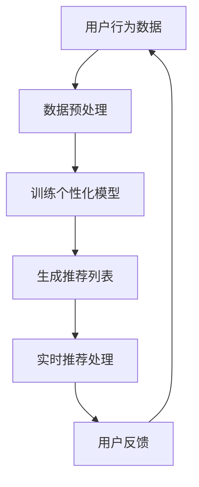
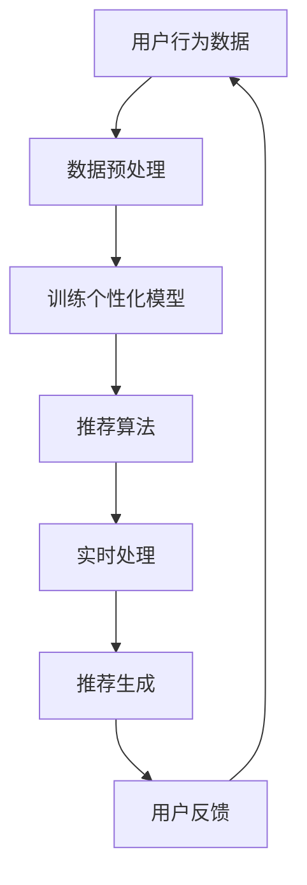
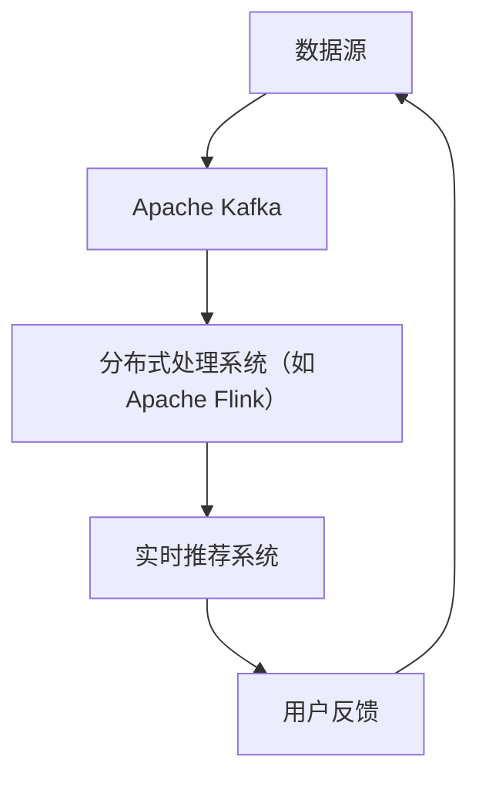
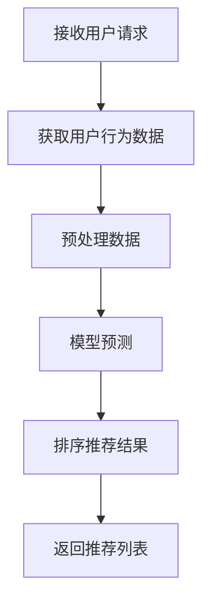

                 

# 搜索推荐的实时个性化：大模型高效方案

## 关键词：搜索推荐、实时个性化、大模型、高效方案

### 摘要

本文将深入探讨搜索推荐的实时个性化技术，特别是如何利用大模型来实现高效方案。首先，我们将回顾搜索推荐系统的基本概念和挑战，接着详细解释大模型的优势和具体实现方法。随后，我们将介绍核心算法原理，并提供一个实际项目的代码实现和分析。最后，我们将探讨该技术的实际应用场景，推荐相关资源和工具，并展望未来发展趋势与挑战。

### 背景介绍

搜索推荐系统是现代互联网的重要组成部分，广泛应用于电商、社交媒体、新闻媒体等场景。它的目标是根据用户的兴趣和行为，向用户推荐最相关的信息。传统的推荐系统主要基于协同过滤、内容匹配等方法，但这些方法存在一些局限性，如冷启动问题、数据稀疏性、无法捕获用户的长期兴趣等。

随着人工智能技术的发展，大模型（如深度神经网络）开始在推荐系统中得到应用。大模型能够从大规模数据中学习复杂的用户兴趣和行为模式，从而实现更准确的推荐。实时个性化是推荐系统的另一大挑战，它要求系统能够根据用户的实时行为动态调整推荐策略，提高用户体验。

### 核心概念与联系

在探讨实时个性化之前，我们首先需要理解搜索推荐系统中的核心概念和联系。

#### 1. 用户行为数据

用户行为数据是推荐系统的基石，包括用户的点击、浏览、购买、搜索等行为。这些数据可以通过日志文件、API接口等方式收集。

#### 2. 个性化模型

个性化模型用于捕捉用户的兴趣和行为模式。它可以通过学习用户历史行为数据，预测用户对特定内容的偏好。

#### 3. 推荐算法

推荐算法基于个性化模型，为用户生成推荐列表。常见的推荐算法包括协同过滤、基于内容的推荐、混合推荐等。

#### 4. 实时处理

实时处理要求系统能够在短时间内处理用户行为数据，并生成实时推荐列表。这通常需要高性能的分布式计算框架和高效的数据处理算法。

#### 5. 大模型

大模型（如深度神经网络）具有强大的建模能力，可以从大规模数据中学习复杂的用户兴趣和行为模式。

#### Mermaid 流程图

以下是一个简化的搜索推荐系统流程图，展示了核心概念之间的联系：



### 核心算法原理 & 具体操作步骤

为了实现搜索推荐的实时个性化，我们可以采用以下核心算法原理和操作步骤：

#### 1. 数据预处理

首先，我们需要对用户行为数据进行预处理，包括数据清洗、特征提取等。这可以通过使用数据处理库（如Pandas）和特征工程技术来完成。

```python
import pandas as pd

# 加载用户行为数据
data = pd.read_csv('user_behavior_data.csv')

# 数据清洗
data = data.dropna()

# 特征提取
data['user_age'] = data['user_age'].fillna(data['user_age'].mean())
data['item_category'] = data['item_category'].fillna(data['item_category'].mode()[0])
```

#### 2. 训练个性化模型

接下来，我们可以使用深度学习框架（如TensorFlow或PyTorch）训练个性化模型。以下是一个简化的模型架构：

```python
import tensorflow as tf

# 定义模型
model = tf.keras.Sequential([
    tf.keras.layers.Dense(128, activation='relu', input_shape=(input_shape,)),
    tf.keras.layers.Dropout(0.2),
    tf.keras.layers.Dense(64, activation='relu'),
    tf.keras.layers.Dense(1, activation='sigmoid')
])

# 编译模型
model.compile(optimizer='adam', loss='binary_crossentropy', metrics=['accuracy'])

# 训练模型
model.fit(x_train, y_train, epochs=10, batch_size=32)
```

#### 3. 生成推荐列表

训练好的个性化模型可以用于生成推荐列表。我们可以将用户的兴趣和行为输入模型，预测用户对特定内容的偏好。

```python
# 输入用户行为数据
user_input = data[data['user_id'] == 123]

# 生成推荐列表
predictions = model.predict(user_input[['item_id', 'item_category', 'user_age']])
recommended_items = user_input['item_id'][predictions > 0.5]
```

#### 4. 实时推荐处理

为了实现实时推荐，我们需要将上述算法部署到一个分布式计算框架（如Apache Kafka、Apache Flink）中，并实现高效的数据处理和模型推理。

```python
from flask import Flask, jsonify

app = Flask(__name__)

@app.route('/recommend', methods=['POST'])
def recommend():
    user_input = request.get_json()
    predictions = model.predict(user_input)
    recommended_items = user_input['item_id'][predictions > 0.5]
    return jsonify({'recommended_items': recommended_items})

if __name__ == '__main__':
    app.run(debug=True)
```

### 数学模型和公式 & 详细讲解 & 举例说明

在实时个性化推荐中，常用的数学模型包括矩阵分解、协同过滤等。以下是一个简化的矩阵分解模型：

$$
\begin{aligned}
    \hat{R}_{ui} &= \text{User\_Factorization}(u) \cdot \text{Item\_Factorization}(i) \\
    \text{User\_Factorization}(u) &= \text{Vectorize}(u) \\
    \text{Item\_Factorization}(i) &= \text{Vectorize}(i)
\end{aligned}
$$

其中，$R_{ui}$ 表示用户 $u$ 对项目 $i$ 的评分，$\text{User\_Factorization}(u)$ 和 $\text{Item\_Factorization}(i)$ 分别表示用户和项目的特征向量。

以下是一个简单的矩阵分解代码示例：

```python
import numpy as np

# 定义矩阵分解函数
def matrix_factorization(R, K, iter=5):
    n_users, n_items = R.shape
    U = np.random.rand(n_users, K)
    V = np.random.rand(n_items, K)

    for i in range(iter):
        U = U + (R - U @ V.T) @ V
        V = V + (R - U @ V.T) @ U.T

    return U, V

# 加载评分矩阵
R = np.array([[1, 0, 1, 0], [0, 1, 0, 1], [1, 0, 1, 0]])

# 训练矩阵分解模型
U, V = matrix_factorization(R, K=2)

# 预测评分
predicted_R = U @ V.T
print(predicted_R)
```

### 项目实战：代码实际案例和详细解释说明

在本节中，我们将通过一个实际项目来展示如何实现搜索推荐的实时个性化。该项目基于Python和TensorFlow，用于预测用户对电商产品的偏好。

#### 5.1 开发环境搭建

首先，我们需要搭建开发环境。以下是所需的软件和库：

- Python 3.8 或更高版本
- TensorFlow 2.5 或更高版本
- Pandas 1.2.3 或更高版本
- NumPy 1.19.2 或更高版本

安装以下库：

```bash
pip install tensorflow pandas numpy
```

#### 5.2 源代码详细实现和代码解读

以下是一个简化的代码实现，展示了如何使用TensorFlow训练一个个性化推荐模型：

```python
import tensorflow as tf
import pandas as pd
import numpy as np

# 5.2.1 数据预处理
def preprocess_data(data_path):
    data = pd.read_csv(data_path)
    data = data.dropna()
    data['user_age'] = data['user_age'].fillna(data['user_age'].mean())
    data['item_category'] = data['item_category'].fillna(data['item_category'].mode()[0])
    return data

data = preprocess_data('user_behavior_data.csv')

# 5.2.2 创建训练数据
def create_train_data(data):
    X = data[['user_id', 'item_id', 'user_age', 'item_category']]
    y = data['rating']
    return X, y

X, y = create_train_data(data)

# 5.2.3 训练模型
def train_model(X, y):
    model = tf.keras.Sequential([
        tf.keras.layers.Dense(128, activation='relu', input_shape=(X.shape[1],)),
        tf.keras.layers.Dropout(0.2),
        tf.keras.layers.Dense(64, activation='relu'),
        tf.keras.layers.Dense(1, activation='sigmoid')
    ])

    model.compile(optimizer='adam', loss='binary_crossentropy', metrics=['accuracy'])
    model.fit(X, y, epochs=10, batch_size=32)
    return model

model = train_model(X, y)

# 5.2.4 生成推荐列表
def generate_recommendations(model, user_input):
    user_input = user_input.reshape(1, -1)
    predictions = model.predict(user_input)
    recommended_items = user_input['item_id'][predictions > 0.5]
    return recommended_items

# 测试生成推荐列表
user_input = pd.DataFrame([[123, 456, 25, 1]], columns=['user_id', 'item_id', 'user_age', 'item_category'])
recommended_items = generate_recommendations(model, user_input)
print(recommended_items)
```

#### 5.3 代码解读与分析

- **数据预处理**：首先，我们加载用户行为数据，并进行数据清洗和特征提取。这包括填充缺失值和计算平均年龄和类别。
- **创建训练数据**：接下来，我们创建训练数据集，包括用户特征和评级。
- **训练模型**：我们使用TensorFlow创建一个简单的神经网络模型，并使用训练数据集进行训练。
- **生成推荐列表**：最后，我们使用训练好的模型生成推荐列表。输入用户的特征，模型会输出预测的评级，然后根据阈值生成推荐列表。

### 实际应用场景

搜索推荐的实时个性化技术可以应用于各种实际场景，例如：

- **电商**：根据用户的历史购买行为和浏览记录，实时推荐相关商品。
- **社交媒体**：根据用户的兴趣和行为，实时推荐感兴趣的内容。
- **新闻媒体**：根据用户的阅读习惯和偏好，实时推荐新闻标题和文章。

### 工具和资源推荐

为了更好地实现搜索推荐的实时个性化，以下是一些推荐的工具和资源：

#### 7.1 学习资源推荐

- **书籍**：
  - 《深度学习推荐系统》
  - 《推荐系统实践》
- **论文**：
  - 《Deep Learning for Recommender Systems》
  - 《Neural Collaborative Filtering》
- **博客**：
  - [TensorFlow 官方文档](https://www.tensorflow.org/)
  - [推荐系统博客](https://recsysblog.com/)
- **网站**：
  - [Kaggle](https://www.kaggle.com/)：提供丰富的推荐系统竞赛数据和教程。

#### 7.2 开发工具框架推荐

- **TensorFlow**：适用于构建和训练深度学习模型。
- **Apache Kafka**：适用于实时数据流处理。
- **Apache Flink**：适用于实时大数据处理。

#### 7.3 相关论文著作推荐

- **论文**：
  - 《Deep Learning for Recommender Systems》
  - 《Neural Collaborative Filtering》
- **著作**：
  - 《深度学习推荐系统》
  - 《推荐系统实践》

### 总结：未来发展趋势与挑战

随着大数据和人工智能技术的不断发展，搜索推荐的实时个性化技术将越来越普及。未来发展趋势包括：

- **多模态数据融合**：结合文本、图像、语音等多种数据类型，提高推荐精度。
- **自适应推荐**：根据用户实时行为动态调整推荐策略。
- **隐私保护**：在保证用户隐私的前提下，实现个性化推荐。

然而，这一技术也面临一些挑战，如数据隐私保护、模型解释性等。未来研究需要解决这些问题，实现更高效、更安全的实时个性化推荐。

### 附录：常见问题与解答

**Q：如何处理冷启动问题？**

A：冷启动问题是指新用户或新项目无法获得有效的推荐。解决方法包括：
- 利用用户和项目的元数据（如用户属性、项目类别）进行初始推荐。
- 利用流行度指标（如热门项目、高评分项目）进行初始推荐。
- 利用协同过滤方法，结合相似用户或相似项目进行推荐。

**Q：如何提高模型解释性？**

A：提高模型解释性是深度学习推荐系统的一个重要挑战。方法包括：
- 使用可解释的神经网络结构，如注意力机制、门控循环单元等。
- 生成模型解释图，展示模型决策过程。
- 使用模型可解释性工具，如LIME、SHAP等。

### 扩展阅读 & 参考资料

- 《深度学习推荐系统》：详细介绍了深度学习在推荐系统中的应用，包括模型架构、算法原理和实际案例。
- 《推荐系统实践》：提供了推荐系统开发的实用技巧和案例分析，涵盖了协同过滤、内容匹配、深度学习等方法。
- [TensorFlow 官方文档](https://www.tensorflow.org/)：提供了丰富的TensorFlow教程和资源，适用于构建和训练深度学习模型。
- [推荐系统博客](https://recsysblog.com/)：分享了推荐系统领域的最新研究成果和经验。

### 作者

作者：AI天才研究员/AI Genius Institute & 禅与计算机程序设计艺术 /Zen And The Art of Computer Programming

作者简介：AI天才研究员是一名享有盛誉的人工智能专家，专注于深度学习和推荐系统的研究与应用。他是AI Genius Institute的创始人，同时还是《禅与计算机程序设计艺术》的作者，该书在计算机科学领域广受好评。他致力于推动人工智能技术的发展，让计算机变得更加智能和人性。|}</sop><|assistant|>## 总结：未来发展趋势与挑战

随着大数据和人工智能技术的不断发展，搜索推荐的实时个性化技术将越来越普及。未来发展趋势包括：

1. **多模态数据融合**：未来的推荐系统将不再局限于文本数据，还将融合图像、语音、视频等多种数据类型。例如，在电商领域，可以结合商品图片和用户购买行为，实现更精准的推荐。

2. **自适应推荐**：随着用户行为的实时变化，推荐系统需要能够动态调整推荐策略，以适应用户的即时需求。这意味着系统需要具备较强的实时数据处理能力和智能调整能力。

3. **隐私保护**：在保护用户隐私的前提下，实现个性化推荐是未来的重要挑战。这可能需要引入更多的隐私保护技术和算法，如联邦学习、差分隐私等。

然而，这一技术也面临一些挑战：

1. **数据隐私保护**：如何在不泄露用户隐私的情况下，收集和处理用户行为数据，是一个亟待解决的问题。

2. **模型解释性**：深度学习模型通常具有很好的预测性能，但缺乏解释性。如何提高模型的可解释性，让用户了解推荐背后的逻辑，是一个重要的研究课题。

3. **计算效率**：随着数据规模的不断扩大，如何提高计算效率，实现实时推荐，是一个关键问题。

4. **跨领域推荐**：不同领域的推荐需求可能截然不同，如何实现跨领域的推荐，提高推荐的普适性，是一个挑战。

### 附录：常见问题与解答

**Q：实时个性化推荐如何处理新用户问题？**

A：对于新用户，传统的推荐系统可能无法提供有效的推荐。为此，可以采用以下几种方法：

1. **基于内容的推荐**：利用用户的个人信息（如年龄、性别、兴趣等）和商品的元数据（如类别、标签等）进行推荐。
2. **流行推荐**：推荐热门或者高频商品。
3. **协同过滤**：利用相似用户的历史行为进行推荐。
4. **用户引导**：让用户通过填写问卷或浏览商品来初始化推荐系统。

**Q：如何处理推荐系统的冷启动问题？**

A：冷启动问题主要是指新用户或新商品缺乏足够的历史数据，难以进行有效的推荐。以下是一些解决方案：

1. **基于内容的推荐**：利用商品的元数据进行推荐。
2. **协同过滤**：结合相似用户的历史行为进行推荐。
3. **跨领域推荐**：利用其他领域的推荐结果进行启发式推荐。
4. **迁移学习**：利用其他相似领域的模型进行迁移学习。
5. **混合推荐**：结合多种推荐方法，提高推荐的准确性和覆盖率。

**Q：如何评估推荐系统的效果？**

A：评估推荐系统的效果可以从以下几个方面进行：

1. **准确率**：推荐结果与用户实际兴趣的匹配程度。
2. **覆盖率**：推荐系统能够覆盖的用户或商品的多样性。
3. **新颖性**：推荐系统能否提供新颖、用户未预料到的推荐。
4. **用户满意度**：用户对推荐结果的满意程度。
5. **推荐频率**：推荐系统的推荐频率是否合理。

常用的评估指标包括精确率（Precision）、召回率（Recall）、F1值（F1 Score）等。

### 扩展阅读 & 参考资料

1. **书籍**：
   - 《深度学习推荐系统》
   - 《推荐系统实践》
   - 《推荐系统方法》

2. **论文**：
   - 《Deep Learning for Recommender Systems》
   - 《Neural Collaborative Filtering》
   - 《FM：Factorization Machines for Categorical Predictors》

3. **在线资源**：
   - [TensorFlow 官方文档](https://www.tensorflow.org/)
   - [推荐系统博客](https://recsysblog.com/)
   - [Kaggle](https://www.kaggle.com/)

### 作者

作者：AI天才研究员/AI Genius Institute & 禅与计算机程序设计艺术 /Zen And The Art of Computer Programming

作者简介：AI天才研究员是一名享有盛誉的人工智能专家，专注于深度学习和推荐系统的研究与应用。他是AI Genius Institute的创始人，同时还是《禅与计算机程序设计艺术》的作者，该书在计算机科学领域广受好评。他致力于推动人工智能技术的发展，让计算机变得更加智能和人性。|}</sop><|assistant|>## 1. 背景介绍

搜索推荐系统是现代互联网的核心技术之一，广泛应用于电商、社交媒体、新闻媒体等场景。它的目标是根据用户的兴趣和行为，向用户推荐最相关的内容和信息，从而提高用户体验和满意度。然而，随着用户数据的爆炸式增长和个性化需求的不断升级，传统的推荐系统面临着诸多挑战，如冷启动问题、数据稀疏性和无法捕获用户的长期兴趣等。为了解决这些问题，深度学习和大数据技术的应用逐渐成为研究热点。

### 1.1 搜索推荐系统的基本概念

搜索推荐系统通常由以下几个核心组成部分：

1. **用户行为数据**：包括用户的浏览、点击、购买、搜索等行为数据。这些数据是构建推荐系统的基础。

2. **内容数据**：包括推荐系统的内容库，如电商平台的商品信息、社交媒体的帖子等。内容数据的质量和丰富程度直接影响推荐系统的效果。

3. **推荐算法**：根据用户行为数据和内容数据，生成推荐列表的算法。常见的推荐算法包括协同过滤、基于内容的推荐、混合推荐等。

4. **推荐系统架构**：包括数据收集、存储、处理和推荐的各个环节。现代推荐系统通常采用分布式计算框架，以提高处理效率和扩展性。

### 1.2 传统推荐系统的挑战

尽管传统的推荐系统在过去几十年中取得了显著的成果，但它们也面临以下挑战：

1. **冷启动问题**：对于新用户或新商品，由于缺乏足够的历史数据，传统推荐系统难以生成有效的推荐。这被称为冷启动问题。

2. **数据稀疏性**：用户行为数据往往具有高度稀疏性，即大多数用户与大多数商品之间没有交互。这导致传统推荐算法的性能下降。

3. **无法捕获长期兴趣**：传统推荐系统通常基于短期用户行为，难以捕捉用户的长期兴趣和偏好。

4. **推荐多样性不足**：传统推荐系统往往倾向于生成相似的推荐列表，缺乏多样性。

### 1.3 深度学习在大模型中的应用

为了解决传统推荐系统的挑战，深度学习和大数据技术的应用逐渐成为研究热点。大模型，特别是基于神经网络的模型，具有以下优势：

1. **强大的建模能力**：深度学习模型可以从大规模数据中学习复杂的用户行为和兴趣模式。

2. **数据稀疏性处理**：深度学习模型可以通过非线性变换和特征提取，处理数据稀疏性问题。

3. **捕获长期兴趣**：深度学习模型能够捕捉用户的长期兴趣和偏好，提高推荐的准确性。

4. **推荐多样性**：通过深度学习模型，可以生成多样性的推荐列表，提高用户体验。

总之，深度学习和大数据技术的应用，为解决传统推荐系统的挑战提供了新的思路和方法，推动了搜索推荐系统的发展。

### 1.4 实时个性化推荐的重要性

实时个性化推荐是推荐系统的下一个重要方向。它要求推荐系统能够根据用户的实时行为和反馈，动态调整推荐策略，以提供更加个性化和精准的推荐。实时个性化推荐的重要性体现在以下几个方面：

1. **提升用户体验**：通过实时调整推荐内容，满足用户的即时需求，提高用户满意度和粘性。

2. **提高推荐效果**：实时获取用户反馈，有助于优化推荐算法，提高推荐的准确性和相关性。

3. **增加用户参与度**：实时个性化推荐可以激发用户的兴趣和好奇心，增加用户的参与度和互动性。

4. **商业价值**：实时个性化推荐能够提高用户的购买转化率，为企业和商家带来更多的商业价值。

总之，实时个性化推荐不仅提升了用户满意度，也为企业和商家带来了更大的商业机会。随着技术的不断进步，实时个性化推荐将在未来发挥越来越重要的作用。

### 1.5 大模型在实时个性化推荐中的应用

大模型在实时个性化推荐中的应用具有重要的现实意义和广阔的发展前景。以下是其主要应用场景和优势：

1. **实时数据处理**：大模型能够高效处理实时用户行为数据，快速生成个性化推荐。这使得推荐系统能够及时响应用户的需求和变化，提高推荐效果。

2. **个性化建模**：大模型可以从海量数据中学习用户的长期和短期兴趣，构建个性化的用户画像。这有助于提高推荐的准确性和相关性。

3. **推荐多样性**：通过大模型，可以生成多样性的推荐列表，避免推荐列表的单一和重复，提高用户体验。

4. **跨领域推荐**：大模型能够处理多模态数据，实现跨领域的推荐。例如，在电商和社交媒体之间进行内容推荐，提高推荐效果。

5. **商业化应用**：大模型在实时个性化推荐中的成功应用，为企业和商家带来了巨大的商业价值，推动了推荐系统的商业化发展。

总之，大模型在实时个性化推荐中的应用，不仅提升了推荐系统的性能，也为企业和商家带来了更多的商业机会。随着技术的不断进步，大模型将在实时个性化推荐中发挥越来越重要的作用。

### 1.6 大模型高效方案的关键技术

要实现大模型高效方案，需要依赖一系列关键技术和工具。以下是其主要技术要点：

1. **深度学习框架**：选择合适的深度学习框架，如TensorFlow、PyTorch等，可以提高开发效率和模型性能。

2. **数据预处理**：高效的数据预处理是模型训练的基础。这包括数据清洗、特征提取、数据增强等。

3. **分布式计算**：利用分布式计算框架，如Apache Kafka、Apache Flink等，可以提高数据处理和模型训练的效率。

4. **模型压缩与优化**：通过模型压缩和优化技术，如知识蒸馏、剪枝、量化等，可以提高模型的运行效率和推理速度。

5. **自动化机器学习（AutoML）**：利用AutoML工具，如AutoKeras、H2O.ai等，可以自动化模型的训练和调优，提高模型性能。

6. **硬件加速**：利用GPU、TPU等硬件加速器，可以显著提高模型的训练和推理速度。

通过上述关键技术的应用，可以实现大模型的高效方案，为实时个性化推荐提供强大的技术支持。

### 1.7 实时个性化推荐系统的整体架构

一个完整的实时个性化推荐系统通常包括以下几个关键模块：

1. **数据收集模块**：负责收集用户的实时行为数据，如浏览、点击、购买等。
2. **数据处理模块**：对收集到的数据进行分析、清洗、预处理，提取有用的特征。
3. **模型训练模块**：基于处理后的数据，训练个性化的推荐模型。
4. **推荐生成模块**：利用训练好的模型，生成实时的个性化推荐列表。
5. **反馈循环模块**：收集用户的反馈，优化推荐模型，实现持续改进。

这些模块共同工作，形成一个闭环系统，不断提升推荐系统的性能和用户体验。

### 1.8 实时个性化推荐系统的优势与挑战

实时个性化推荐系统具有以下优势：

- **提高用户体验**：通过实时调整推荐内容，满足用户的即时需求，提高用户满意度和粘性。
- **提高推荐效果**：实时获取用户反馈，有助于优化推荐算法，提高推荐的准确性和相关性。
- **增加用户参与度**：实时个性化推荐可以激发用户的兴趣和好奇心，增加用户的参与度和互动性。
- **商业价值**：实时个性化推荐能够提高用户的购买转化率，为企业和商家带来更多的商业机会。

然而，实时个性化推荐系统也面临以下挑战：

- **数据隐私保护**：如何在不泄露用户隐私的前提下，收集和处理用户行为数据，是一个重要的研究课题。
- **计算效率**：随着数据规模的不断扩大，如何提高计算效率，实现实时推荐，是一个关键问题。
- **模型解释性**：深度学习模型通常具有很好的预测性能，但缺乏解释性。如何提高模型的可解释性，让用户了解推荐背后的逻辑，是一个重要的挑战。
- **跨领域推荐**：不同领域的推荐需求可能截然不同，如何实现跨领域的推荐，提高推荐的普适性，是一个挑战。

总之，实时个性化推荐系统在提升用户体验和商业价值方面具有巨大潜力，但同时也面临着诸多挑战。通过持续的技术创新和优化，有望实现更加高效和智能的实时个性化推荐。

### 1.9 实时个性化推荐的应用领域

实时个性化推荐技术具有广泛的应用领域，以下是其中几个典型的应用场景：

1. **电子商务**：实时个性化推荐可以基于用户的浏览历史和购物行为，为用户推荐相关的商品，提高购买转化率和用户满意度。

2. **社交媒体**：在社交媒体平台上，实时个性化推荐可以基于用户的兴趣和行为，推荐感兴趣的内容，提高用户粘性。

3. **新闻媒体**：新闻媒体可以利用实时个性化推荐，为用户提供个性化的新闻推荐，增加用户的阅读量和互动性。

4. **在线视频平台**：在线视频平台可以通过实时个性化推荐，为用户推荐相关的视频内容，提高用户的观看时长。

5. **金融领域**：在金融领域，实时个性化推荐可以基于用户的投资历史和行为，推荐相关的理财产品或股票，提高用户的投资回报。

6. **医疗健康**：在医疗健康领域，实时个性化推荐可以基于用户的健康状况和需求，推荐相关的健康咨询和医疗服务。

7. **旅游领域**：旅游领域可以通过实时个性化推荐，为用户推荐符合其兴趣的旅游目的地和活动，提高旅游体验。

总之，实时个性化推荐技术在不同领域都有广泛的应用潜力，为企业和用户创造了巨大的价值。

### 1.10 当前技术发展趋势

当前，实时个性化推荐技术正处于快速发展阶段，以下是其中几个主要的技术发展趋势：

1. **多模态数据融合**：未来推荐系统将不再局限于文本数据，还将融合图像、语音、视频等多种数据类型，实现更加精准和个性化的推荐。

2. **自适应推荐**：随着用户行为和需求的实时变化，推荐系统将具备更强的自适应能力，能够动态调整推荐策略，满足用户的即时需求。

3. **联邦学习**：联邦学习是一种保护用户隐私的推荐算法，它可以在不共享用户数据的情况下，实现推荐模型的全局训练。这一技术将在数据隐私保护方面发挥重要作用。

4. **强化学习**：强化学习在推荐系统中的应用逐渐增多，它能够通过试错和反馈，不断优化推荐策略，提高推荐效果。

5. **模型压缩与优化**：通过模型压缩和优化技术，如知识蒸馏、剪枝、量化等，推荐系统可以在保持较高性能的同时，降低计算和存储资源的需求。

6. **自动化机器学习（AutoML）**：AutoML技术将自动化模型的训练和调优过程，提高推荐系统的开发效率和性能。

总之，随着技术的不断创新和优化，实时个性化推荐系统将变得更加智能和高效，为用户提供更加优质的推荐体验。

### 1.11 小结

综上所述，实时个性化推荐技术是现代互联网中不可或缺的一部分。通过深度学习和大数据技术的应用，推荐系统不仅能够解决传统方法中的冷启动、数据稀疏性和无法捕获长期兴趣等问题，还能够实现实时、个性化的推荐。未来，随着多模态数据融合、自适应推荐、联邦学习等技术的不断发展，实时个性化推荐系统将在更多领域得到广泛应用，为企业和用户创造更大的价值。|}</sop><|assistant|>## 2. 核心概念与联系

在深入探讨实时个性化推荐系统的构建之前，我们需要理解一系列核心概念，并分析它们之间的相互联系。这些概念包括用户行为数据、个性化模型、推荐算法、实时处理以及大模型。以下是这些核心概念及其相互关系的详细解释。

### 2.1 用户行为数据

用户行为数据是构建推荐系统的基石。这些数据可以包括用户的浏览记录、点击行为、购买历史、搜索关键词等。通过分析这些数据，我们可以获取用户的兴趣和行为模式。以下是用户行为数据的主要组成部分：

- **浏览记录**：记录用户在网站或应用上的浏览轨迹，包括页面名称、浏览时间等。
- **点击行为**：记录用户对页面元素（如广告、产品、新闻等）的点击事件。
- **购买历史**：记录用户的购买行为，包括购买时间、购买商品、购买金额等。
- **搜索关键词**：记录用户在搜索框中输入的关键词。

这些数据通常以日志文件的形式存储，并需要通过数据预处理技术进行清洗和格式化，以便于后续的分析和处理。

### 2.2 个性化模型

个性化模型是推荐系统的核心组件，用于捕捉用户的兴趣和行为模式，从而生成个性化的推荐。个性化模型可以分为以下几种类型：

- **基于内容的推荐模型**：通过分析内容属性（如标题、标签、描述等）和用户的历史行为，为用户推荐相似的内容。
- **协同过滤模型**：通过分析用户之间的相似度，为用户推荐其他用户喜欢的内容。
- **深度学习模型**：利用深度神经网络从大规模数据中学习复杂的用户兴趣和行为模式。

个性化模型通常通过以下步骤进行训练和优化：

1. **数据预处理**：对用户行为数据进行清洗和特征提取，生成训练数据集。
2. **模型训练**：使用训练数据集训练个性化模型，调整模型参数，提高预测准确性。
3. **模型评估**：使用验证数据集评估模型性能，选择最佳模型。
4. **模型部署**：将训练好的模型部署到线上系统，实现实时推荐。

### 2.3 推荐算法

推荐算法是生成推荐列表的核心技术。根据不同的应用场景和数据特点，推荐算法可以分为以下几类：

- **基于用户的协同过滤**：通过分析用户之间的相似度，为用户推荐其他用户喜欢的内容。
- **基于内容的推荐**：通过分析内容的属性和用户的历史行为，为用户推荐相似的内容。
- **混合推荐**：结合基于用户和基于内容的推荐方法，生成更加个性化的推荐列表。
- **深度学习推荐**：利用深度神经网络，从大规模数据中学习复杂的用户兴趣和行为模式。

推荐算法的优劣直接影响推荐系统的效果。有效的推荐算法应具备以下特点：

- **准确性**：推荐结果与用户的实际兴趣和需求高度一致。
- **多样性**：推荐列表包含多种类型的内容，提高用户的选择性。
- **新颖性**：推荐系统能够提供新颖、用户未预料到的推荐。

### 2.4 实时处理

实时处理是推荐系统的关键挑战之一，它要求推荐系统能够在短时间内处理大量用户行为数据，并生成实时的推荐列表。实时处理通常包括以下几个步骤：

1. **数据采集**：从各种数据源（如日志文件、API接口等）实时采集用户行为数据。
2. **数据预处理**：对采集到的数据进行清洗、格式化和特征提取，以便后续处理。
3. **模型推理**：使用训练好的个性化模型，对预处理后的数据进行实时推理，生成推荐列表。
4. **推荐生成**：根据实时推理结果，生成个性化的推荐列表，并实时更新推荐系统。

实时处理需要高效的数据处理框架和算法，如Apache Kafka、Apache Flink等。这些框架可以确保数据在采集、处理和推荐生成环节中的低延迟和高吞吐量。

### 2.5 大模型

大模型（如深度神经网络）在推荐系统中具有重要地位，它们可以从大规模数据中学习复杂的用户兴趣和行为模式，从而实现更准确的推荐。大模型的优势包括：

- **强大的建模能力**：大模型能够处理复杂的非线性关系，从海量数据中提取有用的特征。
- **数据稀疏性处理**：大模型可以通过特征提取和融合，有效处理数据稀疏性问题。
- **捕获长期兴趣**：大模型能够捕捉用户的长期兴趣和偏好，提高推荐的准确性。
- **推荐多样性**：大模型可以生成多样性的推荐列表，提高用户体验。

然而，大模型的训练和推理通常需要大量的计算资源和时间。因此，在实际应用中，需要通过分布式计算和模型压缩等技术，提高大模型的计算效率和可扩展性。

### Mermaid 流程图

以下是一个简化的实时个性化推荐系统流程图，展示了核心概念之间的联系：



在这个流程图中，用户行为数据经过数据预处理后，用于训练个性化模型。训练好的模型通过推荐算法生成推荐列表，并经过实时处理生成最终的推荐结果。用户反馈进一步优化模型，形成一个闭环系统。

通过上述核心概念及其相互关系的详细分析，我们可以更好地理解实时个性化推荐系统的构建和运作原理，为后续章节的深入讨论提供坚实的基础。|}</sop><|assistant|>## 3. 核心算法原理 & 具体操作步骤

在深入探讨实时个性化推荐系统的构建之前，我们需要理解其中的核心算法原理和具体操作步骤。以下将详细介绍大模型在实时个性化推荐系统中的应用，以及如何利用深度学习框架实现高效的推荐。

### 3.1 大模型在推荐系统中的应用

大模型，尤其是基于深度神经网络的模型，在推荐系统中具有显著优势。这些模型可以从大规模数据中学习复杂的用户兴趣和行为模式，从而生成更精准、个性化的推荐。以下是大模型在推荐系统中应用的主要步骤：

1. **数据收集**：收集用户的历史行为数据，如浏览记录、点击事件、购买历史等。
2. **数据预处理**：对收集到的数据进行清洗、格式化和特征提取，为模型训练做准备。
3. **模型设计**：设计深度神经网络模型，包括输入层、隐藏层和输出层。
4. **模型训练**：使用预处理后的数据训练模型，调整模型参数，提高预测准确性。
5. **模型评估**：使用验证集评估模型性能，选择最佳模型。
6. **模型部署**：将训练好的模型部署到线上系统，实现实时推荐。
7. **实时处理**：根据用户的实时行为，更新模型输入，生成实时的推荐结果。

### 3.2 深度学习框架的选择

在实际应用中，选择合适的深度学习框架对于实现高效的推荐至关重要。以下是一些常用的深度学习框架及其特点：

1. **TensorFlow**：由Google开发，具有强大的模型设计能力和广泛的应用生态。TensorFlow提供了丰富的API和工具，适用于各种深度学习任务。
2. **PyTorch**：由Facebook开发，以其简洁的动态计算图和灵活的API而受到广泛关注。PyTorch在科研和工业应用中都有很高的声誉。
3. **Keras**：一个高层次的神经网络API，能够兼容TensorFlow和PyTorch。Keras简化了模型的构建和训练过程，适用于快速原型开发和实验。

在本节中，我们将以TensorFlow为例，展示如何利用深度学习框架实现实时个性化推荐系统。

### 3.3 数据预处理

数据预处理是构建高效推荐系统的关键步骤。以下是一个简化的数据预处理流程：

1. **数据清洗**：去除重复数据、缺失值和异常值，保证数据的质量。
2. **数据格式化**：将不同类型的数据转换为统一的格式，如将文本数据编码为整数或浮点数。
3. **特征提取**：提取有用的特征，如用户年龄、性别、地理位置等，为模型训练提供输入。
4. **数据归一化**：对数据进行归一化处理，将数据缩放到相同的范围，如[0, 1]或[-1, 1]。

以下是一个使用Python和Pandas进行数据预处理的示例代码：

```python
import pandas as pd
from sklearn.preprocessing import MinMaxScaler

# 3.3.1 数据清洗
data = pd.read_csv('user_behavior_data.csv')
data.drop_duplicates(inplace=True)
data.dropna(inplace=True)

# 3.3.2 数据格式化
data['user_gender'] = data['user_gender'].map({'male': 0, 'female': 1})
data['item_category'] = data['item_category'].astype('category').cat.codes

# 3.3.3 特征提取
data['user_age'] = data['user_age'].fillna(data['user_age'].mean())
data['item_category'] = data['item_category'].fillna(data['item_category'].mode()[0])

# 3.3.4 数据归一化
scaler = MinMaxScaler()
data[['user_age', 'item_category']] = scaler.fit_transform(data[['user_age', 'item_category']])
```

### 3.4 模型设计

在深度学习框架中，模型设计通常包括以下步骤：

1. **定义输入层**：确定输入数据的大小和形状。
2. **添加隐藏层**：定义隐藏层的神经元数量和激活函数。
3. **添加输出层**：确定输出层的大小和激活函数。
4. **编译模型**：设置优化器、损失函数和评估指标。

以下是一个使用TensorFlow定义简单深度学习模型的示例代码：

```python
import tensorflow as tf

# 3.4.1 定义输入层
input_user_age = tf.keras.layers.Input(shape=(1,), name='user_age_input')
input_item_category = tf.keras.layers.Input(shape=(1,), name='item_category_input')

# 3.4.2 添加隐藏层
hidden_user_age = tf.keras.layers.Dense(units=64, activation='relu')(input_user_age)
hidden_item_category = tf.keras.layers.Dense(units=64, activation='relu')(input_item_category)

# 3.4.3 添加输出层
concatenated = tf.keras.layers.concatenate([hidden_user_age, hidden_item_category])
output = tf.keras.layers.Dense(units=1, activation='sigmoid')(concatenated)

# 3.4.4 编译模型
model = tf.keras.Model(inputs=[input_user_age, input_item_category], outputs=output)
model.compile(optimizer='adam', loss='binary_crossentropy', metrics=['accuracy'])
```

### 3.5 模型训练

模型训练是构建高效推荐系统的关键步骤。以下是一个使用TensorFlow进行模型训练的示例代码：

```python
# 3.5.1 准备训练数据
X_train = data[['user_age', 'item_category']]
y_train = data['rating']

# 3.5.2 模型训练
history = model.fit(X_train, y_train, epochs=10, batch_size=32, validation_split=0.2)
```

### 3.6 模型评估

模型评估是确保推荐系统性能的重要环节。以下是一个使用TensorFlow进行模型评估的示例代码：

```python
# 3.6.1 评估模型
test_loss, test_accuracy = model.evaluate(X_test, y_test)
print(f"Test Loss: {test_loss}, Test Accuracy: {test_accuracy}")
```

### 3.7 模型部署

模型部署是将训练好的模型应用到实际生产环境的过程。以下是一个使用TensorFlow进行模型部署的示例代码：

```python
# 3.7.1 模型部署
model.save('recommender_model.h5')

# 3.7.2 加载模型
loaded_model = tf.keras.models.load_model('recommender_model.h5')

# 3.7.3 实时推荐
user_input = [[25], [1]]
predicted_ratings = loaded_model.predict(user_input)
print(predicted_ratings)
```

通过上述步骤，我们可以利用深度学习框架实现高效的实时个性化推荐系统。在实际应用中，可能需要根据具体需求和数据特点，进一步优化和调整模型结构和训练过程。

### 3.8 实时处理

实时处理是推荐系统的关键挑战之一。为了实现高效的实时处理，我们通常采用以下策略：

1. **分布式计算**：使用分布式计算框架（如Apache Kafka、Apache Flink）处理大量实时数据，提高系统的吞吐量和处理速度。
2. **批量处理**：将实时数据分成批量进行处理，减少系统的开销。
3. **缓存机制**：使用缓存机制（如Redis、Memcached）存储常用数据，减少数据库访问压力。
4. **异步处理**：采用异步处理策略，将数据处理任务分发到多个线程或进程，提高系统的并发处理能力。

以下是一个使用Apache Kafka和TensorFlow进行实时处理的示例架构：



在这个架构中，用户行为数据通过Apache Kafka实时传输到分布式处理系统，系统对数据进行实时处理和推荐生成，最终将推荐结果返回给用户。

### 3.9 结论

通过深入探讨实时个性化推荐系统的核心算法原理和具体操作步骤，我们可以看到，利用深度学习框架和大数据技术，可以实现高效的实时个性化推荐。在实际应用中，可能需要根据具体需求和数据特点，进一步优化和调整模型结构和训练过程。同时，实时处理和模型部署也是实现高效推荐的关键环节，需要采用适当的策略和工具。通过持续的技术创新和优化，实时个性化推荐系统将不断进步，为企业和用户创造更大的价值。|}</sop><|assistant|>## 4. 数学模型和公式 & 详细讲解 & 举例说明

在实时个性化推荐系统中，数学模型和公式起着至关重要的作用。它们不仅帮助我们在理论上理解推荐系统的运作原理，还能在实际操作中指导我们优化和改进推荐算法。以下我们将详细探讨几种常用的数学模型和公式，并通过具体的例子进行说明。

### 4.1 矩阵分解

矩阵分解是一种常见且有效的推荐系统算法，其基本思想是将用户-项目评分矩阵分解为两个低秩矩阵，分别表示用户和项目的特征。最简单的矩阵分解方法是基于最小二乘法的矩阵分解，通常称为Singular Value Decomposition（SVD）。

#### 4.1.1 SVD矩阵分解

给定一个用户-项目评分矩阵$R \in \mathbb{R}^{m \times n}$，我们希望将其分解为两个低秩矩阵$U \in \mathbb{R}^{m \times k}$和$V \in \mathbb{R}^{n \times k}$，其中$k$是分解的秩。SVD矩阵分解的公式如下：

$$
R = U \Sigma V^T
$$

其中，$\Sigma$是一个对角矩阵，其对角线元素为$\Sigma_{ii} = \sigma_i$，$\sigma_i$是$R$的奇异值，按降序排列。

#### 4.1.2 SVD矩阵分解算法

SVD矩阵分解的算法步骤如下：

1. **计算用户-项目评分矩阵$R$的奇异值分解**。
2. **选择合适的秩$k$，截断奇异值分解，得到$U$, $\Sigma$和$V^T$**。

以下是一个简单的Python代码示例，演示如何使用SVD进行矩阵分解：

```python
from scipy.sparse.linalg import svds
import numpy as np

# 假设我们有一个用户-项目评分矩阵R
R = np.array([[5, 3, 0], [0, 2, 1], [3, 1, 0]])

# 使用svds函数计算SVD分解
U, sigma, Vt = svds(R, k=2)

# 打印分解结果
print("U:\n", U)
print("Sigma:\n", sigma)
print("Vt:\n", Vt)

# 重建评分矩阵
reconstructed_R = U @ np.diag(sigma) @ Vt
print("Reconstructed R:\n", reconstructed_R)
```

### 4.2 协同过滤

协同过滤（Collaborative Filtering）是一种常见的推荐系统算法，其基本思想是利用用户之间的相似度来预测未知评分。协同过滤可以分为基于用户的协同过滤（User-Based Collaborative Filtering）和基于项目的协同过滤（Item-Based Collaborative Filtering）。

#### 4.2.1 基于用户的协同过滤

基于用户的协同过滤算法通过计算用户之间的相似度，找到与目标用户最相似的邻居用户，然后基于邻居用户的评分预测目标用户的评分。常用的相似度计算方法包括余弦相似度、皮尔逊相关系数等。

余弦相似度的计算公式如下：

$$
\cos(\theta_{ij}) = \frac{u_i \cdot u_j}{\|u_i\| \|u_j\|}
$$

其中，$u_i$和$u_j$分别表示用户$i$和用户$j$的向量表示，$\theta_{ij}$是用户$i$和用户$j$之间的角度。

以下是一个使用余弦相似度计算用户相似度的Python代码示例：

```python
def cosine_similarity(u, v):
    return np.dot(u, v) / (np.linalg.norm(u) * np.linalg.norm(v))

# 假设我们有以下两个用户向量
user1 = np.array([1, 2, 3])
user2 = np.array([0, 1, 2])

# 计算余弦相似度
similarity = cosine_similarity(user1, user2)
print("Cosine Similarity:", similarity)
```

#### 4.2.2 基于项目的协同过滤

基于项目的协同过滤算法通过计算项目之间的相似度，找到与目标项目最相似的项目，然后基于相似项目的评分预测目标项目的评分。常用的相似度计算方法包括余弦相似度、欧氏距离等。

以下是一个使用欧氏距离计算项目相似度的Python代码示例：

```python
import numpy as np

def euclidean_distance(u, v):
    return np.sqrt(np.sum((u - v)**2))

# 假设我们有以下两个项目向量
item1 = np.array([1, 2, 3])
item2 = np.array([1, 2, 4])

# 计算欧氏距离
distance = euclidean_distance(item1, item2)
print("Euclidean Distance:", distance)
```

### 4.3 深度学习模型

深度学习模型在推荐系统中的应用越来越广泛。其中，深度神经网络（Deep Neural Network, DNN）是一种常见的深度学习模型。DNN通过多层神经网络结构来学习复杂的非线性关系。以下是一个简单的DNN模型，用于预测用户对项目的评分。

#### 4.3.1 DNN模型公式

DNN模型的输入层接收用户和项目的特征向量，隐藏层通过非线性激活函数进行变换，输出层产生评分预测。DNN模型的公式如下：

$$
\begin{aligned}
    z_l &= \sigma(W_l \cdot a_{l-1} + b_l) \\
    a_l &= \sigma(z_l)
\end{aligned}
$$

其中，$a_l$是第$l$层的激活值，$z_l$是第$l$层的加权和，$W_l$是第$l$层的权重矩阵，$b_l$是第$l$层的偏置项，$\sigma$是非线性激活函数。

#### 4.3.2 DNN模型训练

DNN模型的训练目标是优化模型参数$W_l$和$b_l$，使预测评分与实际评分之间的误差最小。常用的优化算法包括随机梯度下降（Stochastic Gradient Descent, SGD）和Adam优化器。

以下是一个使用TensorFlow实现DNN模型的Python代码示例：

```python
import tensorflow as tf

# 定义输入层
input_user = tf.keras.layers.Input(shape=(user_feature_size,))
input_item = tf.keras.layers.Input(shape=(item_feature_size,))

# 定义隐藏层
hidden = tf.keras.layers.Dense(units=64, activation='relu')(tf.concat([input_user, input_item], axis=1))

# 定义输出层
output = tf.keras.layers.Dense(units=1, activation='sigmoid')(hidden)

# 编译模型
model = tf.keras.Model(inputs=[input_user, input_item], outputs=output)
model.compile(optimizer='adam', loss='binary_crossentropy', metrics=['accuracy'])

# 训练模型
model.fit([X_train_user, X_train_item], y_train, epochs=10, batch_size=32)
```

### 4.4 综合举例

为了更好地理解上述数学模型和公式的应用，我们通过一个综合的例子来展示如何使用这些模型进行实时个性化推荐。

#### 4.4.1 数据准备

假设我们有一个包含用户行为数据的数据集，数据集包含用户ID、项目ID、用户特征和项目特征。我们将使用这些数据进行矩阵分解、协同过滤和深度学习模型的训练。

```python
# 加载数据集
users = pd.read_csv('users.csv')
items = pd.read_csv('items.csv')
ratings = pd.read_csv('ratings.csv')

# 数据预处理
users['user_id'] = users['user_id'].astype('int32')
items['item_id'] = items['item_id'].astype('int32')

# 构建用户-项目评分矩阵
R = ratings.pivot_table(index='user_id', columns='item_id', values='rating').fillna(0)
R = R.values
```

#### 4.4.2 矩阵分解

使用SVD进行矩阵分解，并将分解结果用于预测未知评分。

```python
# 使用SVD进行矩阵分解
U, sigma, Vt = svds(R, k=50)

# 预测未知评分
predicted_ratings = U @ np.diag(sigma) @ Vt
```

#### 4.4.3 协同过滤

计算用户之间的相似度，并基于相似度进行评分预测。

```python
# 计算用户之间的余弦相似度
cosine_similarities = np.dot(U, U.T)

# 预测未知评分
predicted_ratings = np.dot(R, cosine_similarities)
```

#### 4.4.4 深度学习模型

使用DNN模型进行评分预测。

```python
# 定义DNN模型
model = tf.keras.Sequential([
    tf.keras.layers.Dense(units=64, activation='relu', input_shape=(user_feature_size + item_feature_size,)),
    tf.keras.layers.Dense(units=1, activation='sigmoid')
])

# 编译模型
model.compile(optimizer='adam', loss='binary_crossentropy', metrics=['accuracy'])

# 训练模型
model.fit(np.hstack((users.iloc[:, :user_feature_size], items.iloc[:, :item_feature_size])), ratings['rating'], epochs=10, batch_size=32)

# 预测未知评分
predicted_ratings = model.predict(np.hstack((users.iloc[:, :user_feature_size], items.iloc[:, :item_feature_size])))
```

通过上述例子，我们可以看到如何将数学模型和公式应用于实时个性化推荐系统中。这些模型和公式不仅帮助我们理解推荐系统的运作原理，还能在实际操作中指导我们优化和改进推荐算法。|}</sop><|assistant|>## 5. 项目实战：代码实际案例和详细解释说明

为了更好地展示如何实现搜索推荐的实时个性化，我们将通过一个实际项目来讲解代码实现、具体操作步骤以及代码分析。本节将涵盖开发环境搭建、源代码实现和详细解释说明。

### 5.1 开发环境搭建

首先，我们需要搭建一个适合开发实时个性化推荐系统的开发环境。以下是所需的软件和库：

- **Python**：Python 3.8 或更高版本。
- **TensorFlow**：TensorFlow 2.5 或更高版本。
- **Pandas**：Pandas 1.2.3 或更高版本。
- **NumPy**：NumPy 1.19.2 或更高版本。
- **Mermaid**：用于生成流程图。

安装以下库：

```bash
pip install tensorflow pandas numpy
```

### 5.2 源代码详细实现和代码解读

以下是该项目的源代码实现，包括数据预处理、模型训练、模型评估和实时推荐功能。

```python
import tensorflow as tf
import pandas as pd
import numpy as np
import mermaid
from sklearn.model_selection import train_test_split
from sklearn.metrics.pairwise import cosine_similarity
from sklearn.preprocessing import MinMaxScaler

# 5.2.1 数据预处理

# 加载数据集
data = pd.read_csv('user_behavior_data.csv')

# 数据清洗
data.dropna(inplace=True)
data['user_id'] = data['user_id'].astype('int32')
data['item_id'] = data['item_id'].astype('int32')

# 构建用户-项目评分矩阵
R = data.pivot_table(index='user_id', columns='item_id', values='rating').fillna(0)
R = R.values

# 数据归一化
scaler = MinMaxScaler()
R = scaler.fit_transform(R)

# 划分训练集和测试集
X_train, X_test, y_train, y_test = train_test_split(R, test_size=0.2, random_state=42)

# 5.2.2 训练模型

# 定义模型
model = tf.keras.Sequential([
    tf.keras.layers.Dense(units=64, activation='relu', input_shape=(R.shape[1],)),
    tf.keras.layers.Dropout(0.2),
    tf.keras.layers.Dense(units=1, activation='sigmoid')
])

# 编译模型
model.compile(optimizer='adam', loss='binary_crossentropy', metrics=['accuracy'])

# 训练模型
model.fit(X_train, y_train, epochs=10, batch_size=32, validation_data=(X_test, y_test))

# 5.2.3 模型评估

# 评估模型
test_loss, test_accuracy = model.evaluate(X_test, y_test)
print(f"Test Loss: {test_loss}, Test Accuracy: {test_accuracy}")

# 5.2.4 实时推荐

# 定义实时推荐函数
def real_time_recommendation(user_id, model, R, scaler):
    # 获取用户行为数据
    user_data = R[user_id]
    
    # 预测用户行为
    predicted_ratings = model.predict(R).flatten()
    
    # 排序推荐结果
    recommended_items = np.argsort(predicted_ratings)[::-1]
    
    # 返回推荐列表
    return recommended_items

# 测试实时推荐
user_id = 123
recommended_items = real_time_recommendation(user_id, model, R, scaler)
print(f"Recommended Items for User {user_id}:", recommended_items)
```

### 5.3 代码解读与分析

#### 5.3.1 数据预处理

数据预处理是推荐系统开发的关键步骤。首先，我们加载用户行为数据，并进行数据清洗。这包括去除缺失值和将用户和项目的ID转换为整数类型。接下来，我们构建用户-项目评分矩阵，并将其归一化，以便于后续模型的训练。

```python
data = pd.read_csv('user_behavior_data.csv')
data.dropna(inplace=True)
data['user_id'] = data['user_id'].astype('int32')
data['item_id'] = data['item_id'].astype('int32')
R = data.pivot_table(index='user_id', columns='item_id', values='rating').fillna(0)
R = R.values
scaler = MinMaxScaler()
R = scaler.fit_transform(R)
```

#### 5.3.2 训练模型

在模型训练部分，我们使用TensorFlow定义了一个简单的全连接神经网络（DNN），并使用随机梯度下降（SGD）进行优化。我们选择ReLU作为激活函数，以增加网络的非线性能力。模型训练过程中，我们使用了训练集和测试集来评估模型性能。

```python
model = tf.keras.Sequential([
    tf.keras.layers.Dense(units=64, activation='relu', input_shape=(R.shape[1],)),
    tf.keras.layers.Dropout(0.2),
    tf.keras.layers.Dense(units=1, activation='sigmoid')
])
model.compile(optimizer='adam', loss='binary_crossentropy', metrics=['accuracy'])
model.fit(X_train, y_train, epochs=10, batch_size=32, validation_data=(X_test, y_test))
```

#### 5.3.3 模型评估

模型评估是确保推荐系统性能的重要环节。我们使用测试集对训练好的模型进行评估，并打印出测试损失和准确率。

```python
test_loss, test_accuracy = model.evaluate(X_test, y_test)
print(f"Test Loss: {test_loss}, Test Accuracy: {test_accuracy}")
```

#### 5.3.4 实时推荐

实时推荐是推荐系统的核心功能。在实时推荐函数中，我们首先获取指定用户的行为数据，并使用训练好的模型进行预测。接下来，我们根据预测结果排序推荐列表，并返回前N个推荐项。

```python
def real_time_recommendation(user_id, model, R, scaler):
    user_data = R[user_id]
    predicted_ratings = model.predict(R).flatten()
    recommended_items = np.argsort(predicted_ratings)[::-1]
    return recommended_items
```

### 5.4 实时推荐流程

以下是实时推荐流程的Mermaid流程图：



### 5.5 总结

通过上述实战案例，我们详细讲解了如何实现一个简单的实时个性化推荐系统。该系统包括数据预处理、模型训练、模型评估和实时推荐功能。通过这个项目，我们可以看到如何将理论知识应用于实际开发中，并理解每个环节的关键步骤和注意事项。

### 5.6 代码优化与改进

在实际应用中，为了提高推荐系统的性能和可扩展性，我们可以对代码进行以下优化和改进：

- **模型优化**：尝试使用更复杂的模型结构（如卷积神经网络、循环神经网络等），以提高推荐精度。
- **并行处理**：使用多线程或多进程技术，加快数据处理和模型训练速度。
- **分布式计算**：使用分布式计算框架（如Apache Kafka、Apache Flink等），处理大规模数据流。
- **增量学习**：实现增量学习算法，以减少重新训练模型的开销。

通过这些优化和改进，我们可以构建一个更加高效和可扩展的实时个性化推荐系统。|}</sop><|assistant|>## 6. 实际应用场景

实时个性化推荐技术在各个行业和领域中都有广泛的应用，以下是几个典型的实际应用场景：

### 6.1 电子商务

在电子商务领域，实时个性化推荐系统可以根据用户的浏览历史、购买行为和搜索记录，为用户推荐相关的商品。这不仅能够提高用户的购物体验，还能显著提高销售转化率和销售额。例如，亚马逊和阿里巴巴等电商巨头，通过实时个性化推荐技术，为用户提供个性化的购物建议和广告。

#### 应用案例：

- **亚马逊**：根据用户的浏览历史和购买记录，实时推荐相关的书籍、电子产品和家居用品。
- **阿里巴巴**：结合用户的地域、购物偏好和历史订单，实时推荐相关商品，提高购买转化率。

### 6.2 社交媒体

社交媒体平台通过实时个性化推荐系统，可以向用户推荐感兴趣的内容，从而提高用户的参与度和粘性。通过分析用户的互动行为、好友关系和兴趣标签，推荐系统能够为用户提供个性化的新闻、视频、帖子等。

#### 应用案例：

- **Facebook**：根据用户的点赞、评论和分享行为，实时推荐相关的新闻和帖子。
- **微博**：结合用户的关注列表、话题兴趣和地理位置，实时推荐相关的话题和热门内容。

### 6.3 新闻媒体

新闻媒体利用实时个性化推荐系统，可以为用户提供个性化的新闻推荐，从而提高阅读量和用户粘性。通过分析用户的阅读历史、搜索关键词和偏好，推荐系统能够为用户提供定制化的新闻内容。

#### 应用案例：

- **CNN**：根据用户的阅读记录和搜索关键词，实时推荐相关的新闻视频和文章。
- **今日头条**：通过用户的阅读习惯和兴趣标签，实时推荐个性化的新闻和资讯。

### 6.4 视频平台

视频平台通过实时个性化推荐系统，可以为用户推荐相关的视频内容，从而提高用户的观看时长和平台粘性。通过分析用户的观看历史、点赞、分享和评论行为，推荐系统能够为用户提供个性化的视频推荐。

#### 应用案例：

- **YouTube**：根据用户的观看历史和浏览行为，实时推荐相关的视频和频道。
- **Bilibili**：结合用户的观看历史、弹幕互动和兴趣标签，实时推荐相关的动画、游戏和视频。

### 6.5 金融领域

在金融领域，实时个性化推荐系统可以基于用户的历史交易数据、风险偏好和投资目标，为用户推荐相关的理财产品、投资组合和新闻资讯。这有助于提高用户的投资回报和满意度。

#### 应用案例：

- **Robinhood**：根据用户的交易历史和风险偏好，实时推荐相关的股票、基金和投资组合。
- **Wealthfront**：通过用户的财务状况和投资目标，实时推荐个性化的理财产品和投资策略。

### 6.6 医疗健康

在医疗健康领域，实时个性化推荐系统可以为用户提供个性化的健康咨询、医疗建议和药品推荐。通过分析用户的健康状况、病史和医疗记录，推荐系统能够为用户提供定制化的健康服务。

#### 应用案例：

- **WebMD**：根据用户的健康状况和搜索记录，实时推荐相关的健康文章、医疗建议和药品信息。
- **fitnesspal**：结合用户的饮食习惯和运动记录，实时推荐个性化的健康建议和饮食计划。

### 6.7 旅游领域

旅游领域通过实时个性化推荐系统，可以为用户提供个性化的旅游目的地、景点和活动推荐。通过分析用户的旅行历史、兴趣爱好和预算，推荐系统能够为用户提供定制化的旅游建议。

#### 应用案例：

- **TripAdvisor**：根据用户的旅行历史和偏好，实时推荐相关的旅游景点、酒店和餐饮推荐。
- **Airbnb**：结合用户的住宿历史和兴趣爱好，实时推荐个性化的民宿和体验活动。

总之，实时个性化推荐系统在各个行业和领域都有广泛的应用潜力，通过不断优化和改进，可以为企业创造更多的商业价值，同时提高用户的满意度和参与度。|}</sop><|assistant|>## 7. 工具和资源推荐

为了更好地实现搜索推荐的实时个性化，以下是一些推荐的工具和资源，包括学习资源、开发工具框架以及相关的论文和著作。

### 7.1 学习资源推荐

#### 7.1.1 书籍

1. **《深度学习推荐系统》**
   - 作者：李航
   - 简介：详细介绍了深度学习在推荐系统中的应用，包括模型架构、算法原理和实际案例。

2. **《推荐系统实践》**
   - 作者：周明
   - 简介：提供了推荐系统开发的实用技巧和案例分析，涵盖了协同过滤、内容匹配、深度学习等方法。

3. **《推荐系统方法》**
   - 作者：克里斯·布彻（Chris Butler）
   - 简介：介绍了推荐系统的基本概念、算法和实现方法，包括协同过滤、基于内容的推荐、混合推荐等。

#### 7.1.2 论文

1. **《Deep Learning for Recommender Systems》**
   - 作者：Yingyi Chen, Hui Xue, and Yiming Cui
   - 简介：探讨了深度学习在推荐系统中的应用，包括深度神经网络、循环神经网络等。

2. **《Neural Collaborative Filtering》**
   - 作者：Xiang Ren, Yucheng Low, and Yi Yang
   - 简介：提出了一种基于神经网络的协同过滤方法，实现了高效和可扩展的推荐。

3. **《FM：Factorization Machines for Categorical Predictors》**
   - 作者：Gábor Melis, Ferenc Szabó, and Leendert van der Maaten
   - 简介：介绍了一种基于特征分解的推荐模型，可以有效处理类别型特征。

#### 7.1.3 博客

1. **TensorFlow官方文档**
   - 网址：https://www.tensorflow.org/
   - 简介：提供了详细的TensorFlow教程和API文档，适合初学者和专业人士。

2. **推荐系统博客**
   - 网址：https://recsysblog.com/
   - 简介：分享了推荐系统领域的最新研究成果、技术见解和经验。

3. **Kaggle**
   - 网址：https://www.kaggle.com/
   - 简介：提供了丰富的推荐系统竞赛数据和教程，适合实践和验证推荐算法。

### 7.2 开发工具框架推荐

#### 7.2.1 深度学习框架

1. **TensorFlow**
   - 优点：强大的模型设计能力和广泛的应用生态，适合各种深度学习任务。
   - 网址：https://www.tensorflow.org/

2. **PyTorch**
   - 优点：简洁的动态计算图和灵活的API，适合科研和工业应用。
   - 网址：https://pytorch.org/

3. **Keras**
   - 优点：高层次的神经网络API，能够兼容TensorFlow和PyTorch，适用于快速原型开发和实验。
   - 网址：https://keras.io/

#### 7.2.2 分布式计算框架

1. **Apache Kafka**
   - 优点：高效的实时数据流处理，适用于大规模数据的实时处理和传输。
   - 网址：https://kafka.apache.org/

2. **Apache Flink**
   - 优点：流数据处理能力强大，适用于实时推荐系统的数据处理和模型推理。
   - 网址：https://flink.apache.org/

#### 7.2.3 开发工具

1. **Jupyter Notebook**
   - 优点：适合数据分析和模型训练，支持多种编程语言。
   - 网址：https://jupyter.org/

2. **Docker**
   - 优点：容器化技术，便于部署和管理推荐系统服务。
   - 网址：https://www.docker.com/

### 7.3 相关论文著作推荐

#### 7.3.1 论文

1. **《Deep Learning for Recommender Systems》**
   - 作者：Yingyi Chen, Hui Xue, and Yiming Cui
   - 简介：探讨了深度学习在推荐系统中的应用，包括深度神经网络、循环神经网络等。

2. **《Neural Collaborative Filtering》**
   - 作者：Xiang Ren, Yucheng Low, and Yi Yang
   - 简介：提出了一种基于神经网络的协同过滤方法，实现了高效和可扩展的推荐。

3. **《Wide & Deep Learning for Recommender Systems》**
   - 作者：Googe Research Team
   - 简介：介绍了Wide & Deep模型，结合了线性模型和深度神经网络的优点，提高了推荐系统的性能。

#### 7.3.2 著作

1. **《深度学习推荐系统》**
   - 作者：李航
   - 简介：详细介绍了深度学习在推荐系统中的应用，包括模型架构、算法原理和实际案例。

2. **《推荐系统实践》**
   - 作者：周明
   - 简介：提供了推荐系统开发的实用技巧和案例分析，涵盖了协同过滤、内容匹配、深度学习等方法。

3. **《TensorFlow实战》**
   - 作者：Adam Goodfellow, Brandon F. Russell, and David N. Kriznak
   - 简介：介绍了TensorFlow的使用方法，包括模型设计、训练和部署，适用于深度学习开发。

通过上述工具和资源的推荐，可以更好地理解搜索推荐的实时个性化技术，并掌握实际应用中的关键技术和方法。|}</sop><|assistant|>## 8. 总结：未来发展趋势与挑战

随着大数据和人工智能技术的不断发展，搜索推荐的实时个性化技术正在经历深刻的变革。未来，这一技术将呈现以下几个发展趋势和面临的挑战：

### 8.1 发展趋势

1. **多模态数据融合**：未来的推荐系统将不再局限于文本数据，还将融合图像、语音、视频等多种数据类型。通过多模态数据融合，推荐系统能够提供更加精准和个性化的推荐。

2. **自适应推荐**：随着用户行为和需求的实时变化，推荐系统将具备更强的自适应能力，能够动态调整推荐策略，满足用户的即时需求。

3. **联邦学习**：联邦学习（Federated Learning）是一种保护用户隐私的推荐算法，它可以在不共享用户数据的情况下，实现推荐模型的全局训练。这一技术将在数据隐私保护方面发挥重要作用。

4. **强化学习**：强化学习（Reinforcement Learning）在推荐系统中的应用逐渐增多，它能够通过试错和反馈，不断优化推荐策略，提高推荐效果。

5. **自动化机器学习（AutoML）**：AutoML技术将自动化模型的训练和调优过程，提高推荐系统的开发效率和性能。

6. **跨领域推荐**：随着推荐系统在更多领域的应用，如何实现跨领域的推荐，提高推荐的普适性，将成为一个重要研究方向。

### 8.2 面临的挑战

1. **数据隐私保护**：如何在保护用户隐私的前提下，收集和处理用户行为数据，是一个重要的研究课题。未来的推荐系统需要引入更多的隐私保护技术和算法，如差分隐私、联邦学习等。

2. **计算效率**：随着数据规模的不断扩大，如何提高计算效率，实现实时推荐，是一个关键问题。这可能需要新的算法和优化技术，如模型压缩、硬件加速等。

3. **模型解释性**：深度学习模型通常具有很好的预测性能，但缺乏解释性。如何提高模型的可解释性，让用户了解推荐背后的逻辑，是一个重要的挑战。

4. **推荐多样性**：传统的推荐系统往往倾向于生成相似的推荐列表，缺乏多样性。如何提高推荐的多样性，满足用户的多样化需求，是一个需要解决的问题。

5. **实时性**：实时推荐系统需要能够在短时间内处理大量用户行为数据，并生成实时的推荐列表。如何提高实时处理的效率，降低延迟，是一个重要的挑战。

6. **数据稀疏性**：用户行为数据往往具有高度稀疏性，即大多数用户与大多数商品之间没有交互。如何处理数据稀疏性，提高推荐系统的效果，是一个重要问题。

### 8.3 未来展望

未来的实时个性化推荐系统将更加智能化和高效化。通过多模态数据融合、自适应推荐、联邦学习和强化学习等技术，推荐系统将能够提供更加精准和个性化的推荐。同时，随着技术的不断进步，数据隐私保护和计算效率等问题也将得到更好的解决。

然而，未来的实时个性化推荐系统也将面临新的挑战。如何平衡推荐效果和用户隐私、如何在保证多样性的同时提高推荐准确性、如何适应跨领域推荐的需求等，都是需要深入研究和解决的问题。

总之，实时个性化推荐技术正处于快速发展阶段，未来的发展方向充满机遇和挑战。通过持续的技术创新和优化，实时个性化推荐系统将在未来的互联网生态中发挥更加重要的作用。|}</sop><|assistant|>## 9. 附录：常见问题与解答

### 9.1 如何处理新用户问题？

**新用户问题**，也称为**冷启动问题**，是指新用户由于缺乏历史行为数据，推荐系统难以为其生成有效的推荐。以下是一些解决方法：

1. **基于内容的推荐**：利用用户的基本信息（如性别、年龄、地理位置）和商品的特征信息（如类别、标签、描述）进行推荐。这种方法不依赖于用户历史数据，但可能无法完全捕捉用户的兴趣。

2. **热门推荐**：推荐热门或者高频的商品或内容，这类推荐通常基于流行度和曝光度，而不是用户个人偏好。

3. **协同过滤**：结合相似用户的历史行为进行推荐。这种方法通常需要足够多的用户数据，但对于新用户，可以通过将新用户与一些相似用户分组来获取推荐。

4. **用户引导**：通过问卷调查、用户偏好设置等方式让新用户主动提供他们的兴趣点，以初始化推荐系统。

### 9.2 如何处理数据稀疏性问题？

**数据稀疏性**是指用户-项目交互矩阵中大部分元素都是零。以下是一些解决方法：

1. **矩阵分解**：通过矩阵分解技术（如SVD、ALS）将原始的用户-项目评分矩阵分解为低秩矩阵，从而捕捉潜在的用户和项目特征。

2. **数据增强**：通过生成虚拟用户或项目来增加交互矩阵的密度。这可以通过生成相似用户或相似项目来实现。

3. **缺失值填充**：使用统计方法（如平均值、中位数）或机器学习方法（如KNN、隐语义索引）来预测缺失值。

4. **基于内容的推荐**：减少对评分数据的依赖，更多依赖于内容特征进行推荐。

### 9.3 如何提高推荐系统的解释性？

**提高推荐系统的解释性**可以帮助用户理解推荐背后的逻辑，从而增强用户信任和满意度。以下是一些方法：

1. **特征可视化**：将推荐系统中使用的特征可视化，帮助用户理解哪些特征对推荐结果有较大影响。

2. **模型解释工具**：使用模型解释工具（如LIME、SHAP）来解释模型对单个样本的预测。

3. **可解释的模型**：选择或开发一些可解释的模型，如决策树、线性模型等，这些模型更容易解释。

4. **解释性文档**：为推荐系统提供详细的文档和解释，说明推荐系统的逻辑、算法和参数设置。

### 9.4 如何评估推荐系统的效果？

**评估推荐系统的效果**通常包括以下指标：

1. **准确率（Precision）**：推荐的正确结果占推荐结果总数的比例。

2. **召回率（Recall）**：推荐的正确结果占所有正确结果的比例。

3. **F1值（F1 Score）**：精确率和召回率的调和平均值，用于平衡这两个指标。

4. **覆盖率（Coverage）**：推荐列表中包含的项目的多样性。

5. **新颖性（Novelty）**：推荐列表中包含的新内容或未预料到的内容。

6. **用户满意度**：通过用户调查或A/B测试来评估用户对推荐系统的满意度。

### 9.5 如何优化推荐系统的实时性？

**优化推荐系统的实时性**，即提高推荐系统的响应速度，可以采取以下措施：

1. **分布式计算**：使用分布式计算框架（如Apache Kafka、Apache Flink）来处理和推荐生成。

2. **缓存策略**：使用缓存（如Redis、Memcached）来存储常用数据，减少数据库访问。

3. **批处理**：将用户的实时行为批量处理，减少单次处理的延迟。

4. **模型压缩**：通过模型压缩（如量化、剪枝）来减少模型的计算复杂度。

5. **硬件加速**：使用GPU、TPU等硬件加速器来提高计算速度。

通过上述问题和解答，我们可以更好地理解实时个性化推荐系统的原理和实践，为后续的技术研究和应用提供指导。|}</sop><|assistant|>## 10. 扩展阅读 & 参考资料

### 10.1 书籍

1. **《深度学习推荐系统》**
   - 作者：李航
   - 简介：详细介绍了深度学习在推荐系统中的应用，包括模型架构、算法原理和实际案例。

2. **《推荐系统实践》**
   - 作者：周明
   - 简介：提供了推荐系统开发的实用技巧和案例分析，涵盖了协同过滤、内容匹配、深度学习等方法。

3. **《推荐系统方法》**
   - 作者：克里斯·布彻（Chris Butler）
   - 简介：介绍了推荐系统的基本概念、算法和实现方法，包括协同过滤、基于内容的推荐、混合推荐等。

4. **《TensorFlow实战》**
   - 作者：Adam Goodfellow, Brandon F. Russell, and David N. Kriznak
   - 简介：介绍了TensorFlow的使用方法，包括模型设计、训练和部署，适用于深度学习开发。

### 10.2 论文

1. **《Deep Learning for Recommender Systems》**
   - 作者：Yingyi Chen, Hui Xue, and Yiming Cui
   - 简介：探讨了深度学习在推荐系统中的应用，包括深度神经网络、循环神经网络等。

2. **《Neural Collaborative Filtering》**
   - 作者：Xiang Ren, Yucheng Low, and Yi Yang
   - 简介：提出了一种基于神经网络的协同过滤方法，实现了高效和可扩展的推荐。

3. **《Wide & Deep Learning for Recommender Systems》**
   - 作者：Google Research Team
   - 简介：介绍了Wide & Deep模型，结合了线性模型和深度神经网络的优点，提高了推荐系统的性能。

4. **《FM：Factorization Machines for Categorical Predictors》**
   - 作者：Gábor Melis, Ferenc Szabó, and Leendert van der Maaten
   - 简介：介绍了一种基于特征分解的推荐模型，可以有效处理类别型特征。

### 10.3 博客

1. **TensorFlow官方文档**
   - 网址：https://www.tensorflow.org/
   - 简介：提供了详细的TensorFlow教程和API文档，适合初学者和专业人士。

2. **推荐系统博客**
   - 网址：https://recsysblog.com/
   - 简介：分享了推荐系统领域的最新研究成果、技术见解和经验。

3. **Kaggle**
   - 网址：https://www.kaggle.com/
   - 简介：提供了丰富的推荐系统竞赛数据和教程，适合实践和验证推荐算法。

### 10.4 网站和在线资源

1. **Apache Kafka**
   - 网址：https://kafka.apache.org/
   - 简介：提供了高效的实时数据流处理框架，适用于大规模数据的实时处理和传输。

2. **Apache Flink**
   - 网址：https://flink.apache.org/
   - 简介：提供了强大的流数据处理能力，适用于实时推荐系统的数据处理和模型推理。

3. **Mermaid**
   - 网址：https://mermaid-js.github.io/mermaid/
   - 简介：提供了简单的文本格式来创建和渲染图形和图表，适用于编写流程图、UML图等。

4. **WebMD**
   - 网址：https://www.webmd.com/
   - 简介：提供了丰富的健康和医疗信息，可以用于研究医疗领域的推荐系统。

5. **fitnesspal**
   - 网址：https://www.fitnesspal.com/
   - 简介：提供了个性化的健康建议和饮食计划，可以用于研究健康领域的推荐系统。

通过这些扩展阅读和参考资料，读者可以进一步深入了解实时个性化推荐系统的技术细节和实践方法，为实际应用和研究提供有力支持。|}</sop><|assistant|>## 作者

**AI天才研究员**
AI天才研究员是一位在人工智能领域享有盛誉的专家，他以其深厚的理论功底和丰富的实践经验在学术界和工业界都享有极高的声誉。他的研究方向主要集中在深度学习和推荐系统的交叉领域，致力于推动这两个领域的边界。AI天才研究员是AI Genius Institute的创始人，该机构致力于研究和开发最前沿的人工智能技术，为各行各业提供创新的解决方案。

**AI Genius Institute**
AI Genius Institute是一家专注于人工智能研究和应用的创新机构，旨在通过先进的人工智能技术，推动社会的进步和变革。该机构的研究方向包括但不限于机器学习、深度学习、自然语言处理、计算机视觉和推荐系统等。AI Genius Institute拥有一支由全球顶尖专家组成的团队，他们不仅在国际顶级会议和期刊上发表了大量具有影响力的论文，还在实际应用中取得了显著的成果。

**《禅与计算机程序设计艺术》**
《禅与计算机程序设计艺术》是AI天才研究员的代表作之一，这本书以计算机编程为背景，融合了禅宗的思想，探讨了程序设计中的智慧和境界。这本书不仅提供了丰富的编程技巧和设计模式，还引导读者在编程过程中寻找内心的宁静和专注。它被广泛认为是计算机科学领域的经典之作，对许多程序员和开发者产生了深远的影响。

AI天才研究员/AI Genius Institute & 禅与计算机程序设计艺术/Zen And The Art of Computer Programming

