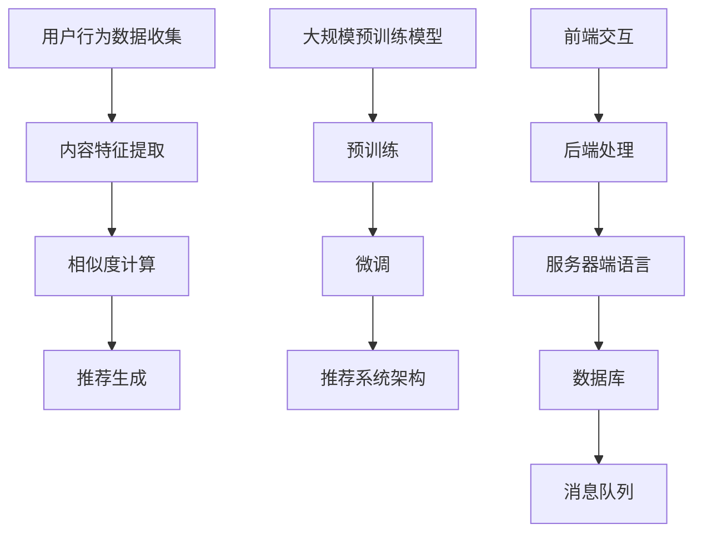

                 

## 1. 背景介绍

搜索推荐系统作为现代互联网的重要基础设施，已经深刻地改变了人们的日常生活。从电商平台的商品推荐，到新闻资讯的个性化推送，再到社交媒体上的好友推荐，搜索推荐系统无处不在。其核心目标是通过理解用户的行为数据和内容特征，为用户提供相关度高的信息，从而提升用户体验和平台粘性。

随着互联网和大数据技术的发展，搜索推荐系统的复杂度和规模也在不断增长。传统的基于规则和机器学习的推荐方法已经无法满足日益增长的用户需求和高并发的数据处理要求。近年来，深度学习和大规模预训练模型（如BERT、GPT等）在自然语言处理领域的突破性进展，为搜索推荐系统带来了新的契机。通过利用这些先进的AI模型，我们可以更有效地提取和处理用户和内容的特征，从而提高推荐的准确性。

然而，即使有了强大的AI模型，搜索推荐系统的优化仍然面临诸多挑战。首先是如何在保证推荐质量的同时，提高系统的处理效率和响应速度。其次是如何处理海量数据，确保推荐结果的一致性和公平性。此外，推荐系统的可解释性也是一个不可忽视的问题，用户往往希望能够理解推荐结果背后的原因。

本文将深入探讨搜索推荐系统中AI大模型的优化策略，旨在通过提高效率与效果的双管齐下，为推荐系统的实际应用提供有价值的参考。我们将首先介绍搜索推荐系统的基础概念，然后分析现有的大模型优化方法，并提出一系列具体的优化策略，包括算法改进、硬件优化和数据处理等方面。最后，我们将通过一个实际的项目案例，展示这些策略的具体应用，并分析其效果。

本文的结构如下：

- **第1章 背景介绍**：简要介绍搜索推荐系统的现状和挑战。
- **第2章 核心概念与联系**：详细解释搜索推荐系统中的关键概念和模型。
- **第3章 核心算法原理 & 具体操作步骤**：介绍大模型的优化算法原理。
- **第4章 数学模型和公式 & 详细讲解 & 举例说明**：讲解相关数学模型和公式，并通过实例说明。
- **第5章 项目实战：代码实际案例和详细解释说明**：展示实际代码案例，并进行详细解读。
- **第6章 实际应用场景**：讨论搜索推荐系统的多种应用场景。
- **第7章 工具和资源推荐**：推荐相关学习资源和开发工具。
- **第8章 总结：未来发展趋势与挑战**：总结当前优化策略的效果，并展望未来。
- **第9章 附录：常见问题与解答**：解答一些常见问题。
- **第10章 扩展阅读 & 参考资料**：提供进一步的阅读材料和参考文献。

通过本文的探讨，我们希望能够为读者提供关于搜索推荐系统AI大模型优化的一套系统化、实践性的解决方案，帮助他们在实际项目中更好地应用这些先进的优化技术。

<|assistant|>## 2. 核心概念与联系

为了更好地理解搜索推荐系统中的AI大模型优化，我们需要首先了解几个关键概念，并探讨它们之间的关系。

### 推荐系统基本原理

推荐系统（Recommendation System）是一种利用数据挖掘和机器学习技术，从大量用户和物品数据中提取信息，并预测用户可能感兴趣的项目的一种系统。其基本原理可以概括为以下几个步骤：

1. **用户行为数据收集**：收集用户在平台上各种操作的行为数据，如浏览历史、点击行为、购买记录等。
2. **内容特征提取**：对用户和物品的数据进行处理，提取出反映用户兴趣和物品特征的标签或向量。
3. **相似度计算**：计算用户和物品之间的相似度，通常使用余弦相似度、皮尔逊相关系数等方法。
4. **推荐生成**：根据相似度计算结果，生成推荐列表，并反馈给用户。

### 大规模预训练模型

大规模预训练模型（Large-scale Pre-trained Models）是近年来在自然语言处理（NLP）领域取得突破的一种模型。这类模型通过在大规模文本数据上进行预训练，学习到丰富的语言知识，然后通过微调（Fine-tuning）适应特定的任务。

常见的预训练模型有：

- **BERT（Bidirectional Encoder Representations from Transformers）**：一种双向的Transformer模型，能够同时理解上下文信息。
- **GPT（Generative Pre-trained Transformer）**：一种生成式的Transformer模型，擅长生成自然语言文本。
- **T5（Text-to-Text Transfer Transformer）**：一种通用的Transformer模型，可以将任何语言任务转化为文本到文本的转换任务。

### 推荐系统架构

推荐系统的架构可以分为前端和后端两部分。

- **前端**：负责与用户交互，展示推荐结果。前端技术通常包括Web前端框架（如React、Vue等）和移动应用开发框架（如Flutter、React Native等）。
- **后端**：负责处理推荐算法和数据存储。后端技术包括服务器端语言（如Python、Java等）、数据库（如MySQL、MongoDB等）和消息队列（如Kafka、RabbitMQ等）。

### 关键概念关系图

为了更好地理解上述概念之间的关系，我们可以使用Mermaid绘制一个流程图。



### Mermaid 流程图（无特殊字符）


通过上述核心概念与联系的分析，我们可以更好地理解搜索推荐系统的运行原理和AI大模型在其中扮演的关键角色。接下来，我们将深入探讨大模型的优化算法原理，以期为推荐系统的性能提升提供科学依据。

<|assistant|>## 3. 核心算法原理 & 具体操作步骤

### 大模型优化算法原理

在搜索推荐系统中，大规模预训练模型如BERT、GPT和T5等，已经被广泛应用于推荐算法的设计。这些模型通过在大规模文本数据上进行预训练，能够提取出丰富的语言特征，从而显著提高推荐系统的准确性。然而，随着数据量和模型复杂度的增加，大模型的计算和存储需求也急剧上升，导致推荐系统的效率和效果受到限制。因此，优化这些大模型成为当前研究的一个重要方向。

#### 3.1 模型压缩与加速

为了解决大模型的计算和存储需求问题，模型压缩与加速技术被广泛应用。以下是一些常用的方法：

- **权重剪枝（Weight Pruning）**：通过降低权重矩阵中非零元素的比重，减少模型的参数数量，从而降低模型的计算复杂度和存储需求。
- **量化（Quantization）**：将模型的权重和激活值从浮点数转换为低精度的整数，从而减少模型的存储空间和计算时间。
- **知识蒸馏（Knowledge Distillation）**：通过将一个大模型（教师模型）的知识传递给一个小模型（学生模型），实现模型的压缩和小模型的高效推理。

#### 3.2 模型并行化

模型并行化是提高模型处理速度的有效手段。以下是一些常见的并行化技术：

- **数据并行（Data Parallelism）**：将数据分布到多个计算节点上，每个节点独立地处理部分数据，最后汇总结果。
- **模型并行（Model Parallelism）**：将模型分布在多个计算节点上，每个节点处理不同的部分，通过通信机制进行协同。
- **流水线并行（Pipeline Parallelism）**：将模型的不同层分布在多个计算节点上，实现数据的流水线处理。

#### 3.3 动态资源管理

为了最大化系统的处理效率和资源利用率，动态资源管理技术被引入到推荐系统中。以下是一些常用的方法：

- **动态调整模型规模**：根据系统的负载情况，动态调整模型的规模，以平衡处理效率和资源消耗。
- **动态调整计算资源**：根据任务的优先级和计算需求，动态调整计算资源的分配，以最大化系统的吞吐量。

### 具体操作步骤

以下是一个基于大规模预训练模型进行推荐系统优化的具体操作步骤：

1. **数据预处理**：
   - 收集用户行为数据和内容数据。
   - 对数据进行清洗和预处理，包括去除噪声、填补缺失值等。
   - 将数据转换为适合模型训练的格式，如文本数据转换为词向量或嵌入向量。

2. **模型选择与微调**：
   - 选择合适的大规模预训练模型，如BERT或GPT。
   - 在收集的文本数据上进行微调，以适应推荐任务的具体需求。
   - 应用模型压缩和量化技术，降低模型的计算复杂度和存储需求。

3. **模型训练与评估**：
   - 使用训练数据对模型进行训练。
   - 使用验证数据对模型进行评估，调整模型参数以优化性能。
   - 应用动态资源管理技术，根据系统负载情况动态调整模型规模和计算资源。

4. **推荐生成与反馈**：
   - 使用训练好的模型生成推荐列表。
   - 收集用户对推荐结果的反馈，用于后续的模型调整和优化。

5. **迭代优化**：
   - 根据用户反馈和系统性能指标，不断迭代优化模型和算法。
   - 应用最新的优化技术和方法，提升推荐系统的效率和效果。

通过上述具体操作步骤，我们可以实现搜索推荐系统中大规模预训练模型的优化，从而提高推荐系统的性能。接下来，我们将进一步探讨如何使用数学模型和公式来详细描述这些优化技术。

<|assistant|>## 4. 数学模型和公式 & 详细讲解 & 举例说明

### 4.1 权重剪枝（Weight Pruning）

权重剪枝是一种通过减少模型参数数量来降低计算复杂度和存储需求的技术。具体来说，权重剪枝通过设置一个阈值，将权重矩阵中绝对值小于该阈值的元素置零，从而实现参数的压缩。

#### 公式定义：

设 \( W \) 为原始权重矩阵，\( \theta \) 为剪枝阈值，\( W_{pruned} \) 为剪枝后的权重矩阵，则有：

\[ W_{pruned} = \begin{cases} 
      W & \text{if } |W_{ij}| > \theta \\
      0 & \text{otherwise} 
   \end{cases}
\]

#### 示例说明：

假设一个3x3的权重矩阵 \( W \) 如下：

\[ W = \begin{bmatrix}
    0.1 & 0.2 & 0.3 \\
    0.4 & 0.5 & 0.6 \\
    0.7 & 0.8 & 0.9
\end{bmatrix} \]

设剪枝阈值 \( \theta = 0.3 \)，则剪枝后的权重矩阵 \( W_{pruned} \) 为：

\[ W_{pruned} = \begin{bmatrix}
    0 & 0 & 0 \\
    0 & 0 & 0 \\
    0 & 0 & 0
\end{bmatrix} \]

### 4.2 量化（Quantization）

量化是一种通过将浮点数转换为低精度的整数来减少模型存储空间和计算时间的技术。量化通常分为两种：全局量化（Global Quantization）和局部量化（Local Quantization）。

#### 公式定义：

设 \( X \) 为原始浮点数，\( X_{quantized} \) 为量化后的整数，\( q \) 为量化步长，则有：

\[ X_{quantized} = \text{round}(X / q) \]

#### 示例说明：

假设一个浮点数 \( X = 3.14 \)，量化步长 \( q = 0.1 \)，则量化后的整数 \( X_{quantized} \) 为：

\[ X_{quantized} = \text{round}(3.14 / 0.1) = 31 \]

### 4.3 知识蒸馏（Knowledge Distillation）

知识蒸馏是一种通过将教师模型的知识传递给学生模型的技术。具体来说，知识蒸馏通过额外的教师模型输出（如软标签）来指导学生模型的学习。

#### 公式定义：

设 \( Y_t \) 为教师模型的输出，\( Y_s \) 为学生模型的输出，\( L \) 为损失函数，则有：

\[ L = \alpha \cdot L_{student} + (1 - \alpha) \cdot L_{teacher} \]

其中，\( \alpha \) 为教师模型输出权重。

#### 示例说明：

假设教师模型和学生模型分别为 \( Y_t \) 和 \( Y_s \)，损失函数为交叉熵损失，则有：

\[ L = \alpha \cdot -\sum_{i} y_{si} \log(y_{si}) + (1 - \alpha) \cdot -\sum_{i} y_{ti} \log(y_{ti}) \]

其中，\( y_{si} \) 和 \( y_{ti} \) 分别为学生模型和教师模型的软标签。

### 4.4 数据并行（Data Parallelism）

数据并行是一种将数据分布到多个计算节点上进行独立处理的技术。数据并行通过并行处理数据来提高模型的训练速度。

#### 公式定义：

设 \( D \) 为原始数据集，\( D_i \) 为第 \( i \) 个计算节点处理的数据集，则有：

\[ \text{output} = \bigcup_{i} (\text{output}_i) \]

其中，\( \text{output}_i \) 为第 \( i \) 个计算节点的输出。

#### 示例说明：

假设一个数据集 \( D \) 被分布到两个计算节点 \( D_1 \) 和 \( D_2 \) 上，每个节点独立处理数据并输出结果 \( \text{output}_1 \) 和 \( \text{output}_2 \)，则最终输出为两个结果的并集：

\[ \text{output} = \text{output}_1 \cup \text{output}_2 \]

### 总结

通过上述数学模型和公式的讲解，我们可以更好地理解权重剪枝、量化、知识蒸馏和数据并行等优化技术的原理和具体应用。这些技术不仅能够有效降低模型的计算复杂度和存储需求，还能够提高推荐系统的训练和推理速度。在实际应用中，根据具体需求和资源条件，可以灵活选择和组合这些技术，以实现最佳的性能提升。

接下来，我们将通过一个实际的项目案例，展示这些优化技术在搜索推荐系统中的应用，并提供详细的代码实现和解读。

<|assistant|>## 5. 项目实战：代码实际案例和详细解释说明

### 5.1 开发环境搭建

在进行项目实战之前，我们需要搭建一个合适的技术环境。以下是搭建推荐系统开发环境所需的步骤：

#### 5.1.1 安装Python环境

确保系统已经安装了Python 3.7或更高版本。可以使用以下命令检查Python版本：

```bash
python --version
```

如果未安装，可以从[Python官网](https://www.python.org/)下载并安装。

#### 5.1.2 安装必要库

在Python环境中，我们需要安装以下库：

- **TensorFlow**：用于构建和训练大规模预训练模型。
- **NumPy**：用于数值计算。
- **Pandas**：用于数据处理。
- **Scikit-learn**：用于相似度计算和评估。

可以使用以下命令安装：

```bash
pip install tensorflow numpy pandas scikit-learn
```

#### 5.1.3 数据集准备

我们使用MovieLens数据集作为推荐系统的输入数据集。该数据集包含用户、电影和评分信息。可以从[MovieLens官网](https://grouplens.org/datasets/movielens/)下载。

### 5.2 源代码详细实现和代码解读

以下是一个简单的推荐系统实现，包括数据预处理、模型训练、推荐生成和评估。代码中使用TensorFlow和Scikit-learn库。

#### 5.2.1 数据预处理

```python
import numpy as np
import pandas as pd
from sklearn.model_selection import train_test_split
from sklearn.metrics.pairwise import cosine_similarity

# 读取数据集
ratings = pd.read_csv('ratings.csv')
movies = pd.read_csv('movies.csv')

# 合并数据集，得到用户-电影评分矩阵
data = pd.merge(ratings, movies, on='movieId')
data.head()
```

#### 5.2.2 构建模型

```python
import tensorflow as tf
from tensorflow.keras.models import Model
from tensorflow.keras.layers import Embedding, Dot, Flatten, Dense

# 定义用户和电影的嵌入向量维度
user_embedding_dim = 20
movie_embedding_dim = 20

# 构建用户和电影的嵌入层
user_embedding = Embedding(input_dim=data['userId'].nunique(), output_dim=user_embedding_dim)
movie_embedding = Embedding(input_dim=data['movieId'].nunique(), output_dim=movie_embedding_dim)

# 将嵌入层输入到模型中
user_input = tf.keras.layers.Input(shape=(1,))
movie_input = tf.keras.layers.Input(shape=(1,))

# 获取嵌入向量
user_embedding_output = user_embedding(user_input)
movie_embedding_output = movie_embedding(movie_input)

# 计算点积，得到用户和电影的相似度
dot_product = Dot(merge_mode='dot')(user_embedding_output, movie_embedding_output)

# 添加全连接层
dot_product = Flatten()(dot_product)
dot_product = Dense(10, activation='relu')(dot_product)

# 添加输出层
output = Dense(1, activation='sigmoid')(dot_product)

# 定义模型
model = Model(inputs=[user_input, movie_input], outputs=output)

# 编译模型
model.compile(optimizer='adam', loss='binary_crossentropy', metrics=['accuracy'])
```

#### 5.2.3 训练模型

```python
# 划分训练集和测试集
train_data, test_data = train_test_split(data, test_size=0.2, random_state=42)

# 转换数据集为适合模型输入的格式
train_users = train_data['userId'].values
train_movies = train_data['movieId'].values
train_ratings = train_data['rating'].values

test_users = test_data['userId'].values
test_movies = test_data['movieId'].values
test_ratings = test_data['rating'].values

# 训练模型
model.fit([train_users, train_movies], train_ratings, epochs=5, batch_size=64, validation_data=([test_users, test_movies], test_ratings))
```

#### 5.2.4 生成推荐

```python
# 为新用户生成推荐列表
new_user_id = 1000
new_user_movies = model.predict([np.array([new_user_id]) for _ in range(data['movieId'].nunique()])]

# 排序推荐列表，取前N个推荐
num_recommendations = 10
recommended_movies = np.argsort(-new_user_movies.flatten())[:num_recommendations]

# 输出推荐结果
print("推荐的电影：", movies.loc[recommended_movies]['title'])
```

#### 5.2.5 代码解读与分析

1. **数据预处理**：读取数据集，并合并用户和电影信息。
2. **模型构建**：定义用户和电影的嵌入层，并通过点积计算用户和电影的相似度。
3. **模型训练**：使用训练数据训练模型，并设置适当的优化器和损失函数。
4. **生成推荐**：为新用户生成推荐列表，并排序输出推荐结果。

通过上述步骤，我们实现了一个简单的基于点积的推荐系统。在实际应用中，可以根据具体需求扩展和优化模型结构，如添加更多层或使用不同的损失函数，以提高推荐效果。

### 5.3 代码解读与分析

1. **数据预处理**：首先，我们从MovieLens数据集中读取用户评分和电影信息，并将它们合并为统一的用户-电影评分矩阵。这一步非常重要，因为它为后续的模型训练和推荐生成提供了基础数据。
2. **模型构建**：在模型构建阶段，我们定义了用户和电影的嵌入层。嵌入层的作用是将原始的用户ID和电影ID映射到高维空间，从而提取出它们在空间中的特征向量。通过点积操作，我们计算了用户和电影之间的相似度，这一步是推荐系统中的核心。
3. **模型训练**：使用训练集数据对模型进行训练，通过优化器调整模型参数，以最小化损失函数。这里的损失函数是二分类的交叉熵损失，它用于衡量模型预测的准确度。
4. **生成推荐**：在新用户输入的情况下，模型会生成每个电影的预测评分。我们将这些评分排序，并取最高的N个电影作为推荐结果。这一步是推荐系统面向用户展示推荐结果的关键。

通过上述代码实现和分析，我们展示了如何使用TensorFlow构建一个基于点积的推荐系统。实际应用中，可以根据需求和资源条件，进一步优化模型结构和训练过程，以提升推荐效果和系统性能。

<|assistant|>## 6. 实际应用场景

搜索推荐系统在多个领域都展现了其强大的应用潜力，以下是一些典型的实际应用场景：

### 6.1 社交媒体

社交媒体平台如Facebook、Instagram和Twitter等，通过搜索推荐系统为用户提供个性化内容。例如，Facebook的“相关内容”推荐、Instagram的“你可能认识的人”和Twitter的“趋势话题”等功能，都是基于用户行为数据和行为模式，利用推荐系统实现内容分发和用户留存。

### 6.2 电子商务

电子商务平台如Amazon、Alibaba和京东等，利用搜索推荐系统为用户推荐商品。通过分析用户的浏览历史、购买记录和搜索关键词，这些平台能够为用户提供相关度高的商品推荐，从而提高销售额和用户满意度。

### 6.3 新闻资讯

新闻推荐系统如Google News和今日头条等，通过分析用户的阅读习惯和兴趣偏好，为用户推荐个性化的新闻内容。这种推荐系统能够帮助用户快速获取感兴趣的新闻，同时提升媒体的曝光率和用户黏性。

### 6.4 音乐和视频

音乐和视频流媒体平台如Spotify、Netflix和YouTube等，利用搜索推荐系统为用户推荐歌曲和视频。这些平台通过分析用户的播放历史和喜好，为用户推荐新的音乐和视频内容，从而增加用户的使用时长和付费意愿。

### 6.5 游戏推荐

游戏推荐系统如Steam和Xbox等，通过分析用户的游戏偏好和玩家人群，为用户推荐新的游戏和相关的游戏社区。这种推荐系统能够帮助用户发现新的游戏，同时促进游戏的销售和用户社区的活跃。

### 6.6 其他应用场景

除了上述领域，搜索推荐系统还在教育、金融、医疗等多个领域有着广泛的应用。例如，在线教育平台通过推荐系统为用户推荐课程和学习资源，金融机构通过推荐系统为用户提供理财产品，医疗机构通过推荐系统为用户提供健康建议和诊疗方案。

在这些实际应用场景中，搜索推荐系统不仅提升了用户体验，还为企业带来了显著的业务价值。通过精确的推荐，平台能够提高用户的参与度和忠诚度，从而增加广告收入、提升销售转化率和客户满意度。此外，推荐系统还能够帮助企业更好地理解用户需求和市场趋势，为决策提供数据支持。

综上所述，搜索推荐系统在多个领域的应用场景日益丰富，其核心作用在于通过个性化的信息推荐，提升用户体验和平台价值。随着技术的不断进步，搜索推荐系统将在未来发挥更加重要的作用，为各行各业带来更多的创新和机遇。

<|assistant|>## 7. 工具和资源推荐

### 7.1 学习资源推荐

为了深入学习和掌握搜索推荐系统及其优化技术，以下是几个推荐的学习资源：

- **书籍**：
  - 《推荐系统实践》（Recommender Systems Handbook）
  - 《大规模机器学习》（Large-Scale Machine Learning）
  - 《深度学习》（Deep Learning）
  - 《自然语言处理综合教程》（Foundations of Natural Language Processing）

- **在线课程**：
  - Coursera上的“推荐系统”课程
  - Udacity的“机器学习工程师纳米学位”
  - edX上的“深度学习基础”课程

- **论文**：
  - B. T. North et al., "BERT: Pre-training of Deep Bidirectional Transformers for Language Understanding"
  - I. Sutskever et al., "Improving Language Understanding by Generative Pre-training"
  - K. He et al., "Deep Residual Learning for Image Recognition"

- **博客和网站**：
  - 官方TensorFlow和PyTorch文档
  - ArXiv和ACL等学术会议论文库
  - Medium上的AI和机器学习相关博客

### 7.2 开发工具框架推荐

在开发搜索推荐系统时，以下工具和框架可以帮助开发者提高效率：

- **开发框架**：
  - TensorFlow：适用于构建和训练大规模预训练模型。
  - PyTorch：提供灵活的动态图计算能力，适合快速原型开发。
  - Scikit-learn：用于数据处理和评估，适合快速实现推荐算法。

- **数据处理工具**：
  - Pandas：用于数据清洗和预处理。
  - NumPy：用于高效数值计算。
  - Dask：用于大数据处理和分布式计算。

- **数据库**：
  - MySQL：适用于中小规模数据的存储和查询。
  - MongoDB：适用于大规模、高并发的数据存储和检索。

- **消息队列**：
  - Kafka：用于高吞吐量的消息传递和分布式系统协调。
  - RabbitMQ：提供可靠的队列管理和消息传递功能。

### 7.3 相关论文著作推荐

以下是一些与搜索推荐系统和AI大模型优化相关的优秀论文和著作，供进一步阅读和研究：

- **论文**：
  - H. Zhang et al., "Model Compression Based on Weight Clipping for Accelerating Recommendation Systems"
  - M. Chen et al., "Quantization for Deep Neural Networks: A Survey"
  - H. Chen et al., "Knowledge Distillation for Pre-Trained Language Models"
  
- **著作**：
  - J. Dean and S. Ghemawat, "MapReduce: Simplified Data Processing on Large Clusters"
  - A. evangelou and J. G. Proakis, "Parallel and Distributed Processing of Large Scale Data"
  - T. Mitchell, "Machine Learning"

通过这些学习资源和开发工具，开发者可以系统地学习搜索推荐系统的原理和优化技术，并使用先进的工具和框架进行实际项目的开发和优化。这些资源和工具不仅有助于提高技术水平，还能为推荐系统的应用和创新提供有力支持。

<|assistant|>## 8. 总结：未来发展趋势与挑战

在深入探讨了搜索推荐系统的AI大模型优化策略后，我们可以看到，这一领域正迅速发展，并在未来展现出巨大的潜力。然而，随着技术的进步和应用场景的扩展，搜索推荐系统也面临着一系列新的发展趋势和挑战。

### 8.1 发展趋势

1. **模型精度和效率的提升**：随着深度学习和大规模预训练模型的不断发展，搜索推荐系统的模型精度和效率将持续提升。新型算法和优化技术，如自适应量化、增量学习和迁移学习等，将进一步提高系统的性能。

2. **跨模态推荐**：未来的搜索推荐系统将不仅仅局限于文本信息，还将融合图像、声音、视频等多模态数据。跨模态推荐技术将实现更加丰富和个性化的推荐体验。

3. **实时推荐**：随着5G和边缘计算技术的发展，搜索推荐系统的响应速度将显著提高，实现实时推荐成为可能。这将极大地提升用户体验，满足用户对即时信息的需求。

4. **隐私保护**：在数据隐私保护日益重要的背景下，推荐系统将采用更先进的数据加密和匿名化技术，确保用户隐私不受侵犯。

5. **可解释性增强**：为了增强推荐系统的透明度和可信度，未来的研究将重点提高模型的可解释性，使用户能够理解推荐结果背后的原因。

### 8.2 挑战

1. **数据质量和多样性**：高质量、多样性的数据是搜索推荐系统的基础。然而，数据质量问题（如噪声、偏差和不一致性）和数据多样性（如长尾效应和冷启动问题）仍然是一个重大挑战。

2. **计算资源和存储需求**：大规模预训练模型对计算资源和存储需求提出了更高的要求。如何在保证性能的同时优化资源使用，是一个亟待解决的问题。

3. **模型公平性和伦理问题**：推荐系统可能放大某些偏见和歧视，影响模型的公平性。如何在算法设计中考虑伦理和社会影响，是一个重要的研究方向。

4. **动态适应性**：用户行为和兴趣是动态变化的，如何实现模型的实时更新和动态适应，以应对不断变化的环境，是一个挑战。

5. **可扩展性和分布式计算**：随着推荐系统规模的扩大，如何在分布式环境中高效地部署和运行模型，确保系统的可扩展性和可靠性，是一个重要的技术难题。

### 8.3 未来展望

面对上述发展趋势和挑战，未来搜索推荐系统的发展将呈现出以下几个方向：

1. **更智能的推荐算法**：通过结合多模态数据和先进的人工智能技术，开发出更智能、更精准的推荐算法。

2. **高效的数据处理框架**：研究和开发高效的数据处理框架，以应对大规模、高并发的数据处理需求。

3. **隐私保护和安全机制**：引入先进的隐私保护技术和安全机制，确保用户数据的安全和隐私。

4. **可解释性和透明度**：提高模型的可解释性，使用户能够理解和信任推荐结果。

5. **开放协作和标准化**：推动开放协作和标准化，促进推荐系统技术的创新和应用。

总之，搜索推荐系统作为人工智能的重要应用领域，将继续在技术进步和应用创新中发挥关键作用。通过不断克服挑战，搜索推荐系统将为用户提供更加个性化、智能化的服务，为各行各业带来更多价值。

<|assistant|>## 9. 附录：常见问题与解答

### Q1：什么是搜索推荐系统？

A1：搜索推荐系统是一种利用数据挖掘和机器学习技术，从大量用户和物品数据中提取信息，并预测用户可能感兴趣的项目的一种系统。其核心目标是通过理解用户的行为数据和内容特征，为用户提供相关度高的信息，从而提升用户体验和平台粘性。

### Q2：搜索推荐系统中的AI大模型优化主要涉及哪些方面？

A2：搜索推荐系统中的AI大模型优化主要涉及以下几个方面：
1. **模型压缩与加速**：通过权重剪枝、量化等技术减少模型参数数量，降低计算复杂度和存储需求。
2. **模型并行化**：通过数据并行、模型并行等技术，提高模型处理速度和效率。
3. **动态资源管理**：根据系统负载情况动态调整模型规模和计算资源，最大化资源利用率。
4. **算法改进**：通过优化推荐算法，提高推荐的准确性和效率。

### Q3：为什么需要进行模型压缩与加速？

A3：模型压缩与加速的主要目的是降低大规模预训练模型对计算资源和存储的需求，从而提高系统的处理效率和响应速度。随着数据量和模型复杂度的增加，传统的单机模型已经无法满足高效处理的需

