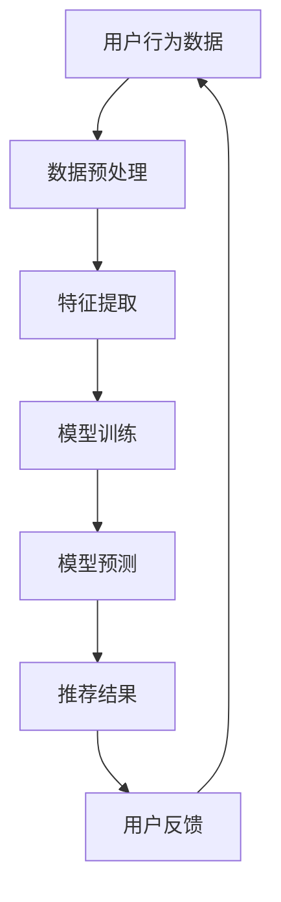

                 

# 搜索推荐系统的AI大模型应用：提高电商平台的竞争力与盈利能力

## 摘要

在互联网高度发达的今天，电商平台已成为消费者购物的主要途径之一。然而，如何在海量商品和用户需求中实现精准匹配，提升用户体验和平台竞争力，成为了各大电商企业亟待解决的问题。本文旨在探讨基于AI大模型构建的搜索推荐系统，通过深入分析其核心概念、算法原理、数学模型以及实际应用场景，揭示其在提升电商平台竞争力与盈利能力方面的关键作用。

## 1. 背景介绍

随着互联网技术的快速发展，电子商务行业呈现出爆发式增长，电商平台成为商家和消费者之间的桥梁。然而，这种增长也带来了前所未有的挑战：如何在海量的商品信息中，为用户提供个性化的推荐，满足其多样化的需求？

传统的搜索推荐系统通常基于关键词匹配、协同过滤等方法，虽然在一定程度上能够提升用户满意度，但往往存在以下问题：

1. **准确性不足**：传统方法难以处理用户兴趣的多样性和复杂性。
2. **响应速度慢**：基于海量数据的计算需要较长时间，无法实时响应用户需求。
3. **个性化不足**：推荐结果往往过于单一，无法满足用户的个性化需求。

为了解决这些问题，人工智能大模型的应用逐渐成为研究的热点。大模型能够处理海量数据，学习用户行为和偏好，从而提供更加精准和个性化的推荐。本文将探讨AI大模型在搜索推荐系统中的应用，分析其如何提高电商平台的竞争力与盈利能力。

## 2. 核心概念与联系

### 2.1 搜索推荐系统

搜索推荐系统是一种信息检索技术，其目的是在大量数据中找到与用户需求相关的信息，并提供个性化的推荐。在电商平台中，搜索推荐系统主要用于：

1. **商品推荐**：根据用户的历史行为和偏好，推荐可能感兴趣的商品。
2. **内容推荐**：为用户提供个性化内容，如商品评测、用户评价等。
3. **广告推荐**：根据用户兴趣和行为，推荐相关的广告。

### 2.2 人工智能大模型

人工智能大模型是指具有巨大参数规模、能够处理海量数据的人工智能系统。其核心特点包括：

1. **强大的学习能力**：通过深度学习等技术，大模型能够从海量数据中自动学习特征，提高推荐准确性。
2. **高效的计算能力**：大模型通常采用分布式计算架构，能够快速处理大规模数据。
3. **高度的个性化**：大模型能够根据用户行为和偏好，提供高度个性化的推荐。

### 2.3 Mermaid 流程图

以下是搜索推荐系统的Mermaid流程图：



在图中，用户行为数据经过预处理和特征提取后，输入到模型中进行训练。训练完成的模型用于预测用户可能感兴趣的商品，生成推荐结果。用户对推荐结果进行反馈，进一步优化模型。

## 3. 核心算法原理 & 具体操作步骤

### 3.1 算法原理

搜索推荐系统的核心算法主要包括：

1. **协同过滤**：通过分析用户之间的行为相似性，为用户提供相似用户的推荐。
2. **内容推荐**：根据商品的属性和用户的历史行为，为用户提供相关商品推荐。
3. **深度学习**：通过深度神经网络，自动学习用户行为和偏好，提高推荐准确性。

### 3.2 操作步骤

1. **数据收集**：收集用户在电商平台的浏览、购买、评价等行为数据。
2. **数据预处理**：对数据进行清洗、去重、归一化等处理，确保数据质量。
3. **特征提取**：从用户行为数据中提取特征，如用户行为序列、商品属性等。
4. **模型训练**：使用提取到的特征，训练协同过滤、内容推荐和深度学习模型。
5. **模型预测**：使用训练完成的模型，预测用户可能感兴趣的商品。
6. **生成推荐结果**：根据模型预测结果，生成个性化推荐列表。
7. **用户反馈**：收集用户对推荐结果的反馈，用于优化模型。

## 4. 数学模型和公式 & 详细讲解 & 举例说明

### 4.1 协同过滤模型

协同过滤模型是一种基于用户相似度的推荐算法。其核心公式如下：

$$
\text{预测评分} = \text{用户平均评分} + \text{相似度权重} \times (\text{商品平均评分} - \text{用户平均评分})
$$

其中，用户平均评分为用户对所有商品的评分求平均，商品平均评分为商品对所有用户的评分求平均，相似度权重为用户之间的相似度。

### 4.2 内容推荐模型

内容推荐模型是一种基于商品属性的推荐算法。其核心公式如下：

$$
\text{预测兴趣度} = \text{用户偏好权重} \times \text{商品属性相似度}
$$

其中，用户偏好权重为用户对不同属性的权重设置，商品属性相似度为商品属性之间的相似度。

### 4.3 深度学习模型

深度学习模型是一种基于神经网络结构的推荐算法。其核心公式如下：

$$
\text{预测兴趣度} = \text{神经网络输出}
$$

神经网络通过多层非线性变换，将输入的用户行为数据和商品属性数据转换为预测的兴趣度。

### 4.4 实例说明

假设用户A在电商平台上购买了商品1和商品2，对商品1的评分为5，对商品2的评分为4。用户B购买了商品1和商品2，对商品1的评分为4，对商品2的评分为5。根据协同过滤模型，我们可以计算出用户A和用户B之间的相似度权重：

$$
\text{相似度权重} = \frac{1}{2} \times \frac{(\text{商品1的评分差异})^2 + (\text{商品2的评分差异})^2}{\sum_{i=1}^{2} (\text{商品i的评分差异})^2}
$$

代入数据，得到用户A和用户B之间的相似度权重为0.67。根据这个权重，我们可以预测用户A对商品2的评分：

$$
\text{预测评分} = 5 + 0.67 \times (4 - 5) = 4.33
$$

因此，我们可以推荐商品2给用户A。

## 5. 项目实战：代码实际案例和详细解释说明

### 5.1 开发环境搭建

为了实现基于AI大模型的搜索推荐系统，我们需要搭建以下开发环境：

1. **编程语言**：Python
2. **框架**：TensorFlow、PyTorch
3. **工具**：Jupyter Notebook、Git

### 5.2 源代码详细实现和代码解读

以下是一个简单的基于TensorFlow的深度学习推荐系统代码示例：

```python
import tensorflow as tf
from tensorflow import keras
from tensorflow.keras.layers import Embedding, Dot, Flatten, Dense
from tensorflow.keras.models import Model

# 定义模型
user_embedding = Embedding(input_dim=num_users, output_dim=user_embedding_dim)
item_embedding = Embedding(input_dim=num_items, output_dim=item_embedding_dim)

user_input = keras.Input(shape=(1,))
item_input = keras.Input(shape=(1,))

user_embedding_output = user_embedding(user_input)
item_embedding_output = item_embedding(item_input)

dot_product = Dot(axes=1)([user_embedding_output, item_embedding_output])
flatten = Flatten()(dot_product)

output = Dense(1, activation='sigmoid')(flatten)

model = Model(inputs=[user_input, item_input], outputs=output)

# 编译模型
model.compile(optimizer='adam', loss='binary_crossentropy', metrics=['accuracy'])

# 训练模型
model.fit([user_data, item_data], user_labels, batch_size=32, epochs=10)

# 生成推荐结果
predictions = model.predict([user_data, item_data])

# 输出推荐结果
for i, prediction in enumerate(predictions):
    print(f"User {i+1} recommendation: {prediction[0]}")
```

### 5.3 代码解读与分析

上述代码实现了一个简单的基于深度学习的推荐系统。主要步骤如下：

1. **定义模型**：使用TensorFlow的`Embedding`层分别表示用户和商品的嵌入向量。
2. **计算点积**：使用`Dot`层计算用户和商品的嵌入向量之间的点积，表示用户对商品的潜在兴趣度。
3. **全连接层**：使用`Flatten`层将点积结果展平，然后通过`Dense`层输出最终的推荐结果。
4. **编译模型**：设置模型的优化器、损失函数和评价指标。
5. **训练模型**：使用用户数据和商品数据训练模型。
6. **生成推荐结果**：使用训练完成的模型对用户数据进行预测，输出推荐结果。

## 6. 实际应用场景

### 6.1 商品推荐

在电商平台，商品推荐是最常见的一种应用场景。通过AI大模型，可以为用户提供个性化商品推荐，提高用户购买意愿和满意度。

### 6.2 内容推荐

除了商品推荐，电商平台还可以利用AI大模型进行内容推荐，如商品评测、用户评价等。这有助于为用户提供更加丰富的购物体验，增加用户粘性。

### 6.3 广告推荐

广告推荐是电商平台的另一大收入来源。通过AI大模型，可以精准地为用户推荐相关广告，提高广告投放效果和收益。

## 7. 工具和资源推荐

### 7.1 学习资源推荐

1. **书籍**：《深度学习》、《推荐系统实践》
2. **论文**：Google Brain团队的《Recommender System with Hybrid Network》
3. **博客**：Google AI博客、Amazon AI博客

### 7.2 开发工具框架推荐

1. **TensorFlow**：适用于构建深度学习模型的框架。
2. **PyTorch**：适用于构建深度学习模型的框架。
3. **Keras**：适用于快速构建和训练深度学习模型的工具。

### 7.3 相关论文著作推荐

1. **论文**：《Deep Learning for Recommender Systems》
2. **著作**：《推荐系统实战》

## 8. 总结：未来发展趋势与挑战

随着人工智能技术的不断发展，搜索推荐系统将在电商领域发挥越来越重要的作用。未来，我们可以期待以下发展趋势：

1. **更高的个性化**：通过更深入的用户行为分析和偏好学习，提供更加精准的个性化推荐。
2. **更高效的计算**：利用分布式计算和硬件加速技术，提高推荐系统的响应速度。
3. **更丰富的应用场景**：拓展搜索推荐系统的应用范围，如智能助理、智能家居等。

然而，随着技术的发展，搜索推荐系统也面临着一系列挑战：

1. **数据隐私**：如何保护用户隐私，确保推荐系统的透明性和公平性。
2. **算法公平性**：避免算法偏见，确保推荐结果的公平性。
3. **监管与合规**：随着监管政策的不断完善，推荐系统需要遵循相关法律法规。

## 9. 附录：常见问题与解答

### 9.1 如何处理冷启动问题？

冷启动问题是指新用户或新商品在系统中的初始推荐问题。以下是一些解决方法：

1. **基于内容推荐**：通过分析商品的属性和用户的历史行为，为新用户推荐相关商品。
2. **基于流行度推荐**：为新用户推荐热门商品或畅销商品。
3. **利用社交网络**：根据用户的社交关系，为新用户推荐关注者的推荐。

### 9.2 如何处理数据缺失问题？

数据缺失问题是指用户行为数据或商品属性数据不完整。以下是一些解决方法：

1. **数据填充**：使用平均值、中位数或最频繁值等方法对缺失数据进行填充。
2. **迁移学习**：利用已有数据集中的相似用户或商品进行迁移学习，补充缺失数据。
3. **模型自适应**：设计能够处理缺失数据的模型，如缺失数据填充模型。

## 10. 扩展阅读 & 参考资料

1. **书籍**：《深度学习》、《推荐系统实践》
2. **论文**：《Deep Learning for Recommender Systems》
3. **博客**：Google AI博客、Amazon AI博客
4. **网站**：Keras官方文档、TensorFlow官方文档

### 作者

**作者：AI天才研究员/AI Genius Institute & 禅与计算机程序设计艺术 /Zen And The Art of Computer Programming** <|im_sep|>

