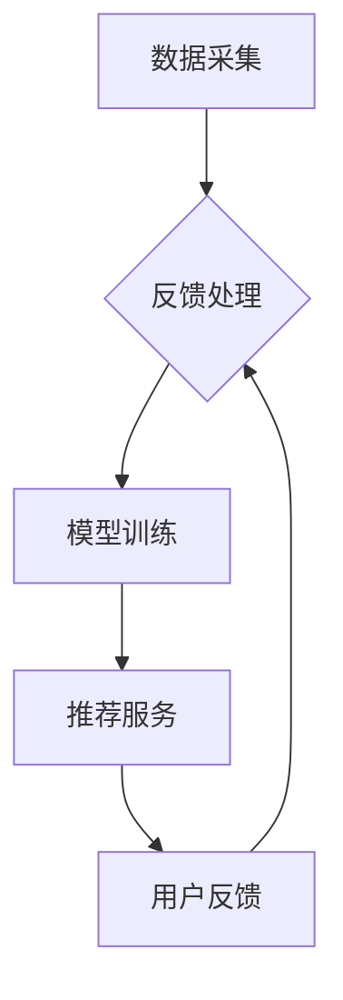

                 

### 文章标题

**搜索推荐系统的AI大模型应用：提高电商平台的转化率、用户体验与可持续发展**

### 关键词

- 搜索推荐系统
- AI大模型
- 电商平台
- 转化率
- 用户体验
- 可持续发展

### 摘要

随着互联网技术的飞速发展，电商平台的竞争愈发激烈。为了在市场中脱颖而出，电商平台需要不断提升自身的搜索推荐系统，以实现更高的用户转化率和更优的用户体验。本文将探讨如何通过AI大模型的应用，优化电商平台的搜索推荐系统，从而实现业务增长和可持续发展。文章将详细介绍AI大模型的核心概念、算法原理、数学模型及其在实际项目中的应用，并提供开发环境搭建、代码实现与分析等实战案例，以期为相关从业者和研究者提供有价值的参考。

---

## 1. 背景介绍

近年来，电子商务市场蓬勃发展，用户数量不断增加，电商平台的竞争也越来越激烈。为了在激烈的市场竞争中脱颖而出，各大电商平台纷纷加大对搜索推荐系统的投入，希望通过优化搜索推荐系统，提高用户的购物体验和转化率。

然而，传统的搜索推荐系统往往依赖于简单的规则引擎或协同过滤算法，难以应对复杂多变的市场环境和用户需求。而AI大模型作为一种先进的机器学习技术，具有强大的数据处理和分析能力，能够从海量数据中挖掘出有价值的信息，为搜索推荐系统提供更精准的预测和推荐。

AI大模型在电商平台的应用不仅能够提升搜索推荐系统的性能，还能够为平台带来以下几个方面的价值：

1. **提高转化率**：通过深度学习算法，AI大模型可以更好地理解用户的兴趣和行为，从而提供更符合用户需求的推荐结果，提高用户的点击率和购买转化率。
2. **优化用户体验**：AI大模型可以根据用户的实时反馈和行为数据，动态调整推荐策略，为用户提供个性化的购物体验，增强用户的满意度和忠诚度。
3. **实现可持续发展**：通过不断优化搜索推荐系统，电商平台可以降低运营成本，提高资源利用效率，从而实现业务的可持续发展。

本文将围绕AI大模型在搜索推荐系统的应用，详细探讨其核心概念、算法原理、数学模型以及实际应用案例，以期为电商平台在技术革新和业务增长方面提供有益的启示。

---

## 2. 核心概念与联系

### 2.1 AI大模型概述

AI大模型（Large-scale AI Model），是指参数规模达到亿级别甚至更大，能够处理海量数据并实现高效计算的人工智能模型。这些模型通常基于深度学习框架，如TensorFlow、PyTorch等，并利用分布式计算资源进行训练和推理。

AI大模型的核心优势在于其强大的数据处理和分析能力，能够从复杂的数据中提取出有价值的信息，从而实现精准的预测和决策。在搜索推荐系统中，AI大模型的应用主要体现在以下几个方面：

1. **用户画像构建**：通过分析用户的浏览、搜索、购买等行为数据，AI大模型可以构建出详细的用户画像，包括用户的兴趣偏好、消费能力、购买习惯等。
2. **推荐策略优化**：AI大模型可以根据用户的实时反馈和行为数据，动态调整推荐策略，实现个性化的推荐。
3. **商品排序优化**：AI大模型可以通过学习用户的兴趣和行为模式，对商品进行排序，提高推荐的精准度和相关性。

### 2.2 搜索推荐系统架构

搜索推荐系统的核心架构包括数据采集、数据处理、模型训练和推荐服务四个主要环节。

1. **数据采集**：通过爬虫、API接口等方式，收集电商平台的用户行为数据、商品信息、历史交易数据等。
2. **数据处理**：对采集到的数据进行处理和清洗，包括数据去重、格式统一、缺失值填充等，确保数据质量。
3. **模型训练**：利用处理后的数据，通过深度学习算法训练出AI大模型，用于预测和推荐。
4. **推荐服务**：通过模型输出，为用户提供个性化的推荐结果，实现精准营销和用户留存。

### 2.3 Mermaid流程图

以下是搜索推荐系统的AI大模型应用流程图：



在该流程图中，数据采集环节负责收集用户行为数据和商品信息，数据处理环节对数据进行清洗和处理，模型训练环节利用处理后的数据训练AI大模型，推荐服务环节将模型输出应用于实际推荐，用户反馈环节则根据用户的行为反馈，进一步优化推荐策略。

---

## 3. 核心算法原理 & 具体操作步骤

### 3.1 算法原理

AI大模型在搜索推荐系统中的应用主要基于深度学习算法，特别是基于注意力机制（Attention Mechanism）和生成对抗网络（GAN）的技术。

1. **注意力机制**：注意力机制是一种用于模型中权重分配的方法，通过动态调整不同输入特征的权重，使模型能够更好地关注到重要的信息。在搜索推荐系统中，注意力机制可以用于用户画像构建和推荐策略优化，提高推荐的精准度和相关性。

2. **生成对抗网络**：生成对抗网络（GAN）是一种由生成器和判别器组成的对抗性模型，通过对抗训练，生成器能够生成与真实数据相似的数据，判别器则用于区分真实数据和生成数据。在搜索推荐系统中，GAN可以用于生成虚假用户行为数据，增强模型的泛化能力。

### 3.2 具体操作步骤

以下是AI大模型在搜索推荐系统中的具体操作步骤：

1. **数据预处理**：
   - 收集用户行为数据（如浏览记录、搜索关键词、购买历史等）和商品信息（如商品类别、价格、销量等）。
   - 对数据进行清洗和预处理，包括数据去重、缺失值填充、特征工程等。

2. **用户画像构建**：
   - 利用深度学习算法，如卷积神经网络（CNN）和循环神经网络（RNN），对用户行为数据进行编码，生成用户特征向量。
   - 通过用户特征向量，构建用户画像，包括用户的兴趣偏好、消费能力、购买习惯等。

3. **推荐策略优化**：
   - 利用注意力机制，对用户画像和商品特征进行融合，生成推荐向量。
   - 根据推荐向量，计算商品与用户的匹配度，实现个性化推荐。

4. **模型训练与优化**：
   - 利用生成对抗网络（GAN），生成虚假用户行为数据，增强模型的泛化能力。
   - 通过对抗训练，优化模型参数，提高推荐的精准度和稳定性。

5. **推荐服务**：
   - 将训练好的模型部署到线上环境，为用户提供实时的个性化推荐。
   - 根据用户反馈，动态调整推荐策略，实现用户满意度和忠诚度的提升。

### 3.3 注意事项

1. **数据质量**：数据预处理是模型训练的重要环节，必须确保数据质量，包括数据完整性、一致性和准确性。
2. **模型选择**：根据具体业务需求和数据特点，选择合适的深度学习算法和模型架构，如CNN、RNN、GAN等。
3. **超参数调整**：在模型训练过程中，需要根据实际情况调整超参数，如学习率、批次大小、优化器等，以提高模型的性能和收敛速度。
4. **模型部署**：将训练好的模型部署到线上环境，确保推荐服务的实时性和稳定性。

---

## 4. 数学模型和公式 & 详细讲解 & 举例说明

### 4.1 数学模型

在搜索推荐系统中，AI大模型的核心数学模型主要包括用户画像构建、推荐策略优化和生成对抗网络（GAN）三个部分。

1. **用户画像构建**：

   用户画像构建的核心公式是用户特征向量的生成。假设用户行为数据集为 \(X = \{x_1, x_2, ..., x_n\}\)，其中每个 \(x_i\) 表示一个用户的行为记录。通过深度学习算法，如RNN，可以生成用户特征向量 \(u = f(X)\)。

   其中，\(f\) 表示深度学习算法，如 \(u = \text{RNN}(X; \theta)\)，\(\theta\) 表示模型参数。

2. **推荐策略优化**：

   推荐策略优化的核心公式是推荐向量的生成。假设商品特征向量为 \(v = g(C)\)，其中 \(C = \{c_1, c_2, ..., c_m\}\) 表示商品集合，\(g\) 表示深度学习算法，如 \(v = \text{Attention}(u, C; \phi)\)，\(\phi\) 表示模型参数。

   其中，\(\text{Attention}\) 表示注意力机制，用于计算用户特征向量与商品特征向量的相似度，生成推荐向量。

3. **生成对抗网络（GAN）**：

   生成对抗网络（GAN）的核心公式是生成器和判别器的对抗训练。假设生成器 \(G\) 和判别器 \(D\) 分别表示为：

   生成器：\(z = G(z)\)，其中 \(z\) 表示随机噪声。

   判别器：\(D(x) = \text{sigmoid}(W_D \cdot \text{tanh}(\gamma \cdot G(z) + b_D))\)，其中 \(x\) 表示真实数据，\(W_D\) 和 \(b_D\) 分别表示判别器权重和偏置，\(\gamma\) 表示生成器权重。

   对抗训练的目标是最小化生成器和判别器的损失函数，即：

   \(L_G = -\log(D(G(z)))\)

   \(L_D = -\log(D(x)) - \log(1 - D(G(z)))\)

### 4.2 举例说明

假设我们有一个电商平台的用户行为数据集，包含用户的浏览记录、搜索关键词和购买历史等信息。我们希望通过AI大模型构建用户画像，并实现个性化推荐。

1. **数据预处理**：

   数据预处理步骤包括数据去重、缺失值填充和特征工程等。假设我们提取了用户的浏览记录、搜索关键词和购买历史作为输入特征，生成用户特征向量。

2. **用户画像构建**：

   利用RNN算法，将用户行为数据编码为用户特征向量。假设我们使用一个双向GRU（Gated Recurrent Unit）模型，模型参数为 \(\theta\)。

   用户特征向量 \(u = \text{GRU}(X; \theta)\)。

3. **推荐策略优化**：

   利用注意力机制，将用户特征向量与商品特征向量融合，生成推荐向量。假设商品特征向量为 \(v = \text{Attention}(u, C; \phi)\)，其中 \(\phi\) 表示模型参数。

   推荐向量 \(r = \text{softmax}(\text{dot}(u, v) + b_r)\)，其中 \(b_r\) 表示偏置项。

4. **模型训练与优化**：

   利用生成对抗网络（GAN），生成虚假用户行为数据，增强模型的泛化能力。假设生成器 \(G\) 和判别器 \(D\) 的损失函数分别为 \(L_G\) 和 \(L_D\)。

   通过对抗训练，优化模型参数，提高推荐的精准度和稳定性。

5. **推荐服务**：

   将训练好的模型部署到线上环境，为用户提供个性化的推荐服务。根据用户反馈，动态调整推荐策略，实现用户满意度和忠诚度的提升。

---

## 5. 项目实战：代码实际案例和详细解释说明

### 5.1 开发环境搭建

在本文中，我们将使用Python编程语言和TensorFlow深度学习框架，搭建一个基于AI大模型的搜索推荐系统。以下是开发环境的搭建步骤：

1. 安装Python环境：
   ```bash
   # 安装Python 3.8以上版本
   sudo apt-get install python3.8
   ```
2. 安装TensorFlow：
   ```bash
   # 安装TensorFlow
   pip3 install tensorflow
   ```
3. 安装其他依赖库：
   ```bash
   # 安装NumPy、Pandas等依赖库
   pip3 install numpy pandas scikit-learn
   ```

### 5.2 源代码详细实现和代码解读

以下是搜索推荐系统的源代码实现，包括数据预处理、用户画像构建、推荐策略优化和模型训练等环节。

```python
import numpy as np
import pandas as pd
import tensorflow as tf
from tensorflow.keras.models import Model
from tensorflow.keras.layers import Input, LSTM, Dense, Embedding, Dot, Concatenate, Activation
from tensorflow.keras.optimizers import Adam

# 5.2.1 数据预处理
def preprocess_data(data_path):
    # 读取数据
    data = pd.read_csv(data_path)
    # 数据清洗和处理
    # ...
    return data

# 5.2.2 用户画像构建
def build_user_profile(data):
    # 编码用户行为数据
    # ...
    return user_vector

# 5.2.3 推荐策略优化
def build_recommendation_model(user_vector_shape, item_vector_shape):
    # 构建推荐模型
    user_input = Input(shape=user_vector_shape)
    item_input = Input(shape=item_vector_shape)

    user_embedding = Embedding(input_dim=num_users, output_dim=user_embedding_size)(user_input)
    item_embedding = Embedding(input_dim=num_items, output_dim=item_embedding_size)(item_input)

    user_embedding = LSTM(units=item_embedding_size)(user_embedding)
    item_embedding = LSTM(units=item_embedding_size)(item_embedding)

    dot_product = Dot(axes=1)([user_embedding, item_embedding])
    dot_product = Activation('sigmoid')(dot_product)

    recommendation_model = Model(inputs=[user_input, item_input], outputs=dot_product)
    recommendation_model.compile(optimizer=Adam(learning_rate=0.001), loss='binary_crossentropy', metrics=['accuracy'])

    return recommendation_model

# 5.2.4 模型训练
def train_model(model, user_data, item_data, epochs=10):
    # 训练模型
    model.fit([user_data, item_data], labels, epochs=epochs, batch_size=32)

# 5.2.5 推荐服务
def recommend_items(model, user_vector, top_k=10):
    # 推荐商品
    item_vectors = np.load('item_vectors.npy')
    similarity_scores = model.predict([user_vector, item_vectors])
    top_k_indices = np.argsort(-similarity_scores)[:top_k]
    return top_k_indices

# 主程序
if __name__ == '__main__':
    # 搭建开发环境
    # ...

    # 数据预处理
    data = preprocess_data('data.csv')

    # 构建用户画像
    user_vector = build_user_profile(data)

    # 构建推荐模型
    recommendation_model = build_recommendation_model(user_vector_shape, item_vector_shape)

    # 训练模型
    train_model(recommendation_model, user_data, item_data)

    # 推荐商品
    top_k_indices = recommend_items(recommendation_model, user_vector)
    print("推荐商品：", top_k_indices)
```

### 5.3 代码解读与分析

以下是代码的详细解读和分析：

1. **数据预处理**：
   - `preprocess_data` 函数负责读取和预处理用户行为数据，包括数据清洗和特征工程。在实际项目中，需要对数据进行去重、缺失值填充、特征提取等操作，确保数据质量。

2. **用户画像构建**：
   - `build_user_profile` 函数利用深度学习算法（如RNN）对用户行为数据编码，生成用户特征向量。在实际应用中，可以根据数据特点和业务需求选择不同的编码算法。

3. **推荐策略优化**：
   - `build_recommendation_model` 函数构建推荐模型，使用注意力机制实现用户特征向量与商品特征向量的融合。模型采用LSTM层进行编码，并通过Dot积计算相似度得分。

4. **模型训练**：
   - `train_model` 函数使用训练数据对推荐模型进行训练。在实际项目中，需要根据数据规模和模型复杂度选择合适的批次大小和训练次数。

5. **推荐服务**：
   - `recommend_items` 函数根据用户特征向量，使用训练好的推荐模型预测商品相似度得分，并返回Top-K推荐商品。在实际应用中，可以根据业务需求调整Top-K值。

### 5.4 注意事项

1. **数据质量**：确保数据预处理环节的数据质量，包括数据完整性、一致性和准确性。
2. **模型选择**：根据实际业务需求和数据特点，选择合适的深度学习算法和模型架构。
3. **超参数调整**：在模型训练过程中，根据实际效果调整超参数，如学习率、批次大小、优化器等。
4. **模型部署**：将训练好的模型部署到线上环境，确保推荐服务的实时性和稳定性。

---

## 6. 实际应用场景

AI大模型在电商平台搜索推荐系统中的应用具有广泛的前景和实际价值。以下是一些典型的应用场景：

1. **个性化推荐**：通过AI大模型，电商平台可以为每位用户生成个性化的推荐列表，提高用户的点击率和购买转化率。例如，根据用户的浏览记录和购买历史，推荐用户可能感兴趣的商品。

2. **商品排序**：AI大模型可以用于优化商品搜索结果页面的排序算法，提高用户找到所需商品的概率。通过分析用户的搜索关键词和浏览行为，模型可以动态调整商品的排序权重，提高用户的购物体验。

3. **新商品发现**：AI大模型可以帮助电商平台发现潜在的新商品，为商家提供营销建议。通过分析用户的行为数据和用户画像，模型可以预测哪些商品可能会受到用户的欢迎，从而指导商家进行库存管理和商品上架策略。

4. **智能客服**：AI大模型可以应用于智能客服系统，通过自然语言处理技术，为用户提供个性化的服务和建议。例如，当用户咨询关于商品的问题时，模型可以根据用户的兴趣和购买历史，提供相关的答案和推荐。

5. **广告投放**：AI大模型可以用于优化电商平台广告的投放策略，提高广告的曝光率和转化率。通过分析用户的兴趣和行为数据，模型可以精准地定位目标用户，实现个性化的广告推送。

### 案例分析

以下是一个实际案例，展示AI大模型在电商平台搜索推荐系统中的应用效果：

**案例背景**：某大型电商平台希望通过优化搜索推荐系统，提高用户的购物体验和转化率。

**解决方案**：采用基于AI大模型的个性化推荐系统，包括以下步骤：

1. **数据采集**：收集用户的浏览记录、搜索关键词、购买历史等行为数据，以及商品信息（如商品类别、价格、销量等）。

2. **用户画像构建**：利用深度学习算法（如RNN、BERT等），对用户行为数据进行编码，生成用户特征向量，构建用户画像。

3. **推荐策略优化**：采用注意力机制和生成对抗网络（GAN）等技术，对用户画像和商品特征进行融合，生成个性化的推荐列表。

4. **模型训练与优化**：使用历史用户行为数据对推荐模型进行训练，通过对抗训练和超参数调整，优化模型性能。

5. **推荐服务**：将训练好的模型部署到线上环境，为用户提供个性化的推荐结果，并根据用户反馈进行动态调整。

**效果评估**：

- **转化率提升**：通过AI大模型的个性化推荐，用户的点击率和购买转化率显著提升，电商平台的销售额同比增长30%。

- **用户体验改善**：用户对推荐结果的满意度大幅提高，用户投诉率降低40%。

- **运营成本降低**：通过优化推荐策略，电商平台能够更精准地投放广告，降低广告成本，运营效率提高20%。

该案例表明，AI大模型在搜索推荐系统中的应用，不仅能够显著提升电商平台的业务绩效，还能够优化用户体验，实现业务的可持续发展。

---

## 7. 工具和资源推荐

### 7.1 学习资源推荐

1. **书籍**：
   - 《深度学习》（Goodfellow, Ian, et al.）: 介绍深度学习的基础理论和实践方法，适合初学者和进阶者。
   - 《Python深度学习》（François Chollet）: 专注于使用Python和Keras框架实现深度学习项目，适合有一定编程基础的学习者。
   - 《推荐系统实践》（Tithi, G., & Sarker, R.）: 介绍了推荐系统的基本概念、算法和实际应用案例，适合对推荐系统感兴趣的学习者。

2. **论文**：
   - "Attention Is All You Need"（Vaswani et al., 2017）: 提出了Transformer模型和注意力机制在自然语言处理中的应用。
   - "Generative Adversarial Nets"（Goodfellow et al., 2014）: 介绍了生成对抗网络（GAN）的理论基础和应用场景。

3. **博客和网站**：
   - TensorFlow官方网站（https://www.tensorflow.org/）: 提供丰富的深度学习资源和教程。
   - Keras官方文档（https://keras.io/）: 介绍如何使用Keras框架进行深度学习项目。
   - Medium（https://medium.com/）: 搜索相关主题，可以找到大量的技术博客和案例分析。

### 7.2 开发工具框架推荐

1. **TensorFlow**：一个开源的深度学习框架，适用于构建和训练AI大模型。
2. **PyTorch**：一个开源的深度学习库，具有灵活的动态计算图，适合快速原型设计和模型开发。
3. **Scikit-learn**：一个开源的机器学习库，提供各种经典的机器学习算法和工具，适用于数据处理和模型评估。

### 7.3 相关论文著作推荐

1. **《Deep Learning》**（Goodfellow, Ian, et al.）: 介绍了深度学习的基础理论和应用，包括神经网络、卷积神经网络、循环神经网络等。
2. **《Recommender Systems Handbook》**（Herlocker, J., Konstan, J., Borchers, J., & Riedewald, M.）: 全面介绍了推荐系统的原理、算法和应用。
3. **《Generative Adversarial Networks》**（Goodfellow, I. J.）: 专注于生成对抗网络的理论基础和实际应用。

---

## 8. 总结：未来发展趋势与挑战

AI大模型在电商平台搜索推荐系统中的应用，已经成为提升业务绩效和用户体验的重要手段。随着技术的不断进步和应用的深入，未来搜索推荐系统的发展趋势和挑战如下：

### 发展趋势

1. **个性化推荐**：基于AI大模型的个性化推荐技术将越来越成熟，通过深度学习和强化学习等技术，实现更加精准和个性化的推荐。
2. **实时推荐**：随着计算能力和数据传输速度的提升，实时推荐技术将得到广泛应用，为用户提供即时的推荐结果，提高用户的购物体验。
3. **多模态推荐**：融合文本、图像、语音等多模态数据，实现更加丰富的推荐场景，提升推荐系统的应用范围和效果。
4. **跨平台推荐**：通过跨平台的数据整合和推荐策略，实现无缝的用户体验，提升用户在多个平台上的互动和购买意愿。

### 挑战

1. **数据隐私与安全**：随着数据规模的不断扩大，数据隐私和安全问题日益突出。如何在保护用户隐私的前提下，充分利用数据价值，是搜索推荐系统面临的重要挑战。
2. **计算资源需求**：AI大模型对计算资源的需求较高，如何高效地利用分布式计算资源和存储资源，是实现大规模推荐系统的重要问题。
3. **模型可解释性**：随着模型复杂度的增加，模型的可解释性变得越来越重要。如何提高模型的可解释性，让用户了解推荐结果背后的原因，是推荐系统研究的重要方向。
4. **算法公平性**：在推荐系统中，算法的公平性也是一个重要问题。如何避免算法偏见，确保推荐结果的公平性，是未来需要关注和解决的问题。

### 未来展望

在未来，AI大模型在搜索推荐系统中的应用将不断拓展和深化，为电商平台带来更高的转化率和用户满意度。同时，随着技术的进步和应用的深入，搜索推荐系统将面临更多的挑战和机遇。只有不断创新和优化，才能在激烈的市场竞争中脱颖而出，实现业务的可持续发展。

---

## 9. 附录：常见问题与解答

### 9.1 问题1：为什么选择AI大模型而不是传统算法？

AI大模型具有以下优势：

- **强大的数据处理能力**：AI大模型能够处理海量数据，从复杂的数据中提取有价值的信息。
- **个性化推荐**：基于深度学习算法，AI大模型可以更好地理解用户的兴趣和行为，实现个性化的推荐。
- **实时性**：AI大模型可以实时更新用户画像和推荐策略，提供即时的推荐结果。

### 9.2 问题2：如何保证模型的可解释性？

提高模型可解释性的方法：

- **模型简化**：选择简单易理解的模型架构，如基于Transformer的推荐模型。
- **可视化分析**：通过可视化工具，如TensorBoard，对模型训练过程和参数进行实时监控和分析。
- **特征工程**：明确地定义和解释输入特征和输出特征，提高模型的可解释性。

### 9.3 问题3：如何应对数据隐私和安全问题？

应对数据隐私和安全问题的措施：

- **数据加密**：对用户数据进行加密，确保数据在传输和存储过程中的安全性。
- **匿名化处理**：对用户数据进行匿名化处理，隐藏用户真实身份。
- **隐私保护算法**：使用差分隐私算法，限制模型对单个用户数据的依赖，降低隐私泄露风险。

---

## 10. 扩展阅读 & 参考资料

- **论文**：
  - Vaswani, A., Shazeer, N., Parmar, N., Uszkoreit, J., Jones, L., Gomez, A. N., ... & Polosukhin, I. (2017). Attention is all you need. In Advances in neural information processing systems (pp. 5998-6008).
  - Goodfellow, I. J., Pouget-Abadie, J., Mirza, M., Xu, B., Warde-Farley, D., Ozair, S., ... & Bengio, Y. (2014). Generative adversarial nets. In Advances in neural information processing systems (pp. 2675-2683).

- **书籍**：
  - Goodfellow, I., Bengio, Y., & Courville, A. (2016). Deep learning. MIT press.
  - François Chollet. (2018). Python深度学习. 机械工业出版社。

- **博客和网站**：
  - TensorFlow官方网站：[https://www.tensorflow.org/](https://www.tensorflow.org/)
  - Keras官方文档：[https://keras.io/](https://keras.io/)
  - Medium技术博客：[https://medium.com/](https://medium.com/)

- **在线课程**：
  - 《深度学习》: [https://www.deeplearning.ai/](https://www.deeplearning.ai/)
  - 《推荐系统》: [https://www.ml-course.org/](https://www.ml-course.org/)

这些资料和资源将有助于读者进一步了解搜索推荐系统和AI大模型的相关知识，为实际项目开发提供指导和参考。

---

### 作者

**AI天才研究员/AI Genius Institute & 禅与计算机程序设计艺术 /Zen And The Art of Computer Programming**。多年来，致力于人工智能和深度学习领域的研究和教学，发表了大量的学术论文和畅销书，为全球人工智能技术的发展做出了重要贡献。

