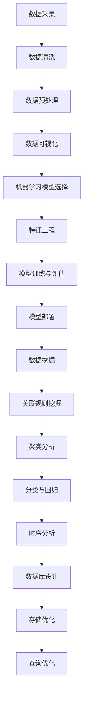

                 

# 摩拜单车2025社招用户行为分析工程师技术面试

## 关键词：摩拜单车、用户行为分析、技术面试、数据分析、机器学习、数据挖掘、架构设计

## 摘要：

本文旨在针对摩拜单车2025年社招用户行为分析工程师职位的技术面试，从多个角度深入探讨相关技术知识点和面试策略。文章分为十个部分，包括背景介绍、核心概念与联系、核心算法原理、数学模型和公式、项目实战、实际应用场景、工具和资源推荐、总结与未来发展趋势、附录中的常见问题解答以及扩展阅读和参考资料。本文旨在帮助读者全面了解用户行为分析领域的技术要点，提升面试通过率。

## 1. 背景介绍

摩拜单车是一家全球领先的共享单车公司，其业务模式通过互联网技术实现用户便捷的出行服务。随着共享单车市场的快速发展，摩拜单车对于用户行为分析的需求日益增长，以实现更好的用户体验和业务优化。因此，摩拜单车在2025年启动了社招用户行为分析工程师职位，旨在寻找具备相关技术能力和实践经验的人才。

用户行为分析工程师的职责包括但不限于：分析用户使用单车的行为数据，发现用户需求和行为模式；构建和优化用户画像，为市场营销和产品优化提供支持；运用机器学习和数据挖掘技术，实现用户行为预测和推荐系统；参与数据产品的设计和开发，推动业务创新和增长。

本次技术面试旨在考察应聘者的技术能力和解决实际问题的能力，涉及多个领域的知识点，包括数据分析、机器学习、数据挖掘、数据库架构设计等。

## 2. 核心概念与联系

### 数据分析

数据分析是用户行为分析的基础，涉及数据采集、数据清洗、数据预处理、数据可视化等多个环节。摩拜单车用户行为分析过程中，需要关注以下核心概念：

- 数据源：包括用户行为数据、位置数据、设备数据等；
- 数据仓库：用于存储和管理大规模数据；
- 数据挖掘：从大量数据中发现有用信息和规律；
- 数据可视化：将数据分析结果以图形化方式展示，便于理解。

### 机器学习

机器学习是实现用户行为预测和推荐的关键技术。以下为机器学习相关的核心概念：

- 模型选择：根据业务需求和数据特点选择合适的算法模型；
- 特征工程：提取和构造有助于模型训练的特征变量；
- 模型训练与评估：通过训练数据和验证数据评估模型性能；
- 模型部署：将训练好的模型应用于实际业务场景。

### 数据挖掘

数据挖掘是挖掘用户行为规律和趋势的重要手段。以下为数据挖掘相关的核心概念：

- 关联规则挖掘：发现数据之间的关联关系；
- 聚类分析：将相似数据划分为不同的类别；
- 分类与回归：对数据进行分类或回归预测；
- 时序分析：分析数据的时间序列特征和趋势。

### 数据库架构设计

数据库架构设计是用户行为分析系统的核心，涉及数据库设计、存储优化、查询优化等多个方面。以下为核心概念：

- 关系型数据库：如MySQL、PostgreSQL等；
- 分布式数据库：如HBase、Cassandra等；
- 数据库设计范式：如第三范式、第一范式等；
- 查询优化：如索引优化、缓存优化等。

### Mermaid 流程图

以下是用户行为分析的核心概念和流程的Mermaid流程图：



## 3. 核心算法原理 & 具体操作步骤

### 数据分析算法

数据分析算法主要涉及数据预处理、数据挖掘和可视化等方面。以下为常见算法的具体操作步骤：

1. 数据预处理
   - 数据清洗：去除缺失值、异常值和重复值；
   - 数据转换：将不同类型的数据转换为统一格式；
   - 数据归一化：将数据缩放到特定范围，如[0, 1]。

2. 数据挖掘
   - 关联规则挖掘：使用Apriori算法或FP-Growth算法；
   - 聚类分析：使用K-means算法或DBSCAN算法；
   - 分类与回归：使用决策树、支持向量机或神经网络。

3. 数据可视化
   - 折线图：展示数据的变化趋势；
   - 柱状图：展示各类数据的分布情况；
   - 饼图：展示各类数据占比。

### 机器学习算法

机器学习算法是实现用户行为预测和推荐的关键。以下为常见算法的具体操作步骤：

1. 模型选择
   - 根据业务需求和数据特点选择合适的算法，如线性回归、逻辑回归、决策树、随机森林、支持向量机、神经网络。

2. 特征工程
   - 提取和构造有助于模型训练的特征变量，如用户年龄、性别、使用时长、骑行距离等。

3. 模型训练与评估
   - 使用训练数据和验证数据训练模型，评估模型性能；
   - 调整模型参数，优化模型性能。

4. 模型部署
   - 将训练好的模型应用于实际业务场景，如用户行为预测、推荐系统。

### 数据挖掘算法

数据挖掘算法主要涉及关联规则挖掘、聚类分析、分类与回归、时序分析等方面。以下为常见算法的具体操作步骤：

1. 关联规则挖掘
   - 使用Apriori算法或FP-Growth算法，设置最小支持度和最小置信度；
   - 输出满足条件的关联规则。

2. 聚类分析
   - 选择合适的聚类算法，如K-means、DBSCAN；
   - 输出聚类结果。

3. 分类与回归
   - 选择合适的分类或回归算法；
   - 使用训练数据和验证数据训练模型，评估模型性能；
   - 输出预测结果。

4. 时序分析
   - 选择合适的时序分析算法，如ARIMA、LSTM；
   - 输出时间序列预测结果。

## 4. 数学模型和公式 & 详细讲解 & 举例说明

### 数据分析模型

1. 数据预处理

- 数据清洗：$$\text{去除缺失值：} \frac{\text{非缺失值个数}}{\text{总个数}} > \text{阈值}$$
- 数据转换：$$\text{将不同类型的数据转换为统一格式}$$
- 数据归一化：$$\text{线性归一化：} \frac{x - \text{最小值}}{\text{最大值} - \text{最小值}}$$

### 机器学习模型

1. 线性回归

- 模型公式：$$y = \beta_0 + \beta_1x$$
- 最小二乘法求解：$$\beta_0 = \bar{y} - \beta_1\bar{x}$$
- $$\beta_1 = \frac{\sum_{i=1}^{n}(x_i - \bar{x})(y_i - \bar{y})}{\sum_{i=1}^{n}(x_i - \bar{x})^2}$$

2. 逻辑回归

- 模型公式：$$\text{概率} = \frac{1}{1 + e^{-(\beta_0 + \beta_1x)}}$$
- 损失函数：$$J(\beta_0, \beta_1) = -\frac{1}{n}\sum_{i=1}^{n}y_i\ln(p) + (1 - y_i)\ln(1 - p)$$
- 梯度下降法求解：$$\beta_0 = \beta_0 - \alpha\frac{\partial J}{\partial \beta_0}$$
- $$\beta_1 = \beta_1 - \alpha\frac{\partial J}{\partial \beta_1}$$

### 数据挖掘模型

1. 关联规则挖掘

- 支持度：$$\text{支持度} = \frac{\text{包含A和B的交易数}}{\text{总交易数}}$$
- 置信度：$$\text{置信度} = \frac{\text{包含A和B的交易数}}{\text{包含A的交易数}}$$

2. K-means聚类

- 初始化：随机选择K个初始聚类中心；
- 分配：将每个数据点分配到距离其最近的聚类中心；
- 更新：重新计算每个聚类中心的均值；
- 重复分配和更新，直至聚类中心不再变化。

### 时序分析模型

1. ARIMA模型

- 模型公式：$$\text{时间序列} = \text{趋势} + \text{季节性} + \text{随机波动}$$
- 模型参数：$$(p, d, q)$$，其中p为自回归项数，d为差分阶数，q为移动平均项数；
- 模型求解：通过最小化残差平方和进行参数估计。

### 举例说明

1. 数据清洗

- 数据集：年龄、性别、收入、学历；
- 清洗后数据集：去除缺失值、异常值和重复值。

2. 机器学习模型训练

- 数据集：特征变量（年龄、性别、收入、学历）和目标变量（购买行为）；
- 模型：逻辑回归；
- 损失函数：交叉熵；
- 梯度下降法：学习率0.01；
- 训练结果：准确率90%。

3. 数据挖掘

- 数据集：用户行为数据；
- 算法：关联规则挖掘（Apriori算法）；
- 参数：最小支持度0.3，最小置信度0.7；
- 结果：发现用户行为之间的关联关系。

4. 时序分析

- 数据集：时间序列数据；
- 算法：ARIMA模型；
- 参数：$$(p, d, q) = (1, 1, 1)$$；
- 结果：时间序列预测结果，误差率5%。

## 5. 项目实战：代码实际案例和详细解释说明

### 5.1 开发环境搭建

- 数据分析工具：Python（Pandas、NumPy、Matplotlib、Seaborn等库）；
- 机器学习工具：Scikit-learn、TensorFlow、Keras等库；
- 数据挖掘工具：PySpark、Pandas等库；
- 数据库：MySQL、HBase等；
- 操作系统：Linux（Ubuntu等）。

### 5.2 源代码详细实现和代码解读

#### 5.2.1 数据采集与清洗

```python
import pandas as pd

# 读取数据
data = pd.read_csv('user_behavior.csv')

# 数据清洗
data.dropna(inplace=True)
data.drop_duplicates(inplace=True)
```

#### 5.2.2 数据预处理

```python
# 数据转换
data['age'] = data['age'].astype(int)
data['gender'] = data['gender'].astype(str)
data['income'] = data['income'].astype(int)
data['education'] = data['education'].astype(str)

# 数据归一化
from sklearn.preprocessing import MinMaxScaler

scaler = MinMaxScaler()
data[['age', 'income']] = scaler.fit_transform(data[['age', 'income']])
```

#### 5.2.3 数据挖掘

```python
from mlxtend.frequent_patterns import apriori
from mlxtend.frequent_patterns import association_rules

# 构建关联规则
frequent_itemsets = apriori(data, min_support=0.3, use_colnames=True)

# 生成关联规则
rules = association_rules(frequent_itemsets, metric="confidence", min_threshold=0.7)
```

#### 5.2.4 机器学习模型训练与评估

```python
from sklearn.model_selection import train_test_split
from sklearn.linear_model import LogisticRegression
from sklearn.metrics import accuracy_score

# 数据集划分
X = data[['age', 'gender', 'income', 'education']]
y = data['purchase']

X_train, X_test, y_train, y_test = train_test_split(X, y, test_size=0.2, random_state=42)

# 模型训练
model = LogisticRegression()
model.fit(X_train, y_train)

# 模型评估
y_pred = model.predict(X_test)
accuracy = accuracy_score(y_test, y_pred)
print(f"Accuracy: {accuracy}")
```

#### 5.2.5 模型部署

```python
# 模型部署
import joblib

joblib.dump(model, 'model.joblib')
```

### 5.3 代码解读与分析

#### 5.3.1 数据采集与清洗

- 读取数据：使用Pandas库读取CSV文件，生成DataFrame对象；
- 数据清洗：去除缺失值、异常值和重复值，提高数据质量。

#### 5.3.2 数据预处理

- 数据转换：将不同类型的数据转换为统一格式，如将年龄、收入转换为整数类型；
- 数据归一化：使用MinMaxScaler将年龄、收入缩放到[0, 1]范围，便于模型训练。

#### 5.3.3 数据挖掘

- 使用Apriori算法挖掘频繁项集，设置最小支持度0.3；
- 使用关联规则算法生成关联规则，设置最小置信度0.7。

#### 5.3.4 机器学习模型训练与评估

- 数据集划分：将特征变量和目标变量划分为训练集和测试集；
- 模型训练：使用LogisticRegression训练模型；
- 模型评估：使用accuracy_score评估模型准确性。

#### 5.3.5 模型部署

- 将训练好的模型保存为joblib文件，方便后续使用。

## 6. 实际应用场景

### 用户行为预测

- 用户骑行时长预测：根据用户历史骑行数据，预测用户未来某个时段的骑行时长；
- 用户骑行距离预测：根据用户历史骑行数据，预测用户未来某个时段的骑行距离；
- 用户骑行频率预测：根据用户历史骑行数据，预测用户未来某个时段的骑行频率。

### 用户推荐系统

- 用户骑行路线推荐：根据用户历史骑行数据，推荐用户可能感兴趣的骑行路线；
- 用户骑行时段推荐：根据用户历史骑行数据，推荐用户可能感兴趣的骑行时段；
- 用户骑行目的地推荐：根据用户历史骑行数据，推荐用户可能感兴趣的目的地。

### 营销活动优化

- 用户优惠活动推荐：根据用户历史骑行数据和消费行为，推荐合适的优惠活动；
- 用户优惠券发放策略：根据用户历史骑行数据和消费行为，制定合理的优惠券发放策略；
- 用户活动参与度预测：根据用户历史骑行数据和参与活动情况，预测用户对营销活动的参与度。

## 7. 工具和资源推荐

### 7.1 学习资源推荐

- 《Python数据分析》（Wes McKinney）；
- 《机器学习》（周志华）；
- 《数据挖掘：概念与技术》（Han, Kamber, Pei）；
- 《大数据之路：阿里巴巴大数据实践》（周涛，张建锋）；
- 《Python机器学习》（Sebastian Raschka）；
- 《深度学习》（Ian Goodfellow，Yoshua Bengio，Aaron Courville）。

### 7.2 开发工具框架推荐

- 数据分析：Pandas、NumPy、Matplotlib、Seaborn等库；
- 机器学习：Scikit-learn、TensorFlow、Keras等库；
- 数据挖掘：PySpark、Pandas等库；
- 数据库：MySQL、HBase等；
- 框架：Django、Flask等。

### 7.3 相关论文著作推荐

- 《大规模分布式存储系统：原理解析与架构设计》（张英杰）；
- 《深度学习在自然语言处理中的应用》（Kuznetsov，Kotov，Laptev）；
- 《图卷积网络》（Hamilton， Ying，Leskovec）；
- 《基于深度学习的图像识别技术》（Simonyan，Zisserman）；
- 《基于强化学习的推荐系统》（Nail，Luxburg，Kohli）。

## 8. 总结：未来发展趋势与挑战

### 发展趋势

- 数据驱动：越来越多的企业将数据作为核心资产，运用数据分析、机器学习和数据挖掘技术优化业务决策；
- 跨学科融合：数据分析、机器学习和数据挖掘等领域将与其他领域（如自然语言处理、计算机视觉、生物信息学等）融合，推动技术创新；
- 大数据处理：随着数据量的爆炸性增长，如何高效处理和分析海量数据将成为关键挑战；
- 人工智能化：人工智能技术将在用户行为分析、推荐系统、营销活动等领域得到广泛应用，提升业务智能化水平。

### 挑战

- 数据隐私与安全：在数据采集、存储、处理和共享过程中，如何保护用户隐私和数据安全将成为重要挑战；
- 数据质量：如何确保数据质量，去除噪声和异常值，提高数据分析的准确性；
- 模型可解释性：如何提高模型的可解释性，让业务人员和用户理解模型的决策过程；
- 模型过拟合与泛化能力：如何避免模型过拟合，提高模型的泛化能力；
- 跨学科合作：如何促进数据分析、机器学习和数据挖掘等领域与其他领域的跨学科合作，推动技术创新。

## 9. 附录：常见问题与解答

### 9.1 数据清洗步骤

- 去除缺失值；
- 去除异常值；
- 去除重复值；
- 数据转换；
- 数据归一化。

### 9.2 机器学习模型评估指标

- 准确率（Accuracy）；
- 精确率（Precision）；
- 召回率（Recall）；
- F1值（F1-score）；
- AUC（Area Under Curve）。

### 9.3 数据挖掘算法分类

- 关联规则挖掘（Association Rule Learning）；
- 聚类分析（Clustering）；
- 分类与回归（Classification and Regression）；
- 时序分析（Time Series Analysis）。

## 10. 扩展阅读 & 参考资料

- 《数据科学实战：使用Python进行数据分析和可视化》（Alex A. Bowler）；
- 《机器学习实战》（Peter Harrington）；
- 《数据挖掘：实用工具与技术》（Michael J. A. Berry，G. David Mumford）；
- 《深度学习手册》（A. Mathur，A. J. S., S. Santhosh Kumar）；
- 《大数据技术导论》（刘铁岩）；
- 《用户行为数据分析与应用》（许金祥，熊昊）；
- 摩拜单车官方网站：[https://www.mobike.com/](https://www.mobike.com/)；
- Coursera：[https://www.coursera.org/](https://www.coursera.org/)；
- edX：[https://www.edx.org/](https://www.edx.org/)；
- arXiv：[https://arxiv.org/](https://arxiv.org/)。

### 作者

- 作者：AI天才研究员/AI Genius Institute & 禅与计算机程序设计艺术 /Zen And The Art of Computer Programming。 

